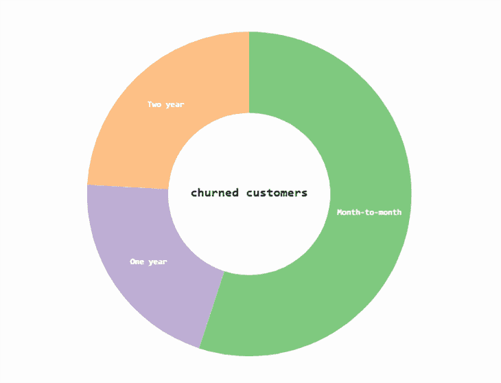
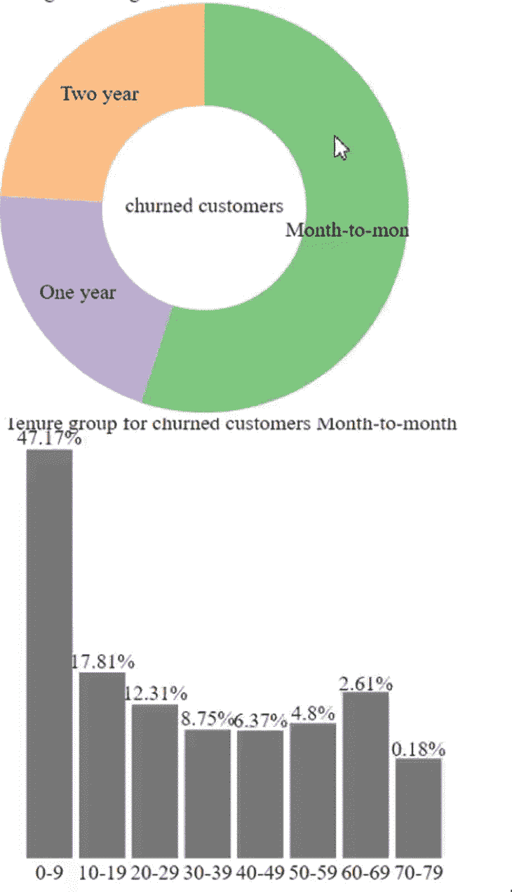
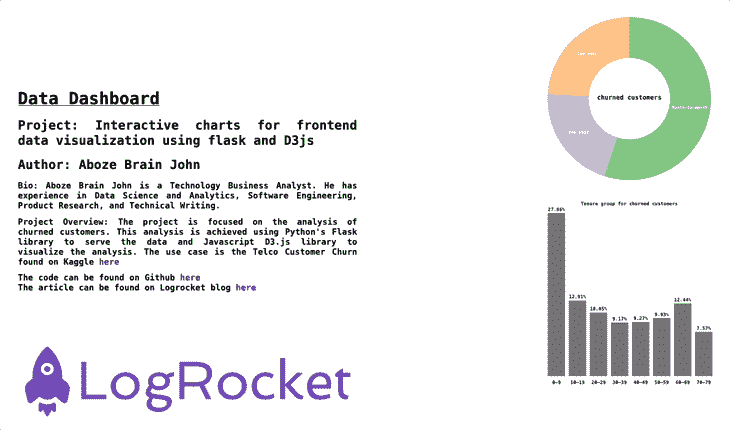

# 用 Flask 和 D3.js - LogRocket 博客构建交互式图表

> 原文：<https://blog.logrocket.com/build-interactive-charts-flask-d3js/>

多年来，数据分析对各个行业的影响越来越大，因为它已经成为公司决策的一个重要部分。数据分析技术可以揭示趋势、模式和指标，从而提供见解和优化。这就是为什么开发人员应该了解如何构建能够轻松实现数据可视化的程序。

[Flask](https://flask.palletsprojects.com/en/2.0.x/) 是一个 Python web 框架，它提供了构建 web 应用程序所需的工具、库和技术。 [D3.js](https://d3js.org/) 是一个 JavaScript 库，它使用数据操纵 DOM 元素来呈现可视化组件。

在本文中，使用 [Flask](https://blog.logrocket.com/build-deploy-flask-app-using-docker/) 和 D3.js，您将构建一个简单的交互式数据仪表板，它将帮助您了解与[假设客户流失率](https://www.kaggle.com/blastchar/telco-customer-churn)相关的一些因素。本文将具体介绍:

## 为什么 Flask 和 D3 要一起用？

与其他框架相比，Flask 和 D3 需要的开发时间最少。D3 为您提供了灵活性和对可视化的完全控制，允许您按照自己的意愿定制数据。您可以用 D3 创建的可视化数量几乎是无限的，并且受到您的创造力水平的限制。

Flask 最适合构建轻量级应用程序。当与在交互性方面非常快的 D3 结合时，整体用户体验可以是相当愉快的。它们都是开源项目，这意味着您可以在两个源代码的基础上构建，并向它们贡献您的特性。

尽管 D3 以其陡峭的学习曲线和对初学者不太友好而闻名，但是您对 HTML、CSS 和 SVG 的丰富知识应该足以让您开始学习 D3。

同样，Flask 是初学者友好的，你可以基于你的 Python 基础知识开发简单的 Flask web 应用程序。这两个框架都有一个庞大的开发人员社区，他们正在积极地改进这些库，并且如果需要的话，可能能够提供帮助。

## 项目设置和环境

有必要创建一个隔离的本地环境来指定只适用于这个项目的各种已安装的包和版本，以防止全局安装和包冲突。

### 项目工作流程概述

首先创建一个虚拟 Python 环境。

```
pip install virtualenv
```

导航到项目根文件夹并创建虚拟环境:

```
virtualenv flask

```

必须先激活虚拟环境，然后才能安装软件包。在项目根文件夹中，执行:

```
source flask/bin/activate

```

激活后，您的终端应该在括号中包含虚拟环境名称，如下所示:


使用以下命令从终端安装 Flask:

```
pip install Flask
```

安装 Pandas 库:

```
pip install pandas

```

安装 NumPy 库:

```
pip install numpy

```

运行以下命令来生成一个包含项目依赖关系的`requirements.txt`文件:

```
pip freeze > requirements.txt

```

`requirements.txt`文件至少应包含以下包:

*   `certifi==2021.10.8`
*   `click==8.0.3`
*   `Flask==2.0.2`
*   `itsdangerous==2.0.1`
*   `Jinja2==3.0.3`
*   `MarkupSafe==2.0.1`
*   `numpy==1.21.2`
*   `pandas==1.3.5`
*   `python-dateutil==2.8.2`
*   `pytz==2021.3`
*   `six==1.16.0`
*   `Werkzeug==2.0.2`

您的需求文件中生成的版本号可能与这里所写的不同，因为这取决于您正在构建的应用程序的类型以及您在构建应用程序时已经安装的包的版本。

如果您更愿意从 GitHub 存储库中的 [`requirements.txt`文件](https://github.com/codebrain001/Interactive-charts-for-frontend-data-visualization-using-flask-and-D3js/blob/main/requirements.txt)中获取这个项目的文件，那么在将存储库中的文件内容复制到您的项目中之后，运行以下命令:

```
pip install -r requirements.txt

```

成功安装所需的 Python 包后，可以继续设置项目文件结构和所需的文件，如下所示:

```
.
├── README.md
├── app.py
├── flask
├── requirements.txt
├── static
│   ├── css
│   ├── data
│   ├── js
│   └── logo.jpeg
└── templates
    └── index.html

```

Flask 应用程序接收客户流失数据，并使用 Python 执行[数据争论](https://en.wikipedia.org/wiki/Data_wrangling)操作，然后将格式化的数据发送到数据仪表板。这里， [D3.js](https://blog.logrocket.com/using-d3-js-v6-with-react/) 将使用 JavaScript 呈现各自的图表。

下面是我们刚刚构建的环境的图示:


## 剖析 Flask web 应用程序

Python 脚本是一个包含入口点、路由和端点的 Flask 实例。Python 的[熊猫](https://pandas.pydata.org/)和 [NumPy](https://numpy.org/) 库用于数据角力操作。预处理后的数据在提供给`index.html`文件之前被序列化为 JSON 格式。

该分析涵盖以下特征:

*   合同特性:合同特性描述客户与示例公司的合同条款，有三个类别:按月、一年和两年
*   任期特征:任期是一个连续的特征，描述了客户在公司呆的月数

在`data`文件夹中，创建一个`churn_data.csv`文件，并将这里的内容[添加到文件中。然后，将下面的代码片段添加到`app.py`文件中:](https://github.com/codebrain001/Interactive-charts-for-frontend-data-visualization-using-flask-and-D3js/blob/main/static/data/Churn_data.csv)

```
from flask import Flask, jsonify, render_template
import pandas as pd
import numpy as np

app = Flask(__name__)

#Reading data
data_df = pd.read_csv("static/data/churn_data.csv")
churn_df = data_df[(data_df['Churn']=="Yes").notnull()]

@app.route('/')
def index():
   return render_template('index.html')

def calculate_percentage(val, total):
   """Calculates the percentage of a value over a total"""
   percent = np.round((np.divide(val, total) * 100), 2)
   return percent

def data_creation(data, percent, class_labels, group=None):
   for index, item in enumerate(percent):
       data_instance = {}
       data_instance['category'] = class_labels[index]
       data_instance['value'] = item
       data_instance['group'] = group
       data.append(data_instance)

@app.route('/get_piechart_data')
def get_piechart_data():
   contract_labels = ['Month-to-month', 'One year', 'Two year']
   _ = churn_df.groupby('Contract').size().values
   class_percent = calculate_percentage(_, np.sum(_)) #Getting the value counts and total

   piechart_data= []
   data_creation(piechart_data, class_percent, contract_labels)
   return jsonify(piechart_data)

@app.route('/get_barchart_data')
def get_barchart_data():
   tenure_labels = ['0-9', '10-19', '20-29', '30-39', '40-49', '50-59', '60-69', '70-79']
   churn_df['tenure_group'] = pd.cut(churn_df.tenure, range(0, 81, 10), labels=tenure_labels)
   select_df = churn_df[['tenure_group','Contract']]
   contract_month = select_df[select_df['Contract']=='Month-to-month']
   contract_one = select_df[select_df['Contract']=='One year']
   contract_two =  select_df[select_df['Contract']=='Two year']
   _ = contract_month.groupby('tenure_group').size().values
   mon_percent = calculate_percentage(_, np.sum(_))
   _ = contract_one.groupby('tenure_group').size().values
   one_percent = calculate_percentage(_, np.sum(_))
   _ = contract_two.groupby('tenure_group').size().values
   two_percent = calculate_percentage(_, np.sum(_))
   _ = select_df.groupby('tenure_group').size().values
   all_percent = calculate_percentage(_, np.sum(_))

   barchart_data = []
   data_creation(barchart_data,all_percent, tenure_labels, "All")
   data_creation(barchart_data,mon_percent, tenure_labels, "Month-to-month")
   data_creation(barchart_data,one_percent, tenure_labels, "One year")
   data_creation(barchart_data,two_percent, tenure_labels, "Two year")
   return jsonify(barchart_data)

if __name__ == '__main__':
   app.run(debug=True)

```

## 创建 HTML 文件

`app.py`文件的入口点有一个用于数据仪表板布局的`index.html`模板文件。该模板由两个容器组成:编写部分和可视化部分。

将以下代码添加到`index.html`文件中:

```
<!DOCTYPE html>
<html lang="en">

 <head>
   <meta charset="utf-8">
   <meta name="viewport" content="width=device-width, initial-scale=1, shrink-to-fit=no">
   <meta name="description" content="Data Dashboard">
   <meta name="author" content="Aboze Brain">
   <meta http-equiv="content-type" content="text/html; charset=utf-8"/>
   <title>Data Dashboard</title>

 </head>
 <body>
       <div class="about">
         <h1>Data Dashboard</h1>
         <h2>Project: Interactive charts for frontend data visualization using flask and D3js</h2>
         <h2>Author: Aboze Brain John</h2>
         <p>Bio: Aboze Brain John is a Technology Business Analyst.
            He has experience in Data Science and Analytics, Software Engineering, Product Research, and Technical Writing.</p>
         <p>Project Overview: The project is focused on the analysis of churned customers.
           This analysis is achieved using Python's Flask library to serve the data and Javascript D3.js library to visualize the analysis.
           The use case is the Telco Customer Churn found on Kaggle <a href="https://www.kaggle.com/blastchar/telco-customer-churn">here</a>
         </p>
         <h4>The code can be found on Github <a href="https://github.com/codebrain001/Interactive-charts-for-frontend-data-visualization-using-flask-and-D3js">here</a></h4>
         <h4>The article can be found on Logrocket blog <a href="https://blog.logrocket.com/build-interactive-charts-flask-d3js/">here</a></h4>
       
       </div>

       <div class="visualization">
         <div id="pieChart"></div>
         <div id="barChart"></div>
       </div>

 </body>
</html>

```

此时，您可以使用下面的命令运行应用程序，并通过`localhost:5000`在浏览器上查看它:

```
python app.py

```


应用程序似乎只呈现 HTML 文件的文本内容，而没有图表。这是因为您还没有链接 JavaScript 脚本，这些脚本将从 Python 文件中获取数据并将其呈现在 HTML 文件上。

## 让图表互动

### 创建饼图函数



下面的`d3PieChart`函数接受两个参数:

*   `dataset` —包含饼图数据
*   `datasetBarChart` —选择饼图的一部分时更新条形图。这个函数将利用 [SVG 元素](https://en.wikipedia.org/wiki/Scalable_Vector_Graphics),因为它们提供不同的形状，并提供更多的灵活性和控制

在静态文件夹中创建一个`pieChart.js`文件，并将以下函数添加到该文件中:

```
function d3PieChart(dataset, datasetBarChart){
   // Set up SVG dimensions and properties
   const margin = {top:20, right:20, bottom:20, left:20};
   const width = 350 - margin.left - margin.right,
   height = 350 - margin.top - margin.bottom,
   outerRadius = Math.min(width, height) / 2,
   innerRadius = outerRadius * .5,
   color = d3.scaleOrdinal(d3.schemeAccent); //color scheme

   // Selecting the div with id pieChart on the index.html template file
   const visualization = d3.select('#pieChart')
       .append("svg")      //Injecting an SVG element
       .data([dataset])    //Binding the pie chart data
       .attr("width", width)
       .attr("height", height)
       .append("g")        //Grouping the various SVG components  
       .attr("transform", "translate(" + outerRadius + "," + outerRadius + ")"); //Piechart tranformation and transition upon page loading

   const data = d3.pie()   //Creating the data object that will develop the various segment of the pie chart.
       .sort(null)
       .value(function(d){return d.value;})(dataset);    // Retrieve the pie chart data values from our Flask app, the pie chart where tied to a 'value' key of a JSON object.

   // Generate an arc generator that produces the circular chart (outer circle)
   const arc = d3.arc()   
       .outerRadius(outerRadius)
       .innerRadius(0);

    // Generate an arc generator that produces the circular chart (inner circle)
   const innerArc = d3.arc()
       .innerRadius(innerRadius)
       .outerRadius(outerRadius);

   // Create pie chart slices based on the data object created
   const arcs = visualization.selectAll("g.slice")
       .data(data)                    
       .enter()    // creates the initial join of data to elements                      
       .append("svg:g")              
       .attr("class", "slice")
       .on("click", click);

   arcs.append("svg:path")     // create path element
       .attr("fill", function(d, i) { return color(i); } )     //Add color to slice
       .attr("d", arc)     // creates actual SVG path with associated data and the arc drawing function
       .append("svg:title")        // Add title to each piechart slice
       .text(function(d) { return d.data.category + ": " + d.data.value+"%"; });          

   d3.selectAll("g.slice")     // select slices in the group SVG element (pirchart)
       .selectAll("path")
       .transition()           //Set piechart transition on loading
       .duration(200)
       .delay(5)
       .attr("d", innerArc);

   arcs.filter(function(d) { return d.endAngle - d.startAngle > .1; })     //Define slice labels at certain angles
       .append("svg:text")     //Insert text area in SVG
       .attr("dy", "0.20em")      //shift along the y-axis on the position of text content
       .attr("text-anchor", "middle")      //Position slice labels
       .attr("transform", function(d) { return "translate(" + innerArc.centroid(d) + ")"; }) //Positioning upon transition and transform
       .text(function(d) { return d.data.category; }); // Append category name on slices

   visualization.append("svg:text") //Append the title of chart in the middle of the pie chart
       .attr("dy", ".20em")
       .attr("text-anchor", "middle")
       .text("churned customers")
       .attr("class","title");        

   // Function to update barchart when a piechart slice is clicked
   function click(d, i) {
       updateBarChart(d.data.category, color(i), datasetBarChart);
    }
}

```

### 创建条形图功能


`d3BarChart`函数定义了当页面被加载并且没有选择特定的契约类时，浏览器将呈现的默认组。默认组是被搅动客户的任期分布。`d3BarChart`只接受一个参数:提供的条形图数据。

在`static` 文件夹中，创建一个 `barChart.js`文件，并在文件中包含以下代码:

```
//Set up SVG dimensions and properties
const margin = {top: 20, right: 10, bottom: 20, left: 20},
width = 350 - margin.left - margin.right,
height = 350 - margin.top - margin.bottom,
barPadding = 5,
graph_misc = {ylabel: 4, xlabelH : 5, title:9};

// Setting the default group
const group = "All";

// Function to get the percentage values  for a specific selected group from the whole dataset.
function get_percentage(group, datasetBarChart){
   const _ = [];
   for (instance in datasetBarChart){
       if (datasetBarChart[instance].group==group){
           _.push(datasetBarChart[instance])
       }
   } return _;
};

function d3BarChart(datasetBarChart){
   defaultBarChart = get_percentage(group, datasetBarChart);

   const xScale = d3.scaleLinear()     // Barchart X axis scale
       .domain([0, defaultBarChart.length]) // Scale range from 0 to the length of data object
       .range([0, width]);

   const yScale = d3.scaleLinear() // Barchart y axis scale
       .domain([0, d3.max(defaultBarChart, function(d) { return d.value; })])    //Scale range from 0 to the maximum value of the default bar chart data
       .range([height, 0]);

   // // Selecting the div with id barChart on the index.html template file
   const bar = d3.select('#barChart')
       .append('svg')
       .attr('width', width + margin.left + margin.right)
       .attr('height', height + margin.top + margin.bottom)
       .attr('id', 'barChartPlot');

   //Adding barchart title
   bar.append('text')
       .attr('x', (width + margin.left + margin.right)/2)
       .attr('y', graph_misc.title)
       .attr('class','title')             
       .attr('text-anchor', 'middle')
       .text('Tenure group for churned customers');

   const visualization = bar.append('g')
       .attr("transform", "translate(" + margin.left + "," + (margin.top + graph_misc.ylabel) + ")");

   visualization.selectAll("rect")
       .data(defaultBarChart)
       .enter()
       .append("rect")
       .attr("x", function(d, i) {
           return xScale(i);
       })
       .attr("width", width / defaultBarChart.length - barPadding)  
       .attr("y", function(d) {
           return yScale(d.value);
       }) 
       .attr("height", function(d) {
           return height-yScale(d.value);
       })
       .attr("fill", "#757077");

   //Adding  barchart labels
   visualization.selectAll('text')
       .data(defaultBarChart)
       .enter()
       .append("text")
       .text(function(d) {
               return d.value+"%";
       })
       .attr("text-anchor", "middle")

       .attr("x", function(d, i) {
               return (i * (width / defaultBarChart.length)) + ((width / defaultBarChart.length - barPadding) / 2);
       })
       .attr("y", function(d) {
               return (yScale(d.value) - graph_misc.ylabel); //Setting the Y axis to represent the value in the served JSON data
       })
       .attr("class", "yAxis");

   const xLabels = bar
       .append("g")
       .attr("transform", "translate(" + margin.left + "," + (margin.top + height + graph_misc.xlabelH)  + ")");

   xLabels.selectAll("text.xAxis")
       .data(defaultBarChart)
       .enter()
       .append("text")
       .text(function(d) { return d.category;})
       .attr("text-anchor", "middle")
       .attr("x", function(d, i) {
           return (i * (width / defaultBarChart.length)) + ((width / defaultBarChart.length - barPadding) / 2);
       })
       .attr("y", 15)
       .attr("class", "xAxis");           
}

```

到目前为止，您已经成功地创建了默认条形图。要让图表完全发挥作用，只剩下一件事了:让图表具有交互性。

您将在`static`文件夹中创建的`updateBarChart.js`文件将允许您用饼图的任何切片的任何选择来更新条形图。这个文件将包含一个接受三个参数的`updateBarChart`函数:

1.  `group`–在饼图上选择的组
2.  `color`–饼图切片的颜色
3.  `datasetBarChart`–更新后的条形图数据

看一下函数:

```
function updateBarChart(group, color, datasetBarChart){
   const currentBarChart = get_percentage(group, datasetBarChart);

   //Defining chart scale, same as the default bar chart
   const xScale = d3.scaleLinear()
       .domain([0, currentBarChart.length])
       .range([0, width]);

   const yScale = d3.scaleLinear()
       .domain([0, d3.max(currentBarChart, function(d) { return d.value; })])
       .range([height,0]);

   const bar = d3.select('#barChart svg');  //Selecting the div containing bar chart ID and creating an SVG element

   // Add title to Barchart
   bar.selectAll("text.title")
       .attr("x", (width + margin.left + margin.right)/2)
       .attr("y", graph_misc.title)
       .attr("class","title")             
       .attr("text-anchor", "middle")
       .text("Tenure group for churned customers "+group);

   const visualization = d3.select('barChartPlot')
       .datum(currentBarChart);    //binding data to multiple SVG elements

   visualization.selectAll('rect')
       .data(currentBarChart)
       .transition()
       .duration(750)
       .attr('x',  (width + margin.left + margin.right)/2)
       .attr('y', graph_misc.title)
       .attr('class', 'title')
       .attr('text-anchor', 'middle')
       .text('Tenure group for churned customers '+group);

   const plot = d3.select('#barChartPlot')
       .datum(currentBarChart);        //binding data to multiple SVG elements

   plot.selectAll('rect')
       .data(currentBarChart)
       .transition()       //Setting bar chart change transition
       .duration(800)
       .attr('x', function(d,i){
           return xScale(i);
       })
       .attr('width', width/currentBarChart.length - barPadding)
       .attr('y', function(d){
           return yScale(d.value)
       })
       .attr("height", function(d) {
           return height-yScale(d.value);
       })
       .attr("fill", color);

   plot.selectAll("text.yAxis")
       .data(currentBarChart)
       .transition()
       .duration(750)
       .attr("text-anchor", "middle")
       .attr("x", function(d, i) {
           return (i * (width / currentBarChart.length)) + ((width / currentBarChart.length - barPadding) / 2);})
       .attr("y", function(d) {
           return yScale(d.value) - graph_misc.ylabel;})
       .text(function(d) {
       return d.value+'%';})
       .attr("class", "yAxis");
};

```

上面创建的 JavaScript 脚本使用带有各种函数的函数式编程范例来创建在名为`index.js`的中央文件中执行的组件。`index.js`文件使用[承诺](https://blog.logrocket.com/improve-async-programming-with-javascript-promises/)来处理异步操作，并对操作的最终完成(或失败)和结果值负责。

下面是`index.js file:`的代码片段

```
const urls = [pieChartDataUrl, barChartDataUrl];

Promise.all(urls.map(url => d3.json(url))).then(run);

function run(dataset) {
   d3PieChart(dataset[0], dataset[1]);
   d3BarChart(dataset[1]);
};

```

最后，在`index.html`文件的 body 标签中，添加下面的代码片段，将 JavaScript 文件链接到 HTML 文件:

```
 <script src="https://d3js.org/d3.v5.min.js"></script>
   <script>
       const pieChartDataUrl = "{{ url_for('get_piechart_data') }}";
       const barChartDataUrl = "{{ url_for('get_barchart_data') }}";
   </script>
   <script src="{{ url_for('static', filename='js/pieChart.js') }}"></script>
   <script src="{{ url_for('static', filename='js/barChart.js') }}"></script>
   <script src="{{ url_for('static', filename='js/updateBarChart.js') }}"></script>
   <script src="{{ url_for('static', filename='js/index.js') }}"></script>

```

HTML 文件包含脚本文件的访问点和将 D3.js 链接到项目的 CDN。这些脚本包括并执行以下功能:

*   `pieChart.js` —呈现饼图
*   `barChart.js` —呈现默认条形字符
*   `updateBarChart.js` —根据饼图的选择更新条形图
*   `index.js` —包括运行图表函数以在仪表板上呈现的主脚本

`index.html`模板还通过带有两个变量的路由 URL 获取 JSON 响应数据:`pieChartDataUrl`和`barChartDataUrl`。

在您的浏览器上刷新应用程序时，您的应用程序应该如下所示:



Our bar and pie charts, but interactive. The bar chart responds to clicks made on the pie chart

此时，您可以通过单击饼图的不同部分来与应用程序进行交互。注意条形图对每次点击的反应！

## 用 CSS 设计图表样式

尽管这个应用程序看起来功能齐全，但它仍然需要一些样式上的修饰。在`CSS`文件夹中创建一个`styles.css`静态文件，并将以下代码添加到该文件中，以设置应用程序的样式:

```
/* Reset default browser settings */

/* Box sizing rules */
*,
*::before,
*::after {
 box-sizing: border-box;
}

/* Remove default padding and margin */
* {
 padding: 0;
 margin: 0;
}

/* Set core body defaults */
body {
 position: fixed;
 display: flex;
 background: #fdfdfd;
 scroll-behavior: smooth;
 text-rendering: optimizeSpeed;
 font-family: "Roboto Mono", monospace;
 font-weight: bold;
 -webkit-font-smoothing: antialiased;
 overflow-x: hidden;
}

/* Make images easier to work with */
img {
 max-width: 100%;
 display: block;
}

.about {
   margin: 10% 2%;
   width: 40%;
   text-align: justify;

}
h1 {
   text-decoration: underline;
   margin: 0.5em 0em;
}

p, h2, h6 {
   margin: 0.7em 0em;
}

a {
   text-decoration: none;
}

.visualization {
   display: flex;
   align-items: center;
   flex-direction: column;
   width:60%;
}

#pieChart {
   margin-top: 4em;
   font-size: 12px;
}

#barChart {
   font-size: 9px;
   margin-top: 4em;
}

#pieChart .title, #barChart .title{
   font-weight: bold;
}

.slice {
   font-size: 8px;
    font-family: "Roboto Mono", monospace;
   fill: white;
   font-weight: bold;  
   cursor: pointer;
}

```

通过在 HTML 文件的 head 标签中添加下面的代码行，将`styles.css`文件链接到`index.html`文件:

`<link href="{{ url_for('static', filename='css/styles.css') }}" rel="stylesheet">`

下面是应用程序的最终输出:



## 结论

在本文中，您了解了如何使用 Flask 提供的和预处理的数据构建交互式图表仪表板。您操纵 DOM 元素在网页上用 D3.js 呈现可视化效果。

您可以使用这种技术来呈现条形图或饼图，并轻松地将数据可视化整合到您的下一个项目中。

这个项目在 [GitHub](https://github.com/codebrain001/Interactive-charts-for-frontend-data-visualization-using-flask-and-D3js) 上有完整版本。

## 使用 [LogRocket](https://lp.logrocket.com/blg/signup) 消除传统错误报告的干扰

[](https://lp.logrocket.com/blg/signup)

[LogRocket](https://lp.logrocket.com/blg/signup) 是一个数字体验分析解决方案，它可以保护您免受数百个假阳性错误警报的影响，只针对几个真正重要的项目。LogRocket 会告诉您应用程序中实际影响用户的最具影响力的 bug 和 UX 问题。

然后，使用具有深层技术遥测的会话重放来确切地查看用户看到了什么以及是什么导致了问题，就像你在他们身后看一样。

LogRocket 自动聚合客户端错误、JS 异常、前端性能指标和用户交互。然后 LogRocket 使用机器学习来告诉你哪些问题正在影响大多数用户，并提供你需要修复它的上下文。

关注重要的 bug—[今天就试试 LogRocket】。](https://lp.logrocket.com/blg/signup-issue-free)