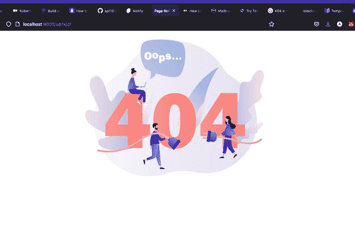

# 在 Go 和 Svelte 中构建内部错误通知系统

> 原文：<https://blog.logrocket.com/build-internal-error-notification-system-go-svelte/>

内部错误通知系统是任何大型系统的重要组成部分。它通过各种方式(如电子邮件、Slack 等)报告日志，帮助开发人员识别和修复系统中可能出现的问题。在本文中，我们将看看如何使用`notify`库在 Golang 中构建一个简单的内部错误通知系统。

Notify 是一个简单的 Go 库，用于向各种消息服务发送通知。它支持 Slack、email、Amazon SES、Amazon SNS、Bark、DingTalk、MailGrid、Discord、Reddit、Viber、Twilio 等等。

*向前跳跃*:

## Notify 和 Sentry 的比较

`notify`包提供了一个独立于平台的接口，用于向一个或多个消息服务发送消息。这对于触发某些操作或实现通知系统非常有用。

[Sentry](https://sentry.io/) 是一个基于云的错误跟踪平台，帮助开发人员跟踪和修复他们应用程序中的错误。它提供实时错误报告、警报和洞察，帮助开发人员尽快识别和修复错误。Sentry 支持多种语言和平台。

`notify`和 Sentry 的主要区别在于`notify`是一个用于向一个或多个消息服务发送通知的包，而 Sentry 是一个用于跟踪和修复应用程序中错误的平台。它们服务于不同的目的，不具有直接的可比性，但是围绕 Notify 构建一个系统使它更有能力作为一个工具来报告多个消息服务上的错误。

## 本教程的先决条件

要继续学习本教程，您需要安装以下软件:

## 设置我们的项目

为了利用 Notify 的强大功能，我们将构建一个简单的内部错误通知系统，它将能够:

*   记录错误并向电子邮件和 Slack 发送通知
*   显示显示通知日志列表的仪表板

该项目将在以下堆栈/框架中实现:

## 设置后端和服务

我们需要创建一个名为`alert.go`的文件来处理错误日志、发送通知和仪表板的 API 端点。

我们将从设置环境和安装包开始:

```
go mod init main

```

我们将使用 Golang 包管理器`go get`来安装[通知](https://github.com/nikoksr/notify):

```
go get -u github.com/nikoksr/notify

```

接下来，我们需要设置我们的服务。设置服务包括配置包以向各种外部服务发送通知，如电子邮件、Slack 等。

要通过电子邮件发送通知，您需要安装一个软件包:

```
go get github.com/jordan-wright/email

```

然后，配置 SMTP 服务器，并为包提供必要的凭据，如服务器地址、端口号和登录凭据:

```
email := NewMailService("[email protected]", "<host>:<port>")
email.AddReceivers("<email>")
email.AuthenticateSMTP("", "<username>", "<password>", "<host>")

```

要向 Slack 发送通知，您需要在 Slack 中创建一个 webhook，它将为您提供一个惟一的 URL，我们将需要这个 URL 来配置这个包。或者，您可以决定使用通知建议，它可以与以下内容一起安装:

```
go get github.com/slack-go/slack

```

然而，到目前为止，这个包包含了一个 bug。为了解决这个问题，我专门为此项目实施了一个解决方案:

```
func (s Slack) Send(ctx context.Context, subject, message string) error {
    data := map[string]string{
        "text": "```\n" + message + "\n```",
    }
    j, err := json.Marshal(data)
    if err != nil {
        log.Fatal(err)
    }
    url := "https://hooks.slack.com/services/..."
    resp, err := http.Post(url, "application/json", bytes.NewBuffer(j))
    if err != nil {
        return err
    }
    var res map[string]interface{}
    json.NewDecoder(resp.Body).Decode(&res)
    return nil
}

```

查看 Notify 支持的[外部服务列表。](https://github.com/nikoksr/notify/tree/main/service)

## 添加要通知的服务

在添加要通知的服务之前，必须实例化每个服务库，这将需要一个或多个 API 键或一些其他设置。可以使用`UseServices()`添加这些服务:

```
notify.UseService(slack, telegram, ...) 

slack := SlackService()
slack.AddReceiver("CHANNEL_ID")
notify.UseServices(slack, ...)

email := emailService()
email.AddReceivers("[email protected]")
notify.UseServices(email)

```

## 发送通知

添加服务后，Notify 将使用以下方式向外部服务发送消息:

```
err := notify.Send(
    context.Background(),
    "Demo App:: Attention required", // notification title
    message,
)
if err != nil {
    log.Fatal(err.Error())
}

```

## 记录器

`Logger`是一个处理向各种服务发送错误消息的功能。它还允许我们将消息记录到一个文件中，该文件随后通过一个端点提供给我们的仪表板:

```
func (l *Logger) Log(message string) {
    services := map[string]notify.Notifier{
        "email": mailService(),
        "slack": slackService(),
    }
    var wg sync.WaitGroup
    for _, v := range l.services {
        if _, ok := services[v]; !ok {
            continue
        }
        wg.Add(1)
        v := v
        go (func() {
            defer wg.Done()
            notify.UseServices(services[v])
            err := notify.Send(
                context.Background(),
                "Demo App:: Attention required",
                message,
            )
            if err != nil {
                log.Fatal(err.Error())
            }
            now := time.Now()
            logToFile(&LocalLog{
                ServiceName: v,
                Date:        now.Format(time.RFC3339),
                Environment: "production", // staging, dev, etc.
                Message:     message,
            })
        })()
    }
    wg.Wait()
}

func logToFile(payload *LocalLog) {
    f, err := os.OpenFile("local.log", os.O_APPEND|os.O_CREATE|os.O_WRONLY, 0644)
    if err != nil {
        log.Fatal(err)
    }
    res := fmt.Sprintf("[%v]::[%s]::[%s]:: %s", payload.ServiceName, payload.Environment, payload.Date, payload.Message)
    _, err = f.WriteString(res + "\n")
    if err != nil {
        log.Fatal(err)
    }
    f.Close()
}

```

端点是`alert.go`文件的一部分，它需要一个服务器。为了确保它与我们的测试环境服务器并发运行，我们将它包含在一个 goroutine 中。

下面的代码演示了端点处理程序如何从日志文件中读取数据流。请注意，文件记录器可以用其他形式的数据库代替，如 MongoDB、Firebase 等:

```
func (a *Alert) Server(port string) {
    e := echo.New()
    UseCors(e)
    e.GET("/logs", handleLogs)

    go func() {
        e.Logger.Fatal(e.Start(port))
    }()
}

```

## 在前端使用苗条和顺风 CSS

要设置前端的苗条，我们建议遵循[苗条网站](https://svelte.dev/)上的说明。Svelte 是一个强大而高效的 JavaScript 框架，使开发人员能够构建高性能的 web 应用程序。

为了增加趣味，我们将结合使用 Svelte 和一个流行的实用优先的 CSS 框架 Tailwind，来创建一个简单且响应迅速的仪表板。Tailwind 通过提供可轻松应用于组件的预设计 CSS 类，支持快速开发和原型制作:

```
<script lang="ts">
import TableList from "./components/TableList.svelte";
  import Tailwindcss from "./components/Tailwind.svelte";
  import Layout from "./components/Layout.svelte";
  import Modal from "./components/Modal.svelte";
  import Footer from "./components/Footer.svelte";
</script>
<main>
  <Tailwindcss />
  <Modal />
  <Layout>
  <TableList />
  </Layout>
  <Footer />
</main>

<table
    class="w-full border-collapse bg-white text-left text-sm text-gray-500"
  >
    <thead class="bg-gray-50">
      <tr>
        <th scope="col" class="px-6 py-4 font-medium text-gray-900">Service</th>
        <th scope="col" class="px-6 py-4 font-medium text-gray-900"
          >Environment</th
        >
        <!-- <th scope="col" class="px-6 py-4 font-medium text-gray-900">Status</th> -->
        <th scope="col" class="px-6 py-4 font-medium text-gray-900">Message</th>
        <th scope="col" class="px-6 py-4 font-medium text-gray-900">Date</th>
        <th scope="col" class="px-6 py-4 font-medium text-gray-900" />
      </tr>
    </thead>
    <tbody class="divide-y divide-gray-100 border-t border-gray-100">
      {#each $logs as log}
        <TableRow payload={log} />
      {/each}
    </tbody>
  </table>

```

下面是一个简单的仪表板 UI，它列出了从我们的测试环境服务器报告的错误:


## 设置测试环境

为了测试我们的项目及其集成，我们需要实现一个测试环境。

一个页面被创建并链接到`alert.Log()`，它也被添加到[回送库](http://echo.labstack.com/) `HTTPErrorHandler`。这使我们能够捕获并记录所有页面错误，然后将这些错误作为消息发送给可用的消息服务:

```
// integration
var alert = NewAlert()

func main() {
    alert.Server(":1323")
    alert.SetNotificationService("email", "slack", "telegram")

   e := echo.New()
    e.HTTPErrorHandler = CustomHTTPErrorHandler

    e.GET("/", func(c echo.Context) error {
    alert.Log(fmt.Sprintf("LOG:[%v] error occured here this is a sample for error logger", t))
        return c.String(http.StatusOK, "alert-notify is integerated with the endpoint !")
    })
    e.Logger.Fatal(e.Start(":9000"))
}

func CustomHTTPErrorHandler(err error, c echo.Context) {
    if er, ok := err.(*echo.HTTPError); ok {
        alert.Log(string(er.Error()))
        c.Logger().Error(err)
    }
}

```

下图显示了一个找不到的页面，导致了一个错误，需要使用 Notify 向我们的系统报告。为了实现这一点，我们使用 Echo 的`CustomHTTPErrorHandler(err error, c echo.Context)`函数，该函数捕获 HTTP 错误:



一旦系统报告了错误，定制的控制面板将显示相应的日志:


如果外部服务被适当地配置，我们应该看到我们的消息被传递🎉。

下面是 Slack 和 email ( [Mailtrap](http://mailtrap.io/) )的预览:


## 结论

使用 Go 构建内部错误通知系统可以为监控和处理应用程序中的错误提供一个强大而高效的解决方案。Go 处理并发和高性能网络的能力以及 Notify 使它成为系统后端的一个很好的选择。有了这个系统，您的开发团队将能够快速有效地识别和解决错误，提高应用程序的整体稳定性和可靠性。

查看该项目的 [GitHub 库](https://github.com/iamhabbeboy/notify-system)。

## 使用 [LogRocket](https://lp.logrocket.com/blg/signup) 消除传统错误报告的干扰

[](https://lp.logrocket.com/blg/signup)

[LogRocket](https://lp.logrocket.com/blg/signup) 是一个数字体验分析解决方案，它可以保护您免受数百个假阳性错误警报的影响，只针对几个真正重要的项目。LogRocket 会告诉您应用程序中实际影响用户的最具影响力的 bug 和 UX 问题。

然后，使用具有深层技术遥测的会话重放来确切地查看用户看到了什么以及是什么导致了问题，就像你在他们身后看一样。

LogRocket 自动聚合客户端错误、JS 异常、前端性能指标和用户交互。然后 LogRocket 使用机器学习来告诉你哪些问题正在影响大多数用户，并提供你需要修复它的上下文。

关注重要的 bug—[今天就试试 LogRocket】。](https://lp.logrocket.com/blg/signup-issue-free)