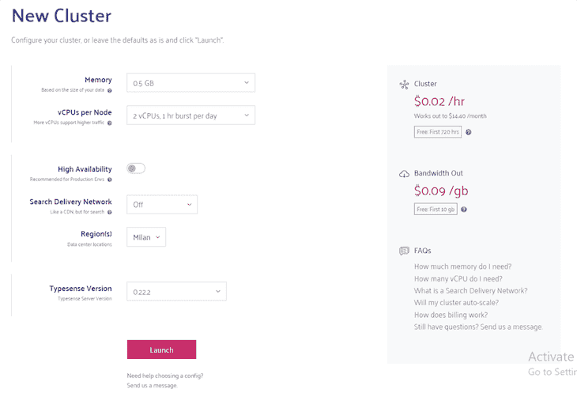
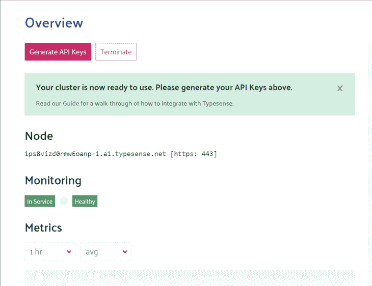
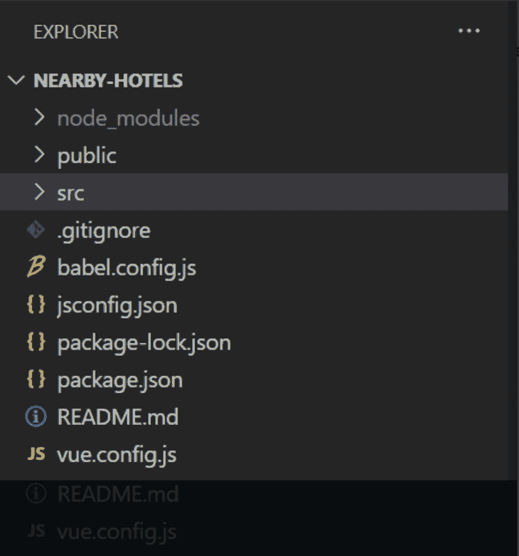
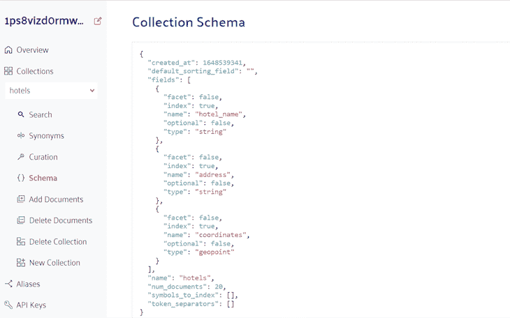
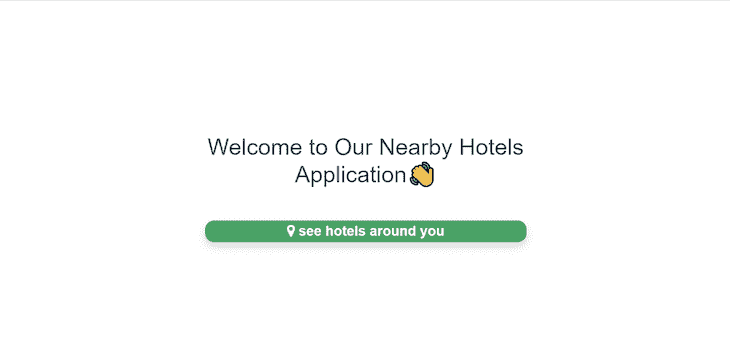
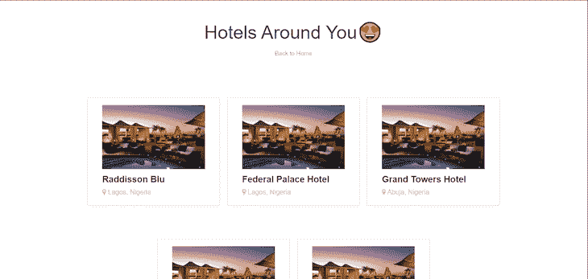

# 使用 Vue 和 Typesense - LogRocket Blog 构建位置感知应用程序

> 原文：<https://blog.logrocket.com/build-location-aware-application-vue-typesense/>

位置感知应用程序可以简化附近企业和服务的定位，在现代 web 开发中越来越常见。例如，想想像优步和 Airbnb 这样的热门应用。优步通过实施地理定位功能，将用户的位置与其数据库中所有司机的位置进行比较，从而将用户与最近的司机联系起来。

当在这些类型的应用程序中实现地理位置功能时，大部分工作在于对位置比较逻辑进行编码，该逻辑根据一些预定义的标准返回一组结果。例如，您可以返回一个距离用户当前位置最多 100 米的餐馆列表。

为了避免为这个位置比较编写定制逻辑，我们可以使用 [Typesense](https://typesense.org/) 。在本教程中，我们将直接学习如何使用 Typesense 并使其抽象位置比较任务。我们将构建一个简单的 near-hotels web 应用程序，列出离用户位置最近的酒店。我们开始吧！

## 什么是 Typesense？

Typesense 是一个搜索解决方案，允许您将搜索功能集成到项目中，而不必编写自己的自定义搜索逻辑。你基本上是在外包项目的那个部分。

例如，当您将代码部署到 Heroku 时，您允许第三方处理您的基础设施问题，而您则专注于编写代码。类似地，当您在项目中使用 Firebase 身份验证时，您再次允许外部代理处理您的整个身份验证逻辑，而您则专注于其他事情。

Typesense 使用类似的模型。当您将 Typesense 添加到项目中时，您允许 Typesense 在项目中实现搜索。尽管供用户提交查询的搜索栏或过滤器图标将存在于您的应用程序中，但 Typesense 会处理查询并返回所需的结果。

当第三方代表您实现项目的某些组件时，它主要被称为 X 即服务模型，其中 X 是被实现的组件。例如，Heroku 运行计算即服务模式，因为它代表您实施基础架构。Typesense 将搜索作为一种服务模型运行，提供了一种开箱即用的搜索解决方案，您可以将其插入到您的项目中。

其他搜索即服务产品包括 Algolia、Elasticsearch、Amazon Elasticsearch、Azure Search 等等。然而， [Typesense 提供了一系列无与伦比的特性](https://typesense.org/typesense-vs-algolia-vs-elasticsearch-vs-meilisearch/)。它是开源的、轻量级的、快速的、易于集成的。

## 构建附近的酒店 web 应用程序

### 先决条件

*   JavaScript 的基础知识
    *   使用 Vue 的体验
        *   本地安装的 Node.js
        *   安装了 Vue 和 Vue CLI
        *   你选择的任何 IDE。我将使用 VS 代码
        *   你可以在 GitHub 上找到本教程[的完整源代码。](https://github.com/Nyior/nearby-hotels-typesense)
        *   启动类型感知服务器

使用 Typesense 有两个步骤。首先，我们将创建一个集群，它本质上是 Typesense 上的空间，我们可以在这里存储和访问我们的数据。然后，我们将用户搜索的数据添加到第一步中配置的集群中，在我们的例子中，是一个酒店列表。

## 我们将创建一个集群，存储我们平台上所有可用酒店的列表。除了持久化我们的数据，我们的集群还允许我们通过 REST API 端点检索和更新我们的数据。

我们可以使用 Typesense 的官方 Docker 映像或者通过他们的云服务来启动我们的集群。在本指南中，我们将选择他们的云服务，因为在我看来，它更容易使用。

前往[类型感知云](https://cloud.typesense.org/)并使用 GitHub 登录。单击**启动**按钮来配置新的集群。使用群集的默认设置，如下图所示。启动集群可能需要一段时间，因此您可以放松下来，等待系统完成它的工作:



配置完成后，您应该会在屏幕上看到下图中显示的内容。单击顶部的**生成 API 密钥**按钮，这将下载一个文本文件，您需要将它保存在某个安全的地方:



我们稍后将需要生成的 API 密钥。至此，我们完成了 Typesense 服务器的构建。

设置我们的 Vue 开发环境

让我们初始化一个新的 Vue 项目。启动您系统的终端窗口，并导航到您希望在其中创建 Vue 项目的任何目录。在您的终端中运行命令`vue create nearby-hotels`。在该命令中，`nearby-hotels`是我们项目的名称，但是您可以根据需要将其更改为任何名称。

## 使用上面的命令，会提示您配置某些东西。继续选择默认值，并将 **Vue 路由器**添加到项目中。将为您生成一个具有下图所示结构的项目:



运行项目根目录下的命令`vue run serve`来启动 Vue 的开发服务器并进行测试。

用我们的酒店列表填充我们的 Typesense 服务器

既然我们已经有了 Typesense 集群和本地设置的项目，我们就可以向集群中添加我们需要的数据了。在搜索引擎方面，这一步叫做索引。我们将索引任务分成三个子任务:

*   连接到我们的 Typesense 服务器
    *   准备要上传的数据，在我们的例子中是酒店列表
        *   上传准备好的数据
        *   连接到我们的 Typesense 服务器
        *   为了与我们的 Typesense 服务器进行通信，我们需要用我们在上一步中下载的文本文件中的密钥创建一个 Typesense 客户机的实例。通过运行命令`npm i typesense`安装`typesense`包。然后，在项目的根目录下创建一个名为`typesense.js`的文件，并将以下内容添加到其中:

### 我们已经使用了我们的 Typesense 凭据来初始化 Typesense 客户端。因为我们导出了客户端，所以我们应该能够在项目中的任何文件中访问它。我们将使用此客户端连接到我们的 Typesense 服务器；它有所有 API 操作的方法。

准备要上传的数据

```
import 'dotenv/config';
import { Client } from 'typesense';

// Create a new client
const client = new Client({
        nodes: [
          {
                        host: "your typesense host here. starts with xxx.a1.typesense.net",
                        port: 443,
                        protocol: "https",
          },
        ],
        apiKey: "your typesense admin key here",
        connectionTimeoutSeconds: 2,
});
export default client;

```

在项目的根目录中创建一个`hotels.jsonl`文件，我们将在其中存储我们想要上传到 Typesense 服务器的酒店列表。将这个文件的内容复制到你新创建的文件中。不要编辑内容；照原样复制粘贴即可。

### 上传准备好的数据

为了将准备好的数据上传到我们的 Typesense 服务器，我们将使用一个脚本。转到项目的根目录，创建一个名为`indexer.js`的新文件，并添加以下代码:

### 在 Typesense 中，一组存储的数据称为集合。集合中的每个数据称为一个文档。在我们的例子中，我们有一个酒店集合，集合中的每个酒店都是一个文档。请注意，集合中的所有文档都遵循相同的结构，具有相同数量的字段和字段类型。为了加强这种约束，我们需要预先定义集合的结构。

我们将基于用`client.collections().create(hotelsSchema`定义的结构创建一个集合。接下来，我们从我们的`hotels.json`文件中读取每一行，并使用片段`client.collections('hotels').documents().create(hotelDocument);`基于我们的 Typesense 集合中该行的内容创建一个文档:

```
import * as fs from "fs";
import * as readline from "readline";

import client from "./typesense.js";

const hotelsSchema = {
  name: "hotels",
  fields: [
    { name: "hotel_name", type: "string" },
    { name: "address", type: "string" },
    { name: "coordinates", type: "geopoint" },
  ],
};
```

运行项目根目录中的命令`node indexer.js`来执行脚本。如果您的 CLI 中没有显示错误消息，则您的脚本已成功执行。要确认这一点，请登录你的 Typesense 仪表盘，点击导航栏上的**集群**。您应该会看到下面的屏幕:



```
client
  .collections()
  .create(hotelsSchema)
  .then(function () {
    readline
      .createInterface({
        input: fs.createReadStream("hotels.jsonl"),
        terminal: false,
      })
      .on("line", function (line) {
        let hotelDocument = JSON.parse(line);

        client.collections("hotels").documents().create(hotelDocument);
      });
  });

```

注意 Typesense 报告说我们的酒店集合中有 20 个文档，这是准确的。至此，我们完成了数据的索引。

构建界面

为了获得完整的工作 UI，我们将创建三个 Vue 组件:

*   `HomePage`:我们的索引页
    *   `Hotel`:用于将每个酒店渲染到 DOM 中
        *   `NearbyHotelsPage`:显示离用户最近的十家酒店列表。`Hotel`组件将被导入并在该组件中使用
        *   `HomePage`组件
        *   首先转到`public/index.html`并将下面的内容添加到`head`标签之间。不要覆盖`head`标签的内容:

### 我们从各自的 cdn 中导入 Bootstrap 4 和 Font Awesome 库。接下来，删除`src/views`中的所有文件，并在该目录中创建一个包含以下内容的`HomePage.vue`文件:

用以下内容覆盖`src/router/index.js`的内容:

```
<!-- Bootstrap CSS -->
<link
      crossorigin="anonymous"
      href="<https://stackpath.bootstrapcdn.com/bootstrap/4.1.1/css/bootstrap.min.css>"
      integrity="sha384-WskhaSGFgHYWDcbwN70/dfYBj47jz9qbsMId/iRN3ewGhXQFZCSftd1LZCfmhktB"
      rel="stylesheet"
 />

 <link
        rel="stylesheet"
        href="<https://use.fontawesome.com/3b7fb1f2e6.css>"
 />

```

用以下内容覆盖`src/App.vue`的内容:

```
<template>
  <div class="container-fluid">
    <div class="row text-center mt-5 mb-5 px-5">
      <div class="col-12 col-md-6 mr-md-auto ml-md-auto">
        <h1>Welcome to Our Nearby Hotels Application</h1>
      </div>
    </div>

    <div class="row text-left mt-5 px-5">
      <div class="col-12 col-md-6 mr-md-auto ml-md-auto">
        <button class="btn-block shadow text-center">
          <div class="text">
            <i class="fa fa-map-marker" aria-hidden="true"></i>
            view nearby hotels
          </div>
        </button>
      </div>
    </div>
  </div>
</template>

<style scoped>
button {
  background-color: #1da462;
  color: white !important;
  font-weight: bold;
  font-size: 1.5rem;
  color: white;
  border: none;
  border-radius: 1rem;
  cursor: pointer;
}
</style>

<script>
export default {
  name: "home-page",
};
</script>

```

现在，运行开发服务器，将浏览器指向`localhost:8080`。您应该会看到下图所示的页面:

```
import Vue from "vue";
import VueRouter from "vue-router";
import HomeView from "../views/HomePage.vue";

Vue.use(VueRouter);

const routes = [
  {
    path: "/",
    name: "home",
    component: HomeView,
  },
];

const router = new VueRouter({
  mode: "history",
  base: process.env.BASE_URL,
  routes,
});

export default router;

```



```
<template>
  <div id="app">
    <router-view />
  </div>
</template>

<style>
#app {
  font-family: Avenir, Helvetica, Arial, sans-serif;
  min-height: 100vh;
  display: flex;
  flex-direction: column;
  justify-content: center;
  align-items: center;
  color: #2c3e50;
}
</style>

```

这就是我们需要的`HomePage`组件。接下来，我们将处理我们的`Hotel`组件。

`Hotel`组件

首先，删除`src/components`中的所有文件，并在该目录下创建一个`Hotel.vue`文件，内容如下:

### 在这里下载[的图像，并移动到`src/assets`。我们在上面的代码中使用了图像。我们将在即将创建的`NearbyHotelsPage`组件中使用这个组件。](https://github.com/Nyior/nearby-hotels-typesense/blob/master/src/assets/hotel.jpg)

`NearbyHotelsPage`组件

```
<template>
  <div class="m-3">
    <div id="HotelImageBackground">
      
    </div>

    <div class="text-left mt-2">
      <div>
        <span id="hotelName">{{ hotel.hotel_name }}</span>
      </div>
      <div>
        <span id="address" class="mt-0">
          <i class="fa fa-map-marker" aria-hidden="true"></i>
          {{ hotel.address }}
        </span>
      </div>
    </div>
  </div>
</template>

<script>
export default {
  name: "hotel-single",

  props: {
    hotel: {
      type: Object,
      required: true,
    },
  },
};
</script>

<style scoped>
#address {
  font-weight: 400;
  font-size: 0.9rem;
  color: #bfc1c2;
}

#hotelName {
  font-size: 1.2rem;
  font-weight: bolder;
}

#hotelImageBackground {
  height: 300px;
  overflow: hidden;
  display: flex;
  justify-content: center;
  flex-flow: column;
  background-color: #dcdcdc;
}

@media only screen and (max-width: 640px) {
  #hotelName {
    font-size: 1rem;
    font-weight: bold;
  }
  #address {
    font-size: 0.8rem;
    font-weight: 400;
    color: #bfc1c2;
  }
}
</style>

```

在`src/views`中创建一个名为`NearbyHotelsPage.vue`的组件，内容如下:

### 让我们弄清楚上面组件中的一些东西:

在组件的`data()`部分，我们已经初始化了三个变量，`userLatitude`、`UserLongitude`和`hotels`。

```
<template>
  <div class="container">
    <div class="row text-center mt-5 mb-5 px-5">
      <div class="col-12 col-md-6 mr-md-auto ml-md-auto">
        <h1>Hotels Around You</h1>
        <small>
          <router-link to="/">Back to Home</router-link>
        </small>
      </div>
    </div>

    <div class="row" id="card-wrapper">
      <div
        class="col-md-3 col-12 border shadow-sm m-2"
        v-for="hotel in hotels"
        :key="hotel.document.id"
        id="card"
      >
        <Hotel :hotel="hotel.document" />
      </div>
    </div>
  </div>
</template>

<script>
import Hotel from "@/components/Hotel.vue";
import client from "../../typesense.js";

export default {
  name: "nearby-hotels",

  data() {
    return {
      hotels: [],

      // Lagos, Nigeria Coordinates
      userLatitude: 6.465422,
      userLongitude: 3.406448,

      // New York Coordinates
      // userLatitude: 40.71427,
      // userLongitude: -74.00597,
    };
  },

  components: {
    Hotel,
  },

  methods: {
    getHotels() {
      const searchParams = {
        q: "*",
        query_by: "hotel_name",
        filter_by: `coordinates:(${this.userLatitude}, ${this.userLongitude}, 1000 km)`,
        sort_by: `coordinates(${this.userLatitude}, ${this.userLongitude}):asc`,
      };

      client
        .collections("hotels")
        .documents()
        .search(searchParams)
        .then((results) => {
          console.log(`server response: ${results}`);
          this.hotels = results["hits"];
          console.log(`hotels: ${this.hotels}`);
        })
        .catch((error) => {
          console.log(error);
        });
    },
  },

  mounted() {
    this.getHotels();
  },
};
</script>

<style>
#card-wrapper {
  min-height: 50vh;
  display: flex;
  justify-content: center;
  align-items: center;
}
</style>

```

请记住，我们的目标是获得距离用户位置一定距离内的酒店列表。`userLatitude`和`userLongitude`变量指定用户的当前位置。

```
data() {
    return {
      hotels: [],

      // Lagos, Nigeria Coordinates
      userLatitude: 6.465422,
      userLongitude: 3.406448,

      // New York Coordinates
      // userLatitude: 40.71427,
      // userLongitude: -74.00597,
    };
  }

```

在生产场景中，我们不会对此进行硬编码。`hotels`数组是我们存储从 Typesense 检索到的酒店列表的地方:

我们在上面的`getHotels()`方法中声明了`searchParams`变量。我们将把`searchParams`传递给 Typesense，这是我们告诉 Typesense 我们的查询条件的方式。

例如，`SearchParams`中的`filter_by: coordinates:(${this.userLatitude}, ${this.userLongitude}, 1000 km)`告诉 Typesense 抓取距离传递的坐标`this.userLatitude and this.userLongitude`1000 公里以内的酒店。

```
const searchParams = {
        q: "*",
        query_by: "hotel_name",
        filter_by: `coordinates:(${this.userLatitude}, ${this.userLongitude}, 1000 km)`,
        sort_by: `coordinates(${this.userLatitude}, ${this.userLongitude}):asc`,
      };

```

过滤完成后，`searchParams`中传递的`sort_by: coordinates(${this.userLatitude}, ${this.userLongitude}):asc`告诉 Typesense 按照酒店与传递给 Typesense 的用户坐标的接近程度对过滤后的酒店列表进行排序:

在上面的代码片段中，我们实际调用了 Typesense 服务器，并将结果存储在我们最初声明的`hotels`变量中。

组件中的其他东西都是样式和 HTML。然而，我们需要注意的一件事是在下面的代码中:

```
client
        .collections("hotels")
        .documents()
        .search(searchParams)
        .then((results) => {
          console.log(`server response: ${results}`);
          this.hotels = results["hits"];
          console.log(`hotels: ${this.hotels}`);
        })
        .catch((error) => {
          console.log(error);
        });
    },

```

我们目前正在传递拉各斯坐标作为用户的位置。如果您使用`npm run serve`启动开发服务器，并导航到**nearly-hotels**页面，您应该会看到尼日利亚的酒店列表，从拉各斯的酒店开始，如下图所示:



```
// Lagos, Nigeria Coordinates
userLatitude: 6.465422,
userLongitude: 3.406448,

// New York Coordinates
// userLatitude: 40.71427,
// userLongitude: -74.00597,

```

相反，如果您通过注释掉第一组坐标来选择使用纽约坐标，那么您应该会看到美国的酒店从纽约的酒店开始，如下图所示:


现在，我们有了一个附近酒店的应用程序。耶！

现实世界应用的注意事项

我们在基本应用程序中做了一些我们不敢在人们实际使用的应用程序中做的事情。

## 我们肯定要改变的主要事情是我们如何处理用户的坐标。它目前是硬编码的，但理想情况下，我们会有一些自动检测和更新用户当前坐标的逻辑。

接下来，我们将有一个 UI，酒店所有者或系统管理员可以通过它向我们的 Typesense 服务器添加新酒店，而不是使用脚本来索引预定义的酒店列表。您可以选择直接将新酒店发布到 Typsense，或者您可以先将数据发送到您的后端，然后在 Typsense 上创建数据的副本。

最后，如前所述，我们需要将我们的密钥保存在一个`.env`文件中。

结论

在本指南中，我们解释了 Typesense 从根本上说是一个搜索即服务解决方案，以及搜索即服务意味着什么。然后，我们通过构建一个基本的附近酒店 web 应用程序来探索 Typesense 的地理定位特性。

## 目的是向您展示如何利用 Typesense 的地理定位功能来构建您的自定义的位置感知应用程序，而无需设置您自己的后端组件来处理所有与地理空间相关的逻辑。

这是我能给你的全部。如果你想与我分享你对这个教程的想法，或者只是简单地联系，你可以在 [GitHub](https://github.com/Nyior) 、 [LinkedIn](https://www.linkedin.com/in/nyior/) 或 [Twitter 上找到并关注我。](https://twitter.com/nyior_clement)

像用户一样体验您的 Vue 应用

调试 Vue.js 应用程序可能会很困难，尤其是当用户会话期间有几十个(如果不是几百个)突变时。如果您对监视和跟踪生产中所有用户的 Vue 突变感兴趣，

## .

LogRocket 就像是网络和移动应用程序的 DVR，记录你的 Vue 应用程序中发生的一切，包括网络请求、JavaScript 错误、性能问题等等。您可以汇总并报告问题发生时应用程序的状态，而不是猜测问题发生的原因。

[try LogRocket](https://lp.logrocket.com/blg/vue-signup)

LogRocket Vuex 插件将 Vuex 突变记录到 LogRocket 控制台，为您提供导致错误的环境，以及出现问题时应用程序的状态。

[](https://lp.logrocket.com/blg/vue-signup)[https://logrocket.com/signup/](https://lp.logrocket.com/blg/vue-signup)

现代化您调试 Vue 应用的方式- [开始免费监控](https://lp.logrocket.com/blg/vue-signup)。

The LogRocket Vuex plugin logs Vuex mutations to the LogRocket console, giving you context around what led to an error, and what state the application was in when an issue occurred.

Modernize how you debug your Vue apps - [Start monitoring for free](https://lp.logrocket.com/blg/vue-signup).