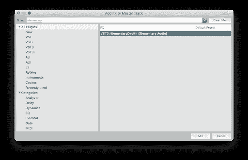
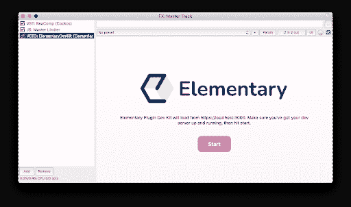
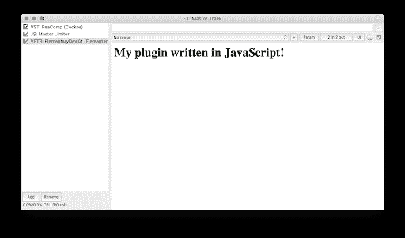
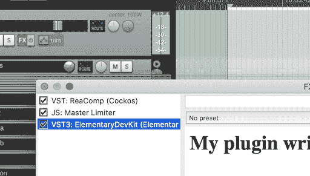

# 用 Elementary 构建一个原生音频插件

> 原文：<https://blog.logrocket.com/build-native-audio-plugin-elementary/>

作为一名音乐家，我在我的 DAW(数字音频工作站)里花了大量的时间。作为一名程序员，我经常想通过编写音频插件来改善我的音乐制作环境——这是所有主要制造商支持的扩展 DAW 的标准方式。

然而，对于像我这样的前端开发人员来说，进入门槛似乎总是太高。除了像 JUCE 这样的音频插件框架之外，还需要掌握 C++音频编程，这已经成为一种趋势。不再是了。向 Elementary 问好，这是一个用于音频编码的 JavaScript 框架。

一个 TL；在我们开始之前，剧透博士:初级课程完全满足了我的需求吗？在一个理想的世界中，我想编写并向其他 DAW 用户分发(阅读:收费)我的插件。这(还)不可能。但是，我是否设法让我的 JavaScript 代码在我首选的 DAW 中运行并做我想做的事情呢？你打赌！一图胜千言，下面截图。


如果你花时间在任何一个黎明，我希望这吊起你的胃口。所以让我们开始吧！

## 设置

首先，向[了解入门指南](https://www.elementary.audio/docs/#installation)。除了你需要进入私人回购市场，这几乎是你通常的业务，为此你需要注册一个免费账户。

您还需要通过运行 shell 脚本来安装一个名为`elementary`的命令行实用程序。这些说明对我不起作用(可能是临时的 SSL 证书问题):

```
$ curl -fsSL https://www.elementary.audio/install.sh | sh
$ curl: (60) SSL certificate problem: certificate has expired

```

然而，从 elementary.audio 中抓取`install.sh`或者从 GitHub 中抓取[并在本地运行应该就可以了。确保 CLI 安装成功:](https://github.com/nick-thompson/elementary/blob/v0.11.0/install.sh)

```
$ elementary -h

Usage: elementary [options] [node_options] file.js

    Run the given file with elementary.

```

此时，您已经准备好开始探索了。

## 三个渲染器

Elementary 可以在三种环境中运行代码(也称为 render ):在 Node 命令行中，在 WebAudio web 应用程序中，以及作为 DAW 插件运行。

让我们跳过 WebAudio 渲染器，因为它是最明显和不言自明的，尽管不应该被忽略。如果你像我一样，对 WebAudio 进行过任何数量的[挖掘，你就会知道这是一个非常低级的 API，你真的需要一个框架来省去你很多细节。](https://www.phpied.com/category/webaudio/)

在这方面，Elementary 是一个受欢迎的补充，因为它看起来可以对您的 DSP(数字信号处理)需求有很大帮助。

### 节点渲染器

节点渲染器是一种很好的方式，可以探索 Elementary 所提供的内容，并快速测试想法，而没有 UI 的负担，就在命令行上。我们就这么做吧。

## 探索初等的例子

Elementary 附带了一个公开的 GitHub repo 示例来帮助您入门。像这样抓住它们:

```
$ git clone https://github.com/nick-thompson/elementary.git
$ cd elementary/examples
$ npm i
$ ls           
00_HelloSine 04_Sampler   node_modules
01_FMArp     05_Grains    package-lock.json
02_BigSaw    06_Ratchet   package.json
03_Synth     07_DelayFX

```

现在，您已经准备好开始运行一些基本代码了。第一个(或者说第零个)例子是正弦波的演示:

```
$ elementary 00_HelloSine

```

调高音量(不要太大声)，你应该会听到一个温柔的正弦波。如果你看一下代码，你会发现它对一个 web 开发者来说非常熟悉。有一个`load`事件(像`window.onload`或`DOMContentLoaded`)，就是你决定接下来发生什么的时候:

```
core.on('load', function() {
  core.render(
    el.mul(0.3, el.cycle(440)),
    el.mul(0.3, el.cycle(441)),
  );
});

```

这里，`el`是一个基本库的音频处理工具包，`core`是三个渲染器中的一个——在本例中，是节点渲染器——您可以通过查看示例中的导入看到:

```
import {ElementaryNodeRenderer as core, el} from '@nick-thompson/elementary';

```

`render()`方法采用许多通道参数——在本例中是立体声的左和右通道，但它们可以是您的系统所支持的数量(例如，5.1 环绕声或 7.1 等等)。

在本例中，`el.cycle(440)`在左扬声器上产生 440Hz(音符 A)正弦波，在右扬声器上产生 441Hz(稍高于音符 A)正弦波。`el.mul()`将结果乘以 0.3，表示调低音量(增益)。弹奏这些值，看看会发生什么，例如，将 880 放在右声道，这是高出一个八度的另一个音符。

### Synth 示例

另一个有趣的例子是`03_Synth`。它接收一个 MIDI 信号并产生一个合成器声音。令人惊讶的是，即使您没有插入 MIDI 乐器，您也可以在节点控制台中测试这一点。你可以使用一个使用 WebMIDI 的[简单页面来发送 MIDI 信息，只要你用虚拟 MIDI 总线](https://www.onlinemusictools.com/webmiditest)负责路由信息。

### 粉红色的噪音制造者

好了，例子玩够了。让我们创造自己的东西:粉红噪声发生器。你不仅可以打开它睡觉，还可以用它来混合音乐。

有一个简单的混音技巧来帮助乐器的初始平衡:一次拿一个乐器，用粉红噪声来混音，直到你几乎听不到为止。

最后，你会得到所有乐器主观上的平衡。这是主观的，因为粉红噪声模仿人类的听觉，不像白噪声在音频频谱中是相等的噪声。TMI？没关系，让我们看看一些代码:

```
$ mkdir pink
$ touch pink/index.js
$ open pink/index.js

```

将此代码添加到`pink/index.js`:

```
import {ElementaryNodeRenderer as core, el} from '@nick-thompson/elementary';

core.on('load', function() {
  const pink = el.pink(el.noise());
  core.render(
    pink, pink
  );
});

core.initialize();

```

启动脚本并享受噪音:

```
$ elementary pink/index.js

```

很吵，不是吗？正如我们在上面看到的，你总是可以用`el.mul()`把它关小。

接下来，让我们在 DAW 中运行这段代码。在我的情况下，这是 Reaper，但 ProTools，Logic 和 Ableton 都应该工作得很好。

## 使用插件开发工具包进行设置

首先，需要多做一点设置。您可以[按照](https://www.elementary.audio/docs/targets/Plugin)的指示下载插件二进制文件，并将其复制到您的音频插件通常所在的位置，例如`~/Library/Audio/Plug-Ins/VST`。

接下来，您需要设置一个本地 web 服务器来服务您的插件。文档推荐`create-react-app`作为一个简单的选择，但是让我们忽略它，让一切更接近 DIY，而不引入太多更多的依赖。

### 一些坏消息

插件开发仍然是一项实验性的技术，并且存在局限性:它只能在 MacOS 上工作，并且需要一个本地 web 服务器来服务于一个选定的地址和端口(`127.0.0.1:3000`)。

这意味着你不能同时运行两个不同的插件，尽管你总是可以构建一个单独的插件来做一些你可以在插件 UI 中打开/关闭的事情。说到 UIs…

### 一些好消息

众所周知，C++的 UI 开发非常繁琐。像 JUCE 这样的框架有所帮助，但是没有什么比得上 web，在 web 上，我们可以使用或不使用 React 或 Vue 这样的 UI 框架来构建令人惊叹的东西。好消息是，你可以利用你的网络技能，用简单的插件来做你想做的所有 UI。

### 反应？Pffft。

现在，在我们开始音频编程之前，让我们先把插件加载到 DAW 中。不要用`create-react-app`，我们用一个简单的老`index.html`。你没听错:我们正在走老路，就像 web 开发一样简单。

创建一个新目录，并在其中放置一个`index.html`:

```
$ mkdir pinkplugin
$ touch pinkplugin/index.html
$ open pinkplugin/index.html

```

将这个简单的 HTML 添加到您的`index.html`:

```
<h1>My plugin written in JavaScript!</h1>

```

### 本地 web 服务器

现在，Elementary 需要从本地服务器加载这个`index.html`。利用 HTTPS 把事情复杂化。在当今时代，这可以通过正确的 npm 包轻松解决。用每周下载次数作为质量的代表，`[https-localhost](https://www.npmjs.com/package/https-localhost)`似乎符合要求。

更多使用[自制软件](https://brew.sh)和 NPM 的设置:

```
$ brew install nss
$ npm i -g --only=prod https-localhost

```

现在，我们已经准备好按照 Elementary 期望的方式启动服务器:

```
$ PORT=3000 HOST=127.0.0.1 serve pinkplugin 

Serving static path: pinkplugin
Server running on port 3000.

```

现在启动你的 DAW 并找到新的插件:



添加插件再次提醒您，Elementary 希望在哪里找到您的 web 代码:



您的服务器正在运行，您的插件已经加载，只需点击**开始**即可看到结果:



成功:您的 web web 代码运行在一个本地 DAW 插件中！现在让我们添加代码的音频部分。

### 粉红噪声插件

从一个`index.html`开始，你可以想多复杂就多简单。让我们简单地把音频代码内嵌在 HTML 中。方法如下:

```
<script type="module">
  import {ElementaryPluginRenderer as core, el} from './node_modules/@nick-thompson/elementary/dist/elementary.min.js';

  core.on('load', function() {
    const pink = el.pink(el.noise());
    core.render(
      pink, pink
    );
  });

  core.initialize();  
</script>
<h1>My plugin written in JavaScript!</h1>

```

您可以认出代码的音频部分，也就是现在熟悉的`core.on()`事件监听器。可能看起来很时髦的是`import`。因为这是 DIY HTML 代码，没有构建步骤，所以您需要将导入指向确切的文件。

幸运的是，这是一个单一的、预构建的、缩小的 JS 文件，您可以`npm install`或者直接从`examples`目录中复制。事实上，您可以保持简单，去掉整个`node_modules`目录结构，只复制`index.html`旁边的`elementary.min.js`，然后像这样导入:

```
import {ElementaryPluginRenderer as core, el} from './elementary.min.js';

```

请注意，我们现在使用`ElementaryPluginRenderer`而不是`ElementaryNodeRenderer`，因为我们是在一个插件中工作，而不是在节点 CLI 中。

现在要测试新代码，你需要移除插件并重新添加。唉，没有“重新加载”，但与在 JUCE 中编译 C++代码相比，这简直是小菜一碟。

这是我们的`index.html`粉红噪声原生音频插件的最终版本:

```
<script type="module">
  import {ElementaryPluginRenderer as core, el} from './elementary.min.js';
  core.on('load', function() {
    const pink = el.pink(el.noise());
    core.render(
      pink, pink
    );
  });
  core.initialize();  
</script>
<h1>My plugin written in JavaScript!</h1>

```

在这里，它是在行动中，添加到**主**轨道在收割者和制造相当大的粉红色噪音。同样，您可以使用`el.mul()`来降低代码中的增益，或者使用 Reaper 来降低增益。



在我们继续之前，还有一件事让你大吃一惊:右键单击插件，访问 Safari web developer 的全部调试功能。


### 频道翻转插件

这很有趣；在我们说再见之前，让我们创建另一个插件。

混音需要时间，而我们人类是适应性动物。曾经引起我们注意的东西后来被添加到背景处理中，我们就不再注意它了。

正如一位著名的混音师所说，“我们听得越多，听到的就越少。”换句话说，你可以习惯于你正在做的事情，过一段时间后可能会错过明显的事情。

应对这种现象的一个技巧是翻转左右声道，突然获得新的视角，尤其是在处理立体声扩展时(哪些乐器或声音更偏向右耳，哪些更偏向左耳)。人们在他们的监控装置上切换频道(如果他们有一个的话),或者回到老学校，背对着电脑屏幕。但是只要轻轻一点就能左右翻转不是很好吗？让我们用一个新的插件来做这件事。

建立一个新目录并复制`elementary.min.js`依赖关系:

```
$ mkdir flipp
$ cp pinkplugin/elementary.min.js flipp/
$ touch flipp/index.htm
$ open flipp/index.html

```

然后将代码添加到`index.html`:

```
​​<script type="module">
  import {ElementaryPluginRenderer as core, el} from './elementary.min.js';

  core.on('load', function() {
    core.render(
      el.in({channel: 1}),
      el.in({channel: 0})
    )
  });
  core.initialize();
</script>
<h1>My plugin written in JavaScript!</h1>

```

启动服务器:

```
$ PORT=3000 HOST=127.0.0.1 serve flipp

```

最后，添加插件。现在这两个通道被翻转了。简单地绕过你的 DAW 插件来恢复正常频道。

正如你可能猜到的，`el.in()`读取输入的音频。而`channel: 0`告诉它只读取一个通道。然后我们`render()`通道 0，其中 1 是预期的，反之亦然。简单但有效，而且确实有效。

## 离别赠言

Elementary 为我们这些 JavaScript 凡人提供了一种创建原生音频插件的方法，它是一个游戏改变者。就我个人而言，我怀念一些东西:

*   我很想能够将*惊人的*频道翻转插件打包，并把它送给(或甚至出售给)其他人，让他们把它作为一个常规的 VST 插件来安装，而不用麻烦本地网络服务器
*   我希望能够将插件命名为“Flipp ”,而不是“初级开发套件”
*   我希望插件是无用户界面的。没什么大不了的，因为用户界面不需要任何控件，可以只是一个标志
*   当然，它可以在任何地方运行，而不仅仅是 MacOS

但初级是一个相对较新的产品，正在积极开发中。我迫不及待地想知道接下来会发生什么。与此同时，我们可以深入了解它的 API，并为它所提供的所有 DSP 优点感到更加兴奋！

## 通过理解上下文，更容易地调试 JavaScript 错误

调试代码总是一项单调乏味的任务。但是你越了解自己的错误，就越容易改正。

LogRocket 让你以新的独特的方式理解这些错误。我们的前端监控解决方案跟踪用户与您的 JavaScript 前端的互动，让您能够准确找出导致错误的用户行为。

[](https://lp.logrocket.com/blg/javascript-signup)

LogRocket 记录控制台日志、页面加载时间、堆栈跟踪、慢速网络请求/响应(带有标题+正文)、浏览器元数据和自定义日志。理解您的 JavaScript 代码的影响从来没有这么简单过！

[Try it for free](https://lp.logrocket.com/blg/javascript-signup)

.