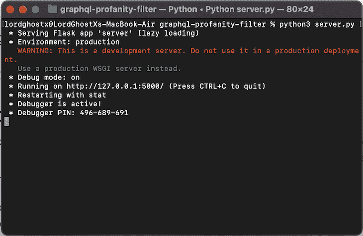

# 用 GraphQL 构建一个脏话过滤 API

> 原文：<https://blog.logrocket.com/build-profanity-filter-api-graphql/>

> 编者按:为了保持包容性和适合所有受众，本文中的亵渎示例用“亵渎”一词表示。

在构建用户发布(或交互)文本的应用程序时，检测和过滤脏话是您必然会遇到的任务。这些可以是社交媒体应用、评论区或游戏聊天室，仅举几例。

如果你的应用程序需要的话，拥有检测脏话以便过滤掉它的能力是保持交流空间安全和适合年龄的解决方案。

本教程将指导你用 Python 和 Flask 构建一个 GraphQL API 来检测和过滤亵渎。如果你只是对代码感兴趣，你可以访问这个 [GitHub repo](https://github.com/LordGhostX/graphql-profanity-filter) 获取演示应用程序源代码。

### 先决条件

要跟随并理解本教程，您需要以下内容:

*   计算机上安装的 Python 3.7 或更高版本
*   烧瓶的基本知识
*   GraphQL 的基础知识
*   文本编辑器

### 什么是亵渎？

亵渎(也称为诅咒语或脏话)是指冒犯、不礼貌或粗鲁地使用词语和语言。亵渎也有助于显示或表达对某事的强烈感情。脏话会让在线空间对用户产生敌意，这对于一个面向广泛受众的应用来说是不可取的。

哪些词被定义为亵渎由你决定。本教程将解释如何单独过滤单词，以便您可以控制应用程序中允许的语言类型。

### 什么是脏话过滤器？

亵渎过滤器是一种软件或应用程序，帮助检测、过滤或修改通信空间中被视为亵渎的词语。

### 为什么我们要检测和过滤脏话？

*   促进人与人之间的健康互动，尤其是当涉及到孩子的时候
*   通过为人们创造积极的交流环境来改善社交体验
*   为用户社区增加额外的安全层
*   从通信空间中自动阻止和过滤不想要的内容
*   为了减少在线社区中人工用户审核的需要

### 检测亵渎时面临的常见问题

*   用户可能会开始使用语言颠覆来避开过滤器
*   用户可能会开始操纵语言，用数字和 Unicode 字符替换字母，或者创造性地拼错单词以绕过过滤器
*   在过滤内容时，脏话过滤器可能无法考虑上下文
*   脏话过滤器在过滤时经常会产生误报，例如 [Scunthorpe 问题](https://en.wikipedia.org/wiki/Scunthorpe_problem)

## 用 Python 检测亵渎

使用 Python，让我们构建一个应用程序，告诉我们一个给定的字符串是否是亵渎的，然后继续过滤它。

### 创建一个基于单词列表的亵渎检测器

为了创建我们的亵渎过滤器，我们将创建一个不被接受的单词列表，然后检查给定的字符串是否包含它们中的任何一个。如果发现亵渎，我们将用审查文本替换亵渎的词。

创建一个名为`filter.py`的文件，并将以下代码保存在其中:

```
def filter_profanity(sentence):
    wordlist = ["profanity1", "profanity2", "profanity3", "profanity4", "profanity5", "profanity6", "profanity7", "profanity8"]

    sentence = sentence.lower()
    for word in sentence.split():
        if word in wordlist:
            sentence = sentence.replace(word, "****")

    return sentence

```

### 测试我们基于单词列表的过滤器

如果您要将以下参数传递给上面的函数:

```
filter_profanity("profane insult")
filter_profanity("this is a profane word")
filter_profanity("Don't use profane language")

```

您将得到以下结果:

```
******* ******
this is a ******* word
Don't use ******* language

```

然而，这种方法有许多问题，从不能检测单词列表之外的亵渎，到容易被拼写错误或单词填充愚弄。它还要求我们定期维护我们的单词表，这给我们已经存在的问题增加了许多问题。我们如何改善我们所拥有的？

## 使用更好的 Python 库来改进我们的过滤器

是一个速度惊人的 Python 库，用于检查(和清除)字符串中的亵渎。它支持自定义单词列表，安全列表，检测修改单词拼写中的亵渎，Unicode 字符(也称为 leetspeak)，甚至多语言亵渎检测。

### 安装更好的亵渎库

要开始使用 better-profanity，您必须首先通过`pip`安装这个库。

在终端中，键入:

```
pip install better-profanity

```

### 将更好的亵渎融入我们的过滤器

现在，用下面的代码更新`filter.py`文件:

```
from better_profanity import profanity

profanity.load_censor_words()

def filter_profanity(sentence):
    return profanity.censor(sentence)

```

### 测试更好的基于亵渎的过滤器

如果您要将以下参数再次传递给上面的函数:

```
filter_profanity("profane word")
filter_profanity("you are a profane word")
filter_profanity("Don't be profane")

```

您将得到如下预期的结果:

```
******* ****
you are a ******* ****
Don't be *******

```

正如我前面提到的，better-profanity 支持对修改的单词拼写进行亵渎检测，因此下面的例子将被准确地审查:

```
filter_profanity("pr0f4ne 1n5ult") # ******* ******
filter_profanity("you are Pr0F4N3") # you are *******

```

Better-profanity 还具有判断字符串是否亵渎的功能。为此，请使用:

```
profanity.contains_profanity("Pr0f4ni7y") # True
profanity.contains_profanity("hello world") # False

```

更好的亵渎也允许我们提供一个角色来审查亵渎。为此，请使用:

```
profanity.censor("profanity", "@") # @@@@
profanity.censor("you smell like profanity", "&") # you smell like &&&&

```

## 为我们的过滤器构建一个 GraphQL API

我们已经创建了一个 Python 脚本来检测和过滤脏话，但它在现实世界中几乎没有用，因为没有其他平台可以使用我们的服务。我们需要[用 Flask 为我们的脏话过滤器构建一个 GraphQL API](https://blog.logrocket.com/set-up-graphql-api-using-serverless-react/) ,这样我们就可以称之为一个实际的应用程序，并在 Python 环境之外的地方使用它。

### 安装应用程序要求

要开始，您必须首先通过`pip`安装几个库。

在终端中，键入:

```
pip install Flask Flask_GraphQL graphene

```

### 编写应用程序的 GraphQL 模式

接下来，让我们为 API 编写 GraphQL 模式。创建一个名为`schema.py`的文件，并将以下代码保存在其中:

```
import graphene
from better_profanity import profanity

class Result(graphene.ObjectType):
    sentence = graphene.String()
    is_profane = graphene.Boolean()
    censored_sentence = graphene.String()

class Query(graphene.ObjectType):
    detect_profanity = graphene.Field(Result, sentence=graphene.String(
        required=True), character=graphene.String(default_value="*"))

    def resolve_detect_profanity(self, info, sentence, character):
        is_profane = profanity.contains_profanity(sentence)
        censored_sentence = profanity.censor(sentence, character)
        return Result(
            sentence=sentence,
            is_profane=is_profane,
            censored_sentence=censored_sentence
        )

profanity.load_censor_words()
schema = graphene.Schema(query=Query)

```

### 为 GraphQL 配置我们的应用服务器

之后，创建另一个名为`server.py`的文件，并在其中保存以下代码:

```
from flask import Flask
from flask_graphql import GraphQLView
from schema import schema

app = Flask(__name__)
app.add_url_rule("/", view_func=GraphQLView.as_view("graphql",
                 schema=schema, graphiql=True))

if __name__ == "__main__":
    app.run(debug=True)

```

### 运行 GraphQL 服务器

要运行服务器，请执行`server.py`脚本。

在终端中，键入:

```
python server.py
```

您的终端应该如下所示:



### 测试 GraphQL API

在终端中运行完`server.py`文件后，打开浏览器，打开网址 [http://127.0.0.1:5000](http://127.0.0.1:5000) 。您应该可以访问 [GraphiQL](https://github.com/graphql/graphiql) 接口，并得到类似下图的响应:


我们可以通过在 GraphiQL 接口中运行如下查询来测试 API:

```
{
  detectProfanity(sentence: "profanity!") {
    sentence
    isProfane
    censoredSentence
  }
}

```

结果应该类似于下图:


# 结论

本文向我们介绍了亵渎检测、它的重要性以及它的实现。此外，我们看到了用 Python、Flask 和 GraphQL 构建亵渎检测 API 是多么容易。

GraphQL API 的源代码可以在 [GitHub](https://github.com/LordGhostX/graphql-profanity-filter) 上获得。你可以从它的[官方文档](https://pypi.org/project/better-profanity/)中了解更多关于 better-profanity Python 库的信息。

## 监控生产中失败和缓慢的 GraphQL 请求

虽然 GraphQL 有一些调试请求和响应的特性，但确保 GraphQL 可靠地为您的生产应用程序提供资源是一件比较困难的事情。如果您对确保对后端或第三方服务的网络请求成功感兴趣，

[try LogRocket](https://lp.logrocket.com/blg/graphql-signup)

.

[](https://lp.logrocket.com/blg/graphql-signup)[https://logrocket.com/signup/](https://lp.logrocket.com/blg/graphql-signup)

LogRocket 就像是网络和移动应用的 DVR，记录下你网站上发生的每一件事。您可以汇总并报告有问题的 GraphQL 请求，以快速了解根本原因，而不是猜测问题发生的原因。此外，您可以跟踪 Apollo 客户机状态并检查 GraphQL 查询的键值对。

LogRocket 检测您的应用程序以记录基线性能计时，如页面加载时间、到达第一个字节的时间、慢速网络请求，还记录 Redux、NgRx 和 Vuex 操作/状态。

[Start monitoring for free](https://lp.logrocket.com/blg/graphql-signup)

.