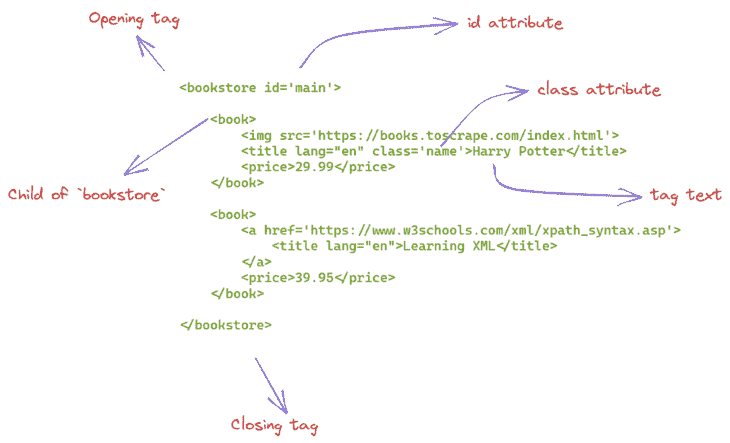
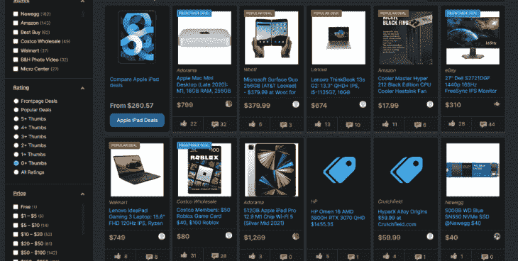
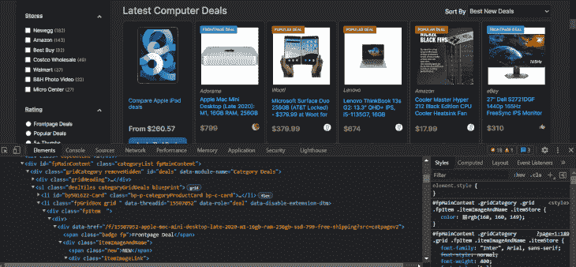
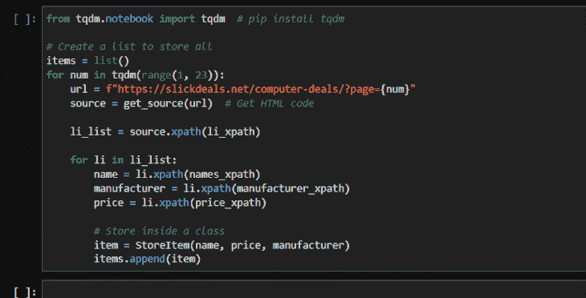

# 从头开始构建 Python 网络爬虫

> 原文：<https://blog.logrocket.com/build-python-web-crawler/>

既然已经有这么多数据了，为什么还有人想要收集更多的数据呢？尽管信息量大得惊人，但您经常会发现自己在寻找符合自己需求的数据。

例如，如果你想收集你最喜欢的篮球队或你最喜欢的冰淇淋口味的历史信息，你会怎么做？

企业数据收集在数据科学家的日常生活中至关重要，因为收集有关当今趋势的可操作数据的能力意味着可能的商业机会。

在本教程中，你将通过一个简单的在线商店学习网络爬行。

## HTML 解剖复习工具

让我们回顾一下基本的 HTML 结构。[互联网上几乎所有的网站](https://blog.logrocket.com/how-browser-rendering-works-behind-scenes/)都是使用 HTML 和 CSS 代码(包括 JavaScript，但我们在这里就不说了)的组合构建的。

下面是一个示例 HTML 代码，其中一些关键部分带有注释。



然而，网络上的 HTML 代码会比这复杂一些。仅仅查看代码并弄清楚它在做什么几乎是不可能的。因此，我们将从 XPath 语法开始，学习更复杂的工具来理解大量的 HTML 页面。

## 带有 lxml 的 XPath

web 抓取背后的整个想法是使用自动化从大量 HTML 标签及其属性中提取信息。在这个过程中使用的众多工具之一是 XPath。

XPath 代表 XML 路径语言。XPath 语法包含定位 HTML 标签和从它们的属性和文本中提取信息的直观规则。在本节中，我们将练习在上图中看到的 HTML 代码上使用 XPath:

```
sample_html = """
<bookstore id='main'>

   <book>
       
       <title lang="en" class='name'>Harry Potter</title>
       <price>29.99</price>
   </book>

   <book>
       <a href='https://www.w3schools.com/xml/xpath_syntax.asp'>
           <title lang="en">Learning XML</title>
       </a>
       <price>39.95</price>
   </book>

</bookstore>
"""
```

要开始使用 XPath 查询这个 HTML 代码，我们需要一个小的库:

```
pip install lxml
```

LXML 允许将 HTML 代码作为字符串读取，并使用 XPath 查询它。首先，我们将使用`fromstring` 函数将上面的字符串转换成 HTML 元素:

```
from lxml import html

source = html.fromstring(sample_html)

>>> source
<Element bookstore at 0x1e612a769a0>
>>> type(source)
lxml.html.HtmlElement
```

现在，让我们编写第一个 XPath 代码。我们将首先选择书店标签:

```
>>> source.xpath("//bookstore")
[<Element bookstore at 0x1e612a769a0>]
```

很简单！只需写一个双正斜杠后跟一个标签名，从 HTML 树的任何地方选择标签。我们也可以对图书标签进行同样的操作:

```
>>> source.xpath("//book")
[<Element book at 0x1e612afcb80>, <Element book at 0x1e612afcbd0>]
```

如您所见，我们得到了两个图书标签的列表。现在，让我们看看如何选择一个标签的直接子标签。例如，让我们选择 book 标签内的 title 标签:

```
>>> source.xpath("//book/title")
[<Element title at 0x1e6129dfa90>]
```

我们只有一个元素，那就是第一个 title 标签。我们没有选择第二个标签，因为它不是第二个 book 标签的直接子标签。但是我们可以用双斜杠代替单斜杠来选择两个标题标签:

```
>>> source.xpath("//book//title")
[<Element title at 0x1e6129dfa90>, <Element title at 0x1e612b0edb0>]
```

现在，让我们看看如何选择标签内的文本:

```
>>> source.xpath("//book/title[1]/text()")
['Harry Potter']
```

这里，我们选择第一个 title 标签中的文本。如您所见，我们还可以使用括号符号来指定我们想要的标题标签。要选择标签中的文本，只需在它后面加上一个正斜杠和一个`text()`函数。

最后，我们看看如何基于标签的属性来定位标签，比如`id`、`class`、`href,` 或`<>`中的任何其他属性。下面，我们将选择名称为 class 的 title 标记:

```
>>> source.xpath("//title[@class='name']")
[<Element title at 0x1e6129dfa90>]
```

正如所料，我们得到了一个元素。以下是使用属性选择其他标签的几个示例:

```
>>> source.xpath("//*[@id='main']")  # choose any element with id 'main'
[<Element bookstore at 0x1e612a769a0>]
>>> source.xpath("//title[@lang='en']")  # choose a title tag with 'lang' attribute of 'en'.
[<Element title at 0x1e6129dfa90>, <Element title at 0x1e612b0edb0>]
```

我建议你看看[这一页](https://www.w3schools.com/xml/xpath_syntax.asp)来了解更多关于 XPath 的知识。

## 创建一个类来存储数据

在本教程中，我们将抓取这个[在线商店的计算机部分](https://slickdeals.net/computer-deals/?page=1):



我们将提取每件物品的名称、制造商和价格。为了使事情变得简单，我们将创建一个具有这些属性的类:

```
class StoreItem:
   """
   A general class to store item data concisely.
   """

   def __init__(self, name, price, manufacturer):
       self.name = name
       self.price = price
       self.manufacturer = manufacturer
```

让我们手动初始化第一项:

```
item1 = StoreItem("Lenovo IdeaPad", 749, "Walmart")
```

## 获取页面源

现在，让我们进入正题。为了抓取网站，我们需要它的 HTML 源代码。实现这一点需要使用另一个库:

```
pip install requests
```

Requests 允许你向网站发送 HTTPS 请求，当然，也可以返回带有 HTML 代码的结果。就像调用它的 get 方法并传递网页地址一样简单:

```
import requests

HOME_PAGE = "https://slickdeals.net/computer-deals/?page=1"
>>> requests.get(HOME_PAGE)
<Response [200]>
```

如果响应带有一个`200`状态代码，则请求成功。为了获得 HTML 代码，我们使用内容属性:

```
r = requests.get(HOME_PAGE)

source = html.fromstring(r.content)

>>> source
<Element html at 0x1e612ba63b0>
```

上面，我们将结果转换成一个 LXML 兼容的对象。由于我们可能要重复这个过程几次，我们将把它转换成一个函数:

```
def get_source(page_url):
   """
   A function to download the page source of the given URL.
   """
   r = requests.get(page_url)
   source = html.fromstring(r.content)

   return source
source = get_source(HOME_PAGE)

>>> source
<Element html at 0x1e612d11770>
```

但是，这里有一个问题——任何网站都包含成千上万的 HTML 代码，这使得对代码的可视化探索变得不可能。出于这个原因，我们将求助于浏览器来找出哪些标签和属性包含了我们想要的信息。

加载页面后，右键单击页面上的任意位置并选择 **Inspect** 打开开发者工具:


使用**选择器箭头，**您可以将鼠标悬停在页面的各个部分上并单击，以找到光标下方的元素，并找出它们的相关属性和信息。它还将改变底部窗口，以移动到所选元素的位置。

正如我们所看到的，所有存储的条目都在`li`元素中，一个 class 属性包含单词`fpGridBox` grid。让我们使用 XPath 来选择它们:

```
source = get_source(HOME_PAGE)

li_list = source.xpath("//li[contains(@class, 'fpGridBox grid')]")
>>> len(li_list)
28
```

因为类名在变化，所以我们使用了在所有`li` 元素中通用的类名的一部分。因此，我们选择了 28 个`li`元素，您可以通过在网页上计数来仔细检查。

## 提取数据

现在，让我们开始从 `li`元素中提取商品细节。让我们首先来看看如何使用选择箭头找到项目的名称:



项目名位于类名包含`itemTitle`关键字的标签内。让我们用 XPath 来选择它们，以确保:

```
item_names = [
   li.xpath(".//a[@class='itemTitle bp-p-dealLink bp-c-link']") for li in li_list
]

>>> len(item_names)
28
```

不出所料，我们得到了 28 个商品名称。这一次，我们在`li`元素上使用链式 XPath，这要求语法以点开始。下面，我将使用浏览器工具为其他项目详细信息编写 XPath:

```
li_xpath = "//li[contains(@class, 'fpGridBox grid')]"  # Choose the `li` items

names_xpath = ".//a[@class='itemTitle bp-p-dealLink bp-c-link']/text()"
manufacturer_xpath = ".//*[contains(@class, 'itemStore bp-p-storeLink')]/text()"
price_xpath = ".//*[contains(@class, 'itemPrice')]/text()"
```

我们已经有了刮除页面上所有项目所需的一切。让我们循环进行:

```
li_list = source.xpath(li_xpath)

items = list()
for li in li_list:
   name = li.xpath(names_xpath)
   manufacturer = li.xpath(manufacturer_xpath)
   price = li.xpath(price_xpath)

   # Store inside a class
   item = StoreItem(name, price, manufacturer)
   items.append(item)
>>> len(items)
28
```

## 处理分页

我们现在在这一页上有所有的项目。然而，如果你向下滚动，你会看到**下一个**按钮，表明还有更多项目要刮。我们不想一个接一个地手动访问所有页面，因为页面可能有数百个。

但是如果你每次点击**下一个**按钮时都注意 URL:


页码在结尾会改变。现在，我已经检查了网站上有 22 页的项目。因此，我们将创建一个简单的循环来遍历分页并重复抓取过程:

```
from tqdm.notebook import tqdm  # pip install tqdm

# Create a list to store all
items = list()
for num in tqdm(range(1, 23)):
   url = f"https://slickdeals.net/computer-deals/?page={num}"
   source = get_source(url)  # Get HTML code

   li_list = source.xpath(li_xpath)

   for li in li_list:
       name = clean_text(li.xpath(names_xpath))
       manufacturer = clean_text(li.xpath(manufacturer_xpath))
       price = clean_text(li.xpath(price_xpath))

       # Store inside a class
       item = StoreItem(name, price, manufacturer)
       items.append(item)
```

我还使用了 [tqdm](https://tqdm.github.io/) 库，它在包围一个 iterable 时显示一个进度条:



让我们检查一下我们有多少物品:

```
>>> len(items)
588
```

588 台电脑！现在，让我们将这些项目存储到一个 CSV 文件中。

### 存储数据

为了存储数据，我们将使用[熊猫](https://pandas.pydata.org/docs/)库来创建一个`DataFrame`并将其保存到一个 CSV:

```
import pandas as pd

df = pd.DataFrame(
   {
       "name": [item.name for item in items],
       "price": [item.price for item in items],
       "manufacturer": [item.manufacturer for item in items],
   }
)

df.head()
```


这就对了。最后，让我们将它保存到一个文件中:

```
df.to_csv("data/scaped.csv", index=False)
```

## 结论

本教程是如何在 Python 中使用网络爬虫的简单例子。虽然掌握你今天学到的工具对于你的大部分抓取需求来说已经足够了，但是你可能还需要一些额外的工具来处理特别讨厌的网站。

具体来说，如果你不想学习 XPath 语法，我建议你学习一下 [BeautifulSoup](https://www.crummy.com/software/BeautifulSoup/bs4/doc/) ，因为 [BeautifulSoup 提供了一种查询 HTML 代码的 OOP 方法](https://blog.logrocket.com/build-python-web-scraper-beautiful-soup/)。

对于需要使用 JavaScript 动态登录或更改的网站，应该学习 Python 中最好的库之一， [Selenium](https://blog.logrocket.com/web-automation-selenium-python/) 。最后，对于企业网络抓取，有 [Scrapy](https://docs.scrapy.org/en/latest/) ，它几乎涵盖了网络抓取的每一个方面。感谢阅读！

## 使用 [LogRocket](https://lp.logrocket.com/blg/signup) 消除传统错误报告的干扰

[](https://lp.logrocket.com/blg/signup)

[LogRocket](https://lp.logrocket.com/blg/signup) 是一个数字体验分析解决方案，它可以保护您免受数百个假阳性错误警报的影响，只针对几个真正重要的项目。LogRocket 会告诉您应用程序中实际影响用户的最具影响力的 bug 和 UX 问题。

然后，使用具有深层技术遥测的会话重放来确切地查看用户看到了什么以及是什么导致了问题，就像你在他们身后看一样。

LogRocket 自动聚合客户端错误、JS 异常、前端性能指标和用户交互。然后 LogRocket 使用机器学习来告诉你哪些问题正在影响大多数用户，并提供你需要修复它的上下文。

关注重要的 bug—[今天就试试 LogRocket】。](https://lp.logrocket.com/blg/signup-issue-free)