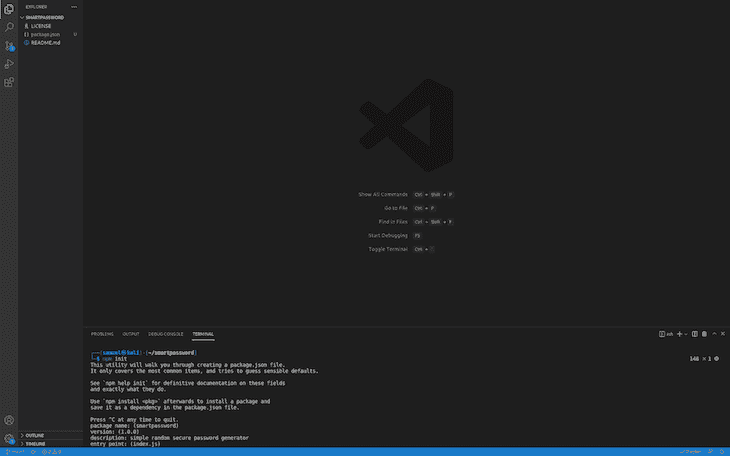

# 在 Node.js 中构建一个随机密码生成器

> 原文：<https://blog.logrocket.com/build-random-password-generator-node-js/>

随着黑客和网络钓鱼诈骗变得越来越先进，许多开发人员正在采取额外的预防措施来保护他们的用户。一个例子是实现随机密码生成器，它提示用户在注册网站或应用程序时选择完全随机的密码，从而减少黑客猜测或窃取登录凭据的机会。

在本文中，我们将构建自己的命令行 Node.js 随机密码生成器。我们的程序将生成一个指定长度和字符组成的随机密码。密码生成后，它将自动复制到您的剪贴板，这意味着它可以使用。我们还将回顾如何自动将生成的密码保存到文本文件中。

本教程对初学者非常友好，所以即使你是 Node.js 的新手，你也应该能够理解。我们将使用 [Commander.js](https://github.com/tj/commander.js) 包，它使我们的程序能够接受我们将输入命令行的不同命令。你还需要[剪贴板](https://github.com/sindresorhus/clipboardy)在密码生成后立即自动复制到你的剪贴板。

您可以在[资源库](https://github.com/thesmartcoder7/smartpassword)中找到本教程的完整代码。我们开始吧！

## 入门指南

首先，您需要创建一个空文件夹；你想叫它什么都可以。然后，用 VS 代码打开。

运行`npm init`创建一个`package.json`文件。包名将与文件夹名相同，对我来说是`smartpassword`。最后，我们将创建一个符号链接，使用以下名称的命令运行我们的程序:



### 安装依赖项

接下来，我们将安装项目所需的依赖项 Commander.js 和 clipboardy:

```
npm i commander clipboardy

```

从这里，只需创建主文件`index.js`，然后转到您的`package.json`文件。在`main: index.js`下，添加`type:module`。之后，使用以下代码将 Commander.js 导入到您的程序中:

```
import { Command } from "commander";

```

你可以获取`const program = new Command();`程序变量并在其上运行一些方法，包括版本号、描述、选项、所需命令等。当运行你的程序时，如果你使用`-h`或`–help`选项，你会看到不同的选项可用于你的程序。让我们继续为我们的应用程序添加一些选项。

## 添加选项

我们不会向您展示如何运行每一个选项，而是通过几个例子来让您大致了解一下。

### 添加一个`length`选项

首先，让我们从指定密码的`length`的选项开始。为此，您只需要以下代码:

```
program.option('-l, --length <number>', 'length of password', '8')

```

上面的命令创建了一个`length`选项。第一部分，`-l, --length <number>`负责选项的全称，`length`，别名，`l`，以及必需的变量，`number`。

第二部分`length of password`是选项的描述，而第三部分`8`是默认值，如果您不指定密码，它将作为密码长度传入。

当你控制台日志`program.opts()`时，程序会吐出一个长度属性为值`8`的对象。如果您运行带有选项`length <number>`的 Node.js index 命令，比如说`node index -l 12`，它将吐出一个带有值`12`的 length 属性的对象。`-l`是`–length`选项的别名，所以类似于`node index –length 12`。

### 添加一个`save`选项

要添加一个`save`选项，您将使用相同的语法，除了`save`不接受值。它更像一个布尔值，默认值为`false`。如果将它包含在运行命令中，那么`save`值将被保存为`true`:

```
program.option('-s, --save', 'save the password to secrets.txt')

```

### 添加`numbers`和`symbols`选项

现在，我们将添加选项，在您的随机密码中包含`numbers`和`symbols`。请记住，这些将是布尔值。也就是说，语法基本上是相同的，但是有一点小小的改动:

```
program.option("-nn , --no-numbers", "password to not include numbers")
program.option("-ns , --no-symbols", "password to not include symbols")

```

注意，在这两个命令中，`–no`部分是选项的前缀。任何布尔属性的默认值都是`false`，但是您希望您的密码默认包含这些属性，除非用户指定，对吗？`–no`部分反转布尔值，将其翻转到`true`。

这涵盖了程序所需的所有选项。请记住，在创建密码生成逻辑时，您将需要这些值。为此，您实际上需要析构该对象和值:

```
const { length, save, numbers, symbols } = program.opts()

```

到目前为止，您的文件应该类似于以下代码:

```
// initializing the project with the different options
program
    .version("1.0.0")
    .description("simple random secure password generator")
    .option("-l , --length <number>", "length of password", "8")
    .option("-s , --save", "save the password to secrets.txt")
    .option("-nn , --no-numbers", "password to not include numbers")
    .option("-ns , --no-symbols", "password to not include symbols")
    .parse();
const { length, save, numbers, symbols } = program.opts();

```

## 密码生成逻辑

一切都安排妥当后，让我们创建实际生成随机密码的函数。我的密码创建函数`createPassword`，将接受`length`、`numbers`和`symbols`作为函数中的参数:

```
const generatedPassword = createPassword(length, numbers, symbols)

```

现在，让我们为`numbers`、`symbols`和`characters`创建变量，供您在函数中使用:

```
const alpha = "abcdefghijklmnopqrstuvwxyzABCDEFGHIJKLMNOPQRSTUVWXYZ";
const integers = "0123456789";
const exCharacters = "[email protected]#$%^&*_-=+";
const createPassword = (length, hasNumbers, hasSymbols) => {
    let chars = alpha;
    if (hasNumbers) {
        chars += integers;
    }
    if (hasSymbols) {
        chars += exCharacters;
    }
    return generatePassword(length, chars);
};

```

如果你`console.log(generatedPassword)`，你会看到你有一个很长的密码，包括每个字符、符号和数字。您需要创建另一个函数，该函数使用`length`参数通过适当的随机化将密码分割成所需的长度。为此，我使用了以下代码片段:

```
const generatePassword = (length, chars) => {
    let password = "";
    for (let i = 0; i < length; i++) {
        password += chars.charAt(Math.floor(Math.random() * chars.length));
    }
    return password;
};

```

现在，如果您运行上面的代码，您将得到您想要的密码，无论是否指定了`length`、`randomization`、`numbers`和`characters`。

要将生成的密码复制到剪贴板，只需使用以下命令导入剪贴板:

```
import clipboard from "clipboardy";

```

生成密码后，添加以下代码:

```
clipboard.writeSync(generatedPassword);

```

要将密码保存到文件中，您可以在同一个文件中创建以下函数，如下所示:

```
const savePassword = (password) => {
    fs.open(path.join(__dirname, "/", "passwords.txt"), "a", 777, (e, id) => {
        fs.write(id, password + os.EOL, null, "utf-8", () => {
            fs.close(id, () => {
                console.log("Password saved!!");
            });
        });
    });
};

```

为了成功运行这个代码片段，您需要导入`fs`、`os`和`path`模块:

```
import os from "os";
import * as fs from "fs";
import * as path from "path";
import { dirname } from "path";
import { fileURLToPath } from "url";

```

剩下唯一要做的就是创建一个符号链接。我们需要再次编辑`package.json`文件。在`"main":"index.js"`的正下方，加上`"preferGlobal": true`，再加上`"bin":"/index.js"`。

在`index.js`文件中，在现有代码上方添加以下命令:

```
#!/usr/bin/env node

```

您应该看到您可以在没有 Node.js 的情况下启动您的项目。您只需要键入您的项目名称和您可以使用的不同选项。您的最终代码应该类似于以下内容:

```
#!/usr/bin/env node
import clipboard from "clipboardy";
import { Command } from "commander";
import os from "os";
import * as fs from "fs";
import * as path from "path";
import { dirname } from "path";
import { fileURLToPath } from "url";
const program = new Command();
const __dirname = dirname(fileURLToPath(import.meta.url));

// initializing the project with the different options
program
    .version("1.0.0")
    .description("simple random secure password generator")
    .option("-l , --length <number>", "length of password", "8")
    .option("-s , --save", "save the password to secrets.txt")
    .option("-nn , --no-numbers", "password to not include numbers")
    .option("-ns , --no-symbols", "password to not include symbols")
    .parse();

// this function creates the password default
const { length, save, numbers, symbols } = program.opts();
const alpha = "abcdefghijklmnopqrstuvwxyzABCDEFGHIJKLMNOPQRSTUVWXYZ";
const integers = "0123456789";
const exCharacters = "[email protected]#$%^&*_-=+";
const createPassword = (length, hasNumbers, hasSymbols) => {
    let chars = alpha;
    if (hasNumbers) {
        chars += integers;
    }
    if (hasSymbols) {
        chars += exCharacters;
    }
    return generatePassword(length, chars);
};

// this function formats our password to however you need
const generatePassword = (length, chars) => {
    let password = "";
    for (let i = 0; i < length; i++) {
        password += chars.charAt(Math.floor(Math.random() * chars.length));
    }
    return password;
};

// this function saves the password if you have used the -save option.
const savePassword = (password) => {
    fs.open(path.join(__dirname, "/", "passwords.txt"), "a", 777, (e, id) => {
        fs.write(id, password + os.EOL, null, "utf-8", () => {
            fs.close(id, () => {
                console.log("Password saved!!");
            });
        });
    });
};

// getitng the generated password.
const generatedPassword = createPassword(length, numbers, symbols);
if (save) {
    savePassword(generatedPassword);
}

//this functions copies your code to your clipborad  ready for use
clipboard.writeSync(generatedPassword);

console.log(generatedPassword);

```

## 结论

就像这样，你已经建立了自己的，安全的，随机的密码生成器。我希望这篇文章对您有所帮助，您可以自己尝试一下。

随意分叉[库](https://github.com/thesmartcoder7/smartpassword)并在其上构建。我建议增加一个功能，将你的密码保存在数据库中，或者甚至让程序通过电子邮件发送你的密码。如果你有你认为有用的改进，请随时联系我进行合作，如果你有任何问题，请留下评论。

## 200 只显示器出现故障，生产中网络请求缓慢

部署基于节点的 web 应用程序或网站是容易的部分。确保您的节点实例继续为您的应用程序提供资源是事情变得更加困难的地方。如果您对确保对后端或第三方服务的请求成功感兴趣，

[try LogRocket](https://lp.logrocket.com/blg/node-signup)

.

[](https://lp.logrocket.com/blg/node-signup)[https://logrocket.com/signup/](https://lp.logrocket.com/blg/node-signup)

LogRocket 就像是网络和移动应用程序的 DVR，记录下用户与你的应用程序交互时发生的一切。您可以汇总并报告有问题的网络请求，以快速了解根本原因，而不是猜测问题发生的原因。

LogRocket 检测您的应用程序以记录基线性能计时，如页面加载时间、到达第一个字节的时间、慢速网络请求，还记录 Redux、NgRx 和 Vuex 操作/状态。

[Start monitoring for free](https://lp.logrocket.com/blg/node-signup)

.