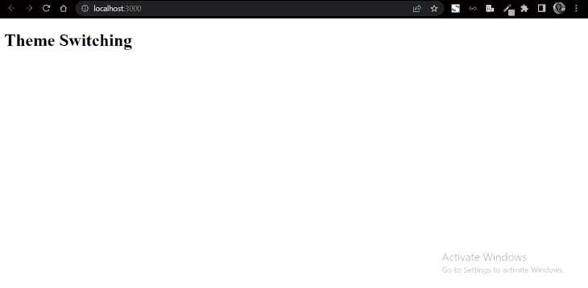
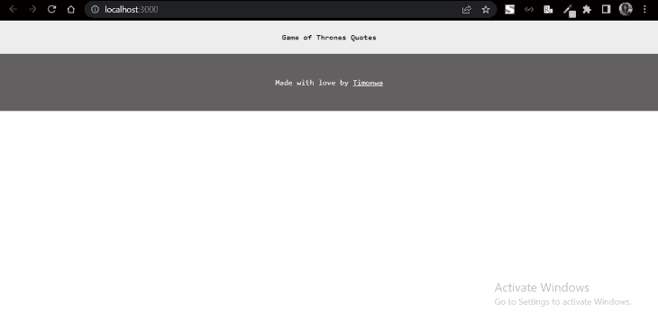
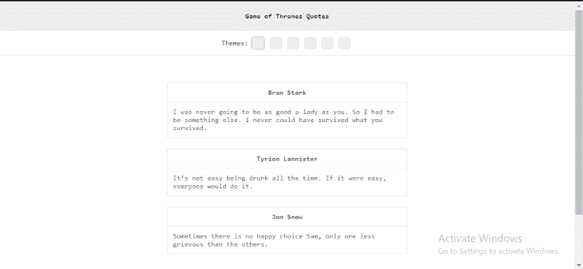
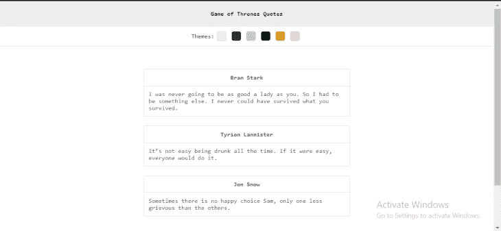
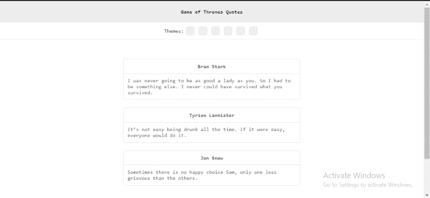
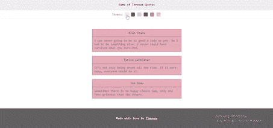
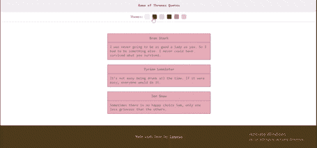

# 用 styled-components 构建一个 React 主题切换器应用程序

> 原文：<https://blog.logrocket.com/build-react-theme-switcher-app-styled-components/>

使用[风格组件](https://styled-components.com)中可用的包装器组件`ThemeProvider`，我们可以在 React 中快速设置多个自定义主题，并轻松地在它们之间切换。

为了演示这一点，我们将构建一个 React 应用程序，引用《权力的游戏》中的热门角色的话。本教程将展示如何为应用程序创建样式组件和多个主题，通过单击按钮更改主题，以及将主题保存在本地存储中。

*向前跳跃*:

## 为什么使用风格化组件进行主题切换

在我们进入教程之前，让我们来看看使用样式化组件进行主题切换的一些原因:

*   完全主题化支持:`ThemeProvider`包装器组件允许我们将主题传递给渲染树中它下面的所有 React 组件
*   效率:styled-components 使用 React Context API，它提供了一个主题上下文，我们可以将主题作为道具传递给它，允许在每个组件中动态访问它——甚至是那些深度嵌套的组件
*   灵活性:在 styled-components 中创建的任何主题都可以使用`withTheme`高阶组件在其他 React 组件中访问

查看[样式组件高级文档页面](https://styled-components.com/docs/advanced)了解更多信息。

## 先决条件

*   JavaScript 和 CSS 的工作知识
*   熟悉在 React 中创建和使用组件和钩子
*   您选择的代码编辑器

我们开始吧！

## 设置 React 应用程序

在构建我们的应用程序之前，我们首先需要设置一个能够让我们快速开发 React 应用程序的环境。

通过运行以下命令开始:

```
npx create-react-app theme-switching
```

在上面的代码片段中，`theme-switching`是应用程序和文件夹的名称。

接下来，cd 进入应用程序:

```
cd theme-switching
```

现在，在代码编辑器中打开该文件夹。

接下来，通过 npm 或 Yarn 安装`styled-components`依赖项，以允许在应用程序中使用`styled-components`。

```
# with npm
npm install --save styled-components

# with yarn
yarn add styled-components
```

此时，我们可以通过删除任何不需要的文件来清理应用程序。

或者，我们可以替换`App.js`文件中的代码，就像这样:

```
import React from 'react';

function App() {
  return (
    <div className="App">
      <h1>Theme Switching</h1>
   </div>
  );
}

export default App;
```

替换代码后，运行以下命令之一在浏览器中查看应用程序:

```
# with npm
npm start

# with yarn
yarn start
```

这可能需要一点时间来运行；完成后，启动浏览器并导航至`[http://localhost:3000](http://localhost:3000)`。

该应用程序应该如下所示:



现在，让我们创建样式化的组件。

## 创建样式化组件

对于本教程，我们将构建一个包含以下组件的简单单页 web 应用程序:

*   页眉
*   页脚
*   卡片上写着热门*权力的游戏*人物的话
*   主题栏，带有用于选择主题偏好设置的按钮

首先，在`src`文件夹中，我们将创建一个`components`文件夹。在`components`文件夹中，我们将创建一个 s `tyles`文件夹来存放我们的样式组件。

接下来，我们将使用关键字`styled-components`、`createGlobalStyle`将`GlobalStyles`添加到应用程序中。

在`styles`文件夹中，创建一个`Global.js`文件，并添加以下内容:

```
Global.js
```

```
import { createGlobalStyle } from "styled-components";

export const GlobalStyles = createGlobalStyle`
*,
*::before,
*::after {
  margin: 0;
  padding: 0;
  box-sizing: border-box;
}

body {
  background-color: hsl(0, 0%, 100%);
  color: hsl(0, 1%, 16%);
  font-family: monospace;
  overflow-x: hidden;
}
`
```

这段代码对应用程序中的所有元素进行了简单的重置，并为`body`元素添加了一些样式。

接下来，我们将为头文件`Header.styled.js`创建一个`styled-component`文件。通过在组件文件的命名约定中包含`.styled`,我们将能够容易地从常规的 React 组件中识别出样式化的组件。

现在，我们将从`styled-components`导入`styled`，并添加以下内容；

```
Header.styled.js
```

```
import styled from "styled-components";

export const Header = styled.header`
  background-color: hsl(0, 0%, 93%);
  padding: 20px;
  text-align: center;
  font-weight: bold;
`;
```

### 创建页脚组件

现在，我们将为页脚创建一个`styled-component`文件，步骤与创建页眉的步骤相同。

```
Footer.styled.js
```

```
import styled from "styled-components";

export const Footer = styled.footer`
  background-color: hsl(0, 1%, 38%);
  padding: 40px 20px;
  text-align: center;
  color: hsl(0, 0%, 100%);

  a {
    color: hsl(0, 0%, 100%);
  }
`;
```

现在，让我们回到 App.js 文件，导入`GlobalStyles`、`Header`和`Footer`样式的组件:

```
App.js
```

```
import React from 'react';
import { GlobalStyles } from "./components/styles/Global";
import { Header } from "./components/styles/Header.styled";
import { Footer } from "./components/styles/Footer.styled";

function App() {
  return (
    <div className="App">
      <GlobalStyles />
      <Header>Game of Thrones Quotes</Header>

      <Footer>
          <p>
            Made with love by <a href="http://bio.link/timonwa">Timonwa</a>
          </p>
        </Footer>
    </div>
  );
}

export default App;

```

当然，你可以把页脚的内容改成你的名字或者别的。

保存代码并刷新浏览器后，应用程序应该如下所示:



### 创建卡片组件

接下来，我们将在`styles`文件夹中为卡片`Cards.styled.js`创建一个`styled-component`文件。让我们添加以下代码:

```
Cards.styled.js
```

```
import styled from "styled-components";

export const CardsContainer = styled.section`
  margin: 50px;
`;

export const Card = styled.div`
  background-color: hsl(60, 40%, 100%);
  border: 1px solid hsl(0, 0%, 87%);
  margin-left: auto;
  margin-right: auto;
  margin-bottom: 20px;
  border-radius: 3px;
  max-width: 450px;
`;

export const CardTitle = styled.div`
  color: hsl(0, 1%, 38%);
  border-bottom: 1px solid hsl(0, 0%, 87%);
  text-align: center;
  padding: 10px;
  font-weight: bold;
`;

export const CardBody = styled.div`
  color: hsl(0, 1%, 38%);
  padding: 10px;
`;
```

在上面的代码中，我们创建了一个`CardContainer`样式的组件，它将存放各个卡片。我们还创建了一个`Card`样式的组件，以及将在卡片中显示的卡片`Title`和卡片`Body`样式的组件。

### 创建报价组件

现在，让我们在`components`文件夹中创建一个`Quotes` React 组件。我们将把`Card`组件导入到`Quotes.js`文件中，并为`Quotes`创建卡片。

```
Quotes.js
```

```
import React from "react";
import {
  CardsContainer,
  Card,
  CardTitle,
  CardBody,
} from "./styles/Cards.styled";

const Quotes = () => {
  return (
    <CardsContainer>
      <Card>
        <CardTitle>Bran Stark</CardTitle>
        <CardBody>
          <p>
            I was never going to be as good a lady as you. So I had to be
            something else. I never could have survived what you survived.
          </p>
        </CardBody>
      </Card>

      <Card>
        <CardTitle>Tyrion Lannister</CardTitle>
        <CardBody>
          <p>
            It's not easy being drunk all the time. If it were easy, everyone
            would do it.
          </p>
        </CardBody>
      </Card>

      <Card>
        <CardTitle>Jon Snow</CardTitle>
        <CardBody>
          <p>
            Sometimes there is no happy choice Sam, only one less grievous than
            the others.
          </p>
        </CardBody>
      </Card>
    </CardsContainer>
  )
};

export default Quotes;
```

现在，我们将把`Quotes` React 组件导入到`App.js`文件中，以便我们可以在浏览器中查看它:

```
App.js
```

```
import React from 'react';
import { GlobalStyles } from "./components/styles/Global";
import { Header } from "./components/styles/Header.styled";
import { Footer } from "./components/styles/Footer.styled";
import Quotes from "./components/Quotes";

function App() {
  return (
    <div className="App">
      <GlobalStyles />
      <Header>Game of Thrones Quotes</Header>

      <Quotes />

      <Footer>
          <p>
            Made with love by <a href="http://bio.link/timonwa">Timonwa</a>
          </p>
        </Footer>
     </div>
  );
}

export default App;
```

应用程序现在应该看起来像这样:


### 创建按钮

到目前为止，我们已经为应用程序创建了组件并添加了内容。现在，让我们为主题创建按钮和一个容纳按钮的容器。

在`styles`文件夹中，我们将创建一个`ThemeSwitching.styled.js`文件并包含以下内容:

```
ThemeSwitching.styled.js
```

```
import styled from "styled-components";

export const ThemeContainer = styled.div`
  background-color: hsl(0, 0%, 100%);
  display: flex;
  flex-wrap: wrap;
  justify-content: center;
  align-items: center;
  padding: 10px;
  border-bottom: 1px solid hsl(0, 0%, 87%);
`;

export const ThemeButton = styled.button`
  margin: 0 5px;
  padding: 10px;
  font-size: 0.5rem;
  border: 1px solid hsl(0, 0%, 87%);
  border-radius: 5px;
  width: 20px;
  height: 20px;
  cursor: pointer;
  &:hover {
    box-shadow: 2px 2px 2px hsl(0, 0%, 87%);
`;
```

在上面的代码中，我们创建了一个包含所有主题按钮的`ThemeContainer`样式组件和一个用于单独主题按钮的`ThemeButton`样式组件。

我们还为按钮添加了一个`hover`状态。当用户悬停在一个按钮上时，它会显示一个`box-shadow`效果。

现在，让我们通过将以下内容添加到`App.js`文件的顶部以及其他导入来导入这些样式更改:

```
App.js
```

```
import {
  ThemeContainer,
  ThemeButton,
} from "./components/styles/ThemeSwitching.styled";
```

在同一个文件中，我们还将在`Header` styled-component 和`Quotes` React component 之间添加以下代码片段:

```
App.js
```

```
<ThemeContainer>
  <span>Themes: </span>
  <ThemeButton className="light active"></ThemeButton>
  <ThemeButton className="dark"></ThemeButton>
  <ThemeButton className="blue"></ThemeButton>
  <ThemeButton className="green"></ThemeButton>
  <ThemeButton className="brown"></ThemeButton>
  <ThemeButton className="pink"></ThemeButton>
</ThemeContainer>
```

此时，所有主题按钮都具有相同的外观:



让我们为主题按钮添加不同的背景颜色来代表不同的主题。

我们将把以下代码添加到`Global.js`文件中:

```
Global.js
```

```
// theme buttons color
.light {
  background-color: hsl(0, 0%, 93%);
}
.dark {
  background-color: hsl(0, 0%, 20%);
}
.blue {
  background-color: hsl(195, 53%, 79%);
}
.green {
  background-color: hsl(150, 80%, 15%);
}
.brown {
  background-color: hsl(39, 70%, 50%);
}
.pink {
  background-color: hsl(350, 100%, 88%);
}

// active theme
.active{
    border: 3px solid hsl(0, 0%, 87%);
    }
```

现在，如下图所示，每个按钮都有不同的颜色来对应它的主题。灯光主题(当前主题)有一个浅灰色的背景和一个不同于其他按钮的边框。这是因为我们使用了`active` `className`来为当前主题指定一个实心的`border`。在本教程的后面，我们将对按钮应用功能点击，以便在按钮被切换时将`active` `className`添加到所选主题的按钮上。



现在让我们创建主题。

## 创建多个主题

到目前为止，我们已经为六个主题创建了按钮。每个按钮的背景颜色对应一个主题。浅色主题按钮为白色，深色主题按钮为黑色，其他主题按钮颜色与相应的主题名称相匹配:蓝色、绿色、棕色和粉色。

现在，是时候实际创建主题了。

在`styles`文件夹中，我们创建一个`Theme.styled.js`文件并添加以下内容:

```
Theme.styled.js
```

```
export const light = {
  name: "light-theme",
  colors: {
    header: "hsl(0, 0%, 93%)",
    background: "hsl(0, 0%, 100%)",
    footer: "hsl(0, 1%, 38%)",
    text: "hsl(0, 1%, 16%)",
    quoteBgc: "hsl(60, 40%, 100%)",
    quoteTitle: "hsl(0, 1%, 38%)",
    quoteBody: "hsl(0, 1%, 38%);",
    quoteBorder: "hsl(0, 0%, 87%)",
    border: "hsl(0, 0%, 87%)",
  },
};

export const dark = {
  name: "dark-theme",
  colors: {
    header: "hsl(0, 0%, 20%)",
    background: "hsl(0, 1%, 16%)",
    footer: "hsl(0, 0%, 93%)",
    text: "hsl(0, 0%, 100%)",
    quoteBgc: "hsl(0, 0%, 35%)",
    quoteTitle: "hsl(0, 0%, 100%)",
    quoteBody: "hsl(0, 0%, 100%)",
    quoteBorder: "hsl(0, 0%, 59%)",
    border: "hsl(0, 0%, 78%)",
  },
};

export const blue = {
  name: "blue-theme",
  colors: {
    header: "hsl(195, 53%, 79%)",
    background: "hsl(194, 100%, 97%)",
    footer: "hsl(195, 52%, 28%)",
    text: "hsl(0, 1%, 16%)",
    quoteBgc: "hsl(0, 0%, 100%)",
    quoteTitle: "hsl(195, 52%, 28%)",
    quoteBody: "hsl(0, 0%, 38%)",
    quoteBorder: "hsl(0, 0%, 87%)",
    border: "hsl(0, 0%, 87%)",
  },
};

export const green = {
  name: "green-theme",
  colors: {
    header: "hsl(150, 80%, 15%)",
    background: "hsl(150, 80%, 20%)",
    footer: "hsl(150, 80%, 80%)",
    text: "hsl(150, 80%, 80%);",
    quoteBgc: "hsl(150, 60%, 60%)",
    quoteTitle: "hsl(130, 90%, 10%)",
    quoteBody: "hsl(130, 70%, 10%)",
    quoteBorder: "hsl(130, 80%, 20%)",
    border: "hsl(170, 100%, 60%)",
  },
};

export const brown = {
  name: "brown-theme",
  colors: {
    header: "hsl(39, 70%, 50%)",
    background: "hsl(37, 83%, 54%)",
    footer: "hsl(39, 50%, 20%)",
    text: "hsl(100, 0%, 20%)",
    quoteBgc: "hsl(50, 100%, 70%)",
    quoteTitle: "hsl(37, 23%, 24%)",
    quoteBody: "hsl(30, 23%, 24%)",
    quoteBorder: "hsl(50, 50%, 50%)",
    border: "rgb(224, 189, 33)",
  },
};

export const pink = {
  name: "pink-theme",
  colors: {
    header: "hsl(350, 100%, 88%)",
    background: "hsl(300, 80%, 88%)",
    footer: "hsl(300, 10%, 28%)",
    text: "hsl(300, 100%, 28%)",
    quoteBgc: "hsl(350, 50%, 78%)",
    quoteTitle: "hsl(300, 50%, 28%)",
    quoteBody: "hsl(320, 20%, 28%)",
    quoteBorder: "hsl(300, 50%, 28%)",
    border: "hsl(300, 50%, 58%)",
  },
};
```

在上面的代码中，我们创建了六个不同的主题对象，并根据主题的颜色给每个对象命名。我们导出对象的方式与导出其他样式组件的方式相同。

现在我们已经创建了主题，让我们使用`ThemeProvider`将它们添加到应用程序中。

## 使用`ThemeProvider`添加主题

通过 React Context API 向包装器中的每个组件提供我们的主题。我们将使用`ThemeProvider`来启用主题切换。

首先，让我们导入`ThemeProvider` ，然后将主题从`Theme.styled.js`文件导入到`App.js`文件中。

```
App.js
```

```
import { ThemeProvider } from "styled-components";
import {
  light,
  dark,
  blue,
  green,
  brown,
  pink,
} from "./components/styles/Theme.styled";
```

现在我们已经导入了主题，让我们用`ThemeProvider`组件包装应用程序的组件。我们还将传递一个`theme`道具到`ThemeProvider`组件中。

这个`theme` prop 将分配给它的任何主题对象向下传递给应用程序中由`ThemeProvider`包装的每个组件和元素，允许它们访问主题对象中存在的每个属性。

现在，我们把`light`主题对象作为道具传递下去。

```
App.js
```

```
function App() {
  return (
    <ThemeProvider theme={light}>
      <div className="App">
    <GlobalStyles />
      <Header>Game of Thrones Quotes</Header>

      <ThemeContainer>
        <span>Themes: </span>
        <ThemeButton className="light active"></ThemeButton>
        <ThemeButton className="dark"></ThemeButton>
        <ThemeButton className="blue"></ThemeButton>
        <ThemeButton className="green"></ThemeButton>
        <ThemeButton className="brown"></ThemeButton>
        <ThemeButton className="pink"></ThemeButton>
       </ThemeContainer>

      <Quotes />

      <Footer>
          <p>
            Made with love by <a href="http://bio.link/timonwa">Timonwa</a>
          </p>
        </Footer>
     </div>
     </ThemeProvider>
  );
}
```

现在，我们将进入每个样式化的组件，并重构代码以访问主题的颜色属性，主题当前设置为 light theme。

我们将首先导入`Theme.styled`组件；我将在本教程的稍后部分解释原因。

```
Global.js
```

```
import * as theme from "./Theme.styled";
```

```
Global.styled.js
```

```
body {
  background-color: ${({ theme }) => theme.colors.background};
  color: ${({ theme }) => theme.colors.text};
  font-family: monospace;
  overflow-x: hidden;
}

// theme buttons color
.light {
  background-color: ${theme.light.colors.header};
}
.dark {
  background-color: ${theme.dark.colors.header};
}
.blue {
  background-color: ${theme.blue.colors.header};
}
.green {
  background-color: ${theme.green.colors.header};
}
.brown {
  background-color: ${theme.brown.colors.header};
}
.pink {
  background-color: ${theme.pink.colors.header};
}

// active theme
.active{
    border: 3px solid ${({ theme }) => theme.colors.border};
}
```

在`body`样式中，我们使用一个无名函数来访问我们传入的主题的颜色属性，这个函数也接受主题作为参数。现在，如果我们将`theme`道具设置为`dark`，我们将从`dark`主题颜色属性中获取背景和文本颜色。同样的道理也适用于浅色、蓝色、绿色、棕色和粉色。

然而，按钮的背景颜色不是从`theme`道具中获得的，而是直接从我们导入的主题中获得的。如果我们根据传递的`theme`属性设置按钮背景颜色，那么所有六个按钮都将具有相同的背景颜色——活动(当前)主题的背景颜色。这就是为什么我们首先进口了`Theme.styled`组件

让我们来测试一下:

```
Global.styled.js
```

```
// theme buttons color
.light {
  background-color: ${({ theme }) => theme.colors.header};
}
.dark {
  background-color: ${({ theme }) => theme.colors.header};
}
.blue {
  background-color: ${({ theme }) => theme.colors.header};
}
.green {
  background-color: ${({ theme }) => theme.colors.header};
}
.brown {
  background-color: ${({ theme }) => theme.colors.header};
}
.pink {
  background-color: ${({ theme }) => theme.colors.header};
}
```

正如你所看到的，所有的主题按钮目前都有一个浅灰色的背景颜色，正如默认的`theme`属性:`light`中所指定的。



让我们将按钮还原为正确的代码:


继续我们的重构，让我们对其他样式的组件进行修改，比如`Header`、`Footer`、`Card`和`ThemeSwitching`，这样他们就可以访问我们的`theme`道具。

用以下内容替换现有样式属性中的相关代码:

```
Header.styled.js
```

```
export const Header = styled.header`
  background-color: ${({ theme }) => theme.colors.header};
`;
```

```
Footer.styled.js
```

```
export const Footer = styled.footer`
  background-color: ${({ theme }) => theme.colors.footer};
  color: ${({ theme }) => theme.colors.background};

  a {
    color: ${({ theme }) => theme.colors.background};
  }
`;
```

```
Card.styled.js
```

```
export const Card = styled.div`
  background-color: ${({ theme }) => theme.colors.quoteBgc};
  border: 1px solid ${({ theme }) => theme.colors.quoteBorder};
`;

export const CardTitle = styled.div`
  color: ${({ theme }) => theme.colors.quoteTitle};
  border-bottom: 1px solid ${({ theme }) => theme.colors.quoteBorder};
`;

export const CardBody = styled.div`
  color: ${({ theme }) => theme.colors.quoteBody};
`;
```

```
ThemeSwitching.styled.js
```

```
export const ThemeContainer = styled.div`
  background-color: ${({ theme }) => theme.colors.background};
  border-bottom: 1px solid ${({ theme }) => theme.colors.border};
`;

export const ThemeButton = styled.button`
  border: 1px solid ${({ theme }) => theme.colors.border};

  &:hover {
    box-shadow: 2px 2px 2px ${({ theme }) => theme.colors.border};
`;
```

如下图所示，该应用在浏览器中看起来还是一样的。我们也可以改变`theme`道具 `to other themes to confirm each theme has the desired appearance with the styled elements.`


现在，是时候让主题按钮工作了。

## 切换主题

如果用户不能在 UI 中改变主题偏好，那么给用户一个主题偏好是没有意义的，不是吗？因此，让我们编写代码，只需点击一个按钮就可以实现主题切换。

我们将用`useState` React 钩子创建一个`selectedTheme` 状态。这个状态最初将被设置为`light`主题对象。

首先，我们将把`useState`钩子导入 App.js 文件:

```
App.js
```

```
import React, { useState } from "react";
```

然后，我们将创建状态，就像这样，就在`return`键之前:

```
App.js
```

```
function App() {
  // theme state
  const [selectedTheme, setSelectedTheme] = useState(light);
  return (
```

接下来，我们将把`selectedTheme`作为`ThemeProvider`中的`theme`道具传入。当`selectedTheme`状态改变时，`theme`道具也会改变，导致页面更新到新的主题。

```
App.js
```

```
return (
    <ThemeProvider theme={selectedTheme}>
      <div className="App">
```

现在，我们将编写一个`HandleThemeChange`函数，它将在主题按钮被点击时运行。这将被添加到`App.js`文件中，就在`useState`函数的下面:

```
App.js
```

```
// function to handle user theme selection on click and save it to local storage
  const HandleThemeChange = (theme) => {
    setSelectedTheme(theme);
  };
```

当用户点击一个按钮时，一个参数作为参数传递给`HandleThemeChange`函数(即与该按钮相关联的主题对象)。然后，`HandleThemeChange`函数将`selectedTheme`状态更改为传递的参数。

例如，如果用户点击`dark`主题按钮，深色主题对象将作为参数传递，并用作`HandleThemeChange`函数中的参数。该功能会将`selectedTheme`设置为`dark`。反过来，这将作为道具传递给`ThemeProvider`，用与所选主题相关的颜色属性更新浏览器中页面的外观。

现在，我们需要将这个功能附加到按钮上。我们将把以下内容添加到`App.js`文件中:

App.js

```
       <ThemeContainer>
          <span>Themes: </span>
          <ThemeButton
            className={`light ${selectedTheme === light ? "active" : ""}`}
            onClick={() => HandleThemeChange(light)}></ThemeButton>
          <ThemeButton
            className={`dark ${selectedTheme === dark ? "active" : ""}`}
            onClick={() => HandleThemeChange(dark)}></ThemeButton>
          <ThemeButton
            className={`blue ${selectedTheme === blue ? "active" : ""}`}
            onClick={() => HandleThemeChange(blue)}></ThemeButton>
          <ThemeButton
            className={`green ${selectedTheme === green ? "active" : ""}`}
            onClick={() => HandleThemeChange(green)}></ThemeButton>
          <ThemeButton
            className={`brown ${selectedTheme === brown ? "active" : ""}`}
            onClick={() => HandleThemeChange(brown)}></ThemeButton>
          <ThemeButton
            className={`pink ${selectedTheme === pink ? "active" : ""}`}
            onClick={() => HandleThemeChange(pink)}></ThemeButton>
        </ThemeContainer>
```

在上面的代码中，我们为每个按钮的`className`添加了一个条件三元运算符。

该操作符检查`selectedTheme`是否等于与按钮相关联的主题。如果是，它会向该按钮添加一个`active` 类。

例如，由于在`HandleThemeChange`函数中运行的代码，我们的`selectedTheme`等于`light`。因此，如果我们单击`light`按钮，一个`active`类将被添加到`light`按钮，因为我们的`selectedTheme`也等于`light`。

您可能还记得本教程前面的内容，即`active`类为任何附加了`active`类的主题按钮添加了框阴影样式。

让我们看看浏览器中的应用程序，并选择一个新的主题。您会注意到页面的颜色会根据所选的主题而变化。此外，选定的主题按钮有一个方框阴影。

应用程序几乎完成了！我们仍然有一个关键的问题要解决，以便主题切换能够完美地执行。

目前，如果我们选择一个主题而不是预先选择的灯光(默认)主题，当我们重新加载页面时，页面颜色将恢复为与灯光主题相关的颜色:

颜色回复到默认主题，因为主题偏好没有被存储或保存在某处(即，在本地存储或缓存中)。

这是一个必须解决的关键问题。对于有不止一个页面的应用程序，每次用户导航到一个新页面时，主题都会恢复到默认主题。

## 将主题保存在本地存储中

将`selectedTheme`保存在本地存储相对容易，只需要几行代码。我们将使用`useEffect` React 钩子和`localStorage`。

让我们更新`HandleThemeChange`函数，就像这样:

```
App.js
```

```
const HandleThemeChange = (theme) => {
    setSelectedTheme(theme);
    localStorage.setItem("current-theme", JSON.stringify(theme));
  };
```

现在，当用户点击一个主题按钮时，`selectedTheme`状态会改变，首选主题会作为`current-theme`保存到`localStorage`中。

您会注意到，在将`theme`保存到`localStorage`之前，我们确实需要先将它字符串化。

现在，让我们创建`useEffect`钩子。这个函数应该放在代码中紧接在`useState`之后:

```
App.js
```

```
  // theme state
  const [selectedTheme, setSelectedTheme] = useState(light);

  // react hook to get the theme selected by the user that is saved in local storage
  useEffect(() => {
    const currentTheme = JSON.parse(localStorage.getItem("current-theme"));
    if (currentTheme) {
      setSelectedTheme(currentTheme);
    }
  }, []);
```

为了使用它，我们还需要从 React 导入这个钩子:

```
import React, { useState, useEffect } from "react";
```

当应用程序最初加载时，useEffect 检查 localStorage 以查看是否存储了当前主题。如果存储了一个当前主题，useEffect 将这个主题作为一个字符串返回，我们解析数据，将其改回 JavaScript。useEffect 还将`selectedTheme`设置为存储的主题。

如果 useEffect 没有找到存储在 localStorage 中的主题，那么它会将`selectedTheme`设置为默认主题(在本例中是 light 主题)。

如果我们选择除了 light 主题之外的任何主题并刷新页面，我们的主题首选项将保持不变，如下所示:

## 超越`ThemeProvider`

有时，您可能需要为一个特定样式的组件或一组样式的组件覆盖您的`ThemeProvider`。您可以用一个新的`ThemeProvider`包装样式化的组件，并将新的主题对象传入`theme`道具，从而在`ThemeProvider`中嵌套一个`ThemeProvider`。

或者，您可以直接给样式化的组件一个`theme`道具并传入主题对象。还有一个选择，就是将函数作为主题道具传递给一个`ThemeProvider`。

### 嵌套一个`ThemeProvider`

您可以让多个`ThemeProvider`相互嵌套。一个组件将选择并使用最近的`ThemeProvider`的主题。

使用这种策略，您可以同时覆盖多个样式化的组件。例如，我们的`Quotes` React 组件嵌套了我们的`Card`、`CardTitle`和`CardBody`样式的组件。

为了演示这一点，让我们用另一个`ThemeProvider`包装我们的`Quotes` React 组件，并将我们的一个主题传递到它的主题道具中。接下来，我们将创建并传入一个全新的主题对象，但现在我们将传入现有的`pink`主题:

App.js

```
<ThemeProvider theme={selectedTheme}>
  <div className="App">
    …
    <ThemeProvider theme={pink}>
      <Quotes />
    </ThemeProvider>
    <Footer>
      <p>
        Made with love by <a href="http://bio.link/timonwa">Timonwa</a>
      </p>
    </Footer>
  </div>
</ThemeProvider>

```

如你所见，即使我们从一个主题切换到另一个主题，这些`Quotes`卡片仍然保持它们的粉色主题。



### 将主题直接传递到组件中

我们也可以通过将一个`theme`属性直接传递给一个样式化的组件来覆盖`ThemeProvider`的默认样式。

为了演示这一点，让我们将一个带有新主题对象的`theme`道具传递给我们的`Footer`样式的组件。

App.js

```
<ThemeProvider theme={selectedTheme}>
  <div className="App">
    …
    <ThemeProvider theme={pink}>
      <Quotes />
    </ThemeProvider>
    <Footer theme={{
        colors: {
          background: "hsl(37, 83%, 54%)",
          footer: "hsl(39, 50%, 20%)",
        },
      }}
      >
      <p>
        Made with love by <a href="http://bio.link/timonwa">Timonwa</a>
      </p>
    </Footer>
  </div>
</ThemeProvider>

```

我们的`Footer`风格的组件现在使用`brown`主题，不像我们的`Quote`卡片，当我们在主题之间切换时，它不会改变。



*注意，为了使这些工作，新的主题对象必须对应于被样式化的组件所使用的当前道具*

 *### 传入函数作为`theme`道具

您还可以将函数作为`theme`道具传递给`ThemeProvider`。这些函数将从父函数`ThemeProvider`接收主题作为参数。

例如，假设我们想要反转页脚的颜色值。我们将从在我们的`App.js`文件中的`HandleThemeChange`函数下面添加以下函数开始:

```
//App.js
const invertedSelectedTheme = ({ colors }) => ({
  colors: {
    background: colors.footer,
    footer: colors.background,
  },
});

```

然后，我们将在我们的`Footer`样式的组件下面添加一个新的`ThemeProvider`，并且我们将在`ThemeProvider`中创建一个新的`Footer`样式的组件。这个新页脚将使我们能够看到原始页脚和反转页脚之间的差异:

```
//App.js
<ThemeProvider theme={invertedSelectedTheme}>
  <Footer>
    <p>
     Inverted Footer
    </p>
  </Footer>
</ThemeProvider>

```

这个新的`ThemeProvder`有我们的新函数`invertedSelectedTheme`，作为`theme`道具传递给它。它接收传入其父节点`ThemeProvider`的主题，父节点是`selectedTheme`。我们知道我们的主题对象是由两个对象组成的数组:`name`和`colors`。所以在我们的函数中，我们解构了我们的参数，也就是主题，只传入了`colors`。

Out footer 使用了`footer`和`background`颜色，我们在新函数中反转了颜色。于是当前的`footer`色变成了我们的`background`色，当前的`background`色变成了我们的`footer`色。

让我们在浏览器中查看更改:

***注意，*** *需要注意的是，直接传递给样式化组件的嵌套`ThemeProvider`或`theme`道具的主题会取消其父`ThemeProvider`的主题。这意味着您无法再次访问该父样式。因此，当你创建一个新的`theme`道具时，确保你将所有你需要的样式传递给它*


## 结论

styled-components 使得为 React web 应用程序创建和维护多个主题变得非常容易。

在本教程中，我们演示了如何使用样式化组件为以《权力的游戏》为主题的 React 应用程序构建自定义主题切换器。

我们展示了如何使用本地存储来保存用户的主题首选项，以便当他们重新加载页面、导航到另一个页面，甚至关闭页面或浏览器，几天后再次访问该页面时，他们的主题首选项保持不变。

最后，我们回顾了如何创建和传递作为主题的函数，并探讨了如何通过在`ThemeProvider`中嵌套主题提供者或者将主题直接传递给组件来覆盖当前主题。

在 [GitHub](https://github.com/Timonwa/theme-switching) 上可以查看教程中使用的完整代码，在这里可以查看部署的 app [。](theme-switching.vercel.app)

## 使用 LogRocket 消除传统反应错误报告的噪音

[LogRocket](https://lp.logrocket.com/blg/react-signup-issue-free)

是一款 React analytics 解决方案，可保护您免受数百个误报错误警报的影响，只针对少数真正重要的项目。LogRocket 告诉您 React 应用程序中实际影响用户的最具影响力的 bug 和 UX 问题。

[ ](https://lp.logrocket.com/blg/react-signup-general) [  ](https://lp.logrocket.com/blg/react-signup-general) [LogRocket](https://lp.logrocket.com/blg/react-signup-issue-free)

自动聚合客户端错误、反应错误边界、还原状态、缓慢的组件加载时间、JS 异常、前端性能指标和用户交互。然后，LogRocket 使用机器学习来通知您影响大多数用户的最具影响力的问题，并提供您修复它所需的上下文。

关注重要的 React bug—[今天就试试 LogRocket】。](https://lp.logrocket.com/blg/react-signup-issue-free)*