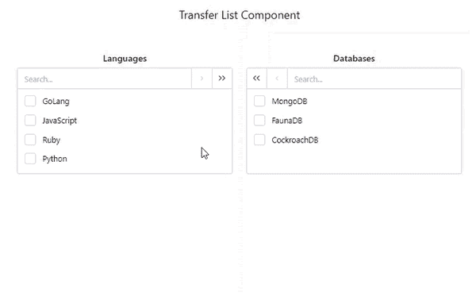
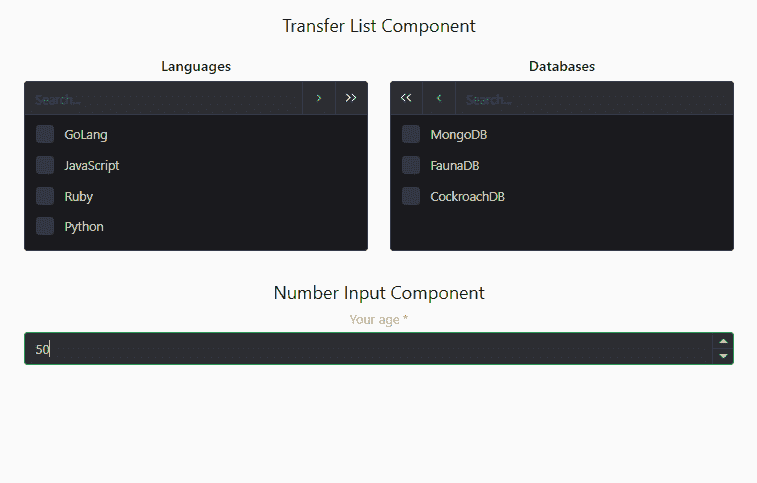
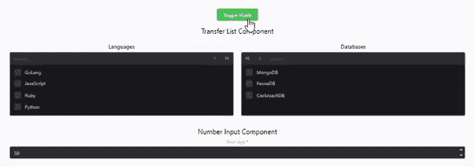
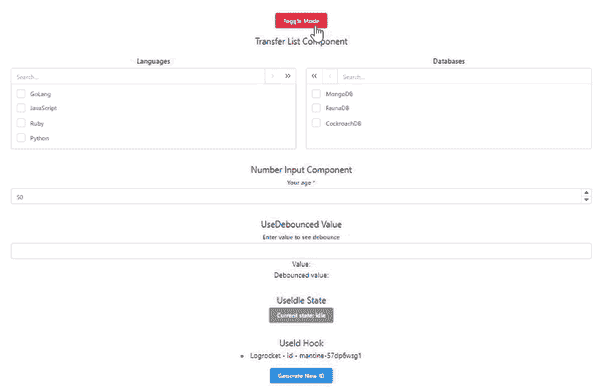

# Mantine 响应主题和组件

> 原文：<https://blog.logrocket.com/build-responsive-themes-components-mantine/>

MUI 或 Bootstrap 来快速完成工作。在任何情况下，UI 设计经常包括定制元素，这需要独特的实现策略。知道为项目使用哪个库是至关重要的。

如果你熟悉一些最流行的 UI 库，你可能会对最近引起轰动的新 UI 库 [Mantine](https://mantine.dev/) 感兴趣。在这篇文章中，我们将学习如何使用 Mantine，以及为什么它在竞争中脱颖而出。

## 内容

## 先决条件

要跟随并理解本教程，您需要以下内容:

*   React v16 或更新版本
*   React 和 Node.js 的工作知识
*   文本编辑器

## 什么是 Mantine？

Mantine 是一个全功能的 React 组件框架，使您能够快速构建全功能和可访问的在线应用程序。它包含了各种定制组件和挂钩，可以在项目中动态使用。

[Mantine 自问世以来已被广泛用于各种项目，每周下载量超过 23，000 次](https://www.npmjs.com/package/@mantine/core)。与 Mantine 相关的一些主要特征如下:

首先是主题化。Mantine 主题只是一个以独特方式构建组件的对象。它允许您用附加的属性和值来扩展应用程序的根。

其次是 Mantine 的组件，可以重复使用。一些组件包括版式、模态、输入和按钮等。

最后，曼蒂尼独特的钩子。Mantine 有几个钩子用于管理状态和 UI，可以用来创建定制组件。

## Mantine 入门

首先，让我们为 Mantine 生成一个默认模板。在您的终端中，创建一个新的 React 应用程序并运行以下命令:

```
yarn create react-app mantine-react-framework --template typescript

```

下一步是安装基本的 Mantine 包，这将使我们能够利用组件和钩子等功能。在您的终端中，复制并粘贴以下命令:

```
yarn add @mantine/hooks @mantine/core

```

既然已经安装了包，运行应用程序以确保一切都正常工作。

## 马丁的突出特点

如前所述，Mantine 的组件、主题能力和钩子使它在竞争中脱颖而出。在接下来的章节中，我们将仔细研究这些特性，为什么它们特别有用，并学习如何使用它们。

### 成分

在这一部分，我们将看看 Mantine 的一些从其他库中脱颖而出的组件。

看看下面布局中的`TransferList`组件。在`src`文件夹中创建一个名为`components and pages`的子文件夹。在`components`子文件夹中创建一个名为`TransferList.tsx`的文件。

接下来，复制并粘贴以下代码:

```
import { useState } from "react";
import { Text, TransferList, TransferListData } from "@mantine/core";

const initialValues: TransferListData = [
  [
    { value: "go", label: "GoLang" },
    { value: "js", label: "JavaScript" },
    { value: "ruby", label: "Ruby" },
    { value: "python", label: "Python" },
  ],
  [
    { value: "mongo", label: "MongoDB" },
    { value: "fauna", label: "FaunaDB" },
    { value: "cockroach ", label: "CockroachDB" },
  ],
];

const TransferListPage = () => {
  const [data, setData] = useState<TransferListData>(initialValues);
  return (
    <>
      <Text style={{ padding: "1rem" }} size="xl">
        Transfer List Component
      </Text>
      <TransferList
        value={data}
        onChange={setData}
        searchPlaceholder="Search..."
        nothingFound="Nothing here"
        titles={["Languages", "Databases"]}
        breakpoint="sm"
      />
    </>
  );
};

export default TransferListPage;

```

现在让我们看看上面代码中的一些细节。

Mantine 核心包中的`TransferList`组件被导入到这里，并呈现为一个独立的组件，处理`TransferListData`组件中的数据。`TansferListData`组件是一个变量，以对象数组的形式存储信息列表。

`TransferListData`的当前值由`value`道具指示。当值改变时，会调用`onChange`道具。

`nothingFound` prop 充当错误处理程序，如果没有其他选项可用，它会显示一条错误消息，而`titles` prop 使您能够快速命名某一列。

这里的关键点是，这些操作只需要两个主要组件来比较数据并将数据从一列传输到另一列。这节省了开发人员的时间和精力，因为从头开始编写整个逻辑需要更多的代码行。

考虑一下 MUI 库；它需要大量的组件来完成这些活动，因为它使用了网格系统、`button`、`checkbox`和`list`组件，这导致了 Mantine 中可能不需要的许多行代码。Mantine 通过独立组件动态简化了特性的使用。

让我们运行应用程序，看看输出是什么样子。但在此之前，我们必须将文件连接在一起。

导航到`pages`子文件夹，创建一个名为`Home.tsx`的文件。这是您放置之前创建的`TransferList`文件的链接的地方。复制并粘贴以下代码:

```
import TransferListPage from "../components/TransferListPage";

const Home = () => {
  return (
    <div style={{ padding: "2rem" }}>
      <TransferListPage />
    </div>
  );
};

export default Home;

```

这就是你的输出应该是什么样子。



现在我们来看另一个组件:`NumberInput`。

在 components 子文件夹中创建一个名为`NumberInput.tsx`的文件。复制并粘贴以下代码:

```
import { NumberInput, Text } from "@mantine/core";

const NumberInputPage = () => {
  return (
    <>
      <Text style={{ marginTop: "2rem" }} size="xl">
        Number Input Component
      </Text>
      <NumberInput
        defaultValue={50}
        placeholder="Your age"
        label="Your age"
        required
      />
    </>
  );
};

export default NumberInputPage;

```

在上面的代码中，从 Mantine 核心包中导入了一个单独的`NumberInput`组件。它接受各种属性，如`defaultValue`、`label`、`required`和`placeholder`。

浏览器加载时，`defaultValue`只是表示一个固定的基值，`label`起到命名标题标签的作用。

如您所见，几个组件的修改可以用一个单独的组件来执行。没有必要为了添加标签或输入而导入任何附加组件。

考虑一下[脉轮 UI 库](https://blog.logrocket.com/advanced-techniques-chakra-ui/)中的`NumberInput`组件。您必须利用五个不同组件，而不是为单个条目组件提供适当的选项。这种策略可能看起来适应性很强，但是很难将所有这些组件都用于一个操作。这被称为代码膨胀。

这就是您的`NumberInput`组件的输出应该是什么样子。


### 主题

有时，很难使用默认样式。创建项目时显示的默认样式可能不是您最喜欢的，因此 Mantine 允许您自定义您的主题，以使每个项目都尽善尽美。让我们看看主题配置在 Mantine 中是如何工作的！

要修改站点的整体主题，可以使用`MantineProvider`组件。如果您选择使用默认主题，则不需要这一步。主题化允许你给你的应用一个统一的外观和感觉，并允许你修改你的项目设计的每一部分，以符合你的应用的独特要求。

有两种方法可以配置你的主题:基本包装方法和钩子方法。

#### 基本包装方法

这只是使用`MantineProvider`组件来包装项目应用程序的基础(通常是`app.jsx`或`app.tsx`)。

导航到`src`文件夹，创建一个名为`utils`的子文件夹，并在其中创建一个名为`theme.ts`的文件。将以下代码复制并粘贴到您的`index.tsx`文件中:

```
import React from "react";
import ReactDOM from "react-dom";
import "./index.css";
import App from "./App";
import reportWebVitals from "./reportWebVitals";
import { MantineProvider } from "@mantine/core";
import theme from "./utils/theme";

ReactDOM.render(
  <React.StrictMode>
    <MantineProvider theme={theme}>
      <App />
    </MantineProvider>
  </React.StrictMode>,
  document.getElementById("root")
);

// If you want to start measuring performance in your app, pass a function
// to log results (for example: reportWebVitals(console.log))
// or send to an analytics endpoint. Learn more: https://bit.ly/CRA-vitals
reportWebVitals();

```

如果你仔细观察上面的代码，你会注意到`MantineProvider`作为一个包装器，用一个`theme`属性来扩展任何需要从`theme.ts`文件中覆盖或改变的样式。`theme.ts`文件将包含所有应用程序的样式参数。

现在，导航到您的`theme.ts`文件并复制下面的代码:

```
import { MantineThemeOverride } from "@mantine/core";

const theme: MantineThemeOverride = {
  colorScheme: "dark",
  primaryColor: "green",
};

export default theme;

```

在这种情况下，`MantineThemeOverride`类型允许您在变量中存储一个主题覆盖对象。应该注意的是，您可以在这个对象中配置任何样式；不限于`colorSheme`和`primaryColor`。

输出如下所示。



#### 钩子方法

这里的设置似乎更简单！不是将应用程序包装在`MantineProvider`中，而是使用一个钩子从`MantineProvider`上下文或默认主题中返回主题。

复制以下代码:

```
export const HooksWay = () => {
  const theme = useMantineTheme();
  return (
    <>
      <Text style={{ marginTop: "2rem" }} size="xl">
        Number Input Component Two
      </Text>
      <NumberInput
        style={{ background: theme.colors.dark[1]}}
        defaultValue={50}
        placeholder="Your age"
        label="Your age"
        required
      />
    </>
  );
};

```

`useMantineTheme`钩子使您能够连接到 Mantine 提供者，而不用在您的基本根应用程序中引用它。

这种主题模式允许您轻松地定制组件，而无需任何严格的覆盖。主题化有着广泛的应用，包括响应式布局。

您可以动态地覆盖或配置任何样式或断点(就响应性而言)。然而，我们将在这个应用程序中使用默认断点，因为 Mantine 有一个标准断点，它有助于响应性布局。

既然我们已经介绍了主题化的基本原理，那么在一些主题化包如`ColorSchemeProvider`和`ColorScheme`的帮助下创建一个动态的主题切换怎么样？

导航到`App.tsx`，这样我们可以对文件进行一些修改。复制并粘贴以下代码:

```
import { useState } from "react";
import {
  MantineProvider,
  ColorSchemeProvider,
  ColorScheme,
} from "@mantine/core";
import "./App.css";
import Home from "./pages/Home";

const App = () => {
  const [colorScheme, setColorScheme] = useState<ColorScheme>("light");
  const toggleColorScheme = (value?: ColorScheme) =>
    setColorScheme(value || (colorScheme === "dark" ? "light" : "dark"));

  return (
    <div className="App">
      <ColorSchemeProvider
        colorScheme={colorScheme}
        toggleColorScheme={toggleColorScheme}
      >
        <MantineProvider theme={{ colorScheme }}>
          <Home />
        </MantineProvider>
      </ColorSchemeProvider>
    </div>
  );
};

export default App;

```

在上面的代码中，`ColorSchemeProvider`支持动态配色方案改变，并协助设置配色方案上下文。从 Mantine 核心包导入的
`ColorScheme`，作为类型别名传递给 useState 进行严格的类型检查。为了处理用户的动作，创建了一个 toggleColorScheme 函数，它检查条件是否满足要求。

为了让逻辑工作，使用`useMantineColorScheme`钩子在应用程序的任何地方使用`ColorSchemeProvider`上下文。

导航到您的`Home.tsx`文件，复制并粘贴以下代码:

```
import { Button, useMantineColorScheme } from "@mantine/core";
import NumberInputPage from "../components/NumberInput";
import TransferListPage from "../components/TransferListPage";
import { UseDebouncedValuePage } from "../hooks/UseDebounce";
import { UseIdPage } from "../hooks/UseId";
import { UseIdlePage } from "../hooks/UseIdle";

const Home = () => {
  const { colorScheme, toggleColorScheme } = useMantineColorScheme();
  const dark = colorScheme === "dark";
  return (
    <div style={{ padding: "2rem" }}>
      <Button
        color={dark ? "yellow" : "blue"}
        onClick={() => toggleColorScheme()}
      >
        Toggle Mode
      </Button>
      <TransferListPage />
      <NumberInputPage />
      <UseDebouncedValuePage />
      <UseIdlePage />
      <UseIdPage />
    </div>
  );
};

export default Home;

```

创建的`colorScheme`状态在`toggleColorScheme`中用于明暗模式的条件渲染。

下面是您的输出应该是什么样子。



### 钩住

Mantine 用钩子来做大部分的重物。它可以让你在任何活动中使用钩子，甚至是最小的细节。探索 Mantine 的一些钩子会让你更好地理解如何使用它们。

#### `use-debounced-value`

考虑下面的场景:你在一个电子商务网站上搜索一个特定的产品，但是找不到。你是做什么的？大多数人会继续操作输入值(搜索词),以便获得产品的确切名称，使其出现在搜索结果中。

但是，当您开始修改输入值以适应您的搜索时，您可能会导致 React 组件的过度重新呈现并消耗 API 带宽。

顾名思义，反跳事件允许您调用一个函数来确保耗时的操作不会频繁触发。它是一个函数，将函数作为参数，将其封装在闭包中，然后返回它，显示“稍等”行为。

虽然实现这个动作可能需要创建耗时的逻辑，但是 Mantine 提供了一个钩子来完成所有的工作。您只需要在应用程序中需要钩子的地方使用它。

复制以下代码:

```
import { useState } from "react";
import { useDebouncedValue } from "@mantine/hooks";
import { TextInput, Text } from "@mantine/core";

export const UseDebouncedValue = () => {
  const [value, setValue] = useState("");
  const [debounced] = useDebouncedValue(value, 500);

  return (
    <>
      <TextInput
        label="Enter value to see debounce"
        value={value}
        style={{ flex: 1, marginTop: "2rem" }}
        onChange={(event) => setValue(event.currentTarget.value)}
      />

      <Text>Value: {value}</Text>
      <Text>Debounced value: {debounced}</Text>
    </>
  );
};

```

在上面的代码中，`useBouncedValue`函数被导入并带有两个参数，`value`和`time`。`Value`跟踪用户的去抖输入值，`time`的功能类似于超时效果。

最后，`useState`跟踪用户输入的值，并实时更新它们。
这是你的输出应该是什么样子。


#### `use-idle`

这个钩子检测用户是否在页面上什么都不做，并使组件空闲。

要查看它的运行情况，请复制以下代码:

```
import { Badge, Button, Text } from "@mantine/core";
import { useIdle } from "@mantine/hooks";

export const UseIdlePage = () => {
  const idle = useIdle(2000, { events: ["click", "touchstart"] });
  return (
    <>
      <Text style={{ marginTop: "2rem" }} size="xl">
        UseIdle State
      </Text>
      <Button color={idle ? "gray" : "green"}>
        Current state: {idle ? "idle" : "not idle"}
      </Button>
    </>
  );
};

```

导入的`useIdle`钩子接受`setTimeout`参数，以及监听点击和滚动事件以确定空闲状态的事件。

在条件检查中使用了`idle`变量来呈现或触发空闲状态。当您想根据是否满足某些标准来执行某个操作时，这个钩子很方便。

您的输出应该如下所示。


#### `use-id`

这个钩子自动为元素生成一个惟一的 ID。它减轻了在应用程序中安装像 UUID npm 这样的外部包的压力。

让我们看看它是如何工作的。从复制以下代码开始:

```
import { useState } from "react";
import { Button, List, Text } from "@mantine/core";
import { useId } from "@mantine/hooks";

export const UseIdPage = ({ id }: { id?: string }) => {
  const uuid = useId(id);
  const [state, setState] = useState(uuid);

  const generateId = () => {
    setState(uuid);
    window.location.reload();
  };

  return (
    <>
      <Text style={{ marginTop: "2rem" }} size="xl">
        UseId Hook
      </Text>
      <List>
        <List.Item>Logrocket - id - {state}</List.Item>
        <Button style={{ marginTop: "1rem" }} onClick={generateId}>
          Generate New ID
        </Button>
      </List>
    </>
  );
};

```

`use-id`函数生成一个随机 ID，在不同的渲染中保持一致。
默认情况下，`useState`接受 UUID，并在用户点击**生成**按钮时被更新。

您的输出应该如下所示。


耶！我们已经完成了这个项目。这就是我们整个应用程序的外观。



## 螳螂大战查克拉界面

如果你正在寻找 Mantine 的替代品，你可以考虑 Chakra UI。Mantine 是比 Chakra UI 更新的 UI 组件库，但两者都被开发者广泛使用和欣赏。让我们来比较一下这两个库，看看它们的优劣。

*   可配置性和代码质量:两个库的可配置性不相上下，但是 Mantine 的代码质量更好，而且它有一些缺省值，所以要使它达到可用状态需要更少的工作
*   组件:Mantine 需要很少或没有覆盖，它有更多的组件选择比查克拉 UI 内置功能
*   造型:
    *   查克拉更适合扩展风格和进行内联式响应
    *   重新设计 Chakra UI 以提供一个更简单和更可重用的 API，需要编写“包装器”组件
    *   有些 Chakra UI 组件在某些情况下很难重新设计，例如:
        *   为鼠标焦点在`:focus`样式上添加了一个方框阴影；这种默认样式可能很难删除
        *   组件组合是乏味的
        *   设置也可能是乏味的
*   文档:就指南和文档而言，Mantine 比 Chakra UI 更简洁明了
*   大小:查克拉 UI 的未压缩大小为 32.2kB，而螳螂核心的未压缩大小为 5.22MB

## Mantine 有哪些未解决的问题？

Mantine 是一个强大的 UI 组件库，有大量的组件、挂钩和实用程序可供选择，但它也有一些缺点。让我们看看 Mantine 的一些局限性和未解决的问题。

Mantine 提供了很多组件，总体来说是个好处。但是，有时候，开发人员会因为试图在太多的组件上工作而分散精力。

Mantine 也有发布突破性变化的历史，例如:

*   使用 [DatePicker](https://mantine.dev/dates/date-picker/) 组件选择一个日期会强制关闭弹出窗口。这里有一个[代码沙箱](https://codesandbox.io/s/fancy-architecture-ywwowr?file=/src/App.tsx)重现了这个问题。
*   当多选组件处于受控状态时，下拉列表不可见，因为它会立即关闭。通常指示文本输入的闪烁光标不可见。虽然用户可以输入文本，但它是不可见的。本质上，创建新的选择项被完全忽略。这里有一个 [CodeSandbox](https://codesandbox.io/s/repro-multi-select-dropdown-ikmuxi?file=/src/App.tsx) 重现了这个问题。

## 结论

Mantine 是一个 UI 库，具有特定的组件和钩子特性，可以极大地提高您的项目性能。由于其预建的模板，它节省了大量的时间。

Mantine 因其灵活性而闻名。由于 MUI 和 Bootstrap 的严格性，如果布局设计需要大量的定制实现，可能不完全推荐在大型项目应用程序中使用它们。

到目前为止，您应该已经很好地理解了 Mantine 是如何工作的，为什么它在 web 应用程序中很重要，它的局限性是什么，有哪些替代方法，以及如何设置一个基本的 Mantine web 应用程序。

## 使用 [LogRocket](https://lp.logrocket.com/blg/signup) 消除传统错误报告的干扰

[](https://lp.logrocket.com/blg/signup)

[LogRocket](https://lp.logrocket.com/blg/signup) 是一个数字体验分析解决方案，它可以保护您免受数百个假阳性错误警报的影响，只针对几个真正重要的项目。LogRocket 会告诉您应用程序中实际影响用户的最具影响力的 bug 和 UX 问题。

然后，使用具有深层技术遥测的会话重放来确切地查看用户看到了什么以及是什么导致了问题，就像你在他们身后看一样。

LogRocket 自动聚合客户端错误、JS 异常、前端性能指标和用户交互。然后 LogRocket 使用机器学习来告诉你哪些问题正在影响大多数用户，并提供你需要修复它的上下文。

关注重要的 bug—[今天就试试 LogRocket】。](https://lp.logrocket.com/blg/signup-issue-free)