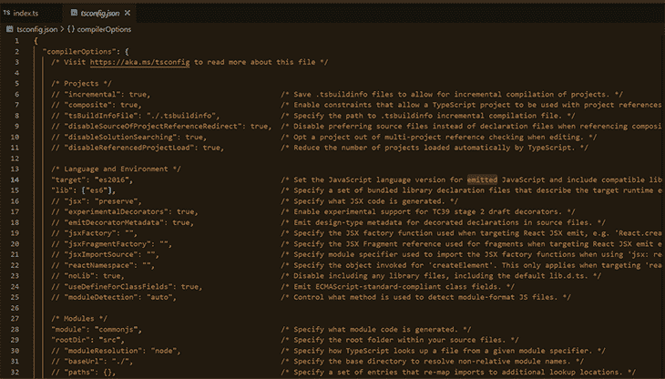
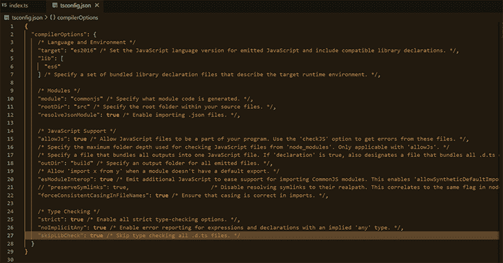
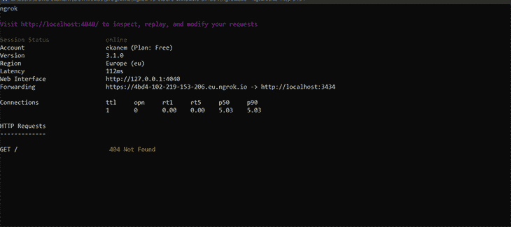
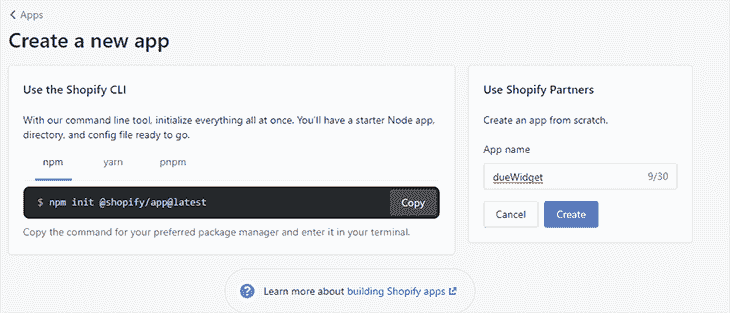
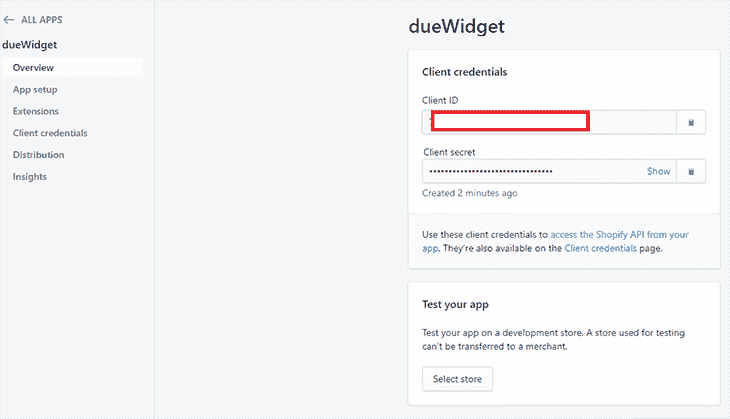
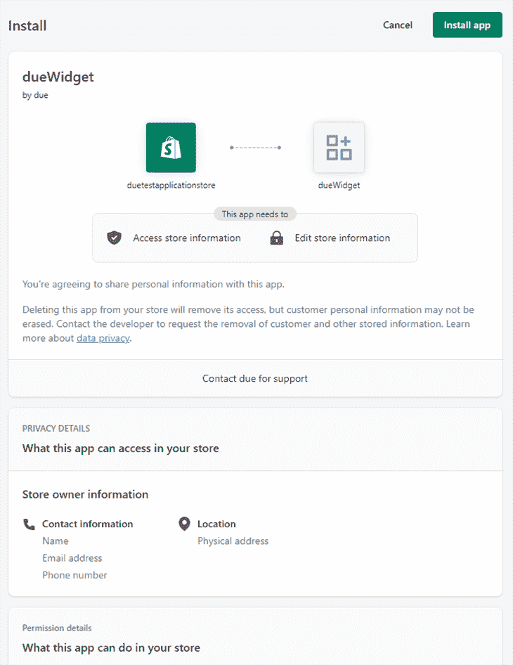
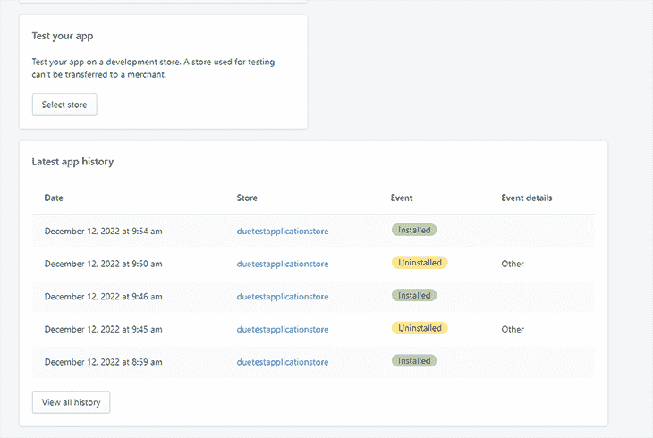
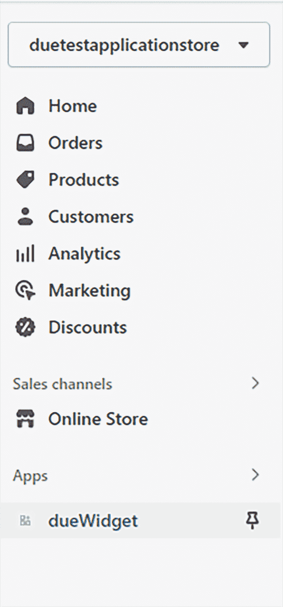

# 用 Node.js 构建一个 Shopify 应用

> 原文：<https://blog.logrocket.com/build-shopify-app-with-node-js/>

Shopify 是一个平台，使企业能够创建在线商店和应用程序。网上商店对电子商务至关重要。商店需要高效，为用户服务。Shopify 是开发电子商务应用程序的首选平台之一。

使用 Shopify 的好处包括从高级用户体验到出色的前端设计。Shopify 还提供了很棒的营销策略。在本文中，我们的重点将是构建一个与 Shopify 协同工作的 Node.js 应用程序。

*向前跳转:*

## 与 Shopify 集成

第三方开发者开发了很大一部分 Shopify 应用，用于扩展 Shopify 的基本功能。借助第三方应用程序，将新功能集成到 Shopify 中非常容易，它们允许我们扩展商家体验。借助 Shopify，我们可以为顾客创造令人惊叹的购物体验。

我们可以利用第三方应用做的事情几乎没有限制。商家可以在 Shopify 管理面板中访问我们的应用程序并与之互动。

与 Shopify 集成有几种不同的方式:

*   为销售点应用程序扩展 Shopify 管理仪表板中的新功能
*   与 Shopify APIs 集成，例如，允许应用程序读写产品的管理 API 等。

Shopify 接受两种类型的应用:

1.  公共应用程序:这些应用程序适用于所有企业，有助于创建合作伙伴仪表板
2.  定制应用程序:满足特定业务需求的定制应用程序

让我们设置我们的 TypeScript 和 Node.js 项目。

## 用 TypeScript 设置我们的 Node.js 项目

设置此类应用程序的要求如下:

创建一个文件夹来存放我们的项目:

```
mkdir shopifyNode
cd shopifyNode
```

使用 Yarn 和`-y`标志，我们设置了我们的`package.json`，它将在创建过程中批准所有的默认值。

```
yarn init -y
```

现在，添加 TypeScript 作为开发依赖项:

```
yarn add typescript
```

一旦 TypeScript 安装完成，我们就可以通过`tsc`命令访问命令行 TypeScript 编译器。

## 为 TypeScript 安装 Node.js 类型

TypeScript 拥有不同种类的类型。我们将在这个应用程序中安装 [DefinitelyTyped](https://github.com/DefinitelyTyped/DefinitelyTyped) 类型定义。

```
yarn add --dev @types/node
```

让我们创建一个`tsconfig.json`来保存 TypeScript 编译器的选项。让我们使用命令行创建`tsconfig`。

```
npx tsc --init --rootDir src --outDir build --esModuleInterop --resolveJsonModule --lib es6 --module commonjs --allowJs true --noImplicitAny true

```

我们来分解一下上面的代码:

*   `rootDir`:这是 TypeScript 查找项目代码的位置。在我们的例子中，它被配置到`src`文件夹
*   `outDir`:编译器输出的代码，存储在`build/`文件夹中
*   这处理了我们应用程序中的模块系统。模块系统的例子包括 AMD、SystemJS、ES 模块等。；对于这个应用程序，我们将 CommonJS 设置为`true`，因为它是 Node.js 应用程序的主要模块系统
*   `resolveModule`:在我们的 TypeScript 应用程序中启用 JSON
*   将环境类型添加到我们的项目中，并使应用程序能够依赖不同 ECMA 脚本版本的特性。有了这个，我们就可以使用测试库、DOM API 和 ES 2015 语言特性——所有这些都被编译成 ES 2009
*   `module` : CommonJS，Node.js 的标准模块系统
*   `allowjs`:将我们的 JavaScript 项目转换成 TypeScript。这样，`.js`文件可以与`.ts`文件一起使用
*   `noImplicitAny`:每种类型都需要有一个特定的类型或者明确定义为`any`

一旦完成，`tsconfig.json`文件应该如下图所示:


清理掉不需要的评论:


最后，创建`src`文件夹并创建一个`index` TypeScript 文件。

```
mkdir src
touch src/index.ts
```

## 编译我们的打字稿代码

为了编译，我们依赖于使用 npx 的`tsc`命令。`tsc`读取当前目录中的`tsconfig.json`并应用配置。TypeScript 编译器生成编译后的 JavaScript 代码。

```
npx tsx
```

一旦这个命令在`build`文件夹中运行，它就会创建一个`index.js`文件。我们的第一个打字稿文件！


### 添加依赖项和脚本

我们的应用程序将启用冷重装，这反过来在本地开发时可以加快开发速度。在我们的应用程序中实现冷重装依赖于几个包:

1.  `[Ts-node](https://blog.logrocket.com/how-to-set-up-node-typescript-express/)`:运行类型脚本代码而不等待编译
2.  [nodemon](https://blog.logrocket.com/configuring-nodemon-with-typescript/) :监视我们代码的变化，当文件发生变化时重新启动

    ```
    yarn add ts-node nodemon
    ```

添加一个`nodemon.json`配置:

```
touch nodemon.json
```

将代码块粘贴到`nodemon.json`文件中:

```
{
  "watch": ["src"],
  "ext": ".ts,.js",
  "ignore": [],
  "exec": "ts-node ./src/index.ts"
}
```

在我们的`package.json`中，添加一个脚本来管理 nodemon:

```
"scripts": {
    "start:dev": "nodemon",
  },
```

当`yarn run start:dev`运行时，nodemon 使用`./src/index.ts`中的 ts-node 启动我们的应用程序。它用`/src`查找对`.ts`和`.js`文件的更改。

## 初始化我们的应用程序

在`index.ts`文件中，让我们开始构建应用程序。

```
code index.ts
```

让我们导入必要的依赖项并初始化我们的应用程序。

```
const crypto = require("crypto");
const nonce = require("nonce");
const request = require("request-promise");
const querystring = require("querystring");
const cookie = require("cookie");
const express = require("express");

const app = express(); // initialize application
app.listen(3434, () => console.log("Application listening on port 3434!"));
```

### 托管服务器

ngrok 使我们能够托管我们的本地服务器，并使其公开可用。下载 ngrok 后，安装并打开它。终端窗口应该打开；输入以下命令，用 ngrok 托管服务器。

```
ngrok http 3434
```

然后您应该会看到这个:


## 在 Shopify 的合作伙伴仪表板中创建新的应用程序

导航至 Shopify 合作伙伴控制面板。


点击**应用**标签:


点击**创建 app** 按钮:


系统将提示您决定如何创建应用程序。您可以使用 Shopify CLI 或手动创建应用程序。输入你想要的名字；对于这篇文章，我们的名字是`dueWidget`。点击**创建**按钮。


一旦我们点击**创建**按钮，就会显示`CLIENT ID`和`CLIENT SECRET`。我们需要这些详细信息来验证我们的应用程序。


In the navigation tab, click **App setup**.


在**URL**下的部分，复制生成的 ngrok URL 并粘贴到 **App URL** 和**重定向 URL** 中。我控制台里的网址是`[https://d9f5-102-219-153-216.eu.ngrok.io/](https://d9f5-102-219-153-216.eu.ngrok.io/)`。

将`/shopify`追加到 ngrok URL，让我们可以访问用户路径。**应用程序 URL** 是商家点击我们的应用程序列表后，我们将他们重定向到的 URL。

一旦商家启用应用程序，重定向 URL 就会重定向商家。我们加一个`/callback`来标识它。


保存，返回到**概述**部分，然后转到**测试你的应用**部分，点击**选择商店**按钮。这里，我们将应用程序连接到开发商店。

创建开发商店的链接在上面的**需求**部分。


## 开发 Node.js 应用程序

设置好之后，让我们回到 IDE，继续在`index.ts`文件中开发我们的应用程序。

使用终端窗口，打开`index.ts`文件，并在根项目目录中创建一个环境变量和`gitignore`文件。`env`文件使我们能够安全地存储我们的秘密，`gitignore`防止我们将不需要的文件部署到 Git。

```
code index.ts
touch .env .gitignore
code .gitignore
```

将下面一行添加到`.gitignore`文件中:

```
.env
```

使用终端窗口，打开`.env`文件:

```
code .env
```

下图中的细节是我们所需要的。**客户端 ID** 代表您的`SHOPIFY_API_KEY`。**客户端秘密**代表你的`SHOPIFY_API_SECRET`。

```
SHOPIFY_API_KEY= //YOUR CLIENT ID FROM SHOPIFY APP OVER PAGE
SHOPIFY_API_SECRET=//YOUR CLIENT SECRET FROM SHOPIFY APP OVER PAGE
```

详情可在我们的 Shopify 应用仪表板的**应用概述**页面中找到。


在`index.ts`文件中，让我们继续编写代码。

我们将在应用程序中定义两个端点:

1.  `/shopify` route:它接收请求中的商店名称，并创建一个 nonce 来管理状态。nonce 验证对回调 URL 的请求来自 Shopify
2.  `/shopify/callback`路由:处理来自 Shopify 的回调。一旦我们确定请求来自 Shopify，用户就会被重定向

复制下面的代码块并粘贴到您的`index.ts`文件中:

```
const PORT = 3342;
const apiKey = process.env.SHOPIFY_API_KEY;
const apiSecret = process.env.SHOPIFY_API_SECRET;
const scopes = "write_products";
const forwardingAddress = "https://1649-102-88-34-8.eu.ngrok.io"; // our ngrok url

// set the url, to the url used in the APP URL
app.get("/shopify", (req: any, res: any) => {
  const shopName = req.query.shop;
  if (shopName) {
    // use nonce to set a parameter called state
    // the nonce is random string that would be set
    // it would be received on the request
    // the callback from shopify would echo the state
    // the two states would be compared
    // if they match, we are sure the request came from shopify
    // if they don't match, they request is being spoofed
    // this would throw an error
    const shopState = nonce();
    // shopify callback redirect
    const redirectURL = forwardingAddress + "/shopify/callback";

    // install url for app install
    const installUrl =
      "https://" +
      shopName +
      "/admin/oauth/authorize?client_id=" +
      apiKey +
      "&scope=" +
      scopes +
      "&state=" +
      shopState +
      "&redirect_uri=" +
      redirectURL;

    // in a production app, the cookie should be encrypted
    // but, for the purpose of this application, we won't do that
    res.cookie("state", shopState);
    // redirect the user to the installUrl
    res.redirect(installUrl);
  } else {
    return res.status(400).send('Missing "Shop Name" parameter!!');
  }
});
```

回调 URL 重定向用户。这个路由检查存储在 cookie 中的状态是否来自 Shopify。如果是，我们生成一个散列，并将其用于 [HMAC 验证](https://en.wikipedia.org/wiki/HMAC)。如果验证失败，URL 安装将失败。

如果 HMAC 验证为真，则开发商店中的应用程序安装是成功的。

```
app.get("/shopify/callback", (req: any, res: any) => {
  const { shop, hmac, code, shopState } = req.query;
  const stateCookie = cookie.parse(req.headers.cookie).shopState;

  if (shopState !== stateCookie) {
    return res.status(400).send("request origin cannot be found");
  }

  if (shop && hmac && code) {
    const Map = Object.assign({}, req.query);
    delete Map["hmac"];
    delete Map["signature"];

    const message = querystring.stringify(Map);
    const providedHmac = Buffer.from(hmac, "utf-8");
    const generatedHash = Buffer.from(
      crypto
        .createHmac("sha256", process.env.SHOPIFY_API_SECRET)
        .update(message)
        .digest("hex"),
      "utf-8"
    );
    let hashEquals = false;
    try {
      hashEquals = crypto.timingSafeEqual(generatedHash, providedHmac);
    } catch (e) {
      hashEquals = false;
    }
    if (!hashEquals) {
      return res.status(400).send("HMAC validation failed");
    }
    const accessTokenRequestUrl =
      "https://" + shop + "/admin/oauth/access_token";
    const accessTokenPayload = {
      client_id: process.env.SHOPIFY_API_KEY,
      client_secret: process.env.SHOPIFY_API_SECRET,
      code,
    };
    request
      .post(accessTokenRequestUrl, { json: accessTokenPayload })

      .then((accessTokenResponse: any) => {
        const accessToken = accessTokenResponse.access_token;

        const apiRequestURL = `https:// + ${shop} + /admin/shop.json`;

        const apiRequestHeaders = {
          "X-Shopify-Access-Token": accessToken,
        };

        request
          .get(apiRequestURL, { headers: apiRequestHeaders })

          .then((apiResponse: any) => {
            res.end(apiResponse);
          })

          .catch((error: any) => {
            res.status(error.statusCode).send(error.error.error_description);
          });
      })

      .catch((error: any) => {
        res.status(error.statusCode).send(error.error.error_description);
      });
  } else {
    return res.status(400).send("required parameter missing");
  }
});

app.listen(PORT, () => console.log(`Application listening on port ${PORT}`));
```

## 测试我们的应用

是时候测试我们的应用程序了。要使用的 URL 是:

```
https://5235-102-88-62-59.eu.ngrok.io/shopify?shop=duetestapplicationstore.myshopify.com/

```

此 URL 可以发送给潜在的商家，以便在他们的 Shopify 商店中安装我们的应用程序。


您将被重定向到安装屏幕。点击**安装应用**按钮。如果安装成功，该应用将显示在**应用概述**页面。


应用程序安装成功。我们的应用程序成功地与我们创建的`duetestapplication`商店集成在一起。如果我们回到我们的开发商店，我们应该在 **Apps** 部分看到我们的应用程序。


Click **dueWidget** to see the functionality of our application.


我们的应用程序按预期工作，使我们能够读取关于我们商店的信息。

还有各种其他方法可以扩展我们的应用程序。在开发我们的应用程序时，我们在 scopes 下添加了`write_products`功能，这允许我们将产品添加到我们的 Shopify 商店。

## 结论

在本文中，我们学习了如何在 Shopify 上建立一个开发商店，并使用 Shopify API 来检索数据。我们还学习了如何创建 Node.js 应用程序并使用 ngrok 托管我们的服务器。

然后，我们将应用程序连接到我们的开发商店，并使用它来检索商店的详细信息。本文概述的步骤使开发人员能够使用 Node 为 Shopify 构建应用程序，并使商家能够扩展其商店的功能。

还有更多功能可以实现，从添加产品到我们的商店，等等。尝试其中一些，看看您的 Shopify 商店能为您做些什么！

## [LogRocket](https://lp.logrocket.com/blg/ecommerce-signup) :看看用户为什么不完成你的电子商务流程中的一个步骤的技术和 UX 原因。

[](https://lp.logrocket.com/blg/ecommerce-signup)

LogRocket 就像是一个网络和移动应用程序和网站的 DVR，记录你的电子商务应用程序上发生的一切。LogRocket 没有猜测用户不转化的原因，而是主动揭示了阻止你转化的根本原因，比如 JavaScript 错误或死点击。LogRocket 还可以监控应用的性能，报告客户端 CPU 负载、客户端内存使用等指标。

开始主动监控您的电子商务应用程序— [免费试用](https://lp.logrocket.com/blg/ecommerce-signup)。