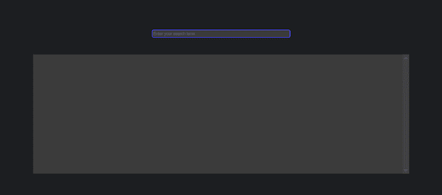
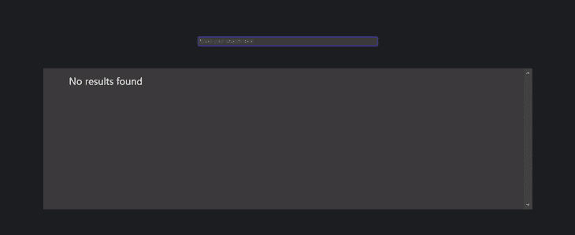
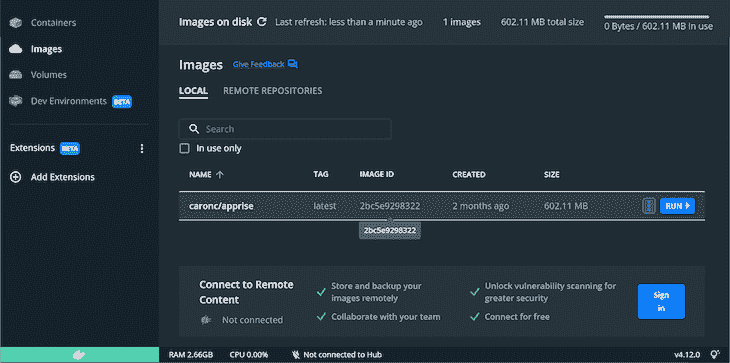
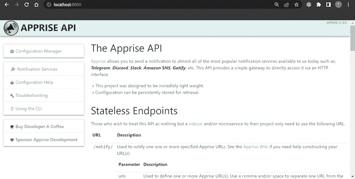
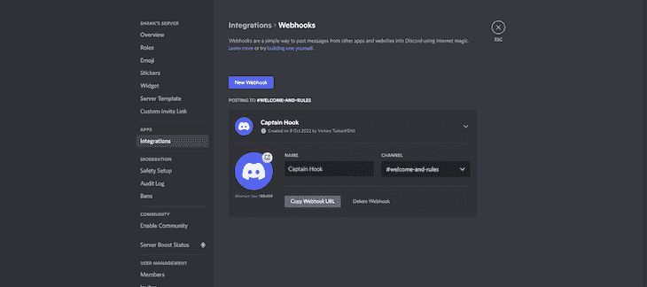
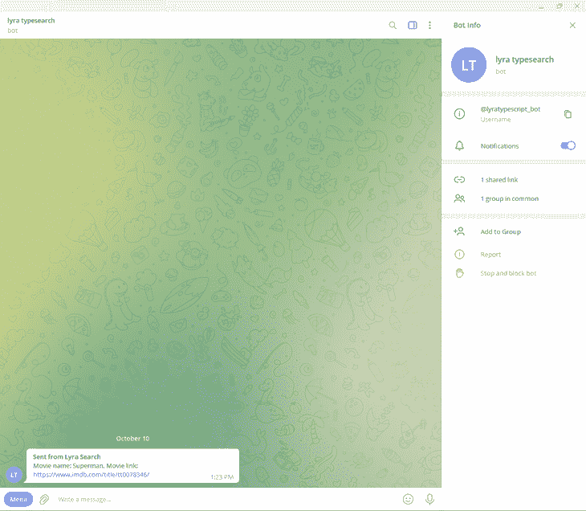
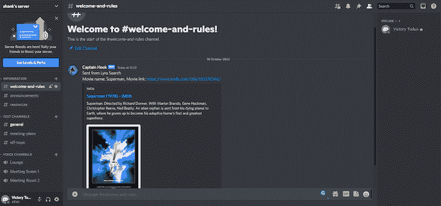

# 用 Lyra 和 TypeScript 构建一个站点搜索

> 原文：<https://blog.logrocket.com/build-site-search-lyra-typescript/>

现场搜索功能允许用户快速查询数据，结果提供相关信息。如果你的搜索功能是无效的，用户可能会在没有满足他们的需求的情况下退出你的应用程序，造成糟糕的用户体验，导致糟糕的转化率。

在本教程中，我们将使用 Lyra 和 TypeScript 构建一个搜索功能，并学习如何将通知从您的应用程序推送到不同的平台。

## 目录

## 什么是 TypeScript，为什么要使用它？

TypeScript 是 JavaScript 的超集，可以用来构建和管理小型到大型的 JavaScript 应用程序。强类型和精确，TypeScript 为团队协作提供了简单的代码管理。

JavaScript 是一种解释型编程语言，因此不涉及代码编译。错误是在应用程序运行时捕获的。因为 TypeScript 编译成 JavaScript，所以错误是在编译时而不是运行时报告的。错误非常详细，使它们更容易调试和修复。

TypeScript 还包括可选的静态类型及其类型推理系统。如果用户创建了一个没有指定类型的变量，TypeScript 会根据它的值为它分配一个类型。

## 什么是站点搜索功能？

在 web 应用程序中，站点搜索功能允许站点访问者根据他们在提供的输入字段中输入的搜索词来过滤他们获得的内容。因此，网站访问者可以很容易地找到符合他们需求的相关信息，降低了 web 应用程序的跳出率。

### 为什么要用天琴座？

[Lyra](https://lyrajs.io/) 是用 TypeScript 开发的易于集成的成熟搜索功能。Lyra 帮助开发人员执行闪电般的数据查询，它还可以为用户搜索查询提供建议、自动完成和容错。

## 通知了什么？

[appraise](https://github.com/caronc/apprise)是一个轻量级的通知服务，允许开发者同时向不同的平台发送通知，包括社交媒体平台、邮件和 SMTP 服务。

## TypeScript 是如何工作的？

要使用 TypeScript，我们需要安装一个 TypeScript 编译器。我们可以使用以下命令执行 TypeScript 的全局安装:

```
npm install -g typescript

```

一旦安装完成，在工作目录中，运行`npm init--y`用默认设置初始化 npm。

接下来，我们可以创建一个 TypeScript 配置文件，让我们配置我们的 TypeScript 文件的行为，包括我们的 TypeScript 文件将被转换到哪个版本的 JavaScript，转换后的文件的目标文件夹，允许 JavaScript 文件的选项，以及将存储所有 TypeScript 文件的根目录`Jsx`。默认情况下，有许多可用选项被注释掉，如果需要，可以启用这些选项。

要在目录中创建一个配置文件，在 CLI 中键入`tsc--init`并点击**回车**按钮。TypeScript 允许用户定义 TypeScript 文件和转换后的 JavaScript 文件将存储在什么目录中。这些文件夹习惯上分别被称为`src`和`dist`文件夹。为此，修改配置文件`tsconfig.json`，如下所示:

```
//...
    "rootDir": "./src",                                  
/* Specify the root folder within your source files. */
//...
    "module": "ES6",                                /* Specify what module code is generated. */
//...
    "outDir": "./dist",                                   
/* Specify an output folder for all emitted files. */

```

要将 TypeScript 文件编译成 JavaScript，我们可以使用`Tsc`编译器和要编译的文件名。

或者，为了避免手动编译我们的 TypeScript 文件，我们可以设置编译器来监视文件中的变化，并在检测到变化时重新编译。为此，我们将修改我们的`package.json`文件中的`start`脚本来运行`watch`命令:

```
//...
 "scripts": {
    "start": "tsc --watch"
  },

```

指定了`src`目录后，TypeScript 将自动监视该文件夹中 TypeScript 文件的变化，并自动将它们转换为`dist`目录中的 JavaScript 文件。

## 安装开发依赖项

对于我们的站点搜索功能，我们将使用 TypeScript 和 Lyra。要设置 TypeScript，请在本地计算机上打开您选择的目录，并启动命令行界面的一个实例。在终端环境中，运行以下命令安装 TypeScript 编译器:

```
npm insta f

```

您可以使用`typescript -v`命令检查您安装的 TypeScript 编译器的版本。

为了方便地使用 TypeScript 的节点模块，我们需要一个 bundler 为此，我们将使用 Next.js。要在本地计算机上使用 TypeScript 设置 Next.js，请在您选择的目录中运行以下命令:

```
npx [email protected] --ts

```

要安装 Lyra 搜索依赖项，请运行以下命令:

```
cd <name of your application created with the above command>
npm i @lyrasearch/lyra

```

我们在应用程序中需要的最后一个依赖项是 Apprise，我们将使用它来发送 Lyra 搜索字段所查询数据的通知。我们将在本教程的后面安装。

## 构建我们的应用程序前端

对于我们的应用程序，我们将首先创建使用 Lyra 的输入字段，之后我们将使用它添加和查询数据。修改`pages`目录中的`index.txs`文件，如下所示:

```
import type { NextPage } from 'next'
import Head from 'next/head'
import { useState } from 'react'

const Home: NextPage = () => {
  const [query, setQuery] = useState('')
  return (
    <div>
      <Head>
        <title>Create Next App</title>
        <meta name="description" content="Generated by create next app" />
        <link rel="icon" href="/favicon.ico" />
      </Head>
      <div className="maincontainer">
        <input type="text" id="input" placeholder="Enter your search term" value={query} onChange={(e)=>{setQuery(e.target.value)}} />
        <div id="results">{/* display search results  */}</div>
      </div>
    </div>
  )
}
export default Home

```

在上面的代码中，我们已经创建了基本的输入字段和显示区域。要设计我们的应用程序，请将以下代码添加到`global.css`:

```
html,
body {
  padding: 0;
  margin: 0;
  font-family: -apple-system, BlinkMacSystemFont, Segoe UI, Roboto, Oxygen,
    Ubuntu, Cantarell, Fira Sans, Droid Sans, Helvetica Neue, sans-serif;
}
a {
  color: inherit;
  text-decoration: none;
}
* {
  box-sizing: border-box;
}
@media (prefers-color-scheme: dark) {
  html {
    color-scheme: dark;
  }
  body {
    color: white;
    background: black;
  }
}
.maincontainer{
  min-height: 100vh;
  background: #1c1e21;
  display: flex;
  justify-content: center;
  align-items: center;
  flex-direction: column;
}
#results{
  display: grid;
  margin-top: 55px;
  grid-template-columns: 1fr 2fr 1fr;
  gap: 20px;
  padding: 14px;
  width: 85%;
  height: 60vh;
  overflow-y: scroll;
  background: #3b3b3b;
}
#input{
  height: 25px;
  margin-top: 25px;
  width: 450px;
  outline: none;
  border: 2px solid rgb(72, 72, 255);
  padding-left: 2px;
  border-radius: 5px;
  background: #3b3b3b;
}

```

如果我们用`npm run dev`命令运行我们的应用程序，我们将得到类似下图的结果:



## 添加 Lyra 搜索功能

接下来，我们将使用`pages`目录中的`index.tsx`文件将 Lyra 依赖项添加到我们的输入字段中:

```
import { create, search, insert } from "@lyrasearch/lyra";

```

在上面的代码块中，我们从 Lyra 导入了`create`、`search`和`insert`方法。这三种方法将执行以下功能。

### `create`

我们将使用`create`方法来定义我们将要存储的数据的模式。我们还将为每个属性定义数据类型。下面的代码举例说明了这一点:

```
const newMovies = create({
      schema: {
        name: "string",
        downloadURL: "string",
        rating: "number",
      },
    });

```

我们创建了一个名为`newMovies`的 Lyra 实例。它的模式将包含三组值，`name`、`downloadURL`和`rating`。因此，任何添加到`newMovies`实例的数据都必须包含这些字段。

### `search`

`search`方法用于查询存储在创建的实例中的数据，我们将使用它来实现我们的搜索功能。

### `insert`

我们使用`insert`方法向创建的实例添加新数据:

```
 insert(newMovies, {
      name: "The Shawshank Redemption",
      downloadURL: "https://www.imdb.com/title/tt0111161/",
      rating: 9.3,
    });

```

在上面的代码中，我们将新数据插入到了`newMovies`实例中。为了创建我们的`Lyra`实例，向`index.tsx`添加以下内容:

```
import { useState, useEffect } from "react";
import {
  create,
  search,
  insert,
} from "@lyrasearch/lyra";
const Home: NextPage = () => {
  const [query, setQuery] = useState("");
  const [results, setResults] = useState([]);
  const newMovies = create({
    schema: {
      name: "string",
      downloadURL: "string",
      rating: "number",
    },
  });
  insert(newMovies, {
    name: "The Shawshank Redemption",
    downloadURL: "https://www.imdb.com/title/tt0111161/",
    rating: 9.3,
  });
  insert(newMovies, {
    name: "The Godfather",
    downloadURL: "https://www.imdb.com/title/tt0068646/",
    rating: 9.2,
  });
  insert(newMovies, {
    name: "The Godfather: Part II",
    downloadURL: "https://www.imdb.com/title/tt0071562/",
    rating: 9.0,
  });
  insert(newMovies, {
    name: "The Dark Knight",
    downloadURL: "https://www.imdb.com/title/tt0468569/",
    rating: 9.0,
  });
  insert(newMovies, {
    name: "Superman",
    downloadURL: "https://www.imdb.com/title/tt0078346/",
    rating: 7.3,
  });
  insert(newMovies, {
    name: "Batman Begins",
    downloadURL: "https://www.imdb.com/title/tt0372784/",
    rating: 8.3,
  });
  insert(newMovies, {
    name: "The Dark Knight Rises",
    downloadURL: "https://www.imdb.com/title/tt1345836/",
    rating: 8.5,
  });
  useEffect(() => {
    const searchresults = search(newMovies, {
    //search here
  }, [query]);

```

我们创建了一个名为`newMovies`的 Lyra 实例，并使用`insert`方法向其中添加电影。我们使用了`useEffect`钩子和`search`方法来查询`newMovies`实例，并返回与搜索字段中的输入相匹配的结果。

## 返回我们的搜索结果

为了在我们的应用程序中返回搜索结果，我们将用来自我们的`search`方法的结果更新`results`状态。我们将在应用程序中呈现该数组，如下所示:

```
//useEffect
 const searchresults = search(newMovies, {
      term: query,
      properties: '*',
    });
    setResults(searchresults.hits);

```

然后，在我们的`return`块中，添加以下代码:

```
<div id="results">
    {/* display search results  */}
    {/* {console.log(results)} */}
    {results.length > 0 ? (
     results && results.map((movie, index) => 
     <div key={index} style={{background: "#1c1e21", height: '200px', paddingLeft: "13px"}}>
      <h3>{movie.name}</h3>
      <a href={movie.downloadURL} style={{color: "blueviolet"}} target="_blank" rel="noreferrer" &gt;Download URL</a>
      <p>Movie Rating: {movie.rating}</p>
     </div>
     )
    ) : (
      <div style={{textAlign: "center", fontSize: "25px"}}>No results found</div>
    )}
  </div>

```

当我们的`results`状态返回一个数组长度大于零的值时，我们呈现来自 Lyra 搜索结果的内容。否则，我们返回一个简单的文本读数`No results found`。现在，如果我们用`npm run dev`命令运行我们的应用程序，我们将得到以下结果:



## Docker 设置

要安装通知，您需要在您的本地机器 Docker。如果你还没有安装 Docker，你可以按照指南来安装它。

安装 Docker 后，我们可以通过在终端中运行`docker pull caronc/apprise`来安装 aperture。安装完成后，我们可以通过选择左侧导航栏上的**图像**选项，在打开的新窗口中运行“通知”:



在附加设置下，您可以指定通知的名称或端口，然后单击**运行**启动服务器。运行通知时，在浏览器中打开 URL 会产生以下结果:



## 从 Next.js API 路由发出`POST`请求

我们将向[不和谐](https://github.com/caronc/apprise/wiki/Notify_discord)和[电报](https://github.com/caronc/apprise/wiki/Notify_telegram)发送通知。我们需要以下配置:

### 为了不和谐

对于不一致，我们将需要我们希望向其发送通知的通道的`webhook id`和`webhook token`。您可以从**集成**窗格下的不和谐频道的**设置**选项卡中获得:



点击**复制 Webhook URL** 获得包含您的 ID 和 hook 的 URL。然后，创建一个 URL，如下所示:

```
discord://{your webhook id}/{your webhook token}

```

### 电报用

要向 Telegram 发送通知，我们首先需要设置一个 Telegram bot， [BotFather](https://botsfortelegram.com/project/the-bot-father/) 。为了给机器人发消息，[参考文档中的步骤](https://github.com/caronc/apprise/wiki/Notify_telegram#bot-setup)。

我已经创建了一个名为 `lyratypescript_bot`的新机器人，但是你可以随意命名你的机器人。使用以下格式创建一个电报 URL:

```
tgram://<your telegram bot token>/

```

## 定义我们的`POST`请求

随着我们的通知服务器的启动和运行，我们将在我们的`api`目录中定义一个`POST`请求，每当一部电影被点击时，从我们的`newMovies`实例中发布详细信息。在`api`文件夹中，创建一个名为`sendnotifications.ts`的新文件，并向其中添加以下代码:

```
// Next.js API route support: https://nextjs.org/docs/api-routes/introduction
import type { NextApiRequest, NextApiResponse } from "next";
import axios from "axios";
type Data = {
  name: string;
};
export default async function handler(
  req: NextApiRequest,
  res: NextApiResponse<Data>
) {
  let headersList = {
    Accept: "*/*",
    "Content-Type": "application/json",
  };
  let bodyContent = JSON.stringify({
    urls: "<discord URL>, <telegram URL>",
    title: "Sent from Lyra Search",
    body: `Movie name: ${JSON.parse(req.body).title}, Movie link: ${JSON.parse(req.body).Movielink}`,
    tag: "all",
  });
  let reqOptions = {
    url: "http://localhost:8000/notify/",
    method: "POST",
    headers: headersList,
    data: bodyContent,
  };
  let response: Data = await axios.request(reqOptions);
  console.log(response.data);
  res.status(200).json(response.data);
}

```

在我们的`index.tsx`文件中，我们可以用我们的电影数据创建一个`POST`请求到这个`api` URL:

```
//function to send notifications  
const sendnotifs = async (notification) => {
    const response = await fetch("/api/sendnotifications", {
      method: "POST",
      body: JSON.stringify({
        title: notification.name,
        Movielink: notification.downloadURL,
        rating: notification.rating,
      }),
    });
    const data = await response.json();
    console.log(data);
  };

```

然后，在我们的`results`显示容器中，我们将添加一个`onClick`处理程序来运行这个函数，将`movie`作为参数传递:

```
//....
<div
  key={index}
  style={{
    background: "#1c1e21",
    height: "200px",
    paddingLeft: "13px",
  }}
  onClick={() => {
    sendnotifs(movie);
  }}
>

```

现在，当我们点击任何一个`movies`时，我们会得到一个发送给 Discord 和 Telegram 的响应:



Telegram

### 结论



Discord

## 在本教程中，我们学习了如何使用 Lyra 来执行搜索功能，以及如何使用 Apprise 处理推送通知。我们回顾了在您的 web 应用程序中添加搜索功能的好处，并且我们看到了设置和开始使用 Lyra 和 TypeScript 是多么容易。

如果你有任何问题，欢迎在下面留言。编码快乐！

[LogRocket](https://lp.logrocket.com/blg/typescript-signup) :全面了解您的网络和移动应用

## LogRocket 是一个前端应用程序监控解决方案，可以让您回放问题，就像问题发生在您自己的浏览器中一样。LogRocket 不需要猜测错误发生的原因，也不需要向用户询问截图和日志转储，而是让您重放会话以快速了解哪里出错了。它可以与任何应用程序完美配合，不管是什么框架，并且有插件可以记录来自 Redux、Vuex 和@ngrx/store 的额外上下文。

[](https://lp.logrocket.com/blg/typescript-signup)

除了记录 Redux 操作和状态，LogRocket 还记录控制台日志、JavaScript 错误、堆栈跟踪、带有头+正文的网络请求/响应、浏览器元数据和自定义日志。它还使用 DOM 来记录页面上的 HTML 和 CSS，甚至为最复杂的单页面和移动应用程序重新创建像素级完美视频。

.

[Try it for free](https://lp.logrocket.com/blg/typescript-signup)

.