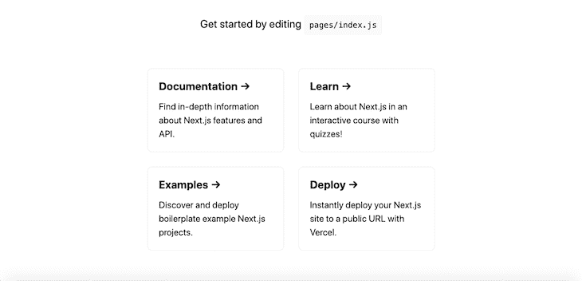
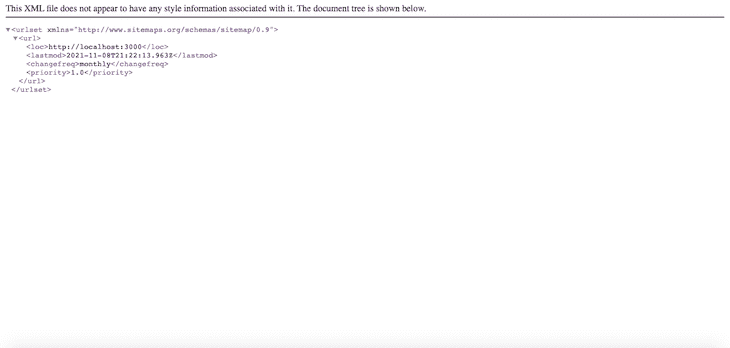
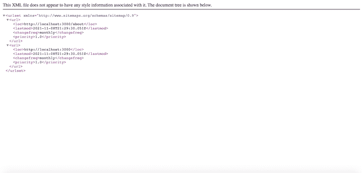

# 在 Next.js 中构建一个站点地图生成器

> 原文：<https://blog.logrocket.com/build-sitemap-generator-nextjs/>

Next.js 是最流行的 React 生产框架之一。凭借[路由预取和混合静态和服务器端渲染](https://blog.logrocket.com/prefetching-dynamic-routing-next-js/)等特性，Next.js 是优化生产中 React 应用的有效工具。

此外，Next.js 以部署技术[而闻名，这些技术解决了使用 React](https://blog.logrocket.com/new-features-in-next-js-11/) 构建 spa 的一些挑战。例如，Next.js 附带了静态站点生成、图像优化、快速刷新、自动内容缓存和文件系统路由等特性，这些特性在 React 中是没有的。

尽管是一个生产就绪的框架，但在 Next.js 中处理 SEO 并不那么简单。为了在我们的网页中实现有效的 SEO，我们首先需要了解 Next.js 如何处理页面渲染。处理 SEO 的一种流行方式是使用 sitemap，它是 web 应用程序中所有可见 URL 的集合。每个网站都需要一个网站地图来帮助像谷歌这样的搜索引擎更快地抓取和索引你的网站，提高搜索引擎优化，并给你一个更好的机会在搜索引擎结果页面上排名靠前。

在本教程中，我们将在 Next.js 中设置一个动态站点地图。

*   熟悉 CSS、HTML 和 JavaScript ES6
*   Node.js 和 Watchman 安装在您的开发机器上
*   用于测试的 iOS 模拟器或 Android 模拟器
*   安装在开发机器上的代码编辑器
*   对 React 和 React Native 的基本理解

我们开始吧！

## 安装和设置

首先，我们将创建一个新的 Next.js 项目，然后将其配置为在构建时为 Next.js 应用程序中的每个页面自动生成一个站点地图。

要初始化新项目，请导航到您的工作目录。然后，在终端或命令提示符下运行 Mac 或 Windows 各自的代码:

```
npx [email protected] next-sitemap
# or
yarn create next-app next-sitemap

```

上面的命令在`next-sitemap`文件夹中建立了一个新的 Next.js 项目。要确认安装成功，请在`next-sitemap`中运行以下代码:

```
npm run dev

```

应用程序预览应该类似于下面的截图:



随着我们新的 Next.js 应用程序的启动和运行，让我们构建我们的站点地图生成器，我们将使用它来为我们的网页生成站点地图。

## 构建站点地图生成器

为了构建我们的站点地图生成器，我们需要遍历 Next.js 文件系统，特别是 Next.js `pages`文件夹。我们将检索与`pages`文件夹中的文件相关联的所有文件路径，不包括`_api`和`_document`文件。

为此，我们将安装一个名为 [globby](https://www.npmjs.com/package/globby) 的包，它提供了扫描文件系统的方法，并返回与指定规则集匹配的路径名:

运行下面的代码来安装`globby`包:

```
npm i globby

```

### 设置`next-config.js`文件

一旦安装了 globby，用下面的代码更新`next-config.js`文件:

```
module.exports = {
...
  webpack: (config, { isServer }) => {
    if (isServer) {
      require("./scripts/sitemap-generator");
    }
    return config;
  },
};

```

`webpack`块扩展了 webpack 的配置，然后使用`isServer`检查 Next.js 配置是为客户端还是服务器端呈现执行的，在我们的例子中，T1 将总是返回`true`。

每次在服务器端执行`webpack`配置时，`next-config`文件都会执行`sitemap-generator`脚本。

### 设置站点地图生成器

接下来，在`next-sitemap`文件夹的根级别创建一个名为`scripts`的新文件夹。导航到新创建的文件夹，创建一个名为`sitemap-generator`的文件。

典型的站点地图模式如下所示:

```
 <url>
    <loc>http://website.com/page</loc>
    <lastmod>date created</lastmod>
    <changefreq>monthly</changefreq>
    <priority>1.0</priority>
</url>

```

为了管理我们项目中所有页面的列表，我们需要动态地获取页面并将它们放在`<loc></loc>`块中。将以下代码添加到`sitemap-generator`文件中:

```
const fs = require('fs')
const globby = require('globby')
function addPage(page) {
  const path = page.replace('pages', '').replace('.js', '').replace('.mdx', '')
  const route = path === '/index' ? '' : path
  return `  <url>
    <loc>${`${process.env.WEBSITE_URL}${route}`}</loc>
    <lastmod>${new Date().toISOString()}</lastmod>
    <changefreq>monthly</changefreq>
    <priority>1.0</priority>
  </url>`
}

```

在上面的代码中，`addPage`函数在`pages`文件夹中搜索所有的`.js`和`.mdx`文件，用一个空字符串替换它们的扩展名。现在，让我们创建一个新函数来生成实际的站点地图:

```
async function generateSitemap() {
  // excludes Nextjs files and API routes.
  const pages = await globby([
    'pages/**/*{.js,.mdx}',
    '!pages/_*.js',
    '!pages/api',
  ])
  const sitemap = `<?xml version="1.0" encoding="UTF-8"?>
  <urlset >
${pages.map(addPage).join('\n')}
</urlset>`
  fs.writeFileSync('public/sitemap.xml', sitemap)
}
generateSitemap()

```

我们创建了一个`generateSitemap`函数，以及一个`pages`常量来保存由`globby`生成的所有页面。最后，我们通过用`${pages.map(addPage).join('\n')}`映射每个页面，将所有页面呈现为站点地图。

接下来，为了测试应用程序，创建一个`.env`文件并添加下面的代码:

```
WEBSITE_URL=http://localhost:3000

```

## 测试站点地图生成器

现在我们已经完成了站点地图生成器的创建，让我们来看看站点地图的运行情况吧！运行下面的代码，为我们的项目启动 Next.js 开发服务器:

```
npm run dev

```

您可能会遇到下面的错误消息:

```
Error [ERR_REQUIRE_ESM]: require() of ES Module

```

这个错误来自我们之前安装的 globby 包。globby ≥v12.x 放弃了对 ES 模块导入和导出的支持。虽然我们可以考虑将导入更改为动态的`import()`，正如错误报告所建议的那样，但是这样做会导致 webpack 出现更复杂的错误。

我们最好的选择是使用 globby v11.0.1，它已经过本教程的测试。更新`package.json`文件中的 globby 包版本:

```
"globby": "^11.0.1"

```

接下来，运行以下命令:

```
npm i

```

再次运行`npm run dev`，你应该不会有任何错误。打开`public`文件夹，你应该看到一个新创建的`sitemap.xml`文件。

在您的网络浏览器中，访问`[http://localhost:3000/sitemap.xml](http://localhost:3000/sitemap.xml)`，您应该会看到类似下面截图的结果:



注意，我们在站点地图上只返回了一个页面 URL。当我们用站点地图生成器创建新页面时，它们会在构建时自动添加到站点地图中。

让我们用一个例子来证明这一点。在 pages 文件夹中创建一个名为`about.js`的新文件，并添加以下代码:

```
import React from 'react'
const About = () => {
    return (
        <>
        <Head>
        <title>About page</title>
        <meta name="description" content="This is the about page" />
        <link rel="icon" href="/favicon.ico" />
      </Head>
      <main>
        <h1>About</h1>
      </main>  
        </>
    )
}
export default About

```

现在，再次访问`[http://localhost:3000/sitemap.xml](http://localhost:3000/sitemap.xml)`，你的站点地图应该看起来像下面的截图:



您可以随意在应用中添加任意数量的页面。每个都会自动添加到站点地图中。

## 结论

SEO 是每个开发者都要考虑的重要因素。让你的网页更易于搜索引擎优化的一个方法是使用网站地图。在本教程中，我们在 Next.js 中构建了一个站点地图生成器，它可以为 web 应用程序中的每个页面自动生成一个站点地图。添加站点地图生成器可以帮助提升你在搜索引擎结果页面(SERP)上的排名，吸引更多的用户来浏览你的网站。我希望你喜欢这个教程！

## [LogRocket](https://lp.logrocket.com/blg/nextjs-signup) :全面了解生产 Next.js 应用

调试 Next 应用程序可能会很困难，尤其是当用户遇到难以重现的问题时。如果您对监视和跟踪状态、自动显示 JavaScript 错误以及跟踪缓慢的网络请求和组件加载时间感兴趣，

[try LogRocket](https://lp.logrocket.com/blg/nextjs-signup)

.

[](https://lp.logrocket.com/blg/nextjs-signup)[](https://lp.logrocket.com/blg/nextjs-signup)

LogRocket 就像是网络和移动应用的 DVR，记录下你的 Next.js 应用上发生的一切。您可以汇总并报告问题发生时应用程序的状态，而不是猜测问题发生的原因。LogRocket 还可以监控应用程序的性能，报告客户端 CPU 负载、客户端内存使用等指标。

LogRocket Redux 中间件包为您的用户会话增加了一层额外的可见性。LogRocket 记录 Redux 存储中的所有操作和状态。

让您调试 Next.js 应用的方式现代化— [开始免费监控](https://lp.logrocket.com/blg/nextjs-signup)。