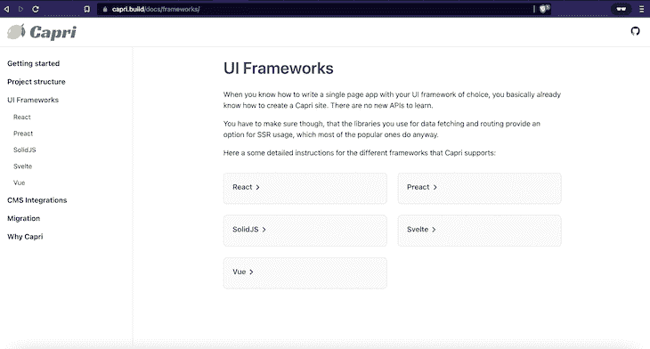
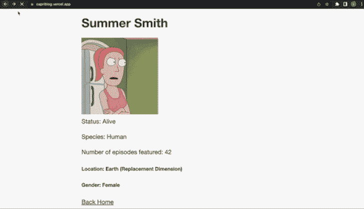

# 与卡普里一起创建一个 SSG 博客

> 原文：<https://blog.logrocket.com/build-ssg-blog-capri/>

使用静态站点生成器(SSG)的一个有趣的地方是能够轻松地运行应用程序并对其进行添加和更改。这使得它非常适合构建博客，因为博客会不断地添加和编辑文章。

在本文中，我们将使用 [Capri](https://capri.build/) ，一个静态站点生成器，它使用 islands 架构模型生成静态站点。

*向前跳转:*

## 卡普里岛是如何运作的？

通常，默认情况下，Capri 不向前端发送任何 JavaScript，只发送静态 HTML 和 CSS。为了处理 Capri 博客上的交互性和动态数据，我们需要通过使用一个`*island.*`后缀来增加它的水分。这意味着，如果您正在获取数据或处理与组件的交互，您可以将其命名为`componentname.island.jsx`。这个名称格式取决于我们使用的框架/库——例如，如果我们使用 Vue，它将是`componentname.island.vue`。

在我们需要在同一个组件中同时呈现静态和动态内容的情况下，或者当我们有一个将属性传递给静态组件的动态组件时，我们使用`*lagoon.*`后缀。这样做的目的是确保现场速度更快，仅在必要时对动态成分进行水合。

## 入门指南

让我们使用 React 和 Capri 来提升我们的博客。要触发快速启动，请在终端中运行以下命令:

```
npm init capri my-capri-site -- -e react

```

它在 React 中建立了一个样本 Capri 站点。我们将不得不删除样板代码，并为我们的项目添加自定义组件。

我们也可以将 Capri 与其他支持 SSR 的流行 UI 框架结合使用，比如 Vue、Svelte、Preact 等。：



你应该知道，Capri 提供了一个预览模式，可以在本地运行我们的应用程序时进行热重装。它在本地将我们的应用程序呈现为一个 SPA。

```
import { Navigate } from "react-router-dom";
/**
 * Handle preview requests like `/preview?slug=/about` by redirecting
 * to the given slug parameter.
 */
export default function Preview() {
  const url = new URL(window.location.href);
  const slug = url.searchParams.get("slug") ?? "/";
  return <Navigate to={slug} />;
}
/**
 * Component to display a banner when the site is viewed as SPA.
 */
export function PreviewBanner() {
  return <div className="banner">Preview Mode</div>;
}

// src/preview.tsx

```

我们将预览组件包装在`<App/>`组件周围:

```
import { StrictMode } from "react";
import ReactDOM from "react-dom/client";
import { BrowserRouter } from "react-router-dom";
import { App } from "./App";
import { PreviewBanner } from "./Preview.jsx";
ReactDOM.createRoot(document.getElementById("app")!).render(
  <StrictMode>
    <BrowserRouter basename={import.meta.env.BASE_URL}>
      <PreviewBanner />
      <App />
    </BrowserRouter>
  </StrictMode>
);

// src/main.tsx

```

因此，对于我们的服务器渲染，条目文件如下所示:

```
import { RenderFunction, renderToString } from "@capri-js/react/server";
import { StrictMode } from "react";
import { StaticRouter } from "react-router-dom/server.js";
import { App } from "./App";
export const render: RenderFunction = async (url: string) => {
  return {
    "#app": await renderToString(
      <StrictMode>
        <StaticRouter location={url} basename={import.meta.env.BASE_URL}>
          <App />
        </StaticRouter>
      </StrictMode>
    ),
  };
};

// src/main.server.tsx

```

另一件要注意的事情是 Capri 使用 Vite 开箱即用进行配置。

```
import capri from "@capri-js/react";
import react from "@vitejs/plugin-react";
import { defineConfig } from "vite";
export default defineConfig({
  plugins: [
    react(),
    capri({
      spa: "/preview",
    }),
  ],
});

```

最后，在我们的根文件夹中有根文件`index.html`:

```
<!DOCTYPE html>
<html lang="en">
  <head>
    <meta charset="UTF-8" />
    <meta name="viewport" content="width=device-width, initial-scale=1" />
    <link rel="icon" type="image/svg+xml" href="/src/capri.svg" />
  </head>
  <body>
    <div id="app"></div>
    <script type="module" src="/src/main.tsx"></script>
  </body>
</html>

```

## 建立我们的博客

我们将建立一个 Rick 和 Morty 的博客，每个帖子都包含了这个系列中角色的信息。



### 搭建主页

让我们建立我们的博客主页。在我们的`src`文件夹中创建一个`Home.tsx`文件。这是用户登陆博客后看到的第一页。这将是一个静态组件。

```
export default function Home() {
  return (
    <main>
      <h1>Welcome To Our Rick and Morty Blog</h1>
      <h5>
        Each blog post contains information about individual characters in the
        series.
      </h5>
      <Posts />
    </main>
  );
}

// src/Home.tsx

```

我们现在可以进入我们的`App.tsx`文件并导入我们的`Home.tsx`文件。

```
import "./App.css";
import { Suspense } from "react";
import Preview from "./Preview.jsx";
import { Route, Routes } from "react-router-dom";
import Home from "./Home";

export function App() {
  return (
    <Suspense fallback={<div>loading...</div>}>
      <Routes>
        <Route index element={<Home />} />
        <Route path="/preview" element={<Preview />} />
      </Routes>
    </Suspense>
  );
}

// src/App.tsx

```

我们使用 [React 路由器](https://blog.logrocket.com/migrating-react-router-v6-complete-guide/)和`[Suspense](https://17.reactjs.org/docs/concurrent-mode-suspense.html)`包装我们的组件，分别处理我们的应用程序的路由和数据获取。

### 显示帖子列表

接下来，我们需要显示文章列表。为此，让我们在一个名为`Posts.lagoon.tsx`的文件中创建一个`Posts`组件:

```
import { Link } from "react-router-dom";

export default function Posts() {
  const container = {
    display: "grid",
  };
  const containerItem = {
    paddingBottom: "3rem",
  };
  return (
    <div style={container}>
      {[...Array(10)].map((x, i) => (
        <div style={containerItem}>
          <Link to={`/post/${i + 1}`}>
            Post/{i + 1}
          </Link>
        </div>
      ))}
    </div>
  );
}

// Posts.lagoon.tsx

```

这里，我们遍历一个数组中的 10 个条目，显示 10 篇文章。每个条目都有一个`Link`(来自 React Router)，它使用动态参数将一个`id`传递给页面。我们将在本文的后面讨论这个`id`。

现在，让我们将`Posts.lagoon.tsx`组件导入到`Home.tsx`组件中。

```
import Posts from "./Posts.lagoon";

export default function Home() {
  return (
    <main>
      <h1>Welcome To Our Rick and Morty Blog</h1>
      <h5>
        Each blog post contains information about individual characters in the
        series.
      </h5>
      <Posts />
    </main>
  );
}

```

我们列出了十个邮件项目。如前所述，我们目前处于预览模式，因为我们仍然在本地运行应用程序。


然后，我们需要创建一个名为`PostItem.lagoon.tsx`文件的新组件来显示每篇文章。

```
import { Link, useParams } from "react-router-dom";
import axios from "axios";
import useSWR from "swr";
export default function PostItem() {
  let { id } = useParams();
  const url = `https://rickandmortyapi.com/api/character/${id}`;
  const fetcher = (url: string) =>
axios.get(url).then((res: any) => res.data);
  const { data, error } = useSWR(url, fetcher, { suspense: true });
  if (error) return <div>failed to load</div>;
  return (
    <main>
      <h1>{data.name}</h1>
      </img>
      <section>Status: {data.status}</section>
      <section>Species: {data.species}</section>
      <section>Number of episodes featured: {data.episode.length}</section>
      <section>
        <h5>Location: {data.location.name}</h5>
        <h5>Gender: {data.gender}</h5>
      </section>
      <Link to="/">Back Home</Link>
    </main>
  );
}

```

在这个组件中，我们将从`Posts.lagoon.tsx`中检索`id`。我们将利用 React 路由器实例中的`useParams`钩子从 URL 参数中获取当前的`id`。然后我们将把这个`id`添加到我们的 Rick 和 Morty 端点。

为了调用这个端点，我们将使用`[useSWR](https://blog.logrocket.com/swr-vs-tanstack-query-react/)`和[轴](https://blog.logrocket.com/how-to-make-http-requests-like-a-pro-with-axios/)。要使用它，我们必须安装两个软件包:

```
yarn add swr

yarn add axios

```

接下来，我们编写一个接收端点的`fetcher`函数，使用`axios`发出一个`GET`请求，并返回响应。

```
const fetcher = (url: string) =>
axios.get(url).then((res: any) => res.data);
const { data, error } = useSWR(url, fetcher, { suspense: true });

```

然后我们使用`useSWR`发出实际的请求。我们传入`fetcher`函数，并将`suspense`指定为`true`来处理我们的加载状态。

加载状态是我们等待端点响应时的临时时间范围。如果我们的请求按预期工作，我们将响应分配给`data`。如果有错误，我们将显示`<div>failed to load</div>`。

* * *

### 更多来自 LogRocket 的精彩文章:

* * *

之后，我们可以显示组件中的所有数据。我们还将添加一个`Link`，它将把我们带回到主页。

```
<main>
  <h1>{data.name}</h1>
  </img>
  <section>Status: {data.status}</section>
  <section>Species: {data.species}</section>
  <section>Number of episodes featured: {data.episode.length}</section>
  <section>
    <h5>Location: {data.location.name}</h5>
    <h5>Gender: {data.gender}</h5>
  </section>
  <Link to="/">Back Home</Link>
</main>

```

现在让我们将这个`PostItem.lagoon.tsx`组件作为路由导入到我们的`App.tsx`中。

```
import "./App.css";
import { Suspense } from "react";
import { Route, Routes } from "react-router-dom";
import Home from "./Home";
import Preview from "./Preview.jsx";
import PostItem from "./PostItem.lagoon";
export function App() {
  return (
    <Suspense fallback={<div>loading...</div>}>
      <Routes>
        <Route index element={<Home />} />
        <Route path="/preview" element={<Preview />} />
        <Route path="/post/:id" element={<PostItem />} />
      </Routes>
    </Suspense>
  );
}

// App.tsx

```

现场演示就在这里，而代码则在我的吉斯 [ub](https://github.com/Atanda1/capriblog) 上[托管。](https://github.com/Atanda1/capriblog)

## 结论

恭喜🎉。我们已经成功地从 Capri 开始，并在创纪录的时间内建立了我们自己的博客。

如果你正在寻找另一个项目，你可以将 Capri 的超能力与无头内容管理系统(CMS)合并，如 [Contentful](https://www.contentful.com/) 或 [Storyblok](https://www.storyblok.com/home) 。这些 CMS 充当我们数据的来源。您可以将数据上传到您首选的 CMS，并将其拉入您的 Capri 应用程序。

## 您是否添加了新的 JS 库来提高性能或构建新特性？如果他们反其道而行之呢？

毫无疑问，前端变得越来越复杂。当您向应用程序添加新的 JavaScript 库和其他依赖项时，您将需要更多的可见性，以确保您的用户不会遇到未知的问题。

LogRocket 是一个前端应用程序监控解决方案，可以让您回放 JavaScript 错误，就像它们发生在您自己的浏览器中一样，这样您就可以更有效地对错误做出反应。

[](https://lp.logrocket.com/blg/javascript-signup)[https://logrocket.com/signup/](https://lp.logrocket.com/blg/javascript-signup)

[LogRocket](https://lp.logrocket.com/blg/javascript-signup) 可以与任何应用程序完美配合，不管是什么框架，并且有插件可以记录来自 Redux、Vuex 和@ngrx/store 的额外上下文。您可以汇总并报告问题发生时应用程序的状态，而不是猜测问题发生的原因。LogRocket 还可以监控应用的性能，报告客户端 CPU 负载、客户端内存使用等指标。

自信地构建— [开始免费监控](https://lp.logrocket.com/blg/javascript-signup)。