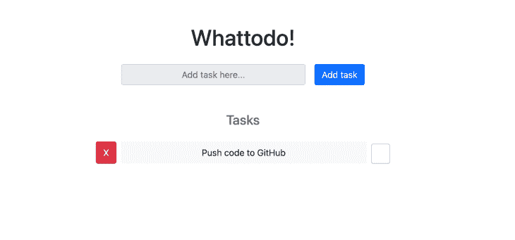

# 用 SolidJS 和 TypeScript 构建一个任务跟踪器

> 原文：<https://blog.logrocket.com/build-task-tracker-solidjs-typescript/>

SolidJS 正迅速成为 web 开发社区关注的焦点。凭借其简单的状态管理、细粒度的反应能力和高性能，SolidJS 为其他 JavaScript 框架奠定了基础。

SolidJS 是 React 开发人员一直在寻求的一切，在本文中，我将带您通过 SolidJS 构建一个任务跟踪器。我们将讨论以下主题:

### 先决条件

要学习本教程，您需要了解 JavaScript 和 TypeScript、Node.js 模块以及前端框架中的组件。

## 为什么是 SolidJS？

如果你以前用过 React，SolidJS 看起来会很熟悉。当 React Hooks 首次发布时，我非常高兴，因为我认为它将解决我们的国家管理危机。钩子使得组件中的本地状态管理变得更容易，但是全局状态管理仍然很复杂。

断开连接的组件共享数据仍然很困难，许多库出现试图解决状态管理问题——这增加了开发疲劳，并给我们的代码库增加了不必要的复杂性。

我也看到同样的问题发生在其他前端框架中；好像全局状态管理是事后才想到的，而不是从一开始就计划好的。

有了 SolidJS，事情就不一样了。全局状态管理就像创建状态并导出它一样简单。不需要任何复杂的设置或第三方库。

SolidJS 还使用 JSX，这是流行的 JavaScript 的类似 HTML 的语法扩展。这使得处理 UI 逻辑、事件和状态更改变得简单明了。此外，SolidJS 编译成普通的 JavaScript，因此不需要虚拟 DOM，这使得它比 React 和 Angular 等框架相对更快。

SolidJS 也有一个简单的工作流程。组件只呈现一次，就像在 JavaScript 中一样，所以更容易预测代码的结果。

SolidJS 的另一个巨大优势是，它建立在其他 web 框架的基础上，因此它自豪地模仿好的部分，并改进不太好的部分。

让我们继续设置我们的 SolidJS 应用程序，一步一步地学习如何使用 SolidJS 构建 web 应用程序。

## 使用 typescript 设置实体应用程序

要在本地机器上设置 SolidJS 应用程序，您需要安装 [Node.js](https://nodejs.org/en/) 。如果您已经安装了它，那么在您的终端上运行以下命令应该会返回您当前的 Node.js 版本:

```
node --version

```

接下来，让我们通过在终端上运行以下命令来创建一个新的 SolidJS 应用程序:

```
npx degit solidjs/templates/ts task-tracker

```

使用`solidjs/templates/ts`生成一个 Solid/TypeScript app。对于 JavaScript，您必须将命令改为`solidjs/templates/js`。

运行该命令后，您应该会看到如下所示的成功消息:

```
> cloned solidjs/templates#HEAD to task-tracker

```

现在，在您选择的代码编辑器或 IDE 中打开生成的应用程序。应用程序结构应该是这样的:


注意，我们的 SolidJS 应用程序使用 [Vite](https://blog.logrocket.com/getting-started-with-vite/) 作为它的默认构建工具，使用 [pnpm](https://blog.logrocket.com/javascript-package-managers-compared/) 作为默认的包管理器。这些工具相结合，为组件渲染、应用启动时间和包管理提供了出色的开发体验。

我们的应用程序组件目前位于`./src/App.tsx`文件中:

```
import type { Component } from 'solid-js'
...
const App: Component = () => {
  return (
    <div>
      ...
    </div>
  );
}

export default App

```

首先，我们从`solid-js`导入`Component`类型，然后将其用作我们的`App`组件的类型。

SolidJS 中的组件是 JavaScript 函数。它们是可重用的，并且可以使用 props 进行定制，props 类似于函数参数/自变量。

在`./src/index.tsx`文件中，我们呈现了我们的`App`组件:

```
import { render } from 'solid-js/web'
import App from './App'

render(() => <App />, document.getElementById('root') as HTMLElement)

```

来自`solid-js/web`的`render()`方法需要两个参数:

1.  一个返回我们的`<App />`组件的函数
2.  HTML 元素

当您导航到`./index.html`文件时，您将通过`<script />`标签看到根`div`和我们的`./src/index.tsx`文件的使用:

```
...
<body>
  <noscript>You need to enable JavaScript to run this app.</noscript>
  <div id="root"></div>
  <script src="/src/index.tsx" type="module"></script>
</body>

```

要运行我们的 SolidJS 应用程序，我们必须首先通过在终端上运行命令`pnpm install`来安装我们的包，然后在开发模式下运行`pnpm dev`来启动我们的应用程序。您应该会看到如下所示的成功消息:

```
 vite v2.9.9 dev server running at:

 > Local: http://localhost:3001/
 > Network: use `--host` to expose

 ready in 378ms.

```

当您导航到`[http://localhost:3001](http://localhost:3001)`或终端上显示的 URL 时，您应该会看到如下页面:


### 安装 bootstrap 来设计我们的 solids 应用程序

现在我们已经成功地设置了 SolidJS 应用程序，让我们安装 Bootstrap 进行样式化，这样我们就不必为 CSS 而烦恼了。

要安装引导程序，请在终端上运行以下命令:

```
pnpm install bootstrap

```

接下来，我们将使用以下代码行在我们的`./src/index.tsx`文件中导入引导程序:

```
import 'bootstrap/dist/css/bootstrap.min.css'

```

我们也可以删除当前的`./index.css`导入，因为我们不再需要它。我们的`index.tsx`文件现在应该是这样的:

```
import { render } from 'solid-js/web'
import App from './App'
import 'bootstrap/dist/css/bootstrap.min.css'

render(() => <App />, document.getElementById('root') as HTMLElement)

```

## 利用 JSX 构建我们的任务跟踪器

让我们用 JSX 来构建我们的任务跟踪器。在`./src/App.tsx`文件中，用以下内容替换您当前拥有的内容:

```
import type { Component } from 'solid-js'

const App: Component = () => {
  return (
    <div class="container mt-5 text-center">
      <h1 class="mb-4">Whattodo!</h1>

      <form class="mb-5 row row-cols-2 justify-content-center">
        <input type="text" class="input-group-text p-1 w-25" placeholder="Add task here..." id="taskInput" required />

        <button class="btn btn-primary ms-3 w-auto" type="submit">
          Add task
        </button>
      </form>

      <div>
        <h4 class="text-muted mb-4">Tasks</h4>
        <div class="row row-cols-3 mb-3 justify-content-center">
          <button class="btn btn-danger w-auto">X</button>
          <div class="bg-light p-2 mx-2">Push code to GitHub</div>
          <input type="checkbox" role="button" class="form-check-input h-auto px-3" />
        </div>
      </div>
    </div>
  )
}
export default App

```

我们的 JSX 代码包含输入新任务的表单和任务部分。目前，我们使用硬编码数据，但我们将学习如何使我们的应用程序动态化，以便当用户在表单中输入新任务并单击**提交**按钮时，我们的 SolidJS 应用程序会使用新数据进行更新。

当您返回浏览器时，您的页面现在应该是这样的:



接下来，让我们学习如何在 SolidJS 中创建和管理状态。我们将通过创建一个`taskList`状态来做到这一点，我们还将创建向状态添加新任务、删除它们以及更新它们的完成状态的函数。

## 创建和更新实体中的状态

SolidJS 有一个`createSignal`钩子来创建状态。例如，让我们创建一个`taskList`状态来存放我们的任务。在`./src/App.tsx`文件中，我们将首先为每个任务创建一个类型:

```
const App: Component = () => {
  type Task = {
    text: string
    text: string
    completed: boolean
  }

  return (...)
}

```

接下来，我们将创建我们的`taskList`状态:

```
import { Component, createSignal } from 'solid-js'

...
const [taskList, setTaskList] = createSignal([] as Task[])
...

```

`createSignal()`钩子返回一个包含两个变量的数组，`taskList`和`setTaskList`。与你将在 React 钩子上看到的不同，这两个变量都是函数。我们调用`taskList()`函数来访问我们的任务数据，调用`setTaskList()`函数来更新我们的`taskList`状态。

### 向我们的状态添加任务

现在我们已经创建了我们的`taskList`状态，让我们创建一个向我们的状态添加任务的函数。我们将其命名为`addTask`:

```
const [taskList, setTaskList] = createSignal([] as Task[])

const addTask = (e: Event) => {
  e.preventDefault()

  const taskInput = document.querySelector('#taskInput') as HTMLInputElement

  const newTask: Task = {
    id: Math.random().toString(36).substring(2),
    text: taskInput.value,
    completed: false,
  }

  setTaskList([newTask, ...taskList()])
  taskInput.value = ''
}

```

在我们的`addTask()`函数中，我们已经开始使用`e.preventDefault()`方法来防止提交表单时的默认重载行为。我们还从 ID 为“taskInput”的`<input />`元素中获取了我们的`taskInput`。

对于每个新任务，我们创建一个名为`newTask`的对象，它具有属性`id`、`text`和`completed`。当创建一个新任务时，我们的函数将使用`Math.random()`方法为我们的任务 ID 生成一个随机字符串，并将默认的`completed`值设置为`false`。

最后，`setTaskList()`函数将被调用，使用一个数组作为它的参数，将当前的`taskList`状态添加到`newTask`中。

让我们也创建一个删除任务的函数:

```
...
const deleteTask = (taskId: string) => {
  const newTaskList = taskList().filter((task) => task.id !== taskId)
  setTaskList(newTaskList)
}

```

当我们使用任务 ID 作为参数调用我们的`deleteTask()`函数时，它将过滤我们的`taskList`状态，并返回除了具有我们想要删除的 ID 的任务之外的每个任务。然后，将以新的任务列表作为参数调用`setTaskList()`方法。

为了使用我们的`addTask()`函数，我们将向 JSX 代码中的`<form />`标签添加一个`onSubmit`事件监听器，每当单击提交按钮时，它将调用我们的函数。

```
...
return (
 <div class="container mt-5 text-center">
    <h1 class="mb-4">Whattodo!</h1>
    <form class="mb-5 row row-cols-2 justify-content-center" onSubmit={(e) => addTask(e)}>
     ...
    </form>
  </div>
)

```

接下来，让我们看看每当用户添加新任务时，我们如何在应用程序中显示我们的`taskList`数据。

## 控制 SolidJS 中的流程和数据循环

SolidJS 有一个用于循环数据的`<For />`组件。虽然 JavaScript `Array.map()`方法可以工作，但是当它被更新时，我们的组件将总是映射`taskList`状态。使用`<For />`组件，我们的应用程序将只更新 DOM 中需要更新的部分。

让我们将任务`div`中现有的内容替换为:

```
...
<div>
  <h4 class="text-muted mb-4">Tasks</h4>
  <For each={taskList()}>
    {(task: Task) => (
      <div class="row row-cols-3 mb-3 justify-content-center">
        <button class="btn btn-danger w-auto">X</button>
        <div class="bg-light p-2 mx-2">{task.text}</div>
        <input type="checkbox" checked={task.completed} role="button" class="form-check-input h-auto px-3" />
      </div>
    )}
  </For>
</div>
...

```

注意我们是如何将`taskList`包装在`<For />`组件中的。我们还从参数`task`中将任务文本从“将代码推送到 GitHub”更新为`task.text`。

我们现在可以继续使用我们之前创建的`deleteTask()`方法。我们将向**删除**按钮添加一个`onClick`事件监听器:

```
...
<button class="btn btn-danger w-auto" onclick={() => deleteTask(task.id)}>
  X
</button>
...

```

如果我们转到我们的浏览器，我们的 SolidJS 应用程序现在应该这样工作:


## 更新嵌套状态中的任务状态

SolidJS 有一个用于创建和管理嵌套状态的`createStore()`钩子。但是在我们谈论它之前，让我们看看如何在我们的`createSignal()`状态中对预先存在的任务进行更新。我们将在`deleteTask()`函数下创建一个名为`toggleStatus`的新函数:

```
...
const toggleStatus = (taskId: string) => {
  const newTaskList = taskList().map((task) => {
    if (task.id === taskId) {
      return { ...task, completed: !task.completed }
    }
    return task
  })
  setTaskList(newTaskList)
}

```

我们的`toggleStatus()`函数需要一个`taskId`参数，我们将使用它来获取我们想要标记为完成或未完成的特定任务。我们还使用了`map()`方法来遍历我们的`taskList`状态，如果我们找到与参数`taskId`具有相同 ID 的任务，我们将把它的`completed`属性改为与当前相反的属性。所以，如果`true`，我们就做成`false`，如果`false`，`true`。

最后，我们使用`setTaskList()`方法用新的`taskList`数据更新`taskList`状态。

在我们使用`toggleStatus()`函数之前，让我们在 JSX 代码中添加一个已完成任务和未完成任务的区别。如果任务文本的`completed`属性为`true`，我们将为其添加引导类*“文本-装饰-线条-穿透文本-成功”*。在我们的 JSX 代码中，就在**删除**按钮下面，让我们将任务文本`div`更新为:

```
<div class={`bg-light p-2 mx-2 ${task.completed && 'text-decoration-line-through text-success'}`}>
  {task.text}
</div>

```

接下来，我们将向 checkbox 输入标签添加一个`onClick`事件监听器，每当它被点击时，我们将调用`toggleStatus()`方法:

```
<input
  type="checkbox"
  checked={task.completed}
  role="button"
  class="form-check-input h-auto px-3"
  onClick={() => {
    toggleStatus(task.id)
  }}
/>

```

我们的`<App />`组件返回的 JSX 代码应该是这样的:

```
<div class="container mt-5 text-center">
      <h1 class="mb-4">Whattodo!</h1>
      <form class="mb-5 row row-cols-2 justify-content-center" onSubmit={(e) => addTask(e)}>
        <input type="text" class="input-group-text p-1 w-25" placeholder="Add task here..." id="taskInput" required />
        <button class="btn btn-primary ms-3 w-auto" type="submit">
          Add task
        </button>
      </form>
      <div>
        <h4 class="text-muted mb-4">Tasks</h4>
        <For each={taskList()}>
          {(task: Task) => (
            <div class="row row-cols-3 mb-3 justify-content-center">
              <button class="btn btn-danger w-auto" onclick={() => deleteTask(task.id)}>
                X
              </button>
              <div class={`bg-light p-2 mx-2 ${task.completed && 'text-decoration-line-through text-success'}`}>
                {task.text}
              </div>
              <input
                type="checkbox"
                checked={task.completed}
                role="button"
                class="form-check-input h-auto px-3"
                onClick={() => {
                  toggleStatus(task.id)
                }}
              />
            </div>
          )}
        </For>
      </div>
    </div>

```

当我们转到浏览器时，我们的 SolidJS 应用程序应该能够像这样工作:


## 将`createStore`用于 SolidJS 中的嵌套反应性

在总结之前，让我们看看如何使用 SolidJS 中的`createStore`钩子来创建和更新嵌套状态。我们可以直接使用 ID 更新需要更新的任务，而不是映射我们的状态，创建一个新的任务列表，并用新列表替换我们所有的状态数据。

为了使用`createStore`钩子，我们将首先从`solid-js/store`导入它:

```
import { createStore } from 'solid-js/store'

```

注意`createSignal`是从`solid-js`导入的，而`createStore`是从`solid-js/store`导入的。

接下来，我们将把我们的`taskList`状态创建更新为:

```
const [taskList, setTaskList] = createStore([] as Task[])

```

我们用`createStore()`钩子创建的商店不是一个函数，不像用`createSignal()`钩子创建的商店。因此，我们将在代码中修改所有的`taskList`实例，只修改为`taskList`，而不是`taskList()`。第二个变量`setTaskList`仍然是一个函数，我们将使用它来更新我们的商店。

让我们继续使用`setTaskList()`方法来修改`toggleStatus()`函数:

```
const toggleStatus = (taskId: string) => {
  setTaskList(
    (task) => task.id === taskId,
    'completed',
    (completed) => !completed,
  )
}

```

在`toggleStatus()`函数中，我们向`setTaskList()`方法传递三个参数:

1.  获取我们想要更新的特定任务的函数。在我们的例子中，我们返回与参数`taskId`具有相同 id 的任务
2.  我们要修改的属性— `completed`
3.  对于第三个参数，我们将传递另一个函数，该函数接受我们选择的属性的当前值并返回一个新值。在这里，我们返回的是与当前相反的东西

当我们回到浏览器时，我们的应用程序应该仍能像预期的那样工作:


## 结论

在本文中，我们已经通过构建一个任务跟踪器介绍了 SolidJS 的基础知识。与 Angular 和 React 等其他前端框架相比，Solid 构建 web 应用程序的方法令人印象深刻，也相对简单。由于直接编译到真实的 DOM 节点，并且不需要虚拟 DOM，用 SolidJS 构建的 web 应用程序具有不寻常的快速优势。

也就是说，SolidJS 仍然是新的，与 React、Vue 和 Angular 等框架相比，它的生态系统和社区都很小，所以很有可能你会首先遇到问题或需要特定的功能、库或集成。但是 SolidJS 发展很快，很多人已经开始将现有的应用移植到这个框架中。SolidJS 社区反应相当迅速，当你需要帮助的时候，你应该不会有任何问题。

你可以在我的 GitHub 上找到我们的任务跟踪器的 [repo。我在 YouTube 频道上也有一个](https://github.com/ebenezerdon/solid-task-tracker) [SolidJS 速成班](https://youtu.be/WDodWU-B-aY)，我很想让你看看。如果你想保持联系，可以考虑在 [LinkedIn](https://linkedin.com/in/ebenezerdon) 上关注我。继续建！

## [LogRocket](https://lp.logrocket.com/blg/typescript-signup) :全面了解您的网络和移动应用

[](https://lp.logrocket.com/blg/typescript-signup)

LogRocket 是一个前端应用程序监控解决方案，可以让您回放问题，就像问题发生在您自己的浏览器中一样。LogRocket 不需要猜测错误发生的原因，也不需要向用户询问截图和日志转储，而是让您重放会话以快速了解哪里出错了。它可以与任何应用程序完美配合，不管是什么框架，并且有插件可以记录来自 Redux、Vuex 和@ngrx/store 的额外上下文。

除了记录 Redux 操作和状态，LogRocket 还记录控制台日志、JavaScript 错误、堆栈跟踪、带有头+正文的网络请求/响应、浏览器元数据和自定义日志。它还使用 DOM 来记录页面上的 HTML 和 CSS，甚至为最复杂的单页面和移动应用程序重新创建像素级完美视频。

[Try it for free](https://lp.logrocket.com/blg/typescript-signup)

.