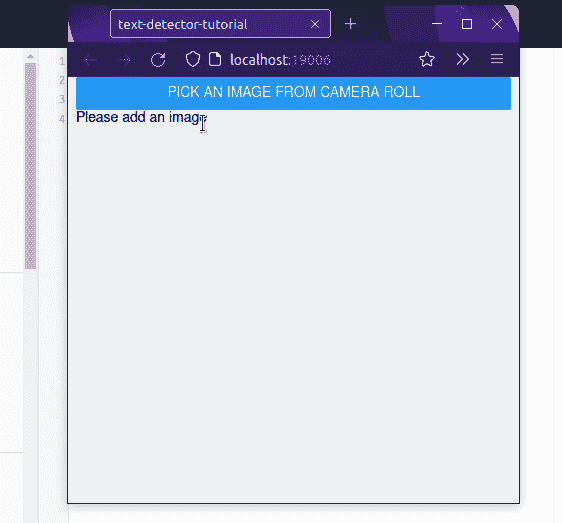
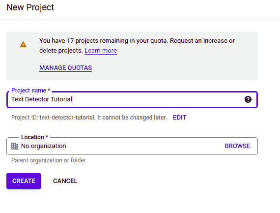
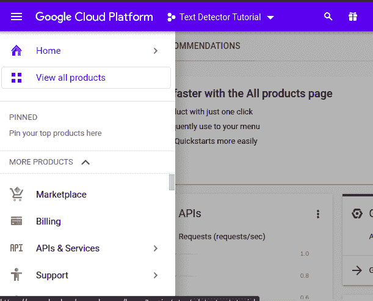
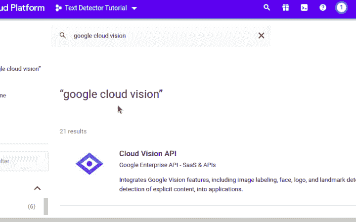
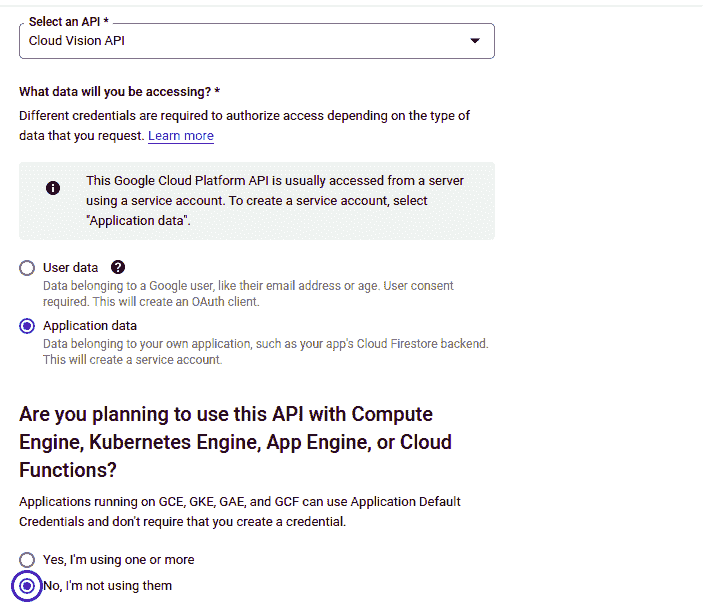
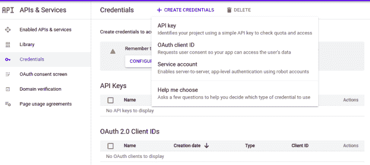
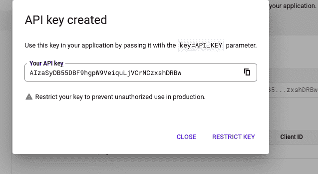
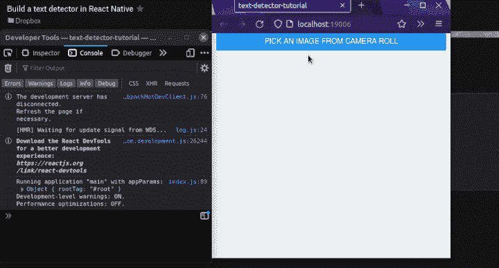
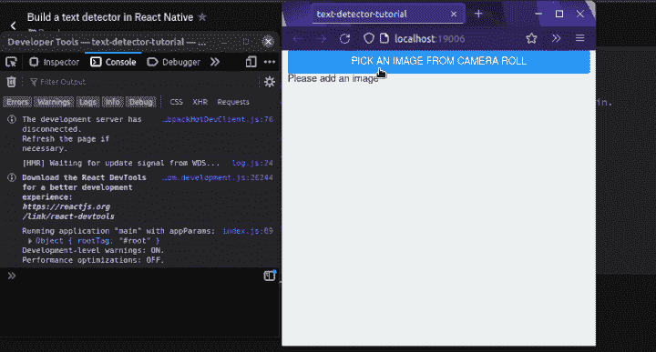

# 在 React Native - LogRocket 博客中构建一个文本检测器

> 原文：<https://blog.logrocket.com/build-text-detector-react-native/>

假设你在一家银行工作，你需要将客户表格中的数据输入电脑。要实现这一点，您必须执行以下操作:

*   输入客户的姓名和个人详细信息
*   此外，仔细检查您是否正确输入了他们的数据。这将防止人为错误
*   最后，验证输入的数据是否在正确的字段中

虽然这个解决方案可能有效，但想想这种情况:如果您的银行每天都收到数百份表格，该怎么办？因此，这会让你的工作更加乏味和紧张。那么，我们如何解决这个问题呢？

这就是 [OCR](https://docs.microsoft.com/en-us/azure/cognitive-services/computer-vision/overview-ocr) (文本检测)的用武之地。这是一种使用算法从图像中高精度获取文本的技术。使用文本识别，您可以简单地对用户的表单拍照，然后让计算机为您填写数据。结果，这会让你的工作更容易，不那么无聊。在本文中，我们将使用[谷歌的视觉 API](https://cloud.google.com/vision/) 在 React Native 中构建一个文本检测器。

这将是本文的结果:



以下是我们将采取的步骤:

我们开始吧！

## 使用谷歌云视觉

在本节中，您将学习如何为您的项目激活 Google 的文本检测 API。

首先，导航到[谷歌云控制台](https://console.cloud.google.com/)，点击`New Project` :


接下来，我们现在需要告诉 Google 我们需要使用 Cloud Vision API。为此，点击**市场**:



完成后，搜索**云视觉 API** 并启用它，如下所示:



太好了！我们现在已经启用了这个 API。然而，出于授权的目的，Google 要求我们创建一个 API 密钥。为此，点击**创建凭证**:


在**凭证**菜单中，确保选中以下选项:



接下来，点击**完成**。这将带您进入仪表板页面。在这里，点击**创建凭证**，然后点击 **API 键**。



因此，程序现在会给你一个 API 密匙。将这段代码复制到一个文件或某个安全的地方。



恭喜你！我们现在已经完成了第一步。让我们现在写一些代码！

## 构建我们的项目

### 项目创建

要使用 Expo CLI 初始化存储库，请运行以下终端命令:

```
expo init text-detector-tutorial

```

世博会现在将提示您选择一个模板。在这里，选择显示`minimal`的选项:


### 模块安装

对于这个应用程序，我们将让客户从他们的相机胶卷中挑选照片。为此，我们将使用`expo-image-picker`模块:

```
npm i expo-image-picker

```

### 编码我们的效用函数

创建一个名为`helperFunctions.js`的文件。顾名思义，这个文件将包含我们将在整个项目中使用的实用函数。

在`helperFunctions.js`中，开始编写以下代码:

```
//file name: helperFunctions.js
const API_KEY = 'API_KEY_HERE'; //put your key here.
//this endpoint will tell Google to use the Vision API. We are passing in our key as well.
const API_URL = `https://vision.googleapis.com/v1/images:annotate?key=${API_KEY}`;
function generateBody(image) {
  const body = {
    requests: [
      {
        image: {
          content: image,
        },
        features: [
          {
            type: 'TEXT_DETECTION', //we will use this API for text detection purposes.
            maxResults: 1,
          },
        ],
      },
    ],
  };
  return body;
}

```

这个片段中的一些关键概念:

*   `API_KEY`常量将包含您的 API 密钥。这对于在我们的应用中整合谷歌的云视觉 API 是必要的
*   后来，我们创建了一个`generateBody`函数，它将为我们的请求生成一个有效载荷。React Native 将把这个有效负载发送给 Google，用于 OCR 目的
*   此外，该方法还接受一个`image`参数。这将包含所需图像的 base64 编码数据

在此步骤之后，将以下代码添加到`helperFunctions.js`:

```
//file: helperFunctions.js
async function callGoogleVisionAsync(image) {
  const body = generateBody(image); //pass in our image for the payload
  const response = await fetch(API_URL, {
    method: 'POST',
    headers: {
      Accept: 'application/json',
      'Content-Type': 'application/json',
    },
    body: JSON.stringify(body),
  });
  const result = await response.json();
  console.log(result);
}
export default callGoogleVisionAsync;

```

让我们一段一段地分解这段代码:

*   首先，我们使用`generateBody`函数生成一个有效载荷
*   稍后，程序向 Google 的 API 提交一个`POST`请求，并将有效载荷作为请求发送出去
*   最后，我们将服务器的响应输出到控制台

### 构建我们的图像拾取器组件

创建一个名为`ImagePickerComponent.js`的新文件。这个文件将负责让用户从他们的图库中选择一张照片。

在`ImagePickerComponent.js,`中编写以下代码:

```
import * as ImagePicker from 'expo-image-picker';
import React, { useState, useEffect } from 'react';
import { Button, Image, View, Text } from 'react-native';

function ImagePickerComponent({ onSubmit }) {
  const [image, setImage] = useState(null);
  const [text, setText] = useState('Please add an image');

  const pickImage = async () => {
    let result = await ImagePicker.launchImageLibraryAsync({
      mediaTypes: ImagePicker.MediaTypeOptions.All,
      base64: true, //return base64 data.
      //this will allow the Vision API to read this image.
    });
    if (!result.cancelled) { //if the user submits an image,
      setImage(result.uri);
      //run the onSubmit handler and pass in the image data. 
      const googleText = await onSubmit(result.base64);
    }
  };
  return (
    <View>
      <Button title="Pick an image from camera roll" onPress={pickImage} />
      {image && (
        <Image
          source={{ uri: image }}
          style={{ width: 200, height: 200, resizeMode:"contain" }}
        />
      )}
    </View>
  );
}
export default ImagePickerComponent;

```

下面简单解释一下:

*   在初始化`ImagePickerComponent`之后，我们创建了`pickImage`函数，它将提示用户选择一个文件
*   如果用户提交一个图像，程序将运行`onSubmit`处理程序，并将图像的 base64 数据传递给这个函数
*   此外，提交后，应用程序将显示图像到用户界面

留给我们的就是渲染我们定制的[图像拾取器](https://blog.logrocket.com/how-to-build-an-image-picker-using-react-native-image-crop-picker/)组件。为此，在`App.js`中编写以下代码:

```
import ImagePickerComponent from "./ImagePickerComponent";

return (
  <View>
    <ImagePickerComponent onSubmit={console.log} />
  </View>
);

```

这里，我们正在呈现我们的`ImagePickerComponent`模块，并传入我们的`onSubmit`处理程序。这将把所选图像的编码数据记录到控制台。

使用以下 Bash 命令运行应用程序:

```
expo start

```


我们的代码有效！在下一节中，我们将使用 Google Vision 的强大功能在我们的应用程序中实现 OCR。

### 将谷歌云视觉与图像拾取器连接

在`App.js`中编辑以下代码:

```
import callGoogleVisionAsync from "./helperFunctions.js";
 //code to find:
return (
  <View>
    {/*Replace the onSubmit handler:*/}
    <ImagePickerComponent onSubmit={callGoogleVisionAsync} />
  </View>
);

```

在这个代码片段中，我们用`callGoogleVisionAsync`替换了`onSubmit`处理程序。因此，这会将用户的输入发送到 Google 服务器进行 OCR 操作。

这将是输出:



请注意，程序现在成功地从图像中获取了文本。这意味着我们的代码是成功的！

最后一步，将这段代码附加到`callGoogleVisionAsync`的末尾:

```
//file: helperFunctions.js. 
//add this code to the end of callGoogleVisionAsync function
const detectedText = result.responses[0].fullTextAnnotation;
return detectedText
  ? detectedText
  : { text: "This image doesn't contain any text!" };

```

这告诉程序首先检查是否有有效的响应。如果满足这个条件，那么函数将返回提取的文本。否则，将会引发错误。

最终，您完整的`callGoogleVisionAsync`函数应该是这样的:

```
//file: helperFunctions.js
async function callGoogleVisionAsync(image) {
  const body = generateBody(image);
  const response = await fetch(API_URL, {
    method: "POST",
    headers: {
      Accept: "application/json",
      "Content-Type": "application/json",
    },
    body: JSON.stringify(body),
  });
  const result = await response.json();
  console.log(result);
  const detectedText = result.responses[0].fullTextAnnotation;
  return detectedText
    ? detectedText
    : { text: "This image doesn't contain any text!" };
}

```

### 将 OCR 数据呈现到用户界面

现在我们已经在程序中实现了 OCR，剩下的就是在 UI 中显示图像的文本。

在`ImagePickerComponent.js`中找到并编辑以下代码:

```
//code to find:
if (!result.cancelled) {
  setImage(result.uri);
  setText("Loading.."); //set value of text Hook
  const responseData = await onSubmit(result.base64);
  setText(responseData.text); //change the value of this Hook again.
}
//extra code removed for brevity
//Finally, display the value of 'text' to the user
return (
  <View>
    <Text>{text}</Text>
    {/*Further code..*/}
  </View>
);

```

*   当用户选择了一个图像时，将`text`钩子的值设置为响应数据
*   最后，显示`text`变量的值



我们完事了。

最后，你的`ImagePickerComponent`应该是这样的:

```
function ImagePickerComponent({ onSubmit }) {
  const [image, setImage] = useState(null);
  const [text, setText] = useState("Please add an image");
  const pickImage = async () => {
    let result = await ImagePicker.launchImageLibraryAsync({
      mediaTypes: ImagePicker.MediaTypeOptions.All,
      base64: true,
    });
    if (!result.cancelled) {
      setImage(result.uri);
      setText("Loading..");
      const responseData = await onSubmit(result.base64);
      setText(responseData.text);
    }
  };
  return (
    <View>
      <Button title="Pick an image from camera roll" onPress={pickImage} />
      {image && (
        <Image
          source={{ uri: image }}
          style={{ width: 400, height: 300, resizeMode: "contain" }}
        />
      )}
      <Text>{text}</Text>
    </View>
  );
}

```

**结论**

这里是这篇文章的源代码。

在本文中，您学习了如何在您的项目中使用 Google Cloud Vision，以及如何[实现文本检测功能](https://blog.logrocket.com/how-to-extract-text-from-an-image-using-javascript-8fe282fb0e71/)。除了数据输入，我们还可以在多种情况下使用我们全新的 OCR 应用程序，例如:

*   零售和营销:超市使用文本检测技术扫描和存储折扣券。在这里，OCR 程序扫描文本并检查优惠券是否可用
*   业务:当用户将数据写在纸质文档上时，政府机构使用 OCR 将记录数字化。在这个用例中，软件首先扫描客户端数据并验证它，以确保用户遵循了给定的格式

如果您遇到任何困难，我鼓励您尝试并解构这些代码，以便您可以完全理解其内部工作原理。

非常感谢你坚持到最后！编码快乐！

## [LogRocket](https://lp.logrocket.com/blg/react-native-signup) :即时重现 React 原生应用中的问题。

[](https://lp.logrocket.com/blg/react-native-signup)

[LogRocket](https://lp.logrocket.com/blg/react-native-signup) 是一款 React 原生监控解决方案，可帮助您即时重现问题、确定 bug 的优先级并了解 React 原生应用的性能。

LogRocket 还可以向你展示用户是如何与你的应用程序互动的，从而帮助你提高转化率和产品使用率。LogRocket 的产品分析功能揭示了用户不完成特定流程或不采用新功能的原因。

开始主动监控您的 React 原生应用— [免费试用 LogRocket】。](https://lp.logrocket.com/blg/react-native-signup)