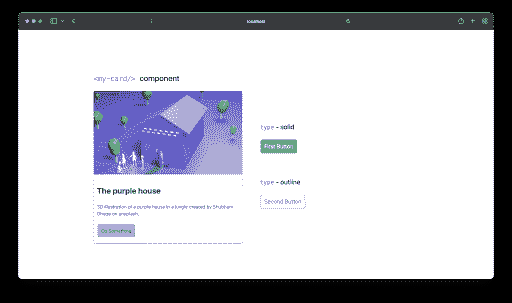
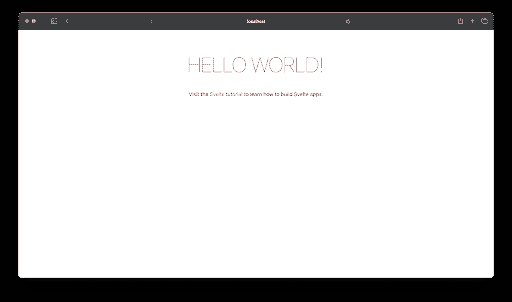
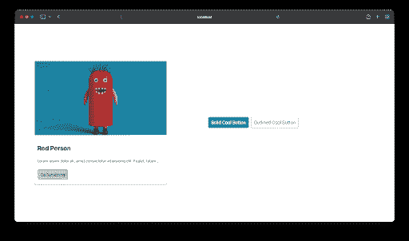

# 用 svelet-log rocket 博客构建 web 组件

> 原文：<https://blog.logrocket.com/build-web-components-svelte/>

## 介绍

每个开发人员都应该关注代码中的可重用性和关注点分离，因为它们有助于保持我们项目的正式性，并将业务逻辑与应用基础设施分离。

Web 组件更进一步，它允许我们创建与代码其余部分隔离的可重用组件。

这篇文章将带你了解用 Svelte 创建通用 web 组件的过程。通用的意思是，组件不仅限于你的苗条的应用程序，还可以在任何 JavaScript 应用程序(Vue，React 等)中重用。).我们还将讨论使用 Svelte 创建 web 组件的一些主要缺点。

首先，让我们了解更多关于 web 组件的知识。

## 什么是 web 组件？

Web 组件允许我们使用封装的样式和功能创建可重用的自定义 HTML 元素。

假设我们有大量的 HTML 代码来创建一个导航栏:

```
<style>
/* CSS code for our navbar */
</style>
<navbar>
<!-- Some long code for our navbar -->
</navbar>
```

使用 web 组件，我们可以定义一个定制元素(例如，`<custom-navbar />`)以及上面的标记，并在应用程序中的任何地方重用它，而不会与应用程序的其他部分发生冲突。这在影子 DOM 中是可能的。

### 什么是影子 DOM？

影子 DOM 是一个较小的自包含 DOM，独立于主 DOM 呈现，允许我们将样式和标记行为隔离到一个组件中。Shadow DOM 本质上允许我们保持组件特性的私有性，这样就可以在不影响应用程序外观的情况下对它们进行样式化和脚本化。

现在我们对 web 组件有了更多的了解，我们可以开始为我们的苗条应用程序构建它们了。

## 构建您的 web 组件

### 先决条件

要学习本教程，需要具备以下先决条件:

*   基本熟悉 HTML、CSS 和 JavaScript
*   熟悉 CLI(终端/命令提示符)
*   文本编辑器
*   熟悉苗条也是一个优势，但不是必需的

### 入门指南

在我们的教程中，我们将创建两个组件:

*   第一个是一个简单的卡片组件，它接受三个属性:卡片标题、描述和卡片图像。通过`<my-card />`，该组件将可在任何地方重复使用
*   第二个是样式化的按钮，它接受一个单独的属性`type`,允许我们在实心和轮廓按钮之间进行选择。我们的按钮组件的自定义名称将是`<cool-button />`，它也可以在 Svelte 之外访问

我们还将了解如何将这些组件捆绑在一起并作为单个文件导出，以及如何为每个组件生成一个单独的文件。

下面是我们的组件实例化后的最终预览(取决于所提供的道具):



我们将首先创建一个新的瘦应用程序并安装必要的包:

```
npx degit sveltejs/template web-component-tut
cd web-component-tut
npm install
```

创建新的苗条应用程序后，运行以下命令在浏览器中启动我们的新应用程序:

```
npm run dev
```

上面的命令将在 [http://localhost:8080](http://localhost:8080) (或任何其他可用的端口，如果 8080 已经在使用中)启动我们新的 Svelte 应用程序，当我们访问该 URL 时，我们应该会看到如下所示的欢迎页面:



### 构建组件

用 svelet 生成通用 web 组件的过程类似于如何创建常规的 svelet 组件，除了一些修改。

例如，要将卡片创建为一个苗条的组件，我们需要首先创建一个文件`src/Card.svelte`并定义组件属性、样式和标记，如下所示:

```
<script>
  // component props
  // Camel case not supported for props, see drawback section.
  export let card_title, card_desc, card_img;
</script>

<main>
  <div class="card-container">
    <div class="card">
      
      <div class="card-body">
        <div class="row">
          <div class="card-title">
            <h2>{card_title}</h2>
          </div>
        </div>
        <p>
          {card_desc}
        </p>
        <button>Do Something</button>
      </div>
    </div>
  </div>
</main>

<style>
 .card {
    max-width: 350px;
    border-radius: 5px;
    box-shadow: 0 4px 6px 0 #00000033;
    padding: 0 0 10px 0;
  }

  .card img {
    width: 100%;
    height: auto;
  }

  .card-body {
    padding: 5px 10px;
  }

  .card-body p {
    color: #575757;
    margin-bottom: 20px;
    font-size: 14px;
  }
</style>
```

而且，一般来说，我们可以将它导入到其他瘦组件中，并呈现如下:

```
<script>
  import Card from "./Card.svelte";
</script>

<main>
  <Card
    card_title="My Card Title"
    card_desc="Lorem ipsum dolor…"
    card_img="path/to/my-image.png"
  />

</main>
```

同样的过程也适用于我们的按钮组件。我们首先创建一个`/src/Button.svelte`文件，其中包含我们样式化按钮的代码:

```
<script>
  // Component props
  export let type = "solid";
</script>

<button class={type == "solid" ? "btn-solid" : "btn-outline"}>
  <slot />
</button>

<style>
  button {
    padding: 10px;
    color: #fff;
    font-size: 17px;
    border-radius: 5px;
    border: 1px solid #ccc;
    cursor: pointer;
  }
  .btn-solid {
    background: #20c997;
    border-color: #4cae4c;
  }
  .btn-outline {
    color: #20c997;
    background: transparent;
    border-color: #20c997;
  }
</style>
```

我们还可以在其他纤细的组件中重复使用，如下所示:

```
import Button from "./Button.svelte";

<Button type="outline">Click me</Button>
```

## 将自定义组件转换为通用组件

将这些定制的瘦组件转换成可以跨其他框架和库使用的通用组件是一个非常简单的过程。

首先，我们需要在 Svelte 配置文件中添加一个条目，允许我们生成定制元素。为此，打开`rollup.config.js`,在插件导出下，在`compilerOptions`下为`customElement`添加一个条目，将其值设置为`true`,这样您的汇总配置文件如下所示:

```
...
 plugins: [
    svelte({
      compilerOptions: {
        dev: !production,
        customElement: true,
...
```

在对配置文件做了必要的修改之后，我们需要给我们的标签一个唯一的名称。打开我们之前创建的`Card.svelte`文件，将以下代码添加到文件的第一行:

```
<svelte:options tag="my-card" />
```

上面的`tag`属性的值代表我们组件的定制标签。

对于按钮组件，我们需要遵循相同的过程。打开`Button.svelte`，在该文件的开头添加以下一行:

```
<svelte:options tag="cool-button" />
```

最后一步是将我们的定制组件导入到 Svelte `main.js`文件中，以便在构建时生成它们。为此，打开`/src/main.js`并用以下代码替换它:

```
import Button from "./Button.svelte";
import Card from "./Card.svelte";
```

至此，我们已经完成了创建定制元素所需的所有步骤。下一步是生成包文件，这将允许我们在任何其他 web 应用程序中使用这个组件。

从 CLI/终端运行以下命令来生成软件包文件:

```
npm run build
```

这将在我们项目根目录下的`/build`文件夹中生成两个文件`build.js`和`build.map.js`。`build.js`是渲染我们的组件所需的捆绑 JavaScript 代码，`build.map.js`是`build.js`的源地图。

您可以通过将`bundle.js`文件复制到一个新文件夹并使用以下代码创建一个新的`index.html`文件来确保一切顺利进行:

```
<!DOCTYPE html>
<html>
  <head>
    <title>My website</title>
    <script src="./build.js"></script>
  </head>

  <body>
    <div class="container">
      <div class="row">
        <div class="col">
          <my-card
            card_title="Red Person"
            card_desc=" Lorem ipsum dolor sit, amet consectetur.."
            card_img="https://bit.ly/34B3zHX"
          >
          </my-card>
          <!-- Image credit - Shubham Dhage on unsplash.com -->
        </div>
        <div class="col">
          <div class="border-bottom py-5">
            <cool-button> Solid Cool Button </cool-button>
            <cool-button type="outline"> Outlined Cool Button </cool-button>
          </div>
        </div>
      </div>
    </div>
  </body>
</html>
```

上面的代码只是一个包含我们的组件的标准 HTML 页面，当我们执行它时，我们应该会看到我们的组件显示在页面上，如下所示:



### 组件拆分

在某些情况下，我们不希望所有的组件都在一个构建文件中生成。有时我们希望单独生成它们。通过修改`rollup.config.js`输入和输出输出来满足这些需求，这是非常可行的。

我们的输入输出将是一组组件路径，输出将是一个构建目录而不是一个构建文件:

```
export default {
  input: ["src/Card.svelte", "./src/Button.svelte"],
  output: {
    format: "iife",
    dir: "public/build/",
  },
...
```

如果我们再次运行`npm run build`，我们的组件文件将在`public/build`文件夹中分别生成为`Button.js`和`Card.js`。

然后，我们可以在一个标记中单独链接它们，以呈现如下所示的组件:

```
<script src="Button.js" type="module"></script>
<cool-button type="outline">Click Me</cool-button>

<!-- another-page.html -->
<script src="Card.js" type="module"></script>
<my-card card_title="..."></my-card>
```

## 主要缺点

我们刚刚学习了如何使用 Svelte 创建 web 组件，虽然这个过程无疑是简单的，但是使用 Svelte 创建 web 组件也有一些缺点，下面会提到其中一些。

*   组件属性中没有 camel case——由于一些错误，在 camel case 中声明组件属性将不起作用，这可能是一个障碍，因为 camel case 是 JavaScript 中声明变量的标准。但是对 Vite 用户来说幸运的是，最近创建了一个[解决插件](https://github.com/roonie007/vite-plugin-svelte-kebab-props)来解决这个问题
*   Web 组件在没有标记的情况下不能在 Svelte 中重用——不幸的是，您还必须标记您想要在自定义 web 组件中使用的每个 Svelte 组件

如果我们有一个想要导出为`<my-header />`的`Header.svelte`文件，并且这个组件依赖于另一个我们不想导出的`Nav.svelte`文件，这个缺点要求我们也标记我们的 Nav.svelte 文件，即使我们不想导出它:

```
// Nav.svelte
<svelte:options tag="my-nav">
<!-- Code for navbar -->
```

否则它会抛出一个错误。正如这里所描述的，也有一个对这个[的修复，但是如果像这样的问题被开箱即用地修复，那就太好了。](https://github.com/svelte-society/recipes-mvp/issues/41#issue-638005462)

*   浏览器支持——JavaScript`customElement`API，用于在后台创建 web 组件，目前并非所有浏览器都支持。Polyfill 可以用来解决这个问题，而 [webcomponents 官方](https://github.com/webcomponents/polyfills/tree/master/packages/custom-elements) polyfill 是一个很好的起点

## 结论

在本文中，我们学习了如何使用 Svelte 创建一个通用的卡和按钮组件，生成包文件，分割它们，甚至在一个单独的 HTML 页面中重用这个组件。

如果您有兴趣了解更多关于 web 组件和苗条框架的知识，请查看下面的资源:

## 使用 [LogRocket](https://lp.logrocket.com/blg/signup) 消除传统错误报告的干扰

[](https://lp.logrocket.com/blg/signup)

[LogRocket](https://lp.logrocket.com/blg/signup) 是一个数字体验分析解决方案，它可以保护您免受数百个假阳性错误警报的影响，只针对几个真正重要的项目。LogRocket 会告诉您应用程序中实际影响用户的最具影响力的 bug 和 UX 问题。

然后，使用具有深层技术遥测的会话重放来确切地查看用户看到了什么以及是什么导致了问题，就像你在他们身后看一样。

LogRocket 自动聚合客户端错误、JS 异常、前端性能指标和用户交互。然后 LogRocket 使用机器学习来告诉你哪些问题正在影响大多数用户，并提供你需要修复它的上下文。

关注重要的 bug—[今天就试试 LogRocket】。](https://lp.logrocket.com/blg/signup-issue-free)