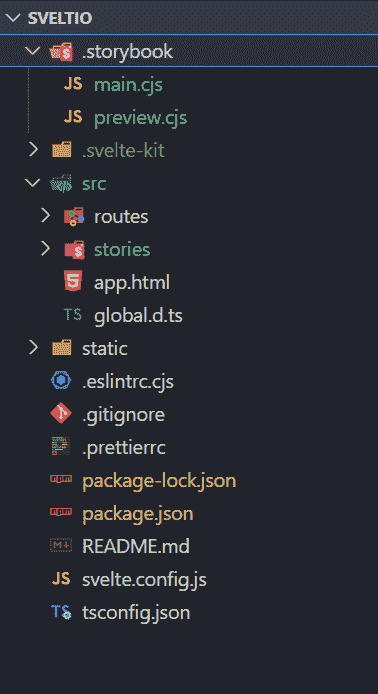
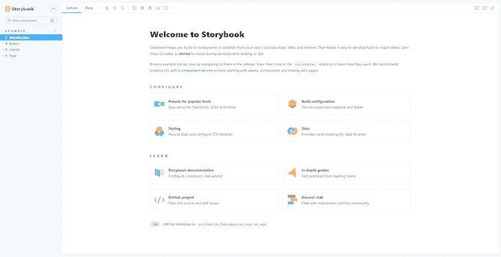
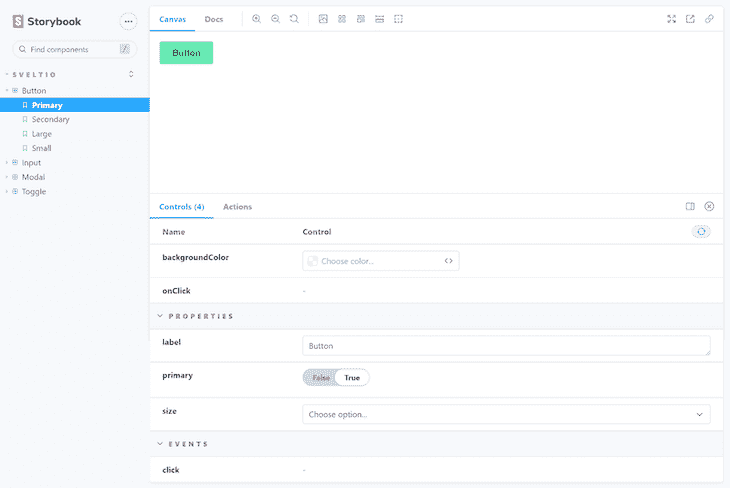
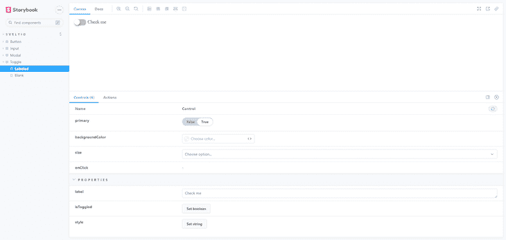
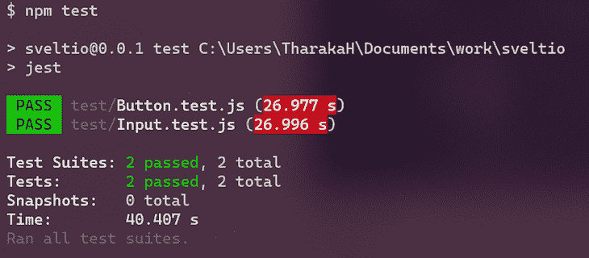

# 用 Svelte 构建自己的组件库

> 原文：<https://blog.logrocket.com/build-your-own-component-library-svelte/>

## 介绍

Svelte 是一个用于构建 web 应用程序的开源 JavaScript 组件框架。Svelte 采用了一种不同于 React、Angular 和 Vue 等现有 web 框架的方法，这些框架遵循声明性的、状态驱动的代码。

Svelte 包的大小比大多数框架小得多，因为它没有任何依赖关系(在`package.js`文件中只有 dev 依赖关系)。由于这些特性，Svelte 已经成为 2021 年最受欢迎、最令人畏惧和最受欢迎的 web 框架。

由于这种流行，开发人员已经引入了几个令人敬畏的 UI 组件框架/库，如[苗条材质 UI](https://sveltematerialui.com/) 、[冶炼](https://smeltejs.com/)、[苗条材质化](https://svelte-materialify.vercel.app/)和[苗条带](https://sveltestrap.js.org/)。

但是构建自己的苗条组件库会是什么样的呢？幸运的是，你可以从几个模板开始，比如 svelete 提供的官方[模板和](https://github.com/sveltejs/component-template)[svelete 3 组件模板](https://github.com/YogliB/svelte-component-template)，它们被认为是构建你自己的组件库的必备工具。

然而，这些模板非常固执己见，您可能看不到构建组件库本身所需的底层工具和技术。在这篇文章中，我们将学习如何使用 Svelte 的新 SvelteKit 自己构建一个组件库。

## 什么是 SvelteKit？

SvelteKit 可以被认为是 Svelte 的 [Sapper](https://sapper.svelte.dev/) 或 NextJS 的继承者。它包含了大量很酷的特性，比如服务器端渲染、路由和代码分割。

SvelteKit 在引擎盖下使用 [Vite](https://vitejs.dev/) ，这很令人惊讶，因为 Sapper 和大多数工具都是使用 [Snowpack](https://www.snowpack.dev/) 开发的。Vite 2 是框架无关的，并且以 SSR 为核心进行设计。

SvelteKit 仍处于测试阶段，但它非常稳定，并且有许多项目正在使用该框架。

## 开始使用 SvelteKit

对于这个项目，我们将使用一个框架项目作为我们库的基础。

让我们使用 SvelteKit 初始化项目。您将需要执行以下命令并选择 Svelte 给出的选项:


## 集成故事书

是时候集成 Storybook 了，story book 是一个用于孤立地构建 UI 组件和页面的开源工具。它简化了 UI 开发和测试，这对于我们的组件库开发来说是理想的。它允许我们构建组件，而不用担心 SvelteKit 中的配置或开发服务器。

在您的 SvelteKit 项目根目录中，执行以下命令。这将确定并生成苗条身材所需的配置:

```
npx sb init
```

在用一个 SvelteKit 项目设置 Storybook 时，你可能会遇到一些问题。Storybook 会在你启动服务器时抛出一个错误，像这样:


这个问题是由于`package.json`文件下的`“type”:”module”`的属性引起的，这意味着我们不能使用 ESM 要求的语法。

为了克服这一点，您可以在 Storybook 配置文件中做一个小小的调整。只需将你的细长故事书配置文件的扩展名从`.js`更改为`.jcs`，并且在`main.cjs`文件中，确保你注释掉了由`require`命令组成的`svelteOptions`属性。



完成上述调整后，您可以运行下面的命令来启动 Storybook 服务器:

```
npm run storybook
```

该命令将在浏览器中打开一个新的选项卡，为我们的 SvelteKit 项目加载 Storybook 应用程序。



## 构建组件之前要考虑的因素

在构建组件之前，请考虑以下因素，因为它们将帮助我们遵循正确的准则。

### 道具用法

“props”这个词在所有主流框架和库(如 Vue 和 React)中都很常见。Props 将数据传递给子组件或启用组件通信。

### 插槽和`$$slots`用法

即使 props 允许你通过传递数据来重用组件，但这会带来严格的父子关系。这意味着它的 HTML 内容将始终控制子组件，而父组件只能传递不同的值，因此组件不能与道具组合在一起。

这就是老虎机派上用场的地方。插槽保持可重用性，同时允许父组件控制子组件的内容，包括其中的 HTML 元素。通过添加`<slots/>`标签，您可以从父代传递 HTML 或 markdown，而不仅仅是值。

### 避免嵌套和全局 CSS

构建组件时，避免嵌套和全局 CSS，因为它们不会被限定范围，这意味着它们会泄漏到所有子组件。

### 处理事件

构建组件时，确保添加或处理适当的事件。你将不得不使用一个叫做`createEventDispatcher`的轻量级 API，这在调度事件时会很有用。

## 创建组件

让我们为我们的库创建一些组件。首先删除 Storybook 生成的默认`story`文件夹，在`src`目录下创建一个`stories`文件。

接下来，我们将关注项目结构。在`src`目录下创建一个名为`lib`的目录。这个`lib`目录是 SvelteKit 的一个特殊目录，因为它允许我们使用一个叫做`[$lib](https://kit.svelte.dev/docs#modules-%24lib)`的特殊符号。`$lib`可以用作`src` / `lib`目录的别名，帮助我们在不使用`../../../../ .`等相对路径的情况下访问组件和实用模块

### 按钮组件

现在让我们在名为`Button.svelte`的`lib`目录下创建我们的按钮组件:

```
<script>
  import { createEventDispatcher } from 'svelte';

  export let primary = false;
  export let size = 'medium';
  export let label = '';

  const dispatch = createEventDispatcher();
   /**
   * Button click handler
   */
   function onClick(event) {
    dispatch('click', event);
  }
</script>

<button
  type="button"
  class={['sveltio-button', `sveltio-button--${size}`,
   `sveltio-button--${primary?'primary':'secondary'}`].join(' ')
   }
  on:click={onClick}>
  {label}
</button>

<style>
.sveltio-button {
    font-family: 'Nunito Sans', 'Helvetica Neue', Helvetica, Arial, sans-serif;
    font-weight: 700;
    border: 0;
    border-radius: 3px;
    cursor: pointer;
    display: inline-block;
    line-height: 1;
}
.sveltio-button--primary {
    color: #1b116e;
    background-color: #6bedb5;
}
.sveltio-button--secondary {
    color: #ffffff;
    background-color: #1b116e;
    box-shadow: rgba(0, 0, 0, 0.15) 0px 0px 0px 1px inset;
}
.sveltio-button--small {
    font-size: 12px;
    padding: 10px 16px;
}
.sveltio-button--medium {
    font-size: 14px;
    padding: 11px 20px;
}
.sveltio-button--large {
    font-size: 16px;
    padding: 12px 24px;
}

.sveltio-button--primary :hover {
    color: #1b116e;
    background-color: #55bd90;
}

.sveltio-button--primary :active {
    color: #1b116e;
    background-color: #55bd90;
    border: solid 2px #1b116e;
}

.sveltio-button--primary :disabled {
    color: #1b116e;
    opacity: 0.5;
    background-color: #6bedb5;
}

.sveltio-button--secondary :hover {
    color: #1b116e;
    background-color: #55bd90;
}

.sveltio-button--secondary :active {
    color: #1b116e;
    background-color: #6bedb5;
    border: solid 2px #1b116e;
}

.sveltio-button--secondary :disabled {
    color: #ffffff;
    opacity: 0.5;
    background-color: #1b116e;
}

</style>

```

注意，我们已经在同一个文件中的`<style>`标签下添加了样式。

现在让我们为名为`Button.stories.svelte`的按钮组件创建一个故事文件:

```
  <script>
    import { Meta, Template, Story } from "@storybook/addon-svelte-csf";
    import Button from "./Button.svelte";
  </script>

  <Meta
    title="Sveltio/Button"
    component={Button}
    argTypes={{
      label: { control: "text" },
      primary: { control: "boolean" },
      backgroundColor: { control: "color" },
      size: {
        control: { type: "select", options: ["small", "medium", "large"] },
      },
      onClick: { action: "onClick" },
    }}
  />

  <Template let:args>
    <Button {...args} on:click={args.onClick} />
  </Template>

  <Story
    name="Primary"
    args={{
      primary: true,
      label: "Button",
    }}
  />

  <Story
    name="Secondary"
    args={{
      label: "Button",
    }}
  />
  <Story
    name="Large"
    args={{
      size: "large",
      label: "Button",
    }}
  />

  <Story
    name="Small"
    args={{
      size: "small",
      label: "Button",
    }}
  />

```

请注意，我们已经通过向模板传递几个参数为按钮组件创建了几个模板。

现在，在故事书窗口中，您将能够看到一个按钮。



您可以从下面提供的控制器中从**主**按钮切换到**副**按钮。您还可以从**动作**日志中清楚地查看该定制组件可用的事件类型。

### 切换组件

现在让我们创建一个切换组件。首先创建`Toggle.svelte`和`Toggle.stories.svelte`文件:

`Toggle.svelte`:

```
<script>
    export let label = '';
    export let isToggled = false;
    export let style = '';
</script>

<label {style} class="sveltio-toggle-label">
    <input type="checkbox" class="sveltio-input" bind:checked={isToggled} />
    <div class="sveltio-toggle" />
    {label}
</label>

<style>
    .sveltio-toggle-label {
    --width: 40px;
    --height: calc(var(--width) / 2);
    --radius: calc(var(--height) / 2);
    display: flex;
}

.sveltio-toggle {
    position: relative;
    width: var(--width);
    height: var(--height);
    border-radius: var(--radius);
    border: solid 1px #c2c2c3;
    transition: background-color 0.3s ease;
    margin-right: 5px;
    background-color: var(--toggleBackgroundColor, #c2c2c3);
}

.sveltio-toggle::after {
    content: '';
    position: absolute;
    top: -1px;
    left: -1px;
    height: var(--height);
    width: var(--height);
    border-radius: var(--radius);
    background-color: var(--toggleButtonColor, #ffffff);
    box-shadow: 2px 4px 6px rgba(0, 0, 0, 0.3);
    transition: transform 0.3s ease;
}
.sveltio-input {
    display: none;
}

.sveltio-input:checked + .toggle {
    background-color: var(--toggleCheckedBackgroundColor, #1b116e);
}

.sveltio-input:checked + .toggle::after {
    transform: translate3d(100%, 0, 0);
}

</style>

```

`Toggle.stories.svelte`:

```
<script>
    import { Meta, Template, Story } from "@storybook/addon-svelte-csf";
    import Toggle from "./Toggle.svelte";
  </script>

  <Meta
    title="Sveltio/Toggle"
    component={Toggle}
    argTypes={{
      label: { control: "text" },
      primary: { control: "boolean" },
      backgroundColor: { control: "color" },
      size: {
        control: { type: "select", options: ["small", "medium", "large"] },
      },
      onClick: { action: "onClick" },
    }}
  />

  <Template let:args>
    <Toggle {...args} on:click={args.onClick} />
  </Template>

  <Story
    name="Labeled"
    args={{
      primary: true,
      label: "Check me",
    }}
  />

  <Story
    name="Blank"
    args={{
      label: "",
    }}
  />

```

现在让我们看看这个组件将如何在 Storybook 中呈现。这个故事由两个名为**的模板组成，分别标记为**和**空白**，并将使用不同的道具或参数呈现同一组件的两个实例。



### 输入字段组件

最后，我们将创建一个输入字段组件，其样式为输入的每个状态显示令人愉快的颜色。

在您的`Input.svelte`文件中写入以下内容:

```
<script>
    import { createEventDispatcher } from 'svelte';

    export let placeholder = '';
    export let label = '';
    export let disabled = false;

    export let state = "active";

    const dispatch = createEventDispatcher();

     /**
     * input change handler
     */
     function onChange(event) {
      dispatch('click', event);
    }
</script>

<label >

    {#if label}
        <span class="sveltio-input-label">{label}</span>
    {/if}

    <input
    disabled={disabled}
    type="text"
    class={['sveltio-input',`sveltio-input--${state}`].join(' ')}
    placeholder={placeholder}
    >
</label>

<style>
    .sveltio-input {
    font-family: 'Nunito Sans', 'Helvetica Neue', Helvetica, Arial, sans-serif;
    font-weight: 700;
    min-height: 25px;
    margin: 2px;
    border-radius: 3px;
    border: solid 2px #353637;
    background-color: #ffffff;
}

.sveltio-input ::focus {
    border: solid 2px #1b116e;
}

.sveltio-input--success {
    border: solid 2px #067d68;
}

.sveltio-input--error {
    border: solid 2px #a9150b;
}

.sveltio-input--disabled {
    color: #e4e3ea;
    border: solid 2px #e4e3ea;
}

.sveltio-input ::-webkit-input-placeholder {
    color: red;
}

.sveltio-input-label {
    font-family: 'Nunito Sans', 'Helvetica Neue', Helvetica, Arial, sans-serif;
    font-weight: 700;
}

</style>

```

现在，因为我们已经创建了带有样式的`input`组件，让我们看看如何为这些组件编写故事，以及它是如何呈现的。这里，我们将传入一些像`backgroundColor`和`state`这样的参数。

`Input.stories.svelte:`

```
<script>
    import { Meta, Template, Story } from "@storybook/addon-svelte-csf";
    import Input from "./Input.svelte";
  </script>

  <Meta
    title="Sveltio/Input"
    component={Input}
    argTypes={{
      backgroundColor: { control: "color" },
      state: {
        control: { type: "select", options: ["active","success", "error"] },
      },
      onChange: { action: "onChange" },
      disabled:{ control: "boolean" }
    }}
  />

  <Template let:args>
    <Input {...args} on:change={args.onChange} />
  </Template>

  <Story
    name="Active"
    args={{
      placeholder: "Text Input Active",
      state:"active"
    }}
  />

  <Story
    name="Success"
    args={{
      placeholder: "Text Input Success",
      state: "success",
    }}
  />
  <Story
    name="Error"
    args={{
      placeholder: "Text Input Error",
      state: "error"
    }}
  />

  <Story
    name="Disabled"
    args={{
      state: "disabled",
      disabled:true
    }}
  />

```

以类似的方式，您可以创建其他 web 组件，并为其他组件创建故事，以继续构建您的组件库。你可以通过这个[链接](https://github.com/LMPerera/sveltio)找到我们构建的组件的完整代码。

## 使用苗条测试库和 Jest 进行测试

开发 web 应用程序的一个最重要的方面是为我们的组件运行和维护测试。使用 Svelte，运行测试的过程类似于我们使用 React、Vue 或 Angular 得到的结果。

有几个工具可以编写和运行测试，比如 Mocha、Karma、Jasmine 和 [Jest](https://jestjs.io/) 。对于这个项目，我们将使用 Jest 作为我们的测试运行程序。然而，Jest 也稍有不足，因为我们需要呈现我们的组件，并在对它们执行操作后检查它的行为。

为此，我们将使用一个叫做[测试库](https://testing-library.com/)的工具。这个工具帮助我们编写测试，就像一个真实的用户正在处理元素一样，并且支持所有主要的前端框架和库。

我们还将使用一个名为[用户事件](https://testing-library.com/docs/ecosystem-user-event/)的测试库附加插件，它允许我们模拟用户事件，比如在输入中打字或点击按钮。我们还将使用一个名为 [jest-dom](https://testing-library.com/docs/ecosystem-jest-dom/) 的插件，它扩展了 jest 的 dom 相关匹配功能，我们需要它是因为我们正在处理 web 组件。

现在，让我们将这些库作为开发依赖项安装到我们的项目中，如下所示:

```
npm install --save-dev jest babel-jest svelte-jester  @testing-library/svelte @testing-library/user-event @testing-library/jest-dom @testing-library/dom
```

现在，让我们向项目的根目录添加一些配置文件。从保存 Jest 配置的`Jest.config.cjs`文件开始，还有一个带有一些预设的`.babelrc`文件，用于将文件转换为 ES2015 JavaScript。

`Jest.config.cjs`:

```
module.exports = {
    transform: {
        "^.+\\.js$": "babel-jest",
        "^.+\\.svelte$": "svelte-jester"
    },
    moduleFileExtensions: ['js', 'svelte'],
    moduleNameMapper: {
        '^\\$lib(.*)$': '<rootDir>/src/lib$1',
        '^\\$app(.*)$': [
            '<rootDir>/.svelte-kit/dev/runtime/app$1',
            '<rootDir>/.svelte-kit/build/runtime/app$1'
        ]
    },
    setupFilesAfterEnv: ["@testing-library/jest-dom/extend-expect"],
    testEnvironment: "jsdom"
};

```

`.babelrc`:

```
{
    "presets": [["@babel/preset-env", {"targets": {"node": "current"}}]]
}

```

上面的测试将检查按钮中的文本是否可用，并做一些断言。

让我们为已经创建的`Input`文件添加另一个测试。我们把这个叫做`test`目录下的`Input.test.js`:

```
import '@testing-library/jest-dom';
import Input from '$lib/Input/Input.svelte';
import { render } from '@testing-library/svelte';

describe('Input component', () => {
    it('Input Has Placeholder', () => {
        const { getByPlaceholderText } = render(Input, { placeholder: 'Hello Sveltio' });
        expect(getByPlaceholderText('Hello Sveltio')).toBeInTheDocument();
    });
});
The above test will check if the input field consists of the placeholder we pass as a prop.
```

在我们运行这些测试之前，我们将在`package.json`文件的`scripts`下添加一个名为`“test”:”jest”`的小属性。

现在，您所要做的就是在项目根目录下运行以下命令:



这样，您就可以维护单元测试，从而提高组件的质量。

## 打包并发布到 npm

现在是时候向全世界发布您的项目了！有几个工具可以用来导出你的组件作为一个包，但我们将使用一个很酷的功能，内置于 SvelteKit。首先，将这个属性添加到`package.json`文件中:

```
"package": "svelte-kit package"
```

现在，您所要做的就是从项目的根目录运行以下命令:

```
npm run package
```

> 如果您没有初始化 TypeScript SvelteKit 项目，您将需要安装一个名为`svelte2tsx`的依赖项，它将 Svelte 组件源转换成 TSX。

该命令将获取`src/lib`文件夹下的所有文件，并将其打包。这个命令在项目的根目录下生成一个名为`package`的新目录，在这个目录中，您会注意到有一个新的`package.json`文件。这个文件包含一个名为`exports`的属性，它包含了我们开发的各个组件的所有路径或入口点。

将以下代码输入到`package`目录下的`package.json`文件中:

```
{
  "name": "sveltio",
  "version": "0.0.1",
  "devDependencies": {
   //some dependencies
  },
  "type": "module",
  "dependencies": {},
  "exports": {
    "./package.json": "./package.json",
    "./Button.svelte": "./Button/Button.svelte",
    "./Input.svelte": "./Input/Input.svelte",
    "./Modal.svelte": "./Modal/Modal.svelte",
    "./Toggle.svelte": "./Toggle/Toggle.svelte"
  }
}

```

如果您的库包含类似于`src` / `lib` / `index.js`或`src` / `lib` / `index.svelte`的文件，它将被视为包根。这使得使用我们库的组件作为 es 模块导入变得更加容易。

例如，如果你有一个`src` / `lib` / `Button.svelte`组件和一个`src` / `lib` / `index.js`模块将其重新导出，则你的库的使用者可以执行以下任一操作:

```
import { Button } from 'your-library';
```

或者

```
import Button from 'your-library/Button.svelte';
```

现在我们已经使用 SvelteKit 创建了一个包，是时候将它发布为一个 npm 模块了。您需要做的就是从项目的根目录执行以下命令:

```
npm publish ./package
```

上面的命令将发布我们使用 SvelteKit 创建的包。请确保包名称和包版本组合不存在；如果是这样，该包将不会在 npm 上发布。

## 结论

你可以看到为什么 SvelteKit 值得开发者社区更多的关注。SvelteKit 包含了很多奇妙的特性，创建软件包非常容易。有了 Storybook 和 Jest 这样的工具，孤立地创建一个组件并维护组件的测试变得简单而高效。更多信息，请浏览 SvelteKit [文档](https://kit.svelte.dev/docs)。