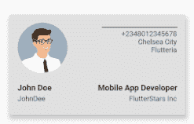

# 在 Flutter 中构建卡片小部件

> 原文：<https://blog.logrocket.com/building-a-card-widget-in-flutter/>

## 介绍

在本文中，您将学习关于 Flutter 中的小部件和 card 类的所有知识，同时将两者结合起来创建一个 card 小部件。在本文的最后，您将拥有一个可重用的卡片小部件，可以根据自己的需要进行定制。

## 飘动中的小部件

用 Flutter 构建全功能的应用程序可能是令人兴奋的，因为它涉及到将各种组件集合在一起，一次组合一个组件来构建一个完整的应用程序。无论 Flutter 应用程序有多复杂或多大，它们都使用被称为“小部件”的基本构件。

窗口小部件构成了 Flutter 应用程序中视图和屏幕的基础，恰当地组合不同的窗口小部件会给你一个设计精美的屏幕。

有两种类型的 Flutter 小部件:

*   无状态小部件是不可变的小部件，这意味着它们不会改变。它们携带的任何信息在小部件的整个生命周期中都保持不变
*   有状态小部件是其信息和属性可以在小部件运行时改变的小部件。它的属性可以在运行时更新、更改或删除

小部件的例子有中心小部件(将其子部件或项目对齐中心)、行小部件(以水平格式对齐其子部件)和列小部件(垂直对齐其子部件)。组合这些现成的小部件使得开发更加容易和快速。

然而，有时候一些内置的小部件不能满足应用程序的即时需求，你需要结合一两个。例如，Flutter 中内置的卡片小部件并不能完全满足我们的需求，因此我们必须将其与其他小部件结合起来，以构建我们自己的可重用和完全可定制的卡片小部件。

## 构建卡片小部件

在本教程中，我们将构建一个卡片小部件，其功能相当于一张带有图像、工作描述和公司名称的名片。

这有助于建立您对 Flutter 小部件的了解，也有助于您了解可以应用的各种技术，以便从其他小部件的组合中创建一个小部件。

## 入门指南

我们开始吧。第一步是创建一个新项目:

```
flutter create card_widget

```

该命令创建文件、文件夹以及启动新的 Flutter 项目所需的一切。

接下来，我们需要创建一个默认的 MaterialApp。Flutter 的 MaterialApp 类是 Flutter 应用程序中预定义的类。它是主要或核心组件。

我们可以通过以下方式访问 Flutter SDK 提供的所有其他组件和小部件:

```
import 'package:flutter/material.dart';
void main() => runApp(MyApp());
class MyApp extends StatelessWidget {
  @override
  Widget build(BuildContext context) {
    return MaterialApp(
      title: 'Material App',
      home: Scaffold(
       body: Text('Material App'),
      ),
    );
  }
}

```

在上面的代码中，一个名为`MyApp`的无状态小部件是我们将要创建的应用程序的基础。它返回`MaterialApp`，这使我们能够访问材料设计中的各种属性和组件。

我们传入标题，这是我们希望给我们的应用程序起的名字(在我们的例子中是“名片”)。我们还将一个`Scaffold`小部件传递给 MaterialApp 的`home`属性。

`Scaffold`小工具会填满移动设备显示屏上的所有可用空间；它提供了对各种其他小部件的访问，如应用程序栏、浮动操作按钮、抽屉等等。

在`Scaffold`小部件中，我们有`body`属性，这是除了应用程序栏之外的所有其他东西可以放置的空间。在这个默认的材质应用中，我们只能通过`Text('Material App')`传入一个`text`小部件。我们将在本教程中继续修改它。

## 确定卡片小部件行为

下一步是创建一个新的无状态小部件。为什么我们要使用无状态小部件？因为 card 小部件的任何属性都不应该在运行时改变。颜色、形状和细节一旦在应用程序中设置，就不应该改变。

我们将把无状态小部件称为“名片”现在，我们用下面的代码传入一个空的`Container`小部件:

```
class BusinessCard extends StatelessWidget {
  @override
  Widget build(BuildContext context) {
    return Container();
  }
}

```

现在，将无状态小部件名称传递给 MaterialApp 的 body 参数:

```
import 'package:flutter/material.dart';
void main() => runApp(MyApp());
class MyApp extends StatelessWidget {
  @override
  Widget build(BuildContext context) {
    return MaterialApp(
      title: 'Material App',
      home: Scaffold(
       body: BusinessCard(), // <= the name goes here
      ),
    );
  }
}

```

在`BusinessCard`小部件中，返回`Card`类构造函数:

```
class BusinessCard extends StatelessWidget {
  @override
  Widget build(BuildContext context) {
    return Card(); // <== The Card class constructor
  }
}

```

## 确定卡片小部件属性

`Card`类提供了几个可以用来修改卡片视觉效果的属性，比如颜色、形状、边框和位置。例如，我们可以决定用绿色(`Colors.green`)或红色(`Colors.red`)来设计我们的卡片。

其他属性也是如此。如果我们希望卡片有一个圆角矩形形状，我们可以将`RoundedRectangularBorder()`传递给 shape 参数，这样就完成了。

对于本文，我们将只使用`color`和`elevation`属性。

* * *

### 更多来自 LogRocket 的精彩文章:

* * *

高程用于控制卡片的 Z 坐标和卡片下阴影的大小。粘贴下面的代码，使卡片为灰色，标高为 8.0:

```
  @override
  Widget build(BuildContext context) {
    return Card(
      color: Colors.grey[300],
      elevation: 8.0,

```

由于卡片小部件没有高度和宽度参数，我们可以通过传入`height`和`width`属性来使用`Container`小部件:

```
   child: Container(
        padding: const EdgeInsets.symmetric(vertical: 16, horizontal: 16),
        height: 200,
        width: 350,
        child:  Column(
          children: [],            
        ),

```

至此，卡片的基本布局已经设定。我们可以将`BusinessCard`小部件的组件传递到`Column`小部件的子块中(如上面的代码块所示)。

## 确定卡片小部件布局

对于本文，我们使用基本的名片布局。更多的调整和造型可以添加到您的满意度。

我们从创建`Column`小部件的组件开始。首先，我们设置了`mainAxisAlignment`和`crossAxisAlignment`。

`Row`和`Column`小部件的这两个参数用于设置子组件如何垂直和水平排列:

```
 Column(
          crossAxisAlignment: CrossAxisAlignment.start,
          children: [
            Row(
              mainAxisAlignment: MainAxisAlignment.spaceBetween,
              crossAxisAlignment: CrossAxisAlignment.start,
             children: [],

```

`MainAxisAlignment.spaceBetween`确保子组件尽可能靠后，而`CrossAxisAlignment.start`确保组件从顶部垂直开始。

接下来，我们需要传入圆形头像。这是一个 widget Flutter，用于显示来自资产或互联网的图像。

我们将利用互联网上的随机头像。将图像的链接传递给`NetworkImage`小部件:

```
children: [
                const CircleAvatar(
                  radius: 50, //we give the image a radius of 50
                  backgroundImage: NetworkImage(
                      'https://webstockreview.net/images/male-clipart-professional-man-3.jpg'),
                ),

```

下一步是构建`Column`，我们需要的其他细节将被传入其中。我们使用`Text`小部件来显示电话号码、城市和组织。

`SizedBox`是一个将间距引入应用程序的小部件。我们将使用它在文本之间留出空间:

```
              Column(
                  crossAxisAlignment: CrossAxisAlignment.end,
//CrossAxisAlignment.end ensures the components are aligned from the right to left.
                  children: [
                    Container(
                      margin: const EdgeInsets.only(top: 8),
                      width: 150,
                      color: Colors.black54,
                      height: 2,
                    ),
                    const SizedBox(height: 4),
                    const Text('+2348012345678'),
                    const Text('Chelsea City'),
                    const Text('Flutteria'),
                  ],
                ),
              ],
            ),
            const SizedBox(height: 20),

```

接下来，我们创建另一个`Row`来处理名称、职位和公司。它们都是文本，所以我们将每个文本传递给一个`Text`小部件:

```
            Row(
              mainAxisAlignment: MainAxisAlignment.spaceBetween,
              crossAxisAlignment: CrossAxisAlignment.start,
              children: [
                Column(
                  crossAxisAlignment: CrossAxisAlignment.start,
                  children: [
                    const Text(
                      'John Doe',
                      style: TextStyle(
                        fontSize: 16,
                        fontWeight: FontWeight.bold,
                      ),
                    ),
                    const SizedBox(height: 4),
                    const Text('JohnDee'),
                  ],
                ),

```

我们在上面的代码块中所做的是创建一个`Row`小部件，其功能是以水平格式对齐其子部件。因为我们的卡片分为两部分，所以我们使用了两个`Column`小部件，它们与`Row`小部件相反，并垂直对齐它们的子部件。

在第一列中，我们传入了`Text`小部件，我们用它来显示这个人的名字和昵称(只是一个小小的添加):

```
                const SizedBox(width: 32),
                Column(
                  crossAxisAlignment: CrossAxisAlignment.end,
                  children: [
                    const Text(
                      'Mobile App Developer',
                      style: TextStyle(
                        fontSize: 16,
                        fontWeight: FontWeight.bold,
                      ),
                    ),
                    const SizedBox(height: 4),
                    const Text('FlutterStars Inc'),
                  ],
                )
              ],
            ),
          ],
        ),

```

我们使用`SizedBox`来分隔两个`Text`小部件。`SizedBox`是一个创造特定大小空间的小工具。它可能有也可能没有子部件或组件。一旦声明了它的高度和宽度，就可以开始了。

我们在 4 的高度传递它，以便在我们的`Text`小部件之间创造一点空间，使它看起来更干净、更像样。

在第二列中，我们重复同样的事情，将工作描述和公司名称传递到`Text`小部件中。然后，我们使用宽度为 32 的`SizedBox`来分隔这两列。

太好了！我们已经完成了`BusinessCard`小部件的基本布局的创建。在您的终端内运行下面代码块中的命令来启动应用程序。

通过组合内置的卡片小部件、容器、文本、行和列小部件，我们从头开始构建了一个卡片小部件，通过调用它的构造函数，可以在应用程序的任何地方使用它:

```
flutter run

```

下面是已经完全构建好并可以使用的 card 小部件的屏幕截图:



# 结论

内置的卡片小部件可以做很多事情。当它与其他小部件结合使用时，它会形成设计精美且完全可重用的小部件，可以在应用程序的任何地方使用。请记住，小部件是构建模块，正确的组合可以让你的应用发挥最大的作用。

## 使用 [LogRocket](https://lp.logrocket.com/blg/signup) 消除传统错误报告的干扰

[](https://lp.logrocket.com/blg/signup)

[LogRocket](https://lp.logrocket.com/blg/signup) 是一个数字体验分析解决方案，它可以保护您免受数百个假阳性错误警报的影响，只针对几个真正重要的项目。LogRocket 会告诉您应用程序中实际影响用户的最具影响力的 bug 和 UX 问题。

然后，使用具有深层技术遥测的会话重放来确切地查看用户看到了什么以及是什么导致了问题，就像你在他们身后看一样。

LogRocket 自动聚合客户端错误、JS 异常、前端性能指标和用户交互。然后 LogRocket 使用机器学习来告诉你哪些问题正在影响大多数用户，并提供你需要修复它的上下文。

关注重要的 bug—[今天就试试 LogRocket】。](https://lp.logrocket.com/blg/signup-issue-free)