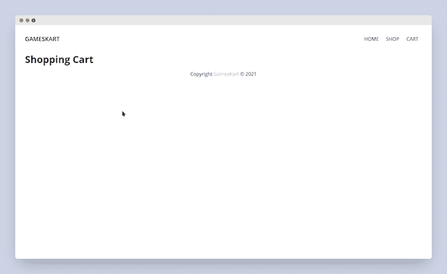
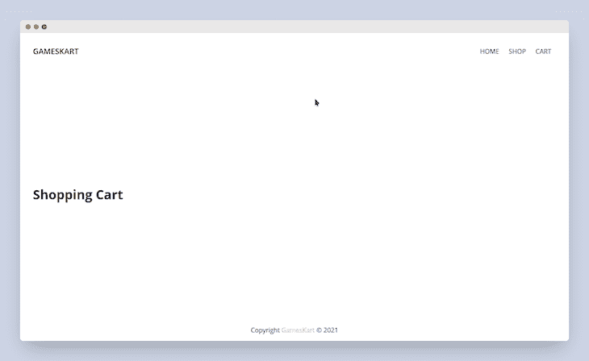
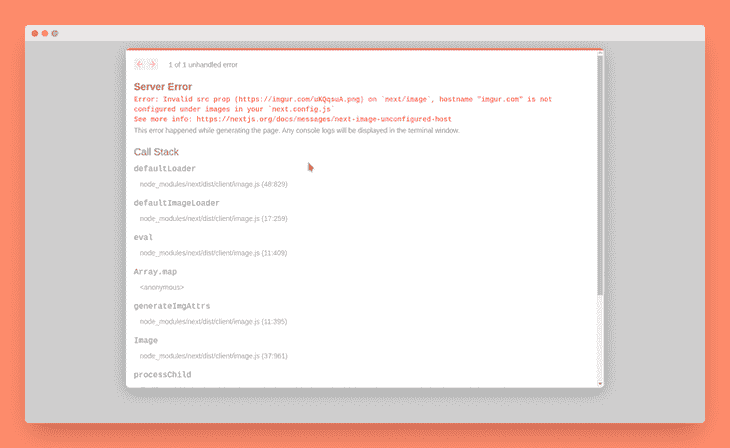
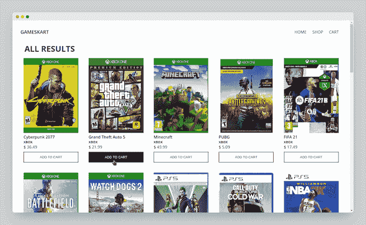
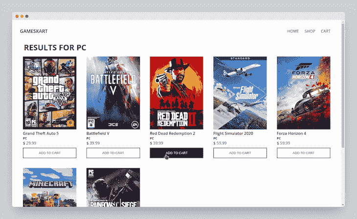
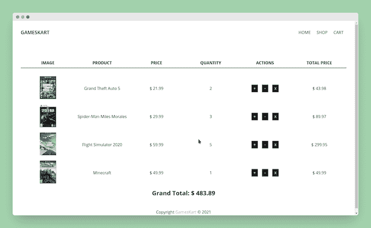

# 构建 Next.js 购物车应用程序

> 原文：<https://blog.logrocket.com/building-a-next-js-shopping-cart-app/>

Next.js 是 Vercel 开发的 React 框架，随着越来越多的 React 开发人员追求服务器端渲染、静态站点生成和增量静态再生，以及其他 SEO 和优化优势，该框架越来越受欢迎。

使用 Next.js 附带的温和的学习曲线，在框架内构建应用程序是很容易的，即使您以前只使用过 React。

为了了解如何构建一个 Next.js 应用程序，本教程详细介绍了如何为一个虚拟的游戏商店构建一个购物车 web 应用程序，该应用程序能够在购物车中添加或删除商品、查看所有产品、按类别查看产品等等。

## 本 Next.js 教程涵盖的内容

构建应用程序时，我们将介绍以下功能:

*   使用`create-next-app`设置 Next.js 项目
*   Next.js 中的路由系统
*   [使用 CSS 模块进行造型](https://blog.logrocket.com/a-deep-dive-into-css-modules/)
*   使用`<Image>`组件进行图像优化
*   为全局状态管理集成 Redux 工具包
*   静态生成和服务器端呈现
*   Next.js API 路由
*   用`getStaticProps()`、`getStaticPaths`和`getServerSideProps()`取数据

你可以在这个 GitHub 库中找到已完成项目的[源代码，以及部署在 Vercel](https://nextjs-shopping-cart-ruby.vercel.app/) 上的[现场演示。](https://nextjs-shopping-cart-ruby.vercel.app/)

## 开始使用`create-next-app`

要使用`create-next-app`创建新的 Next.js 应用程序，请在终端上运行以下命令，并等待安装过程完成:

```
npx create-next-app shopping-cart

```

完成后，通过运行`npm run dev`脚本启动开发服务器。默认情况下，Next.js 应用程序的文件夹结构如下所示:

```
|-- node_modules
|-- package.json
|-- package-lock.json
|-- pages
|   |-- api
|   |   |-- hello.js
|   |-- _app.js
|   |-- index.js
|-- public
|   |-- favicon.ico
|   |-- vercel.svg
|-- README.md
|-- styles
    |-- globals.css
    |-- Home.module.css

```

为了在没有任何现有样式的情况下开始，我们可以通过从`styles/globals.css`和`styles/Home.module.css`中移除样式，并用一个简单的 React 功能组件替换`pages/index.js`中的代码，来清理初始样板代码，如下所示:

```
const HomePage = () => {
  return (
    <main>
      <h1>Shopping Cart</h1>
    </main>
  );
};
export default HomePage;

```

此外，我们可以将所有的全局样式放在`styles/global.css`文件中。这些样式将应用于整个应用程序。现在，让我们添加一些基本样式，并从谷歌字体导入 [Open Sans 字体:](https://fonts.google.com/specimen/Open+Sans)

```
@import url('https://fonts.googleapis.com/css2?family=Open+Sans:[email protected];400;600;700&display=swap');

*, *::before, *::after {
  margin: 0;
  padding: 0;
  box-sizing: border-box;
}

body {
  font-family: 'Open Sans', sans-serif;
}

```

在整个项目中，我们将构建四个不同的页面:

*   一个主页，带有一个显示所有可用类别的登录页面
*   展示特定类别的所有产品的类别页面
*   展示所有类别的所有产品的商店页面
*   购物车页面管理购物车中的所有商品

但是，在构建这些页面之前，让我们构建一些常见的组件，如导航栏和页脚。

## `Navbar`和`Footer`组件

要开始添加`Navbar`和`Footer`组件，在项目的根文件夹中创建一个名为`components`的新文件夹。这使我们所有的组件都在一个地方，并保持我们的代码有组织。

在文件夹中，根据您的喜好创建一个名为`Navbar.js`或`Navbar.jsx`的新文件:

```
import Link from 'next/link';

const Navbar = () => {
  return (
    <nav>
      <h6>GamesKart</h6>
      <ul>
        <li>
          <Link href="/">Home</Link>
        </li>
        <li>
          <Link href="/shop">Shop</Link>
        </li>
        <li>
          <Link href="/cart">Cart</Link>
        </li>
      </ul>
    </nav>
  );
};

export default Navbar;

```

来自`next/link`的`<Link>`标签让用户可以浏览应用程序的不同页面。这类似于 React 应用中使用的`react-router-dom`中的`<Link>`标签。

但是，Next.js `<Link>`标签要求我们传递`href`属性，而不是使用`to`属性。

### 造型`Navbar`和`Footer`

要设置`Navbar`的样式，在`styles`文件夹中创建一个名为`Navbar.module.css`的新文件，并在文件中粘贴以下样式。您可以根据自己的喜好随意改变风格:

```
.navbar {
  display: flex;
  justify-content: space-between;
  align-items: center;
  padding: 2rem;
}
.logo {
  font-size: 1.2rem;
  font-weight: 600;
  text-transform: uppercase;
}
.links {
  display: flex;
}
.navlink {
  list-style: none;
  margin: 0 0.75rem;
  text-transform: uppercase;
}
.navlink a {
  text-decoration: none;
  color: black;
}
.navlink a:hover {
  color: #f9826c;
}

```

现在，要使用组件内部的样式，导入 CSS 模块，并将`className`添加到 JSX。修改`Navbar.jsx`中的代码，并进行以下更改:

```
import Link from 'next/link';
import styles from '../styles/Navbar.module.css';

const Navbar = () => {
  return (
    <nav className={styles.navbar}>
      <h6 className={styles.logo}>GamesKart</h6>
      <ul className={styles.links}>
        <li className={styles.navlink}>
          <Link href="/">Home</Link>
        </li>
        <li className={styles.navlink}>
          <Link href="/shop">Shop</Link>
        </li>
        <li className={styles.navlink}>
          <Link href="/cart">Cart</Link>
        </li>
      </ul>
    </nav>
  );
};

export default Navbar;

```

完成了`Navbar`组件后，让我们继续构建`Footer`组件。

在`components`文件夹中创建一个名为`Footer.jsx`的新文件:

```
import styles from 'Footer.module.css';

const Footer = () => {
  return (
    <footer className={styles.footer}>
      Copyright <span className={styles.brand}>GamesKart</span>{' '}
      {new Date().getFullYear()}
    </footer>
  );
};

```

然后，将`Footer.module.css`添加到`styles`文件夹中:

```
.footer {
  padding: 1rem 0;
  color: black;
  text-align: center;
}
.brand {
  color: #f9826c;
}

```

最后，在`pages/_app.js`中导入`Navbar`和`Footer`组件，这样它们在应用程序的所有页面上都可见。或者，我们可以将这些组件分别导入到我们希望显示它们的每个页面中:

```
import Navbar from '../components/Navbar';
import Footer from '../components/Footer';
import '../styles/globals.css';

function MyApp({ Component, pageProps }) {
  return (
    <div>
      <Navbar />
      <Component {...pageProps} />
      <Footer />
    </div>
  );
}

export default MyApp;

```

要查看我们的组件的运行情况，请在运行`npm run dev`脚本后转到 [http://localhost:3000](http://localhost:3000) 。然而，所有的组件都被挤到了页面的顶部。



这可以通过将我们的内容包装在一个设置为`column`的 flex 容器中，并以一种间隔的方式调整主轴上的内容来解决。只需在`_app.js`的第 7 行的 div 中添加一个新类:

```
<div className="wrapper"> // Line 7

```

然后，在`globals.css`中对其进行全局样式化:

```
// Add this code at the bottom of globals.css
.wrapper {
  min-height: 100vh;
  display: flex;
  flex-direction: column;
  justify-content: space-between;
}

```

就这样，我们已经解决了这个问题。



让我们继续构建主页。

## 构建主页

在主页上，将显示 Xbox、PS5、Switch、PC 和 accessories 产品类别的五张卡片。让我们从创建一个`CategoryCard`组件开始。

在`components`文件夹中创建两个名为`CategoryCard.jsx`的新文件，在`styles`文件夹中创建两个名为`CategoryCard.module.css`的新文件。

将以下代码粘贴到`CategoryCard.jsx`文件中:

```
import Link from 'next/link';
import Image from 'next/image';
import styles from '../styles/CategoryCard.module.css';

const CategoryCard = ({ image, name }) => {
  return (
    <div className={styles.card}>
      <Image className={styles.image} src={image} height={700} width={1300} />
      <Link href={`/category/${name.toLowerCase()}`}>
        <div className={styles.info}>
          <h3>{name}</h3>
          <p>SHOP NOW</p>
        </div>
      </Link>
    </div>
  );
};
export default CategoryCard;

```

这个组件有两个参数:显示的图像和类别的名称。Next.js 中内置了`<Image>`组件来提供图像优化。

将下一个代码序列粘贴到`CategoryCard.module.css`文件中:

```
.card {
  margin: 0.5rem;
  flex: 1 1 auto;
  position: relative;
}
.image {
  object-fit: cover;
  border: 2px solid black;
  transition: all 5s cubic-bezier(0.14, 0.96, 0.91, 0.6);
}
.info {
  position: absolute;
  top: 50%;
  left: 50%;
  background: white;
  padding: 1.5rem;
  text-align: center;
  transform: translate(-50%, -50%);
  opacity: 0.8;
  border: 1px solid black;
  cursor: pointer;
}
.card:hover .image {
  transform: scale(1.2);
}
.card:hover .info {
  opacity: 0.9;
}

```

将`CategoryCard`组件导入到`index.js`页面(我们的主页)中，以测试我们新创建的组件:

```
import CategoryCard from '../components/CategoryCard';
import styles from '../styles/Home.module.css';

const HomePage = () => {
  return (
    <main className={styles.container}>
      <div className={styles.small}>
        <CategoryCard image="https://imgur.com/uKQqsuA.png" name="Xbox" />
        <CategoryCard image="https://imgur.com/3Y1DLYC.png" name="PS5" />
        <CategoryCard image="https://imgur.com/Dm212HS.png" name="Switch" />
      </div>
      <div className={styles.large}>
        <CategoryCard image="https://imgur.com/qb6IW1f.png" name="PC" />
        <CategoryCard
          image="https://imgur.com/HsUfuRU.png"
          name="Accessories"
        />
      </div>
    </main>
  );
};

export default HomePage;

```

对于样式，将 CSS 代码添加到`styles`文件夹中的`Home.module.css`:

```
.container {
  padding: 0 2rem;
}
.small {
  display: grid;
  grid-template-columns: 1fr 1fr 1fr;
}
.large {
  display: grid;
  grid-template-columns: 1fr 1fr;
}

```

虽然我们添加了样式，但是我们会遇到一个错误:



修复这个问题很简单，[错误消息包含一个到 Next.js 文档](https://nextjs.org/docs/messages/next-image-unconfigured-host)的链接来解释和修复错误。

但是，对于本教程，在项目的根文件夹中创建一个名为`next.config.js`的新文件，并添加以下代码:

```
module.exports = {
  images: {
    domains: ['imgur.com'],
  },
};

```

### 添加图像

由于我们使用`imgur.com`来托管我们的图像，我们必须将它们添加到要优化的`domains`数组中，确保外部 URL 不会被滥用。

完成后，重新启动开发服务器以启动更改。这样，我们就成功地建立了主页。


## 使用 Next.js API 路由构建 API

在进入其他页面之前，我们必须构建一个 API 来获取产品。虽然 Next.js 是一个 React 框架，但我们可以利用它内置的 API routes 特性来构建一个简单的 API。

对于这个项目，我们需要两条 API 路线:

1.  从…提取产品
2.  获取属于特定类别的产品

在我们 Next.js 应用程序的文件夹结构中，`pages`文件夹中有一个名为`api`的文件夹。删除`api`文件夹中所有现存的文件，因为我们将从头开始创建我们的文件。

为了简单起见，我们将把商店的所有产品存储在一个名为`data.json`的 JSON 文件中。

但是，您可以使用数据库或带有 Next.js 的 [headless CMS 来添加、编辑或删除没有 JSON 文件的产品。](https://blog.logrocket.com/content-management-in-next-js-with-sanity-cms/)

在`api`文件夹下新建一个名为`products`的文件夹，然后到`products`文件夹下新建三个文件:`index.js`、`[category].js`和`data.json`。

### `index.js`

我们将处理的第一个文件是`index.js`，它对应于`/api/products`路线，并获取所有类别的所有产品:

```
import data from './data.json';

export function getProducts() {
  return data;
}

export default function handler(req, res) {
  if (req.method !== 'GET') {
    res.setHeader('Allow', ['GET']);
    res.status(405).json({ message: `Method ${req.method} is not allowed` });
  } else {
    const products = getProducts();
    res.status(200).json(products);
  }
}

```

在这个 API 路径中，我们只是导入`data.json`文件并检查请求的 HTTP 方法。

因为我们只想允许`GET`请求，所以我们可以使用一个`if`语句来检查请求对象的方法属性。对于`GET`的请求，我们可以用 JSON 格式的产品数据来响应。

我们可以通过访问[http://localhost:3000/API/products](http://localhost:3000/api/products)来访问这个 API 路由。

### `[category].js`

第二个文件是`[category].js`，对应于`/api/products/<category>`路线，取用户选择的一个类别的所有产品。文件名中的方括号表示这是一条动态路由:

```
import data from './data.json';

export function getProductsByCategory(category) {
  const products = data.filter((product) => product.category === category);
  return products;
}

export default function handler(req, res) {
  if (req.method !== 'GET') {
    res.setHeader('Allow', ['GET']);
    res.status(405).json({ message: `Method ${req.method} is not allowed` });
  } else {
    const products = getProductsByCategory(req.query.category);
    res.status(200).json(products);
  }
}

```

这个 API 路线与前面的路线相似，但是有一个主要的变化。因为我们只想要特定类别的产品，所以我们可以使用`filter()` JavaScript 数组方法来检查产品的类别是否与查询的类别`req.query.category`匹配。

我们可以通过访问[http://localhost:3000/API/products/Xbox](http://localhost:3000/api/products/xbox)或任何其他类别、`ps5`、`switch`、`pc`或`accessories`来访问这个 API 路线。

### `data.json`

最后，我们将添加`data.json`，这是一个简单的 JSON 文件，包含所有可用产品及其详细信息的数组:

```
[
  {
    "id": 1,
    "product": "Cyberpunk 2077",
    "category": "xbox",
    "image": "https://imgur.com/3CF1UhY.png",
    "price": 36.49
  },
  {
    "id": 2,
    "product": "Grand Theft Auto 5",
    "category": "xbox",
    "image": "https://imgur.com/BqNWnDB.png",
    "price": 21.99
  },
  {
    "id": 3,
    "product": "Minecraft",
    "category": "xbox",
    "image": "https://imgur.com/LXnUnd2.png",
    "price": 49.99
  },
  {
    "id": 4,
    "product": "PUBG",
    "category": "xbox",
    "image": "https://imgur.com/Ondg3Jn.png",
    "price": 5.09
  },
  {
    "id": 5,
    "product": "FIFA 21",
    "category": "xbox",
    "image": "https://imgur.com/AzT9YMP.png",
    "price": 17.49
  },
  {
    "id": 6,
    "product": "Battlefield 5",
    "category": "xbox",
    "image": "https://imgur.com/X3MQNVs.png",
    "price": 29.35
  },
  {
    "id": 7,
    "product": "Watch Dogs 2",
    "category": "xbox",
    "image": "https://imgur.com/v3lqCEb.png",
    "price": 18.99
  },
  {
    "id": 8,
    "product": "Fortnite",
    "category": "ps5",
    "image": "https://imgur.com/3lTxDpl.png",
    "price": 29.99
  },
  {
    "id": 9,
    "product": "Call of Duty: Black Ops",
    "category": "ps5",
    "image": "https://imgur.com/4GvUw3G.png",
    "price": 69.99
  },
  {
    "id": 10,
    "product": "NBA2K21 Next Generation",
    "category": "ps5",
    "image": "https://imgur.com/Mxjvkws.png",
    "price": 69.99
  },
  {
    "id": 11,
    "product": "Spider-Man Miles Morales",
    "category": "ps5",
    "image": "https://imgur.com/guV5cUF.png",
    "price": 29.99
  },
  {
    "id": 12,
    "product": "Resident Evil Village",
    "category": "ps5",
    "image": "https://imgur.com/1CxJz8E.png",
    "price": 59.99
  },
  {
    "id": 13,
    "product": "Assassin's Creed Valhalla",
    "category": "ps5",
    "image": "https://imgur.com/xJD093X.png",
    "price": 59.99
  },
  {
    "id": 14,
    "product": "Animal Crossing",
    "category": "switch",
    "image": "https://imgur.com/1SVaEBk.png",
    "price": 59.99
  },
  {
    "id": 15,
    "product": "The Legend of Zelda",
    "category": "switch",
    "image": "https://imgur.com/IX5eunc.png",
    "price": 59.99
  },
  {
    "id": 16,
    "product": "Stardew Valley",
    "category": "switch",
    "image": "https://imgur.com/aL3nj5t.png",
    "price": 14.99
  },
  {
    "id": 17,
    "product": "Mario Golf Super Rush",
    "category": "switch",
    "image": "https://imgur.com/CPxlyEg.png",
    "price": 59.99
  },
  {
    "id": 18,
    "product": "Super Smash Bros",
    "category": "switch",
    "image": "https://imgur.com/ZuLatzs.png",
    "price": 59.99
  },
  {
    "id": 19,
    "product": "Grand Theft Auto 5",
    "category": "pc",
    "image": "https://imgur.com/9LRil4N.png",
    "price": 29.99
  },
  {
    "id": 20,
    "product": "Battlefield V",
    "category": "pc",
    "image": "https://imgur.com/T3v629h.png",
    "price": 39.99
  },
  {
    "id": 21,
    "product": "Red Dead Redemption 2",
    "category": "pc",
    "image": "https://imgur.com/aLObdQK.png",
    "price": 39.99
  },
  {
    "id": 22,
    "product": "Flight Simulator 2020",
    "category": "pc",
    "image": "https://imgur.com/2IeocI8.png",
    "price": 59.99
  },
  {
    "id": 23,
    "product": "Forza Horizon 4",
    "category": "pc",
    "image": "https://imgur.com/gLQsp6N.png",
    "price": 59.99
  },
  {
    "id": 24,
    "product": "Minecraft",
    "category": "pc",
    "image": "https://imgur.com/qm1gaGD.png",
    "price": 29.99
  },
  {
    "id": 25,
    "product": "Rainbow Six Seige",
    "category": "pc",
    "image": "https://imgur.com/JIgzykM.png",
    "price": 7.99
  },
  {
    "id": 26,
    "product": "Xbox Controller",
    "category": "accessories",
    "image": "https://imgur.com/a964vBm.png",
    "price": 59.0
  },
  {
    "id": 27,
    "product": "Xbox Controller",
    "category": "accessories",
    "image": "https://imgur.com/ntrEPb1.png",
    "price": 69.0
  },
  {
    "id": 28,
    "product": "Gaming Keyboard",
    "category": "accessories",
    "image": "https://imgur.com/VMe3WBk.png",
    "price": 49.99
  },
  {
    "id": 29,
    "product": "Gaming Mouse",
    "category": "accessories",
    "image": "https://imgur.com/wvpHOCm.png",
    "price": 29.99
  },
  {
    "id": 30,
    "product": "Switch Joy-Con",
    "category": "accessories",
    "image": "https://imgur.com/faQ0IXH.png",
    "price": 13.99
  }
]

```

值得注意的是，我们将只从这个 JSON 文件中读取，而不会通过 API 路由写入或修改任何信息。

如果要写或修改信息，使用数据库会更合适。

以下是这些更改后的文件夹结构:

```
|-- api 
|   |-- products 
|       |-- [category].js 
|       |-- data.json 
|       |-- index.js 
|-- _app.js
|-- index.js

```

现在我们已经设置了简单的 API，让我们再构建两个页面:商店页面和类别页面，它们使用我们的 API 路由。

## 添加商店和类别页面

商店页面包含商店的所有产品，而类别页面是动态的，只展示特定类别的产品。

在这些页面上，我们将使用自定义的`ProductCard`组件。让我们从在`components`文件夹中创建一个名为`ProductCard.jsx`的新文件开始:

```
import Image from 'next/image';
import styles from '../styles/ProductCard.module.css';

const ProductCard = ({ product }) => {
  return (
    <div className={styles}>
      <Image src={product.image} height={300} width={220} />
      <h4 className={styles.title}>{product.product}</h4>
      <h5 className={styles.category}>{product.category}</h5>
      <p>$ {product.price}</p>
      <button className={styles.button}>Add to Cart</button>
    </div>
  );
};

export default ProductCard;

```

这个简单的组件通过一个简单的**添加到购物车**按钮显示产品图片、名称、类别和价格。这个按钮目前没有任何功能，但一旦我们[将 Redux 集成到我们的应用](https://blog.logrocket.com/why-use-redux-reasons-with-clear-examples-d21bffd5835/)中，这种情况就会改变。

将下面给出的样式粘贴到`styles`文件夹中一个名为`ProductCard.module.css`的新文件中:

```
.card {
  display: flex;
  flex-direction: column;
}

.title {
  font-size: 1rem;
  font-weight: 600;
}

.category {
  font-size: 0.8rem;
  text-transform: uppercase;
}
.button {
  width: 100%;
  margin-top: 0.5rem;
  padding: 0.75rem 0;
  background: transparent;
  text-transform: uppercase;
  border: 2px solid black;
  cursor: pointer;
}
.button:hover {
  background: black;
  color: white;
}

```

现在，我们准备构建实际的页面。

### 用`shop.jsx`建立商店页面

让我们从商店页面开始。在`pages`文件夹中创建一个名为`shop.jsx`的新文件:

```
import ProductCard from '../components/ProductCard';
import styles from '../styles/ShopPage.module.css';
import { getProducts } from './api/products/index';

const ShopPage = ({ products }) => {
  return (
    <div className={styles.container}>
      <h1 className={styles.title}>All Results</h1>
      <div className={styles.cards}>
        {products.map((product) => (
          <ProductCard key={product.id} product={product} />
        ))}
      </div>
    </div>
  );
};

export default ShopPage;

export async function getStaticProps() {
  const products = await getProducts();
  return { props: { products } };
}

```

#### 静态生成用`getStaticProps()`

对于这个页面，我们将获取所有产品，并在构建时使用 Next.js 数据获取方法`getStaticProps()`预先呈现页面。

获取产品后，它们作为道具被发送到页面组件，在那里我们可以映射产品数组并呈现每个产品的`ProductCard`组件。

如果使用数据库并期望产品数据随时间变化，使用带有`revalidate`属性的[增量静态再生](https://blog.logrocket.com/incremental-static-regeneration-with-next-js/)功能动态更新产品数据，确保其保持最新。



Products Pre-Rendered Under **ALL RESULTS**.

### 用`[category].jsx`构建分类页面

让我们继续构建使用动态路由的类别页面。在`pages`文件夹中创建一个名为`category`的新文件夹。现在，在这个文件夹中，创建一个名为`[category].jsx`的新文件:

```
import { useRouter } from 'next/router';
import ProductCard from '../../components/ProductCard';
import styles from '../../styles/ShopPage.module.css';
import { getProductsByCategory } from '../api/products/[category]';

const CategoryPage = ({ products }) => {
  const router = useRouter();
  return (
    <div className={styles.container}>
      <h1 className={styles.title}>Results for {router.query.category}</h1>
      <div className={styles.cards}>
        {products.map((product) => (
          <ProductCard key={product.id} product={product} />
        ))}
      </div>
    </div>
  );
};

export default CategoryPage;

export async function getServerSideProps(ctx) {
  const category = ctx.query.category;
  const products = await getProductsByCategory(category);
  return { props: { products } };
}

```

要查看此页面，请访问[http://localhost:3000/category/xyz](http://localhost:3000/category/xyz)，用我们指定的任何类别替换“XYZ”。

#### 使用`getServerSideProps()`进行服务器端渲染

在 category 页面上，我们将使用另一种叫做`getServerSideProps()`的数据获取方法，它使用服务器端呈现。

与前面的数据获取方法不同，`getServerSideProps()`在请求时获取数据并预呈现页面，而不是在构建时。这个方法在每个请求上运行，这意味着产品数据不会过时。



PC category page.

### 产品和类别页面的样式

最后，这是我们刚刚构建的产品和类别页面的样式表:

```
.title {
  font-size: 2rem;
  text-transform: uppercase;
  margin: 0 1rem 1rem;
}
.container {
  padding: 0 2rem;
  margin-bottom: 2rem;
}
.cards {
  display: grid;
  grid-template-columns: repeat(auto-fit, minmax(220px, 1fr));
  gap: 2.5rem 1rem;
  place-items: center;
}

```

## 使用 Redux 进行全局状态管理

虽然我们的应用程序由于其有限的功能而不需要全局状态管理系统，但是如果我们添加更多的功能并随后处理更多的状态，我们将需要一个管理系统。

所以，让我们[用 Redux Toolkit](https://blog.logrocket.com/smarter-redux-with-redux-toolkit/) 把 Redux 集成到我们的 Next.js app 中。Redux Toolkit 是集成 Redux 的现代推荐方式。

要添加 Redux，请停止 Next.js 开发服务器，并使用以下命令安装 Redux Toolkit:

```
npm install @reduxjs/toolkit react-redux

```

安装完成后，我们可以重启 Next.js 开发服务器并配置 Redux。

### 用`createSlice()`添加购物车

为了保持有序并将 Redux 逻辑与应用程序的其余部分分开，在项目目录的根目录下创建一个名为`redux`的新文件夹。

这样，我们将执行四个操作:

1.  将商品添加到购物车
2.  增加购物车中商品的数量
3.  减少购物车中商品的数量
4.  从购物车中完全移除商品

让我们创建一个 Redux 片来处理这些动作和购物车缩减器。在`redux`文件夹中创建一个名为`cart.slice.js`的新文件。没有必要以这种方式命名文件，但它可以保持一切有序:

```
import { createSlice } from '@reduxjs/toolkit';

const cartSlice = createSlice({
  name: 'cart',
  initialState: [],
  reducers: {
    addToCart: (state, action) => {
      const itemExists = state.find((item) => item.id === action.payload.id);
      if (itemExists) {
        itemExists.quantity++;
      } else {
        state.push({ ...action.payload, quantity: 1 });
      }
    },
    incrementQuantity: (state, action) => {
      const item = state.find((item) => item.id === action.payload);
      item.quantity++;
    },
    decrementQuantity: (state, action) => {
      const item = state.find((item) => item.id === action.payload);
      if (item.quantity === 1) {
        const index = state.findIndex((item) => item.id === action.payload);
        state.splice(index, 1);
      } else {
        item.quantity--;
      }
    },
    removeFromCart: (state, action) => {
      const index = state.findIndex((item) => item.id === action.payload);
      state.splice(index, 1);
    },
  },
});

export const cartReducer = cartSlice.reducer;

export const {
  addToCart,
  incrementQuantity,
  decrementQuantity,
  removeFromCart,
} = cartSlice.actions;

```

Redux Toolkit 的`createSlice()`方法接受切片的名称、其初始状态和 reducer 函数，以自动生成对应于 reducer 和状态的动作创建者和动作类型。

#### `addToCart`减速器功能

`addToCart` reducer 函数接收产品对象作为有效负载，并使用 JavaScript `find()`数组方法检查购物车中是否已经存在产品。

如果它确实存在，我们可以通过`1`增加购物车中产品的数量。如果没有，我们可以使用`push()`数组方法将其添加到购物车中，并将数量设置为`1`。

#### `incrementQuantity`减速器功能

`incrementQuantity`一个简单的 reducer 函数，接收一个产品 ID 作为有效负载，并使用它来查找购物车中的商品。然后物品的数量会增加`1`。

#### `decrementQuantity`减速器功能

`decrementQuantity`与`incrementQuantity`减压器功能类似，但在减量前必须检查产品数量是否为`1`。

如果是`1`，我们可以使用`splice()`方法从购物车中清除产品，因为它不能有`0`数量。但是，如果它的数量不是`1`，我们可以简单地将其减少`1`。

#### `removeFromCart`减速器功能

`removeFromCart` reducer 函数接收产品 ID 作为有效负载，并使用`find()`和`splice()`方法从购物车中移除产品。

最后，我们可以从`cartSlice.reducer`导出缩减器，并将它传递给我们的 Redux 存储和来自`cartSlice.actions`的动作，以便在我们的组件中使用。

### 配置 Redux 存储

由于 Redux Toolkit 中的`configureStore()`方法，配置 Redux 存储是一个简单的过程。在`redux`文件夹中创建一个名为`store.js`的新文件来保存与 Redux 存储相关的所有逻辑:

```
import { configureStore } from '@reduxjs/toolkit';
import { cartReducer } from './cart.slice';

const reducer = {
  cart: cartReducer,
};

const store = configureStore({
  reducer,
});

export default store;

```

现在，转到`_app.js`文件，用来自`react-redux`的`<Provider>`包装我们的组件，它将我们的 Redux 存储作为道具，因此我们应用程序中的所有组件都可以使用全局状态:

```
import { Provider } from 'react-redux';       // Importing Provider
import Navbar from '../components/Navbar';
import Footer from '../components/Footer';
import store from '../redux/store';           // Importing redux store
import '../styles/globals.css';

function MyApp({ Component, pageProps }) {
  return (
    <Provider store={store}>
      <div className="wrapper">
        <Navbar />
        <Component {...pageProps} />
        <Footer />
      </div>
    </Provider>
  );
}

export default MyApp;

```

瞧，我们已经完成了将 Redux 集成到我们的 Next.js 应用程序中以进行全局状态管理。

## `addToCart`功能性

现在，让我们使用`ProductCard`组件中的`addToCart`动作向购物车添加一个产品。打开`ProductCard.jsx`组件，从`react-redux`导入`useDispatch`钩子，从`cart.slice.js`文件导入`addToCart`动作。

目前，**添加到购物车**按钮不做任何事情，但是我们可以在用户点击按钮时调度`addToCart`动作。为此，将以下内容添加到`ProductCard.jsx`:

```
import Image from 'next/image';
import { useDispatch } from 'react-redux';
import { addToCart } from '../redux/cart.slice';
import styles from '../styles/ProductCard.module.css';

const ProductCard = ({ product }) => {

  const dispatch = useDispatch();

  return (
    <div className={styles}>
      <Image src={product.image} height={300} width={220} />
      <h4 className={styles.title}>{product.product}</h4>
      <h5 className={styles.category}>{product.category}</h5>
      <p>$ {product.price}</p>
      <button
        onClick={() => dispatch(addToCart(product))}
        className={styles.button}
      >
        Add to Cart
      </button>
    </div>
  );
};

export default ProductCard;

```

现在，每次我们点击按钮，一个产品添加到购物车。但是，我们还没有构建购物车页面，所以我们无法确认这种行为。

如果您的浏览器上安装了 [Redux Devtools 扩展，您可以使用它来监控状态](https://chrome.google.com/webstore/detail/redux-devtools/lmhkpmbekcpmknklioeibfkpmmfibljd)。

## 构建购物车页面

最后，让我们构建购物车应用程序的最后一个页面:购物车页面。像往常一样，在`pages`文件夹中创建一个名为`cart.jsx`的新文件。

随后，在样式表的`styles`文件夹中创建一个名为`CartPage.styles.css`的新文件。

首先从`react-redux`进口`useSelector`和`useDispatch`挂钩。

`useSelector`钩子使用选择器函数从 Redux 存储中提取数据。然后，`useDispatch`钩子分派动作创建者:

```
import Image from 'next/image';
// Importing hooks from react-redux
import { useSelector, useDispatch } from 'react-redux';
import styles from '../styles/CartPage.module.css';

const CartPage = () => {

  // Extracting cart state from redux store 
  const cart = useSelector((state) => state.cart);

  // Reference to the dispatch function from redux store
  const dispatch = useDispatch();

  return (
    <div className={styles.container}>
      {cart.length === 0 ? (
        <h1>Your Cart is Empty!</h1>
      ) : (
        <>
          <div className={styles.header}>
            <div>Image</div>
            <div>Product</div>
            <div>Price</div>
            <div>Quantity</div>
            <div>Actions</div>
            <div>Total Price</div>
          </div>
          {cart.map((item) => (
            <div className={styles.body}>
              <div className={styles.image}>
                <Image src={item.image} height="90" width="65" />
              </div>
              <p>{item.product}</p>
              <p>$ {item.price}</p>
              <p>{item.quantity}</p>
              <div className={styles.buttons}></div>
              <p>$ {item.quantity * item.price}</p>
            </div>
          ))}
          <h2>Grand Total: $ {getTotalPrice()}</h2>
        </>
      )}
    </div>
  );
};

export default CartPage;

```

我们还必须添加三个按钮，用于增加、减少和从购物车中删除商品。因此，让我们继续从 cart 切片导入`incrementQuantity`、`decrementQuantity`和`removeFromCart`:

```
import Image from 'next/image';
import { useSelector, useDispatch } from 'react-redux';
// Importing actions from  cart.slice.js
import {
  incrementQuantity,
  decrementQuantity,
  removeFromCart,
} from '../redux/cart.slice';
import styles from '../styles/CartPage.module.css';

const CartPage = () => {

  const cart = useSelector((state) => state.cart);
  const dispatch = useDispatch();

  const getTotalPrice = () => {
    return cart.reduce(
      (accumulator, item) => accumulator + item.quantity * item.price,
      0
    );
  };

  return (
    <div className={styles.container}>
      {cart.length === 0 ? (
        <h1>Your Cart is Empty!</h1>
      ) : (
        <>
          <div className={styles.header}>
            <div>Image</div>
            <div>Product</div>
            <div>Price</div>
            <div>Quantity</div>
            <div>Actions</div>
            <div>Total Price</div>
          </div>
          {cart.map((item) => (
            <div className={styles.body}>
              <div className={styles.image}>
                <Image src={item.image} height="90" width="65" />
              </div>
              <p>{item.product}</p>
              <p>$ {item.price}</p>
              <p>{item.quantity}</p>
              <div className={styles.buttons}>
                <button onClick={() => dispatch(incrementQuantity(item.id))}>
                  +
                </button>
                <button onClick={() => dispatch(decrementQuantity(item.id))}>
                  -
                </button>
                <button onClick={() => dispatch(removeFromCart(item.id))}>
                  x
                </button>
              </div>
              <p>$ {item.quantity * item.price}</p>
            </div>
          ))}
          <h2>Grand Total: $ {getTotalPrice()}</h2>
        </>
      )}
    </div>
  );
};

export default CartPage;

```

`getTotalPrice`函数使用`reduce()`数组方法计算购物车中所有商品的价格。

对于 JSX 部分，我们通过访问`cart.length`属性来检查购物车是否为空。如果它是空的，我们可以显示文本通知用户购物车是空的。

否则，我们可以使用`map()`数组方法来呈现一个包含所有产品详细信息的 div。请注意，我们还有三个带有`onClick`的按钮，当单击时，它们会分派相应的购物车动作。

要设置购物车页面的样式，请将以下内容添加到`CartPage.module.css`:

```
.container {
  padding: 2rem;
  text-align: center;
}
.header {
  margin-top: 2rem;
  display: flex;
  justify-content: space-between;
}
.header div {
  flex: 1;
  text-align: center;
  font-size: 1rem;
  font-weight: bold;
  padding-bottom: 0.5rem;
  text-transform: uppercase;
  border-bottom: 2px solid black;
  margin-bottom: 2rem;
}
.body {
  display: flex;
  justify-content: space-between;
  align-items: center;
  text-align: center;
  margin-bottom: 1rem;
}
.body > * {
  flex: 1;
}
.image {
  width: 100px;
}
.buttons > * {
  width: 25px;
  height: 30px;
  background-color: black;
  color: white;
  border: none;
  margin: 0.5rem;
  font-size: 1rem;
}

```

我们还有最后一个购物车页面！



## 修改`Navbar`

目前，当点击**添加到购物车**按钮时，没有反馈或通知来确认产品是否已被添加到购物车。

因此，让我们将购物车商品计数添加到`Navbar`组件中，这样每当我们添加一个产品时，它就会递增。转到`Navbar.jsx`并修改代码，从全局状态中选择购物车，并创建一个定制函数来获取商品数量:

```
import Link from 'next/link';
import { useSelector } from 'react-redux';
import styles from '../styles/Navbar.module.css';
const Navbar = () => {

  // Selecting cart from global state
  const cart = useSelector((state) => state.cart);

  // Getting the count of items
  const getItemsCount = () => {
    return cart.reduce((accumulator, item) => accumulator + item.quantity, 0);
  };

  return (
    <nav className={styles.navbar}>
      <h6 className={styles.logo}>GamesKart</h6>
      <ul className={styles.links}>
        <li className={styles.navlink}>
          <Link href="/">Home</Link>
        </li>
        <li className={styles.navlink}>
          <Link href="/shop">Shop</Link>
        </li>
        <li className={styles.navlink}>
          <Link href="/cart">
            <p>Cart ({getItemsCount()})</p>
          </Link>
        </li>
      </ul>
    </nav>
  );
};

export default Navbar;

```

## 结论

这个项目到此为止！我希望这能让您对使用 Redux 集成的 Next.js 基础有一个坚实的理解。随意添加更多的功能到这个项目，如认证，单一产品页面，或支付集成。

如果你在构建这个项目时遇到任何困难，请访问这个 GitHub 库来比较你和我的代码。

## [LogRocket](https://lp.logrocket.com/blg/nextjs-signup) :全面了解生产 Next.js 应用

调试下一个应用程序可能会很困难，尤其是当用户遇到难以重现的问题时。如果您对监视和跟踪状态、自动显示 JavaScript 错误、跟踪缓慢的网络请求和组件加载时间感兴趣，

[try LogRocket](https://lp.logrocket.com/blg/nextjs-signup)

.

[](https://lp.logrocket.com/blg/nextjs-signup)[](https://lp.logrocket.com/blg/nextjs-signup)

LogRocket 就像是网络和移动应用的 DVR，记录下你的 Next.js 应用上发生的一切。您可以汇总并报告问题发生时应用程序的状态，而不是猜测问题发生的原因。LogRocket 还可以监控应用程序的性能，报告客户端 CPU 负载、客户端内存使用等指标。

LogRocket Redux 中间件包为您的用户会话增加了一层额外的可见性。LogRocket 记录 Redux 存储中的所有操作和状态。

让您调试 Next.js 应用的方式现代化— [开始免费监控](https://lp.logrocket.com/blg/nextjs-signup)。