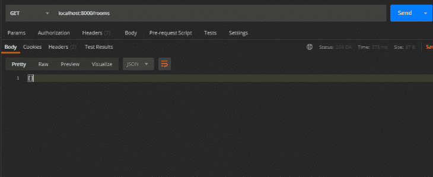
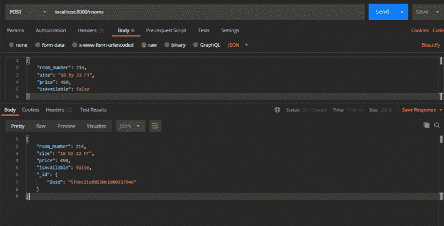

# 用 Oak 和 MongoDB 在 Deno 中构建 RESTful API

> 原文：<https://blog.logrocket.com/building-a-restful-api-in-deno-with-oak-and-mongodb/>

根据官方[文档](https://deno.land/)，Deno 是一个简单、现代、安全的 JavaScript 和 TypeScript 运行时，使用 V8 并内置于 Rust 中。它支持现成的 TypeScript 和 vanilla JS，并使用带有浏览器兼容 URL 的第三方包来管理模块。

默认情况下，Deno 是安全的，这意味着除非明确启用，否则无法访问文件、网络或环境。关于 Deno 是什么，它是如何工作的，以及为什么它会成为趋势的完整解释，请在这里阅读更多。

在本文中，我们将介绍如何使用 Oak 和 MongoDB 以及 Deno 来构建 RESTful web API，但在此之前，让我们先回顾一下 Oak 和 MongoDB。

### **橡木是什么？**

Oak 是 Deno 的 http 服务器的中间件框架，还包括一个路由器中间件，两者都受到了 T2 Koa T3 的启发。在用 Deno 构建 web 应用程序时，Oak 是最受欢迎的中间件框架。

### **什么是 MongoDB？**

MongoDB 是一个跨平台、面向文档的数据库程序，开发人员使用它来处理应用程序数据。MongoDB 将数据存储在类似 JSON 的文档中，以获得最佳的开发效率。

我们将在下面的例子中添加 MongoDB，但是我建议查看这篇文章以获得更详细的设置信息。

## 演示:使用 Deno 构建一个简单的 REST API

为了充分利用以下部分，本教程假设了一些要求:

*   了解 JavaScript/TypeScript
*   Deno 安装在您的机器上(安装指南[此处](https://deno.land/#installation))
*   您选择的文本编辑器
*   [邮递员](https://www.postman.com/)(用于 API 测试)

### **目标:用 CRUD 操作创建一个 REST API**

我们将构建一个简单的 REST API，允许我们执行基本的 CRUD 操作。

```
| METHOD | URL           | Description                   |
|--------|---------------|-------------------------------|
| GET    | /rooms        | Return all rooms from the DB  |
| GET    | /rooms/:id    | Return a single room          |
| POST   | /rooms         | Create a new room            |
| PUT    | /rooms/:id    | Update existing room          |
| DELETE | /rooms/:id    | Delete room                   |

```

### **创造** **一个** **一个**一个**一个**用橡木制成的服务器

首先，我们将创建一个名为`server.ts`的文件。然后，我们将创建一个 Deno 服务器，并从 Oak 导入我们的`Router`。接下来，我们将使用 Oak 中间件框架创建我们的路由中间件功能。

见下文:

```
// server.ts
import { Application, Router } from "https://deno.land/x/oak/mod.ts";

// these functions does not exist yet, we will create them later 
import { getAllRooms, createRooms, getRoom, updateRoom, deleteRoom  } from './routes.ts'
const app = new Application();
const router = new Router(); 
const port: number = 8000;

router.get('/', (ctx) => {
    ctx.response.body = 'Hello from Deno'
})
// these functions does not exist yet, we will create them later 
    .get('/rooms', getAllRooms)
    .get('/rooms/:id', getRoom)
    .post('/rooms', createRooms)
    .put('/rooms/:id', updateRoom)
    .delete('/rooms/:id', deleteRoom)

// Here, we are telling our application to use the router
app.use(router.routes());
app.use(router.allowedMethods())
app.listen({ port })
console.log(`Server is running on port ${port}`);

```

在第 6 行和第 7 行，我们已经初始化了我们的应用程序，并从 Oak 模块导入了路由器。

在第 9 行，我们已经配置了一个`Hello from Deno`响应，当一个请求被发送到我们的 API 的根时。

在第 10 行，我们让回调接受一个名为`ctx`的参数，这是 context 的缩写。作为参考，Oak 中的“上下文”表示通过 Oak 的中间件发送的当前请求。

最后，我们的应用程序将在`port 8000`运行。

### A **dding MongoDB**

为了设置 MongoDB，我们将创建一个`mongodb.ts`文件并添加以下代码行:

```
import { MongoClient } from "https://deno.land/x/[email protected]/mod.ts";

const client = new MongoClient();

client.connectWithUri("mongodb+srv://<DBNAME>:<DBPASSWWORD>@cluster0.6lbak.mongodb.net/deno-oak?retryWrites=true&w=majority");

const db = client.database('denoOakApi')

export default db;

```

正如你所注意到的，我们的第一步是从 Deno MongoDB 驱动包导入`MongoClient`，接下来是初始化并连接到我们托管的数据库。

## 执行基本的 CRUD 操作

我们现在准备尝试执行基本的 CRUD 操作，这将允许我们使用 Deno 和 Oak 在 MongoDB 数据库中创建、读取、更新和删除数据。

### 阅读日期

首先，我们将创建一个名为`routes.ts`的文件，并添加以下代码行:

```
import { RouterContext } from "https://deno.land/x/oak/mod.ts";
import db from './mongodb.ts'

const roomsCollection = db.collection('rooms');

const getAllRooms = async (ctx: RouterContext) => {
    const rooms = await roomsCollection.find()
    ctx.response.body = rooms
}

```

我们现在可以使用 Postman 测试我们的 API。要运行该应用程序，请导航到您的工作目录的根目录，并在您的终端上运行以下命令:

```
 deno run --allow-net --allow-plugin --allow-read --allow-write --unstable server.ts

```


现在，打开 Postman 并向`localhost:8000/rooms`发出一个`GET`请求。如果操作正确，您应该会得到一个空数组(见下文)。这是因为我们还没有向数据库添加任何数据。



### 创建数据

为了读取数据，首先必须有要读取的数据。在下面的代码块中，我们将设置自己向数据库添加数据:

```
const createRooms = async (ctx: RouterContext) => {
    const { room_number, size, price, isAvailable } = await ctx.request.body().value;
    const room: any = {
        room_number,
        size,
        price,
        isAvailable
    }
    const id = await roomsCollection.insertOne(room)
    room._id = id;
    ctx.response.status = 201
    ctx.response.body = room
}

```

注意，在第 2 行中，我们从请求体中析构了`room_number`、`size`、`price`和`isAvailable`，然后将各自的值插入到 MongoDB 数据库中的`roomsCollection`中。在第 11 行，我们发送了一个 201 状态，它将把新创建的房间返回给用户。

为了测试这个功能，我们可以在 Postman 上创建一个新的房间。为此，在将以下数据添加到请求正文后，向`localhost:8000/rooms`发出一个`POST`请求:

```
{
    "room_number": 214,
    "size": "18 by 22 FT",
    "price": 450,
    "isAvailable": false
}

```



我们现在有了新创建的带有惟一 id 的数据。

### 获取单个文档

在本例中，我们将根据 id 检索一个单间。为此，我们将从请求的`param`中获取文档的 id——如下面的第 3 行所示。最后，我们将查询我们的 MongoDB 数据库，查找其中的值与来自`ctx.params.id`的值相同的文档

```
const getRoom = async (ctx: RouterContext) => {
    // get the id of the document from the params object
    const id = ctx.params.id
    const room = await roomsCollection.findOne({ _id: { $oid: id } })
    ctx.response.body = room
}

```

要在 Postman 上测试它，向`localhost:8000/rooms/<documentID>`发出 GET 请求


### 更新现有数据

要更新一个现有的文档，我们需要获取文档的 id，然后在我们想要更新的字段上调用`$set`。使用`$set`是这里的关键；如果没有`$set`，我们将删除代码库中没有指定的所有其他字段。

```
const updateRoom = async (ctx: RouterContext) => {
    // get the id of the document from the params object
    const id = ctx.params.id
    const { room_number, size, price, isAvailable } = await ctx.request.body().value;
    const { modifiedCount } = await roomsCollection.updateOne({ _id: { $oid: id } }, {
        $set: {
            price,
            isAvailable
        }
    })
    // If the id does not exist in collection, we return a 404 status and send a custom message
    if (!modifiedCount) {
        ctx.response.status = 404;
        ctx.response.body = { message: 'Room not found' }
        return;
    }
    ctx.response.body = await roomsCollection.findOne({ _id: { $oid: id } })
}

```

要在 Postman 上测试 API，向`localhost:8000/rooms/<documentID>`发出一个 PUT 请求。

### 删除数据

用 Deno 和 Oak 从 MongoDB 集合中删除数据的过程非常简单。

一旦我们用`ctx.params.id`从参数中获得了文档的 id(正如我们在前面的例子中所做的)，剩下要做的就是在我们的集合上调用 MongoDB `deleteOne`方法，并传递我们想要删除的文档的 id。

```
const deleteRoom = async (ctx: RouterContext) => {    
    const id = ctx.params.id

    const room = await roomsCollection.deleteOne({ _id: { $oid: id } });

    if (!room) {
        ctx.response.status = 404;
        ctx.response.body = { message: 'Room not found' }
        return;
    }
    ctx.response.status = 204;
}

```

## 结论

在本文中，我们通过使用 Deno 框架 Oak 构建一个简单的 CRUD 应用程序，实现了一个 RESTful API。我们还将 Deno 应用程序连接到 MongoDB。

* * *

### 更多来自 LogRocket 的精彩文章:

* * *

正如所料，我们所涉及的仅仅触及了 Deno runtime 和 Oak framework 所能实现的皮毛。要获得更多实践，请阅读关于使用 Deno 和 Postgres 构建 RESTful APIs 的教程。更多关于 Deno 的信息，请阅读他们的[官方文件](https://deno.land/)。

* * *

请在下面的评论区告诉我你对本教程的看法。我在 Twitter 和 T2 GitHub 上社交。感谢您的阅读，敬请关注。