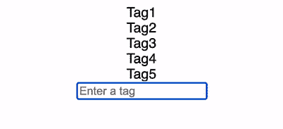
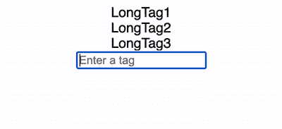
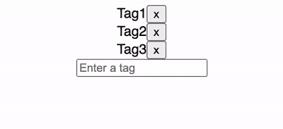

# 为 React 构建标签输入字段组件

> 原文：<https://blog.logrocket.com/building-a-tag-input-field-component-for-react/>

有没有想过如何为 React 应用程序构建标签输入字段组件？以下是方法。

首先，让我们从将要实现的标记的可视化表示开始。我们需要一个包装标签和输入字段的容器。当我们添加更多的标签时，输入字段被迫进一步向右移动，这给人一种将标签添加到输入字段的感觉。


对应于上述可视化的伪标记如下所示。

```
<div className="container">
  {tags.map((tag) => <div>{tag}</div>)}
  <input/>
</div>

```

此时，很明显我们需要一个状态变量来存储输入的标签，以及另一个状态变量来控制输入字段。`input`和`tags`状态默认分别为空字符串和空数组。

```
const [input, setInput] = useState('');
const [tags, setTags] = useState([]);

```

我们需要做的下一件事是监听输入字段的变化，这样我们就可以设置`input`状态，并创建一个逻辑在某个键被按下时填充`tags`状态。让我们假设我们想要用逗号键分隔标签，所以当这个键被按下时，我们将把`input`状态的内容作为一个新值推送到`tags`数组。

为此，我们需要使用`onChange`和`onKeyDown`事件。现在我们的标记有了一点变化，添加了新的属性:

```
<div className="container">
  {tags.map((tag) => <div className="tag">{tag}</div>)}
  <input
    value={input}
    placeholder="Enter a tag"
    onKeyDown={onKeyDown}
    onChange={onChange}
  />
</div>

```

## 输入事件的类型

### onChange

该事件仅用于监听输入字段的变化，并更新`input`状态变量。

```
const onChange = (e) => {
  const { value } = e.target;
  setInput(value);
}; 
```

### onKeyDown

与 **onChange** 事件不同， **onKeyDown** 事件公开了`key`属性，告诉我们按下了哪个键盘按键。因为我们想用逗号分隔标签，所以在 if 语句中，我们需要检查`key`是否等于`,`。

我们在 if 语句中的第二个检查是确保在通过`trim()`方法删除字符串两边的空白之后`input`状态变量不为空。

我们需要的最后一项检查是确保该标签不存在。因为我们将标签存储在`tags`状态变量中，所以我们简单地检查该数组是否包含相同的`trimmedInput`。如果没有，我们可以将这个新标签放入`tags`数组。

一旦我们进入 if 语句，我们需要通过调用`e.preventDefault()`来防止默认行为，这样即使逗号字符被注册，它也不会出现在输入字段中。接下来，使用`setTags`函数将标签推入`tags`数组。最后，我们通过将空字符串传递给`setInput`函数来清除输入字段。

```
const onKeyDown = (e) => {
  const { key } = e;
  const trimmedInput = input.trim();

  if (key === ',' && trimmedInput.length && !tags.includes(trimmedInput)) {
    e.preventDefault();
    setTags(prevState => [...prevState, trimmedInput]);
    setInput('');
  }
};

```

现在，如果您输入一个文本并点击逗号键，您将看到标签呈现在输入字段的顶部，并且输入字段被清除。


我们还需要能够在按下退格键时删除标签，这有两种不同的方法:要么立即完全删除标签，要么删除标签并将标签内容返回到输入字段，以便用户可以编辑标签并再次提交。我将展示第二种方法的实现。


因为我们需要监听退格键的按下，我们将再次使用 **onKeyDown** 事件。

这次，`key`应该等于`"Backspace"`。我们还需要检查输入字段是否为空，以及`tags`数组是否为空。

一旦这些条件成立，我们需要删除`tags`数组中的最后一项，并将最后一个元素放入输入字段。

为此，我简单地克隆了`tags`状态变量，将它扩展到一个新数组中，然后将它赋给一个名为`tagsCopy`的新变量。创建数组克隆的原因是不要改变状态变量。

然后，我对该变量调用`pop()`方法来获取数组中的最后一个元素，并将其从数组中移除。这个弹出的值现在存储在一个名为`poppedTag`的变量中。

我们使用`setTags`用`tagsCopy`数组更新`tags`状态，这个数组没有最后一个标签。现在，我们需要输入字段中弹出的标签值，这就是为什么我们调用`setInput(poppedTag)`用最后一个标签值更新`input`状态变量。

```
const onKeyDown = (e) => {
  const { key } = e;
  const trimmedInput = input.trim();

  if (key === ',' && trimmedInput.length && !tags.includes(trimmedInput)) {
    e.preventDefault();
    setTags(prevState => [...prevState, trimmedInput]);
    setInput('');
  }

  if (key === "Backspace" && !input.length && tags.length) {
    e.preventDefault();
    const tagsCopy = [...tags];
    const poppedTag = tagsCopy.pop();

    setTags(tagsCopy);
    setInput(poppedTag);
  }
};

```

这很好，但是有一个问题。当您按下退格键并且输入字段中有最后一个标签时，您可能希望按住退格键来完全删除该标签——但是对于当前的实现，如果您不快速释放该键，您将会很快删除一个又一个标签。



我期望的行为是删除输入字段中的字符，然后停止而不删除下一个标签，除非用户松开键并再次按 backspace。

这个问题的解决方法很简单。除了 **onKeyDown** 事件，我们还需要使用 **onKeyUp** 事件来跟踪一个按键是否被释放。这样，我们可以检测到用户是否按下了退格键来清除输入字段。

首先，我们需要一个新的布尔状态变量来切换按键的按下和释放。

```
const [isKeyReleased, setIsKeyReleased] = useState(false);

```

在 **onKeyDown** 功能中设置`isKeyReleased`为`false`，在 **onKeyUp** 中设置`true`。

然后我们需要使用`isKeyReleased`作为标签删除逻辑的 if 语句的条件。这样，我们只在按住退格键时删除输入字段中的字符。



下面是这两个函数的最终版本。

```
const onKeyDown = (e) => {
  const { key } = e;
  const trimmedInput = input.trim();

  if (key === ',' && trimmedInput.length && !tags.includes(trimmedInput)) {
    e.preventDefault();
    setTags(prevState => [...prevState, trimmedInput]);
    setInput('');
  }

  if (key === "Backspace" && !input.length && tags.length && isKeyReleased) {
    const tagsCopy = [...tags];
    const poppedTag = tagsCopy.pop();
    e.preventDefault();
    setTags(tagsCopy);
    setInput(poppedTag);
  }

  setIsKeyReleased(false);
};

const onKeyUp = () => {
  setIsKeyReleased(true);
}

```

不要忘记用 onKeyUp 处理程序更新 HTML 输入 ***标签。***

```
<input
  value={input}
  placeholder="Enter a tag"
  onKeyDown={onKeyDown}
  onKeyUp={onKeyUp}
  onChange={onChange}
/>

```

## 删除特定标签

为了创造良好的用户体验，能够删除特定的标签是另一个必需的特性。为了实现这一点，我们需要稍微修改一下标签标记，只添加一个 HTML 按钮 *标签。*

 *按钮的 **onClick** 事件处理程序调用名为`deleteTag`的函数，其中标签的`index`作为参数传递。

```
{tags.map((tag, index) => (
  <div className="tag">
    {tag}
    <button onClick={() => deleteTag(index)}>x</button>
  </div>
))}

```

`deleteTag`函数根据索引值过滤掉标签。因为我们传递了想要删除的标签的`index`,所以我们选择了在数组中没有相同索引位置的所有标签。

```
const deleteTag = (index) => {
  setTags(prevState => prevState.filter((tag, i) => i !== index))
}

```



此时，我们有了一个功能齐全的标签输入字段，但是它看起来显然不太好。我不会进入样式的细节，但下面你可以找到一个示例 CSS 文件，它看起来像这样:


```
.container {
  display: flex;
  overflow: scroll;
  width: 100%;
  max-width: 100%;
  padding-left: 14px;
  border: 1px grey solid;
  border-radius: 5px;
  color: black
}

.container input {
  width: 100%;
  min-width: 50%;
  border: none;
  border-radius: 5px;
  padding: 14px;
  padding-left: 14px;
}

.tag {
  display: flex;
  align-items: center;
  margin: 7px 0;
  margin-right: 10px;
  padding: 0 10px;
  padding-right: 5px;
  border: 1px solid orange;
  border-radius: 5px;
  background-color: orange;
  white-space: nowrap;
  color: white;
}

.tag button {
  display: flex;
  padding: 6px;
  border: none;
  background-color: unset;
  cursor: pointer;
  color: white;
}

```

我希望这篇关于在 React 中构建标签输入字段组件的教程对您有所帮助。感谢阅读。

## [LogRocket](https://lp.logrocket.com/blg/react-signup-general) :全面了解您的生产 React 应用

调试 React 应用程序可能很困难，尤其是当用户遇到难以重现的问题时。如果您对监视和跟踪 Redux 状态、自动显示 JavaScript 错误以及跟踪缓慢的网络请求和组件加载时间感兴趣，

[try LogRocket](https://lp.logrocket.com/blg/react-signup-general)

.

[ ](https://lp.logrocket.com/blg/react-signup-general) [](https://lp.logrocket.com/blg/react-signup-general) 

LogRocket 结合了会话回放、产品分析和错误跟踪，使软件团队能够创建理想的 web 和移动产品体验。这对你来说意味着什么？

LogRocket 不是猜测错误发生的原因，也不是要求用户提供截图和日志转储，而是让您回放问题，就像它们发生在您自己的浏览器中一样，以快速了解哪里出错了。

不再有嘈杂的警报。智能错误跟踪允许您对问题进行分类，然后从中学习。获得有影响的用户问题的通知，而不是误报。警报越少，有用的信号越多。

LogRocket Redux 中间件包为您的用户会话增加了一层额外的可见性。LogRocket 记录 Redux 存储中的所有操作和状态。

现代化您调试 React 应用的方式— [开始免费监控](https://lp.logrocket.com/blg/react-signup-general)。*