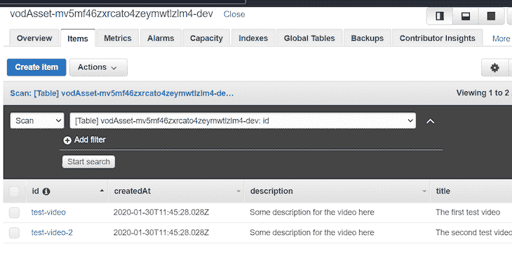
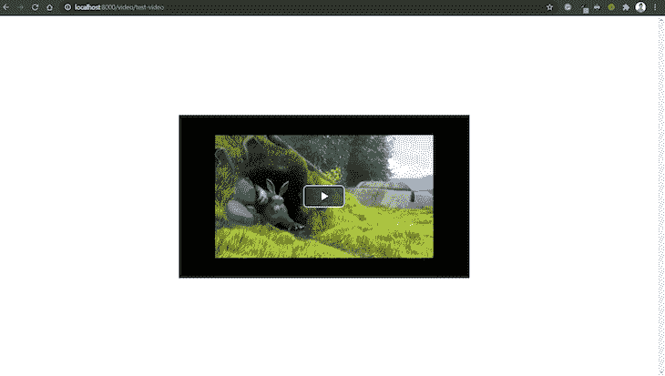

# 使用 Gatsby 和 AWS 构建视频点播应用程序

> 原文：<https://blog.logrocket.com/building-a-video-on-demand-application-using-gatsby-and-aws/>

点播流媒体平台在当代家庭中已经变得司空见惯。像网飞和亚马逊 Prime 这样强大的服务只是科技行业中 OTT 视频平台的两个例子。鉴于流媒体服务的快速增长，现在可能是媒体公司投资建设自己的视频点播网络应用程序的正确时机。

在本教程中，我们将了解如何使用 Gatsby.js(基于 React 构建的框架)和 Amazon Web Services (AWS)构建一个基本的视频点播(VoD) web 应用程序。然后，我们将使用 AWS Amplify 构建应用程序的后端，并通过 AWS 接口上传一个示例视频并在应用程序内部进行测试来测试应用程序。

以下是我们将要介绍的内容:

## 了解 AWS

为了构建我们的视频点播项目，我们将使用 AWS 和 React 作为我们的堆栈。

Amazon Web Services (AWS)是 Amazon 提供的一组基于云的服务，可以用来构建云驱动的应用程序。它们设置起来超级简单，拥有[令人惊叹的文档](https://docs.aws.amazon.com/)(由创作者和社区提供)，价格也很合理。对于初学者来说，你每年可以获得价值 100 美元的免费使用，这对刚刚开始学习它如何工作的人来说绰绰有余。AWS 为[提供了种类繁多的服务](https://blog.logrocket.com/aws-services-cheat-sheet/)，它为通用网络应用程序的几乎所有可能的用例都提供了预置。

在本教程中，我们将使用来自 AWS 的 [Amplify 微服务，它包括对许多其他内部微服务的支持，如 S3、MediaConvert 和 Cognito。Amplify 提供了一个快速界面，帮助您快速开始使用移动和网络应用程序。](https://aws.amazon.com/amplify/)

## 通过 GraphQL 使用 AWS 和 Gatsby

虽然 AWS 是我们项目的大脑，但我们仍然需要一种与用户沟通的方式。这就是前端介入的地方。此外，尽管有使用服务器端呈现来处理这种用例的常规惯例，但基于服务器的应用程序通常会在性能和离线功能方面受到影响。为了说明这一点，我们将把 Gatsby 和 GraphQL 用于 AWS。

Gatsby 是建立在 React 之上的预渲染框架。Gatsby [允许你预先渲染你的 React 代码](https://blog.logrocket.com/is-gatsby-really-that-great-e7b19c4c1c05/)，并减轻用户客户端在设备上渲染应用程序的负担。Gatsby 中的[离线插件也可以将你的应用程序转换成一个成熟的 PWA，只需要在配置文件中增加一行。](https://blog.logrocket.com/going-offline-in-gatsby/)

对我们的项目很重要的是，Gatsby 还对 GraphQL 提供了强大的支持，这是一种用于数据查询和操作的开源语言。GraphQL 是传统 REST 框架的一个很好的替代品，它允许对数据如何在 web 上传输进行高度定制。Gatsby 在其数据层[使用 GraphQL 来提升性能](https://blog.logrocket.com/how-graphql-boosts-performance-in-gatsby/)。

现在我们已经对我们的技术堆栈有了基本的了解，让我们从教程开始吧。

## 开始使用 VoD 应用程序

设置 AWS 后端需要一个可用于测试的客户端；对于我们的例子，我们将使用盖茨比。

### 建立一个基本的盖茨比项目

设置 Gatsby 项目的先决条件很简单:您需要在系统上安装最新的 nodejs 版本，以及 gatsby-cli 的全局安装。

按照以下快速步骤设置环境:

*   从他们的网站安装 [nodejs](https://nodejs.org/en/download/) 。具体说明将取决于您的操作系统。
*   一旦安装了节点，就在您的机器上安装 [git 客户端](https://git-scm.com/downloads)。同样，具体的指令将取决于您的操作系统。
*   全局安装 gatsby CLI:

```
npm install -g gatsby-cli
```

```
gatsby --help
```

一旦这些事情都完成了，你就可以着手创建一个新的项目了。虽然 Gatsby 中有大量可用的启动器，但对于我们的目的来说，使用全新的安装会更容易。运行以下命令在 Gatsby 中初始化一个新项目:

```
gatsby new vod-app
```

此时，我们将拥有一个准系统的 Gatsby 应用程序，可以对其进行定制，以包含视频点播功能。为了让用户能够使用应用程序流式传输视频内容，我们将在应用程序中添加一个页面，该页面可以使用 URL 中提供的标识符流式传输视频。

### 创建视频播放器组件

首先，在 pages 文件夹中的位置`src/components/player.js`创建一个新文件。这个文件将包含一个构建在 [Video.js](https://videojs.com/) 之上的播放器，这个库支持 JavaScript 环境中的视频流和回放。

使用 m3u8 文件有助于使用 AWS 的 VoD 支持进行流式传输。这些文件有助于将您的视频分解成更小的块，并可以使用任何支持 HLS (HTTP live streaming)的视频播放器按顺序播放。所有使用 video-js 构建的播放器都支持 HLS，这就是为什么我们为我们的视频流应用程序选择了这个库。

确保通过运行以下命令安装 video-js 包:

```
npm install video.js
```

这里的是一个基于 video-js 库的视频播放器组件的代码。

要正确设置视频的样式，您需要一个默认的 CSS 样式表。将找到的代码[放在这里](https://gist.github.com/krharsh17/05b9f391f8021390acac85859f2c3447)在`src/components/videojs.css`。

如果您正在为您的视频播放器寻找不同的皮肤，您可以从 Video.js 中寻找其他样式表。然而，对于初学者来说，上面的表格是经过反复测试的。

### 创建一个页面来容纳玩家

视频播放器组件准备就绪后，我们现在可以创建一个页面来使用它动态地传输视频。让我们从`src/pages/video.js`的一个准系统 React 组件开始。

```
import React from "react"

const VideoPage = ({ videoId }) => {
  return <div></div>
}

export default VideoPage
```

注意传递给组件的 props 中的参数`videoId`。这将包含需要播放的视频的标识符。您需要修改您的 gatsby-node 文件，以指示它在发出相关请求时传递`videoId`的值。

下面是如何在你的`gatsby-node.js`文件中设置它:

```
exports.onCreatePage = async ({ page, actions }) => {
  const { createPage } = actions
  page.matchPath = page.path

  if (page.path.match(/^/video//)) {
    await createPage({
      path: '/video',
      matchPath: '/video/:videoId',
      component: page.component,
    })
  }

}
```

完成后，使用以下代码更新您的 video.js 文件:

```
import React from "react"
import VideoPlayerJS from './../components/player';

const VideoPage = ({ videoId }) => {
  return <div 
        style={{
            width: '98vw', 
            height: '100vh', 
            display: 'flex',
            flexDirection: 'column', 
            alignItems: 'center', 
            justifyContent: 'center'
     }}>
        <div>
            <VideoPlayerJS
                autoplay={false}
                width={"640px"}
                height={"360px"}
                id={videoId}
              />
        </div>
    </div>
}

export default VideoPage
```

这将来自页面 URL 的视频 id 传递给视频播放器组件，然后视频播放器组件将从 AWS CDN 获取视频并将其流式传输以供查看。

### 创建可用视频的通用列表

您可以添加到项目中的一个附加功能是能够查看上传到您的存储桶中的视频(如在 YouTube 或网飞主页上)。

要设置这个列表，请在您的`src/pages/index.js`文件中添加以下代码:

```
import React, { useState, useEffect } from "react"

const Home = () => {
  const [videos, setVideos] = useState([])

  useEffect(() => {
    // Leave this empty for now. We'll fetch the list of videos here after setting up the backend.
  })

  return (
    <div>
      <h1> Available Content: </h1>
      <ul>
        {videos.map(video => (
          <li>
            <Link to={`/${video.id}`}>{video.id}</Link>
          </li>
        ))}
      </ul>
    </div>
  )
}

export default Home
```

这为我们的索引页面做好了准备，一旦我们配置了 AWS 后端，我们将在 useEffect 钩子内完成 API 调用[。](https://blog.logrocket.com/guide-to-react-useeffect-hook/)

现在我们已经设置好了前端，是时候看看如何使用 AWS Amplify 为我们的应用程序构建后端了。我们还将通过 AWS 界面上传一个样本视频，并在我们的应用程序中进行测试，从而对该应用程序进行测试。

### 集成 AWS 放大器

如果您的系统上没有全局安装 AWS Amplify CLI，请运行以下命令进行安装:

```
npm install -g @aws-amplify/cli
```

这需要预先在您的系统中安装 NodeJS 和 npm，这应该在您设置前端时就已经完成了。

接下来，登录 AWS 网站，为自己创建一个账户。所有 AWS 帐户都有一个免费层，足以帮助您完全建立一个项目。一旦您对自己的设置感到满意并希望扩展，AWS 将为您提供经济实惠的扩展价格。

设置好 AWS 帐户后，您需要在 Gatsby 项目中初始化一个 Amplify 项目。为此，在项目的根目录下运行以下命令:

```
amplify init
```

这将触发一系列命令行提示，引导您完成设置新 Amplify 项目的过程。一组典型的默认值如下所示:

```
$ amplify init

 Note: It is recommended to run this command from the root of your app directory
? Enter a name for the project vodapp
? Enter a name for the environment dev
? Choose your default editor: None
? Choose the type of app that you're building javascript  
Please tell us about your project
? What javascript framework are you using react
? Source Directory Path:  src
? Distribution Directory Path: public        
? Build Command:  npm.cmd run-script build  
? Start Command: npm.cmd run-script start
Using default provider  awscloudformation

For more information on AWS Profiles, see:

是可以应用于 AWS CLI 命令的设置和凭据的集合。当您指定运行命令的配置文件时，将使用设置和凭据来运行该命令。多个命名的配置文件可以存储在配置和凭证文件中。

? Do you want to use an AWS profile? Yes
? Please choose the profile you want to use default
```

请注意，如果您是第一次使用 CLI，可能需要设置 AWS 配置文件。你可以在官方 AWS 博客上找到关于如何配置配置文件的详细信息。

### 安装视频点播插件

一旦你的新的 Amplify 项目准备好了，你需要为 Amplify 安装 VOD 插件，以便把它添加到你的项目中。VOD 插件是一个开源的 npm 包，允许你在 AWS 上快速搭建视频点播系统。以下是安装方法:

```
npm i amplify-category-video -g
```

这为可通过 Amplify CLI 调配的可用资源选项添加了一个类别。否则，您将不得不在 AWS 平台上手动提供多个资源。

### 设置视频点播资源

一旦您的系统中有了可用的视频类别插件，下一步将是在您的项目中添加一个 vod 类别的实例，以便在云上提供所需的资源。为此，请运行以下命令:

```
amplify add video
```

这将触发另一系列命令行提示，帮助您在项目中设置视频资源。典型的流程如下所示:

```
$amplify add video
? Please select from one of the below mentioned services: Video-On-Demand
? Provide a friendly name for your resource to be used as a label for this category in the project: vodapp
? Select a system-provided encoding template, specify an already-created template name:  Default HLS Adaptive Bitrate
? Is this a production environment? No
? Do you want Amplify to create a new GraphQL API to manage your videos? (Beta) Yes
Video On Demand only supports GraphQL right now.
If you want to only use API for CMS then choose the default ToDo and don't edit it until later.
```

## 附加 AWS 功能

最后两个问题很重要，它们涉及到在您的 AWS 项目中设置额外的资源，这直接意味着花费更多的钱。然而，它们确实带来了一些非常重要的功能。

如果您对生产环境问题选择“是”,将会出现另一系列提示，帮助您设置一个 [Cloudfront](https://aws.amazon.com/cloudfront/) 资源。Cloudfront 是 AWS 提供的 CDN 服务，它可以帮助您更快地向全球观众提供您的视频。这个过程很简单，如果需要，可以通过 AWS 门户进行有效的调试。

最后一个问题问你是否想设置一个 GraphQL API 来管理你的视频。虽然这可能看起来有点奇怪，但 API 连接到 DynamoDB 资源，它相当于一堆表，您可以在 DynamoDB 数据库中使用这些表来帮助存储与视频相关的数据。因为你试图建立一个主页，在一个地方显示所有的视频，你需要一个公共的表来获取这些数据。对该问题选择“是”将帮助您轻松设置该资源。

以下是从这一点开始的流程:

```
? Please select from one of the below mentioned services: GraphQL
? Provide API name: vodapp
? Choose the default authorization type for the API API key
? Enter a description for the API key: mykey
? After how many days from now the API key should expire (1-365): 7
? Do you want to configure advanced settings for the GraphQL API No, I am done.
? Do you have an annotated GraphQL schema? No
? Choose a schema template: Single object with fields (e.g., "Todo" with ID, name, description)
? Do you want to edit the schema now? No
? Define your permission schema (Press *space* to select, *a* to toggle all, *i* to invert selection) Admins can only upload videos
? Do you want to edit your newly created model? No
GraphQL schema compiled successfully.
```

在`vod-app/amplify/backend/api/vod-app/schema.graphql`编辑您的模式或将`.graphql`文件放在`vod-app/amplify/backend/api/vod-app/schema`的目录中

如果此时您在 GraphQL 编译方面遇到任何问题，可能是因为您的项目中没有 Cognito 资源。您可以通过编辑您的 GraphQL 模式来解决这个问题，使其与下面给出的下一段代码完全匹配:

```
type vodAsset @model (subscriptions: {level: public})
{
  id:ID!
  title:String!
  description:String!

  #DO NOT EDIT
  video:videoObject @connection
} 

#DO NOT EDIT
type videoObject @model
{
  id:ID!
}
```

这就完成了您的 Amplify 项目的本地设置。要仔细检查一切是否正确，请尝试运行以下命令:

```
amplify status
```

运行这个程序应该会为您提供项目中可用资源的列表。如果下面显示的项目不在您的项目列表中，您可能需要重新检查您是否遵循了上述所有步骤:

```
Current Environment: dev

| Category | Resource name | Operation | Provider plugin   |
| -------- | ------------- | --------- | ----------------- |
| Api      | vodapp        | Create    | awscloudformation |
| Video    | vodapp        | Create    | awscloudformation |
```

如果一切正常，您可以通过运行以下命令开始在云上配置资源:

```
amplify push
```

您可能需要回答几个关于 GraphQL 设置的问题，主要包括您是否希望再次生成查询/变异，您在资源中需要多深的嵌套，等等。

一旦您回答了这些问题，上传过程将开始，这将需要几分钟的时间来完全设置云上的基础架构。一旦完成，你就可以开始用上传的视频样本测试你的后端了。

### 观察实际情况

您可以通过将文件上传到项目的输入桶来尝试媒体转换。为此，请遵循下面给出的步骤:

这应该足以触发 MediaConvert 作业。

要找到答案，您可以[访问媒体转换服务门户](https://ap-south-1.console.aws.amazon.com/mediaconvert/home?region=ap-south-1#/jobs/list)并查找您正在运行的作业


这项工作需要一些时间来完成。一旦完成，你将能够找到处理过的视频，准备在你的**开发输出** S3 桶中进行流式传输。打开它查看输出:


处理后的视频有自己的文件夹。如果你打开它，你会发现它已经被分解成多个小块的 m3u8。和 ts 文件。这些文件有助于将视频以小块形式传输到播放器，并适应客户端的质量和大小要求。


如果您查找文件名 test-video.m3u8，您将会找到一个与之相关联的 URL 供公众访问:


你可以试着把这个网址粘贴到一个支持 HLS 的视频播放器上，比如 VLC 或者网上的 [Amplify 视频播放器](http://amplify-video.com/player)来体验一下流媒体的体验。这就完成了我们的后端设置。

## 连接后端和前端

现在，您需要连接用播放器创建的前端视频页面，以便能够传输该视频。为此，您需要对您的`src/components/player.js`文件做一个非常小的修改。

还记得文件顶部的`generateVideoLink`函数吗？它通过使用传入页面 URL 的 id 来构建完整的视频 URL。现在看起来是这样的:

```
const generateVideoLink = id =>
  `https://unicornflix-dev-ow6z2qfpy.s3.amazonaws.com/output/${id}.m3u8`
```

您需要更新它以指向您的输出 S3 存储桶。下面是更改后的样子:

```
import awsvideoconfig from "../aws-video-exports"

const generateVideoLink = id =>
  `https://${awsvideoconfig.awsOutputVideo}/${id}/${id}.m3u8`
```

有了这个小小的改变，你的应用程序现在可以将你刚刚处理的视频流式传输到你的输出桶中。

试着点击 [URL](http://localhost:8000/video/test-video) 并检查你的浏览器是否能播放视频。如果没有，你可能错过了一些步骤，你需要重新检查它们。

### 准备主页以获取可用视频列表

现在，在您可以将您的项目称为完整的内容消费视频点播客户端之前，剩下的最后一步是能够查看应用程序中的可用视频列表。为此，您可以使用之前用 VoD 资源创建的 GraphQL API。

按照以下步骤在您的应用程序中添加视频列表功能:

首先，用一些虚拟数据填充数据库，以便您可以在测试时查看它。为此，请转到此[链接](https://ap-south-1.console.aws.amazon.com/dynamodb/home)并在列表中查找 vodAssets 表。


打开表格并点击“物件”标签。然后单击 Create item 并使用下面的 JSON 转储快速创建两个对象:

```
{
  "createdAt": "2020-01-30T11:45:28.028Z",
  "description": "Some description for the video here",
  "id": "test-video",
  "title": "The first test video",
  "updatedAt": "2020-01-30T11:45:28.028Z"
}
```

请注意，所有字段都是必需的，如果其中任何一个字段不存在，API 可能会抛出错误。这是添加两个条目后该表的外观:



现在您已经有了一些要显示的虚拟数据，通过运行下面的代码行在您的 gatsby 项目中安装 aws-amplify 依赖项:

```
npm install aws-amplify
```

安装完成后，在 src 文件夹中查找 graphql 文件夹。这是 Amplify 存储所有生成的查询、变异和订阅的地方。如果您的项目中没有该文件夹，请运行以下命令，并选择所有默认选项来生成包含相关查询的文件夹:

```
amplify codegen
```

现在，在`src/components/fetchVideos.js`创建一个文件，并将下面这段代码粘贴到其中:

```
// import the libraries
import { API, graphqlOperation } from "aws-amplify"
import awsExports from "../aws-exports"
import * as queries from "../graphql/queries"

// initialise the API client
API.configure(awsExports)

// define a function that allows you to fetch for all vodAssets in your database
const fetchVideos = async () => API.graphql(graphqlOperation(queries.listVodAssets))

export default fetchVideos
```

完成后，在`useEffect`调用中使用以下代码更新您的`src/pages/index.js`:

```
useEffect(() => {
    // fetch the videos and set them to the state object
    fetchVideos().then(r => {
      const data = r?.data?.listVodAssets?.items
      setVideos(data)
    })
  }, [])
```

就是这样！现在，如果您尝试点击 [http://localhost:8000](http://localhost:8000) ，您将会收到一个类似的列表:


当您点击一个链接，该链接上载了给定 id 的视频，您将被重定向到视频播放器:



为了允许用户上传视频，您可能想要构建一个简单的应用程序，该应用程序使用 [S3 API](https://docs.aws.amazon.com/AmazonS3/latest/API/Welcome.html) 来促进上传并为新视频创建数据库条目。您可以根据自己的需求进一步探索应用程序的样式，甚至添加附加功能，如反应、实时观众计数、评论等。

## 包扎

由于在整个教程中提到了多个 AWS 服务，如 MediaConvert、S3 和 incognito，因此了解它们在此过程中的基本角色非常重要。AWS 的官方博客详细解释了视频插件中涉及的服务，当你试图理解运行一个像添加视频资源这样简单的命令时幕后发生了什么时，这将是一笔巨大的财富。

回头看看这个教程，我们涵盖了大量的技术内容，以帮助设置我们的视频点播应用程序。我们从一个简单的前端客户端开始，并进一步添加了 AWS 和 Amplify 集成，以帮助立即与后端服务进行通信。这是一个很好的例子，说明了现代云服务已经变得多么简单，以及如何以最少的成本和努力快速构建出你脑海中的任何商业想法。

## 使用 [LogRocket](https://lp.logrocket.com/blg/signup) 消除传统错误报告的干扰

[](https://lp.logrocket.com/blg/signup)

[LogRocket](https://lp.logrocket.com/blg/signup) 是一个数字体验分析解决方案，它可以保护您免受数百个假阳性错误警报的影响，只针对几个真正重要的项目。LogRocket 会告诉您应用程序中实际影响用户的最具影响力的 bug 和 UX 问题。

然后，使用具有深层技术遥测的会话重放来确切地查看用户看到了什么以及是什么导致了问题，就像你在他们身后看一样。

LogRocket 自动聚合客户端错误、JS 异常、前端性能指标和用户交互。然后 LogRocket 使用机器学习来告诉你哪些问题正在影响大多数用户，并提供你需要修复它的上下文。

关注重要的 bug—[今天就试试 LogRocket】。](https://lp.logrocket.com/blg/signup-issue-free)