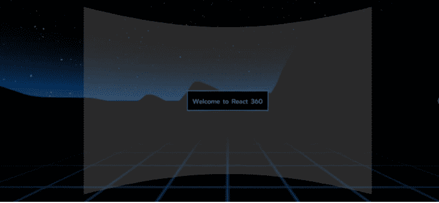

# 用 React 360 构建 VR 应用

> 原文：<https://blog.logrocket.com/building-a-vr-app-with-react-360/>

作为一名技术负责人，你可能知道虚拟现实及其各种应用。视频游戏、web 和移动应用程序等可以从 VR 的惊人功能中获益。

如果你的下一个开发目标是创建 VR 应用，并且你熟悉 React 生态系统，那么你很幸运。您现在可以使用 [React 360](https://github.com/facebookarchive/react-360) 和 JavaScript 开发令人惊叹的 VR 体验。

在本教程中，我们将向您展示如何使用 React 360 开发一个简单的交互式 React 虚拟现实应用程序。到最后，你应该准备好在 React 中构建你的第一个 VR 应用了。

我们将讨论以下内容:

## React 360 是什么？

React 360 是一个库，它利用许多 React 原生功能来创建在您的 web 浏览器中运行的虚拟现实应用程序。它使用 [Three.js](https://blog.logrocket.com/intro-to-three-js-for-game-developers/) 进行渲染，并以 npm 包的形式出现。通过将 WebGL 和 WebVR 等现代 API 与 React 的声明功能相结合，React 360 有助于简化创建跨平台 VR 体验的过程。

学习如何使用 React 360 是启动您的 VR 开发职业生涯的一个很好的方式。在本教程中，我们将涵盖所有基础知识，以帮助您开始使用 React 360。

## 安装 React 360

首先也是最重要的，你需要安装 [React 360 CLI](https://www.npmjs.com/package/react-360-cli) 。这将使您能够访问所有必要的命令，以帮助您开发虚拟现实应用程序。

现在，通过命令终端转到所需的文件夹，并运行以下命令:

```
npm install -g react-360-cli
```

这是一次性安装，所以您不必每次都这样做。位于项目文件夹中的好处是它使下面的步骤更容易。

安装完成后，创建一个名为`my-project`的新项目(创意吧？)和类型:

```
react-360 init my-project
```

您已经使用 React 360 成功创建了您的第一个虚拟现实应用程序。

要在浏览器中查看应用程序，请通过终端导航至`my-project`文件夹，然后运行`npm start`。这将在浏览器中引导您到达目的地。或者，您可以通过跟随`[http://localhost:8081/index.html](http://localhost:8081/index.html)`来访问输出。

这个应用程序应该是这样的:



[React 360 Template Screen](https://icpsoni.medium.com/creating-360-and-vr-website-with-react-360-c33a99e73e83)

既然你已经安装并运行了这个应用程序，让我们来详细讨论一下代码。我们将使用的两个重要文件是`client.js`和`index.js`。`index.js`文件由四部分组成:

*   班级
*   进口
*   风格
*   组件注册表

我们正在导入 React 以使用它的类功能。我们将从 React 360 收集一些零件来构建一个 VR 环境:

```
import React from 'react';

import {
  AppRegistry,
  StyleSheet,
  Text,
  View,
} from 'react-360';

export default class my_project extends React.Component {
  render() {
    return (

            Welcome to React 360

    );
  }
};

const styles = StyleSheet.create({
  panel: {
    width: 1000,
    height: 600,
    backgroundColor: 'rgba(255, 255, 255, 0.4)',
    justifyContent: 'center',
    alignItems: 'center',
  },
  greetingBox: {
    padding: 20,
    backgroundColor: '#000000',
    borderColor: '#639dda',
    borderWidth: 2,
  },
  greeting: {
    fontSize: 30,
  },
});

AppRegistry.registerComponent('my_project', () => my_project);

```

类语法和组件分别与 React 和 React Native 非常相似。组件允许你渲染虚拟世界的各个方面，如果你愿意的话，还可以玩玩外观和感觉。属性和 T2 将帮助你做到这一点。这里有许多相似之处来反应本机和 CSS 功能。

对于`Text`组件，您可以创建动态文本来为用户显示各种数据。最后，该类需要注册到客户端进行呈现。

你会注意到`client.js`文件中的`init`函数为你的项目创建了一个新的实例，然后利用`index.js`文件中的类为这个项目分配一个渲染方法。之后，将项目环境应用于全景图像，然后执行`init`功能。

```
import {ReactInstance} from 'react-360-web';

function init(bundle, parent, options = {}) {
  const r360 = new ReactInstance(bundle, parent, {
    fullScreen: true,
    ...options,
  });

  r360.renderToSurface(
    r360.createRoot('my_project', { }),
    r360.getDefaultSurface()
  );

  r360.compositor.setBackground(r360.getAssetURL('simmes-start-screen.jpg'));
}

window.React360 = {init};

```

这些是 React 360 功能的基础，你可以很好地进行你的第一个 VR 应用程序开发。既然你已经知道了一个 React VR app 是如何制作的，那就让我们通过一些步骤来定制它吧。

## 添加背景资产

您可以使用 React 360 将任何全景图像应用到 VR 背景。对于本教程，我们使用一个 Simmes 免费图像；你可以使用任何你喜欢的图像。

要使用全景图像作为背景，将所需图像添加到`static_assets`文件夹。该文件夹包含所有静态资产，如图片、音乐和模型，React 360 在此搜索它们。

使用下面的命令更新背景:

```
r360.compositor.setBackground(r360.getAssetURL('simmes-start-screen.jpg'));
```

## 虚拟现实互动

任何应用程序最重要和最吸引人的方面之一就是交互。没有交互，一个 app 是没有生命的。通过将`VrButton`组件添加到`index.js`文件的导入中，您可以将这一重要功能添加到 React VR 应用程序中，如下所示:

```
import {
  AppRegistry,
  StyleSheet,
  Text,
  View,
  VrButton
} from 'react-360';

```

接下来，添加一个计数器来记录点击次数。首先将点击计数设置为零:

```
state = {
  count: 0
};
```

下一步是编写一个增量函数:

```
_incrementCount = () => {
  this.setState({
    count: this.state.count + 1
  })
}
```

最后，我们将把`VrButton`渲染成这样:

```
<View style={styles.panel}>
        <VrButton
          onClick={this._incrementCount}
          style={styles.greetingBox}>
          <Text style={styles.greeting}>
            {`You have visited Simmes ${this.state.count} times`}
          </Text>
        </VrButton>
</View>
```

您已经成功设置了按钮，现在您可以看到访问您的虚拟世界的人数。

## 添加身临其境的声音

并非您创建的所有应用程序都需要声音。然而，当涉及到游戏、视频和其他沉浸式体验时，声音是必不可少的。

为了给我们的 VR 应用添加声音，我们需要从 React 360 获取更多的东西。

```
import {
  asset,
  AppRegistry,
  NativeModules,
  StyleSheet,
  Text,
  View,
  VrButton
} from 'react-360';
```

下一步是从`NativeModules` 导入`AudioModule`，并设置一个新的`const`:

```
const { AudioModule } = NativeModules;
```

一旦新的`const`被设置，我们可以添加特定的功能到声音播放的方式中。例如，我们可以让它在点击按钮时开始播放，在再次点击按钮时停止播放。

为了实现这一点，我们将向状态添加一个布尔值:

```
state = {
  count: 0,
  playSound: false
};
```

最后，我们将编写另一个函数来管理声音播放的方式:

```
_playSound = () => {
    this.setState({
      playSound: !this.state.playSound
    });

    if (this.state.playSound) {
      AudioModule.createAudio('sza', {
        source: asset('brokenclocks.mp3'),
        volume: 0.5
      });

      AudioModule.play('sza');
    }
    else {
      AudioModule.stop('sza');
    }
  }
```

一旦执行，该函数将升级设置为`false`的`playSound`状态。声音播放的方式将取决于分配给`playSound`的值。为了让它播放，必须通过`createAudio`组件创建一个音频实例。

创建后，您可以通过指定的名称播放音频。这仅在`playSound`被设置为`true`时发生。当它是`false`时，声音停止播放。这就是为什么我们每次在`playSound`是`true`的时候都会创建一个新的实例。

* * *

### 更多来自 LogRocket 的精彩文章:

* * *

我们现在将创建一个按钮来开始和停止播放声音。下面是代码的样子:

```
<View style={styles.panel}>
 <VrButton
    onClick={this._incrementCount}
    style={styles.greetingBox}>
    <Text style={styles.greeting}>
     {`You have visited Simmes ${this.state.count} times`}
  </Text>
 </VrButton>
 <VrButton
   onClick={this._playSound}
   style={styles.greetingBox}>
   <Text style={styles.greeting}>
     {'You can play the music of your people'}
   </Text>
  </VrButton>
</View>
```

您的 VR 应用程序现已完成！让我们运行应用程序，看看它看起来怎么样。

## 运行 React VR 应用程序

您可以通过`run npm start`命令查看应用程序。您的第一个 React VR 应用程序名为“我的项目”，应该包含您选择的背景和两个按钮。一个按钮控制音频，另一个按钮记录访问应用程序的用户数量。

你现在可以邀请你的朋友和家人一起玩你的新 VR 应用程序，并与其他程序员一起为应用程序集思广益。可能性是无限的。

希望这篇教程能帮助你更好地理解 React 360。

告诉我们您使用 React 360 的体验。你认为创建 VR 应用程序的最佳方式是什么？我们希望收到您的来信。

## [LogRocket](https://lp.logrocket.com/blg/react-signup-general) :全面了解您的生产 React 应用

调试 React 应用程序可能很困难，尤其是当用户遇到难以重现的问题时。如果您对监视和跟踪 Redux 状态、自动显示 JavaScript 错误以及跟踪缓慢的网络请求和组件加载时间感兴趣，

[try LogRocket](https://lp.logrocket.com/blg/react-signup-general)

.

[ ](https://lp.logrocket.com/blg/react-signup-general) [](https://lp.logrocket.com/blg/react-signup-general) 

LogRocket 结合了会话回放、产品分析和错误跟踪，使软件团队能够创建理想的 web 和移动产品体验。这对你来说意味着什么？

LogRocket 不是猜测错误发生的原因，也不是要求用户提供截图和日志转储，而是让您回放问题，就像它们发生在您自己的浏览器中一样，以快速了解哪里出错了。

不再有嘈杂的警报。智能错误跟踪允许您对问题进行分类，然后从中学习。获得有影响的用户问题的通知，而不是误报。警报越少，有用的信号越多。

LogRocket Redux 中间件包为您的用户会话增加了一层额外的可见性。LogRocket 记录 Redux 存储中的所有操作和状态。

现代化您调试 React 应用的方式— [开始免费监控](https://lp.logrocket.com/blg/react-signup-general)。