# 在普通 JavaScript - LogRocket 博客中构建可访问的术语表

> 原文：<https://blog.logrocket.com/building-accessible-glossary-vanilla-javascript/>

## 介绍

这是我第一次写这样的文章。我的大多数文章都是由我的一个想法引发的，然后我进行研究以使它生效，但这篇文章是由我最近与电子学习平台 [Kognity](https://kognity.com/) 一起进行的一个项目激发的，他们有兴趣在使用他们的平台时为他们的用户提供一流的可访问性体验。

在我们开放的平台的许多部分中，有一个来自他们教科书的交互式术语表，可以在他们的在线平台上作为可扩展/可折叠的侧边栏使用。因为我们在构建一个成功的、可访问的解决方案方面有非常好的经验，所以我想分享一下。

Kognity 解决方案是用 Vue.js 编写的，但是它的大部分功能都是特定于他们的平台的——因为我想在这篇文章中尽可能地使事情通用化——我将用普通的 JavaScript 实现一个类似的解决方案。为各种其他框架重新设计这个实现应该很容易。

我们将在本帖中讨论以下内容:

## 关于本文的屏幕截图和屏幕阅读器用法的说明

屏幕阅读器和浏览器组合之间可能存在显著差异，本文中的许多截图将展示屏幕阅读器是如何工作的。我主要是在 Mac 上，因此我的大多数截图都是在 Firefox、Chrome 和 Safari 上使用 VoiceOver。然而，本文中的代码已经在 Windows 上用 [NVDA](https://www.nvaccess.org/download/) 和 Firefox 测试过了。在行为有差异的情况下，差异会被记录下来。

由于这些显著的差异，您可能想要考虑使用像 [Assistiv Labs](https://assistivlabs.com/) 这样的解决方案进行测试，因为它们可以为虚拟机提供不同的屏幕阅读器设置，您可以远程访问。在任何情况下，只在一个屏幕阅读器/浏览器组合上测试这些代码都是错误的，因为它们的输出和功能有很大的差异，您很容易忽略问题。

## 探索术语表示例

### 认知词汇

因此，首先，让我们看看 Kognity 术语表是如何工作的。在下面的截图中，你可以看到一本 Kognity 生物教科书的一部分，以及右上角打开词汇表的按钮。


当您点按“词汇表”按钮时，词汇表会打开，您会看到如下内容:

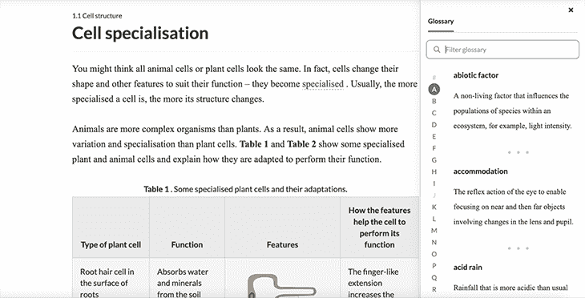

你会看到词汇表中的一些字母是灰色的——这些字母没有任何与教材的这个特定部分相关联的条目。正如您所看到的，字母 A 周围有一个蓝绿色的圆圈，表示它是词汇表第一次打开时选择的字母(当然，假设 A 下面有条目)。

这个术语表还有一些附加功能，比如通过文本输入进行过滤；在本文中，我不会实现类似的功能，但为了完整起见，我会提到它。

### HBOMax 电影片名词汇表

我相信你以前见过这样的东西:字母表中的字母被列出来，点击其中一个字母，就会显示出与该字母相关的一些内容。在这种情况下，它是一个词汇表，但您会看到一个类似的用户界面模式来导航视频产品，例如 HBOMax:

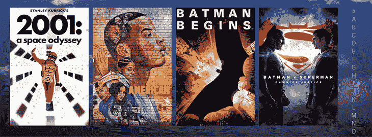

如果您点按右侧边栏中的一个字母，页面会向下滚动到标题以该字母开头的第一部电影。

所以我想我们可以同意这是一个常见的设计，但不常见的是一个经过深思熟虑的，易于使用的设计。在下一节中，我们将使用这个 HBOMax 示例对此进行更多的演示。

## 制作可访问的术语表:方法

本质上，可访问性是一个 UX 问题，每个开发人员和设计人员都必须发挥他们的想象力来解决这个问题，就像他们必须处理他们的应用程序的任何使用一样。无论你拥有什么样的特殊能力，都不会与你的所有用户相匹配。

这种想象的行为本质上是制作一个可合理访问的应用程序的关键，但是要注意警告。我说*合理*可访问是为了强调，虽然有些部分会非常困难，但使应用程序可访问所需的编程工作是微不足道的，只要你做了必要的工作，想象在某人的能力可能与你的能力不同的情况下，该应用程序将如何使用。通常，这种必要的想象工作也不会特别累人！

### 建立我们的用户档案

让我们先来描绘一下，具有不同的、特定的能力的用户将如何使用内容和工具来与您站点上的内容进行交互。拥有一组用户配置文件会很有帮助。为了构建我们的术语表，我们将设想三个不同的配置文件，如下所示:

#### 用户概况 1:不使用任何辅助设备和技术的用户

这包括那些不使用辅助设备或技术，但仍然需要它们或缺乏一些不容易用矫正设备修复的能力的人。因此，除了完全没有任何问题的人之外，在这一类别中，我们将把:

我们可以认为这是我们的基线普通用户。

#### 用户概况 2:行动不便的人

这包括那些专门使用键盘和标签快捷键来浏览网站的人，即那些不能使用鼠标或触摸板的人。

#### 用户简介 3:使用屏幕阅读器的人

有许多人可能符合这一描述。有些人能够在没有屏幕阅读器的情况下很好地看到页面并进行交互，例如那些有阅读障碍或其他语言处理困难的人，但喜欢使用屏幕阅读器来帮助。然后，有视觉困难的人，他们不是正式的盲人，可能仍然喜欢使用屏幕阅读器来帮助他们。最后，有些用户是盲人，他们绝对需要一个屏幕阅读器。

你可以从第九次 WebAim [屏幕阅读器用户调查](https://webaim.org/projects/screenreadersurvey9/)中阅读屏幕阅读器使用统计的[细目，最后一次更新是在 2021 年 6 月 30 日。](https://webaim.org/projects/screenreadersurvey9/#disabilitytypes)

## 这些不同的用户如何使用同一个网页？

不熟悉测试可访问性问题的开发人员决定通过跳转来测试一切是如何工作的。如果你能切换到事物，与他们互动，并确保他们正常工作，那么它被认为是可访问的网站。

所有的交互元素都应该通过 tab 键来访问，这当然是对可访问性的一个要求，但这主要是对第二组用户的要求，因为使用 tab 键对那些行动不便的人来说很好，他们也可以直观地处理页面的内容。

然而，屏幕阅读器的用户需要其他方式来排序和处理页面内容，我们应该在我们的解决方案中考虑这一点。

### 为屏幕阅读器设计 web 转子

具体来说，每个屏幕阅读器都有办法从正常的页面顺序中单独读取有用的页面部分。这有助于在网站上找到您想要做的事情，并导航到您感兴趣的页面部分。

例如，在 VoiceOver 中，这被称为 web 转子(或仅称为转子)。下面是 Kognity 上的转子视图，词汇表已关闭。

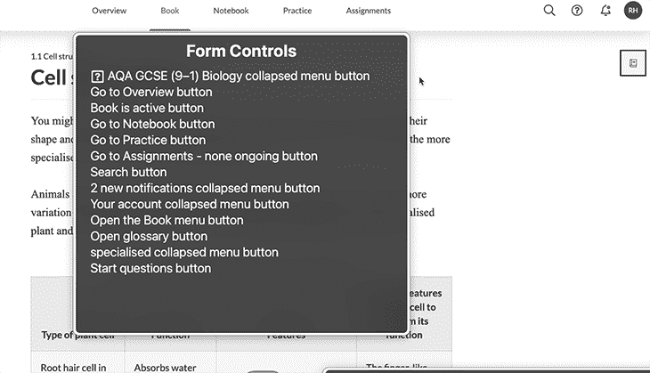

您首先会注意到只有 13 个关闭了术语表按钮的表单控件。太好了！想象一下，如果你在它打开的时候与它交互:将会有 12 个按钮，加上 26 个英文字母的按钮，总共有 38 个条目要读出。太多了！对于用户组 3 中有视力的人来说，他们当然可以直观地使用 screenreader 元素的视图。

## 为什么我们要制作一个易理解的词汇表？

为了确保人们能够充分利用我们页面上的术语表，我们应该设计一个合理的工作流程。如果与页面交互的工作流程没有经过深思熟虑，我们的页面将无法使用。

作为可访问性问题实现的一个例子，我将选择 HBOMax。我并不反对他们(虽然我希望有更多华纳兄弟的经典内容)，但我刚刚成为会员，我注意到了这些事情，因为我是一名开发人员。

假设我们位于词汇表风格导航的页面之一，如喜剧电影 A–z。如果我们使用 VoiceOver 并决定检查转子，转子将有大约 38 个按钮可供使用:

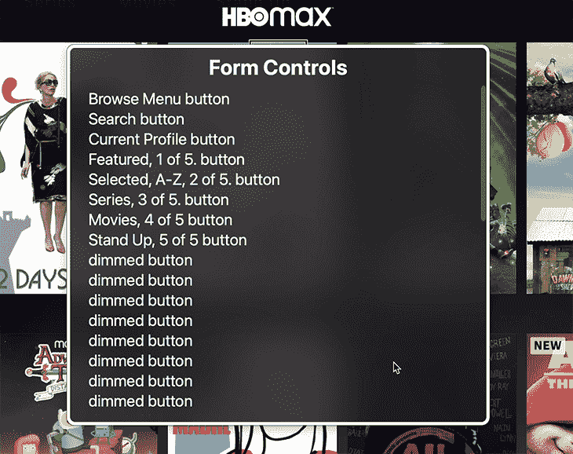

其中只有八个按钮有一个有意义的标签，或者一个让我们有机会理解它们做什么的标签。其余的都标有**暗按钮**。

“变暗的按钮”是 VoiceOver 宣布按钮当前被停用且不可由应用程序使用的方式。你可能会认为暗按钮是用来按电影标题的第一个字母导航类别的，但当你点按以该特定字母开头的标题时，你会意识到事实并非如此(尤其是因为你不太可能数暗按钮的数量并意识到有 26 个以上)。

你也可能认为暗按钮根本不能被交互，但是它们可以。如果您点按第一个变暗的按钮，那么焦点将被设置在电影第二行的第一个元素上，您将听到 VoiceOver 宣布“链接:冒险时间”。

但是这些按钮在链接元素内部。为什么一个按钮在一个链接里面，我不知道，因为我不是开发过程的一部分，但我可以假设有人认为它们应该被禁用，因为他们把 [`aria-disabled="true"`](https://a11y-101.com/development/aria-disabled) 属性放在它们上面，而没有考虑这样做对 UX 的实际影响。


在上面的截图中，你可以看到 *冒险时间* 的链接是 `aria-disabled="false"` ，它用 `role="button"` 包裹了一个 `div` 即 `aria-disabled` 。这显示在我们的灰色按钮列表中。

我还会注意到，因为有点令人恼火，在链接里面还有一个按钮。这个按钮没有被禁用，而是标有`aria-hidden="true"`，所以屏幕阅读器根本不能与之交互。这个按钮是做什么的？它允许您将媒体添加到收藏夹列表中。


有趣的是，它确实有一个咏叹调标签，告诉你它的目的，尽管它应该说类似于“将*冒险时间*添加到我的列表中”。

哦，等等——我太沉迷于这个小小的用户界面的所有错误，以至于忘了谈论术语表！

如您所见，变暗的按钮不是术语表的一部分；相反，它们不作为按钮公开，它们只是简单的文本。


如果您设法导航到您可以点按的字母列表，并到达从您点按的字母开始的第一个条目，当您在它们之间导航时，您将只听到“A”、“B”、“C”等。此外，它没有通知屏幕阅读器用户他们听到的字母是可点击的！

因此，简而言之，有时看到完全无用的东西有助于考虑需要做些什么才能使某些东西有用。

## 如何构建易于理解的术语表

既然我们已经花了很多时间讨论我为什么要写这篇文章，并展示了好的词汇表和那些明显不好的词汇表的例子，我认为是时候进入代码了——也就是说，我们将进入实现我们认为好的东西所需的工具。

首先，我将讨论代码的一些非常具体的部分，然后，当我们进入实现时，我们将讨论整个代码。

### 将 CSS 用于屏幕阅读器友好的可访问内容

如果每个人都想让自己的网站具有可访问性，那么他们需要的一件事就是只向屏幕阅读器展示一些内容。事实是，许多事情需要向有视觉障碍的用户解释，否则这些事情在视觉环境中是显而易见的。来自 WebAim 的这篇文章介绍了使用 CSS 向屏幕阅读器隐藏和显示内容的各种方法。

值得注意的一点是，向屏幕阅读器公开内容(但对其他用户隐藏)的方法都是黑客行为。在我看来，不幸的是，没有 aria 专用的属性或类似的解决方案，所以我们不能凑合使用这些黑客，因为黑客的行为不是最理想的。例如，最常见的解决方案是将只支持 screenreader 的内容放在我们希望遇到它的 DOM 部分，并使用 CSS 将其移出可见视图。这有一个副作用，会让通过键盘导航的人感到困惑，因为可聚焦的元素仍然在导航流中，但是在他们的视图之外。

尽管如此，我们将使用下面的 CSS，从上面链接的 WebAim 文章中借用，用于我们的屏幕阅读器专用类:

```
.sr-only {
    position:absolute;
    left:-10000px;
    top:auto;
    width:1px;
    height:1px;
    overflow:hidden;
}

```

除此之外，我们将做出一个违背一般可访问性建议的决定:让我们的一些按钮看起来不像按钮。

我们为什么要这么做？因为，实际上，这艘船已经起航了。人们想让按钮看起来像其他东西，但我们需要它们是按钮，因为它们有可访问性的好处。

由于人们经常想要看起来不像按钮的按钮，我将向您展示如何使用无样式的按钮仍然是可访问的。我们将不会使用一个非样式化的按钮类，而是将下面的属性应用到我们不会进行样式化的按钮上。

```
{
background: none;
    border: none;
    color: inherit;
    cursor: pointer;
    font: inherit;
    padding: 0;
    outline: inherit;
}

```

## 使用标记编写术语表条目

我们将把术语表的各个部分写成[描述列表](https://developer.mozilla.org/en-US/docs/Web/HTML/Element/dl)，有时也称为定义列表。以下是字母 A 下的词汇表条目示例，与辅助技术相关:

参见笔 [描述列表可及性术语字母 A](https://codepen.io/bryanrasmussen/pen/wvrNMWW) 作者布莱恩·拉斯姆森([@布莱恩·拉斯姆森](https://codepen.io/bryanrasmussen) )
在 [CodePen](https://codepen.io) 上。

这些术语和定义是从 usability.gov 借来的。

除此之外，如您所知，我们将使用按钮来表示术语表中的字母，如下所示:

```
<button class='letter' aria-label="Glossary letter A">A</button>

```

## 我们的第一次词汇表尝试

这里，我们有一个简单的词汇表的第一次尝试。词汇表是隐藏的，但是有一个按钮显示**显示词汇表**。单击时，术语表可见，按钮不可见。

参见 [CodePen](https://codepen.io) 上布莱恩·拉斯姆森([@布莱恩·拉斯姆森](https://codepen.io/bryanrasmussen) )
的 Pen [词汇表第一步](https://codepen.io/bryanrasmussen/pen/rNGXPrG)。

隐藏的词汇表:


显示的词汇表:


但是，当然，我们需要使用一个屏幕阅读器来处理我们所拥有的东西——而且马上就有一些东西是不好的。

例如，我们可以看到，并不是每个字母都包含词汇表中的子项，因为我们已经禁用了下面没有任何内容的字母。但是这些相同的字母如何呈现给屏幕阅读器呢？

下面，在左边，你可以看到一些被禁用的按钮；右侧是页面的 web 转子表单控件菜单。

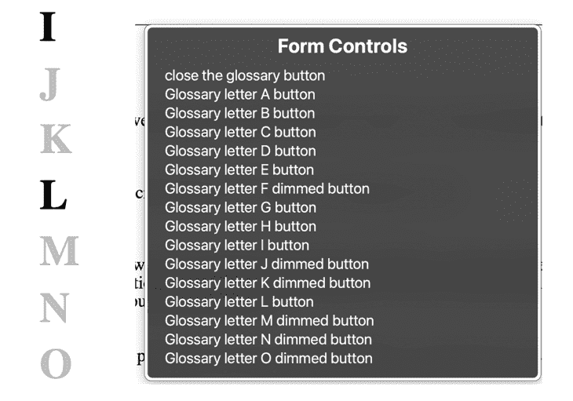

那真的很气人。被禁用的按钮仍然显示在表单控件中，这意味着如果有人要收听所有可用的按钮，他们也将听到这些变暗的按钮。

的确，他们可以听到按钮变暗，意识到字母不允许交互，并推测这是因为它在词汇表中没有任何条目。但是用这种方式传递信息似乎很困难。

此外，没有快速的方法可以找到当前打开的词汇表内容；因此，如果你开始用屏幕阅读器浏览术语表，你必须先阅读每个按钮，然后才能看到内容。

这也适用于您单击其中一个按钮的情况，比如说按钮 b。您仍然需要浏览字母表中的所有按钮，然后才能看到您单击字母 b 时显示的词汇表术语。

最后，大多数屏幕阅读器在浏览器中与内容交互时显示的行为与用户直接与之交互时不同。例如，这里是使用 VoiceOver 点按**显示术语表**按钮时术语表的外观:


没错，词汇表显示出来了，但是焦点仍然在现在隐藏的按钮上。

当您点击**关闭术语表**按钮时，这里会发生同样的事情。


最后，如果你不是一个屏幕阅读器用户，但是使用键盘在元素之间导航，我们的无样式按钮不能充分显示焦点设置。

从屏幕阅读器中删除不可用的功能

## 在这里，我建议我们从屏幕阅读器中删除术语表中无用的部分。

让我们解决这些问题。这是我们的下一个版本:

参见 [CodePen](https://codepen.io) 上布莱恩·拉斯姆森([@布莱恩·拉斯姆森](https://codepen.io/bryanrasmussen) )
的 Pen [词汇表第二步](https://codepen.io/bryanrasmussen/pen/podaLjw)。

See the Pen [glossary step 2](https://codepen.io/bryanrasmussen/pen/podaLjw) by Bryan Rasmussen ([@bryanrasmussen](https://codepen.io/bryanrasmussen))
on [CodePen](https://codepen.io).

首先，让我们来处理一些容易做到的事情:为**关闭**按钮和字母添加一个漂亮的焦点样式。

当焦点对准**关闭**按钮时，它会得到深蓝色的背景和白色的 x。

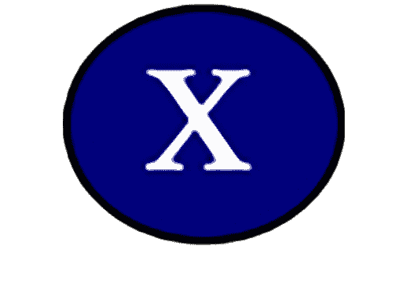

字母在圆形按钮中得到相同的样式，但有一些进一步的填充，以提供它们弹出的良好体验。

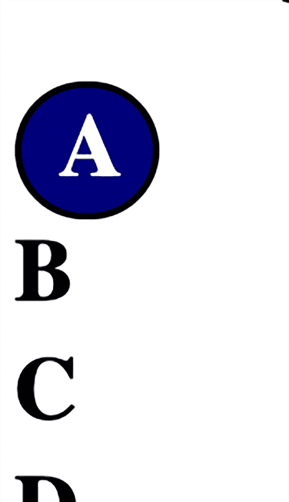

```
.letter:focus {
  text-decoration: none;
  border: 2px solid #000;
  border-radius: 300px;
  padding-left: 10px;
  padding-right: 5px;
  padding-top: 2px;
}

.letter:focus ,.close:focus {
  outline: blue;
  background-color: navy;
  color: white;
}

```

从屏幕阅读器视图中删除禁用的按钮

### 其次，让我们去掉所有禁用的按钮。这很容易做到；如果它们被禁用，我们也可以给它们一个`aria-hidden="true"`属性。

显然，术语表部分和这些部分的标题都应该只在该字母被访问时才可用。否则，我们会遇到我们之前讨论过的问题，内容太多，无法有效导航。

我们的主要问题将集中在元素上，并让我们的屏幕阅读器在不同的浏览器组合中跟随我们的焦点。

我们有两种情况需要改变焦点:

当我们打开术语表时，我们希望将焦点从**显示术语表**按钮转移到实际的术语表内容上

1.  当我们单击词汇表中的一个字母时，我们希望将焦点转移到该字母的内容上
2.  查看术语表时，您可以在术语表的右侧看到字母 A 内容。当您转到下一个字母 B 并单击时，您会看到右边的内容被替换为字母 B 的内容。

但是，如果您使用的是 screenreader，并且视力严重障碍，看不到右边显示的内容，那么当您在字母 A 中浏览并单击字母 B 时，您将无法访问该内容。

这就是为什么第二点很重要。如果你的焦点不在可见的内容上，你必须浏览整个列表才能进入内容！那会很烦人的。

要允许导航到信件内容，请在每个部分的顶部放置一个标题，这样您就可以使用标题导航快速到达那里。然后，当您单击一个字母时，将焦点设置在词汇表部分内。标题里面有一个按钮，可以转到下一个字母。

在 Safari 中使用 VoiceOver

## 当基于涉及 VoiceOver 的按钮事件将焦点更改为其他元素时，不同的 Safari 版本可能会有困难。有一些解决方法，比如使用一个 A 元素作为角色`attribute="button"`的本地链接，或者，正如我在本文的代码中所做的，在一个大于`0ms`的`setTimeout`中运行您的焦点代码。我已经用一个 16ms 的 setTimeout 将它放在事件循环的下一次迭代的顶部(当然，应用通常的附带条件)。

当然，如果这是在 React 或类似的项目中完成的，我们可能会根据单击事件的状态变化来呈现组件，在这种情况下，我们可能会决定对我们想要关注的元素使用`autofocus`属性，但在这种情况下，我们将使用 JavaScript 动态设置焦点。

所以，我认为我们做了一些合理的事情。为了证明这一点，我将展示一些我认为屏幕阅读器用户(在这种情况下使用 VoiceOver)如何导航术语表的截图。

首先，我们用 VoiceOver 进入页面。如果您按下 VoiceOver 组合键(CTRL-option-U)，您会看到以下内容:


这看起来没什么意思，但是它向您展示了有两种方法可以到达术语表按钮。按下 VO 键+向下键将选择术语表按钮:

点击它，词汇表就变得可见，我们的焦点放在字母 A 内容的标题上。


正如你所看到的，VoiceOver 将显示它当前关注的部分，因为 [VoiceOver 光标被打开](https://support.apple.com/en-au/guide/voiceover/vo15534/mac)。出于开发的目的，我认为它真的很有用，而且一般来说，许多不盲目的 screenreader 用户使用光标来帮助保持他们在页面上的位置的视觉跟踪。

当我们打开词汇表并再次查看表单控件时，我们可以看到只有未被禁用的按钮才可用，因为我们向每个也被禁用的按钮添加了`aria-hidden="true"`。

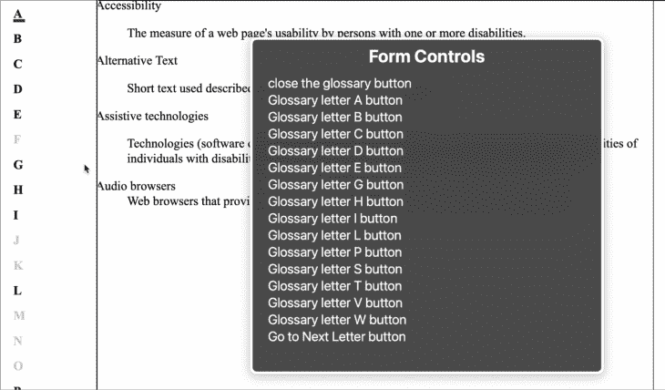

这样，在页面上熟悉我们的术语表的用户可以打开术语表，直接进入表单控件，向下导航到他们想要的字母，而不必通过标题、关闭按钮、文本部分等等。

你会注意到我们有**到下一个字母**按钮。在这里，如果你想使用它，它取决于你是否跟踪你的上下文，所以你可能想要么根本不用它，要么添加更多的内容，比如把标签改成**到下一个字母(B)** ，假设当前活动的按钮是 a

在这一点上，泛型必须让位于您希望您的站点如何工作，同样地，泛型组件将改变样式以适应站点的整体外观和感觉。

当用户从表单控件菜单中选择一个按钮时，他们最终会在页面上选择该按钮。

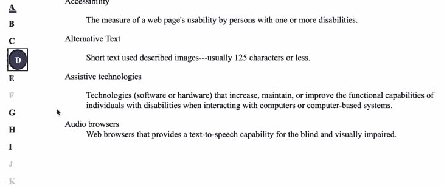此时，他们可以单击按钮，显示该字母的定义，并将焦点设置在该字母上。

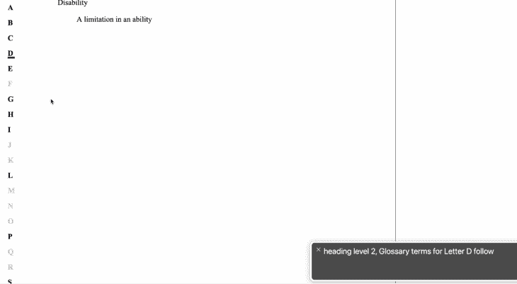

我们可以看到，虽然没有可见的 h2，但我们已经关注了它，并且屏幕阅读器已经将它读给了用户。如果他们导航到下一步，他们会得到:


屏幕阅读器和 web 转子的导航限制

## 我们又来了，观点不同。在选择一个**到下一个字母**按钮时，你可以看到一些问题，这些问题可能会让你觉得完全忽略它或者改变它在 DOM 中的位置是值得考虑的。

第一个问题是我们没有一个可见的**转到下一个字母**按钮，这意味着使用屏幕阅读器的人可能会对这一步感到困惑。当然，我们也没有之前的标题，但这没什么问题，因为在添加这些人们看不到的东西时，最好让它尽可能地符合视觉环境。看到或听到你点击的字母下的标题并不令人迷惑，因为你可能被告知有一个按钮可以点击，但却看不到这样的按钮。

由于这个例子的词汇表很短，在每个术语部分的末尾有一个**转到下一个字母**按钮可能是有意义的，或者你可以决定完全删除它，依靠人们使用他们的 screenreader 的 web rotor 来转到下一个按钮，如果你有很少或很多的定义，这个按钮也可以很好地工作。

用户可能会对定义前的**转到下一个字母**按钮感到困惑，因为实际上失明的用户可能会认为这意味着没有为该字母定义的术语。

最后，转子中的**转到下一个字母**按钮也有局限性:

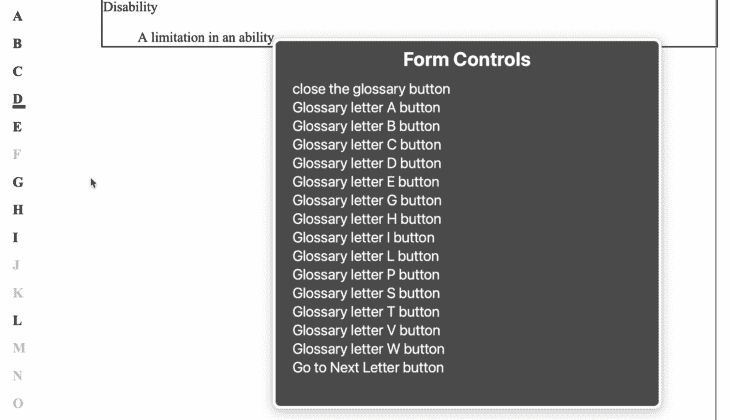

使用转子时，不会告诉您下一个字母是什么，甚至不会告诉您当前的字母是什么。

改进导航

### 让当前的**词汇表字母**按钮显示它是当前显示的字母可能是有益的，即文本显示**当前显示词汇表字母 A 按钮**，而**转到下一个字母**按钮显示**转到下一个字母，B 按钮**。

因此，如果您正在浏览转子中的按钮列表，您有两个位置可以轻松放置您的上下文。

我将进行这些更改，可以在这里看到:

参见 [CodePen](https://codepen.io) 上布莱恩·拉斯姆森([@布莱恩·拉斯姆森](https://codepen.io/bryanrasmussen) )
的 Pen [词汇表第三步](https://codepen.io/bryanrasmussen/pen/BaYvdxJ)。

See the Pen [glossary step 3](https://codepen.io/bryanrasmussen/pen/BaYvdxJ) by Bryan Rasmussen ([@bryanrasmussen](https://codepen.io/bryanrasmussen))
on [CodePen](https://codepen.io).

由于**转到下一个**按钮都在标记中，这将取决于你使用什么代码来产生你的标记(无论是模板，反应，Vue 或只是手动完成)。唯一相关的变化是在`switchSelectedLetters`函数中，每当您单击术语表按钮时都会调用该函数，如下所示:

让我们根据这些变化，再次使用术语表。系统会通知您当前正在访问的术语表按钮是当前选定的按钮。

```
const switchSelectedLetters = (target) => {
  const selector = "selectedLetter";
  const currentSelectedLetter = document.querySelector(`.${selector}`);
  const currentAria = currentSelectedLetter.getAttribute("aria-label");
  const targetAria = target.getAttribute("aria-label");
  const selectionText = "Current selected, ";
  //use [...selectionText] because we want number of characters, not code units.
  currentSelectedLetter.setAttribute("aria-label", currentAria.substring([...selectionText].length))
  currentSelectedLetter.classList.remove(selector);
  target.setAttribute("aria-label", selectionText + targetAria);
  target.classList.add(selector);
}

```

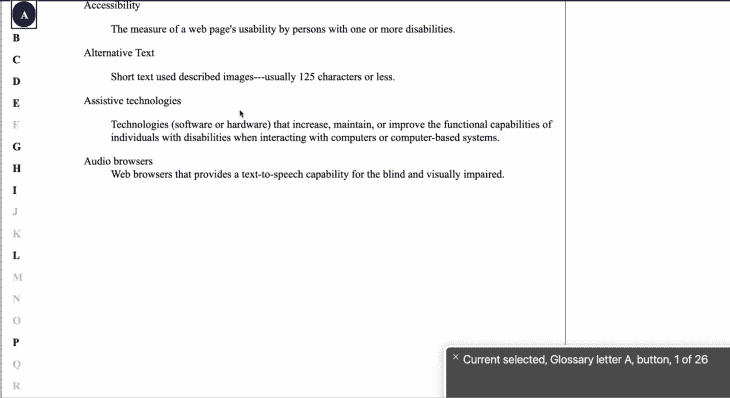

当您单击下一个按钮的**时，它将成为当前选择的按钮，您可以在转子中看到这一点。此外，**转到下一个字母**按钮还会告诉你下一个字母是什么。**

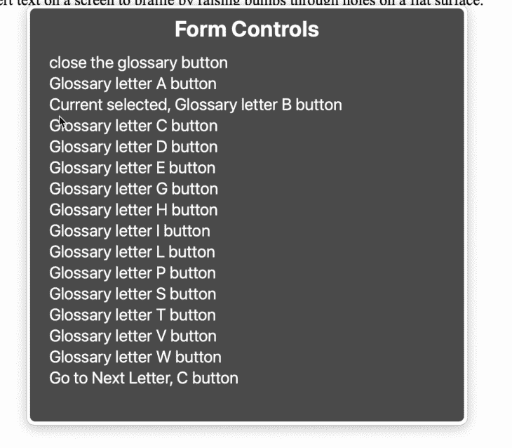

我认为，最终，这个实现给了我们一些很好的特性，让我们可以制作一个可用的、可访问的定义词汇表，这不仅会让盲人用户受益，也会让其他屏幕阅读器用户受益。

为行动不便的用户调整我们的易访问词汇表

## 最后，我将快速展示对于主要使用键盘导航的行动不便的用户来说，一切是如何可访问的。

**显示词汇表**按钮是可跳转的，当它被聚焦时会显示:

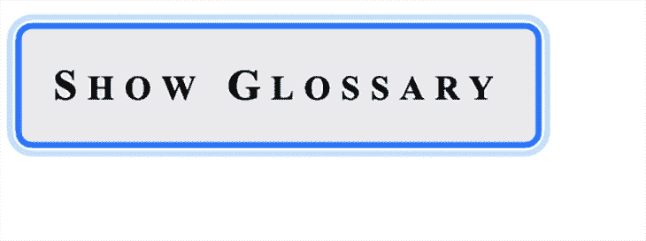

点击按钮打开词汇表:

再次按 Tab 键选择 **关闭** 按钮:


下一个选项卡选择一个字母:


如果你跳格，你会跳到下一个字母。之后，您可以点击查看字母的定义，如果您在此之后点击 tab，您将再次处于**关闭字母**，因此您可以随时快速关闭。您可能希望为 Escape 键添加一个处理程序，在本例中，通过按 Escape 键来关闭术语表，但是就目前的情况来看，它是可用的，并且我认为在逻辑上是可以理解的。

结论

## 只要你能预见到你的客户将会遇到的问题，并且记住各种辅助技术必须工作的世界的限制和模型，让一些东西变得可访问并不是特别困难。

通过理解上下文，更容易地调试 JavaScript 错误

## 调试代码总是一项单调乏味的任务。但是你越了解自己的错误，就越容易改正。

LogRocket 让你以新的独特的方式理解这些错误。我们的前端监控解决方案跟踪用户与您的 JavaScript 前端的互动，让您能够准确找出导致错误的用户行为。

LogRocket 记录控制台日志、页面加载时间、堆栈跟踪、慢速网络请求/响应(带有标题+正文)、浏览器元数据和自定义日志。理解您的 JavaScript 代码的影响从来没有这么简单过！

[](https://lp.logrocket.com/blg/javascript-signup)

.

[Try it for free](https://lp.logrocket.com/blg/javascript-signup)

.