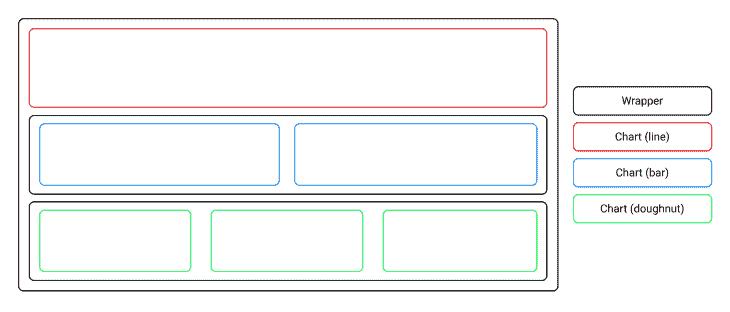
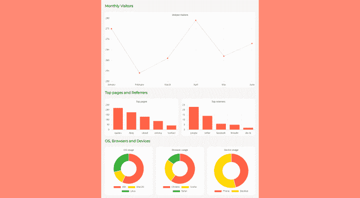

# 在 Svelte 中构建分析仪表板

> 原文：<https://blog.logrocket.com/building-analytic-dashboards-svelte/>

数据一直以来都是视觉上比较容易感知的。数据可视化使我们能够看到一段时间内的趋势，允许我们比较不同的数据集，并使我们更容易看到总数、亮点、低点等。

在软件中可视化数据的最常见方式之一是通过分析面板。我们在大多数后端系统中看到它们显示访问者参与度数据、用户活动指标、服务器统计数据和其他指标。

在本文中，我们将在[苗条的](https://svelte.dev)中构建一个分析仪表板。我们将关注如何创建组件，将数据从代码中分离出来，并实现逻辑。

作为参考，这里是最终项目的[源代码](https://codesandbox.io/s/svelte-analytics-yx0nw)。

## 创建一个苗条的线框

我们将创建一个服务器统计信息仪表板，通过三种不同类型的图表显示统计信息。将有一个折线图、两个条形图和三个圆环图。

折线图将显示六个月内的访问者统计数据。条形图将显示访问量最大的页面，以及为网站带来流量的热门推荐者。最后，圆环图将显示用户操作系统、浏览器和设备的使用情况。

分析仪表板的布局如下面的线框所示:



## 设置项目

为了搭建一个新的苗条项目，我们将使用[德吉特](https://github.com/Rich-Harris/degit)。打开您的终端并运行以下命令:`npx degit sveltejs/template svelte-analytics`。

之后，通过运行`cd svelte-analytics`将您的工作目录更改为新创建的文件夹。然后通过运行命令`npm install`安装所有必需的依赖项，使 Svelte 项目工作。

现在在您的终端中运行`npm run dev`，并在浏览器中导航到 [http://localhost:8080](http://localhost:8080) 。您应该看到一个苗条的项目预览，如下所示:


我们还将安装外部 npm 库 [Chart.js](https://www.npmjs.com/package/chart.js?activeTab=readme) ，这将帮助我们创建现代外观和交互式图表。运行`npm install chart.js`并等待终端安装完软件包。

## 模拟数据

通常，数据将从数据库中提取。因为我们将关注如何创建分析组件本身，所以我们将在一个单独的文件中创建样本数据，然后在必要的地方将其导入。

导航到`src`文件夹，在里面创建一个名为`data.js`的新文件。接下来，确保在其中包含以下代码:

```
const colors = ["tomato", "gold", "lime green"];

export const visits = {
  title: "Unique visitors",
  type: "line",
  backgroundColor: colors[0],
  labels: ["January", "February", "March", "April", "May", "June"],
  data: [275, 254, 261, 279, 262, 268]
};

export const pages = {
  title: "Top pages",
  type: "bar",
  backgroundColor: colors[0],
  labels: ["/gallery", "/blog", "/about", "/pricing", "/contact"],
  data: [220, 176, 132, 88, 44]
};

export const referrers = {
  title: "Top referrers",
  type: "bar",
  backgroundColor: colors[0],
  labels: ["google", "twitter", "facebook", "linkedin", "dev.to"],
  data: [23, 14, 6, 5, 2]
};

export const os = {
  title: "OS usage",
  type: "doughnut",
  backgroundColor: colors,
  labels: ["Win", "MacOS", "Linux"],
  data: [400, 100, 200]
};

export const browsers = {
  title: "Browser usage",
  type: "doughnut",
  backgroundColor: colors,
  labels: ["Chrome", "Firefox", "Safari"],
  data: [240, 100, 60]
};

export const devices = {
  title: "Device usage",
  type: "doughnut",
  backgroundColor: colors,
  labels: ["Phone", "Desktop"],
  data: [220, 260]
};
```

我们首先创建了一个 colors 数组来定义图表的背景色。我们使用了预定义的 HTML 颜色名称“番茄”、“黄金”和“石灰绿”，但是您可以根据您的特定项目将它们调整为任何自定义调色板。

然后，我们为每个图表创建了一个单独的对象，由图表的标题、类型、背景颜色、标签和数据组成。我们为每个变量使用了`export`语句，这样我们可以在以后将它们导入到主文件`App.svelte`中，并作为 props 传递。

## 在 Svelte 中创建图表组件

要创建一个图表组件来可视化我们的数据，在项目根目录下创建一个名为`components`的新文件夹，并在其中创建一个名为`Chart.svelte`的新文件。现在，在新创建的文件中添加以下代码:

```
<script>
    import Chart from "chart.js/auto";
    import { onMount } from "svelte";

    let ctx;
    let chartCanvas;

    export let type;
    export let labels;
    export let data;
    export let title;
    export let backgroundColor;
    export let showLegends = false;

    onMount(async () => {
      ctx = chartCanvas.getContext("2d");
      const chart = new Chart(ctx, {
        type,
        data: {
          labels,
          datasets: [
            {
              backgroundColor,
              data
            }
          ]
        },
        options: {
          plugins: {
            title: {
              display: true,
              text: title
            },
            legend: {
              display: showLegends,
              position: "bottom"
            }
          }
        }
      });
    });
</script>

<canvas bind:this={chartCanvas}></canvas>
```

我们首先从 [Chart.js](https://www.chartjs.org/) 库中导入了`Chart`组件。然后我们从 [Svelte](https://svelte.dev) 导入了内置的`onMount`函数，它在组件第一次呈现到 DOM 后运行。

然后，我们为图表本身创建了上下文和画布变量(`ctx`和`chartCanvas`)，并为我们在主`App.svelte`文件中导入`Chart`组件时需要传入的值创建了变量。

最后，在`onMount`函数中，我们创建了用于构建所有图表的`type`、`data`和`options`参数。为了将`Chart`组件呈现到屏幕上，我们将`chartCanvas`绑定到`canvas`元素。

## 创建应用程序逻辑

现在让我们将数据和图表组件放在一起。导航到`src`文件夹并打开`App.js`。向其中添加以下代码:

```
<script>
import  Chart  from  "../components/Chart.svelte";
import  {  visits,  pages,  referrers,  os,  browsers,  devices  }  from  "./data.js";
</script>

<main>
  <h3>Monthly Visitors</h3>
  <section>
  <Chart {...visits}/>
  </section>
  <h3>Top pages and Referrers</h3>
  <div id="pages">
  <section>
    <Chart {...pages}/>
  </section>
  <section>
    <Chart {...referrers}/>
  </section>
  </div>
  <h3>OS, Browsers and Devices</h3>
  <div id="devices">
  <section>
    <Chart {...os} showLegends={true}/>
  </section>
  <section>
    <Chart {...browsers} showLegends={true}/>
  </section>
  <section>
    <Chart {...devices} showLegends={true}/>
  </section>
  </div>
</main>
```

我们首先导入了`Chart`组件和之前创建的所有数据对象。因为我们为每个对象变量使用了`export`语句，所以很容易在一行中导入所有内容。

接下来，我们在整个应用程序周围使用了一个`main`包装器，为仪表板部分创建了`h3`标题，并为`pages`和`devices`部分使用了网格布局包装器，这两个部分将分别包含两个和三个图表。

然后我们包括了所有计划好的`Chart`组件。注意，我们将每个`Chart`组件包装在一个`section`标签中。这是因为 Chart.js 需要一个父元素来定义宽度，并在不同的屏幕宽度上查看时调整响应。

最后，我们使用 JavaScript [扩展语法](https://developer.mozilla.org/en-US/docs/Web/JavaScript/Reference/Operators/Spread_syntax)来传递`Chart`组件所需的道具。对于最后三个图表，我们还将显示图例，因此添加了一个额外的属性来启用该选项。

## 设计苗条的应用程序

现在让我们在应用程序中添加一些样式表规则，这样元素就可以按预期显示了。仍然在`App.svelte`文件上，在先前编写的脚本标签和 HTML 下添加以下代码:

```
<style>
  @import url("https://fonts.googleapis.com/css2?family=Montserrat&display=swap");

  :global(*) {
    margin: 0;
    padding: 0;
  }

  :global(body) {
    background-color: rgb(255, 137, 116);
    font-family: "Montserrat", sans-serif;
  }

  main {
    max-width: 800px;
    min-height: 100vh;
    margin: 0 auto;
    padding: 0 20px;
    background-color: rgb(245, 245, 245);
  }

  h3 {
    padding: 20px 0;
  }

  section {
    min-width: 100%;
    background-color: white;
    border-radius: 10px;
  }

  #pages {
    display: grid;
    grid-template-columns: repeat(2, 1fr);
    gap: 20px;
  }

  #devices {
    display: grid;
    grid-template-columns: repeat(3, 1fr);
    gap: 20px;
    padding-bottom: 20px;
  }

  @media only screen and (max-width: 560px) {
    #pages,
    #devices {
      grid-template-columns: 1fr;
    }
  }
</style>
```

首先，我们导入了 [Montserrat](https://fonts.google.com/specimen/Montserrat) 字体，并将其设置为在整个应用程序中使用。我们还为填充和边距使用了重置规则，因此仪表板在不同的浏览器上看起来是一样的。我们将页面的背景颜色设置为橙色。

对于仪表板本身，我们将宽度设置为永远不超过`800px`，并使其在视口中居中。我们还使用了一些填充，并将背景颜色设置为浅灰色。

我们为部分标题设置了一些顶部和底部填充，并为部分本身定义了宽度、背景颜色和边框半径。

对于包含多个图表的包装器，我们将布局设置为 grid，并使用`grid-template-columns`，它将主包装器的可用宽度分成两列或三列，宽度相等，它们之间有一个`20px`间隙。

最后，我们为两个网格包装器创建了 CSS 媒体规则。如果屏幕宽度为`560px`或更小，则`pages`和`devices`的网格布局切换到一列，这意味着所有包含的图表都显示在彼此的正下方。

剩下要做的最后一件事是测试应用程序。检查开发服务器是否仍在运行。如果不是，再次运行`npm run dev`并在浏览器中访问 [http://localhost:8080](http://localhost:8080) 。现在，您应该看到最终的仪表板，如下所示:



## 结论

在本教程中，我们学习了如何创建可重用的图表组件。在创建分析仪表板的过程中，我们学习了将数据从代码中分离出来，以及如何导入、导出和传递图表的类型、数据和选项。

您可以在自己的项目中随意修改和使用这个模板。此外，如果您愿意，您可以将数据移动到数据库并实现后端，以便在使用项目时更新数据。

希望你获得了一些知识，从现在开始，你在使用 Svelte 时会对实现仪表板感到更舒服。

## 使用 [LogRocket](https://lp.logrocket.com/blg/signup) 消除传统错误报告的干扰

[](https://lp.logrocket.com/blg/signup)

[LogRocket](https://lp.logrocket.com/blg/signup) 是一个数字体验分析解决方案，它可以保护您免受数百个假阳性错误警报的影响，只针对几个真正重要的项目。LogRocket 会告诉您应用程序中实际影响用户的最具影响力的 bug 和 UX 问题。

然后，使用具有深层技术遥测的会话重放来确切地查看用户看到了什么以及是什么导致了问题，就像你在他们身后看一样。

LogRocket 自动聚合客户端错误、JS 异常、前端性能指标和用户交互。然后 LogRocket 使用机器学习来告诉你哪些问题正在影响大多数用户，并提供你需要修复它的上下文。

关注重要的 bug—[今天就试试 LogRocket】。](https://lp.logrocket.com/blg/signup-issue-free)