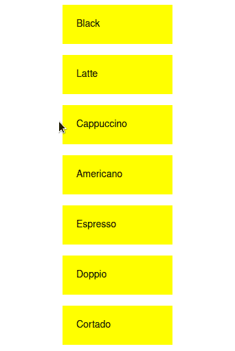
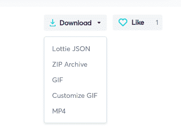
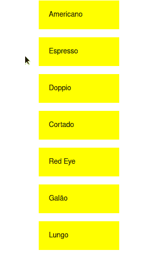

# 在 React Native 中构建动画加载器

> 原文：<https://blog.logrocket.com/building-animated-loader-react-native/>

React Native 对于希望快速构建移动应用的开发人员来说是一个非常棒的库。它提供了一种向前端显示信息的有效方式。但是在显示 API 数据之前，应用程序必须首先通知用户数据已经在路上了。

一种方法是利用动画的力量。因此，它也可以给你的用户界面一个更有活力的感觉。

比如你觉得什么给人的印象比较好？呈现一段文本:



或者用一个生动的动画:


在 React Native 世界中，有大量的库可以帮助你开始运行。在本指南中，我们将使用[洛蒂-反应-原生](https://github.com/lottie-react-native/lottie-react-native)和[反应-原生-动画](https://github.com/oblador/react-native-animatable)。这是因为他们是一个绝对的微风使用和维护良好。

## 利用洛蒂

假设您使用 Adobe After Effects 构建了一个令人惊叹的图形，并希望在您的应用程序中渲染它。但是，这是一个主要的缺陷:Adobe 不允许你这样做。

这就是洛蒂反应原生的用武之地。它允许开发人员渲染他们的动画，而无需通过代码重新创建它们。它只需要几行代码就可以工作，从而让您专注于项目中更重要的部分。

### 安装模块

要将其安装到您的应用程序中，请运行以下终端命令:

```
npm i lottie-react-native
npm i [email protected]

```

### 收购资产

您可以通过使用 [Bodymovin](https://exchange.adobe.com/creativecloud.details.12557.bodymovin.html) 插件导出动画来使用自己的动画。但是对于本指南，我们将使用[lotti files](https://lottiefiles.com)目录。它包括大量的免费动画，您可以将它们导入到您的项目中。

在本文中，我将使用[睡猫动画](https://lottiefiles.com/67834-ssssttt-shut-up-the-cat-is-sleeping)。

要在应用程序中使用您想要的动画，首先下载 JSON 格式的动画，如下所示:



接下来，将它移动到`assets`文件夹中。

### 简单用法

要使用 Lottie，请编写以下代码:

```
import React from "react";
import { StyleSheet, View, Text } from "react-native";
import LottieView from "lottie-react-native";
import { useState } from "react";
export default function SimpleLottie() {
  return (
    <View>
      <LottieView
        source={require("./assets/67834-ssssttt-shut-up-the-cat-is-sleeping.json")}
        style={styles.animation}
        autoPlay
      />
    </View>
  );
}
const styles = StyleSheet.create({
  animation: {
    width: 100,
    height: 100,
  },
});

```

组件保存了我们的动画配置。这里，`source`道具告诉我们资产的位置。此外，`autoPlay`道具告诉洛蒂在启动时运行动画。

要渲染`SimpleLottie`，请在`App.js`中编写以下代码:

```
//further code removed..
import SimpleLottie from "./SimpleLottie";
export default function App() {
  return (
    <View style={styles.container}>
      <SimpleLottie />
      <StatusBar style="auto" />
    </View>
  );
}
//...

```


### 洛蒂中的条件渲染

我们甚至可以在我们的`SimpleLottie`组件上执行条件渲染。这将模拟加载功能:

```
const [show, setShow] = useState(false);

useEffect(() => {
  setTimeout(() => setShow(true), 3000);
}, []);

return (
  <View style={styles.container}>
    {show ?<Text>Finished loading!</Text> : <SimpleLottie /> }
    <StatusBar style="auto" />
  </View>
);

```

在这段代码中，我们告诉 React 在 3 秒后反转`show`钩子的值。这将在屏幕上呈现出`Text`。


### 使用 Lottie 创建加载器组件

这里，计划显示来自[咖啡 API](https://sampleapis.com/api-list/coffee) 的数据。在加载数据时，React 将显示加载图形。
创建一个名为`DataDisplay.js`的文件。该组件在显示列表项时非常有用。在这里，编写以下代码:

```
import React from "react";
import { StyleSheet, SafeAreaView, FlatList, Text, View } from "react-native";
export default function DataDisplay({ data }) {
  const Item = ({ title }) => (
    <View style={styles.item}>
      <Text>{title}</Text>
    </View>
  );
  const renderItem = ({ item }) => <Item title={item.title} />;
  return (
    <SafeAreaView>
      <FlatList
        data={data}
        renderItem={renderItem}
        keyExtractor={(item) => item.id.toString()}
      />
    </SafeAreaView>
  );
}
const styles = StyleSheet.create({
  item: {
    backgroundColor: "yellow",
    padding: 20,
    marginVertical: 8,
  },
});

```

从这段代码中可以得出一些推论:

*   我们创建了`Item`组件和`renderItem`函数。它们将协同工作来呈现数组中的每个元素
*   稍后，我们使用`FlatList`组件来呈现列表

接下来，像这样修改您的`App.js`文件:

```
export default function App() {
  const [data, setData] = useState(null);
  const fetchData = async () => {
    const resp = await fetch("https://api.sampleapis.com/coffee/hot");
    const data = await resp.json();
    setData(data);
  };
  useEffect(() => {
    fetchData();
  }, []);
  return (
    <View style={styles.container}>
      {data ? <DataDisplay data={data} /> : <SimpleLottie />}
      <StatusBar style="auto" />
    </View>
  );
}

```

在上面的代码块中，我们告诉 React 从 API 获取数据，并将响应存储到`data`钩子中。之后，React 检查响应是否已经加载(`data`有一个值)。

如果`true`，显示 API 数据。否则，React Native 会渲染`SimpleLottie`动画。

这将是输出:


## 使用 react-native-动画

react-native-animatable 库允许开发人员通过声明性 API 创建自己的过渡和动画。这适用于装载机和闪屏。

### 装置

运行以下终端命令来获取软件包:

```
npm install react-native-animatable 

```

### 简单用法

创建一个名为`SimpleAnimatable.js`的文件。在这里，编写以下代码块:

```
import * as Animatable from "react-native-animatable";
import React from "react";

export default function SimpleAnimatable() {
  return (
    <Animatable.View>
      <Animatable.Text
        animation="bounce"
        iterationCount={"infinite"}
        direction="normal"
      >
        Loading..
      </Animatable.Text>
    </Animatable.View>
  );
}

```

让我们一段一段地剖析这段代码。

*   `Animatable.View`组件允许我们的定制组件具有动画功能
*   我们的`Text`元素将具有类似反弹的行为。此外，我们还将`iterationCount`属性设置为`infinite`。这使得动画永远循环

这将是输出:


你甚至可以得到一个“类似 flash”的动画，就像这样:

```
<Animatable.Text
   animation="flash"
//....

```


### 使用 react-native-animatable 创建加载器组件

这一步应该很简单。您可以简单地使用条件渲染:

```
{data ? <DataDisplay data={data} /> : <SimpleAnimatable />}

```



## 结论

在本文中，我们介绍了在 React Native 中构建动画的两种常用策略。在我自己的项目中，我使用 Lottie，因为它坚如磐石，非常容易使用。

此外， [Lottie 包括一个命令式 API](https://github.com/lottie-react-native/lottie-react-native#usage) ，它允许对所选动画进行更细粒度的控制。

非常感谢您的阅读！

## [LogRocket](https://lp.logrocket.com/blg/react-native-signup) :即时重现 React 原生应用中的问题。

[](https://lp.logrocket.com/blg/react-native-signup)

[LogRocket](https://lp.logrocket.com/blg/react-native-signup) 是一款 React 原生监控解决方案，可帮助您即时重现问题、确定 bug 的优先级并了解 React 原生应用的性能。

LogRocket 还可以向你展示用户是如何与你的应用程序互动的，从而帮助你提高转化率和产品使用率。LogRocket 的产品分析功能揭示了用户不完成特定流程或不采用新功能的原因。

开始主动监控您的 React 原生应用— [免费试用 LogRocket】。](https://lp.logrocket.com/blg/react-native-signup)