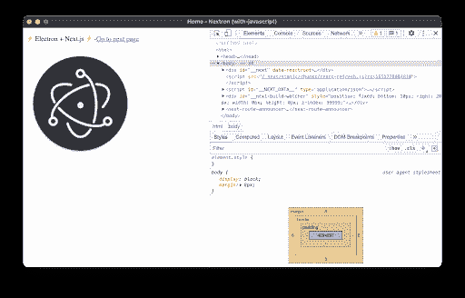
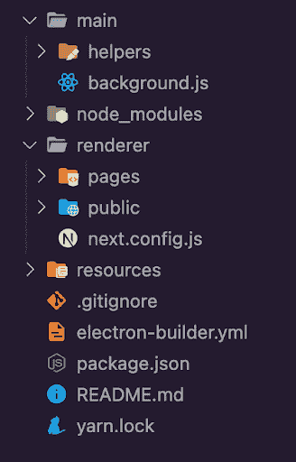
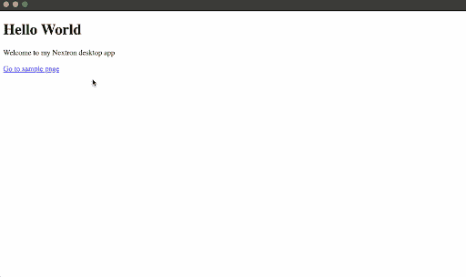
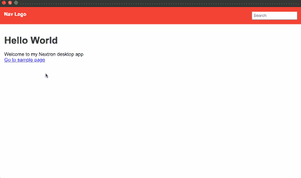
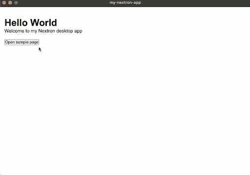

# 用 Next.js 和电子日志博客构建应用程序

> 原文：<https://blog.logrocket.com/building-app-next-js-electron/>

自从 Node.js 引入以来，基本的 web 技术(HTML、CSS 和 JavaScript)已经发展得如此之快，以至于我们现在可以用它们来构建多设备/多平台的应用程序。这种大规模的开发也导致了框架和库的引入，这进一步简化了我们的工作。Next.js 和 Electron 是这个列表中的重要例子。

在本文中，我们将探索 Nextron，这是一个结合了 Next.js 和 Electron 强大功能的包，使我们能够以最简单、最愉快的方式创建多平台桌面应用程序。

*向前跳转:*

## 先决条件

本教程需要满足以下先决条件:

*   熟悉 JavaScript
*   基本熟悉命令行/终端
*   以前使用 Next.js 和 Electron 的经验可能会有所帮助，但不是必需的

## Electron.js 是用来做什么的？

Electron 是一个开源的 JavaScript 库，允许您使用 web 技术创建跨平台的桌面应用程序。在幕后，Electron 利用 Node.js 和强大的 Chromium 引擎将使用基本 web 技术创建的应用程序呈现为桌面应用程序。因此，如果你已经熟悉了创建网站的过程，你也可以用 Electron 为不同的操作系统平台创建一个桌面应用程序。

## Electron.js 有什么优势？

电子提供了几个优点，例如:

*   跨平台:Electron 允许您为主要的操作系统创建应用程序，如 Windows、macOS 和 Linux
*   易于使用:如果你有基本的 HTML、CSS 和 Javascript 知识，你会发现开始创建一个电子应用程序很容易
*   桌面 API:electronic 使您能够使用您已经熟悉的 web 技术轻松访问桌面/硬件 API

尽管电子有许多优点，它也有一些缺点:

*   app 大小大:Electron 用 Chromium 打包，增加了捆绑应用的大小。事实上，一句“你好，世界！”以电子形式编写的应用程序可能大于 50MB
*   性能:众所周知，电子应用程序是资源消耗大户，因为它们消耗大量的电池能量和系统内存

使用两种神奇的技术，Nextron 使我们能够快速创建桌面应用程序。而且，正如您将在本教程中看到的，用 Nextron 创建桌面应用程序既简单又有趣。

## 建立你的 Nextron 项目

您可以通过运行以下命令轻松创建新的 Nextron 应用程序:

```
npx create-nextron-app appName
```

Nextron 还提供了各种支持 TypeScript 以及流行 CSS 框架的示例模板，如 Tailwind CSS、Ant Design、Material UI 和 Emotion。所有的[模板都可以在这里](https://github.com/saltyshiomix/nextron/tree/main/examples)找到，在决定为您的项目选择哪个模板之后，您可以通过在安装命令前面加上首选的示例模板和`--example`标志来安装它们。因此，如果您想使用 TypeScript 和 Tailwind 模板，您必须运行:

```
npx create-nextron-app appName --example with-typescript-tailwindcss
```

运行安装命令将为我们的项目创建所有必需的文件和目录。但是，我们仍然需要使用下面的命令安装所有必需的依赖项:

```
npm install
# OR
yarn
```

完成后，我们就可以开始应用程序了:

```
npm run dev
# OR
yarn dev
```

这将立即为我们的应用程序打开一个新窗口，如下面的屏幕截图所示:



您还可以关闭 dev 工具，以便能够全屏访问应用程序。

### Nextron 项目的文件结构

虽然可能会有微小的变化，主要取决于您在安装过程中选择的示例模板，但典型的 Nextron 项目的文件结构如下:



您可能已经注意到，所有与 Next.js 相关的代码都位于`/render`文件夹中。您可能不熟悉的其他一些文件和目录包括:

*   **`main/helpers`** —该目录导出一个名为`createWindow`的模块，该模块使用 Electron 的`BrowserWindow`函数来创建我们的桌面应用窗口。我们可以在这里配置默认的应用程序窗口选项，比如它的初始大小和位置
*   **`main/background.js`** —这个文件是初始化`createWindow`函数的地方，负责将我们的 Next.js 应用程序作为电子应用程序
*   **`resources/`** —我们可以把桌面应用资源，比如应用图标，放在这里

### Nextron 如何工作

很容易理解 Nextron 是如何在幕后工作的。它会自动检查您的应用程序是运行在开发模式还是生产模式。如果处于开发模式，Nextron 会获取通过运行 Next.js 应用程序生成的 localhost URL，并将其作为电子应用程序。但是，如果在生产中，Nextron 会获取从 Next.js 构建中生成的静态文件并呈现它们。

## 页

页面的功能与它们在标准 Next.js 应用程序中的功能完全相同，没有例外。为了进行试验，让我们在`renderer/pages`目录中创建一个新的`sample.js`文件，其内容如下:

```
import Link from "next/link";

const sample = () => {
  return (
    <>
      <div>
        <h1>Hello world</h1>
        <p>Welcome to sample page</p>
        <Link href="/home">
          <a>Go Home</a>
        </Link>
      </div>
    </>
  );
};

export default sample;
```

并且用下面的内容更新同一目录中的默认`home.jsx`文件，以便它链接到我们的新页面:

```
import Link from "next/link";

const Home = () => {
  return (
    <>
      <h1>Hello World</h1>
      <p>Welcome to my Nextron desktop app</p>
      <Link href="/sample">
        <a>Go to sample page</a>
      </Link>
    </>
  );
};

export default Home;
```

我们得到了以下结果:



## 使用布局

布局的操作就像在常规的 Next.js 应用程序中一样，也没有例外。例如，假设我们有一个想要在桌面应用程序的多个页面中共享的导航栏。首先，我们需要创建我们的布局文件；例如，`/renderer`目录中的新`layout.js`文件包含以下内容:

```
const Layout = ({ children }) => {
  return (
    <>
      <nav>
        <h2>Nav Logo</h2>
        {/* more navbar code here */}
      </nav>
      <main>{children}</main>
    </>
  );
};

export default Layout;
```

由于 Nextron 不自动包含`_app.js`文件，而该文件通常会与使用 create-next-app 包创建的应用程序一起提供，因此我们也必须手动创建一个文件，并包含我们的布局:

```
//_app.js
import Layout from "../layout";

export default function MyApp({ Component, pageProps }) {
  return (
    <Layout>
      <Component {...pageProps} />
    </Layout>
  );
}
```

将一点 CSS 应用到导航栏和我们之前生成的页面，我们将获得以下结果:



## 创建新窗口

虽然这种用法很少见，但也可以通过编程方式创建新窗口。我们通常会使用 Electron 的`BrowserWindow`来完成这项工作，但是 Nextron 已经为我们导出了一个名为`createWindow`的辅助方法，我们可以用它来代替。

假设我们想在一个新窗口中打开之前创建的`/sample`页面。我们需要首先更新`main/background.js`来加入对这个新窗口的支持:

```
import { app, ipcMain } from "electron";
. . .

  const mainWindow = createWindow("main", {
    width: 1000,
    height: 600,
  });
  const sampleWindow = createWindow("sample", {
    width: 700,
    height: 400,
    show: false,
  });

  if (isProd) {
    await mainWindow.loadURL("app://./home.html");
    await sampleWindow.loadURL("app://./sample.html");
  } else {
    const port = process.argv[2];
    await mainWindow.loadURL(`http://localhost:${port}/home`);
    await sampleWindow.loadURL(`http://localhost:${port}/sample`);
  }

  ipcMain.on("show-sample", () => {
    sampleWindow.show();
  });
. . .
```

在上面提供的代码中，在创建了`mainWindow`之后，我们立即创建了另一个窗口(`sampleWindow`，将它的初始宽度和高度设置为 700×400，并将它的显示值设置为`false`，这样这个窗口在默认情况下是不可见的。并且使用电子的`[ipcMain event emitter](https://www.electronjs.org/docs/latest/api/ipc-main)`，我们正在监听一个事件`show-sample`，因此当这个事件被发出时，我们显示新的`sampleWindow`。

下一步将是以编程方式发出该事件，我们也可以在页面中使用 ipc 轻松做到这一点。例如在`render/home.jsx`中:

```
import electron from "electron";
const ipcRenderer = electron.ipcRenderer || false;

const Home = () => {
  const openWindow = () => {
    ipcRenderer.send("show-sample");
  };

  return (
    <>
      <h1>Hello World</h1>
      <p>Welcome to my Nextron desktop app</p>
      <button onClick={openWindow}>Open sample page</button>
    </>
  );
};

export default Home;
```

如果我们运行我们的应用程序，我们将得到以下输出:



此外，我们还可以通过添加`target=_blank`属性或使用 JavaScript `window.open()`方法打开目标 URL，在新窗口中打开外部 URL。

## 电子 API

基于浏览器的 API 和电子 API 也工作得很好，您可以直接将它们导入任何页面。浏览器通知 API 就是一个例子，我们可以在如下页面中使用它:

```
const showNotification = () => {
  const notificationTitle = "My Notification 🔔";

  new Notification(notificationTitle, {
    body: "This is a sample notification.",
  }).onclick = () => console.log("Notification Clicked");
};
```

每当我们执行一个触发`showNotification`功能的动作时，我们会立即在桌面上收到一个通知。下面是一个 macOS 通知的示例:


 `Nextron webpack 流程

Nextron 应用程序通过 Next.js 运行在两个不同的 webpack 进程上，即客户端进程和服务器进程。考虑到这一点，确定您在哪个进程中是至关重要的，特别是如果您打算使用不支持服务器端呈现的库。

## 您应该检查当前进程是服务器还是客户端。根据 Nextron 文档，以下是检查电子模块的推荐语法:

或者，您可以利用 React 的`useEffect()`钩子和浏览器的`window`来检查您当前是否在客户端进程上，如下所示:

构建演示应用程序

```
import electron from 'electron';

const Home = () => {
  const moduleName = electron.moduleName || false;
  if (moduleName) {
    // we can use `electron.moduleName`
  }
};

export default Home;

```

一旦您完成了应用程序的编码，您肯定会希望生成一个可执行文件，以便您可以与其他人共享该应用程序。Nextron 通过[电子生成器](https://www.electron.build/)来处理这个问题。我们可以使用下面的命令为我们的 Nextron 项目生成可执行文件:

```
import { useEffect } from "react";

const Home = () => {
  useEffect(() => {
    if (typeof window === "undefined") {
      // we are on the client process.
    }
  }, []);
  return <div></div>;
};

export default Home;

```

## 您还可以更新您的`package.json`文件中的脚本部分，以包含其他构建选项:

因此，如果我们想为 Windows 64 位生成一个可执行文件，我们将使用以下命令:

```
npm run build
# OR
yarn build
```

结论

```
. . .
{
  "scripts": {
    "build": "nextron build",
    "build:all": "nextron build --all",
    "build:win32": "nextron build --win --ia32",
    "build:win64": "nextron build --win --x64",
    "build:mac": "nextron build --mac --x64",
    "build:linux": "nextron build --linux"
  }
}
```

在本文中，我们研究了 Nextron，这是一个 JavaScript 包，它允许我们使用 electronic 和 Next.js 轻松创建桌面应用程序。我们研究了如何创建新页面、应用程序布局和新窗口，如何使用 Electron APIs，如何检查您所在的 webpack 进程，以及如何为您的应用程序生成可执行文件。

```
npm run build:win64
# OR
yarn build:64
```

## [LogRocket](https://lp.logrocket.com/blg/nextjs-signup) :全面了解生产 Next.js 应用

调试下一个应用程序可能会很困难，尤其是当用户遇到难以重现的问题时。如果您对监视和跟踪状态、自动显示 JavaScript 错误、跟踪缓慢的网络请求和组件加载时间感兴趣，

## .

LogRocket 就像是网络和移动应用的 DVR，记录下你的 Next.js 应用上发生的一切。您可以汇总并报告问题发生时应用程序的状态，而不是猜测问题发生的原因。LogRocket 还可以监控应用程序的性能，报告客户端 CPU 负载、客户端内存使用等指标。

[try LogRocket](https://lp.logrocket.com/blg/nextjs-signup)

LogRocket Redux 中间件包为您的用户会话增加了一层额外的可见性。LogRocket 记录 Redux 存储中的所有操作和状态。

[](https://lp.logrocket.com/blg/nextjs-signup)[](https://lp.logrocket.com/blg/nextjs-signup)

让您调试 Next.js 应用的方式现代化— [开始免费监控](https://lp.logrocket.com/blg/nextjs-signup)。

The LogRocket Redux middleware package adds an extra layer of visibility into your user sessions. LogRocket logs all actions and state from your Redux stores.

Modernize how you debug your Next.js apps — [start monitoring for free](https://lp.logrocket.com/blg/nextjs-signup).`