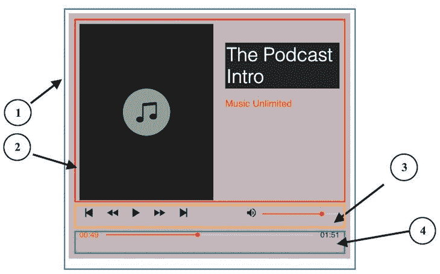
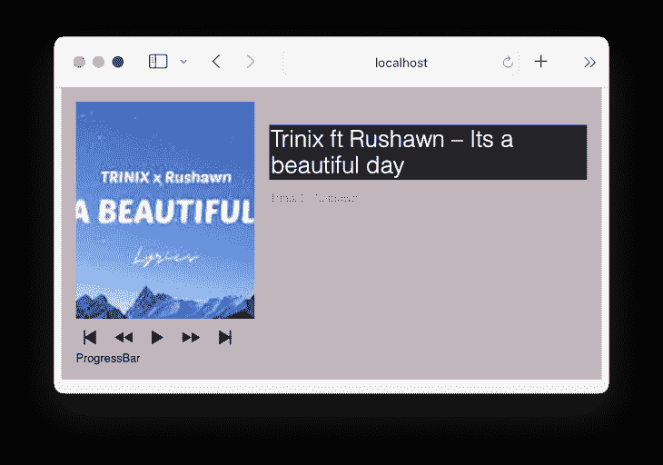
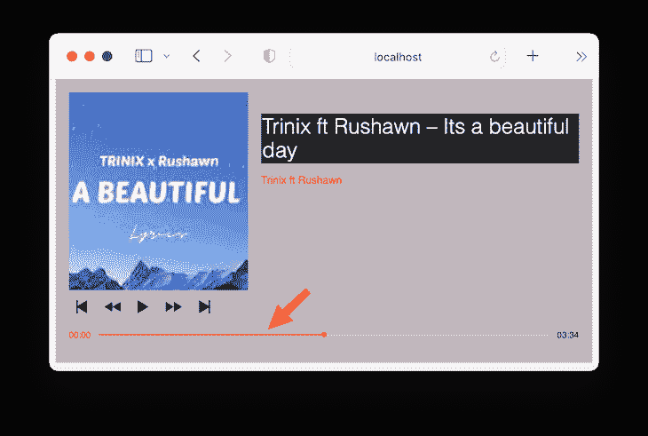
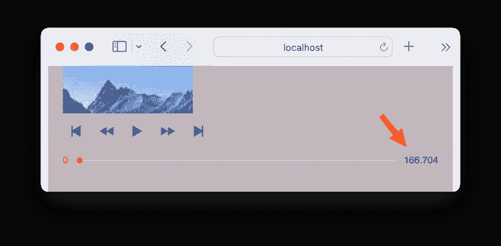
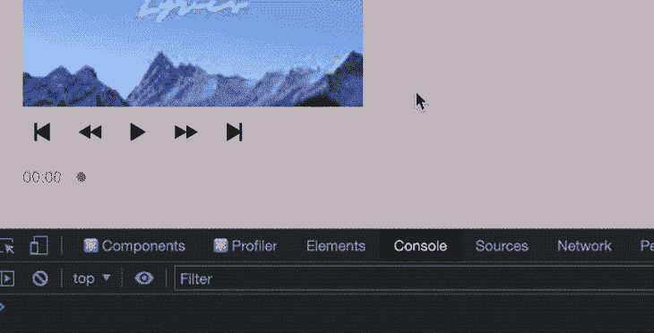

# 在 React 中构建一个音频播放器来播放声音或音乐

> 原文：<https://blog.logrocket.com/building-audio-player-react/>

如果您运行 podcast 或任何其他与声音或音乐相关的 web 应用程序，您可能想要在项目中添加音频播放器。本指南将教你如何用 React 从头开始构建一个音频播放器。

音频播放器将提供控制功能，如播放或暂停曲目、调节音量、移动到下一首或上一首曲目、移动进度滑块等。我们还将对其进行定制，使其在不同浏览器间保持一致。

向前跳:

在开始本教程之前，请确保您对 React 有一个基本的了解。

下面是我们将共同构建的最终产品的预览:



可以[和项目](https://ibaslogic.github.io/react-audio-player/)互动，之后就可以开始了！

## 设置开发环境

让我们运行下面的命令，用 `[create-react-app](https://blog.logrocket.com/getting-started-with-create-react-app-d93147444a27/)`设置一个[开发环境:](https://blog.logrocket.com/getting-started-with-create-react-app-d93147444a27/)

```
npx create-react-app react-audio-player

```

然后执行以下操作来启动项目:

```
cd react-audio-player
npm start

```

## 创建 React 音频播放器项目结构

正如你在上面的图片中看到的，我们可以把用户界面分成四个部分。图像上的数字标签对应于以下组件名称:

1.  `AudioPlayer` —父/根组件
2.  `DisplayTrack` —呈现音频内容
3.  `Controls` —渲染音频控制和音量滑块
4.  `ProgressBar` —渲染音频进度条和时间

记住这一点，我们将在`src/components`文件夹中创建组件文件。让我们确保我们的项目目录遵循以下结构:

```
react-audio-player
   ...
    ├── src
    │    ├── components
    │    │      ├── AudioPlayer.js
    │    │      ├── Controls.js
    │    │      ├── DisplayTrack.js
    │    │      └── ProgressBar.js     
    │    ├── data
    │    ├── styles
    │    │      └── index.css
    │    ├── index.js
    │   ...

```

注意，我们还在`src`中添加了一个`data`文件夹和`styles/index.css`文件，分别保存音频文件和 CSS。复制`[react-audio-player](https://github.com/Ibaslogic/react-audio-player/blob/main/src/styles/index.css)` [项目样式](https://github.com/Ibaslogic/react-audio-player/blob/main/src/styles/index.css)并粘贴到`styles/index.css`文件中。

接下来，在`components/AudioPlayer.js`文件中，让我们渲染一些简单的文本:

```
const AudioPlayer = () => {
  return (
    <div className="audio-player">
      <div className="inner">Audio player content</div>
    </div>
  );
};
export default AudioPlayer;

```

之后，用以下内容替换`src/index.js`文件的内容:

```
import React from 'react';
import ReactDOM from 'react-dom/client';
import AudioPlayer from './components/AudioPlayer';

import './styles/index.css';

const root = ReactDOM.createRoot(document.getElementById('root'));
root.render(
  <React.StrictMode>
    <AudioPlayer />
  </React.StrictMode>
);

```

保存文件并查看浏览器中呈现的`AudioPlayer`组件的内容。

## 呈现`AudioPlayer`子组件

从`DisplayTrack`组件开始。在`components/DisplayTrack.js`文件中，让我们呈现一些简单的文本:

```
const DisplayTrack = () => {
  return <div>DisplayTrack content here</div>;
};
export default DisplayTrack;

```

然后，导入`components/AudioPlayer.js`文件中的组件:

```
import DisplayTrack from './DisplayTrack';

const AudioPlayer = () => {
  return (
    <div className="audio-player">
      <div className="inner">
        <DisplayTrack />
      </div>
    </div>
  );
};
export default AudioPlayer;

```

保存文件以查看呈现在前端的组件文本。

同样，让我们为其他子组件— `Controls`和`ProgressBar`呈现一些文本。之后，我们将它们导入并渲染到`components/AudioPlayer.js`文件中，如下所示:

```
import DisplayTrack from './DisplayTrack';
import Controls from './Controls';
import ProgressBar from './ProgressBar';

const AudioPlayer = () => {
  return (
    <div className="audio-player">
      <div className="inner">
        <DisplayTrack />
        <Controls />
        <ProgressBar />
      </div>
    </div>
  );
};
export default AudioPlayer;

```

保存所有文件，并确保组件的内容呈现在前端。

## 在 React 项目中嵌入要播放的声音内容

我们将使用 HTML `<audio>`元素在我们的项目中嵌入音频。这个元素有一个用于指定音频 URL 的`src`属性和一个用于显示浏览器对音频的特定控制的`controls`属性，比如播放、暂停和其他:

```
<audio src=" " controls />

```

### 获取音频文件

我们需要音频文件来使用`<audio>`元素。因此，让我们在`src/data`文件夹中创建一个`tracks.js`文件，然后[将音轨](https://github.com/Ibaslogic/react-audio-player/blob/main/src/data/tracks.js)添加为一个对象数组，如下所示:

```
// audio files
import beautiful from './a_beautiful_day.mp3';

// audio thumbnails
import trinix from './trinix.jpeg';

export const tracks = [
  {
    title: 'Trinix ft Rushawn – Its a beautiful day',
    src: beautiful,
    author: 'Trinix ft Rushawn',
    thumbnail: trinix,
  },
  // ...
];

```

您可以从项目资源库中复制[样本音频文件，并在`src/data`文件夹中使用它们。](https://github.com/Ibaslogic/react-audio-player/tree/main/src/data)

### 渲染音频播放器

因为我们将需要多个子组件中的音频数据，所以我们将在`AudioPlayer`父组件中导入播放列表文件。然后，我们将创建一个状态来处理当前的音轨。现在，我们将分配播放列表中的第一首曲目。

`components/AudioPlayer.js`文件现在看起来像这样:

```
import { useState } from 'react';
import { tracks } from '../data/tracks';

// import components
import DisplayTrack from './DisplayTrack';
import Controls from './Controls';
import ProgressBar from './ProgressBar';

const AudioPlayer = () => {
  const [currentTrack, setCurrentTrack] = useState(tracks[0]);
  return (
    <div className="audio-player">
      <div className="inner">
        <DisplayTrack currentTrack={currentTrack} />
        <Controls />
        <ProgressBar />
      </div>
    </div>
  );
};
export default AudioPlayer;

```

在代码中，我们使用零`[0]`索引将数组中的第一个轨道分配给一个状态。注意我们是如何将状态传递给`DisplayTrack`组件的。

让我们从`components/DisplayTrack.js`文件中访问状态，并更新`<audio>`标签的`src`属性:

```
const DisplayTrack = ({ currentTrack }) => {
  return (
    <div>
      <audio src={currentTrack.src} controls />
    </div>
  );
};
export default DisplayTrack;

```

如果我们保存所有文件，音频应该呈现如下:


音频控件的外观因浏览器而异。因此，我们将创建一个自定义控件来获得跨浏览器的一致外观和感觉，并添加额外的功能。

让我们从移除`<audio>`标签中的`controls`属性开始，以消除浏览器的默认控件。我们应该具备以下条件:

```
<audio src={currentTrack.src} />

```

接下来，我们将添加一些自定义控件。

## 为 React 声音播放器添加自定义控制

首先，我们需要控制图标。让我们在项目中运行以下命令，从[React 图标库](https://blog.logrocket.com/react-icons-comprehensive-tutorial-examples/)中获取图标:

```
npm install react-icons

```

之后，打开`components/Controls.js`文件，渲染控件图标。然后，我们应该有以下内容:

```
import { useState } from 'react';

// icons
import {
  IoPlayBackSharp,
  IoPlayForwardSharp,
  IoPlaySkipBackSharp,
  IoPlaySkipForwardSharp,
  IoPlaySharp,
  IoPauseSharp,
} from 'react-icons/io5';

const Controls = () => {
  const [isPlaying, setIsPlaying] = useState(false);
  return (
    <div className="controls-wrapper">
      <div className="controls">
        <button>
          <IoPlaySkipBackSharp />
        </button>
        <button>
          <IoPlayBackSharp />
        </button>

        <button>
          {isPlaying ? <IoPauseSharp /> : <IoPlaySharp />}
        </button>
        <button>
          <IoPlayForwardSharp />
        </button>
        <button>
          <IoPlaySkipForwardSharp />
        </button>
      </div>
    </div>
  );
};

export default Controls;

```

在代码中，请注意我们使用了`[useState()](https://blog.logrocket.com/a-guide-to-usestate-in-react-ecb9952e406c/)`[钩子](https://blog.logrocket.com/a-guide-to-usestate-in-react-ecb9952e406c/)来动态呈现播放和暂停图标。让我们添加单击按钮时切换图标的功能。

更新播放/暂停按钮以包含`[onClick](https://blog.logrocket.com/react-onclick-event-handlers-guide/)`[事件处理程序](https://blog.logrocket.com/react-onclick-event-handlers-guide/)，如下所示:

```
<button onClick={togglePlayPause}>
  {isPlaying ? <IoPauseSharp /> : <IoPlaySharp />}
</button>

```

然后，在`return`语句上方添加以下处理程序，以便在单击`togglePlayPause`按钮时切换布尔状态值:

```
const togglePlayPause = () => {
  setIsPlaying((prev) => !prev);
};

```

保存您的文件，并确保在您单击播放和暂停按钮时切换它们。

## `play()`和`pause()` HTML 音频方法

为了播放和暂停音轨，`<audio>`元素公开了`play()`和`pause()`方法。要调用这些方法，我们必须能够访问`<audio>`元素。在 React 中，我们用`[useRef](https://blog.logrocket.com/accessing-previous-props-state-react-hooks/#useref-depth-overlooked-react-hook)`[钩子](https://blog.logrocket.com/accessing-previous-props-state-react-hooks/#useref-depth-overlooked-react-hook)来表示。

因为我们将在多个子组件中需要这个`<audio>`引用，所以我们将在它们的父组件中创建它。打开`components/AudioPlayer.js`文件，导入`useRef`钩子:

```
import { useRef, useState } from 'react';

```

然后，初始化`return`语句上面的`useRef`，并将其传递给`DisplayTrack`和`Controls`组件:

```
const AudioPlayer = () => {
  const [currentTrack, setCurrentTrack] = useState(tracks[0]);

  // reference
  const audioRef = useRef();

  return (
    <div className="audio-player">
      <div className="inner">
        <DisplayTrack
          currentTrack={currentTrack}
          audioRef={audioRef}
        />
        <Controls audioRef={audioRef} />
        <ProgressBar />
      </div>
    </div>
  );
};
export default AudioPlayer;

```

在`DisplayTrack`组件中，让我们访问引用并将其分配给`<audio>`元素上的`ref`属性:

```
const DisplayTrack = ({ currentTrack, audioRef }) => {
  return (
    <div>
      <audio src={currentTrack.src} ref={audioRef} />
    </div>
  );
};
export default DisplayTrack;

```

如果我们保存我们的文件，我们现在应该可以通过为`ref`返回的对象访问`<audio>`元素的方法和属性。您可以在`AudioPlayer`组件中记录`audioRef`，并在浏览器控制台中查看它返回的内容:

```
const audioRef = useRef();
console.log(audioRef);

```

接下来，让我们打开`components/Controls.js`文件并访问引用变量。然后，在它的`current`对象上，我们可以调用`play()`和`pause()`方法:

```
import { useState, useEffect } from 'react';

// icons here

const Controls = ({ audioRef }) => {
  // ...
  useEffect(() => {
    if (isPlaying) {
      audioRef.current.play();
    } else {
      audioRef.current.pause();
    }
  }, [isPlaying, audioRef]);

  return (
    // ...
  );
};

export default Controls;

```

上面代码中的重点是`[useEffect](https://blog.logrocket.com/using-react-useeffect-hook-lifecycle-methods/)`[钩子](https://blog.logrocket.com/using-react-useeffect-hook-lifecycle-methods/)。在钩子中，我们检查了`isPlaying`状态值是否为真，以播放或暂停音轨。

如果我们保存文件并访问前端，我们应该能够播放和暂停当前的音轨。

## 显示当前轨道数据

为了渲染当前的音轨标题、作者和缩略图，让我们打开`components/DisplayTrack.js`文件并更新 JSX 以包含数据:

```
import { BsMusicNoteBeamed } from 'react-icons/bs';

const DisplayTrack = ({ currentTrack, audioRef }) => {
  return (
    <div>
      <audio src={currentTrack.src} ref={audioRef} />
      <div className="audio-info">
        <div className="audio-image">
          {currentTrack.thumbnail ? (
            
          ) : (
            <div className="icon-wrapper">
              <span className="audio-icon">
                <BsMusicNoteBeamed />
              </span>
            </div>
          )}
        </div>
        <div className="text">
          <p className="title">{currentTrack.title}</p>
          <p>{currentTrack.author}</p>
        </div>
      </div>
    </div>
  );
};
export default DisplayTrack;

```

在上面的代码中，焦点是在`<audio>`标签下的`div`包装元素。在这个`div`中，我们从检查缩略图是否存在开始，以显示它或呈现自定义样式。

注意，我们从`react-icons`库中导入了一个图标来设计默认缩略图。随后，我们在缩略图后渲染了音轨标题和作者的名字。

如果我们保存文件，结果应该是这样的:



## 配置进度条和音量滑块

为了添加这些功能，我们将使用 HTML `input` range 元素。从进度条开始，让我们打开`components/ProgressBar.js`文件并更新 JSX，这样我们就有了以下内容:

```
const ProgressBar = () => {
  return (
    <div className="progress">
      <span className="time current">00:00</span>
      <input type="range" />
      <span className="time">03:34</span>
    </div>
  );
};

export default ProgressBar;

```

如果我们保存文件并查看项目，我们将看到浏览器的默认输入范围。使用 CSS 规则创建跨浏览器一致的 range 元素需要做更多的工作。

为此，让我们创建一个`styles/customize-progress-bar.css`文件，复制`[react-audio-player](https://github.com/Ibaslogic/react-audio-player/blob/main/src/styles/customize-progress-bar.css)` [项目的 CSS 规则](https://github.com/Ibaslogic/react-audio-player/blob/main/src/styles/customize-progress-bar.css)，并粘贴到新创建的 CSS 文件中。

接下来，在`src/index.js`中导入 CSS 文件:

```
// css
import './styles/index.css';
import './styles/customize-progress-bar.css';

```

确保您保存了所有文件。

值得注意的是，我们在 CSS 文件中使用了一个 CSS 变量来动态分配进度宽度:

```
input[type="range"] {
  --range-progress: 0;
  /* ... */
}

input[type="range"]::before {
  /* ... */
  background: #f50;
  width: var(--range-progress);
  /* ... */
}

```

我们从零值开始。我们将根据音频进度动态更新该值。现在，让我们暂时将 CSS 变量值修改为 50%，如下所示:

```
input[type="range"] {
  --range-progress: 50%;
  /* ... */
}

```

然后我们将有一个进度条，其样式达到总长度的 50 %:



让我们将分配给 CSS 变量的值返回给`0`:

```
input[type="range"] {
  --range-progress: 0;
  /* ... */
}

```

### 实施受控和非受控输入

在 React 中，像 range 这样的表单输入既可以是受控的，也可以是不受控的。使用受控输入，组件管理状态，我们为每个状态更新编写一个处理程序。对于不受控制的输入，DOM 管理状态，我们使用 ref 从 DOM 获取输入值。

我们将学习实现受控和非受控输入。我们将在进度条上实现非受控逻辑，在音量滑块上实现受控逻辑。

回到进度条，我们将得到对输入范围的引用。因为我们将在多个子组件中需要这个引用，所以我们将在它们的父组件中初始化它。

打开`components/AudioPlayer.js`文件，在`return`语句上方初始化一个 ref，并将其传递给`<ProgressBar />`:

```
const AudioPlayer = () => {
  // ...
  const progressBarRef = useRef();

return (
  <div className="audio-player">
    <div className="inner">
      <DisplayTrack
        currentTrack={currentTrack}
        audioRef={audioRef}
      />
      <Controls audioRef={audioRef} />
      <ProgressBar progressBarRef={progressBarRef} />
    </div>
  </div>
);
};
export default AudioPlayer;

```

为了使我们的代码简短，我们可以重写返回的 JSX，这样我们就有了:

```
return (
  <div className="audio-player">
    <div className="inner">
      <DisplayTrack {...{ currentTrack, audioRef }} />
      <Controls {...{ audioRef }} />
      <ProgressBar {...{ progressBarRef }} />
    </div>
  </div>
);

```

让我们保存我们的文件，打开`components/ProgressBar.js`文件，访问引用，并将其分配给`<input />`元素上的`ref`属性:

```
const ProgressBar = ({ progressBarRef }) => {
  return (
    <div className="progress">
      <span className="time current">00:00</span>
      <input type="range" ref={progressBarRef} />
      <span className="time">03:34</span>
    </div>
  );
};

export default ProgressBar;

```

现在我们有了对`<input />`的引用，我们将添加一个`onChange`事件来获取每个点的输入值。我们还将默认值设置为`0`,这样范围缩略图从开始处开始。组件现在看起来像这样:

```
const ProgressBar = ({ progressBarRef }) => {
  const handleProgressChange = () => {
    console.log(progressBarRef.current.value);
  };

  return (
    <div className="progress">
      <span className="time current">00:00</span>
      <input
        type="range"
        ref={progressBarRef}
        defaultValue="0"
        onChange={handleProgressChange}
      />
      <span className="time">03:34</span>
    </div>
  );
};

export default ProgressBar;

```

当改变进度条时，我们将在浏览器控制台中看到相应的值。

我们现在将这个值赋给音频播放的`currentTime`属性。此属性使用秒作为度量单位返回音频播放的当前位置。

为了获得`currentTime`属性，我们需要音频引用。幸运的是，我们之前在`components/AudioPlayer.js`文件中创建了它。所以，让我们把它传递给`<ProgressBar />`组件，这样我们就有了以下内容:

```
<ProgressBar {...{ progressBarRef, audioRef }} />

```

之后，打开`components/ProgressBar.js`文件，访问音频 ref。然后，我们将进度条值分配给`currentTime`属性:

```
const ProgressBar = ({ progressBarRef, audioRef }) => {
  const handleProgressChange = () => {
    audioRef.current.currentTime = progressBarRef.current.value;
  };
  return (
    // ...
  );
};

export default ProgressBar;

```

让我们保存所有文件。当我们改变进度条时，音频播放会跳到指定的位置。请注意，时间现在是静止的，范围进度颜色没有进展。我们会到达那里的！

## 显示时间进度和持续时间

我们将从创建保存音频时间的状态开始。在`components/AudioPlayer.js`文件中，添加状态并将状态变量传递给`<ProgressBar />`:

```
const AudioPlayer = () => {
  // ...
  const [timeProgress, setTimeProgress] = useState(0);
  const [duration, setDuration] = useState(0);

  // reference

  return (
    <div className="audio-player">
      <div className="inner">
        {/* ... */}
        <ProgressBar
          {...{ progressBarRef, audioRef, timeProgress, duration }}
        />
      </div>
    </div>
  );
};
export default AudioPlayer;

```

保存文件，从`ProgressBar`组件获取状态，并在 JSX 中呈现它们:

```
const ProgressBar = ({
  // ...
  timeProgress,
  duration,
}) => {
  // ...
  return (
    <div className="progress">
      <span className="time current">{timeProgress}</span>
      {/* ... */}
      <span className="time">{duration}</span>
    </div>
  );
};

export default ProgressBar;

```

### 更新音频时间

像当前时间一样，正如我们前面看到的，我们也可以通过`duration` audio 属性访问音轨持续时间。

从持续时间开始，我们希望在音频元数据加载后立即获取并显示音轨持续时间。我们将在`<audio />`上使用`onloadedmetadata`事件。

打开`components/DisplayTrack.js`文件并包含该事件:

```
const DisplayTrack = ({ currentTrack, audioRef }) => {

  const onLoadedMetadata = () => {
    console.log(audioRef.current.duration);
  };

  return (
    <div>
      <audio
        src={currentTrack.src}
        ref={audioRef}
        onLoadedMetadata={onLoadedMetadata}
      />
      {/* ... */}
    </div>
  );
};
export default DisplayTrack;

```

如果我们保存并打开控制台，我们将看到以秒为单位的持续时间。

接下来，我们将使用音频持续时间更新持续时间状态变量，并确保`<input>`进度条的`max`属性与持续时间匹配。

在`AudioPlayer`组件中，让我们将`setDuration`和`progressBarRef`传递给`<DisplayTrack />`:

```
const AudioPlayer = () => {
  // ...

  return (
    <div className="audio-player">
      <div className="inner">
        <DisplayTrack
          {...{ currentTrack, audioRef, setDuration, progressBarRef }}
        />
        {/* ... */}
      </div>
    </div>
  );
};
export default AudioPlayer;

```

然后，在`DisplayTrack`组件中，获取这些道具并更新`onloadedmetadata`处理程序:

```
const DisplayTrack = ({
  // ...
  setDuration,
  progressBarRef,
}) => {
  const onLoadedMetadata = () => {
    const seconds = audioRef.current.duration;
    setDuration(seconds);
    progressBarRef.current.max = seconds;
  };

  return (
    // ...
  );
};
export default DisplayTrack;

```

现在，我们应该看到显示的音轨时长:



曲目持续时间目前只以秒为单位显示，但如果同时显示分钟和秒，会更容易阅读。让我们创建一个将时间格式化为所需显示的函数。

### 格式化音频时间

在`ProgressBar`组件中，在`return`语句上方添加以下代码:

```
const formatTime = (time) => {
  if (time && !isNaN(time)) {
    const minutes = Math.floor(time / 60);
    const formatMinutes =
      minutes < 10 ? `0${minutes}` : `${minutes}`;
    const seconds = Math.floor(time % 60);
    const formatSeconds =
      seconds < 10 ? `0${seconds}` : `${seconds}`;
    return `${formatMinutes}:${formatSeconds}`;
  }
  return '00:00';
};

```

`formatTime`函数接受以秒为单位的时间参数，并将其重新格式化为分:秒。然后，我们将像这样使用 JSX 中的函数:

```
return (
  <div className="progress">
    <span className="time current">{formatTime(timeProgress)}</span>
    {/* ... */}
    <span className="time">{formatTime(duration)}</span>
  </div>
);

```

保存文件，并查看我们想要的格式的音频时间。

## `requestAnimationFrame` API

我们需要一种机制来告诉浏览器重新绘制每次更新，以显示当前时间和范围进度。虽然我们可能会想到使用`setInterval()`，但是当我们想要处理重复的动画时，`requestAnimationFrame`会更加高效和流畅。

这个 API 接受一个回调，每当它启动时就调用这个回调。为了触发 API 并告诉浏览器更新屏幕，我们可能会在音频开始播放且当前时间增加时调用它。

让我们打开`components/Controls.js`文件，一旦回放在`useEffect`钩子中进行，就触发这个 API:

```
const playAnimationRef = useRef();

const repeat = () => {
  console.log('run');

  playAnimationRef.current = requestAnimationFrame(repeat);
};

useEffect(() => {
  if (isPlaying) {
    audioRef.current.play();
    playAnimationRef.current = requestAnimationFrame(repeat);
  } else {
    audioRef.current.pause();
    cancelAnimationFrame(playAnimationRef.current);
  }
}, [isPlaying, audioRef, repeat]);

```

`requestAnimationFrame`返回我们分配给`playAnimationRef.current`的`request-id`。ref 将随时间保留返回的 id。这个 id 允许我们在暂停播放后取消请求。

注意回调是如何递归调用自身来重复动画的。如果我们保存文件并单击音频播放按钮，我们将看到重复功能在浏览器控制台中重复运行。

我们还会看到一个终端警告，说重复函数改变了每次渲染的依赖关系。让我们通过将回调封装在[一个](https://blog.logrocket.com/react-usememo-vs-usecallback-a-pragmatic-guide/) `[useCallback](https://blog.logrocket.com/react-usememo-vs-usecallback-a-pragmatic-guide/)` [钩子](https://blog.logrocket.com/react-usememo-vs-usecallback-a-pragmatic-guide/)中来记住回调的定义。让我们从 React 中导入`useCallback`:

```
import {
  //...
  useCallback,
} from 'react';

```

然后，将`repeat`回调更新为以下内容:

```
const repeat = useCallback(() => {
  console.log('run');

  playAnimationRef.current = requestAnimationFrame(repeat);
}, []);

```

接下来，我们将在该回调中定义以下功能:

*   用当前音频时间更新`timeProgress`状态变量
*   确保进度条随着当前音频时间前进
*   动态更新音频进度，即设定播放部分的长度

让我们将`progressBarRef`、`duration`状态变量和`setTimeProgress`从`AudioPlayer`组件传递到`Controls`组件:

```
const AudioPlayer = () => {
  // ...
  return (
    <div className="audio-player">
      <div className="inner">
        {/* ... */}
        <Controls
          {...{ audioRef, progressBarRef, duration, setTimeProgress }}
        />
        {/* ... */}
      </div>
    </div>
  );
};
export default AudioPlayer;

```

接下来，让我们访问`Controls`组件中的道具并更新`repeat`回调，这样我们就有了以下内容:

```
const Controls = ({
  audioRef,
  progressBarRef,
  duration,
  setTimeProgress,
}) => {
  // ...

  const repeat = useCallback(() => {
    const currentTime = audioRef.current.currentTime;
    setTimeProgress(currentTime);
    progressBarRef.current.value = currentTime;
    progressBarRef.current.style.setProperty(
      '--range-progress',
      `${(progressBarRef.current.value / duration) * 100}%`
    );

    playAnimationRef.current = requestAnimationFrame(repeat);
  }, [audioRef, duration, progressBarRef, setTimeProgress]);

  // ...
  return (
    // ...
  );
};

export default Controls;

```

重点是`repeat`回调。通过`setTimeProgress`更新功能，我们可以更新音频经过时间。我们还将当前时间分配给距离值，以便它继续前进。

关于播放部分的长度，我们抓取了我们在 CSS 文件中声明的 CSS 变量并动态更新它。

如果我们保存文件并播放音轨，我们应该会看到以下行为:



请注意，如果我们暂停音频，改变进度条将不会反映动画，直到我们再次按下播放。这是因为我们在暂停条件下调用了`cancelAnimationFrame`来取消它。

我们可以移除`cancelAnimationFrame`并将`requestAnimationFrame`移出状态，因此我们有以下内容:

```
useEffect(() => {
  if (isPlaying) {
    audioRef.current.play();
  } else {
    audioRef.current.pause();
  }
  playAnimationRef.current = requestAnimationFrame(repeat);
}, [isPlaying, audioRef, repeat]);

```

该项目现在应该如预期的那样工作。

## 在 React 音乐播放器中导航曲目

让我们使用下一个、上一个、向前跳和向后跳按钮。我们将从给它们附加`onClick`事件开始。在`components/Controls.js`文件中，更新 JSX 中的`buttons`以包含`onClick`事件:

```
return (
  <div className="controls-wrapper">
    <div className="controls">
      <button onClick={handlePrevious}>
        <IoPlaySkipBackSharp />
      </button>
      <button onClick={skipBackward}>
        <IoPlayBackSharp />
      </button>

      <button onClick={togglePlayPause}>
        {isPlaying ? <IoPauseSharp /> : <IoPlaySharp />}
      </button>
      <button onClick={skipForward}>
        <IoPlayForwardSharp />
      </button>
      <button onClick={handleNext}>
        <IoPlaySkipForwardSharp />
      </button>
    </div>
  </div>
);

```

然后，在`return`语句之上，添加它们各自的处理函数:

```
const skipForward = () => {};

const skipBackward = () => {};

const handlePrevious = () => {};

const handleNext = () => {};

```

### 处理下一首曲目

为了处理下一首和上一首曲目，我们需要知道当前播放曲目的索引，并能够访问播放列表。在`components/AudioPlayer.js`文件中，让我们为轨道索引初始化一个状态:

```
const [trackIndex, setTrackIndex] = useState(0);

```

`currentTrack`状态当前应该是这样的:

```
const [currentTrack, setCurrentTrack] = useState(tracks[0]);

```

让我们把它改为:

```
const [currentTrack, setCurrentTrack] = useState(tracks[trackIndex]);

```

接下来，让我们将`tracks`、`trackIndex`、`setTrackIndex`和`setCurrentTrack`传递给`<Controls />`组件:

```
<Controls
  {...{
    // ...
    tracks,
    trackIndex,
    setTrackIndex,
    setCurrentTrack,
  }}
/>

```

我们将从`Controls`组件中访问它们作为道具，然后更新`handleNext`处理程序，因此我们有如下内容:

```
const handleNext = () => {
  if (trackIndex >= tracks.length - 1) {
    setTrackIndex(0);
    setCurrentTrack(tracks[0]);
  } else {
    setTrackIndex((prev) => prev + 1);
    setCurrentTrack(tracks[trackIndex + 1]);
  }
};

```

使用上面的代码，每当我们点击“下一个”按钮时，我们检查我们是否在最后一个索引中——即最后一个曲目。然后，我们将索引设置为`0`——即第一首曲目——并将曲目重置为播放列表中的第一项。否则，我们将索引和轨道设置为播放列表中的下一个。

保存文件，并确保“下一步”按钮按预期工作。

### 处理上一首曲目

类似于“下一个轨道”处理程序，让我们更新`handlePrevious`处理程序，这样我们就有了以下内容:

```
const handlePrevious = () => {
  if (trackIndex === 0) {
    let lastTrackIndex = tracks.length - 1;
    setTrackIndex(lastTrackIndex);
    setCurrentTrack(tracks[lastTrackIndex]);
  } else {
    setTrackIndex((prev) => prev - 1);
    setCurrentTrack(tracks[trackIndex - 1]);
  }
};

```

如果当前曲目索引为`0`，我们将索引和曲目重置为播放列表中的最后一项。否则，我们将索引和轨道设置为播放列表中的前一个。

### 向前和向后跳跃

在用于向前和向后跳转的相应处理程序中，我们将从音频 ref 中访问当前时间，并分配一个以秒为单位的数值:

```
const skipForward = () => {
  audioRef.current.currentTime += 15;
};

const skipBackward = () => {
  audioRef.current.currentTime -= 15;
};

```

我们分配了 15 秒的跳跃时间，如上图所示。保存并确保控制按钮按预期工作。

## 添加音量滑块

正如我们前面提到的，我们将使用 HTML input range 元素通过滑块来控制音量。在`Controls`组件中，让我们在控制容器之后添加体积容器元素:

```
return (
  <div className="controls-wrapper">
    <div className="controls">{/* ... */}</div>
    <div className="volume">
      <button>icons</button>
      <input type="range" min={0} max={100} />
    </div>
  </div>
);

```

我们还提到，我们将使这个输入滑块成为一个受控输入。

让我们从初始化`Controls`组件中的状态开始:

```
const [volume, setVolume] = useState(60);

```

然后，更新输入元素以包含一个`value`和`onChange`属性:

```
<input
  type="range"
  min={0}
  max={100}
  value={volume}
  onChange={(e) => setVolume(e.target.value)}
/>

```

接下来，我们将把`volume`状态变量的返回值附加到音频的`volume`属性。让我们通过在`Controls`组件内的`return`语句上方添加以下代码来实现这一点:

```
useEffect(() => {
  if (audioRef) {
    audioRef.current.volume = volume / 100;
  }
}, [volume, audioRef]);

```

在这个组件中，我们可以访问音频参考。因为音频的音量属性的最大值是 1，所以我们将我们的`volume`状态——其最大值是 100——除以 100，这样它们可以同步。

保存文件，并确保您可以增加和减少音量。

### 设定体积进度的样式

让我们利用`volume`状态变量来动态地设计卷进度。在 volume input 元素上，让我们添加一个`style`属性来样式化进度:

```
<input
  // ...
  style={{
    background: `linear-gradient(to right, #f50 ${volume}%, #ccc ${volume}%)`,
  }}
/>

```

上面的代码使用 CSS 线性渐变来设置音量进度条的样式。随着`volume`状态的增加，进度条的橙色背景色也会匹配，直到它占据进度条的剩余长度。记得保存文件，并确保它的工作！

### 设置音量图标

在`Controls`组件中，让我们首先初始化一个状态，以便在音量静音时进行处理:

```
const [muteVolume, setMuteVolume] = useState(false);

```

默认情况下，我们给它一个布尔值`false`。接下来，让我们在 volume 容器元素中定位下面的`button`:

```
<button>icons</button>

```

用以下代码替换它:

```
<button onClick={() => setMuteVolume((prev) => !prev)}>
  {muteVolume || volume < 5 ? (
    <IoMdVolumeOff />
  ) : volume < 40 ? (
    <IoMdVolumeLow />
  ) : (
    <IoMdVolumeHigh />
  )}
</button>

```

在上面的代码中，我们附加了一个切换`muteVolume`状态的`onClick`事件。我们还使用了基于`volume`状态变量的值来动态渲染图标的条件。

在保存文件之前，让我们在文件顶部导入以下`react-icons`组件:

```
import {
  IoMdVolumeHigh,
  IoMdVolumeOff,
  IoMdVolumeLow,
} from 'react-icons/io';

```

最后，在`useEffect`钩子中，让我们将布尔`muteVolume`状态分配给音频的`muted`属性:

```
useEffect(() => {
  if (audioRef) {
    audioRef.current.volume = volume / 100;
    audioRef.current.muted = muteVolume;
  }
}, [volume, audioRef, muteVolume]);

```

保存并测试卷功能。应该能按预期工作！

## 触发`onEnded`事件

当当前曲目到达结尾时，我们可以在`<audio>`元素上触发`onended`事件并动作。对于这个项目，我们将告诉音频播放器开始播放列表中的下一首曲目。

因为我们在`handleNext`处理程序中已经有了功能，让我们将处理程序从`components/Controls.js`文件移到`AudioPlayer`父组件中，这样我们也可以在`DisplayTrack`组件中访问它。

然后将其传递给`<DisplayTrack />`和`<Controls />`组件:

```
return (
  <div className="audio-player">
    <div className="inner">
      <DisplayTrack
        {...{
          // ...
          handleNext,
        }}
      />
      <Controls
        {...{
          // ...
          handleNext,
        }}
      />
      {/* ... */}
    </div>
  </div>
);

```

在`DisplayTrack`组件中，将`handleNext`处理程序作为道具访问，并将其分配给`<audio />`元素上的`onEnded`事件:

```
<audio
  // ...
  onEnded={handleNext}
/>

```

保存文件并进入`Controls`组件以访问作为道具的`handleNext`处理程序。请记住，我们已经将它附加到文件中的 next 按钮图标。

保存所有文件并测试您的项目。它应该按预期工作！

## 结论

我很高兴你在这里！创建音频播放器可能是一项单调乏味的任务，尤其是如果我们的目标是包含主要功能的话。

在本指南中，我们学习了如何创建 React 音频播放器，提供必要的功能，包括播放、暂停、音量、下一个、上一个和进度控制。我们还确保了音频播放器在不同浏览器上看起来一致。

我希望你喜欢阅读本指南。请在评论区告诉我你的想法，如果你觉得有用，记得在网上分享这个指南。

参考[最终源代码](https://github.com/Ibaslogic/react-audio-player)和[现场项目](https://github.com/Ibaslogic/react-audio-player)。

## 使用 LogRocket 消除传统反应错误报告的噪音

[LogRocket](https://lp.logrocket.com/blg/react-signup-issue-free)

是一款 React analytics 解决方案，可保护您免受数百个误报错误警报的影响，只针对少数真正重要的项目。LogRocket 告诉您 React 应用程序中实际影响用户的最具影响力的 bug 和 UX 问题。

[ ](https://lp.logrocket.com/blg/react-signup-general) [  ](https://lp.logrocket.com/blg/react-signup-general) [LogRocket](https://lp.logrocket.com/blg/react-signup-issue-free)

自动聚合客户端错误、反应错误边界、还原状态、缓慢的组件加载时间、JS 异常、前端性能指标和用户交互。然后，LogRocket 使用机器学习来通知您影响大多数用户的最具影响力的问题，并提供您修复它所需的上下文。

关注重要的 React bug—[今天就试试 LogRocket】。](https://lp.logrocket.com/blg/react-signup-issue-free)