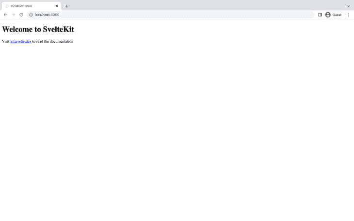
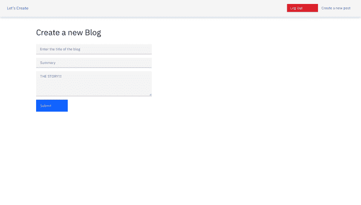
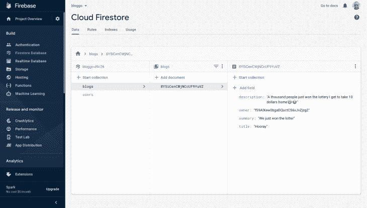
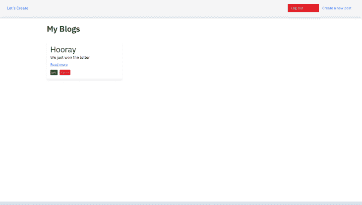
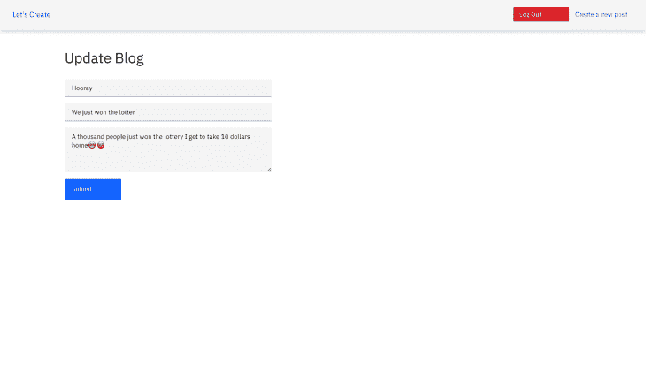

# 使用 Svelte 和 Firebase 构建 CRUD 应用程序

> 原文：<https://blog.logrocket.com/building-crud-application-svelte-firebase/>

创建于 2017 年的 [Svelte](https://blog.logrocket.com/build-web-components-svelte/) 是一款在构建期间将组件编译成 JavaScript 的简单工具。这与我们习惯的传统框架截然不同，传统框架从浏览器构建应用程序。除了这种独特的方法，Svelte 非常小，只有 4.1kb。它为前端开发人员提供了一个很好的选择。

在本文中，我们将了解 Svelte 的一些好处，同时使用它构建一个以 Firebase 为后端的 CRUD 应用程序。一起使用 Svelte 和 Firebase 可能会有点棘手，所以如果你遇到困难，希望这篇教程能有所帮助。

### 内容

## 构建苗条的应用程序

让我们从构建一个处理不同情况的简单的应用程序开始。为了简单起见，我们将使用 Firebase 在云中保存数据。

我们还将使用一个简单的框架来引导应用程序；它将有助于处理我们的路由并在最后构建应用程序:

```
npm init [email protected] bloggo // bloggo is the name of the app. You can change

```

该过程完成后，运行以下命令来安装依赖项:

```
npm install

```

完成后，像这样运行开发服务器:

```
npm run dev — —open

```

打开后，您将看到以下内容。这意味着自举成功了。



要备份信息，我们需要使用以下命令安装 Firebase:

```
npm install Firebase

```

您的`package.json`应该是这样的:

```
{
  "name": "bloggo",
  "version": "0.0.1",
  "scripts": {
    "dev": "svelte-kit dev",
    "build": "svelte-kit build",
    "package": "svelte-kit package",
    "preview": "svelte-kit preview",
    "prepare": "svelte-kit sync",
    "test": "playwright test",
    "lint": "prettier --ignore-path .gitignore --check --plugin-search-dir=. .",
    "format": "prettier --ignore-path .gitignore --write --plugin-search-dir=. ."
  },
  "devDependencies": {
    "@playwright/test": "^1.20.0",
    "@sveltejs/adapter-auto": "next",
    "@sveltejs/kit": "next",
    "prettier": "^2.5.1",
    "prettier-plugin-svelte": "^2.5.0",
    "svelte": "^3.44.0"
  },
  "type": "module",
  "dependencies": {
    "Firebase": "^9.6.10"
  }
}

```

现在，导航到 Firebase 控制台。创建一个新应用程序，然后点击左上角的**项目设置**。

一路向下滚动，创建一个 web 应用程序，并获得 Firebase 配置。如果您找不到配置信息，您总是可以返回到项目设置并从那里获得它。

接下来，在应用程序的 src 目录中创建一个新文件，并将其命名为`Firebase.js`。将 Firebase 配置粘贴到里面。

## 连接到 Firebase

Firebase 已经设置好了，现在我们需要初始化应用程序以连接到我们的应用程序。从`Firebase.js`中导入以下内容:

```
import { initializeApp } from "Firebase/app"

```

然后，使用 Firebase 中的配置授权我们的应用程序，如下所示:

```
// Initialize our Firebase for our application
 const app = initializeApp(FirebaseConfig);

```

为了创建更好看的用户界面，我们将使用 [Carbon Components Svelte](https://carbon-components-svelte.onrender.com/) ，一个实现 Carbon 设计系统的组件库:

```
npm i -D carbon-components-svelte

```

## 证明

在`routes`中新建一个名为`auth`的文件夹，并添加`login.svelte`和`register.svelte`。
登录、注册和主页将重用相同的布局以获得更好的性能；这意味着所有页面的页脚和导航都是一样的

布局如下所示。页面将被注入插槽:

```
<nav>
    <h2>
        Bloggy
    </h2>
    <ul>
        <li>
            <a href="/auth/login">Login</a>
        </li>
        <li>
            <a href="/auth/register">Sign Up</a>
        </li>
    </ul>
</nav>
<slot></slot>
<footer>
    <h2>bloggo</h2>
</footer>
<style>
    nav {
        display: flex;
        justify-content: end;
        padding: 1.3em 2em;
        background-color: whitesmoke;
        box-shadow: 0 6px 8px #D7E1E9;
    }
    nav h2 {
        font-weight: bold;
        font-size: 18px;
        color: black;
    }
    nav ul li {
        list-style: none;
        display: inline-block;
        padding-right: 1em;
    }
    li a  {
        text-decoration: none;
        color: black;
    }
    li a:hover {
        color: orange;
    }
    footer {
        background-color: #D7E1E9;
        padding: 2em;
        height: 20vh;
        display: flex;
        justify-content: center;
    }
</style>

```

请注意，布局以两个下划线开始命名:`__layout.svelte`。这是为了将其与其他页面区分开来。

为了确保代码的可维护性，在`source`下创建一个新文件夹，并将其命名为`components`。然后，在`components`下新建一个名为`auth`的文件夹，在这个文件夹下，添加两个名为`sign_in.svelte`和`sign_up.svelte`的新文件。这些文件将处理我们的表单提交。回到`routing`下的`auth`文件夹，导入组件。

现在，登录流程的代码将如下所示:

```
<script>
    import SignIn from "../../lib/auth/sign_in.svelte";
    import { Link } from "carbon-components-svelte";
</script>
<div>
    <div class="header">
        <h4>Login</h4>
    </div>
    <div class="signin-form">
        <SignIn />
        <div>Already have an account? <Link href="/auth/register">Sign Up</Link></div>
    </div>
</div>
<style>
     .header {
         width: 100vw;
         padding: 2em 0;
         min-height: 20vh;
         display: flex;
         justify-content: center;
         align-items: center;
         background-color: #E5F0FF;
     }
     .header h4 {
         color: black;
         font-weight: 600;
         font-size: 3rem;
     }
     .signin-form {
         min-height: 80vh;
         display: grid;
         place-items: center;
     }
</style>

```

同样的道理也适用于`register.svelte`:

```
<script>
    import SignUp from "../../lib/auth/sign_up.svelte";
    import { Link } from "carbon-components-svelte";
</script>
<div>
    <div class="header">
        <h4>Sign Up</h4>
    </div>
    <div class="form-container">
        <SignUp/>
        <div>Already have an account? <Link href="/auth/login">Sign In</Link></div>
    </div>
</div>
<style>
    .header {
         width: 100vw;
         padding: 2em 0;
         min-height: 20vh;
         display: flex;
         justify-content: center;
         align-items: center;
         background-color: #E5F0FF;
     }
     .header h4 {
         color: black;
         font-weight: 600;
         font-size: 3rem;
     }
     .form-container {
         min-height: 80vh;
         display: grid;
         place-items: center;
     }
</style>

```

## 添加 Firebase 身份验证

现在，我们将从 Firebase 控制台启用 Firebase 身份验证。这将允许我们对使用脸书、苹果或匿名账户的用户进行不同的认证检查，但在本教程中，我们将进行基本的电子邮件和密码检查。

将以下代码添加到应用程序根目录下的`Firebase.js`文件中:

```
import { initializeApp } from "Firebase/app";
import { getAuth } from "Firebase/auth";
import { collection, doc, getFirestore } from "Firebase/firestore/lite";

// Our fireabase config goes here
//...

// Initialize our Firebase for our application
let app = initializeApp(FirebaseConfig);
const auth = getAuth(app);
let db = getFirestore(app);
const userDoc = (userId) => doc(db, "users", userId)
export {
    auth,
}

```

我们首先使用带有 Firebase 配置的`initializeApp`初始化 Firebase。我们可以使用`get[service]`访问认证和 Firebase 服务，并传入我们的应用程序，如上所示。

现在，转到`lib/auth`文件夹中的`sign_up_form`组件。我们将使用事件将注册表单数据发送到我们的注册页面来注册用户。

首先，我们将表单值被动绑定到变量，并将注册按钮连接到调度函数:

```
<script>
    import { Form, TextInput, PasswordInput, Button } from 'carbon-components-svelte';
    import { createEventDispatcher } from "svelte"
    let dispatch = createEventDispatcher()
    let username, email, password;

    function signup() {
        dispatch("signup", {
            username,
            email,
            password
        })
    }
</script>

<div class="form">
    <Form>
        <TextInput bind:value={username} labelText="Username" placeholder="Enter your username" name="username"/>
        <div class="space" />
        <TextInput bind:value={email} labelText="Email address" placeholder="Enter your email" type="email" name="email" />
        <div class="space" />
        <PasswordInput
            bind:value={password}
            tooltipAlignment="start"
            tooltipPosition="left"
            labelText="Password"
            placeholder="Enter password"
            name="password"
        />
        <div class="space" />
        <Button size="small" on:click={signup}>Sign Up</Button>
    </Form>
</div>
<style>
    .form {
        width: 400px;
    }
    .form .space {
        margin: .6em 0;
    }
</style>

```

一旦发送了表单数据，我们就在注册页面中设置一个事件监听器，它位于`routes`文件夹中:

```
<svelte:head>
    <title>Register</title>
</svelte:head>
<div>
    <div class="header">
        <h4>Sign Up</h4>
    </div>
    <div class="form-container">
        {#if errors}
            {#each errors as error, i (i)}
                <div class="notification-block">
                    <p>{error}</p>
                </div>
            {/each}
        {/if}
        <SignUp on:signup={signUp} />
        <div>Already have an account? <Link href="/auth/login">Sign In</Link></div>
    </div>
</div>

```

然后，我们可以从传递给`signUp`的事件参数中访问调度的数据:

```
<script>
    import SignUp from '../../lib/auth/sign_up_form.svelte';
    import { Link } from 'carbon-components-svelte';
    import { createUserWithEmailAndPassword, updateProfile } from 'Firebase/auth';
    import { goto } from '$app/navigation';
    import { auth, userDoc } from '../../Firebase';
    import { setDoc } from 'Firebase/firestore/lite';
  let errors;
async function signUp(event) {
        try {
            let user = await createUserWithEmailAndPassword(
                auth,
                event.detail.email,
                event.detail.password
            );
            await updateProfile(user.user, { displayName: event.detail.username });
            await setDoc(userDoc(auth.currentUser.uid), {
                username: user.user.displayName,
                email: user.user.email
            });
            await goto('/admin');
        } catch (e) {
            console.log('error from creating user', e);
        }
    }
</script>

```

一旦用户成功注册，我们将更新用户资料，并使用异步函数`goto`将他们导航到管理页面。

登录也是如此。我们在`sign_in_form`组件中设置了一个调度函数，如下所示:

```
<script>
    import { Form, TextInput, PasswordInput, Button } from 'carbon-components-svelte';
import { createEventDispatcher } from 'svelte';
    let email, password;
    const dispatcher = createEventDispatcher()
    function login() {
        dispatcher('login', {
            email,
            password
        })
    }
</script>
<div class="form-container">
    <Form>
        <TextInput bind:value={email} type="email" labelText="Email" placeholder="Enter your email" name="email"/>
        <div class="space" />
        <PasswordInput
            labelText="Password"
            bind:value={password}
            placeholder="Enter password"
            tooltipAlignment="start"
            tooltipPosition="left"
            name="password"
        />
        <div class="space"></div>
        <Button size="small" on:click={login}>Sign In</Button>
    </Form>
</div>
<style>
    .form-container {
        width: 30%;
    }
    .form-container .space {
        margin: 20px 0;
    }
</style>

```

使用事件很有帮助，因为它允许您在提交数据之前做其他事情，比如验证。这样孩子和父母之间的交流就变得容易多了。

现在，在登录页面中，编写以下内容:

```
<script>
    import SignIn from "../../lib/auth/sign_in_form.svelte";
    import { Link } from "carbon-components-svelte";
    import { signInWithEmailAndPassword } from "Firebase/auth";
    import { auth, userDoc } from "../../Firebase";
    import { goto } from "$app/navigation";
    import { setDoc } from "Firebase/firestore/lite";
    let error;
    async function signIn(event) {
        try {
            let user = await signInWithEmailAndPassword(auth, event.detail.email, event.detail.password)
            await setDoc(userDoc(auth.currentUser.uid), { username: user.user.displayName, email: user.user.email })
            await goto("/admin")
        } catch (error) {
            console.log("error signin in", error.message)
          error = error.message
        }
    }
</script>
<svelte:head>
    <title>
        Login
    </title>
</svelte:head>
<div>
    <div class="header">
        <h4>Login</h4>
    </div>
    <div class="signin-form">
        {#if error}
            <div class="notification-block">
                <p>{error}</p>
            </div>
        {/if}
        <SignIn on:login={signIn}/>
        <div>Already have an account? <Link href="/auth/register">Sign Up</Link></div>
    </div>
</div>
<style>
     .header {
         width: 100vw;
         padding: 2em 0;
         min-height: 20vh;
         display: flex;
         justify-content: center;
         align-items: center;
         background-color: #E5F0FF;
     }
     .header h4 {
         color: black;
         font-weight: 600;
         font-size: 3rem;
     }
     .signin-form {
         min-height: 80vh;
         display: grid;
         place-items: center;
     }
     .notification-block {
         min-width: 20vw;
         padding: 1.2em .75em;
         border-radius: 5px;
         background-color: #FE634E;
     }
     .notification-block p {
         color: white;
     }
</style>

```

我们的登录和注册逻辑已经完成，但是我们需要防止用户在未经身份验证的情况下访问管理页面。阻止访问一个特定的页面意味着我们需要在它被加载之前就这样做，我们可以在模块脚本中的`load`函数中为每一个苗条的页面提供这个功能。

在此之前，我们需要一种反应式的方法来检查身份验证的更改。幸运的是，Firebase 使用`AuthStateChanged`函数提供了这个功能。我们可以在布局文件中监听这个，并在`getStores`中更新会话。

为了确保它能够工作，让我们在`onMount`函数中加载它。这将在页面装载后调用，但不会在呈现之前调用。

当用户登录时，会话将使用用户数据进行更新，并在用户注销后删除。在这种情况下，会话是被动的，将更新我们的`Nav`组件:

```
<script>
    import 'carbon-components-svelte/css/white.css';
    import Nav from '../lib/nav.svelte';
    import { onAuthStateChanged } from 'Firebase/auth';
    import { navigating } from '$app/stores';
    import { onMount } from 'svelte';
    import { auth } from '../Firebase';
    import { getStores } from '$app/stores';
    import { Loading } from 'carbon-components-svelte';
    let { session } = getStores();
    onMount(() => {
        onAuthStateChanged(
            auth,
            (user) => {
                session.set({ user });
            },
            (error) => {
                session.set({ user: null });
                console.log(error);
            }
        );
    });
</script>

```

我们的`Nav`现在将随着`auth`状态的变化而更新。Svelte 提供了一种便捷的方式来订阅我们的会话变化，使用`$session`:

```
<script>
    import { Button, Link } from 'carbon-components-svelte';
    import { getStores } from '$app/stores';
    import { signOut } from 'Firebase/auth';
    import { auth } from '../Firebase';
    import { goto } from '$app/navigation';
    let { session } = getStores();

    async function logOut() {
        await signOut(auth);
        await goto('/');
    }
</script>
<nav>
    <h2>
        {#if $session['user'] != null}
            <Link class="link" size="lg" href="/admin">Let's Create</Link>
        {:else}
            <Link class="link" size="lg" href="/">Bloggy</Link>
        {/if}
    </h2>
    <ul>
        {#if $session['user'] != null}

            <li>
                <Button size="sm" kind="danger" on:click={logOut}>Log Out</Button>
            </li>
            <li>
                <Link href="/admin/create-blog">Create a new post</Link>
            </li>

        {:else}
            <li>
                <Link href="/auth/login">Login</Link>
            </li>
            <li>
                <Link href="/auth/register">Sign Up</Link>
            </li>
        {/if}
    </ul>
</nav>

```

这不是持久的，当您更改选项卡时，您需要添加安全存储来保持用户登录。但是如果用户试图访问管理页面或其子页面，它会重新路由用户。

* * *

### 更多来自 LogRocket 的精彩文章:

* * *

## 添加 CRUD 功能

一个基本的应用程序通常有四个主要特征:它可以创建、读取、更新和删除数据。在接下来的几节中，我将清晰简洁地解释我们如何使用 Svelte 和 JavaScript 来处理这些场景。

### 创造

要添加新文档，我们需要首先创建页面。在`admin`文件夹中创建一个`index.svelte`文件；一旦用户通过认证，这将是我们的主页。现在，创建一个名为`create-blog.svelte`的新文件。

我们需要一个表单来添加关于我们新博客的信息。在`lib`文件夹下新建一个文件夹，命名为`blog`；这将包含任何与博客相关的组件。

接下来，添加一个名为`blog-form.svelte`的新文件。将表单从页面中分离出来可以分离关注点，并且我们可以重用同一个组件来进行更新。

我们的博客表单将如下所示。就像登录表单一样，我们将表单值绑定到变量，并使用事件将更新的数据发送到我们的“创建博客”页面:

```
<script>
    import {Form, TextArea, TextInput, Button} from "carbon-components-svelte"
    import { createEventDispatcher } from "svelte";
    const dispatcher = createEventDispatcher()
    export let title, summary, description;
    function dispatchBlog() {
        dispatcher("sendBlogDetails", {
            title,
            summary,
            description
        })
        title = "", summary = "", description = ""
    }
</script>
<div class="form-container">
    <Form>
        <TextInput bind:value={title} label="Blog title" placeholder="Enter the title of the blog" name="title" required/>
        <div class="space"></div>
        <TextInput bind:value={summary} label="Blog summary" placeholder="Summary" name="Summary" required/>
        <div class="space"></div>
        <TextArea bind:value={description} label="Blog description" placeholder="THE STORY!!!" name="description" required/>
        <div class="space"></div>
        <Button on:click={dispatchBlog}>Submit</Button>
    </Form>
</div>

<style>
    .form-container {
        max-width: 40%;
    }
    .space {
        margin: 1em 0;
    }
</style>

```

在这个表单中，我们导出变量，因为我们将重用表单来更新博客。

接下来，在“创建博客”表单中导入博客表单组件:

```
<script>
import { goto } from '$app/navigation';
    import { addDoc, serverTimestamp } from 'Firebase/firestore/lite';
    import { auth, blogCollection } from '../../Firebase';
    import BlogForm from '../../lib/blog/blog-form.svelte';
    async function createNewBlog(event) {
        await addDoc(blogCollection, {...event.detail, owner: auth.currentUser.uid, timestamp: serverTimestamp()});
        await goto("/admin")
    }
</script>
<svelte:head>
    <title>Create Blog</title>
</svelte:head>
<div class="container">
    <div class="header">
        <h2>Create a new Blog</h2>
    </div>
    <BlogForm on:sendBlogDetails={createNewBlog} title={""} summary={""} description={""}/>
</div>
<style>
    .container {
        margin: 3em auto;
        width: 80%;
        min-height: 90vh;
    }
    .header {
        margin-bottom: 2em;
    }
</style>

```

要在博客收藏中添加新文档，请将以下代码添加到`Firebase.js`并导出它:

```
// ... Other code
const blogCollection = collection(db, "blogs");

export {
// Other exports
  blogCollection
}

```

Firebase lite 提供的`addDoc`功能允许我们在特定的集合中创建文档，并为每个文档生成一个 ID。为了允许排序，我们添加了一个`serverTimestamp`。

这是完成后页面的样子。



如果我们试着创建一个新的博客，我们可以看到它在 Firebase Firestore 上很受欢迎。



### 阅读

我们可以在我们的管理主页中查看我们写的博客，但是为了确保我们在页面加载后得到博客，我们需要在`load`函数中这样做。该函数在页面加载之前被调用，允许我们使用 props 向页面发送数据。

在我们的`admin`目录下的`index.svelte`页面中，在模块脚本中声明`load`函数:

```
<script context="module">
import { deleteDoc, getDocs, query, where } from 'Firebase/firestore/lite';
import { blogCollection, blogDoc } from '../../Firebase';
    export async function load({ session }) {
        // Get the authenticated user from the current session
          let { user } = session
        // redirect the user to home page incase the user is not authenticated
          if (user == null) {
              return {
                  status: 302,
                  redirect: "/",
              }
          }

          // Access all blogs written by the user only 
          const q = query(blogCollection, where("owner", "==", user.id))
          const querySnapshot = await getDocs(q)
          let blogs = [];
          // Use es6 spread operator to add the blogs and their id
          querySnapshot.forEach(blog => {
            blogs.push({...blog.data(), id: blog.id})
          })

          // send the blogs to the page
          return {
              status: 200,
              props: {
                  blogs
              }
          }
    }
</script>

```

我们可以使用`export`访问与道具一起发送的博客:

```
<script>
    import BlogCard from '../../lib/blog/blog-card.svelte'

    export let blogs
</script>

```

这是我们的博客卡。在`lib/blog`文件夹中创建文件和博客表单:

```
<script>
  export let id, title, summary;

  // Will come later
  function editBlog() {
  }

  // Will come later
  function deleteBlog() {}

</script>

<div class="card">
    <div class="title">
        <h2>{title}</h2>
    </div>
    <div class="content">
        <p>{summary}</p>
        <a href="/admin/blogs/{id}">Read more</a>
    </div>
    <div class="button-set">
        <button class="edit" on:click={editBlog}>Edit</button>
        <button class="delete" on:click={dispatchBlogDelete}>Delete</button>
    </div>
</div>

```

我们可以循环浏览收到的博客，了解每篇博客的详细信息:

```
<svelte:head>
    <title>Bloggy</title>
</svelte:head>
<div class="content">
    <div class="header">
        <h2>My Blogs</h2>
    </div>
    <div class="blogs">
        {#each blogs as blog}
            <BlogCard title={blog.title} summary={blog.summary} id={blog.id} on:deleteBlog={deleteBlog}/>
        {:else}
             <div class="center">
                 <h2>You don't have any blogs yet.</h2>
             </div>
        {/each}
    </div>
</div>

// Some styling 👍🏾
<style>
    .content {
        min-height: 90vh;
        padding: 1em;
        margin: 0 auto;
        max-width: 80%;
    }
    .header {
        padding: 1em 2em;
    }
    .header h2 {
        font-weight: 700;
    }
    .blogs {
        display: flex;
        flex-wrap: wrap;
    }
</style>

```

这是用户加载页面后的结果。



为了访问博客的详细信息，特别是当文档有嵌套数据或者我们只需要显示一小部分时，我们需要使用它的 ID 来访问它。我们可以通过在`admin/blog`文件夹中添加一个新文件来做到这一点。这里的命名有很大的不同；我们需要根据我们期望的参数来命名它，所以在这种情况下，`[id].svelte`。

我们将利用 load 函数来获取博客的详细信息，如下所示:

```
<script context="module">
    import { getDoc } from 'Firebase/firestore/lite';
    import { blogDoc } from '../../../Firebase';
    export async function load({ params }) {
        const docSnap = await getDoc(blogDoc(params.id));
        if (!docSnap.exists()) {
            return {
                status: 404,
                props: {
                    blog: null
                }
            };
        } else {
            return {
                status: 200,
                props: {
                    blog: { ...docSnap.data(), id: docSnap.id }
                }
            };
        }
    }
</script>

```

然后，我们在常规脚本和页面中访问它:

```
><script>
    export let blog;
</script>
<svelte:head>
    <title>{blog.title ? blog.title : 'Bloggy'}</title>
</svelte:head>
<div class="container-blog-detail">
    {#if blog == null}
        <div class="center">
            <h2>Blog does not exist or has been deleted</h2>
        </div>
    {:else}
        <div>
            <h2>
                {blog.title}
            </h2>
            <p>{blog.summary}</p>
            <p class="description">{blog.description}</p>
        </div>
    {/if}Î
</div>
<style>
    .container-blog-detail {
        margin: 0 auto;
        width: 80%;
        padding: 2em 0;
        height: 80vh !important;
    }
    .center {
        display: grid;
        place-content: center;
    }
    .description {
        margin-top: 20px;
    }
</style>

```

当我们尝试点击特定博客卡中的“阅读更多”按钮时，它会以 ID 作为参数重新路由到特定页面。

### 更新

更新我们的博客将使用相同的博客形式，但在不同的页面上。在`admin/blogs/update`中创建一个名为`[id].svelte`的新文件。

我们可以从 load 函数中传递的参数访问 ID:

```
<script context="module">
    import { getDoc, setDoc } from 'Firebase/firestore/lite';
    import { blogDoc } from '../../../../Firebase';
    export async function load({ params }) {
        const docSnap = await getDoc(blogDoc(params.id));
        if (!docSnap.exists()) {
            return {
                status: 404,
                redirect: "/admin"
            }
        } else {
            return {
                status: 200,
                props: {
                    blog: { ...docSnap.data(), id: docSnap.id }
                }
            };
        }
    }
</script>

```

在 Firebase 中更新一个文档需要使用`setDoc`来引用您想要更新的内容。我们可以使用之前创建的助手函数来实现这一点:

```
setDoc(blocDoc(blog.id), event.detail, {merge: true})

```

在传递引用之后，我们传递更新和合并，这阻止了新文档的创建:

```
<script>
import { goto } from '$app/navigation';
    import BlogForm from "../../../../lib/blog/blog-form.svelte"
    export let blog
    async function updateBlogDetails(event) {
        setDoc(blogDoc(blog.id), event.detail, { merge: true })
        await goto("/admin")
    }
</script>
<svelte:head>
    <title>Update blog</title>
</svelte:head>
<div class="container">
    <div class="header">
        <h2>Update Blog</h2>
    </div>
    <BlogForm on:sendBlogDetails={updateBlogDetails} title={blog.title} summary={blog.summary} description={blog.description} />
</div>

<style>
    .container {
        margin: 3em auto;
        width: 80%;
        min-height: 90vh;
    }
    .header {
        margin-bottom: 2em;
    }
</style>

```

要编辑一个博客，我们需要访问 ID，我们将 ID 传递给所有的博客卡。现在我们可以更新`blog-card.svelte`中的`editBlog`函数:

```
async function editBlog() {
        await goto(`/admin/blogs/update/${id}`);
    }

```

我们现在可以被重定向到我们想要更新的博客。



### 删除

删除博客将使用与表单相同的功能:`dispatcher`。我们使用`createEventDispatcher`创建一个调度程序:

```
const dispatcher = createEventDispatcher();

function dispatchBlogDelete() {
  // Pass the blog id you want to delete
    dispatcher("deleteBlog", {
        id
    })
}

// Bind it to the click event in the delete button
<button class="delete" on:click={dispatchBlogDelete}>Delete</button>

```

收听管理页面中的调度。我们创建删除博客的方法如下:

```
    // Delete a blog
    async function deleteBlog(event) {
        await deleteDoc(blogDoc(event.detail.id))
    }

```

现在，我们可以监听删除事件:

```
<BlogCard title={blog.title} summary={blog.summary} id={blog.id} on:deleteBlog={deleteBlog}/>

```

恭喜你！🎉我们现在有一个完整的 CRUD 应用程序，允许我们操作数据。

## 结论

用 Svelte 构建应用程序是再简单不过的事情了；你甚至不必担心搜索引擎优化，因为它也处理。您可以使用下面的[链接](https://github.com/BrianMwas/Bloggo)从 Github 访问这个项目。

## 使用 [LogRocket](https://lp.logrocket.com/blg/signup) 消除传统错误报告的干扰

[](https://lp.logrocket.com/blg/signup)

[LogRocket](https://lp.logrocket.com/blg/signup) 是一个数字体验分析解决方案，它可以保护您免受数百个假阳性错误警报的影响，只针对几个真正重要的项目。LogRocket 会告诉您应用程序中实际影响用户的最具影响力的 bug 和 UX 问题。

然后，使用具有深层技术遥测的会话重放来确切地查看用户看到了什么以及是什么导致了问题，就像你在他们身后看一样。

LogRocket 自动聚合客户端错误、JS 异常、前端性能指标和用户交互。然后 LogRocket 使用机器学习来告诉你哪些问题正在影响大多数用户，并提供你需要修复它的上下文。

关注重要的 bug—[今天就试试 LogRocket】。](https://lp.logrocket.com/blg/signup-issue-free)