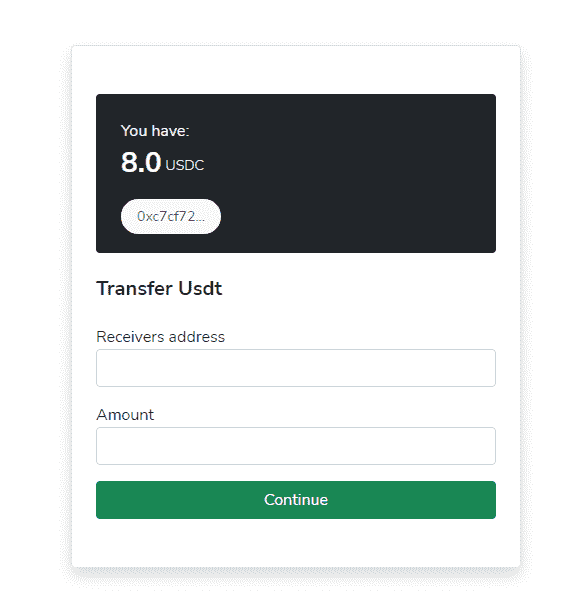
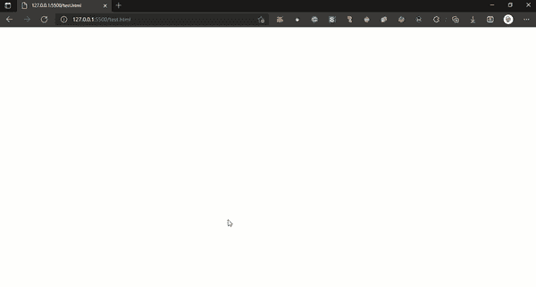
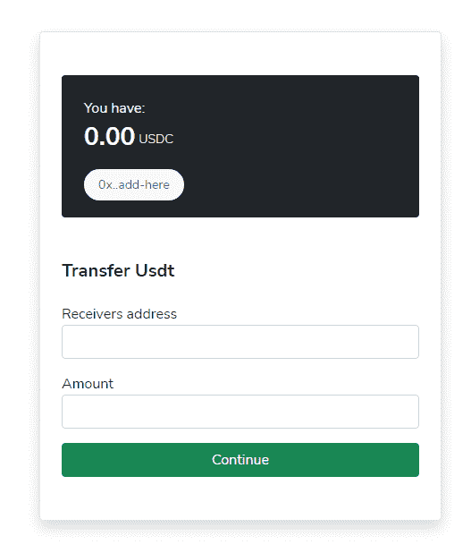
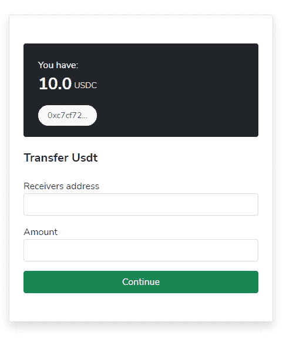

# 用 Ethers.js - LogRocket 博客构建 DApp

> 原文：<https://blog.logrocket.com/building-dapp-ethers-js/>

## 介绍

区块链、以太坊、DApps、智能合约……如果你在互联网上，你很可能在某个地方见过这些词，可能没有完全理解它们是什么或它们背后的技术是如何工作的。本文为您解决了这个问题。

在本教程中，我们将学习区块链的一些概念，以及如何使用 Ethers.js 构建我们的第一个 DApp

## 我们将会建造什么

我们将致力于创建一个 DApp x Defi，显示我们当前的 USDT 余额，允许我们将 USDT 转移到其他钱包，并最终允许我们查询我们的 USDT 交易历史。

最终输出将如下所示:



## 先决条件

要阅读本文，您需要:

*   对 HTML 的基本理解
*   对 JavaScript 和 DOM 的基本理解
*   已安装 Metamask wallet

## 文章是如何组织的

本文分为三个部分:

如果你已经熟悉区块链和 DApps 的工作方式，你可以直接跳到 Ethers.js 的[入门部分。](#getting-started-ethers-js)

## 核心区块链和以太坊概念

维基百科将区块链定义为“一个不断增长的记录列表，称为块，使用加密技术链接在一起。”您可以将区块链视为一个数据库，但与主数据库不同，区块链是分散的，即没有中央组织控制其活动。

此外，区块链是不可变的，也就是说，存储在其上的任何数据在创建后都不能修改。

2009 年，[中本聪](https://en.wikipedia.org/wiki/Satoshi_Nakamoto)创造了世界上第一种加密货币——比特币，从而普及了区块链。区块链正在开发的比特币使其成为第一种不受政府或某些组织控制的点对点数字货币。比特币问世几年后，19 岁的[维塔利克·布特林](https://en.wikipedia.org/wiki/Vitalik_Buterin)创建了以太坊。

### 以太坊是什么？

以太坊是一个分散的、开源的区块链，具有智能合约和 DApp 开发功能。以太坊为开发人员提供了一个平台，可以创建通用的应用程序来交换信息和服务，这些信息和服务的数据不能在区块链上被操纵或更改。

除了以太坊区块链，Vitalik 和他的团队还创造了一种本地加密货币:以太(简称 ETH)，它类似于比特币，但也用于在区块链上运行交易，当与 DApps 交互时。

### 智能合同

智能合约是在以太坊区块链上运行的程序。你可以把智能合约想象成一个普通的以太坊账户，里面存储了一些以太，可以通过以太坊网络进行交易。但与普通账户不同，智能合约不受用户控制。它们是经过编程的，部署在网络上，并自动执行任务。

### DApps

分散式应用(简称 DApps)是为与区块链交互而构建的应用。与智能合约相反，DApps 在区块链上并不明确存在；它们更适合与智能合约交互。

现在你已经熟悉了区块链的常用术语，让我们开始用 Ethers.js 创建我们的第一个 DApp 吧

## Ethers.js 入门

Ethers.js 是一个 JavaScript 库，允许开发人员轻松地与以太坊区块链及其生态系统进行交互。

### 装置

Ethers.js 是一个 npm 包，可以通过运行以下命令进行安装:

```
npm install --save ethers
```

或者将其 CDN 包含在 HTML 文档中，如下所示:

```
<script
  src="https://cdn.ethers.io/lib/ethers-5.2.umd.min.js"
  type="application/javascript">
</script>
```

如果您正在使用 Node.js，您可以使用以下命令将 Ethers 包导入到您的项目中:

```
const { ethers } = require("ethers");
```

对于基于 ES6 或 TypeScript 的项目，可以使用以下命令导入它:

```
import { ethers } from "ethers";
```

否则，如果您在标记中包含了 CDN，就不需要额外的导入工作，因为 Ethers 包是自动加载的。

使用 Ethers.js 时会遇到的一些常见术语包括:

*   provider——这是 Ethers.js 中的一个类，提供对以太坊区块链及其状态的抽象只读访问
*   signer——这是 Ethers 中的一个类，可以访问您的私钥。此类负责签署消息，并授权交易，包括从您的帐户中收取费用以执行操作
*   合同-该类负责连接以太网上的特定合同

### 连接到元掩码

MetaMask 是一个用于存储加密货币的钱包，也是连接区块链应用程序的网关。如果您还没有，请前往他们的[下载页面](https://metamask.io/download.html)为您的首选浏览器下载 web 扩展。

设置好 MetaMask 后，我们就可以访问全局以太坊 API 了，可以通过`window.ethereum`访问。

通过创建一个新的 Web3 提供者并传递全局以太坊 API `(window.ethereum)`作为参数，您可以轻松地使用 Ethers.js 连接到 MetaMask，如下所示:

```
const provider = new ethers.providers.Web3Provider(window.ethereum)
```

为了进行试验，创建一个新的`index.html`文件并添加以下代码:

```
<!DOCTYPE html>
<html lang="en">
  <head>
    <script
      src="https://cdn.ethers.io/lib/ethers-5.2.umd.min.js"
      type="application/javascript"
    ></script>
    <script>
      const provider = new ethers.providers.Web3Provider(
        window.ethereum,
        "any"
      );
      await provider.send("eth_requestAccounts", []);
      const signer = provider.getSigner();

      (async function () {
        let userAddress = await signer.getAddress();
        document.getElementById("wallet").innerText =
          "Your wallet is " + userAddress;
      })();
    </script>
  </head>
  <body>
    <div id="wallet"></div>
  </body>
</html>

```

在上面的代码中，在包含 Ethers.js CDN 之后，我们创建了一个到 MetaMask 的连接，并将其赋给一个常量变量`provider`，然后，我们创建了一个自调用异步函数，我们用它来获取我们连接的 MetaMask 帐户。

运行代码将提示一个新的元掩码连接，如下所示，一旦连接成功，您应该会看到您的钱包地址显示在页面上:



### 质疑以太坊区块链

使用`provider` 类，我们可以对区块链数据进行只读访问，通过它，我们可以获取区块链的当前状态，读取历史日志，等等。

例如，我们可以使用异步`getBlockNumber()`方法来获取以太坊区块链中当前挖掘的块:

```
const provider = new ethers.providers.Web3Provider(window.ethereum)
async function getCurrentBlock() {
  let currentBlock = await provider.getBlockNumber();
  console.log(currentBlock);
}

getCurrentBlock();

// returns 13344639
```

或者使用`getBalance()`方法，获取指定地址的可用乙醚量:

```
const provider = new ethers.providers.Web3Provider(window.ethereum)

async function getBalance(wallet) {
  let balance = await provider.getBalance(wallet);
  // we use the code below to convert the balance from wei to eth
  balance = ethers.utils.formatEther(balance);
  console.log(balance);
}

getBalance("0xC7CF72918D9a7101D2333538686E389b15ad8F2E");
// returns 0.3
```

[访问此处，获取提供者类下所有可用方法的完整参考。](https://docs.ethers.io/v5/api/providers/provider/)

### 签名邮件

在区块链上签署消息意味着创建数字签名。这些数字签名用于证明地址的所有权，而不会暴露其私钥。

通过使用 signer 类中可用的 `signMessage()`方法，我们可以很容易地用 Ethers.js 做到这一点:

```
let mySignature = await signer.signMessage("Some custom message");
```

## 建设我们的 DApp

首先，[访问这个 GitHub 存储库](https://github.com/AsaoluElijah/first-dapp/tree/front-end),按照存储库自述文件中的说明在本地机器上设置项目前端分支。这个存储库包含了我们创建 DApp 所需的所有文件，以及用户界面的标记代码，但是还没有添加任何功能。

如果您成功地完成了安装过程并运行了`index.html`文件，您应该会得到类似下图的输出:



### 获得免费 ETH

在区块链以太坊进行任何交易，我们都会被收取一些以太费，也就是众所周知的煤气费。而且，由于这是一个测试项目，我们不想支付实际的钱来运行交易。要获得免费测试 ETH，打开 MetaMask，将网络改为 ***ropsten 测试网络*** ，复制自己的钱包地址，最后在 [ropsten 水龙头](https://faucet.ropsten.be/)提交钱包即可获得 0.3 免费 ETH。

### 铸造 USDC

因为我们正在建造一个可以让我们转移 USDC 的 DApp，所以我们想先从我们的 ETH 余额中为我们自己铸造一些。为此，打开 `/script/mint-usdc.js`文件并用以下内容更新它:

```
const provider = new ethers.providers.Web3Provider(window.ethereum, "any");

const usdc = {
  address: "0x68ec573C119826db2eaEA1Efbfc2970cDaC869c4",
  abi: [
    "function gimmeSome() external",
    "function balanceOf(address _owner) public view returns (uint256 balance)",
    "function transfer(address _to, uint256 _value) public returns (bool success)",
  ],
};

async function mintUsdc() {
  await provider.send("eth_requestAccounts", []);
  const signer = provider.getSigner();
  let userAddress = await signer.getAddress();
  const usdcContract = new ethers.Contract(usdc.address, usdc.abi, signer);

  const tx = await usdcContract.gimmeSome({ gasPrice: 20e9 });
  console.log(`Transaction hash: ${tx.hash}`);

  const receipt = await tx.wait();
  console.log(`Transaction confirmed in block ${receipt.blockNumber}`);
  console.log(`Gas used: ${receipt.gasUsed.toString()}`);
}
```

接下来，保存这个文件并运行根文件夹中的`mint-usdc.html`文件。现在，如果你点击这个页面上的 **Mint Now** 按钮，这应该会提示一个新的 MetaMask 请求，并且确认这个请求将会在我们的钱包中生成 10 USDC，以及在我们的控制台中打印的用于该请求的交易散列和汽油费。

### 显示 USDC 天平

现在我们已经创建了一些 USDC，让我们继续在标记中的指定区域显示它。为此，打开`/script/app.js`并用下面的代码更新它:

```
const provider = new ethers.providers.Web3Provider(window.ethereum, "any");

const usdc = {
  address: "0x68ec573C119826db2eaEA1Efbfc2970cDaC869c4",
  abi: [
    "function name() view returns (string)",
    "function symbol() view returns (string)",
    "function gimmeSome() external",
    "function balanceOf(address _owner) public view returns (uint256 balance)",
    "function transfer(address _to, uint256 _value) public returns (bool success)",
  ],
};

async function main() {
  await provider.send("eth_requestAccounts", []);
  const signer = provider.getSigner();
  let userAddress = await signer.getAddress();
  document.getElementById("userAddress").innerText = userAddress;

  const usdcContract = new ethers.Contract(usdc.address, usdc.abi, signer);

  let usdcBalance = await usdcContract.balanceOf(userAddress);
  usdcBalance = ethers.utils.formatUnits(usdcBalance, 6);
  document.getElementById("usdcBalance").innerText = usdcBalance;
}
main();
```

这里，我们在传递我们的地址时使用了 USDC ABI 中可用的`balanceOf()`函数。正如在入门部分提到的，余额将在 Wei 中返回，所以我们使用 Ethers.js 实用函数将其从 Wei 转换为 ETH，并在我们的`div`中显示结果，其中的`id` 为`usdcBalance`。

现在，如果我们运行`index.html`，我们应该看到我们的 USDC 余额以及我们的钱包显示在他们指定的部分，如下所示:



### 添加转移功能

最后一步是添加传输功能。打开`script/transfer-usdc.js`，用下面的代码更新它的内容:

```
async function transferUsdc() {
    let receiver = document.getElementById("receiver").value;
    let amount = document.getElementById("amount").value;
    let response;

    await provider.send("eth_requestAccounts", []);
    const signer = provider.getSigner();
    let userAddress = await signer.getAddress();

    const usdcContract = new ethers.Contract(usdc.address, usdc.abi, signer);

    try {
      receiver = ethers.utils.getAddress(receiver);
    } catch {
      response = `Invalid address: ${receiver}`;
      document.getElementById("transferResponse").innerText = response;
      document.getElementById("transferResponse").style.display = "block";
    }

    try {
      amount = ethers.utils.parseUnits(amount, 6);
      if (amount.isNegative()) {
        throw new Error();
      }
    } catch {
      console.error(`Invalid amount: ${amount}`);
      response = `Invalid amount: ${amount}`;
      document.getElementById("transferResponse").innerText = response;
      document.getElementById("transferResponse").style.display = "block";
    }

    const balance = await usdcContract.balanceOf(userAddress);

    if (balance.lt(amount)) {
      let amountFormatted = ethers.utils.formatUnits(amount, 6);
      let balanceFormatted = ethers.utils.formatUnits(balance, 6);
      console.error(
        `Insufficient balance receiver send ${amountFormatted} (You have ${balanceFormatted})`
      );

      response = `Insufficient balance receiver send ${amountFormatted} (You have ${balanceFormatted})`;
      document.getElementById("transferResponse").innerText = response;
      document.getElementById("transferResponse").style.display = "block";
    }
    let amountFormatted = ethers.utils.formatUnits(amount, 6);

    response = `Transferring ${amountFormatted} USDC receiver ${receiver.slice(
      0,
      6
    )}...`;
    document.getElementById("transferResponse").innerText = response;
    document.getElementById("transferResponse").style.display = "block";

    const tx = await usdcContract.transfer(receiver, amount, { gasPrice: 20e9 });
    document.getElementById(
      "transferResponse"
    ).innerText += `Transaction hash: ${tx.hash}`;

    const receipt = await tx.wait();
    document.getElementById(
      "transferResponse"
    ).innerText += `Transaction confirmed in block ${receipt.blockNumber}`;
  }

```

### 代码解释

代码基本上是不言自明的。首先，我们从表单中获得所需的输入(receivers wallet 和 amount ),在创建合同后，我们检查输入的地址是否有效，以及用户是否有足够的金额。最后，使用 ABI 的`transfer()`方法，我们启动了转移。

我们的应用程序已经准备就绪！

你可以通过在 MetaMask 上创建一个新帐户并向其转移一些 USDC 来尝试一下。

此外，如果您错过了任何步骤，可以在 GitHub 上的[处获得完整的源代码。](https://github.com/AsaoluElijah/first-dapp)

# 结论

在本教程中，我们不仅学习了区块链，还学习了如何使用 Ethers.js 在以太坊区块链上创建我们的第一个分散式应用程序(DApp)

## 加入像 Bitso 和 Coinsquare 这样的组织，他们使用 LogRocket 主动监控他们的 Web3 应用

影响用户在您的应用中激活和交易的能力的客户端问题会极大地影响您的底线。如果您对监控 UX 问题、自动显示 JavaScript 错误、跟踪缓慢的网络请求和组件加载时间感兴趣，

[try LogRocket](https://lp.logrocket.com/blg/web3-signup)

.

[](https://lp.logrocket.com/blg/web3-signup)[https://logrocket.com/signup/](https://lp.logrocket.com/blg/web3-signup)

LogRocket 就像是网络和移动应用的 DVR，记录你的网络应用或网站上发生的一切。您可以汇总和报告关键的前端性能指标，重放用户会话和应用程序状态，记录网络请求，并自动显示所有错误，而不是猜测问题发生的原因。

现代化您调试 web 和移动应用的方式— [开始免费监控](https://lp.logrocket.com/blg/web3-signup)。