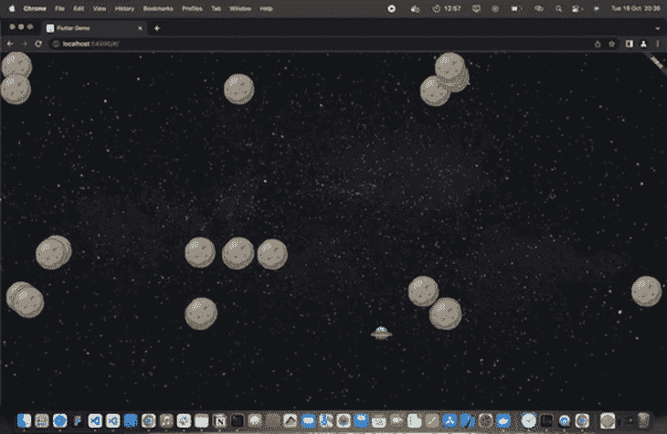
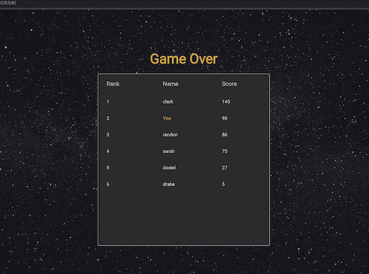
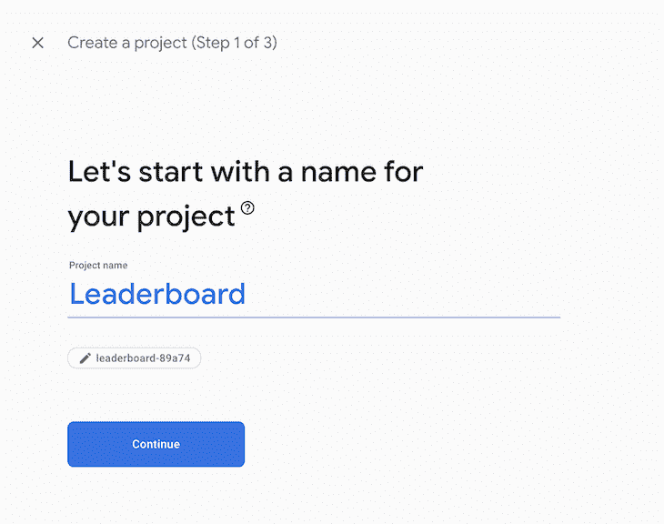
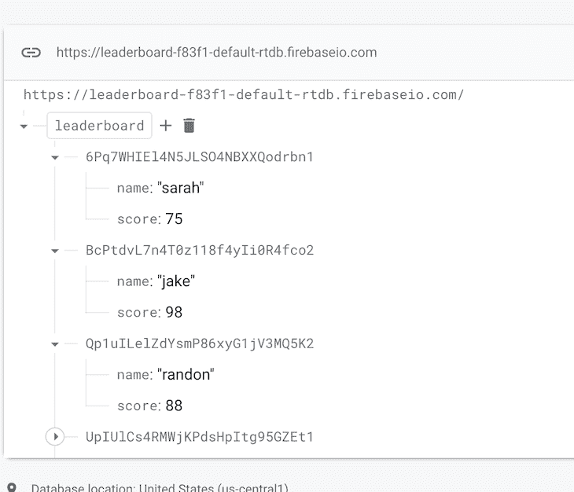

# 在 Flutter 中建立游戏排行榜

> 原文：<https://blog.logrocket.com/building-gaming-leaderboard-flutter/>

Flutter 3 包括一些独特的功能、修复和改进。最令人兴奋的变化之一是增加了对用 Flutter 创建休闲游戏的支持，以及[休闲游戏工具包](https://docs.flutter.dev/resources/games-toolkit)和[模板](https://github.com/flutter/samples/tree/main/game_template)。该模板包含内置功能，如声音、广告、播放服务链接、FlutterFire 等。

在本教程中，我们将[通过为一个简单的小行星游戏构建一个颤振游戏排行榜来探索这些新功能](https://docs.flutter.dev/whats-new)，并学习如何使用 [Firebase 实时数据库](https://firebase.google.com/docs/database)追踪高分。

*向前跳转:*

## 在 Flutter 中构建一个休闲小行星游戏

休闲游戏包括排行榜，以促进竞争和玩家之间的参与。在我们开始在 Flutter 中构建游戏排行榜之前，让我们先检查一下游戏的目标。

游戏概念很简单。玩家必须使用鼠标或触控板来防止移动的小行星与宇宙飞船相撞:



需要注意的是，我们不会使用 [Flame](https://flame-engine.org/) ，因为它引入了超出本文范围的概念，但是请查看[这篇文章](https://blog.logrocket.com/comparing-flutter-game-engines/)以了解更多关于 Flutter 游戏引擎的信息。

### 创造宇宙飞船

为了构建我们的 Flutter 游戏，我们将首先创建一个跟随鼠标和触控板的飞船，方法是使用`MouseRegion`小部件来检测鼠标光标悬停在该区域上时的位置。这个小部件还通过使用`SystemMouseCursors.none`隐藏默认的鼠标光标:

```
class Player extends StatefulWidget {
  const Player({
    Key? key,
    required this.gameController,
  }) : super(key: key);

  final GameController gameController;

  @override
  State&lt;Player&gt; createState() =&gt; _PlayerState();
}

class _PlayerState extends State&lt;Player&gt; with SingleTickerProviderStateMixin {
  Offset? playerPosition;

  @override
  void initState() {
    super.initState();
  }

  @override
  Widget build(BuildContext context) {
    return MouseRegion(
      cursor: SystemMouseCursors.none,
      onHover: (event) {
        playerPosition = event.position;
        setState(() {});
      },
      child: Stack(
        children: [
          Positioned(
            top: playerPosition?.dy ?? -100,
            left: playerPosition?.dx ?? -100,
            child: SizedBox(
              height: 50,
              width: 50,
              child: Image.asset(
                'assets/space_ship.png',
              ),
            ),
          )
        ],
      ),
    );
  }

  @override
  void dispose() {
    super.dispose();
  }
}

```

在上面的代码中，当鼠标在`onHover`回调中移动时，我们更新了飞船的位置，然后使用`setState()`重新构建了屏幕。

### 制造障碍

创建飞船后，我们将添加随机移动的障碍物(小行星):

```
class Asteroid extends StatefulWidget {
  const Asteroid({
    Key? key,
    required this.index,
    required this.position,
    required this.gameController,
  }) : super(key: key);

  final int index;
  final Offset position;
  final GameController gameController;

  @override
  State&lt;Asteroid&gt; createState() =&gt; _AsteroidState();
}

class _AsteroidState extends State&lt;Asteroid&gt; with SingleTickerProviderStateMixin {
  final Random random = Random();
  late Offset position = widget.position;

  Offset randomDirection = const Offset(1, 1);

  int lastTime = 0;
  int asteroidSize = 70;

  Ticker? ticker;

  @override
  void initState() {
    super.initState();

    setRandomDirection();
    moveRandomly();
  }

  void moveRandomly() {
    ticker = createTicker((elapsed) {
      if (elapsed.inSeconds &gt; lastTime + 5) {
        lastTime = elapsed.inSeconds;
        setRandomDirection();
      }

      changeDirectionWhenOutOfBounds();
      position += randomDirection * 2;
      widget.gameController.allAsteroids[widget.index] = position;

      setState(() {});
    });

    ticker?.start();
  }

  setRandomDirection() {
    double x = random.nextInt(3) - 1;
    double y = random.nextInt(3) - 1;
    if (x == 0 &amp;&amp; y == 0) {
      x = 1;
    }

    randomDirection = Offset(x, y);
  }

  // wall collision detection
  void changeDirectionWhenOutOfBounds() {
    final screenSize = MediaQuery.of(context).size;

    if (position.dx &lt; 0 ||
        position.dx + asteroidSize &gt; screenSize.width ||
        position.dy &lt; 0 ||
        position.dy + asteroidSize &gt; screenSize.height) {
      randomDirection = randomDirection * -1;
    }
  }

  @override
  Widget build(BuildContext context) {
    return Positioned(
      top: position.dy,
      left: position.dx,
      child: SizedBox(
        height: 70,
        width: 70,
        child: Image.asset(
          'assets/asteroids.png',
        ),
      ),
    );
  }

  @override
  void dispose() {
    ticker?.dispose();
    super.dispose();
  }
}

```

这里，我们添加了`SingleTickerProviderStateMixin`而没有使用`AnimationController`。这使得小行星的运动没有上限、持续时间或`AnimationTween`。除了制作小行星的动画，我们还更新了小行星的方向和位置，并存储在`GameController`中以检测碰撞。

不用常用的`AnimationControllers`，我们可以用`ticker`让动画尽可能长时间的运行。`Tickers`就像周期性的计时器，每一帧而不是每一秒或每一分钟运行一次，让我们可以创建性能更好的动画。

在上面的章节中，我们创建了飞船和小行星部件。现在，我们可以将飞船和多个小行星添加到一个`stack`小部件中。

首先，让我们看看运行一个循环并将多个小行星添加到`GameController`的`addMultipleAsteroids()`方法:

```
class GameView extends StatefulWidget {
  const GameView({Key? key}) : super(key: key);

  @override
  State&lt;GameView&gt; createState() =&gt; _GameViewState();
}

class _GameViewState extends State&lt;GameView&gt; {
  GameController gameController = GameController();

  @override
  void initState() {
    super.initState();

    addMultipleAsteroids();
    gameController.addListener(endGame);
  }

        // add 20 asteroids
  void addMultipleAsteroids() {
    for (int i = 0; i &lt; 20; i++) {
      gameController.addAsteroid();
    }
    setState(() {});
  }

  @override
  void dispose() {
    gameController.removeListener(endGame);
    super.dispose();
  }

  @override
  Widget build(BuildContext context) {
    final allAsteroids = gameController.allAsteroids;

    return Scaffold(
      backgroundColor: AppColors.appDarker,
      body: Stack(
        children: [
          // Background image
          Positioned.fill(
            child: Image.asset(
              'assets/space.jpeg',
              fit: BoxFit.cover,
            ),
          ),
          // All asteroids
          ...List.generate(allAsteroids.length, (index) {
            final position = allAsteroids[index];

            return Asteroid(
              index: index,
              position: position,
              gameController: gameController,
            );
          }),
          // Player's ship
          Player(
            gameController: gameController,
          ),
        ],
      ),
    );
  }
}

```

游戏结束后，导航到`LeaderboardView()`显示用户分数:

```
  void endGame() async {
    await Future.delayed(Duration.zero);
    Navigator.pushReplacement(
      context,
      MaterialPageRoute(
        builder: (context) =&gt; const LeaderboardView(),
      ),
    );
  }

```

如你所见，当用户撞上障碍物时，游戏结束。我们将通过一个`for`循环来检测玩家的鼠标位置是否与任何小行星重叠。

下面的算法通过比较两个圆的中心并定期检查它们是否重叠或碰撞来检测两个圆之间的碰撞。

```
class GameController extends ChangeNotifier {
  final List&lt;Offset&gt; allAsteroids = [];
  final Random random = Random();
  final LeaderboardRepository leaderboardRepository = LeaderboardRepository();

  final double shipRadius = 25;
  final double asteroidRadius = 35;

  bool endGame = false;

  addAsteroid() {
    allAsteroids.add(Offset.zero);
  }

  void checkCollision(Offset playerPosition) {
    if (endGame) return;

    for (Offset asteroidPosition in allAsteroids) {
      if (isColliding(playerPosition - Offset(shipRadius, shipRadius),
          asteroidPosition - Offset(asteroidRadius, asteroidRadius))) {
        endGame = true;
        notifyListeners();
      }
    }
  }

  bool isColliding(Offset mousePosition, Offset asteroidPosition) {
    double distX = mousePosition.dx - asteroidPosition.dx;
    double distY = mousePosition.dy - asteroidPosition.dy;
    double distance = sqrt((distX * distX) + (distY * distY));

    if (distance &lt;= asteroidRadius + shipRadius) {
      return true;
    }

    return false;
  }
}

```

碰撞后，我们结束游戏，并把玩家带到排行榜屏幕。

## 构建 Flutter 游戏排行榜

排行榜显示用户相对于所有其他在线玩家的分数，以创造一个竞争性的游戏环境。要创建排行榜，我们必须设置一个指标来显示用户在游戏中的表现。这里我们将使用游戏持续时间:

```
int startTimestamp = DateTime.now().millisecondsSinceEpoch;
void endGame(){
  int endTimestamp = DateTime.now().millisecondsSinceEpoch;
  ...
  int score = endTimestamp - startTimestamp
}

```

跟踪持续时间很简单；从游戏结束时间中减去保存的游戏开始时间，得到持续时间和分数:



## 设置 Firebase

我相信你会同意，跟踪持续时间是创建游戏排行榜最简单的部分。然而，如果没有在线互动、保存和查看其他玩家的高分，排行榜将是不完整的。

为了简单起见，我们将使用 [Firebase 实时数据库](https://blog.logrocket.com/google-cloud-firestore-realtime-database-flutter/)来帮助我们验证用户并保存他们的高分。和其他数据库一样，Firebase 需要一些设置才能在 Flutter 中正常运行。

首先，创建一个 [Firebase 帐户](https://firebase.google.com/)，导航到 Firebase 控制台，选择**创建一个新项目**:



接下来，点击**添加应用**，在这里你会找到你可以添加的应用列表。通过选择下图中的 **Flutter 图标**，您可以将 Firebase 添加到您的平台中，并减少您编写的样板文件:


完成 Firebase 设置过程后，运行命令`flutterfire configure --project=projectname`生成样板文件，并将 Firebase 添加到您选择的平台。

接下来，用必要的 Firebase 包或插件更新`pubspec.yaml`文件:

```
...
dependencies:
  firebase_auth: ^3.11.2
  firebase_core: ^1.24.0
  firebase_database: ^9.1.7
  flutter:
    sdk: flutter
...

```

### 验证并登录用户

身份验证对于创建我们的游戏排行榜至关重要，因为我们需要在每场游戏中将用户数据与同一用户关联起来。如果没有身份验证，就不可能保存和检索特定的用户分数。

Firebase 提供了可以轻松集成到我们的应用程序中的登录方法。对于本教程，我们将使用电子邮件和密码方法，并创建一个登录屏幕来检索用户的电子邮件和密码，然后通过运行以下代码来登录用户:

```
Future&lt;void&gt; signIn(String email, String password) async {
  await FirebaseAuth.instance.signInWithEmailAndPassword(
    email: email,
    password: password,
  );
}

```

用户也可以匿名登录，但这不会保存他们的数据，他们将无法在其他设备上玩游戏。

## 使用 Firebase 数据库跟踪高分

我们需要构建我们的数据来跟踪高分，以便我们可以根据排名轻松地保存、检索和排序。最好的方法之一是使用 Firebase 数据库。当游戏结束时，用户得分将被发送到 Firebase 的实时数据库。Firebase 为每个用户提供了一个唯一的用户 ID，允许我们组织数据，以便用户可以轻松地用新的分数覆盖以前的游戏分数。

该结构如下图所示:

```
- leaderboard
      | - user1
            | - name: 'User name'
            | - score: 10

      | - user2
            | - name: 'User name'
            | - score: 15

```



我们在 Flutter 中的实现将数据保存到玩家的 ID 中，我们将使用一个存储库来确保我们的代码是松散耦合的，并与视图分离。

接下来，我们将在游戏结束时调用`saveHighScore()`:

```
class LeaderboardRepository {
        ...
  Future&lt;void&gt; saveHighScore(String name, int newScore) async {
    final currentUser = FirebaseAuth.instance.currentUser;
    if (currentUser == null) return;

    try {
      final uid = currentUser.uid;
      final userName = getUserName();

      // Get the previous score
      final scoreRef = FirebaseDatabase.instance.ref('leaderboard/$uid');
      final userScoreResult = await scoreRef.child('score').once();
      final score = (userScoreResult.snapshot.value as int?) ?? 0;

      // Return if it is not the high score
      if (newScore &lt; score) {
        return;
      }

      await scoreRef.set({
        'name': userName,
        'score': newScore,
      });
    } catch (e) {
      // handle error
    }
  }
        ...
}

```

我们需要将数据从最高到最低排序，以显示所有用户得分。对于用户或数据量较小的应用或游戏，可以直接在 Flutter 中对数据进行排序。但这种方式对于用户和数据较多的 app 和游戏效率较低。

对于我们的游戏，我们将使用 Firebase 查询，用于排序、过滤和限制服务器的数据，以提高速度和降低成本。

* * *

### 更多来自 LogRocket 的精彩文章:

* * *

下面的代码根据高分对数据进行排序，并检索排行榜上最近 20 个数据。因为从 Firebase 检索的数据总是按升序排列，所以我们需要反转数据以确保它从最高分开始:

```
class LeaderboardRepository {
        ...
  Future&lt;Iterable&lt;LeaderboardModel&gt;&gt; getTopHighScores() async {
    final currentUser = FirebaseAuth.instance.currentUser;
    final userId = currentUser?.uid;

    // Retrieve first 20 data from highest to lowest in firebase
    final result = await FirebaseDatabase.instance
        .ref()
        .child('leaderboard')
        .orderByChild('score')
        .limitToLast(20)
        .once();

    final leaderboardScores = result.snapshot.children
        .map(
          (e) =&gt; LeaderboardModel.fromJson(e.value as Map, e.key == userId),
        )
        .toList();

    return leaderboardScores.reversed;
  }
        ...
}

```

接下来，我们需要将数据转换成模型。颤振模型是用于转换和清晰表示数据的类。例如，`LeaderboardModel`是通过定义`score`和`name`值创建的，如下所示:

```
class LeaderboardModel {
  final String name;
  final int score;

  LeaderboardModel({
    required this.name,
    required this.score,
  });

  factory LeaderboardModel.fromJson(Map json, bool isUser) {
    return LeaderboardModel(
      name: isUser ? 'You' : json['name'],
      score: json['score'],
    );
  }
}

```

排行榜页面包含以表格形式显示的高分列表，文本为`Game Over`。为了创建这个，我们将首先构建一个在游戏结束时导航到的`StatefulWidget`:

```
class LeaderboardView extends StatefulWidget {
  const LeaderboardView({
    this.isGameOver = true,
    Key? key,
  }) : super(key: key);
  final bool isGameOver;

  @override
  State&lt;LeaderboardView&gt; createState() =&gt; _LeaderboardViewState();
}

class _LeaderboardViewState extends State&lt;LeaderboardView&gt; {

  @override
  void initState() {
    super.initState();
    // We get the leaderboard scores from the repository here
  }

  @override
  Widget build(BuildContext context) {
    // UI widget goes here
  }
}

```

接下来，我们从`LeaderboardRepository`中检索数据，并将其存储在一个`_leaderboardScores`列表中。

然后，我们将通过调用`setState(() {})`来重建页面:

```
final List&lt;LeaderboardModel&gt; _leaderboardScores = [];

  @override
  void initState() {
    super.initState();

    getLeaderboardScores();
  }

  void getLeaderboardScores() async {
    final leaderboardScores = await LeaderboardRepository().getTopHighScores();
    setState(() {
      _leaderboardScores.addAll(leaderboardScores);
    });
  }

```

## 用数据表显示所有排行榜高分

接下来，我们将在 build 方法中创建排行榜表格。在 Flutter 中，数据表通过使用`DataColumn`、`DataRow`和`DataCells`帮助以表格形式显示数据，如下所示:

```
  @override
  Widget build(BuildContext context) {
    return Scaffold(
      backgroundColor: AppColors.appDarker,
      body: Center(
        child: Column(
          mainAxisAlignment: MainAxisAlignment.center,
          children: [
            Text(
              'Game Over',
              style: context.textTheme.bodyMedium?.copyWith(
                color: AppColors.appColor,
                fontWeight: FontWeight.w900,
                fontSize: 40,
              ),
            ),
            const SizedBox(height: 20),
            Container(
              height: 500,
              width: 500,
              child: SingleChildScrollView(
                child: DefaultTextStyle(
                  style: const TextStyle(color: Colors.white),
                  child: DataTable(
                      dataTextStyle: const TextStyle(color: Colors.white),
                      columns: const [
                        DataColumn(
                          label: Text('Rank'),
                        ),
                        DataColumn(
                          label: Text('Name'),
                        ),
                        DataColumn(
                          label: Text('Score'),
                        ),
                      ],
                      rows: List.generate(_leaderboardScores.length, (index) {
                        final leaderboard = _leaderboardScores[index];
                        return DataRow(
                          cells: [
                            DataCell(Text('${index + 1}')),
                            DataCell(Text(
                              leaderboard.name,
                              style: context.textTheme.bodyMedium?.copyWith(
                                color: leaderboard.name == 'You'
                                    ? AppColors.appColor
                                    : Colors.white,
                              ),
                            )),
                            DataCell(Text(leaderboard.score.toString())),
                          ],
                        );
                      })),
                ),
              ),
            ),
          ],
        ),
      ),
    );
  }

```

这里，`DataColumn`代表标题，显示用户分数和排名。为了实现这一点，我们将使用`List.generate`遍历来自`LeaderboardRepository`的数据，并返回一个包含用户分数、姓名和排名的`DataRow`。

## 结论

在 Flutter 中构建休闲游戏正得到 Flutter 社区的更多支持。要探索用 Flutter 构建的休闲游戏的其他例子，请查看 [Omni chess](https://play.google.com/store/apps/details?id=club.omnichess) 、 [4 pics 1 word](https://play.google.com/store/apps/details?id=de.lotum.whatsinthefoto.us) 和 [Orbit](https://play.google.com/store/apps/details?id=au.net.interconnected.orbit) 。

在本文中，我们用 Firebase 构建了一个 Flutter 游戏排行榜，并了解了 Flutter 休闲游戏工具包。感谢阅读！

## 使用 [LogRocket](https://lp.logrocket.com/blg/signup) 消除传统错误报告的干扰

[](https://lp.logrocket.com/blg/signup)

[LogRocket](https://lp.logrocket.com/blg/signup) 是一个数字体验分析解决方案，它可以保护您免受数百个假阳性错误警报的影响，只针对几个真正重要的项目。LogRocket 会告诉您应用程序中实际影响用户的最具影响力的 bug 和 UX 问题。

然后，使用具有深层技术遥测的会话重放来确切地查看用户看到了什么以及是什么导致了问题，就像你在他们身后看一样。

LogRocket 自动聚合客户端错误、JS 异常、前端性能指标和用户交互。然后 LogRocket 使用机器学习来告诉你哪些问题正在影响大多数用户，并提供你需要修复它的上下文。

关注重要的 bug—[今天就试试 LogRocket】。](https://lp.logrocket.com/blg/signup-issue-free)