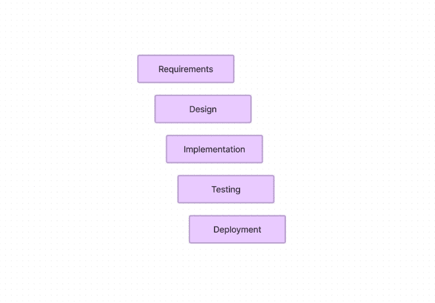
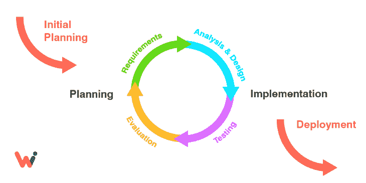
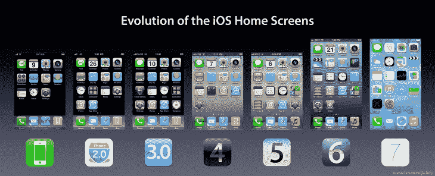
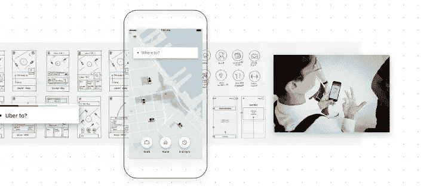
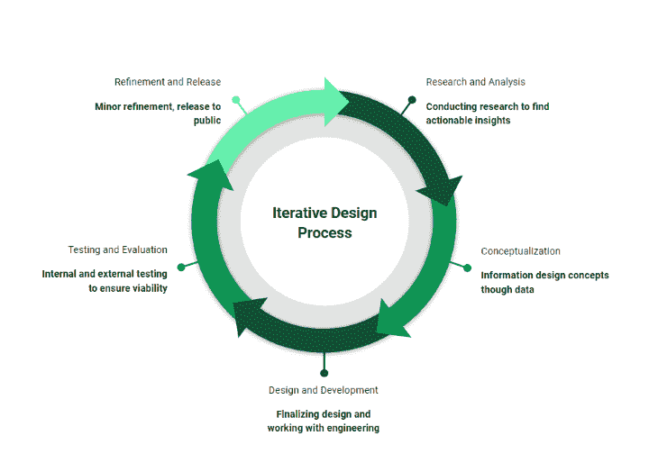
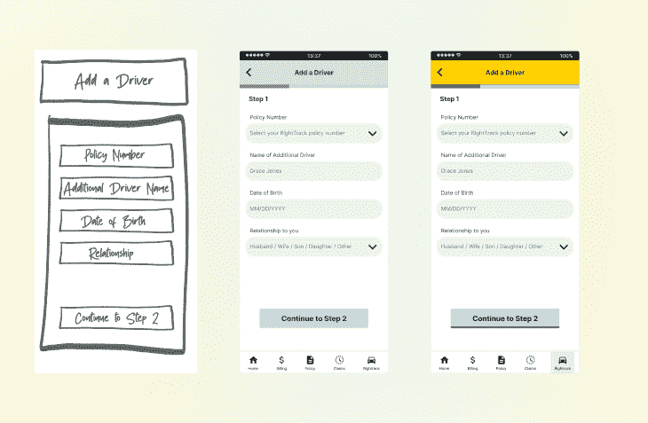

# 建立一个有意识的迭代 UX 设计过程

> 原文：<https://blog.logrocket.com/ux-design/building-intentional-iterative-ux-design-process/>

如果说在过去的十年里作为一名设计师教会了我什么的话，那就是设计永远不会真正完成。我们并不是生活在一个产品或功能被“完美”地发布给用户，并且永远不会被再次修改的世界里。这是不可能的，因为设计是一个内在的迭代过程。但人们并不总是这么看。

随着[敏捷方法](https://www.wrike.com/project-management-guide/faq/what-is-agile-methodology-in-project-management/)的兴起，IT 行业越来越理解设计是该方法的一部分。前提很简单——跨学科的团队在一系列冲刺的过程中，朝着一个共同的目标，在循环的基础上一起工作，不断地进行改进。用户现在也有同样的期望。绝大多数通过 Spotify 听音乐或在网飞上观看他们最喜欢的节目的人都知道，他们手机或智能电视上的应用程序会不断更新。这种客户需求，再加上更加敏捷的工作方式，使得设计成为最前沿和中心。

然而，在敏捷在项目管理圈子中流行起来之前，瀑布方法占主导地位。瀑布方法本身并没有错，但是从我的经验来看，我发现它极大地限制了迭代设计的潜力，并且还会导致推送给最终用户的更新慢得多。这并不是完成工作的错误方式，但它与敏捷完全相反。

作为瀑布方法的一部分，设计网站和应用程序不可避免地意味着我必须完成我的工作，然后将设计交给工程团队。这被开玩笑地称为“把设计扔过墙”，这个术语强调了跨团队合作是多么糟糕。

作为一名设计师，我处在“瀑布”的顶端，瀑布的每一部分都在我的下方。如果瀑布的任何部分没有完成，它将推后整个项目。简单地说，除非前一个阶段完成，否则下一个阶段将无法进行。

In simple terms, this is the waterfall method. Notice how each step in the waterfall has its own distinct section, which needs to be completed before the next can be started.

相比较而言，这是一种僵硬的，有时不可原谅的工作方式，完全不符合迭代设计的概念。如果团队在任何时候收到用户的反馈，要求设计变更，那么，这通常是“太糟糕了”这些改变将不得不等到下一次项目更新，这要么是几个月以后，要么可能根本没有定义。

令人欣慰的是，在接下来的几年里，许多团队已经转向了更敏捷的观点，其好处我们将会深入探讨。但是首先，什么是迭代设计的定义。

## 迭代设计:一个定义

迭代设计是一个过程，在这个过程中，产品或系统的设计通过设计和测试的重复循环而逐渐改进。迭代设计不同于非迭代设计，当一个产品或系统在一个周期内被设计出来，然后发布给公众。这种设计方法允许在多个周期内根据用户反馈和测试对设计进行持续改进和调整。

In a typical iterative design process, notice the cyclical nature of requirements, analysis and design, evaluation and testing, before it’s deployed to users. Source: [wishdesk.com](https://wishdesk.com/blog/what-is-iterative-design-approach)

## 迭代设计的真实例子

### 苹果 iphone

迭代设计最著名的例子可能来自加州的库比蒂诺。虽然有些人哀叹苹果对 iPhone 更新的方法，但不可否认的是，他们对迭代方法的奉献已经帮助赢得了数百万客户。每年，苹果都会发布新版本的 iPhone，并根据以前型号的反馈进行升级和改进。

不过还是把重点放在 iOS 上吧。这可能很难相信，但 iOS 的第一个版本早在 2007 年 6 月 29 日就发布了。十六年后的今天，最新的 iPhones 运行的是 iOS 16。不管这个过程在苹果内部被称为什么，他们的设计方法很可能与迭代设计思维一致。十六年来基于用户反馈的持续迭代设计，以及不断变化的业务需求，使用户从持续更新中受益。

苹果公司以其设计流程而闻名，包括用户研究、原型制作、测试和迭代的连续循环。用户研究有助于苹果了解用户的需求和愿望，揭示他们的行为、特质和偏好。概括地说，这些研究方法可以分为三类:定性研究、定量研究和心理研究。

定性研究包括通过访谈、焦点小组和调查从个人用户那里收集数据。定量研究包括从大量用户那里收集数据。从数据角度来看，用户的 iPhone 是苹果用来(在许可的情况下)监控用户行为的金矿。这有助于苹果衡量用户对某些功能的反应，并识别用户行为模式。另一方面，心理学研究包括收集关于用户心理特征的数据，比如他们的价值观、信仰和态度。

这种研究然后反馈到设计过程本身，以草图研讨会、原型和高保真设计的形式，在内部以及与用户研究参与者一起持续评估。这是研究和分析阶段的一部分，我们将在后面详细解释。

In this example, we can see the evolution of the iOS home screen. Notice how the design language changes entirely from skeuomorphism to a flatter design aesthetic. Source: [osxdaily.com](https://osxdaily.com/)

### 特斯拉的自动驾驶系统

也许这是一个有点争议的条目，因为许多人认为自动驾驶系统是一个不可能的目标。但是，只有特别坚持迭代设计，自动驾驶才能生存。我们周围的世界太复杂了，任何其他设计过程都无法在这种环境下工作。

特斯拉的自动驾驶系统采用迭代设计来改善用户体验，更重要的是，使系统更加可靠。通过发布自动驾驶系统的更新，基于用户反馈和分析数据引入了新的功能和改进。正如苹果可以从许多 iPhones 上获取数据一样，特斯拉也可以从自己的许多车辆上获取数据。偏好和行为被记录下来，然后送回特斯拉总部进行分析，作为研究和分析阶段的一部分。

Tesla would often suggest their customer feedback program is the key differentiator between themselves and other auto manufacturers. Source: [themobilist.com](https://themobilist.medium.com/divining-teslas-safety-score-83a60bb17ab0)

当 Autopilot 首次推出时，该系统仅依赖于一个前置摄像头。这是该系统迈出的伟大的第一步，但由于硬件和软件的原因而受到限制。这些限制作为迭代设计过程的一部分，反馈给了特斯拉。这不可避免地导致了进一步的迭代，即硬件 2.0、2.5 和 3.0 以及一系列软件更新，这显著增加了汽车内提供的技术水平和复杂性。

鉴于特斯拉在控制汽车硬件和软件方面处于独特的地位，就像苹果控制其硬件和软件一样，拥有特斯拉的关键特征之一是知道它是迭代设计过程的一部分，这是有道理的。

### 优步

优步是设计的冠军，尤其是在使用[冲刺方法](http://www.gv.com/sprint/)方面。不涉及太多的细节，sprint 方法论实际上是浓缩到仅仅五天的迭代设计过程。在工作周期间，不同的团队构思、构建、启动和学习。这是一个被严密监控的循环过程，然后反馈到一个更大的迭代设计过程，涉及公司内更广泛的团队。不管人们是否同意 sprint 方法是有益的——它代表了迭代设计思想的前沿。

Iterative design if absolute speed was the top priority. The sprint methodology allows teams to laser focus on problems, in the hope of solving them in just 5 days. Source: [thesprintbook.com](https://www.thesprintbook.com/the-design-sprint)

优步的出租车和送餐服务应用体现了这种方式。优步根据用户反馈不断开发新的功能和改进。该公司使用迭代设计流程来改善用户体验，使他们的服务更加准确可靠。

Uber was quick to learn the benefits of adopting an iterative approach to design, knowing their customer base expects feature-rich updates to make their lives easier. Source: [Uber Design](https://medium.com/uber-design/designing-the-new-uber-app-16afcc1d3c2e)

关注的一个关键领域是产品选择焦点，优步的设计团队意识到这并不像他们最初认为的那样可扩展。产品选择焦点中呈现的更多选项导致了最终用户认知负荷的真正紧张，因此他们知道某个特定功能必须以更具可伸缩性的方式重新设计。

Didier Hilhorst 在优步设计博客中继续解释说，“这个功能经历了最多的设计周期和迭代”，“正在进行的用户研究和迭代原型在我们的过程中发挥了至关重要的作用。”

这个关键的研究和设计阶段经历了多次迭代，特别是与内部利益相关者和用户研究参与者。一旦 Hilhorst 和他的团队确信选择了正确的解决方案，就将它传递给工程团队进行开发。

## 当迭代设计没有产生结果时

迭代设计在很大程度上是其各个部分的总和。每当过程的一部分落后或者完全被忽略时，迭代设计就不起作用。这种情况确实会发生，而且经常出乎意料，因为在发布新特性的过程中，团队被拉向不同的方向。团队一起工作，并尽他们最大的能力合作(不管组成团队的不同职业)，最有可能在迭代设计中取得成功。

根据我自己的经验，以下是迭代设计没有产生预期结果的原因:

*   资源不足——迭代设计最适合来自公司不同领域的多样化团队。对设计师来说可能的事情对开发人员来说不可能，所以在这个过程中有合适的人才参与是很重要的
*   每个连续的阶段都是严格的，没有重叠——迭代过程需要一定程度的灵活性，因为在整个过程中总是需要一定程度的重叠
*   完成某些阶段的估计时间很难确定——由于灵活性的增加，估计事情需要多长时间并不总是容易的
*   缺乏真正的洞察力和来自用户的数据——取决于在研究和分析阶段进行的研究的质量，如果团队觉得没有什么可以改进的，可能很难迭代

迭代设计的概念本身并不一定是一个问题，或者为什么没有产生结果；相反，这很可能是因为这个过程没有从用户那里提供足够的反馈。没有用户的反馈，迭代过程就不能用来对设计进行改进或调整。除非有意义的用户反馈被整合到过程中，否则这个过程不是真正的迭代。这凸显了与用户交流的重要性。

此外，如果没有用户输入，几乎不可能识别设计或用户体验的任何问题。这可能导致产品或系统没有针对用户需求和偏好进行优化，这可能导致团队看不到他们迭代过程的成功。

## 成功迭代设计的 5 个步骤

我们知道什么是迭代设计，以及为什么世界上最大的组织都使用这种方法，但是你如何使用它并使它成功呢？让我们看看实现迭代设计的五个步骤。

A circle flow chart showing the different stages of an iterative process.

### 研究和分析

与用户交谈对于确定需要解决哪些问题至关重要。任何成功的迭代设计过程的第一步都是进行研究和分析。设计团队通常会这样安排，更具体地说，是团队中的 UX 设计师或研究人员。开展用户研究是当务之急，它是未来所有决策的基石。这包括收集关于用户需求、偏好和行为的数据。也许这些数据已经以某种格式存在，所以设计团队应该在此基础上进行构建。通过使用主要或次要研究，这些数据可用于识别现有设计中的潜在问题和改进机会。

向团队展示并阐明数据背后的含义也至关重要。由于信息反馈给团队的方式不同，很多见解可能会丢失，因此以一种引人入胜的方式展示反馈的发现很重要，这样可以快速确定研究的原因以及它为什么会影响业务。

**能够产生可行见解的研究类型:**

| 行为的 | 态度的 |
| 远程可用性测试 | 面谈 |
| 远程调节测试 | 合意性研究 |
| 点击流/分析 | 调查 |
| A/B 测试 | 客户反馈 |

> 注意，我已经注意到这是第一步，但是你的团队应该在任何时候都有研究和分析的头脑，不管你在设计过程的哪个阶段。总是有学习、反馈和基于反馈的迭代的机会。

研究和分析对于团队来说也是有益的，他们可能面临几个想法，并且不确定哪一个想法应该得到(可能有限的)专用时间和金钱。与同等的开发成本相比，为每个想法开发一个简单的原型是非常便宜的。在这个阶段忽略一个想法也容易得多，因为这个想法投入的精力较少。

### 概念化

在迭代设计过程的第二步，概念化，鼓励团队使用前一步收集的数据来创建计划和概念，以说明潜在的解决方案。

考虑以可用性测试、点击流分析或客户反馈的形式进行的任何研究。这对未来的设计决策有什么影响？重要的是要记住，这一步还可能涉及头脑风暴的想法和创建快速和肮脏的原型，然后再转移到 Figma 中设计的高保真概念。

你制作的模型对于内部讨论特别有用，但是它们也是一个向用户测试参与者展示正在进行的工作的机会，一个更细粒度的、增量的可用性测试方法。实际上，总体迭代中的微迭代。能够采取这种精细的方法需要在一个“UX 成熟”的团队中工作——也就是说，UX 是公司业务的核心。

当我在一家在线零售商工作时，我们会定期创建模型，在测试过程中展示给用户。通过逐步改进这些设计，我们不仅感觉到我们在改进我们的产品，而且感觉到我们在过程本身中给利益相关者灌输了更多的信心。他们能够直接看到迭代方法的好处，并积极地成为它的支持者。通过精心设计我们的问题以确保不存在偏见，并让参与者有足够的时间评估他们面前的情况，我们可以快速确定变化是否导致微不足道的改进、可测量的改进或贬损。

在这种情况下，如果我们想测试多个假设，迭代设计会特别有效。如果我们使用更严格的设计方法，我们根本无法以这种方式处理项目。

由于能够快速迭代多个场景，我们确保了一种更主动的设计方法——而不是基于假设进行交付，并在未来做出更大的改变。我们有效地成为一个运转良好的团队，在整个过程中进行快速的微迭代，确保我们为用户寻找到最好的结果。

A typical process during the conceptualization phase, from paper prototype to wireframing to high-fidelity concepts.

### 设计和开发

迭代设计过程的第三步是设计和开发。首先，这包括确定一个实际的设计来解决研究和分析过程中提出的问题。可能有很多可供选择，但是到目前为止，一个团队应该已经选定了一个最适合最初问题陈述的单一设计(或一系列设计)。

基于前两个阶段的数据，设计团队(以及更广泛的团队)将给予他们所需的信心。工程团队将开始构建设计，但这并不一定意味着工程团队会在设计/开发之间不需要沟通的情况下离开。实际上，我发现在这一点上恰恰相反。

交流对于迭代设计过程的成功至关重要，因此工程和设计团队之间的交流非常重要。在这一点上，仍然有可能与用户一起进行测试，但最终取决于时间、预算和总体信心因素。理想情况下，一个成功的迭代设计过程应该意味着任何发现的问题都被记录下来，与团队共享，并在早期得到解决。这确保团队可以专注于构建解决方案。

> 注意，我合作过的最好的设计师是那些花时间与工程团队建立融洽关系的人。没有必要敌意。那种认为设计师总是和开发人员针锋相对的看法是一个神话，一个好的迭代设计过程可以在创造一个更和谐的工作场所方面发挥很大的作用。两种职业的相互理解会带来更好的合作。

或者，在这个阶段的任何其他兴趣点(除了阻塞之外)可以滚动到下一个迭代设计阶段。

### 测试和评估

迭代设计过程的第四步是测试和评估。这包括在内部测试工程团队的最新工作，从质量保证的角度收集反馈，并确定任何最终的潜在问题或可以在另一个 sprint 中包括的改进领域。设计和工程团队之间的交流应该是持续的，但是很可能现在焦点将开始转移到另一个即将到来的迭代。

仍然可能有最后一分钟正在进行的问题，需要来自设计团队的人来支持工程团队，也许是以加入每日 scrum 会议或两个团队聚在一起的专门会议的形式。这确保了所有的基础都被覆盖，并且在精化和发布之后的上线之前，过程尽可能的平稳。

### 细化和发布

迭代设计过程的第五步，也是最后一步，是精化和发布。在这一点上，所做的任何改变都是微小的，如果有的话。在这一点上，基于用户反馈对设计/构建进行调整是不太可能的，测试然后向公众发布设计将是重中之重。在这一点上，整个过程循环往复。随着最新版本发布到用户手中，反馈将持续存在，并直接反馈到整个设计过程，特别是研究和分析阶段。

设计永远不会停止，也不太可能有反馈。可以通过多种方式收集来自最新版本的反馈:

*   游击队可用性测试
*   调查
*   分析数据
*   社交媒体帖子
*   客户服务/客户成功团队反馈

这就是了。我们现在处于周期的末尾，但设计过程从未停止。通过使用上面的过程，我们知道我们会一次又一次地重复，因为市场因素、商业原因或用户研究而出现新的问题需要解决。

## 结论

迭代设计允许更多的灵活性，对用户的同情，以及允许团队快速迭代出从简单到复杂的想法的范围。作为指导团队构建伟大产品的中流砥柱，迭代设计不太可能很快改变。

*标题图片来源:* [图标侦察](https://iconscout.com)

## [LogRocket](https://lp.logrocket.com/blg/signup) :无需采访即可获得 UX 洞察的分析

[LogRocket](https://lp.logrocket.com/blg/signup) 让您可以回放用户的产品体验，以可视化竞争，了解影响采用的问题，并结合定性和定量数据，以便您可以创建令人惊叹的数字体验。

查看设计选择、交互和问题如何影响您的用户— [立即尝试 LogRocket】。](hhttps://lp.logrocket.com/blg/signup)