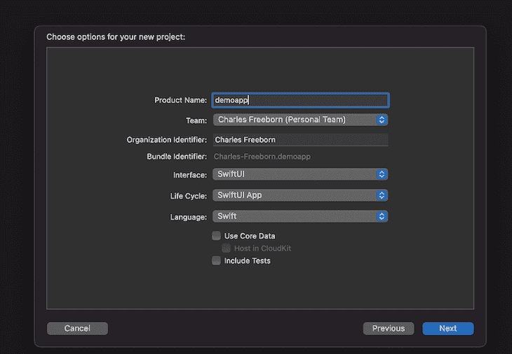
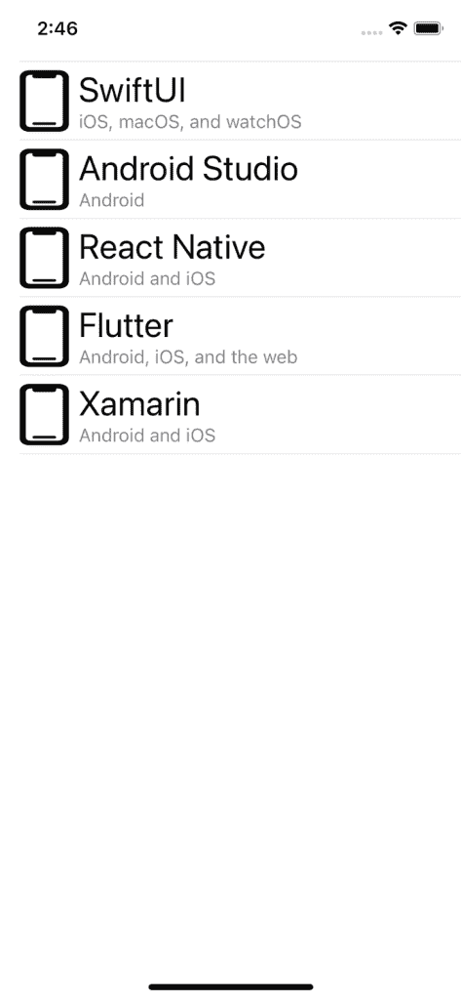

# 使用 SwiftUI 构建 iOS 应用程序:示例教程

> 原文：<https://blog.logrocket.com/building-ios-apps-swiftui-tutorial/>

在本指南中，我们将探索 SwiftUI 的一些关键特性，然后通过构建一个 Swift 应用程序演示来应用这些技能和技术。

## 什么是 SwiftUI？

SwiftUI 是一个框架，支持使用 Swift 编程语言为任何苹果平台(iOS、watchOS 和 macOS)声明用户界面(和构建应用程序)的现代方法。

声明性方法意味着你可以声明你的用户界面应该做什么。SwiftUI 使您能够访问视图、控件和布局结构，您可以使用它们来声明用户界面。

SwiftUI 由 Apple 所有，是一个跨平台的 UI 框架，适用于 iOS、macOS、tvOS 和 watchOS。这意味着你只需要学习一种语言(Swift)和框架，就可以在任何苹果平台上部署你的代码。

下面是 SwiftUI 中一个“Hello World”程序的样子。此代码示例由 Xcode 在您创建 SwiftUI 应用程序时生成:

```
import SwiftUI      // using the SwiftUI framework and its functionality.

struct ContentView : View {
    var body : some View {
        Text("Hello, world!")
            .padding()
    }
}

```

## swift ui views(swift ui 视图)

应用程序用户界面的核心是视图。视图是用户看到的应用程序的一部分，例如图像、文本、动画、交互元素和图形。

在 SwiftUI 中，`View`要求你有一个属性。在下面的代码片段中，我们有`body`，它返回`some View`:

```
var body : some View 

```

这也是我们在上面的示例“Hello World”代码中所拥有的。

## 控制

SwiftUI 中的控件负责用户与应用程序的交互。这些控件的示例包括单击按钮、文本字段、响应用户手势等。

回想一下，SwiftUI 是一个允许您跨 Apple 平台构建用户界面的框架。同样，SwiftUI 附带了 UI 控件，允许您为用户创建交互式元素。

例如，`UIButton`控件使您能够创建一个响应用户点击/交互的按钮。下面是语法:

```
@MainActor class UIButton : UIControl

```

## 布局结构

SwiftUI 支持布局应用程序用户界面的视图。我们可以通过使用栈，比如`HStack`、`VStack`和/或`ZStack`，以及列表来布局这些视图。

在使用 SwiftUI 布局应用程序的结构时，有一个容器，它就像 HTML 中的父元素。这个容器包含子容器，我们称之为堆栈。

让我们看看布局结构中的这些堆栈。

`**HStack**`

我们可以使用`HStack`为我们的应用程序布局一个视图，将它的子视图排列成一条水平线。使用`HStack`，视图会同时显示。

下面是一个使用`HStack`横向布局文本的例子:

```
import SwiftUI

struct ContentView : View {
    var body: some View {
        HStack {
            Text("Introducing")
                .font(.title)
            Text("A Demo App")
        }
    }
}

```


HStack demo output.

`**VStack**`

一个`VStack`(垂直堆栈)是 SwiftUI 中最常见的布局容器之一。`VStack`允许您垂直堆叠视图。

使用`VStack`，我们可以布局一个视图，将它的子视图排成一条垂直线。这里有一个使用`VStack`垂直布局文本的例子。

```
import SwiftUI

struct ContentView : View {
    var body: some View {
        VStack {
            Text("Introducing")
                .font(.title)
            Text("A Demo App")
        }
    }
}

```


VStack demo sample.

`**ZStack**`

`ZStack`使我们能够将孩子叠加在另一个孩子的上面，并在`x`和`y`轴上对齐他们。`ZStack`设置每个孩子的`x`和`y`轴默认为中心对齐。

`ZStack`的语法如下:

```
@frozen struct ZStack<Content> where Content : View

```

使用`ZStack`，一个子视图被赋予一个比它之前的子视图更高的 z 轴值。所以后面的孩子会叠在前面的孩子上面。

您可以使用`ZStack`在另一个项目(如图像或另一个文本块)上播放一个项目(如文本)。

在下面的例子中，我们使用`ZStack`将一张汽车图片放在包含一些文本的`HStack`上面。对齐属性被设置为`top`以增加可读性。否则，图像会与文本重叠。

```
struct ContentView : View {
    var body: some View {
        ZStack {
            Image(systemName: "car")
                .font(.title)
                .frame(width: 100, height: 100, alignment: .top)
            HStack {
                Text("Introducing")
                    .font(.title)
                Text("A Demo App")
            }

        }
    }
}

```


ZStack demo sample.

## 使用 SwiftUI 构建应用程序

为了展示上述技术如何达到简化、直观的 Swift 应用程序的水平，我们将使用 SwiftUI 构建一个应用程序，显示您可用于开发移动应用程序的技术和/或框架列表。这个演示应用程序的代码将在`ContentView.swift`中编写。

首先，启动 Xcode 并点击**创建一个新的 Xcode 项目**。

接下来，选择 **App** ，点击**下一步**。

在**产品名称**字段中，输入“demoapp”并点击**下一步**。然后等待 Xcode 启动 starter 项目。



找到`ContentView.swift`。如前所述，这是我们将编写 Swift 代码的文件。

现在清除代码，只留下这个:

```
import SwiftUI

struct ContentView: View {
    var body: some View {
        List {
            AppView(title: "SwiftUI", details: "iOS, macOS, and watchOS")
            AppView(title: "Android Studio", details: "Android")
            AppView(title: "React Native", details: "Android and iOS")
            AppView(title: "Flutter", details: "Android, iOS, and the web")
            AppView(title: "Xamarin", details: "Android and iOS")
        }
    }
}

struct AppView: View {
    var title: String
    var details: String
    var body: some View {
        HStack {
            Image(systemName: "iphone")
                .resizable()
                .frame(width: 40, height: 50)
                .foregroundColor(.black)
            VStack(alignment: .leading){
                Text(title)
                    .font(.title)
                Text(details)
                    .font(.subheadline)
                    .foregroundColor(.secondary)
            }
        }
    }
}

```

从 Xcode 上的 navigator 面板中，选择一个 iPhone 模拟器，并通过点按播放符号来运行该程序。



Demo app showing list of technologies and platforms.

## 结论

在本教程中，我们向您介绍了 SwiftUI，这是一个苹果的 UI 框架，用于跨各种平台进行构建。我们还放大了 SwiftUI 的核心、基本概念，包括布局结构和使用框架构建简单应用程序的一般最佳实践。

要了解更多关于 SwiftUI 的信息，请参阅官方文档。

## 使用 [LogRocket](https://lp.logrocket.com/blg/signup) 消除传统错误报告的干扰

[](https://lp.logrocket.com/blg/signup)

[LogRocket](https://lp.logrocket.com/blg/signup) 是一个数字体验分析解决方案，它可以保护您免受数百个假阳性错误警报的影响，只针对几个真正重要的项目。LogRocket 会告诉您应用程序中实际影响用户的最具影响力的 bug 和 UX 问题。

然后，使用具有深层技术遥测的会话重放来确切地查看用户看到了什么以及是什么导致了问题，就像你在他们身后看一样。

LogRocket 自动聚合客户端错误、JS 异常、前端性能指标和用户交互。然后 LogRocket 使用机器学习来告诉你哪些问题正在影响大多数用户，并提供你需要修复它的上下文。

关注重要的 bug—[今天就试试 LogRocket】。](https://lp.logrocket.com/blg/signup-issue-free)