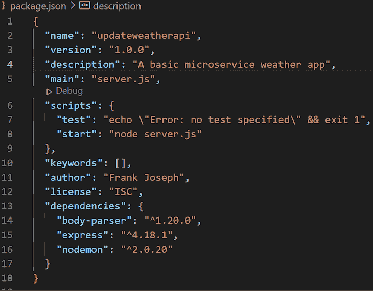

# 用 Node.js 构建微服务

> 原文：<https://blog.logrocket.com/building-microservices-node-js/>

***编者按**:本文最后一次更新于 2022 年 10 月 19 日，以包括关于微服务通信的附加信息。*

在早期的软件开发中，最佳实践包括将软件的所有组件紧密耦合在一个整体应用程序中。然而，单一应用程序需要额外的努力来响应系统中的变化。如果任何特定组件出现故障，整个系统都会受到影响。

如今，我们可以通过使用微服务来解决这个问题，微服务允许我们单独构建我们的软件组件。一个组件的故障不会影响整个软件产品的功能。

在本文中，我们将探索微服务，学习如何使用 Node.js 实现微服务，并讨论微服务如何改变软件开发实践。我们开始吧！

要阅读本文，您需要以下内容:

*   安装在计算机上的 Node.js
*   JavaScript 和 Node.js 的基础知识

## 目录

## 微服务与单片应用

### 了解单片应用程序

整体式应用程序是一个单层应用程序，其中所有组件组成一个单元。

假设您正在构建一个图书馆管理系统，所有的组件，如`books`和`users`，以及它们各自的服务和数据库被融合在一起成为一个单元。任何一个组件出现故障都需要关闭整个系统来纠正错误。

由于这个原因，单片应用程序既不灵活也不容易扩展；您不能同时构建功能或实现连续部署。虽然整体应用程序管理起来不划算，但构建起来却很划算。因此，开发人员认识到需要创建一个系统，其中一个有故障的组件不会影响整个软件系统。

### 了解微服务

由于软件开发整体模式的缺点，微服务成为必要。在微服务中，每个软件应用程序功能都是相互分离的，大多数情况下都有各自的服务器和数据库。用这种体系结构构建的应用程序是松散耦合的，也称为分布式应用程序。

想象我们正在建立一个电子商务商店。我们需要一个`payment feature`、`cart`、`customers`、`admin`和`order`的模型。这些特性中的每一个都有自己独立的服务器和数据库。

我们的电子商务微服务将使用 REST API 框架相互通信。因为我们将彼此独立地开发我们的商店功能，如果我们的系统出现故障，我们可以很容易地确定要调试哪个功能，从而避免关闭整个应用程序。

与单一应用相比，使用微服务开发的应用是可扩展的。你可以用任何编程语言开发一个微服务；事实上，您可以使用不同的语言在一个微服务应用程序中开发不同的功能。

总的来说，微服务提供了更好的开发者体验。加入团队的新开发人员不需要了解整个代码库，而只需要了解他们正在开发的功能，从而提高整体生产力。最后，在微服务中鼓励单元测试；您可以编写单元测试来测试任何特定的功能。

重要的是要记住，构建微服务需要专业知识，因为集成和端到端测试可能非常具有挑战性。此外，微服务可能会变得非常庞大，从而导致高昂的维护成本。最后，将已经使用单片架构开发的软件迁移到微服务并不总是容易的，而且应用程序在复杂的网络中相互定位也是一项挑战。

## 微服务之间的通信

选择微服务架构模式会带来一些挑战；其中之一是服务对服务的通信。服务是应用程序松散耦合的一部分，它们共同影响应用程序的整体性能。

为了实现有效的性能，微服务之间必须有一种[通信方式。在微服务应用程序中，可以通过服务间通信协议(如 HTTP(s)、gRPC 或消息代理)进行通信。](https://blog.logrocket.com/methods-for-microservice-communication/)

让我们回顾一下微服务架构中服务建立通信的一些方式。

### HTTP 通信

HTTP 通信是一种同步通信模式，其中服务依赖于另一个服务来执行:


上图代表 HTTP 请求-响应循环，其中客户端发出请求，并等待来自服务器端应用程序的响应。

### 事件驱动的通信模式

事件驱动的通信模式需要服务提供者和服务消费者之间的交互。服务消费者需要来自外部来源的资源。然后，它执行一些计算，并将响应转发给客户端:


## 将 Node.js 用于我们的微服务

您可以使用任何编程语言来开发微服务，如 Java、C#或 Python，但 Node.js 是一个出色的选择，原因如下。

首先，Node.js 使用事件驱动的架构，支持高效、实时的应用程序开发。 [Node.js 单线程和异步能力](https://blog.logrocket.com/a-complete-guide-to-threads-in-node-js-4fa3898fe74f/)启用非阻塞机制。当使用 Node.js 构建微服务时，开发人员将体验到不间断的流程，并享受 Node 的速度、可伸缩性和易维护性。

## 用 Node.js 构建一个简单的微服务应用

### 安装依赖项

为了说明如何使用 Node.js 开发微服务，我们将使用 OpenWeather API 服务。首先，[创建一个免费账户](https://openweathermap.org/)。

在你的电脑上创建一个新文件夹，最好是在你的桌面上以便于访问，并将其命名为`weathermicroservice`。在代码编辑器中打开`weathermicroservice`,通过运行下面的命令确认您的计算机上已经安装了 Node.js:

```
node -v

```

如果 Node.js 没有安装，[继续下载它](https://nodejs.org/en/download/)。在`weathermicroservice`中，运行下面的命令来初始化`package.json`:

```
Run npm init or npm init -y

```

使用`npm init`，您可以自定义设置或字段来创建`package.json`文件。另一方面，`npm init -y`使用默认设置或字段创建`package.json`文件。

现在，让我们用下面的命令安装所需的依赖项:

```
run npm install express nodemon body-parser

```

您的`package.json`文件应该类似于下面的截图:



直接在主文件夹中，创建一个名为`server.js`的文件。在内部，编写以下代码:

```
const express = require("express");
const bodyParser = require("body-parser")

const aboutRouter = require("./routes/about");
const weatherRouter = require("./routes/weather");

const PORT = 3000;
const HOST_NAME = "localhost";

const app = express();
app.use(express.static("client"));
app.use(bodyParser.urlencoded({extended: true}));

app.use("/weather", weatherRouter);
app.use("/about", aboutRouter);

app.listen(PORT, HOST_NAME, ()=&gt;{
    console.log(`Server running at ${HOST_NAME}:${PORT}`)
})

```

`server.js`是我们基本天气微服务应用的主文件，如我们的`package.json`文件所示。我们将在`weathermicroservice`文件夹中创建另一个名为`routes`的文件夹。

在`routes`文件夹中，创建两个名为`about.js`和`weather.js`的文件。在`about.js`文件中，编写以下代码:

```
const express = require("express");
const properties = require("../package.json");

const aboutRoute = express.Router();

aboutRoute.get("/", (req, res)=&gt;{
    const aboutInfo ={
        name: properties.name,
        description: properties.description,
        author: properties.author
    }
    res.json(aboutInfo)
})

module.exports = aboutRoute

```

在上面的代码中，我们首先`require`或导入`express`模块，然后是`package.json`文件，我们将它赋给名为`properties`的变量。

然后，我们调用`express.Router`函数。最后，我们实现我们的`GET`路由，它返回一个包含关于我们的应用程序的信息的`aboutInfo`，如`package.json`文件中所包含的。记住，我们在`about.js`文件的第二行代码中导入了我们的`package.json`文件。

* * *

### 更多来自 LogRocket 的精彩文章:

* * *

### 创建客户端

现在我们已经完成了`about.js` route 模块，我们将创建处理`weather info`请求的路由。在此之前，让我们创建应用程序的客户端。

首先，我们将创建一个接收用户输入的基本 HTML 文件。在主项目文件夹下，创建一个名为`client`的文件夹。在其中，创建一个`index.html`文件，并将下面的代码添加到其中:

```
<!DOCTYPE html>
<html lang="en">
<head>
    <meta charset="UTF-8">
    <meta http-equiv="X-UA-Compatible" content="IE=edge">
    <meta name="viewport" content="width=device-width, initial-scale=1.0">
    <title>Weather App</title>
</head>
<body>
    <h1>A basic Weather app microservice</h1>
    <p>Enter your details to get weather Info </p>
    <form action="/weather" method="post">
        <label for="cityInput">City name: </label>
        <input type="text" name="cityName" placeholder="Enter name of your city" id="cityInput">
        <label for="unitInput">Unit</label>
        <input type="text" name="unit" placeholder="Enter unit in metric" id="unitInput">
        <button type="submit">submit</button>
    </form>

</body>
</html>

```

这是一个基本的 HTML 表单，允许您输入城市名称和公制单位，以及将输入作为一个`POST`请求提交给天气路线。

要创建处理天气信息的路线，在`route`文件夹中创建一个名为`weather.js`的文件，并向其中添加以下代码:

```
const express = require("express");
const https = require('https')

const weatherRoute = express.Router();
weatherRoute.get("/", (req, res)=&gt;{
    res.sendFile(__dirname, + "index.html")   
})

weatherRoute.post("/", (req, res)=&gt;{
        const city = req.body.cityName
        const appiKey = "Your API Key" 
        const unit = req.body.unit

        const url = "https://api.openweathermap.org/data/2.5/weather?q="+ city + "&amp;appid="+appiKey+"&amp;units="+unit+""
        https.get(url, (response)=&gt;{
            response.on("data", (chunk)=&gt;{
                const responseData = JSON.parse(chunk);
                const temperature = responseData.main.temp;
                const weatherDes = responseData.weather[0].description;
                const icon = responseData.weather[0].icon;
                const imageURL = "http://openweathermap.org/img/wn/"+ icon + "@2x.png";
                const cityName = responseData.name;
                res.write(`&lt;h1&gt;The weather is ${temperature} degree celsius in ${cityName} and the description is ${weatherDes} &lt;/h1&gt;`)
                res.write("&lt;img src="+ imageURL +"&gt;")
                res.send()
            })
        })
})
module.exports = weatherRoute

```

首先，我们需要`Express`和本机`https` Node.js 模块。然后，我们创建了一个 Express 实例，并调用了 Express router 函数。使用 Express 实例，我们创建了第一个路由，当请求到达服务器时，它向客户机发送响应。

对客户的响应应采用如下所示的基本形式:


```
res.sendFile(__dirname, + "index.html")

```

然后，我们将`index.html`文件发送给客户端。当点击`submit`按钮时，客户端向服务器发出一个`POST`请求。服务器通过`request`对象访问请求体，并将其保存到变量中:

```
const city = req.body.cityName
const unit = req.body.unit

```

现在我们有了这些参数，我们可以轻松地访问 OpenWeather API。下面的 URL 帮助我们连接到天气 API:

```
const url = "https://api.openweathermap.org/data/2.5/weather?q="+ city + "&amp;appid="+appiKey+"&amp;units="+unit+""

```

使用 Node.js 本机`https`模块，我们对天气 API 执行一个`GET`请求。然后我们使用`JSON.parse()`将来自响应体的数据`parse`成一个对象。

我们需要以下内容作为应用程序响应数据的一部分:

*   温度
*   天气描述:`weatherDes`
*   图标
*   图像
*   城市名称

最后，我们使用 Node.js `writeable interface`中的`res.write`函数将响应发送回客户端。现在，要运行此应用程序，请在您的根文件夹中运行以下命令:

```
node server.js

```

在您的控制台上，您应该看到类似下图的内容:


然后，打开你的浏览器，最好是 Chrome，向`port 3000`发出请求:


您应该会得到如下所示的响应:


在`City name`字段中，输入您所在城市的名称，在`Unit`字段中，输入`metric`，将默认温度单位转换为`celsius`。天气 API 中默认的温度单位是`Kelvin`。

如果您做的一切都正确，那么您会得到您所在城市的温度读数的响应，并有图标来表示它:


上面的图像是我收到的代表我所在城市的温度读数的输出。

## 结论

在本教程中，我们了解了微服务和单片应用之间的重要区别。我们了解了为什么 Node.js 是构建微服务的最佳选择，并使用 OpenWeather API 运行了一个示例。

使用微服务可以提供单一应用程序无法实现的灵活性和性能优势。Node.js 的事件驱动架构使其成为微服务的完美选择，速度快，可伸缩性高，易于维护。

## 200 只显示器出现故障，生产中网络请求缓慢

部署基于节点的 web 应用程序或网站是容易的部分。确保您的节点实例继续为您的应用程序提供资源是事情变得更加困难的地方。如果您对确保对后端或第三方服务的请求成功感兴趣，

[try LogRocket](https://lp.logrocket.com/blg/node-signup)

.

[](https://lp.logrocket.com/blg/node-signup)[https://logrocket.com/signup/](https://lp.logrocket.com/blg/node-signup)

LogRocket 就像是网络和移动应用程序的 DVR，记录下用户与你的应用程序交互时发生的一切。您可以汇总并报告有问题的网络请求，以快速了解根本原因，而不是猜测问题发生的原因。

LogRocket 检测您的应用程序以记录基线性能计时，如页面加载时间、到达第一个字节的时间、慢速网络请求，还记录 Redux、NgRx 和 Vuex 操作/状态。

[Start monitoring for free](https://lp.logrocket.com/blg/node-signup)

.