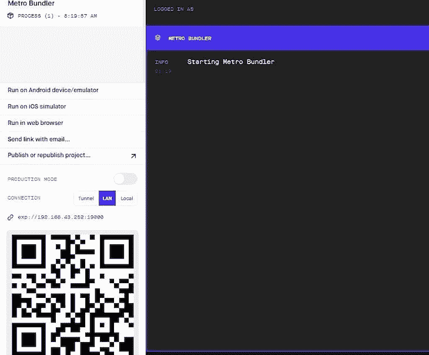
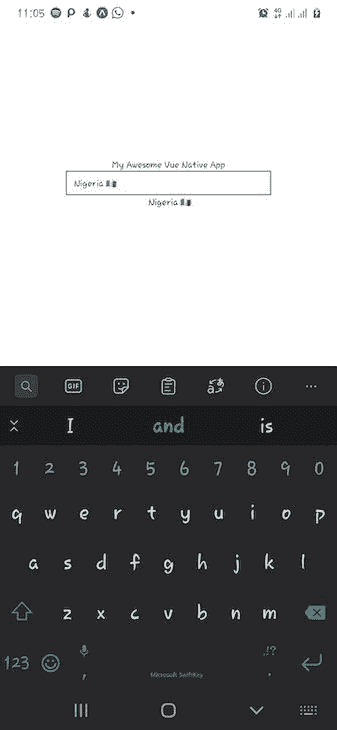

# 使用 Vue Native 构建移动应用

> 原文：<https://blog.logrocket.com/building-mobile-apps-with-vue-native/>

***编者按**:据[官网](https://vue-native.io/)消息，Vue Native 已经被弃用，不再维护。*

Vue Native 是一个 JavaScript 框架，旨在用 JavaScript 构建可以在 Android 和 iOS 上运行的跨平台移动应用。通过包装 React Native，开发人员可以使用 Vue Native 构建使用 Vue.js 的移动应用程序。

正因为如此，在 React Native 中能做的事情，在 Vue Native 中也能做，代码向下编译成 React Native。通过这种方式，开发人员可以从 Vue 和 React 本地生态系统中获益。

在这篇文章中，我们将讨论 Vue Native 的功能以及如何使用 Vue Native 创建移动应用程序。

## Vue Native 的特性

当决定[用 Vue.js](https://blog.logrocket.com/comparing-vue-js-mobile-app-development-frameworks/) 构建一个移动应用时，Vue Native 有许多有用的特性可以考虑。

### 声明性渲染

Vue Native 使用声明式编程范式。这意味着我们只需声明我们希望组件和状态如何呈现，以获得我们想要的结果。

### 双向装订

在我们的 Vue 本地应用中，我们可以在组件类和它的模板之间共享数据。如果我们更改状态中的数据，它会自动反映在 UI 中。

我们仍然必须访问`v-model`进行双向数据绑定。这意味着我们可以使用`v-model`将`input`元素的值绑定到组件数据的属性。

### Vue.js 生态系统的丰富性

Vue 生态系统是 JavaScript 领域最大、发展最快的生态系统之一。使用 Vue Native 构建应用程序可以提供更大的 Vue 生态系统的好处。

这意味着我们可以使用一些特性，比如用于条件呈现的`v-if`、用于双向数据绑定的`v-model`、用于列表呈现的`v-for`以及用于状态管理的 Vuex。

### 编译以反应本机

因为 Vue Native 依赖 React Native，所以熟悉 React Native 生态系统的开发者更容易上手。

我们还可以在 Vue Native 中呈现 React Native 组件，而无需编写任何额外的配置，以便于集成和提高生产率。

### 设置开发环境

开始使用 Vue Native 最快最简单的方法是使用 [Vue Native CLI](https://github.com/GeekyAnts/vue-native-cli) 引导移动应用。这个 CLI 使用 [Expo CLI](https://docs.expo.io/workflow/expo-cli/) 或 [React Native CLI](https://github.com/react-native-community/cli) 生成一个简单的单页应用程序。

这意味着我们必须根据应用程序的需求安装任何一个 CLI，以使用 Vue 本机 CLI。

首先，我们必须安装一些依赖项。首先，运行以下命令以全局安装 Vue 本机 CLI:

```
$ npm install --g vue-native-cli

```

接下来，全局安装 Expo CLI，尽管这可以与 React Native CLI 互换:

```
$  npm install --g expo-cli

```

### 创建 Vue 原生项目

既然 Vue Native 和 Expo CLI 都已全局安装，让我们使用以下命令创建一个 Vue Native 项目:

```
vue-native init <yourProjectName>

```

通过在项目的根文件夹中导航并运行以下命令来启动开发服务器:

```
 $ cd <yourProjectName>
 $ npm start

```

Metro Bundler 编译 React Native 中的 JavaScript 代码，从`[http://localhost:19002/](http://localhost:19002/)`开始运行。通过在网络浏览器中访问`[http://localhost:8080/](http://localhost:8080/)`，出现以下页面:



要在物理设备上查看 Vue 原生应用，请在浏览器中扫描二维码，并在 Expo Go 中打开链接，用于 [Android](https://play.google.com/store/apps/details?id=host.exp.exponent) 或 [iOS](https://apps.apple.com/us/app/expo-go/id982107779) 。

我们也可以通过点击浏览器中显示的链接来打开 Android 模拟器或 iOS 模拟器上的应用程序，但并非所有 Expo Go 中可用的 API 都可以在模拟器或模拟器中使用。

可选的，我们可以克隆 Vue 原生核心团队准备的[厨房水槽演示 app](https://github.com/GeekyAnts/KitchenSink-Vue-Native) 。

## Vue 本地 UI 组件

Vue Native 附带了一些现成的 UI 组件来构建应用程序界面。让我们来看看其中最重要的一些。

### `View`组件

`view`组件的工作方式就像常规 HTML 中的`div`标签一样。该组件是在 Vue Native 中创建用户界面的基础构件，就像在 React Native 中一样。

我们可以在一个`view`组件中有多个子组件，如下面的代码所示:

```
<template>
  <view class="container">
    <text>My Awesome Vue Native App</text>
  </view>
</template>

```

### `Text`组件

要在我们的移动应用程序中输出文本，我们不能使用常规的 HTML 标签，如`h1`或`p`。相反，我们必须使用`<text>…</text>`组件。使用这个组件非常简单:

```
<template>
  <text>Hello World</text>
</template>

```

### `Image`组件

`image`组件呈现静态图像、网络图像和来自用户设备的图像。

与在常规的`img`标签中使用`src`属性不同，这里我们在`image`组件中绑定了`source`属性来动态加载我们的图像。这允许 webpack 在构建过程中捆绑我们的图像资产。

通过添加以下内容，我们可以将图像加载到我们的 Vue 原生应用程序中:

```
<template>
    <!-- Network image -->
 <image
      :style="{ width: 300, height: 150 }"
      :source="{
        uri:
          'https://images.unsplash.com/photo-1621570074981-ee6a0145c8b5?ixid=MnwxMjA3fDF8MHxwaG90by1wYWdlfHx8fGVufDB8fHx8&ixlib=rb-1.2.1&auto=format&fit=crop&w=750&q=80',
      }"
    />

    <!-- Static image -->
 <image
      :style="{ width: 300, height: 150 }"
      :source="require('./assets/photo.jpg')"
    />

    <!-- Local disk image --> 
        <image
          :style="{width: 66, height: 58}"
          :source="{uri: ''}"
        />
</template>

```

### `TextInput`组件

`TextInput`组件通过用户的键盘向应用程序输入文本。我们可以使用`v-model`将我们状态中的数据绑定到`TextInput`组件。这允许我们无缝地获取和设置`TextInput`的值:

```
<template>
  <view class="container"> 
    <text-input
      :style="{
        height: 30,
        width: 250,
        borderColor: '#511281',
        borderWidth: 1,
      }"
      v-model="text"
    />
  </view>
</template>

<script>
export default {
  data() {
    return {
      text: "",
    };
  },
};
</script>

```

然后，上述代码在 Vue 本地应用程序中输出以下屏幕:


### NativeBase UI 组件

要构建一个生产就绪的移动应用程序，仅仅使用内置的 Vue 原生组件可能是不够的。幸运的是，Vue Native 带来了 React Native 和 Vue.js 生态系统的优点，因此我们可以使用一个 [NativeBase](https://blog.logrocket.com/using-nativebase-with-react-native/) UI 组件。

NativeBase 由 Vue Native 背后的同一个团队 GeekyAnts 创建。这个 UI 组件为我们的移动应用程序提供了一个真正的本地外观和感觉，在相同的 JavaScript 代码基础上为 Android 和 iOS 提供了特定于平台的设计。

## 双向数据绑定

使用`v-model`，在我们的 Vue 组件模板和 Vue Native 中的 Vue 状态之间共享数据是轻而易举的事情。我们可以使用`v-model`指令探索双向数据绑定，如下所示:

```
<template>
  <view class="container"> 
    <text-input
      :style="{
        height: 30,
        width: 250,
        borderColor: '#511281',
        borderWidth: 1,
      }"
      v-model="text"
    />
  </view>
</template>

<script>
export default {
  data() {
    return {
      text: "",
    };
  },
};
</script>

```

通过输出一个带有从我们的状态到输入字段的数据绑定的输入字段和一个文本组件，我们看到以下内容:



## 导航和路由

我们的 Vue 原生应用中的导航和路由由 [Vue 原生路由器](https://github.com/GeekyAnts/vue-native-router)库处理。在引擎盖下，这个库使用流行的[反应导航](https://reactnavigation.org/)包。Vue 本地路由器和 React 导航都有相似的 API，因此安装也相似。

该库不会预装，因此要开始在我们的应用中导航，我们必须安装以下内容:

```
npm i vue-native-router

```

请注意，我们需要安装以下软件包，Vue 本地路由器才能正常工作:

在`project`根目录下运行以下命令来安装这些软件包:

```
npm i react-native-reanimated react-native-gesture-handler react-native-paper

```

Vue 本地路由器提供`StackNavigator`和`DrawerNavigator`来注册导航屏幕:

```
<script>
import {
  createAppContainer,
  createStackNavigator,
} from "vue-native-router";

import SettingsScreen from "./screens/SettingsScreen.vue";
import HomeScreen from "./screens/HomeScreen.vue";

const StackNavigator = createStackNavigator(
  {
    Settings: SettingsScreen,
    Home: HomeScreen,
  },
  {
    initialRouteName: 'Home',
  }
);

const AppNavigator = createAppContainer(StackNavigator);

export default {
  components: { AppNavigator },
}
</script>

```

要在屏幕间导航，调用`navigation`对象上的`navigate`方法，该对象作为道具传递，如下所示:

```
<script>
export default {
  // navigation is declared as a prop
  props: {
    navigation: {
      type: Object
    }
  },
  methods: {
    navigateToScreen() {
      this.navigation.navigate("Profile");
    }
  }
}
</script>

```

## 状态管理

对于 Vue 本地应用中的集中式状态管理模式，我们可以使用 Vue 的官方状态管理库 [Vuex](https://vuex.vuejs.org/) 。

集成 Vuex 很简单。首先，使用以下命令之一安装 Vuex:

```
npm i vuex
//or
yarn add vuex

```

创建一个中央存储文件，并根据应用程序的需要添加`state`、`getters`、`mutations`或`actions`。为了简单起见，在这里使用`state`对象:

```
// store/index.js

import Vue from 'vue-native-core';
import Vuex from 'vuex';
Vue.use(Vuex);
const store = new Vuex.Store({
  state: {
    name: 'Ejiro Asiuwhu',
  },
});
export default store;

```

使用我们店里的数据和方法和一个常规的 Vue app 有很大的不同；以下是如何导入和使用我们商店中的数据:

```
<script>
import store from "./store";
export default {
  computed: {
    name() {
      return store.state.name;
    },
  },
};
</script>

```

请注意，我们没有像在 Vue 和 Vuex 应用程序设置中那样使用`this.$store`。

## 访问设备 API

由于 React Native 丰富的生态系统，在我们的 Vue 原生应用中访问原生设备 API 是可能的。例如，要在我们的应用程序中访问用户的设备地理位置 API，我们可以像这样使用 [expo-location](https://docs.expo.io/versions/latest/sdk/location/) :

```
<template>
  <view class="container">
 <button
      :on-press="getLocation"
      title="Get Location"
      color="#184d47"
      accessibility-label="Get access to users' location"
    >
    <text>Location Details:</text>
    <text>{{ location }}</text>
    <text>Latitude: {{ latitude }}</text>
    <text>Longitude: {{ longitude }}</text>
    <text class="text-error">{{ errorMessage }}</text>
  </view>
</template>

<script>
import * as Location from "expo-location";

export default {
  data() {
    return {
      location: "",
      latitude: "",
      longitude: "",
      errorMessage: "",
      text: "",
      user: {
        country: "",
      },
    };
  },
  methods: {
    async getLocation() {
      try {
        let { status } = await Location.requestForegroundPermissionsAsync();
        if (status !== "granted") {
          this.errorMessage = "Permission to access location was denied";
          return;
        }
        let location = await Location.getCurrentPositionAsync({});
        this.location = location;
        this.latitude = location.coords.latitude;
        this.longitude = location.coords.longitude;
        this.errorMessage = "";
      } catch (error) {
        this.errorMessage = error;
      }
    },
  },
}
</script>

```

通过使用 Expo 包，不需要额外的配置或设置，这使得使用 Vue Native 构建移动应用程序变得轻而易举。

## 结论

使用 Vue Native 构建移动应用程序为使用 JavaScript 构建跨平台移动应用程序开辟了许多可能性。

利用 Vue 和 React 原生生态系统的丰富性和优势，开发人员可以编写`.vue`组件，并将 Expo 和 React 原生包集成到应用程序中，只需很少或不需要额外配置。

本教程中使用的完整代码可在 [GitHub](https://github.com/ejirocodes/Vue-Native-Demo) 上获得。请随意发表评论，让我知道你对这篇文章的看法。你也可以在[推特](https://twitter.com/ejirocodes)和 [GitHub](https://github.com/ejirocodes) 上找到我。感谢您的阅读！

## 像用户一样体验您的 Vue 应用

调试 Vue.js 应用程序可能会很困难，尤其是当用户会话期间有几十个(如果不是几百个)突变时。如果您对监视和跟踪生产中所有用户的 Vue 突变感兴趣，

[try LogRocket](https://lp.logrocket.com/blg/vue-signup)

.

[](https://lp.logrocket.com/blg/vue-signup)[https://logrocket.com/signup/](https://lp.logrocket.com/blg/vue-signup)

LogRocket 就像是网络和移动应用程序的 DVR，记录你的 Vue 应用程序中发生的一切，包括网络请求、JavaScript 错误、性能问题等等。您可以汇总并报告问题发生时应用程序的状态，而不是猜测问题发生的原因。

LogRocket Vuex 插件将 Vuex 突变记录到 LogRocket 控制台，为您提供导致错误的环境，以及出现问题时应用程序的状态。

现代化您调试 Vue 应用的方式- [开始免费监控](https://lp.logrocket.com/blg/vue-signup)。