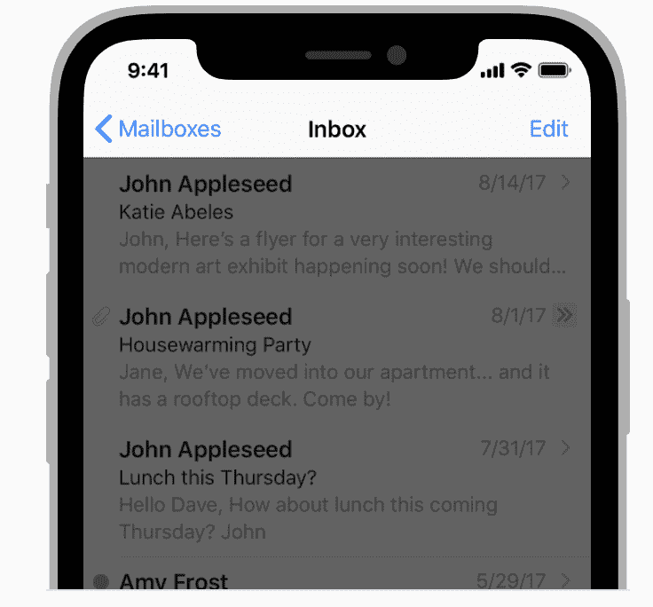
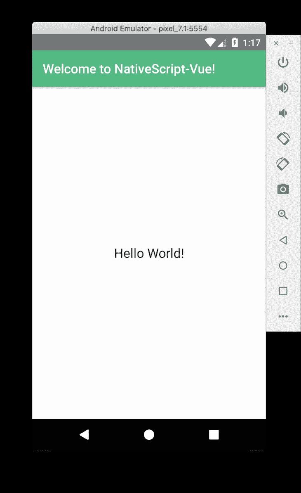
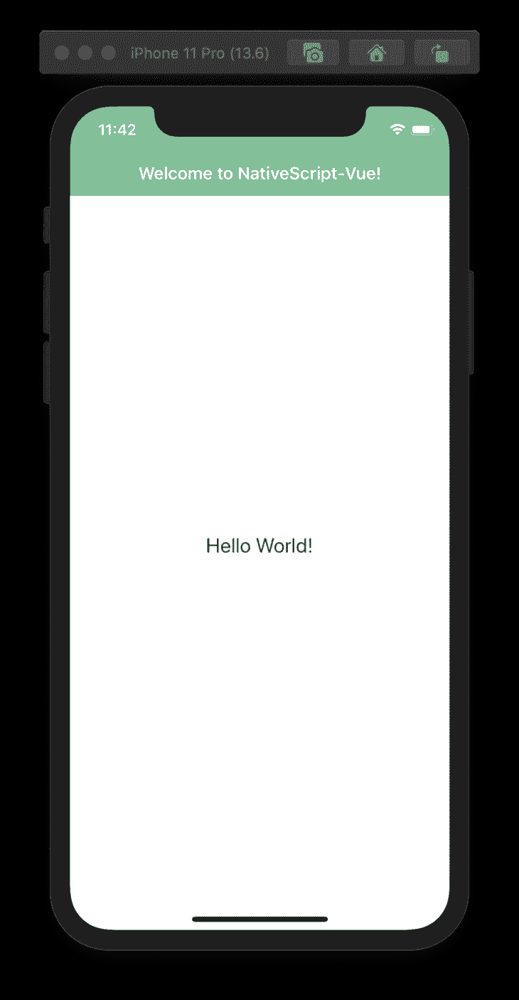
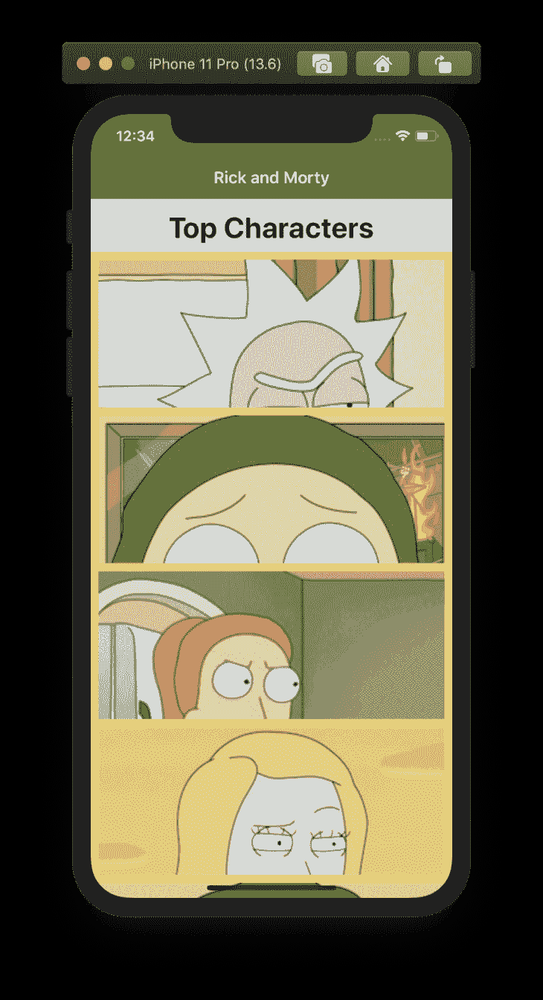

# 用 NativeScript-Vue - LogRocket 博客构建原生移动应用

> 原文：<https://blog.logrocket.com/building-native-mobile-apps-with-nativescript-vue/>

JavaScript 已经超越了浏览器的界限。它不再是只用于构建网站的语言，JavaScript 几乎可以用来做任何事情，熟悉这种语言的开发人员通常会使用 JavaScript 或其框架来完成工作，而不必面对学习新语言的麻烦。一个这样的例子是当构建移动应用的需求到来时。

在本文中，我们将看到如何使用 Vue.js 和 NativeScript 构建跨平台的移动应用程序，我们将通过构建一个迷你应用程序来实现这一点，该应用程序显示从 [Rick 和 Morty API](https://rickandmortyapi.com/) 中检索的 Rick 和 Morty 角色。

## 什么是跨平台 app 开发？

这是创建可以在不同移动平台上运行但共享单一代码库的原生应用程序的过程，而不是为每个平台开发不同的应用程序。

## 什么是 NativeScript？

[NativeScript](https://nativescript.org/) 是一个开源框架，用于构建真正的原生移动应用。

它是一个跨平台的移动开发框架，允许开发人员使用 Angular 和 Vue.js 等现代 web 技术或仅使用 HTML、CSS 和 JavaScript/TypeScript 来构建移动应用程序。它消除了学习原生技术的需要，如用于 iOS 和 Java 的 Swift 或 Objective-C 或用于 Android 的 Kotlin，并使您能够从单个 JavaScript 代码库为 iOS、Android 和 web 进行开发。

NativeScript 由 [Telerik 于 2014 年](https://www.telerik.com/blogs/announcing-nativescript---cross-platform-framework-for-building-native-mobile-applications)创建。

## 先决条件

本教程假设读者具备以下条件:

*   [Node.js 10x](https://nodejs.org/en/download/) 以上
*   [纱](https://yarnpkg.com/lang/en/) / [npm 5.2 以上](https://www.npmjs.com/get-npm)安装在自己的 PC 上。本教程将利用纱线
*   JavaScript 的基础知识以及如何工作
*   安装在您电脑上的 Vue CLI
*   在您的 PC 上设置 Android 和/或 iOS 要求，您可以通过遵循此[指南](https://docs.nativescript.org/start/quick-setup#full-setup)来完成。你也可以玩这个沙盒[这里](https://play.nativescript.org/)
*   安装在您电脑上的 NativeScript CLI

您可以使用 Yarn 通过以下命令安装 Vue CLI:

```
yarn global add @vue/cli
```

要安装 NativeScript CLI，请打开您的终端并运行:

```
yarn global add nativescript
```

通过在终端中运行`tns`来验证安装是否成功。您应该会看到可用命令的列表。

我们将用于构建应用的工具包括:

*   Vue CLI —是用于搭建 Vue.js 项目的 Vue.js 构建工具
*   axios——基于 Promise 的浏览器和 Node.js 客户端
*   [NativeScript-Vue](https://nativescript-vue.org/en/docs/introduction/)—native script-Vue 是一个 native script 插件，允许您使用 Vue.js 来制作您的移动应用程序

## NativeScript 是如何工作的？

NativeScript 使用原生用户界面组件，NativeScript 中不存在`<div>`和`<span>`等 HTML 元素。相反，你需要使用已经准备好的[组件集](https://docs.nativescript.org/ui/overview)来构建你的用户界面。

这些预配置的 UI 组件充当应用程序的构建模块。这些组件利用 Vue.js `<template>`块构建用户界面，利用`<script>`块构建 JavaScript 功能，利用`<style>`块操纵它们的外观。

我们将使用 NativeScript 提供的一些关键组件来构建此应用程序，包括:

*   `<Page>` —该 UI 组件代表一个应用程序屏幕。它充当应用程序屏幕中其他组件的包装器，移动应用程序通常由一个或多个`Page`组件组成。
*   `<Image>` —这个 UI 组件显示来自 ImageSource 或 URL 的图像，就像`img` HTML 元素一样:
    *   `<Image src="~/logo.png"/>`
*   `<Label>` —它是一个显示只读文本的 UI 组件
*   `<ListView>` —这是一个在垂直列表中显示项目的 UI 组件，它通常与`<v-template>`一起使用，以显示列表中的单个项目
*   `<ActionBar>` —这个 UI 组件在应用程序屏幕的顶部提供了一个工具栏，它被用作 Android 上的[应用程序栏](https://developer.android.com/training/appbar/)(动作)和 iOS 上的[导航栏](https://developer.apple.com/design/human-interface-guidelines/ios/bars/navigation-bars/)的包装器




*   `<v-template>` —该组件允许您定义可作为模板重用的标记。它主要用于呈现项目列表
*   `<StackLayout>` —这是一个 UI 布局容器，允许您垂直或水平堆叠子 UI 组件。默认情况下，子组件垂直堆叠
*   `<FlexboxLayout>` —这是一个布局容器，允许您水平和垂直排列子组件。它类似于 [CSS Flexbox](https://developer.mozilla.org/en-US/docs/Learn/CSS/CSS_layout/Flexbox) 的实现
*   `<ActivityIndicator>` —这是一个 UI 组件，它向用户显示一个在后台运行的操作的进度指示器

有 4 种主要方式来设计这些组件，它们包括:

*   [特定于平台的 CSS](https://docs.nativescript.org/ui/styling#platform-specific-css) —样式化应用服务的特定平台
*   [应用程序范围的 CSS](https://docs.nativescript.org/ui/styling#application-wide-css) —这些样式在`app.css`中定义，可以在所有应用程序页面中使用
*   [特定于页面的 CSS](https://docs.nativescript.org/ui/styling#page-specific-css) —这些样式在特定页面组件 UI 视图的`<style>`标签中定义
*   [内联 CSS](https://docs.nativescript.org/ui/styling#inline-css) —这些是在组件的标记中定义的样式，这些样式直接应用于组件，它们在应用样式的顺序中具有最高的优先级

> 注意:NativeScript 使用 DIPs(与设备无关的像素)和百分比作为样式的度量单位，pecertanges 作为度量单位仅部分支持宽度、高度和边距。你也可以使用像素，但是只能用`px`来修正你的风格。

## 入门指南

我们将使用 Vue CLI 和 NativeScript CLI 来引导一个新项目，这将负责所有基本配置，以开始使用我们的应用程序。

首先，我们使用`@vue/cli-init`包安装对 Vue CLI 2.x 模板的支持，作为一个全球桥梁，使用传统的`vue init`功能来引导新项目:

```
yarn global add @vue/cli-init
```

接下来，使用 NativeScript-Vue [starter 模板](https://github.com/nativescript-vue/vue-cli-template)和`init`命令创建一个新项目:

```
vue init nativescript-vue/vue-cli-template rick-morty
```

名称“rick-morty”被用作本教程的项目名称，它可以替换为您认为合适的任何名称。

在搭建过程中，会问一些关于您的项目需要什么配置的问题，您可以决定定制您认为合适的项目，也可以接受默认配置:

```
? Project name rick-morty
? Project description A native application built with NativeScript-Vue
? Application name rick-morty
? Unique application identifier org.nativescript.application
? Project version 1.0.0
? Author Anjolaoluwa <[email protected]>
? License MIT
? Select the programming language javascript
? Select a preset (more coming soon) Simple
? Install vuex? (state management) No
? Install vue-devtools? Yes
? Color scheme default
```

> 注意:如果你选择在搭建过程中安装 DevTools，你将不能使用`tns preview`，因为预览应用不支持 DevTools 使用的插件之一。

接下来，将工作目录更改为项目目录，并安装项目依赖项:

```
cd rick-morty && yarn install
```

接下来，通过运行以下命令来加速您的项目:

```
# for iPhone
tns run ios --watch

# for Android

tns run android --watch
```

该命令启动一个 iOS 设备模拟器，监视应用程序文件的更改，并在更改中更新应用程序，监视更改由 webpack 的热模块替换(HMR)提供支持。





接下来，安装 [Axios](https://github.com/axios/axios) 库来发出 HTTP 请求:

```
yarn add axios
```

然后将库导入到`main.js`文件中:

```
import axios from 'axios'
```

继续使它 [Axios](https://github.com/axios/axios) 成为一个全局实例方法，这样它可以在 Vue 实例的任何组件中被访问。此外，设置 Axios 的基本 URL，以便向以下对象发出请求:

```
Vue.prototype.$axios = axios;
Vue.prototype.$axios.defaults.baseURL = 'https://rickandmortyapi.com/api/';
```

接下来，在`Vue`实例的`data`属性和`<script>`标签中定义数组，我们将在该数组中存储从 API 检索的数据:

```
characters: []
```

然后创建一个`method`对象，它将包含发出 API 请求的函数:

```
methods: {

}
```

在`method`对象之间，包括以下内容:

```
getCharacters: function() {
     this.$axios
       .get("character/")
       .then(response => {
         this.characters = response.data.results;
       })
       .catch(err => console.log(err));
}
```

我们在这个代码块中所做的是，我们向 API 的`character`端点发出请求，并将请求的响应分配给我们的`data`属性中的`character`数组。

接下来，创建一个`created` Vue [生命周期挂钩](https://vuejs.org/v2/guide/instance.html#Instance-Lifecycle-Hooks)，并调用生命周期挂钩内的`getCharacters`方法:

```
created() {
  this.getCharacters();
}

```

接下来，我们将为应用程序编写标记(XML)来设置用户界面。打开您的`App.vue`文件，删除`<template>`标签之间的代码块，并包含以下内容:

```
<Page>
  <ActionBar title="Rick and Morty"/>
  <StackLayout backgroundColor="#dce2e9" class="">
    <Label
      text="Top Characters"
      fontWeight="bold"
      textAlignment="center"
      fontSize="30"
      marginTop="10"
      marginBottom="5"
    />
    <ListView class="images" for="character in characters">
      <v-template>
        <StackLayout backgroundColor="#f0e14a" class="images__item-wrapper">
          <Image :src="character.image" class="images__item-image" />
          <Label :text="character.name" class="images__item-name" />
          <StackLayout fontSize="15" marginLeft="10" marginTop="8">
            <Label marginBottom="2" >
              <Span text="Gender: " /> <Span :text="character.gender" />
            </Label>
            <Label marginBottom="2">
              <Span text="Status: " /> <Span :text="character.status" />
            </Label>
            <Label>
              <Span text="Specie: " /> <Span :text="character.species" />
            </Label>
          </StackLayout>
        </StackLayout>
      </v-template>
    </ListView>
  </StackLayout>
</Page>
```

我们在这段代码中所做的是，我们循环遍历了`characters`数组中的项目，并显示了列表中每个项目的信息。

我们的应用程序应该看起来像这样:




接下来，将`lang="scss"`属性添加到`<style>`标签，它现在应该看起来像这样:

```
<style lang="scss" scoped>
    ActionBar {
        background-color: #53ba82;
        color: #ffffff;
    }
</style>
```

然后，在`<style>`标签之间包含以下代码行，为应用程序添加一些样式:

```
ListView{
  height: 100%;
}
ActionBar {
  background-color: green;
  color: #ffffff;
}
.images {
  &__item-wrapper {
    width: 80%;
    height: 450;
    margin-top: 10;
    margin-bottom: 20;
  }
  &__item-image {
    height: 300;
    width: 100%;
  }
  &__item-name {
    margin-top: 10;
    font-size: 20;
    text-align: center;
  }
}
```

完成的应用程序看起来应该如下所示:


## 捆绑应用程序

您可以使用以下命令为 iOS 和 Android 创建版本:

```
# for iPhone
tns build ios --bundle

# for Android
tns build android --bundle
```

用于 iOS 的 bundle 命令为 iOS 构建项目，并生成一个`APP`或`IPA`，可以在 iOS 设备或 iOS 模拟器上手动部署。

`APP`文件夹位于:

```
/platforms/ios/build/Debug-iphonesimulator/rickmorty.app
```

而 Android 命令为 Android 设备构建项目并生成一个可以在 Android 设备或 Android 模拟器上手动部署的`APK`文件。

`APK`文件位于:

```
/platforms/android/app/build/outputs/apk/debug/app-debug.apk
```

## 结论

在这篇文章中，我们学习了如何用 NativeScript 和 Vue.js 构建原生移动应用，我们也看到了如何为 iOS 和 Android 设备捆绑。你可以了解更多关于 NativeScript [这里](https://nativescript.org/)和 NativeScript Vue [这里](https://nativescript-vue.org)，在 [GitHub](https://github.com/Jolaolu/nativescript-vue) 上查看这个教程的存储库，它可以作为模板来搭建你的应用。使用这个[指南](https://nativescript.org/blog/building-responsive-apps-with-nativescript/)，你可以学习如何让你的应用程序在多个移动设备上正确呈现。

## 像用户一样体验您的 Vue 应用

调试 Vue.js 应用程序可能会很困难，尤其是当用户会话期间有几十个(如果不是几百个)突变时。如果您对监视和跟踪生产中所有用户的 Vue 突变感兴趣，

[try LogRocket](https://lp.logrocket.com/blg/vue-signup)

.

[](https://lp.logrocket.com/blg/vue-signup)[https://logrocket.com/signup/](https://lp.logrocket.com/blg/vue-signup)

LogRocket 就像是网络和移动应用程序的 DVR，记录你的 Vue 应用程序中发生的一切，包括网络请求、JavaScript 错误、性能问题等等。您可以汇总并报告问题发生时应用程序的状态，而不是猜测问题发生的原因。

LogRocket Vuex 插件将 Vuex 突变记录到 LogRocket 控制台，为您提供导致错误的环境，以及出现问题时应用程序的状态。

现代化您调试 Vue 应用的方式- [开始免费监控](https://lp.logrocket.com/blg/vue-signup)。