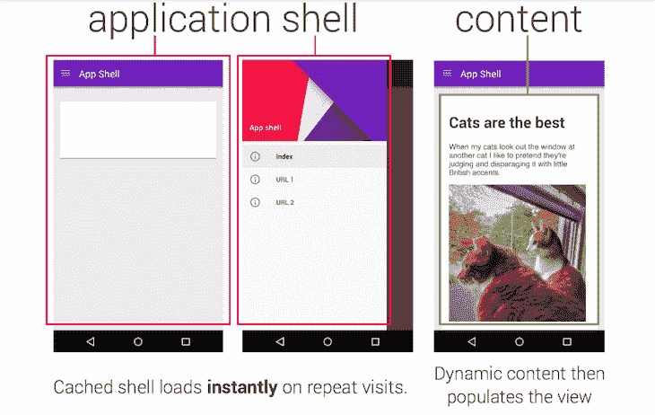

# 如何为慢速网络构建高性能的 web 应用程序

> 原文：<https://blog.logrocket.com/building-performant-web-applications-slow-networks/>

衡量用户网络体验的一个最重要的标准是速度——在屏幕上显示有意义的内容并提供互动体验所需的时间。由于很大一部分互联网用户在慢速网络上运行，因此以提供最佳体验的方式构建应用程序是势在必行的。

进入渐进式网络应用(PWA ),根据 Mozilla 的说法，它使用现代 API 和传统的渐进式增强策略来构建跨平台的应用。pwa 更容易被发现，可以在任何地方工作，并且包括模拟本地应用程序体验的功能。简而言之，pwa 旨在利用现代 web 浏览器和移动应用程序提供的功能。他们甚至可以配置为离线工作。

出于本文的目的，我们将重点关注离线功能。这个特性是由[服务工作者 API](https://developer.mozilla.org/en-US/docs/Web/API/Service_Worker_API) 促成的，它使 PWAs 能够执行可靠和智能的缓存、更新后台内容、执行推送通知等等。这意味着，在用户第一次访问网站后，该网站和应用程序将可靠地快速运行，即使在慢速网络上。

由于大多数用户在三秒钟后就放弃了一个缓慢加载的网站，所以在缓慢的网络上使初始加载快速可靠就显得尤为重要。让我们来概述一些你可以用来最大化你的应用程序向你的用户的屏幕传送内容的速度的方法。

## 应用程序外壳

与您在原生应用中看到的类似，应用外壳是一种在用户屏幕上可靠地即时加载 web 应用的方式。它由支持用户界面所需的最少的 HTML、CSS 和 JavaScript 组成。

当离线缓存时，应用程序外壳可以确保重复访问时的即时、可靠性能，因为它不需要每次都从网络加载；仅需要来自网络的必要内容。这种方法依赖于使用一个[服务工作者](https://developers.google.com/web/fundamentals/primers/service-worker/)来主动缓存 shell，以使应用程序运行。接下来，使用 JavaScript 为每个页面加载动态内容。应用程序外壳对于在没有网络的情况下快速将一些初始 HTML 显示在屏幕上非常有用。



在呈现初始页面后，服务人员通过网络下载应用程序的其余页面和资源。它还缓存数据，以提供不严重依赖网络的流畅用户体验。

要使用维修工人，必须先安装它。这仅在 web 应用的初始呈现时进行一次。下面是典型地包含在索引 HTML 页面中的服务工作者安装脚本示例。

```
if ('serviceWorker' in navigator) {
            navigator.serviceWorker
                .register("sw.js")
                .then(function () { console.log("Service Worker Registered"); });
        } 
else {
            console.log("Service Worker Registered");
        }

```

第 1 行只是确保浏览器有服务人员的支持。然后继续安装服务工作器(第 3 行的`sw.js`是服务工作器文件的名称)。下面是一个示例服务人员脚本。

```
// initializes the cache key
let cacheName = "myServiceWorker-1";

// an array of files to be cached(the app shell)
let filesToCache = [
    'index.html',
    'style.css',
    './assets/poppins.woff2',
    './assets/home.svg'
];

// install event that installs all the files needed by the app shell
self.addEventListener('install', function (e) {
    console.log('[serviceWorker] install')
    e.waitUntil(
      caches.open(cacheName).then(function (cache) {
        console.log('[serviceWorker] caching app shell')
        return cache.addAll(filesToCache)
      })
    )
  })

```

由于存储空间是有限的，并且会因浏览器而异，因此只存储绝对相关的数据非常重要。


正确处理媒体资产是提供最佳用户体验的关键。有效管理这些资产的一种方法是使用可缩放矢量图形(SVG ),而不是其他图像格式，如 PNG 和 JPG。SVG 非常棒，因为您可以根据需要放大或缩小它们，而不会影响质量。SVG 由线、点和形状组成，浏览器渲染它们的速度比传统的图像格式更快。

延迟加载媒体资源是另一种提高初始加载时间的好方法。使用延迟加载，您可以将对象的初始化推迟到需要的时候。您还可以根据用户当前的网络速度逐步提高媒体项目的质量。像 [Cloudinary](https://cloudinary.com/) 这样的产品为媒体处理和优化提供了易于使用的解决方案。

## 提供完整的线下体验

构建高性能的 web 应用程序意味着确保用户享受完整和健壮的体验。提供这种体验的一个好方法是以离线为核心场景来设计你的应用。通过减少应用程序必须发出的网络请求数量，为离线优先设计可以极大地提高应用程序的性能。相反，可以预先缓存资源，并直接从本地缓存提供服务。即使使用最快的网络连接，从本地缓存提供服务也总是保证更快。

还是那句话，服务人员是搅拌饮料的吸管。服务人员的生命周期是最复杂的部分:如果你不知道它试图做什么，有什么好处，它会觉得好像在和你作对。一旦您了解服务人员的工作方式，您就可以向用户提供无缝、不引人注目的更新。

提供离线体验通常涉及缓存，选择正确的[缓存策略](https://developers.google.com/web/fundamentals/instant-and-offline/offline-cookbook/)取决于您试图缓存的资源类型以及您以后可能需要如何访问它。预缓存您的资源类似于用户安装桌面或移动应用程序时发生的情况。应用程序运行所需的关键资源被安装或缓存在设备上，以便以后可以加载它们，无论是否有网络连接。从本地缓存中提取数据消除了任何网络可变性。无论用户使用哪种网络——Wi-Fi、5G、3G 甚至 2G——我们运行应用程序所需的资源几乎都可以立即获得。

下面的代码演示使用了缓存优先的方法。

```
// fetch event handler that tries to get requested file from the cache first then the network if it doesn't find it in the cache
  self.addEventListener('fetch', function (e) {
    console.log('[serviceWorker] fetch', e.request.url)
    e.respondWith(
      caches.match(e.request).then(function (response) {
        return response || fetch(e.request)
      })
    )
  })

// generic fallback
  self.addEventListener('fetch', function (event) {
    event.respondWith(
      // Try the cache
      caches.match(event.request).then(function (response) {
        // Fall back to network
        return response || fetch(event.request)
      }).catch(function () {
        // If both fail, show a generic fallback:
        // console.log('offline oo');
        alert("You are offline. Check Your Internt Connection and try again")
       // return caches.match('/offline.html')
      // However, in reality you'd have many different
      // fallbacks, depending on URL & headers.
      // Eg, a fallback silhouette image for avatars.
      })
    )
  })

```

这种方法对于内容密集型 web 应用程序(如新闻网站)尤其有用，可以确保用户始终可以获得内容，并在有新内容时得到通知。

## 结论

鉴于全球很大一部分互联网用户运行在慢速网络上，无法构建高性能的网络应用可能会导致用户被剥夺权利。另一方面，高性能的 web 应用程序可以显著提高用户参与度，这就是为什么你在设计应用程序和网站时应该牢记这些原则。

## 测量生产环境中的应用程序性能

虽然实现 PWA 可以带来显著的性能优势，但监控应用程序的整体性能是关键。如果您有兴趣了解生产应用程序中的性能问题，请尝试 LogRocket 。[](https://logrocket.com/signup/)[https://logrocket.com/signup/](https://logrocket.com/signup/)

LogRocket 就像是网络应用的 DVR，记录下你网站上发生的每一件事。您可以汇总并报告性能问题以快速了解根本原因，而不是猜测问题发生的原因。

LogRocket 让你的应用程序记录带有标题+正文的请求/响应，以及关于用户的上下文信息，以全面了解问题。它还记录页面上的 HTML 和 CSS，甚至可以重建最复杂的单页面应用程序的像素级完美视频。

优先考虑性能–[开始免费监控](https://logrocket.com/signup/)。