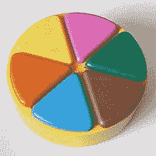
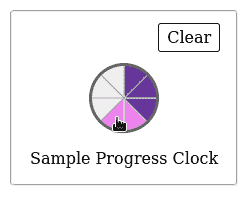

# 用 CSS 构建一个进度时钟

> 原文：<https://blog.logrocket.com/building-progress-clock-css/>

进度时钟有助于跟踪任务或目标的进度。当使用笔和纸时，它们是简单和直观的；本文将用 HTML 和 CSS 将它们带到 web 上。

在本文的教程部分，我们将构建一个八段进度时钟。我们将对我们的项目过程跟踪设计进行更新，以提高可用性和包容性。

*向前跳转:*

## 概观

从语义上讲，进度时钟与标尺或进度跟踪条没有什么不同。它代表了你朝着一个特定的目标前进了多少。然而，进度条通常是由代码更新的可视元素，而进度时钟通常是由用户更新的交互式控件。

从视觉上看，进度钟是一个分成几段的圆圈，随着进度的进行，这些段会被填满。棋盘游戏*琐碎追求*对棋子使用进度时钟模型；随着游戏的进行，玩家们会亲自填充各个部分。

你可能也见过视频游戏中使用的进度时钟模型。例如，在*超级马里奥 64* 中，马里奥的[“健康计”](https://www.mariowiki.com/Health_Meter#Super_Mario_64_/_Super_Mario_64_DS)被著名地表达为一个进度时钟，随着角色获得“健康”而分段填充。

一些桌面角色扮演游戏也使用进度时钟作为简单的机制来跟踪进度或管理紧张局势。



Trivial Pursuit token. No machine-readable author provided. ChristianHeldt assumed (based on copyright claims). Public domain, via Wikimedia Commons.

只要分段数量很少，进度时钟非常适合直观地传达进度“一目了然”。我一般发现超过 12 段会让人迷惑。事实上，只有当你倾向于隐喻的“时钟”部分时，12 段才是可以接受的。

## 设计目标

设计师或开发人员的一个常见练习是将项目分解成任务，并根据任务跟踪进度，因此在这项工作中不缺少现成的工具。事实上，构建待办事项列表应用程序通常是许多 web 开发人员首先构建的项目之一。

进度时钟提供的关键功能是让用户能够交互式地设置进度。这告诉我们一些关于进度时钟最有用的场景类型的事情。

像“喂猫”这样的简单任务通常不需要更新进度。他们要么完成了，要么没完成。这种类型的任务是常用复选框的理想选择。

可以分解成简单任务的复杂任务不需要用户交互更新。对于这种类型的任务，您可以通过计算已完成子任务的百分比来衡量进度。大多数问题追踪器都内置了这一功能！

可以客观衡量进展的复杂任务也不需要用户交互更新。例如，我的运动跟踪器会自动计算我在健身目标上取得了多少进步。同样，我的预算软件可以计算出我实现储蓄目标的进度。

这告诉我们什么？它表明，进度时钟最适合于这样的情况:我们需要跟踪我们的进度，但不能自动计算已完成的数量，或者不能轻松地将项目分解为一组更简单的任务。

我们不需要非常精确的进度时钟。因为每个时钟都有相对较少的分段，所以我们只能粗略估计我们的进度。这意味着进度时钟最适用于进度有些抽象或主观的任务。

对于需要大量分段的项目，范围控制(`<input type="range" />`)可能更合适。这仍然是一种不精确的方法，但它可以容纳比进度时钟大得多的值范围，而不会变得难以使用。

对于要求更高精度的项目，我们可以使用带有适当最小值、最大值和步长值的数字控制(`<input type="number" />`)。

对于具有自动计算或只读演示的项目，标准的`<progress>`或`<meter>`元素可能更合适

根据我自己的经验，进度时钟最适合创造性的任务，比如“写一篇文章”或者那些难以衡量的任务，比如“进行根本原因分析”。

对于这些类型的任务，我们必须依靠人类的专业知识和判断来获得进度感。


Progress towards the game task “Locate the Dragon” represented as a hand-drawn progress clock with five of eight segments filled in.

进度时钟对于具有少量步骤的任务也很有用，这些步骤以不可预测或不连续的方式前进。这使得它们对游戏非常有用，在游戏中，随机性可能在推动玩家接近(或远离)他们的目标方面发挥作用。

## 履行

每个进度时钟段需要单独聚焦和选择。因为我们只选择了一小部分中的一部分，所以单选按钮是底层标记的一个很好的选择。

通过使用单选按钮，我们的组件已经具备了我们需要的所有行为。这也意味着我们的控制仍然起作用(如果丑陋的话)。换句话说，在 CSS 加载失败的情况下，您仍然可以更新您的进度。

对于本文，我选择构建一个八段进度时钟。这个大小是一个很好的默认值；作为一个偶数，它允许我们很容易地显示“一半完成”。此外，您可以一次前进两段，以替代四段时钟。

我还将提供一个通用公式，使您能够构建任意数量分段的进度时钟。

这是我们的起始标记:

```
<fieldset class="clock-frame">
    <legend>Sample Progress Clock</legend>
    <div class="clock" data-segments="8">
        <input type="radio" name="progress-clock" value="8" id="segment-8" /><label for="segment-8">8/8</label>
        <input type="radio" name="progress-clock" value="7" id="segment-7" /><label for="segment-7">7/8</label>
        <input type="radio" name="progress-clock" value="6" id="segment-6" /><label for="segment-6">6/8</label>
        <input type="radio" name="progress-clock" value="5" id="segment-5" /><label for="segment-5">5/8</label>
        <input type="radio" name="progress-clock" value="4" id="segment-4" /><label for="segment-4">4/8</label>
        <input type="radio" name="progress-clock" value="3" id="segment-3" /><label for="segment-3">3/8</label>
        <input type="radio" name="progress-clock" value="2" id="segment-2" /><label for="segment-2">2/8</label>
        <input type="radio" name="progress-clock" value="1" id="segment-1" /><label for="segment-1">1/8</label>
    </div>
</fieldset>

```

这里，我们使用一个`fieldset`将单选按钮控件分组在一起。这个`legend`将作为这个组的一个`label`，这很有帮助，因为我们希望这个组看起来像一个单独的控件。

有些屏幕阅读器会在输入第一个输入的`fieldset`和`label`时读出图例。例如，NVDA 将宣布“样本进度时钟，8/8”。其他屏幕阅读器将读出`fieldset`中每个控件的图例。

我们最初的 CSS 是一个简单的重置，去掉了标准的单选按钮外观，隐藏了标签，并在我们处理整体控件时给时钟本身一个临时背景。

```
.clock { background-color: darkcyan; }
.clock label { display: none; }
.clock input { appearance: none; }

```

我们将通过自己绘制输入开始创建真正的布局。我们先把盒子做得一样大。对于用户来说,`cursor: pointer`规则使得框是可点击的变得更加明显。我们用不同的背景颜色表示选中的输入。

```
.clock input { 
  appearance: none;
  display:inline-block;
  box-sizing: border-box;
  font-size:inherit;
  margin: 0;
  width: 2em;
  height: 2em;
  background-color: #eee;
  border: 1px solid #ccc;
  cursor: pointer;
}
.clock input:checked {
  background-color: #222;
}

```

现在，我们要将盒子定位为饼图切片；这就是段数变得重要的地方。

为了实现这一点，我们将定位所有的输入框，使它们处于同一个位置，然后使用 CSS `transform`属性将这些框分别旋转到位。

因为绝对定位会将盒子从流中取出，所以我们需要给包含它的 div 一个明确的宽度和高度。如果我们做不到这一点，盒子会缩小到零，我们什么也看不见。您可以看到为什么临时背景色在这一点上是有帮助的，因为它允许我们注意到这种错误。

将来，当我们可以使用`attr()`来读取值属性时，我们将能够使用`calc()`来自动确定旋转和倾斜值。

```
.clock { --segment-size: calc(360deg / attr(data-segments integer)); }
.clock input {
    transform:
        rotate(calc(var(--segment-size) * (attr(value integer) - 1))) 
        skewY(calc(var(--segment-size) - 90deg));
}

```

目前，我们必须自己计算`transform`。但是，公式很简单。

通过将 360 度(一个完整的圆)除以分段的数量来获得分段的大小。对于八段时钟，每段将为 45 度。对于六段时钟来说，每一段都是 60 度。

所有段的偏斜都是一样的，即我们的段大小减去 90 度。对于我们的八段钟来说，那就是`-45deg`。对于六段时钟，这将是`-30deg`。

每个段的旋转是:
段大小*(段号–1)

因此，八段时钟的第四段的旋转可以计算如下:

```
45deg * (4 - 1) = 135deg

```

然而，我让我们的价值观从高到低逆向运行，原因很快就会清楚。所以，我们要减去 360 度，这将使我们旋转`-225deg`。

```
.clock {
    position: relative; 
    background-color:darkcyan;
    width:4em;
    height:4em;
}
.clock input { 
  appearance: none;
  display:inline-block;
  box-sizing: border-box;
  font-size:inherit;
  margin: 0;
  width: 2em;
  height: 2em;
  background-color: #eee;
  border: 1px solid #ccc;
  cursor: pointer;
  position: absolute;
  left:2em;
  bottom:2em;
  top:auto;
  transform-origin:0 2em;
}

.clock input[value="8"]
{ transform: rotate(-45deg) skewY(-45deg); }
.clock input[value="7"]
{ transform: rotate(-90deg) skewY(-45deg); }
.clock input[value="6"]
{ transform: rotate(-135deg) skewY(-45deg); }
.clock input[value="5"]
{ transform: rotate(-180deg) skewY(-45deg); }
.clock input[value="4"]
{ transform: rotate(-225deg) skewY(-45deg); }
.clock input[value="3"]
{ transform: rotate(-270deg) skewY(-45deg); }
.clock input[value="2"]
{ transform: rotate(-315deg) skewY(-45deg); }
.clock input[value="1"]
{transform: rotate(0deg) skewY(-45deg);  }

```

在这一点上，我们有一个类似玫瑰花形星星的东西溢出了我们的容器。最难的一步已经过去了，我们只需要清理和修复一些可访问性问题。


Progress clock with transformed inputs, resembling a rosette star. The fourth input (clockwise from the top) is selected.

将星形变成圆形很容易，我们只需给容器 50%的边界半径，并隐藏任何溢出。最后，我们给圆添加一个边框。

```
.clock { 
    position:relative; 
    width:4em;
    height:4em;
    overflow:hidden;
    border:medium solid #666;
    border-radius:50%;
}

```

现在，我们还有最后一条规则，它给了我们视觉上的进步感，也是这个练习的全部意义。

由于我们最初选择将值从最高到最低排序，我们可以使用 below sibling 选择器来提供所有较小值被选中的视觉错觉。

```
.clock input:checked,
.clock input:checked ~ input {
  background-color: #222;
}

```

## 设计评论

虽然我们的进度时钟拥有我们想要的所有独特的功能和行为，但它有一些缺点，我们需要在实际网站上使用它之前解决这些缺点。此外，我们应该仔细检查可用性清单，以确保我们的设计具有包容性。

### 添加零值

我们第一个真正的可用性问题是缺乏零值。没有零值，我们就不能反映“没有取得任何进展”，我们就不能轻易地修复一个错误，即我们不小心在错误的任务上标记了进展，我们也没有一个新创建的进度时钟的默认值。

在时钟本身中没有明显的地方放置零值，但是我们可以利用单选按钮语义！

我们可以将零值放在时钟之外，但将其视为与正常段相同的一组输入的一部分。

```
<fieldset class="clock-frame">
    <legend>Sample Progress Clock</legend>
    <p class="zero-progress"><label><input type="radio" name="progress-clock" value="0" checked="checked" class="visually-hidden" />Clear</label></p>
    <div class="clock" data-segments="8">
        <input type="radio" name="progress-clock" value="8" id="segment-8" /><label for="segment-8">8/8</label>
        <input type="radio" name="progress-clock" value="7" id="segment-7" /><label for="segment-7">7/8</label>
        <input type="radio" name="progress-clock" value="6" id="segment-6" /><label for="segment-6">6/8</label>
        <input type="radio" name="progress-clock" value="5" id="segment-5" /><label for="segment-5">5/8</label>
        <input type="radio" name="progress-clock" value="4" id="segment-4" /><label for="segment-4">4/8</label>
        <input type="radio" name="progress-clock" value="3" id="segment-3" /><label for="segment-3">3/8</label>
        <input type="radio" name="progress-clock" value="2" id="segment-2" /><label for="segment-2">2/8</label>
        <input type="radio" name="progress-clock" value="1" id="segment-1" /><label for="segment-1">1/8</label>
    </div>
</fieldset>

```

我们可以将它设计成一个清除进度时钟的按钮，一切都如您所料。嗯，几乎所有的东西你都会在下一节中注意到。

### 实施焦点指示器

我们还没有恢复的一项功能是焦点指示器。这对于键盘用户来说尤其重要，因为他们可以进入我们的单选按钮组，但却得不到关于他们导航的视觉反馈。

我们可以通过使用`:focus-within`伪类使[看起来像是一个单独的控件。我们将更改边框颜色并添加一个轮廓，这非常类似于我的浏览器中的默认单选按钮行为。然而，我们还需要指出哪个输入实际上具有焦点。在这里，我们通过改变分段颜色来实现。](https://blog.logrocket.com/why-you-should-use-focus-styles-193d58672c5c/)

这些变化使得键盘用户可以与我们的进度时钟进行交互，就像他们使用一组单选按钮一样，包括使用**箭头**键以熟悉和直观的方式更改所选部分。

除了一个意想不到的行为，如果你尝试一下就会发现。

零值似乎是一个单独的按钮控件，但它实际上是单选按钮组的一部分。所以当跳转时，进度时钟或按钮获得焦点，而另一个看起来是不可选择的。但是，使用**箭头**键会立即显示按钮和时钟之间的连接。

这个我没有好的解决办法。用实际的按钮替换零值单选按钮可能会以牺牲语义为代价导致更直观的行为。可用性测试可能是为了找出哪种方法是最好的。

```
.clock:focus-within {
    border: medium solid blue;
    outline: medium solid rgb(112, 179, 255);
    outline-offset: 2px;
}
.clock input:focus {
    background-color: rgb(0, 119, 255);
}

```

### 改进`fieldset`演示

`fieldset`显然是将单选按钮分组在一起的正确语义选择，但是我们肯定可以改进默认的表示。

控制`legend`的位置曾经有点困难。幸运的是，我们可以利用 flex 上下文将`legend`放在我们喜欢的任何地方。

By default, the legend is positioned so it is superimposed over the top border of the fieldset. The portion of the top border that is covered by the legend is not drawn, making it appear as if the legend is closer to the viewer.

After a flex context is added, the legend now appears inside the fieldset border, below the clock.

我们`float`将`legend`从`fieldset`边界分离，然后将`fieldset`转换成一个 flex 容器。因为`float`没有将 flex 项从流程中移除，我们现在可以将`legend`视为标准的 flex 项，并以这种方式控制它的定位。在这种情况下，我们使用`order`属性将它放在时钟本身的下面，这样它看起来就像是时钟的标签。

```
.clock-frame {
    display: inline-flex;
    flex-direction: column;
    border-radius: 2%;
    position: relative;
    justify-content: center;
    width: fit-content;
    padding: 1em;
    gap: 1em;
}
.clock-frame legend {
    float:left;
    order: 3;
}

```

### 支持细指针和粗指针

术语“精细”和“粗糙”来自[指针媒体查询](https://developer.mozilla.org/en-US/docs/Web/CSS/@media/pointer)，其中我们区分精细、高精度的输入方法(如鼠标或手写笔)和粗糙、低精度的输入方法(如视频游戏控制器或智能电视遥控器)。

用粗略的指针很难确保选择正确的片段。然而，有三种方法可以使这变得更容易，您对方法的选择将取决于哪种方法最适合您的设计。

#### 放大时钟

我们可以采用的第一种方法是使粗指针选择更容易，就是使时钟更大。因为一切都是用 ems 表示的，我们可以简单地增加时钟的字体大小，一切都会相应地缩放。这种方法也可以用于为触摸界面创建更大的活动区域。

```
.clock {
  font-size: xx-large;
}

```

#### 添加悬停样式

第二种方法是添加悬停样式，为支持的用户输入机制(例如，鼠标或手写笔)提供视觉反馈。当用户做出选择时，这为他们的片段选择提供了信心。



A progress clock set to 3/8, showing the mouse hovering over the 5/8 position. The first three segments are a dark purple, while the next two segments are violet.

在这个例子中，我在悬停时使用了两种颜色——一种用于未选择的值，另一种用于选择的值。我相信这可以更清楚地表明我们是增加还是减少这个值，但是您应该进行用户测试来确定这是否是真的！

```
.clock input:hover {
    background-color: violet;
}
.clock input:hover ~ input {
    background-color: violet;
}
.clock input:checked:hover,
.clock input:checked:hover ~input,
.clock input:checked ~ input:hover,
.clock input:checked ~ input:hover ~ input,
.clock input:hover ~ input:checked,
.clock input:hover ~ input:checked ~ input {
    background-color: rebeccapurple;
}

```

#### 使用水平或垂直布局

使粗指针选择更容易的第三种方法是从圆形进度时钟变为水平(或垂直)进度跟踪器。

这种类型的追踪器的常见例子是星级评定(例如，五星中的三颗)、筹款温度计和游戏健康条(例如*塞尔达传说*中的一个)。这种格式的主要优点是，使用低精度指针更容易选择单个值。

Goal thermometer at 50 percent with an arrow pointing to the 10 percent mark. (StackOverflow user contribution under CC-BY-SA 3.0).

Health bar (titled “Life”) in a style similar to that used in the Legend of Zelda game. It has three hearts in a horizontal line. The first two are filled with red while the third is a white outline, indicating the character has 2/3 of their “health” remaining.

对于这个例子，我将添加一个额外的类，这样我们就可以用 JavaScript 轻松地打开和关闭轨道外观。在实际设计中，我会将这些样式包装在媒体查询中，以控制时钟何时显示为轨道。

```
.clock.track {
    background-color:transparent;
    width: auto;
    height:auto;
    overflow: auto;
    border:none;
    margin: 0 0 0 auto;
    border-radius: 0;
    display: flex;
    flex-direction: row-reverse;
    gap: 0.25em;
}
.clock.track input {
    transform: none;
    position: static;
}

```

## 包扎

在本文中，我们探索了如何用 CSS 构建一个进度时钟。现在，我们可以将我们讨论的所有内容放入最终的工作样本中。

参见 [CodePen](https://codepen.io) 上 John C Barstow([@ jbowtie](https://codepen.io/jbowtie))
的 Pen [进度钟](https://codepen.io/jbowtie/pen/OJQayQb)。

我添加了一些按钮，可以让你试验字体大小，在进度时钟和进度条形式之间切换。

## 你的前端是否占用了用户的 CPU？

随着 web 前端变得越来越复杂，资源贪婪的特性对浏览器的要求越来越高。如果您对监控和跟踪生产环境中所有用户的客户端 CPU 使用情况、内存使用情况等感兴趣，

[try LogRocket](https://lp.logrocket.com/blg/css-signup)

.

[](https://lp.logrocket.com/blg/css-signup)[https://logrocket.com/signup/](https://lp.logrocket.com/blg/css-signup)

LogRocket 就像是网络和移动应用的 DVR，记录你的网络应用或网站上发生的一切。您可以汇总和报告关键的前端性能指标，重放用户会话和应用程序状态，记录网络请求，并自动显示所有错误，而不是猜测问题发生的原因。

现代化您调试 web 和移动应用的方式— [开始免费监控](https://lp.logrocket.com/blg/css-signup)。