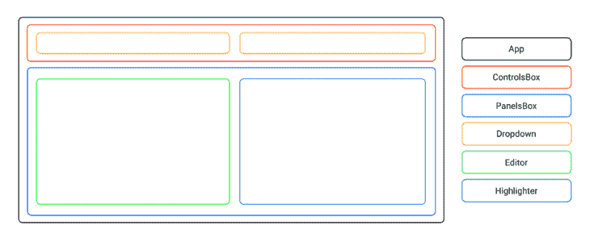

# 从头开始构建 React 代码编辑器和语法高亮器

> 原文：<https://blog.logrocket.com/building-react-code-editor-syntax-highlighter/>

开发人员在记事本和博客中只用 HTML 显示代码块的日子已经一去不复返了。突出显示的代码更加悦目，也更容易阅读。

在本教程中，我们将创建一个 React 代码编辑器和语法高亮器，这样您就可以键入您的代码，并查看它是如何高亮显示的。我们还将在编辑器中提供交互性，这意味着用户将能够在多种语言和主题之间切换。

源代码将在[这里](https://codesandbox.io/s/react-syntax-highlighter-logrocket-tutorial-b3ejq)提供，供参考。

## React 代码编辑器和语法高亮框

首先，让我们创建一个简单的线框来设计组件的布局。



整个应用程序将驻留在`App`中，这将是我们应用程序的主要包装器。

在`App`里面，会有`ControlsBox`和`PanelsBox`组件。

`ControlsBox`将进一步包括两个`Dropdown`组件。一个用于选择输入语言，另一个用于选择突出显示的主题。

## 设置 React 代码编辑器项目

为了创建项目样板文件，我们将使用 [Create React App](https://reactjs.org/docs/create-a-new-react-app.html) ，它将在一分钟或更短的时间内建立一个完全配置好的 [React](https://reactjs.org/) 项目。

为此，打开您的终端并运行以下命令:

```
npx create-react-app syntax-highlighter
```

然后通过运行`cd syntax-highlighter`切换到新创建的文件夹，并通过运行`npm start`启动 React 开发服务器。

这应该会自动打开你的浏览器。您应该在端口`3000`上看到一个 React 默认应用程序。

打开`src`文件夹，删除除`App.js`、`App.css`、`index.js`、`index.css`之外的所有文件。然后删除每个文件中的内容，因为我们将从头开始重写每个文件。

## 创建基础

首先，我们将创建项目的基础结构。

让我们从`index.js`开始，它将呈现我们的应用程序。打开它，包含以下代码:

```
javascript
import ReactDOM from "react-dom";
import "./index.css";
import App from "./App";

ReactDOM.render(
  <React.StrictMode>
    <App />
  </React.StrictMode>,
  document.getElementById("root")
);
```

为了渲染，我们首先导入了`ReactDOM`组件。然后，我们导入了一个扩展样式表来样式化基础。最后，我们导入了`App`组件，并对其进行了设置，以便它可以在 DOM 树中的`root`元素中呈现。

现在，打开`index.css`文件并包含以下样式:

```
css
* {
  margin: 0;
  padding: 0;
  box-sizing: border-box;
}

body {
  width: 100vw;
  min-height: 100vh;
  font-family: sans-serif;
  background-color: #ffdee9;
  background-image: linear-gradient(0deg, #ffdee9 0%, #b5fffc 100%);
}
```

我们首先为`margin`、`padding`和`box-sizing`创建了重置规则，所以我们不必担心以后这些的默认浏览器值。这是常见的做法，建议您从头开始构建任何项目。

我们还为`body`创建了特定的规则，以便它总是填充屏幕的整个视口。我们还设置了特定的字体系列和渐变背景。

打开`App.js`，我们应用程序的所有逻辑都将存在于此。包括以下代码:

```
javascript
import "./App.css";

export default function App() {
  return (
    <div className="App">
      <div className="ControlsBox"></div>
      <div className="PanelsBox"></div>
    </div>
  );
}
```

首先，我们为`App.js`导入了一个外部样式表。

然后我们创建了一个`App`函数，它将在之前创建的`index.js`中呈现。在里面，我们创建了一个`App` div 元素，它将是我们应用程序的主要包装器。此外，在`App`包装内，将有`ControlsBox`和`PanelsBox`组件。

现在，打开`App.css`文件并添加以下样式:

```
css
.App {
  max-width: 1200px;
  margin: 0 auto;
  padding: 20px;
}

.ControlsBox {
  display: grid;
  grid-template-columns: 1fr 1fr;
  gap: 20px;
}

.PanelsBox {
  display: grid;
  grid-template-columns: repeat(auto-fit, minmax(400px, 1fr));
  gap: 20px;
  margin-top: 20px;
}
```

这里，我们确保`App`包装器永远不会超过特定的宽度。我们还将它放在视口的中心，并在里面添加了填充。

对于`ControlsBox`孩子，我们设置了两列的网格布局，每列宽度相同。我们还在两列之间添加了一个间隙。

* * *

### 更多来自 LogRocket 的精彩文章:

* * *

`PanelsBox`子节点也将使用两列网格布局，两列之间有一个间隙。如果子项的宽度小于`400px`，布局将自动切换到一列，这意味着包含的`Editor`和`Highlighter`组件将显示在彼此下方。

为了将`PanelsBox`与`ControlsBox`分开，我们在顶部添加了一个边距。

## 用`useState`钩子设置反应状态

数据会改变，因为在我们的应用程序中，用户选择语言和主题会触发用户交互。为了在屏幕上正确显示它们，我们需要将它们存储到状态变量中。

为此，我们将使用 React 内置的 [useState 钩子](https://reactjs.org/docs/hooks-state.html)，这是 React 生态系统中处理这种情况的标准方式。

打开`App.js`并添加以下代码:

```
javascript
import React, { useState } from "react";
import "./App.css";

export default function App() {
  const [input, setInput] = useState("");
  const [language, setLanguage] = useState("");
  const [theme, setTheme] = useState("");

  return (
    <div className="App">
      <div className="ControlsBox"></div>
      <div className="PanelsBox"></div>
    </div>
  );
}
```

首先，我们导入了 React `useState`钩子，然后在`App`函数中包含了`input`、`language`和`theme`变量。

`input`将跟踪用户在`Editor`中的输入，`language`将跟踪用户选择的编程语言，`theme`将跟踪用户选择的高亮主题。

## 创建组件

为了将应用程序的构建模块与应用程序逻辑分开，我们将创建几个组件，稍后导入到`App.js`中。

我们将在项目的根目录下创建一个单独的文件夹，名为`components`，并为`Dropdown`、`Editor`和`Highlighter`组件创建单独的 JS 和 CSS 文件。

您可以手动创建文件，也可以使用终端命令`mkdir components && cd components && touch Dropdown.js Dropdown.css Editor.js Editor.css Highlighter.js Highlighter.css`来节省时间。

### `Dropdown`组件

我们将使用`Dropdown`组件来选择语言和主题。唯一会改变的变量是我们传入的数据。

打开`Dropdown.js`文件并添加以下代码:

```
javascript
import "./Dropdown.css";

export const Dropdown = ({ defaultTheme, onChange, data }) => {
  return (
    <select className="select" defaultValue={defaultTheme} onChange={onChange}>
      {Object.keys(data)
        .sort()
        .map((theme, index) => {
          return (
            <option key={index} value={theme}>
              {theme}
            </option>
          );
        })}
    </select>
  );
};
```

在这个代码块中，我们首先为`Dropdown.js`导入外部样式表。

我们使用了`select`元素，然后循环通过我们将从`App`收到的`data`道具来显示可用的主题选项。然后，我们按照字母顺序对选项进行了排序。

我们还使用了`defaultProp`,这样我们以后可以设置初始启动时显示的默认主题选项，以及`onChange`道具，这样我们以后就可以控制当用户选择特定主题时会发生什么。

现在，切换到`DropDown.css`文件并添加以下样式:

```
css
.select {
  height: "100px";
  border: none;
  border-radius: 5px;
  padding: 5px 0;
  background-color: #ffffff;
  width: 100%;
}
```

对于`Select`组件，我们设置了特定的高度，移除了默认边框，圆角，添加了内部填充，将背景设置为白色，并确保它在水平方向上使用了父组件的所有可用空间。

### 创建`Editor`组件

组件将是文本区域，用户将在这里输入代码。打开`Editor.js`文件并添加以下代码:

```
javascript
import "./Editor.css";

export const Editor = ({ placeHolder, onChange, onKeyDown }) => {
  return (
    <textarea
      className="editor"
      placeholder={placeHolder}
      onChange={onChange}
    ></textarea>
  );
};
```

注意，我们首先为`Editor.js`导入了外部样式表。

然后我们返回了`textarea`元素并包含了`placeholder`属性，它将在初始启动时显示占位符值。我们还包括了`onChange`道具，这样我们以后就可以控制用户输入代码时会发生什么。

让我们给`Editor`组件添加一些样式。打开`Editor.css`并包含以下样式:

```
css
.editor {
  border: none;
  min-height: 300px;
  padding: 10px;
  resize: none;
}
```

对于`Editor`组件，我们移除了默认边框，设置了最小高度，并添加了填充。

我们还确保用户不能手动调整编辑器块的大小。它仍然会根据用户输入的内容自动调整高度。

### 添加 react-syntax-highlight 程序包

为了突出显示代码块，我们将使用 [react-syntax-highlighter](https://www.npmjs.com/package/react-syntax-highlighter) 包。要安装它，请在您的终端上运行以下命令:

```
npm i react-syntax-highlighter
```

然后打开`Highlighter.js`文件并包含以下代码:

```
javascript
import SyntaxHighlighter from "react-syntax-highlighter";
import "./Highlighter.css";

export const Highlighter = ({ language, theme, children }) => {
  return (
    <SyntaxHighlighter
      language={language}
      style={theme}
      className="highlighter"
    >
      {children}
    </SyntaxHighlighter>
  );
};
```

我们首先导入了`SyntaxHighlighter`组件，然后为`Highlighter.js`导入了外部样式表。

`SyntaxHighlighter`要求`language`和`style`。一旦我们把`Highlighter`进口到`App.js`，我们就会把它们传进去。

接下来，打开`Highlighter.css`文件并添加以下样式规则:

```
css
.highlighter {
  min-height: 300px;
}
```

这将确保`Highlighter`组件总是使用最小的高度，如果没有内容，这将是有用的(以避免组件自动收缩)。

## 创建应用程序逻辑

在这一阶段，我们将把一切放在一起，使应用程序的功能。

打开`App.js`文件并添加以下代码:

```
javascript
import React, { useState } from "react";

import { Dropdown } from "../components/Dropdown";
import { Editor } from "../components/Editor";
import { Highlighter } from "../components/Highlighter";

import * as themes from "react-syntax-highlighter/dist/esm/styles/hljs";
import * as languages from "react-syntax-highlighter/dist/esm/languages/hljs";

import "./App.css";

const defaultLanguage = <code>${"javascript" || Object.keys(languages).sort()[0]}<code>;
const defaultTheme = <code>${"atomOneDark" || Object.keys(themes).sort()[0]}<code>;

export default function App() {
  const [input, setInput] = useState("");
  const [language, setLanguage] = useState(defaultLanguage);
  const [theme, setTheme] = useState(defaultTheme);

  return (
    <div className="App">
      <div className="ControlsBox">
        <Dropdown
          defaultTheme={defaultLanguage}
          onChange={(e) => setLanguage(e.target.value)}
          data={languages}
        />
        <Dropdown
          defaultTheme={defaultTheme}
          onChange={(e) => setTheme(e.target.value)}
          data={themes}
        />
      </div>
      <div className="PanelsBox">
        <Editor
          placeHolder="Type your code here..."
          onChange={(e) => setInput(e.target.value)}
        />
        <Highlighter language={language} theme={themes[theme]}>
          {input}
        </Highlighter>
      </div>
    </div>
  );
}
```

让我们分解这个代码块。

首先，我们从 react-syntax-highlight 导入了`Dropdown`、`Editor`和`Highlighter`组件，以及所有支持的主题和语言。

然后我们将`defaultLanguage`变量设置为`javascript`。如果它不在我们导入的语言列表中，我们将`defaultlanguage`设置为导入的语言列表中第一个可用的语言。`defaultTheme`也是如此。

我们还将`defaultTheme`变量设置为`atomOneDark`。如果它在导入主题列表中不可用，`defaultTheme`值将被设置为导入主题列表中第一个可用的主题。

对于`Dropdown`组件，我们设置了`defaultLanguage`和`defaultTheme`，这两个组件将在应用首次渲染时显示。

请注意，当用户从下拉菜单中进行选择时，`onChange`行为将更新`language`和`theme`变量的状态。

最后，我们传入了生成下拉选项列表的`data`属性。

对于`Editor`组件，我们设置了`placeHolder`组件，要求用户在首次呈现应用程序时输入一些信息。它还设置了`onChange`函数，每当用户在`Editor`中写东西时，该函数更新`input`状态变量。

最后，对于`Highlighter`组件，我们传入了`language`变量状态——因此它知道要呈现哪种语言——以及`themes`变量状态，因此它知道如何对其进行样式化。

最后要做的是测试我们的应用程序！检查您的终端以查看开发服务器是否仍在运行(如果没有，运行`npm start`)并打开浏览器。

您将看到功能代码编辑器和高亮显示:


## 结论

在本教程中，我们学习了如何为一个应用程序创建一个线框，使用状态，创建组件，设置它们的样式，以及创建应用程序逻辑。

从现在开始，每次你需要挑选最合适的主题时，你不再需要构建一个测试应用程序。您现在将拥有自己可以使用的工具！

将来，您可以通过添加身份验证系统和数据库来进一步定制项目，以便用户可以保存他们的代码片段，从而创建一个全栈平台。

我希望你能从这篇教程中学到一些东西。感谢阅读！

## 使用 LogRocket 消除传统反应错误报告的噪音

[LogRocket](https://lp.logrocket.com/blg/react-signup-issue-free)

是一款 React analytics 解决方案，可保护您免受数百个误报错误警报的影响，只针对少数真正重要的项目。LogRocket 告诉您 React 应用程序中实际影响用户的最具影响力的 bug 和 UX 问题。

[ ](https://lp.logrocket.com/blg/react-signup-general) [  ](https://lp.logrocket.com/blg/react-signup-general) [LogRocket](https://lp.logrocket.com/blg/react-signup-issue-free)

自动聚合客户端错误、反应错误边界、还原状态、缓慢的组件加载时间、JS 异常、前端性能指标和用户交互。然后，LogRocket 使用机器学习来通知您影响大多数用户的最具影响力的问题，并提供您修复它所需的上下文。

关注重要的 React bug—[今天就试试 LogRocket】。](https://lp.logrocket.com/blg/react-signup-issue-free)