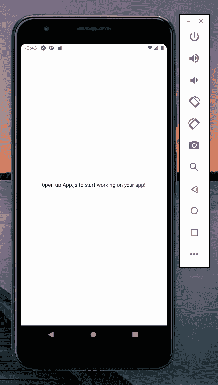
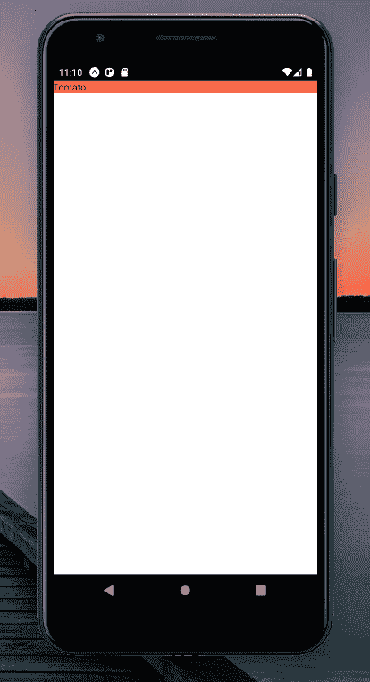
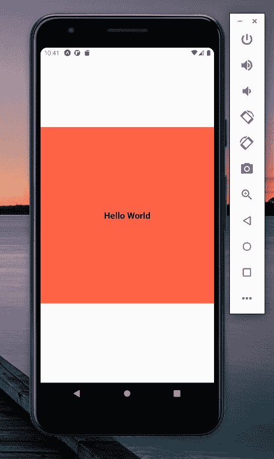
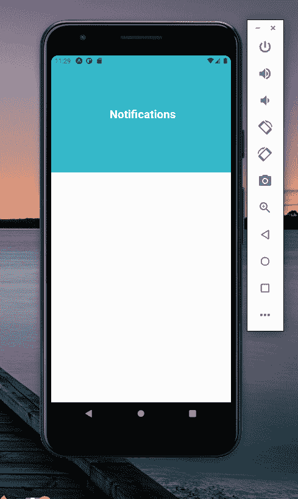
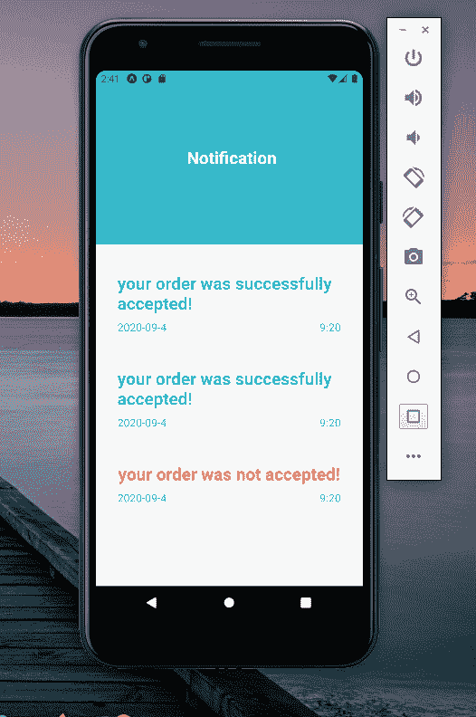

# 用风格化的系统构建 React 本地应用程序

> 原文：<https://blog.logrocket.com/building-react-native-applications-with-styled-system/>

React、Angular 和 Vue 等基于组件的库和框架的引入导致了 CSS-in-JS 样式技术的采用。CSS-in-JS 让我们:

*   使用 JavaScript 编写 CSS，这样我们就可以将 CSS 抽象到组件级别
*   使用 JavaScript 的强大功能，以更具声明性和可维护性的方式描述样式

CSS-in-JS 最流行的实现之一是 [styled-components](https://www.npmjs.com/package/styled-components) ，它是一个库，使我们能够创建具有本地风格的组件。

在本文中，我们将重点关注使用 styled-components 和 [Styled System](https://styled-system.com/getting-started/) 对 React 本地应用程序进行样式化，Styled System 是一个实用程序优先的样式库，与 CSS-in-JS 库协同工作。

## 先决条件

要跟进，您需要以下内容:

*   CSS 的工作知识
*   React 和 React Native 的工作知识

## CSS-in-JS

在我们开始学习本教程之前，让我们先了解一下 CSS-in-JS 的一些背景知识，并看看它的一些优点。首先，CSS-in-JS 使我们能够解决 CSS 问题，例如使用 JavaScript 时由全局名称空间引起的[名称冲突](https://blog.logrocket.com/design-patterns-in-node-js-2/#avoidimportnamecollision)。CSS-in-JS 还允许我们使用普通的 CSS 命名约定，而不是 React Native 中使用的 camelCase，比如`backgroundColor`就是`background-color`。

将 CSS-in-JS 与库集成(如样式组件)一起使用还有一些额外的好处，特别是对于移动应用程序。

Styled-components 允许我们使用 CSS 属性，如媒体查询和伪类内联。在 React Native 中不可能将这些与普通的内联 CSS 一起使用。我们可以通过从原生模块`styled-components/native`导入组件来获得原生移动支持。

## 构建我们的应用程序

让我们开始设计 React 本机应用程序的样式。按照下面的步骤添加`style`道具，使用样式化的系统来反应组件。

使用 [Expo CLI](https://docs.expo.io/get-started/create-a-new-app/) 创建一个新的 React 本地应用程序:

```
# Install the expo command line tool
npm install --global expo-cli

# bootstrap a new project
expo init <-- your app name -->

## cd <-- your app name -->

```

安装依赖项:

```
npm install styled-system styled-components

```

上面的代码片段安装了样式化的系统和样式化的组件。

启动您的应用程序:

```
#Expo 
expo start 
# you can not run and Android or iOS emulator to view your application

```

现在，您应该得到一个如下所示的启动应用程序:



Styled System 为我们提供了一组名为`style functions`的函数，这些函数为我们的组件添加了`style`道具。这些`style`道具为我们的 React 本地组件提供了内联样式:

```
import styled from 'styled-components/native'
import { color } from 'styled-system'
const Card = styled.View`
  ${color}
`
export default Card

```

上面的代码从 Styled System 导入了`color`函数并将其添加到卡片组件中，将`bg`和`color`样式的道具映射到卡片组件中。请看下面这些道具是如何使用的:

```
...
<Card color="#FFFFFF" bg="black">
  <Text>Hello World!</Text>
</Card>
...

```

您现在应该会收到如下所示的输出:



Styled System 有一个非常丰富的 API，包括大多数 [CSS 属性](https://styled-system.com/table/)的函数。每个功能都提供了一组`style`道具。当功能被添加到组件时，`style`属性也被映射到组件。

这些`style`道具使用类似于 Bootstrap 和 Tailwind CSS 中的速记语法，促进了 UI 的快速原型化和整体的良好开发体验。

为了详细说明这一点，让我们在示例中添加更多代码:

```
import styled from 'styled-components/native'
import { color, space, layout, position, border, flexbox } from 'styled-system'
const Card = styled.View`
  ${color}
  ${space}
  ${layout}
  ${position}
  ${border}
  ${flexbox}
`
export default Card

```

如你所见，我在卡片组件中加入了更多的`style`函数，这也映射了更多的`style`道具。Flexbox 函数将 flex 属性作为`style`道具添加到我们的组件中。其他的`style`函数也做了同样的事情，给了我们一个拥有丰富的`style`道具集合的组件。

接下来，创建如下所示的文本组件:

```
import styled from 'styled-components/native'
import { color, space, typography } from 'styled-system'
const Title = styled.Text`
  ${color}
  ${space}
  ${typography}
`
export default Title

```

这段代码为我们提供了一个可重用的文本组件，它有几个样式选项:

```
import React from 'react';
import Title from './component/Text';
import Card from './component/Card'

const App = () => {
  return (
    <Card 
        width={"100%"} 
        height={"100%"} 
        alignItems={"center"} 
        justifyContent={"center"}
    >
      <Card 
            color="#fff"
            width={400} 
            height={400} 
            alignItems={"center"} 
            justifyContent={"center"} 
            bg="tomato" p={6}
      >
        <Title fontSize={20} fontWeight={'bold'}>Hello World</Title>
      </Card>
    </Card>
  );
}
export default App;

```

从上面的代码中，我们看到我们可以重用具有不同样式的卡片和文本组件来满足我们的布局需求。这对于快速的 UI 原型开发来说非常好。

您的 React 本机应用程序现在应该看起来像下图:



现在，让我们通过构建一个`Notification layout`将所有的东西放在一起。

## 设计我们的布局

现在，我们已经使用 Expo CLI 启动了一个新的 React 本地应用程序，在`root directory`中用这三个文件创建一个`components folder`:`Notifications.js`、`Card.js`和`Text.js`。

将以下代码添加到我们的`Card.js`文件中:

```
import styled from 'styled-components/native'
import { color, space, layout, position, border, flexbox } from 'styled-system'
const Card = styled.View`
  ${color}
  ${space}
  ${layout}
  ${position}
  ${border}
  ${flexbox}
`
export default Card

```

现在，将下面的代码添加到我们的`Text.js`文件中:

```
import styled from 'styled-components/native'
import { color, space, typography } from 'styled-system'
const Title = styled.Text`
  ${color}
  ${space}
  ${typography}
`
export default Title

```

到目前为止，没有什么新的东西。接下来，将以下代码添加到`Header.js`文件中:

```
import React from 'react';
import Title from './Text';
import Card from './Card';
const Header = ({title}) => {
  return (
    <Card 
        width={400} 
        height={150} 
        alignItems={"center"} 
        justifyContent={"center"} 
        bg={"#36b8c9"} 
        mb={3} 
        py={6} 
        px={4}
    >
        <Title fontSize={25} fontWeight={'bold'} color={"#FFFFFF"}>{title}</Title>
    </Card>
  );
}
export default Header;

```

我们的`App.js`文件现在应该是这样的:

```
import React from 'react';
import Card from './component/Card';
import Header from "./component/Header.js";

const App = () => {
  return (
    <Card width={"100%"} height={"100%"} bg={"#efefef"}>
      <Header title="Notification" />
    </Card>
  );
}
export default App;

```

现在，我们的应用程序如下图所示:



接下来，我们将以下代码添加到`Notification.js`文件中:

```
import React from 'react';
import Title from './Text';
import Card from './Card'
const Notification = ({ status, message }) => {
    return (
      <Card 
          width={"100%"} 
          height={"auto"} 
          alignItems={"center"} 
          justifyContent={"center"} 
          bg={"#FFFFFF"} 
          my={2} 
          px={4} 
          py={3}
      >
        <Title 
              fontSize={25} 
              fontWeight={'bold'} 
              color={status === "success" ? "#36b8c9" : "#f6244d"} 
              mb={2}
        >
              {message}
        </Title>
        <Card 
              flexDirection={"row"} 
              justifyContent={"space-between"} 
              width={"100%"}
        >
            <Title fontSize={16} color={"#36b8c9"}>2020-09-4</Title>
            <Title fontSize={16} color={"#36b8c9"}>9:20</Title>  
        </Card>
      </Card>
    );
  }

export default Notification;

```

上面的代码创建了一个可重用的`Notification component`，它接受两个道具，即`status`和`message`。`status`属性用于根据订单状态有条件地设置文本样式:

```
color={status === "success" ? "#36b8c9" : "#f6244d"} 

```

`message prop`向视图显示通知消息。我们可以使用我们的`App.js`文件中的`message prop`来获得我们的最终视图:

```
import React from 'react';
import Card from './component/Card';
import Header from "./component/Header.js";
import Notification from "./component/Notification";

const App = () => {
  return (
    <Card 
          width={"100%"} 
          height={"100%"} 
          bg={"#efefef"}
    >
      <Header title="Notification" />
      <Notification 
            status="success" 
            message="your order was successfully accepted!" 
      />
      <Notification 
            status="success" 
            message="your order was successfully accepted!" 
      />
      <Notification  message="your order was not accepted!" />
    </Card>
  );
}
export default App;

```

构建可重用的组件使得我们的代码干净并且`DRY`。通过用样式化的系统创建可重用的组件，我们为每个组件提供了对由`style`函数传递给它的必要的`style`道具的访问。

因此，我们可以通过使用这些道具来操作组件的显示，从而轻松地构建我们的布局。与 React 本机样式对象相比，我们的代码更容易阅读和维护。

我们最终的应用程序应该是这样的:



## 使用样式化系统进行主题化

最后，值得注意的是，Styled System 也支持主题的使用。让我们创建一个`theme.js`文件来保存定义我们所有样式的对象。我们将使用大多数 CSS-in-JS 库通过`context`提供的带有`ThemeProvider`的`theme.js`文件:

```
import React from 'react'
import { ThemeProvider } from 'styled-components'
import theme from './theme'

const App = props => (
  <ThemeProvider theme={theme}>{/* application elements */}</ThemeProvider>
)

export default App

```

嵌套在`ThemeProvider`中的所有组件都可以访问在`theme object`中定义的样式。这使得我们的风格更加一致和可维护。

## 结论

风格系统很棒。它不仅允许我们快速原型化我们的 UI，而且它还可以与几个 CSS-in-JS 库一起工作，比如样式化组件。

样式化系统是一种革命性的样式化 React 本地组件的方式，它使用一种简单的方法。我们通过向组件传递`Style functions`来添加用于向组件提供内联样式的`style`道具。毫无疑问，Styled System 是构建 React 原生布局的一个好方法。我希望你已经准备好在你的下一个项目中尝试它了！

## [LogRocket](https://lp.logrocket.com/blg/react-native-signup) :即时重现 React 原生应用中的问题。

[](https://lp.logrocket.com/blg/react-native-signup)

[LogRocket](https://lp.logrocket.com/blg/react-native-signup) 是一款 React 原生监控解决方案，可帮助您即时重现问题、确定 bug 的优先级并了解 React 原生应用的性能。

LogRocket 还可以向你展示用户是如何与你的应用程序互动的，从而帮助你提高转化率和产品使用率。LogRocket 的产品分析功能揭示了用户不完成特定流程或不采用新功能的原因。

开始主动监控您的 React 原生应用— [免费试用 LogRocket】。](https://lp.logrocket.com/blg/react-native-signup)