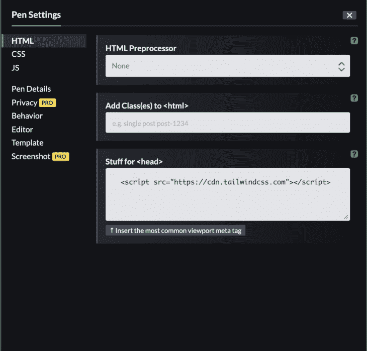
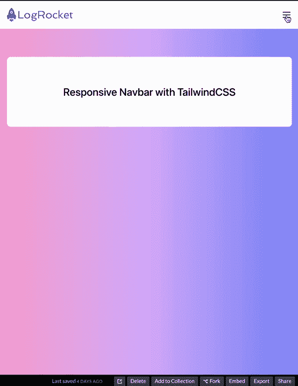

# 在顺风 CSS 中构建一个响应式导航条

> 原文：<https://blog.logrocket.com/building-responsive-navbar-tailwind-css/>

***编者按:**本文于 2021 年 1 月 28 日更新，纳入了 2021 年 12 月发布的 Tailwind CSS v3 的信息。*

Tailwind CSS 是一个基于实用程序的 CSS 框架，它使得创建网页而无需编写一行 CSS 代码成为可能。它包含了实用程序类，允许您直接从标记构建任何设计。

当前访问您的网页的互联网消费者将拥有不同的屏幕和窗口大小，从大型桌面到小型手机或平板电脑。作为一名开发者，我们需要让网站在这些方面看起来都不错。

从历史上看，这一直是 CSS 的一个挑战。创建响应式组件包括添加媒体查询和布局方法(如 [Flexbox](https://blog.logrocket.com/a-guide-to-flexbox-properties-in-react-native/) 和 Grid)，检查每个部分以确保它看起来不错，然后相应地调整代码。

好消息是，Tailwind 可以减轻您与 CSS 的斗争，甚至帮助您比以往更快地构建用户界面，只需在 HTML 代码中添加类名。在本文中，我将解释如何用 Tailwind 构建一个响应式菜单，向您展示在不使用任何 CSS 代码的情况下创建功能强大、响应迅速的组件是多么容易。

Tailwind CSS 在 2021 年 12 月发布了版本 3，在本文中，我们将通过 CDN 链接使用 v3。

## 顺风 CSS 中的断点

我们可以使用 Tailwind 相当快速地创建响应式设计，但是要针对特定的断点，我们需要获取一个现有的 Tailwind 实用程序类，并在它前面加上断点名称，后面跟一列。对，就是这样！

例如:

```
<h1 class="text-black md:text-gray-500">Medium breakpoint</h1>
```

这里，`h1`对于最小尺寸和更大尺寸将是黑色，但是当我们到达中等断点(640px 和更大)时，它的颜色将变成灰色。

您可以在下面看到断点及其相应的屏幕大小。这些尺寸基于移动优先的方法，因为它们在 CSS 中使用了`min-width`:

| 断点前缀 | 最小行宽 | 半铸钢ˌ钢性铸铁(Cast Semi-Steel) |
| --- | --- | --- |
| 钐 | 640 像素 | `@media (min-width: 640px) { ... }` |
| 钔 | 768 像素 | `@media (min-width: 768px) { ... }` |
| 水准仪 | 1024px | `@media (min-width: 1024px) { ... }` |
| 特大号 | 1280 像素 | `@media (min-width: 1280px) { ... }` |
| 2xl | 1536 像素 | `@media (min-width: 1536px) { ... }` |

## 在顺风 CSS 中创建响应导航条

在本教程中，我们将创建一个响应式导航条。你可以带着[笔](https://codepen.io/)跟随。

使用顺风 3，进入**设置**→**HTML**→**A**→**Stuff for`<head>`**，添加`<script src="https://cdn.tailwindcss.com"></script>` CDN 链接，然后保存并关闭。我们将只使用 HTML，我们将使用 JavaScript 来切换按钮。

你可以在我的 [CodePen](https://codepen.io/hulyak/pen/yLbwXvB) 这里分叉演示。



让我们开始吧。转到 HTML 标签，然后添加一个`body`、`header`和`nav`标签，如下所示:

```
<body>
  <header>
    <nav>
      <!--  Code goes here      -->
    </nav>
  </header>
</body>

```

我们将在我们的`nav`标签中创建导航栏。我添加了一些起始代码，使它看起来更好:

```
<body
    class="
      antialiased
      bg-gradient-to-r
      from-pink-300
      via-purple-300
      to-indigo-400
    "
  >
  <header>
     <nav
        class="
          flex flex-wrap
          items-center
          justify-between
          w-full
          py-4
          md:py-0
          px-4
          text-lg text-gray-700
          bg-white
        "
      >
      <!--  Code goes here      -->
    </nav>
  </header>
</body>

```

对于`body`元素，我们通过`bg-gradient-to-r from-pink-300 via-purple-300 to-indigo-400`使用渐变背景，通过`antialiased`使用字体平滑效果。

通过`flex`设置`nav`元素的显示属性。这将沿着导航的 x 轴放置灵活的项目，并通过`justify-between`在每个项目之间给它们相等的空间。然后，为了在必要时包装子元素，我们有一个`flex-wrap`实用程序类。

我们通过`w-full`给出 100%的宽度，通过`py-4`给出 1 个顶部和底部填充(垂直)。1 顶部和底部填充只能在最小屏幕尺寸到某一点的范围内有效。我们需要在一个中等断点之后调整顶部和底部的填充:768px 及以上。我们用`md:py-0`类移除填充。

对于左右填充，我们有 1 个带`px-4`的水平填充。

对于文字大小，我们增加了`text-lg`，将使字体大小为 1.125 雷姆，行高为 1.75 雷姆。

最后，我们用`text-gray-700`添加了深灰色的文字颜色。

## 放置徽标

在`nav`标签中，我们将嵌套一个带有链接元素的`div`,以及一个用于标识的`svg`标签。你可以把任何你想要的标志放在这里:

```
<div>
          <a href="#">
            <svg

              width="150"
              height="32.125"
              viewBox="0 0 150 32.125"
            >
              <g
                id="Group_330"
                data-name="Group 330"
                transform="translate(-251.1 457.654)"
              >
                <g
                  id="Group_329"
                  data-name="Group 329"
                  transform="translate(251.1 -457.654)"
                >
                  <path
                    id="Path_121"
                    data-name="Path 121"
                    d="M257.887-454.034a12.084,12.084,0,0,1,3.505-3.62,11.811,11.811,0,0,1,3.46,3.549,17.887,17.887,0,0,1,3.362,11.216c.73.589,1.482,1.154,2.2,1.754a3.969,3.969,0,0,1,1.266,3.659c-.347,1.672-.679,3.347-1.045,5.015a1.393,1.393,0,0,1-2.12.7c-1.178-.946-2.326-1.925-3.5-2.872a5.373,5.373,0,0,1-3.316,1.44,5.365,5.365,0,0,1-3.882-1.4c-.844.621-1.628,1.367-2.453,2.033a6.315,6.315,0,0,1-1.2.924,1.393,1.393,0,0,1-1.839-.9c-.377-1.631-.771-3.257-1.136-4.89a3.96,3.96,0,0,1,1.335-3.81c.641-.517,1.29-1.025,1.943-1.527.182-.092.091-.3.1-.46a17.915,17.915,0,0,1,3.326-10.806m1.156,5.049a2.748,2.748,0,0,0,.24,3.641,3.024,3.024,0,0,0,4.134.085,2.75,2.75,0,0,0,.729-3.021,2.924,2.924,0,0,0-2.454-1.825,2.984,2.984,0,0,0-2.65,1.119"
                    transform="translate(-251.1 457.654)"
                    fill="#764abc"
                  />
                  <path
                    id="Path_122"
                    data-name="Path 122"
                    d="M260.3-419.746a.693.693,0,0,1,1.027-.557,6.628,6.628,0,0,0,5.77,0,.7.7,0,0,1,1.029.516q.008,1.532,0,3.064a.691.691,0,0,1-1.079.5c-.306-.26-.582-.552-.876-.825-.467.874-.905,1.76-1.375,2.631a.7.7,0,0,1-1.161.007c-.472-.873-.908-1.764-1.384-2.637-.29.275-.566.566-.873.825a.692.692,0,0,1-1.078-.506c-.008-1.007,0-2.015,0-3.022"
                    transform="translate(-253.92 446.225)"
                    fill="#764abc"
                  />
                  <path
                    id="Path_123"
                    data-name="Path 123"
                    d="M265.28-441.9a1.4,1.4,0,0,0,1.432-1.376,1.4,1.4,0,0,0-1.432-1.377,1.4,1.4,0,0,0-1.431,1.377,1.4,1.4,0,0,0,1.431,1.376"
                    transform="translate(-255.01 453.668)"
                    fill="#764abc"
                  />
                  <path
                    id="Path_124"
                    data-name="Path 124"
                    d="M288.561-448.233H290.8v15.127h9.357v2.036h-11.6Zm13.563,11.211a5.99,5.99,0,0,1,.546-2.557,6.4,6.4,0,0,1,1.479-2.037,6.769,6.769,0,0,1,4.751-1.818,6.592,6.592,0,0,1,4.666,1.733,5.891,5.891,0,0,1,1.891,4.521,5.9,5.9,0,0,1-2.024,4.544,6.767,6.767,0,0,1-4.751,1.807A6.582,6.582,0,0,1,304-432.549a5.832,5.832,0,0,1-1.879-4.472m2.3-.133a4.517,4.517,0,0,0,.339,1.757A4.36,4.36,0,0,0,305.7-434a4.381,4.381,0,0,0,3.2,1.235,4.1,4.1,0,0,0,3.03-1.235,4.107,4.107,0,0,0,1.224-3.043,4.325,4.325,0,0,0-1.273-3.188,4.335,4.335,0,0,0-3.2-1.26,4.074,4.074,0,0,0-3.03,1.249,4.213,4.213,0,0,0-1.224,3.091m16.677,1.078a2.077,2.077,0,0,0-.582,1.3.918.918,0,0,0,.413.849,3.845,3.845,0,0,0,1.1.413q.692.157,1.564.266t1.794.218q.909.121,1.782.315a6.957,6.957,0,0,1,1.575.509,2.345,2.345,0,0,1,1.516,2.158,4.306,4.306,0,0,1-1.9,3.563,6.821,6.821,0,0,1-4.157,1.321,7.745,7.745,0,0,1-3.806-.873,3.147,3.147,0,0,1-1.831-2.861,3.762,3.762,0,0,1,.9-2.315,5.143,5.143,0,0,1,.558-.606,2.3,2.3,0,0,1-1.758-2.17,4.315,4.315,0,0,1,1.6-3.321,3.385,3.385,0,0,1-.557-1.878,3.7,3.7,0,0,1,.424-1.806,4.118,4.118,0,0,1,1.152-1.321,5.62,5.62,0,0,1,3.5-1.115,5.436,5.436,0,0,1,3.466,1.115,4.661,4.661,0,0,1,2.5-1.043,6.619,6.619,0,0,1,.945-.072l-.1,1.879a6.307,6.307,0,0,0-2.218.569,3.709,3.709,0,0,1,.412,1.721,3.4,3.4,0,0,1-.436,1.7,4.025,4.025,0,0,1-1.14,1.31,5.554,5.554,0,0,1-3.405,1.091,5.887,5.887,0,0,1-3.309-.91m.582-4.253a2.143,2.143,0,0,0-.231,1.017,2.221,2.221,0,0,0,.231,1.031,2.275,2.275,0,0,0,.654.739,3.493,3.493,0,0,0,2.085.582,2.688,2.688,0,0,0,2.594-1.285,2.074,2.074,0,0,0,.231-1.006,2.135,2.135,0,0,0-.243-1.03,2.124,2.124,0,0,0-.642-.751,3.446,3.446,0,0,0-2.085-.594,2.682,2.682,0,0,0-2.594,1.3m.024,8.944a3.151,3.151,0,0,0-.837,2.194,1.783,1.783,0,0,0,1.2,1.611,4.619,4.619,0,0,0,1.975.473,7.943,7.943,0,0,0,1.6-.134,3.885,3.885,0,0,0,1.139-.4,1.942,1.942,0,0,0,1.176-1.769q0-1.079-2.085-1.443-.9-.157-2.194-.279t-1.975-.254m27.052-11.563a5.27,5.27,0,0,1-3.515,5.273l3.261,6.606H345.9l-2.945-5.976a16.725,16.725,0,0,1-2.509.182h-4.461v5.793h-2.241v-17.163h7.042a12.082,12.082,0,0,1,5.684,1.042,4.451,4.451,0,0,1,2.291,4.242m-8.012,4.048a8.338,8.338,0,0,0,4.024-.752,3.344,3.344,0,0,0,1.612-3.151q0-2.885-3.733-3.273a19.936,19.936,0,0,0-2.218-.121h-4.449v7.3Zm10.7,1.879a5.99,5.99,0,0,1,.546-2.557,6.4,6.4,0,0,1,1.479-2.037,6.77,6.77,0,0,1,4.751-1.818A6.591,6.591,0,0,1,362.9-441.7a5.894,5.894,0,0,1,1.891,4.521,5.9,5.9,0,0,1-2.024,4.544,6.767,6.767,0,0,1-4.751,1.807,6.582,6.582,0,0,1-4.678-1.721,5.831,5.831,0,0,1-1.879-4.472m2.3-.133a4.517,4.517,0,0,0,.34,1.757,4.37,4.37,0,0,0,.933,1.394,4.383,4.383,0,0,0,3.2,1.235,4.1,4.1,0,0,0,3.03-1.235,4.107,4.107,0,0,0,1.224-3.043,4.325,4.325,0,0,0-1.273-3.188,4.336,4.336,0,0,0-3.2-1.26,4.073,4.073,0,0,0-3.03,1.249,4.214,4.214,0,0,0-1.224,3.091m23.344,3.491.424,1.709a7.408,7.408,0,0,1-4.46,1.127,5.729,5.729,0,0,1-4.412-1.721,6.409,6.409,0,0,1-1.563-4.557,6.234,6.234,0,0,1,1.757-4.509,5.974,5.974,0,0,1,4.448-1.818,6.431,6.431,0,0,1,3.9,1.1l-.8,1.805a5.411,5.411,0,0,0-3.321-1.017,3.3,3.3,0,0,0-2.7,1.284,4.622,4.622,0,0,0-.982,3.006,4.82,4.82,0,0,0,1.03,3.175,3.638,3.638,0,0,0,2.969,1.309,8.3,8.3,0,0,0,3.708-.9m3.066-16.326h2.3v12.133l5.442-5.333h2.69l-5.7,5.575,3.394,3.66a3.824,3.824,0,0,0,2.569,1.249l-.352,1.636a3.724,3.724,0,0,1-2.981-.678,6.8,6.8,0,0,1-.691-.667l-4.375-4.728v6.073h-2.3Zm22.108,7.866a4.441,4.441,0,0,1,1.006,1.624,5.626,5.626,0,0,1,.376,2.049,15.688,15.688,0,0,1-.243,2.533h-8.436a4.022,4.022,0,0,0,1.188,2.315,3.741,3.741,0,0,0,2.606.836,10.169,10.169,0,0,0,4.133-.824l.388,1.733a8.96,8.96,0,0,1-3.564.958,15.618,15.618,0,0,1-1.672.073,6.288,6.288,0,0,1-2.158-.412,4.692,4.692,0,0,1-1.866-1.212,6.631,6.631,0,0,1-1.466-4.654,6.234,6.234,0,0,1,1.757-4.509,5.974,5.974,0,0,1,4.448-1.818,4.733,4.733,0,0,1,3.5,1.309m-.812,4.425.049-.655a2.885,2.885,0,0,0-1.66-2.945,3.332,3.332,0,0,0-1.334-.242,3.368,3.368,0,0,0-1.43.3,3.514,3.514,0,0,0-1.114.825,4.376,4.376,0,0,0-1.091,2.715Zm5.358-3.624h-1.3v-1.5l2.982-2.242h.618v1.879h3.466v1.866h-3.466v4.9a5.311,5.311,0,0,0,.521,2.812,2.747,2.747,0,0,0,2.036.91l-.351,1.636q-3.636.46-4.3-2.873a10.568,10.568,0,0,1-.206-2.144Z"
                    transform="translate(-262.589 455.303)"
                    fill="#764abc"
                  />
                </g>
              </g>
            </svg>
          </a>
        </div>

```

## 为带有顺风 CSS 的手机添加一个汉堡图标

在 logo 之后，让我们[为一个汉堡图标再加一个 SVG](https://blog.logrocket.com/how-to-use-svgs-react-native-tutorial-with-examples/)；你可以从[英雄图标](https://heroicons.com/)获得 SVG。这将在手机屏幕上切换菜单。



我们来分析一下它的类别:

```
<svg class="h-6 w-6 cursor-pointer md:hidden block"> </svg>

```

默认情况下会出现这个图标，所以即使是最小的屏幕大小也能看到。但是当我们打到 768px 的中等断点时，图标就会消失，显示桌面版的导航。这是因为我们添加了`md:hidden block`类。

我们还用`h-6`和`w-6`将图标的高度和宽度增加到 1.5 雷姆。

最后，我们有`cursor-pointer.`当我们悬停在它上面时，我们看到鼠标光标变成了一只指针。

我们还有一个`menu-button`的`id`，我们将使用它进行 JavaScript 切换:

```
<!-- Hamburger Icon -->
          <svg

            id="menu-button"
            class="h-6 w-6 cursor-pointer md:hidden block"
            fill="none"
            viewBox="0 0 24 24"
            stroke="currentColor"
          >
            <path
              stroke-linecap="round"
              stroke-linejoin="round"
              stroke-width="2"
              d="M4 6h16M4 12h16M4 18h16"
            />
          </svg>

```

## 用顺风 CSS 创建导航项

现在我们将在`nav`元素中添加导航项:

```
<div class="hidden w-full md:flex md:items-center md:w-auto " id="menu">
          <ul
            class="
              text-base text-gray-700
              pt-4
              md:flex
              md:justify-between
              md:pt-0"
          >
            <li>
              <a class="md:p-4 py-2 block hover:text-purple-400" href="#"
                >Features</a
              >
            </li>
            <li>
              <a class="md:p-4 py-2 block hover:text-purple-400" href="#"
                >Pricing</a
              >
            </li>
            <li>
              <a class="md:p-4 py-2 block hover:text-purple-400" href="#"
                >Customers</a
              >
            </li>
            <li>
              <a class="md:p-4 py-2 block hover:text-purple-400" href="#"
                >Blog</a
              >
            </li>
            <li>
              <a
                class="md:p-4 py-2 block hover:text-purple-400 text-purple-500"
                href="#"
                >Sign Up</a
              >
            </li>
          </ul>
        </div>

```

对于父`div`，我们有一个`menu`的`id`属性。同样，我们将使用这个 ID 用 JavaScript 来切换汉堡菜单项。

让我们分析一下它的顺风实用程序类:

```
<div class="hidden w-full md:flex md:items-center md:justify-between md:w-auto " id="menu"></div>
```

默认情况下，我们的菜单项将通过`hidden`类隐藏，并具有`w-full`类的全宽度。只有在用户切换汉堡图标后，我们才会显示菜单项。

但是，在 648px 的中间断点之后，我们会将菜单项显示为带有`md:flex`的`flex`项，然后沿着`div`的 y 轴中心将子项与`md:items-center`对齐。它还用`md:w-auto`将宽度设置为`auto`。这将取消设置全宽，浏览器将计算元素的大小。

让我们继续看`ul`:

```
<ul class="text-base text-gray-700 pt-4 md:flex md:justify-between md:pt-0"></ul>
```

`Text-base`将设置字体大小为 1 雷姆，行高为 1.5 雷姆。我们用`text-gray-700`给`ul`的子元素一个深灰色的文本颜色，并用`pt-4`类添加 1 雷姆用于顶部填充。别忘了这些是针对小屏幕的；Tailwind 使用移动优先的方法。

对于中断点及以后的断点，我们将使用`flex`来显示相邻的 flex 项目。用`md:justify-between`沿容器的 x 轴给子元素相等的空间，用`pt-0.`移除顶部填充

现在让我们继续讨论清单上的项目。`Li`嵌套了链接标签；让我们检查他们的类:

```
 <li>
    <a class="py-2 block md:p-4 hover:text-purple-400" href="#" >Features</a>
  </li>

```

在这里，我们通过`py-2`将顶部和底部填充设置为 0.5 雷姆，并在移动屏幕上显示为`block`。在中间断点之后，我们通过`md:p-4`将填充设置为 1。通过`hover:text-purple-400`还有一个悬停效果，它会将列表项的颜色变成浅紫色。

## 用 JavaScript 切换菜单

现在我们已经完成了导航，让我们用 JavaScript 添加菜单切换实现。

* * *

### 更多来自 LogRocket 的精彩文章:

* * *

转到 CodePen 上的 **JS** 选项卡，在那里我们将得到我们的菜单(或汉堡包)图标和包含我们的列表项的菜单。

使用 click 事件侦听器，我们可以在用户单击菜单时切换菜单的隐藏类:

```
const button = document.querySelector('#menu-button'); // Hamburger Icon
const menu = document.querySelector('#menu'); // Menu

button.addEventListener('click', () => {
  menu.classList.toggle('hidden');
});

```

## 向页面添加文本

在导航栏之后，我们可以显示一些文本。我们有两个带有`h1`标签的嵌套的`div`:

```
<div class="px-4">
      <div
        class="
          flex
          justify-center
          items-center
          bg-white
          mx-auto
          max-w-2xl
          rounded-lg
          my-16
          p-16
        "
      >
        <h1 class="text-2xl font-medium">Responsive Navbar with TailwindCSS</h1>
      </div>
    </div>

```

第一个`div`有 1 个左右填充。这样在屏幕小的时候会给我们一些空间。

第二个`div`有一个`flex`显示屏，并使`h1`水平和垂直居中。它有一个白色背景，左边和右边通过`mx-auto`有一个`auto`边距。

对于最大宽度，可以通过`max-width-2xl`增长到 42rem。我们也有 0.5 雷姆的边界半径与`rounded-lg`。

`my-16`将上边距和下边距设置为 4 边距，`p-16`设置所有边的边距。

最后，`h1`的字体大小为 1.5 雷姆，行高为 1.75 雷姆，通过`font-medium`字体的粗细为 500。

## 继续建！

我希望这篇教程能帮助你理解创建响应式导航条时 Tailwind CSS 的[功能。如果你想在不使用 CodePen 的情况下从头开始创建项目，你需要遵循一些安装指南，这些指南可以在](https://blog.logrocket.com/using-tailwind-css-in-production/)[官方 Tailwind CSS 网站](https://tailwindcss.com/docs/installation)上找到。另外，如果你遇到问题，你可以很容易地在他们的网站上搜索解决方案。

## 你的前端是否占用了用户的 CPU？

随着 web 前端变得越来越复杂，资源贪婪的特性对浏览器的要求越来越高。如果您对监控和跟踪生产环境中所有用户的客户端 CPU 使用、内存使用等感兴趣，

[try LogRocket](https://lp.logrocket.com/blg/css-signup)

.

[](https://lp.logrocket.com/blg/css-signup)[https://logrocket.com/signup/](https://lp.logrocket.com/blg/css-signup)

LogRocket 就像是网络和移动应用的 DVR，记录你的网络应用或网站上发生的一切。您可以汇总和报告关键的前端性能指标，重放用户会话和应用程序状态，记录网络请求，并自动显示所有错误，而不是猜测问题发生的原因。

现代化您调试 web 和移动应用的方式— [开始免费监控](https://lp.logrocket.com/blg/css-signup)。