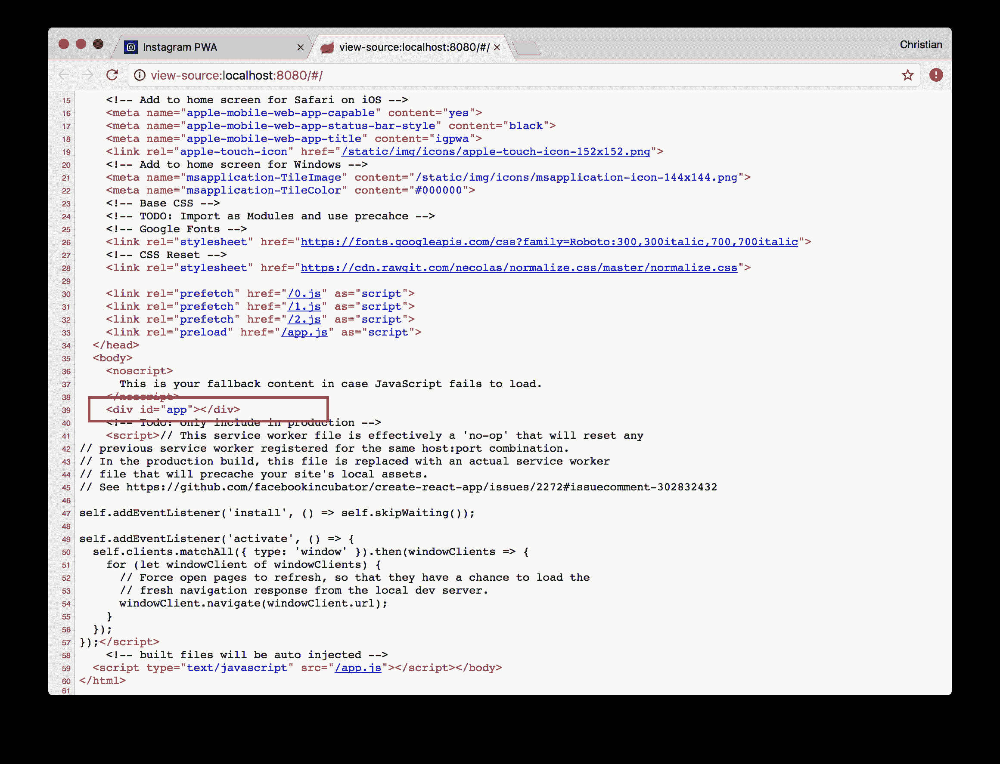
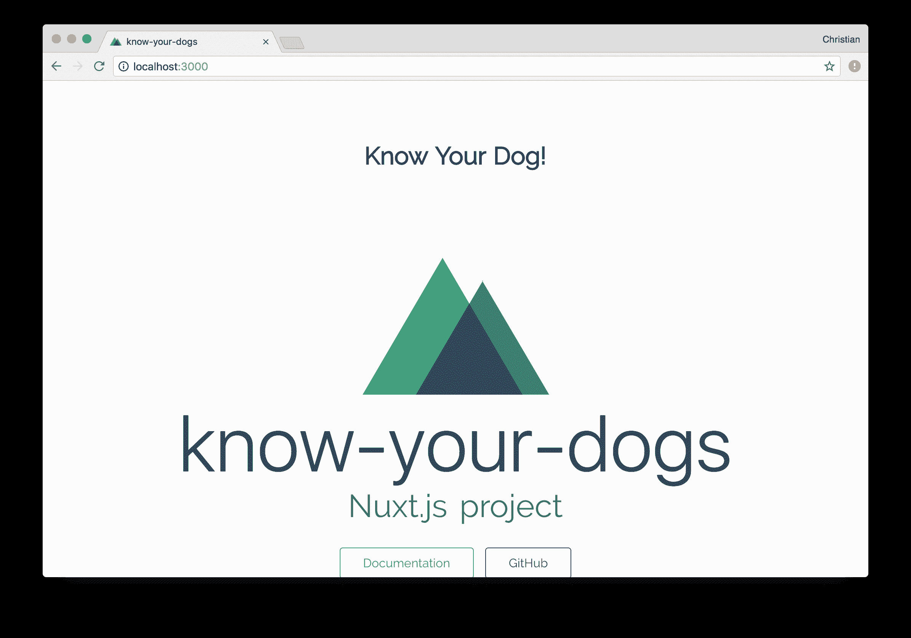
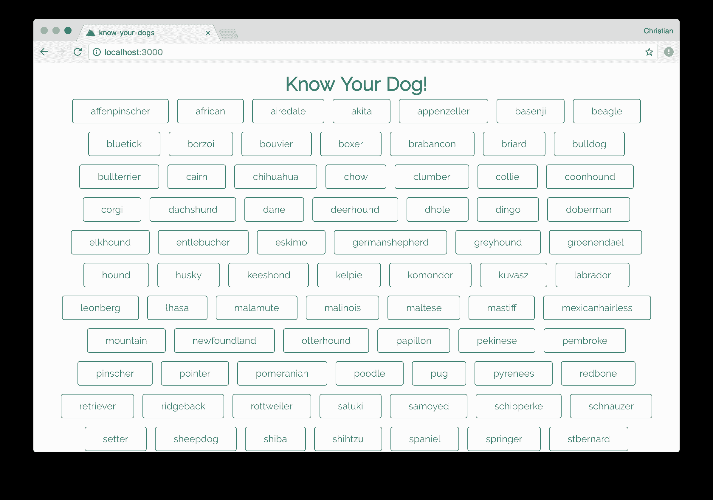
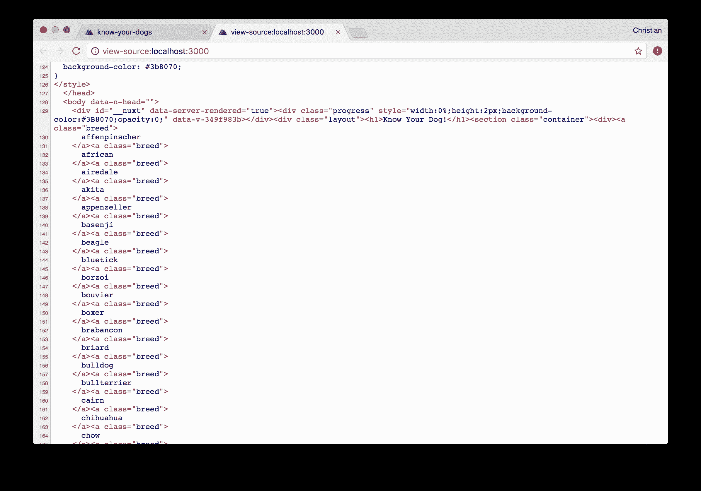
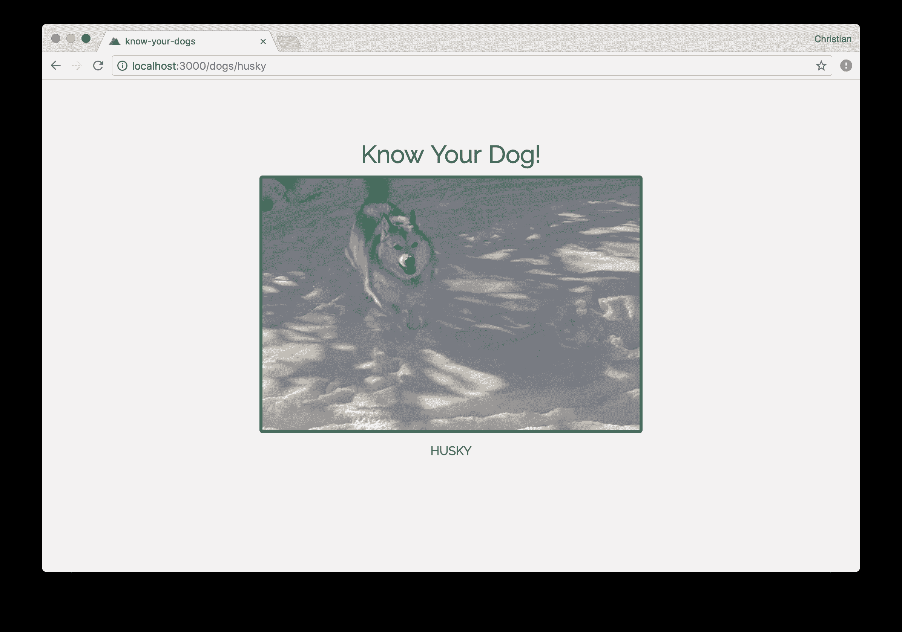
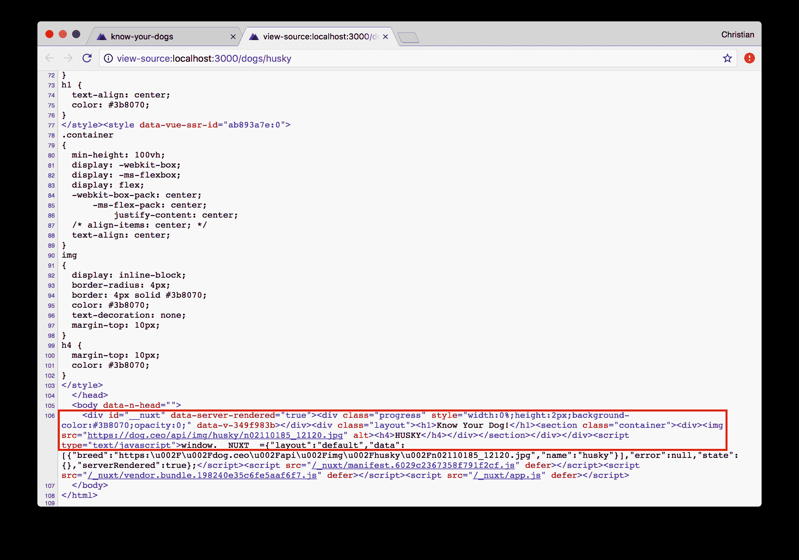

# 使用 Nuxt.js - LogRocket 博客在 Vue 中构建服务器渲染的应用程序

> 原文：<https://blog.logrocket.com/building-server-rendered-apps-in-vue-using-nuxt-js-c12c6c253274/>

这篇文章将带你了解在 [Vue](https://vuejs.org/) 中构建服务器渲染网页的过程，这是一个渐进的 JavaScript 框架，使用起来很简单。我还将讨论 [Nuxt](https://nuxtjs.org) ，一个使服务器渲染过程无缝的工具。最后，作为一个实际的例子，我们将构建一个应用程序，根据狗的品种显示狗的图片。

我们将构建一个服务器渲染的 Vue 应用程序，它加载速度非常快，甚至在 JavaScript 加载之前，并且可以被搜索引擎发现。

为了更好地理解这个问题，打开一个用任何框架构建的 SPA，尝试检查这个页面。这是我的一个 Vue 演示项目的例子:


无论项目的规模、相关性或美观程度如何，这都是您最终得到的结果:



您在页面源中看到的内容是服务器响应。请注意，只显示了`div#id`标签，而其他所有内容，包括那些漂亮的图片，都不见了。

这是个问题。

事实上，我们可以讨论很多潜在的问题。

让我们来关注一下最引人注目的——网络爬行。搜索引擎和其他网络爬虫对你的网站渲染后的视觉效果了解不多。他们只关心作为响应从你的服务器发送的难看的 HTML。在这里，当一个爬虫访问我们的网站时，除了 div 标签和 head 标签中的一些内容之外，它什么也没有带回家。

来个更微妙的问题怎么样？毫不奇怪，JavaScript 框架(在我们的例子中是 Vue)严重依赖 JavaScript。事实上，它们在单页应用程序(spa)中的视图是用 JavaScript 生成和控制的。当 JS 加载出错时，您的用户会遇到一个空白屏幕。

### 为什么是 Nuxt.js

有一个 Vue 库，您可以在您的 Vue 项目中使用它来提供服务器上的内容。这个库被称为`vue-server-renderer`，可以通过 npm 安装。它也有很好的文件。

与刚开始使用 Vue 相比，走这条路要困难一些。尽管文档尽最大努力简化事情，但 SSR 通常是一个棘手的概念。

当`vue-server-render`很难上手时， [Webpack 的 Prerender](https://github.com/chrisvfritz/prerender-spa-plugin) SPA 插件可能是一个选择。不幸的是，它只适用于简单的 SEO 营销页面(例如，“关于”或“联系我们”)。当你在处理大量的路线/动态路线时，插件会依赖你。

Nuxt 着眼于所有这些问题，并为您提供一个平台来构建由服务器渲染且易于设置的 SPA 项目。放入命令行指令，您就可以开始了。它的灵感来自 React 的 [Next](https://github.com/zeit/next.js/) ，这是 React 开发者实现服务器端渲染(SSR)的替代方案。

说够了。让我们走吧。

### 设置一个 Nuxt 项目

前面我提到过，要让 Nuxt 项目运行起来，只需要一条命令行指令。让我们看看这有多真实:

```
vue init nuxt/starter know-your-dogs
```

该命令依赖于 Vue CLI。如果没有安装，请运行:

```
npm install -g vue-cli
```

这将生成一个巨大的项目文件夹结构。别担心。随着时间的推移，你会知道你需要什么文件夹，什么放在哪里。

### 布局和路线页面

运行生成的样板文件，您会看到:


#### 布局

现在导航到`./layouts/default.vue`，用以下内容更新模板:

```
<template>
  <div class="layout">
    <h1>Know Your Dog!</h1>
    <nuxt/>
  </div>
</template>
```

的一些更新

```
[styles]()
```

，您应该会看到视图更改为:



注意“了解你的狗！”添加到布局中的文本包含在应用程序根 URL 呈现的页面中。这是因为`default.vue`文件是一个布局文件。它包装其他页面，并提供在一组页面之间共享的通用信息。运行时，`default.vue`中的`<nuxt/>`标签将被页面替换。

#### 按指定路线发送

与您通常的 Vue 项目不同，您不必在 Nuxt 中配置路由。在页面目录中找到的任何组件都会根据其名称自动映射到一个路由。页面`index.vue`被映射到根 URL `/`，但是如果我们有一个叫做`dogs.vue`的页面，它将被映射到`/dogs`。

当我们开始充实我们的应用程序时，我们会看到更多关于路由的内容。现在，让我们从 [dog.ceo API](https://dog.ceo/dog-api/) 中获取一个狗的列表。

### 加载异步数据

在 Vue 中，您通常会从`created`生命周期方法中获取异步数据。Nuxt 不是这样的，因为这些数据也需要在服务器上呈现。出于这个原因，存在另一个名为`asyncData`的方法，它在服务器和客户机上呈现获取的数据。

安装[Axios](https://github.com/mzabriskie/axios)——一个用于发出 HTTP 请求的流行库:

```
yarn add axios
```

在`pages/index.vue`中，在组件对象中添加以下方法:

```
import axios from 'axios'

export default {
  async asyncData () {
    const { data } = await axios.get('https://dog.ceo/api/breeds/list')
    return { breeds: data.message }
  },
}
```

我们正在利用`async/await`功能的力量。当返回响应时，我们通过返回包含响应的对象将值绑定到视图。

如果你觉得最舒服的话，你仍然可以坚持复试:

```
export default {
  asyncData ({ params }, callback) {
    axios.get('https://dog.ceo/api/breeds/list')
    .then((res) => {
      callback(null, { breeds: res.data.message })
    })
  }
}
```

现在，您可以使用组件的模板呈现返回的响应数据:

```
<template>
  <section class="container">
    <div>
      <a v-for="breed in breeds" :key="breed" class="breed">
        {{breed}}
      </a>
    </div>
  </section>
</template>
```

这是新的外观:



现在查看页面源代码，注意内容是如何呈现给服务器的:



### 动态路线

我们需要实现当任何品种被点击时会发生什么。我们想要做的是导航到`dogs/:id`并显示所选品种的随机图像。

在“pages”中创建一个名为`dogs`的文件夹，并在文件夹中添加一个带有`_breed.vue`的文件。

在脚本标记中，根据一个参数从 API 中获取一张狗的随机图像:

```
import axios from 'axios'

export default {
  async asyncData ({params}) {
    const { data } = await axios.get(`https://dog.ceo/api/breed/${params.breed}/images/random`)
    return { breed: data.message, name: params.breed }
  }
}
```

`asyncData`接收一个对象，其中`params`是一个属性。`params`属性也是一个包含传递给页面的所有参数的对象(在我们的例子中是`breed`)。该页被配置为通过在文件名前加下划线(_)来接收参数。我们使用这个参数获取一个随机图像，并将图像和品种名称设置到视图中。

让我们显示这个图像和名称:

```
<div>
  
  <h4>{{name.toUpperCase()}}</h4>
</div>
```

现在你可以看到你选择的品种的一些细节:



当您查看页面源代码时，您仍然可以在服务器上看到您的标记:



### 最后的话

您可能不总是需要 Nuxt，但是当您需要时，您在本文中学到的知识足以让您开始使用。但是总有更多的东西要学。为此，前往 [Nuxt](https://nuxtjs.org) 网站了解更多的功能，如 p [卢金斯](https://nuxtjs.org/guide/plugins)，s [托雷](https://nuxtjs.org/guide/vuex-store)等。如果有兴趣的话，我们会在以后的文章中介绍更多的评论。

## 像用户一样体验您的 Vue 应用

调试 Vue.js 应用程序可能会很困难，尤其是当用户会话期间有几十个(如果不是几百个)突变时。如果您对监视和跟踪生产中所有用户的 Vue 突变感兴趣，

[try LogRocket](https://lp.logrocket.com/blg/vue-signup)

.

[](https://lp.logrocket.com/blg/vue-signup)[https://logrocket.com/signup/](https://lp.logrocket.com/blg/vue-signup)

LogRocket 就像是网络和移动应用程序的 DVR，记录你的 Vue 应用程序中发生的一切，包括网络请求、JavaScript 错误、性能问题等等。您可以汇总并报告问题发生时应用程序的状态，而不是猜测问题发生的原因。

LogRocket Vuex 插件将 Vuex 突变记录到 LogRocket 控制台，为您提供导致错误的环境，以及出现问题时应用程序的状态。

现代化您调试 Vue 应用的方式- [开始免费监控](https://lp.logrocket.com/blg/vue-signup)。

* * *