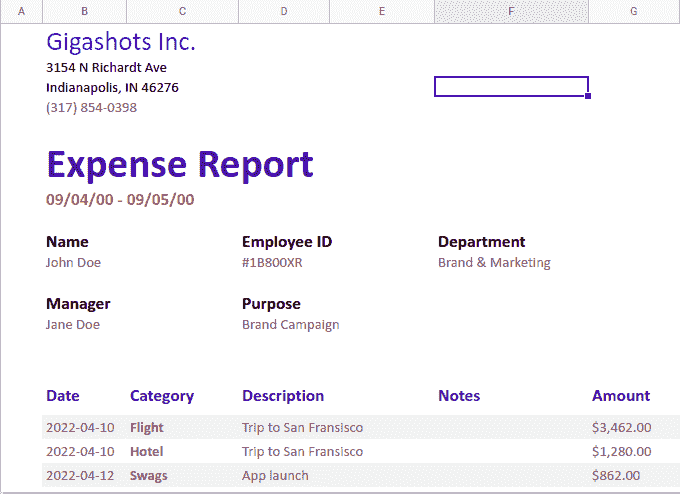

# 使用 Go 和 Excelize 构建电子表格

> 原文：<https://blog.logrocket.com/building-spreadsheets-go-excelize/>

分析任何规模的数据的重要性怎么强调都不为过。几乎我们日常生活的每个部分都是数据驱动的，作为开发人员，在构建任何合理规模的应用程序时，首先要考虑的问题之一是使用什么数据库以及如何组织数据。

但是，它不仅仅停留在存储数据上，您还需要通过提取和以任何非技术人员都能理解的格式呈现这些数据来理解这些数据。例如，电子商务企业每天都会产生大量数据，这意味着我们需要跟踪产品库存、月收入、财务报表等信息。目前，有许多服务提供这些类型的解决方案，但快速提取和呈现数据的最简单方法之一是生成电子表格或 CSV 文件。

在本文中，我们将探索如何在 Go 中创建电子表格，方法是构建一个简单的费用报告，并使用[excelise](https://github.com/qax-os/excelize)库将其导出为 CSV 格式。你可以在 GitHub repo 找到这个教程[的完整代码。我们开始吧！](https://github.com/Mayowa-Ojo/go-report)

## 生成费用报告

费用报告是一份详细列表，尽可能详细地显示公司在一段时间内的支出。我们将构建一个类似于下图的报告:



## 创建工作表

要开始，请确保您安装了 Go ≥v1.15，并创建一个新的项目文件夹。在项目目录中，创建一个`main.go`文件，并用以下代码初始化 Go 模块:

```
$ mkdir <project-name>
$ cd <project-name>
$ touch main.go
$ go mod init github.com/<your-username>/<project-name>

```

`main.go`文件是我们的 Go 应用程序的[入口点，我们使用生成的`go.mod`文件进行依赖管理。接下来，通过运行以下命令安装 Excelize 库:](https://blog.logrocket.com/benchmarking-golang-improve-function-performance/)

```
$ go get github.com/xuri/excelize/v2

```

Excelize 是一个没有依赖项的 Go 库，它提供了读写 XLSX 文件和其他支持的电子表格文件格式的原语。在您的`main.go`文件中，导入 Excelize，创建一个新文件，创建一个新工作表，并将活动工作表设置为您刚刚创建的工作表:

```
package main
import "github.com/xuri/excelize/v2"
const (
   SheetName = "Expense Report"
)
func main() {
   var err error
   f := excelize.NewFile()
   index := f.NewSheet("Sheet1")
   f.SetActiveSheet(index)
   f.SetSheetName("Sheet1", SheetName)
}

```

## 添加数据和创建样式

创建好工作表后，我们可以开始构建报告了。首先，我们将设置一些尺寸来适应我们想要的结构，如下图所示。将以下代码块添加到您的`main`函数中:

```
//main.go
//...
   err = f.SetColWidth(SheetName, "A", "A", 6)
   err = f.SetColWidth(SheetName, "H", "H", 6)
   err = f.SetColWidth(SheetName, "B", "B", 12)
   err = f.SetColWidth(SheetName, "C", "C", 16)
   err = f.SetColWidth(SheetName, "D", "D", 13)
   err = f.SetColWidth(SheetName, "E", "E", 15)
   err = f.SetColWidth(SheetName, "F", "F", 22)
   err = f.SetColWidth(SheetName, "G", "G", 13)

```

我们只需要报表的列`A`到`G`，所以我们使用`SetColWidth`来调整列的宽度以适应我们的需求。你会注意到我们在`main`函数的顶部定义了一个`error`变量，我们只是将这些函数返回的任何错误赋给它。理想情况下，您应该正确处理每个错误，因为这在 Go 中是惯用的，但是保持代码最少也没问题。

报告的第一部分包含静态信息，因此我们将对其进行硬编码。将以下代码块添加到主函数中:

```
//main.go
//...
   err = f.SetRowHeight(SheetName, 1, 12)
   err = f.MergeCell(SheetName, "A1", "H1")

   err = f.SetRowHeight(SheetName, 2, 25)
   err = f.MergeCell(SheetName, "B2", "D2")

   style, err := f.NewStyle(&excelize.Style{Font: &excelize.Font{Size: 20, Color: "6d64e8"}})
   err = f.SetCellStyle(SheetName, "B2", "D2", style)
   err = f.SetSheetRow(SheetName, "B2", &[]interface{}{"Gigashots Inc."})
   err = f.MergeCell(SheetName, "B3", "D3")
   err = f.SetSheetRow(SheetName, "B3", &[]interface{}{"3154 N Richardt Ave"})

   err = f.MergeCell(SheetName, "B4", "D4")
   err = f.SetSheetRow(SheetName, "B4", &[]interface{}{"Indianapolis, IN 46276"})

   style, err = f.NewStyle(&excelize.Style{Font: &excelize.Font{Color: "666666"}})
   err = f.MergeCell(SheetName, "B5", "D5")
   err = f.SetCellStyle(SheetName, "B5", "D5", style)
   err = f.SetSheetRow(SheetName, "B5", &[]interface{}{"(317) 854-0398"})

   style, err = f.NewStyle(&excelize.Style{Font: &excelize.Font{Size: 32, Color: "2B4492", Bold: true}})
   err = f.MergeCell(SheetName, "B7", "G7")
   err = f.SetCellStyle(SheetName, "B7", "G7", style)
   err = f.SetSheetRow(SheetName, "B7", &[]interface{}{"Expense Report"})

   style, err = f.NewStyle(&excelize.Style{Font: &excelize.Font{Size: 13, Color: "E25184", Bold: true}})
   err = f.MergeCell(SheetName, "B8", "C8")
   err = f.SetCellStyle(SheetName, "B8", "C8", style)
   err = f.SetSheetRow(SheetName, "B8", &[]interface{}{"09/04/00 - 09/05/00"})

   style, err = f.NewStyle(&excelize.Style{Font: &excelize.Font{Size: 13, Bold: true}})
   err = f.SetCellStyle(SheetName, "B10", "G10", style)
   err = f.SetSheetRow(SheetName, "B10", &[]interface{}{"Name", "", "Employee ID", "", "Department"})
   err = f.MergeCell(SheetName, "B10", "C10")
   err = f.MergeCell(SheetName, "D10", "E10")
   err = f.MergeCell(SheetName, "F10", "G10")

   style, err = f.NewStyle(&excelize.Style{Font: &excelize.Font{Color: "666666"}})
   err = f.SetCellStyle(SheetName, "B11", "G11", style)
   err = f.SetSheetRow(SheetName, "B11", &[]interface{}{"John Doe", "", "#1B800XR", "", "Brand & Marketing"})
   err = f.MergeCell(SheetName, "B11", "C11")
   err = f.MergeCell(SheetName, "D11", "E11")
   err = f.MergeCell(SheetName, "F11", "G11")

   style, err = f.NewStyle(&excelize.Style{Font: &excelize.Font{Size: 13, Bold: true}})
   err = f.SetCellStyle(SheetName, "B13", "G13", style)
   err = f.SetSheetRow(SheetName, "B13", &[]interface{}{"Manager", "", "Purpose"})
   err = f.MergeCell(SheetName, "B13", "C13")
   err = f.MergeCell(SheetName, "D13", "E13")

   style, err = f.NewStyle(&excelize.Style{Font: &excelize.Font{Color: "666666"}})
   err = f.SetCellStyle(SheetName, "B14", "G14", style)
   err = f.SetSheetRow(SheetName, "B14", &[]interface{}{"Jane Doe", "", "Brand Campaign"})
   err = f.MergeCell(SheetName, "B14", "C14")
   err = f.MergeCell(SheetName, "D14", "E14")

```

这段代码中有很多内容，所以我们来分解一下。

如前所述，Excelize 提供了一组原语函数来操作电子表格。您需要的每个功能只需要调用 file 对象上的一个方法，该方法接受一些参数。在这种情况下，我们使用五种主要方法:

*   `SetRowHeight`
*   `MergeCell`
*   `NewStyle`
*   `SetCellStyle`
*   `SetSheetRow`

`SetRowHeight`调整给定行的高度，`MergeCell`将一行中的多个单元格合并成一个单元格。为了编写样式，我们可以使用`excelize.Style`结构，它提供了定义定制样式所需的属性。`NewStyle`方法只是接受`Style`对象并返回一个表示样式的索引。

在定义您的自定义样式后，我们可以使用`SetCellStyle`将样式应用到单个单元格或一系列单元格。我们使用`SetSheetRow`将数据添加到一行中的一个单元格或一系列单元格中。它接受一部分接口，这是任何原始数据类型的容器。切片是定位的，每个元素将从提供的轴开始放置在相应的单元格中。因此，在合并多个单元格的情况下，我们使用空字符串。

报告的第二部分是一个包含动态数据的表格，动态数据可以是任意长度，这意味着我们不能像以前那样只定义每一行的内容。表中表示的数据遵循一个定义好的结构，所以我们可以遍历传入的数据并动态地创建每一行。

让我们定义一些任意的数据来表示费用列表。在`main.go`文件的顶部，在`main`函数之外，添加以下变量:

```
//main.go
//...
var (
   expenseData = [][]interface{}{
      {"2022-04-10", "Flight", "Trip to San Fransisco", "", "", "$3,462.00"},
      {"2022-04-10", "Hotel", "Trip to San Fransisco", "", "", "$1,280.00"},
      {"2022-04-12", "Swags", "App launch", "", "", "$862.00"},
      {"2022-03-15", "Marketing", "App launch", "", "", "$7,520.00"},
      {"2022-04-11", "Event hall", "App launch", "", "", "$2,080.00"},
   }
)
//...

```

现在，将以下代码块添加到您的主函数中:

```
//main.go
//...
   style, err = f.NewStyle(&excelize.Style{
      Font:      &excelize.Font{Size: 13, Bold: true, Color: "2B4492"},
      Alignment: &excelize.Alignment{Vertical: "center"},
   })
   err = f.SetCellStyle(SheetName, "B17", "G17", style)
   err = f.SetSheetRow(SheetName, "B17", &[]interface{}{"Date", "Category", "Description", "", "Notes", "Amount"})
   err = f.MergeCell(SheetName, "D17", "E17")
   err = f.SetRowHeight(SheetName, 17, 32)

   startRow := 18
   for i := startRow; i < (len(expenseData) + startRow); i++ {
      var fill string
      if i%2 == 0 {
         fill = "F3F3F3"
      } else {
         fill = "FFFFFF"
      }

      style, err = f.NewStyle(&excelize.Style{
         Fill:      excelize.Fill{Type: "pattern", Pattern: 1, Color: []string{fill}},
         Font:      &excelize.Font{Color: "666666"},
         Alignment: &excelize.Alignment{Vertical: "center"},
      })
      err = f.SetCellStyle(SheetName, fmt.Sprintf("B%d", i), fmt.Sprintf("G%d", i), style)
      err = f.SetSheetRow(SheetName, fmt.Sprintf("B%d", i), &expenseData[i-18])
      err = f.SetCellRichText(SheetName, fmt.Sprintf("C%d", i), []excelize.RichTextRun{
         {Text: expenseData\[i-18\][1].(string), Font: &excelize.Font{Bold: true}},
      })

      err = f.MergeCell(SheetName, fmt.Sprintf("D%d", i), fmt.Sprintf("E%d", i))
      err = f.SetRowHeight(SheetName, i, 18)
   }

```

我们仍然使用相同的方法来组合样式和添加数据。然而，我们正在遍历`expenseData`列表并将每个条目添加到当前行。我们从`18`开始循环，这是电子表格中的当前行。为了使表格的行更加清晰易读，我们通过使用`modulo`操作检查偶数行还是奇数行，为每隔一行添加一种微妙的背景颜色。

## 保存工作表

只需几行代码，您就可以使用简单的 Go 函数创建费用报告。有许多方法可以显示报告，但是在本文中，您将把文件保存到您的磁盘并上传到 Google sheets。在`main`函数的末尾添加以下代码块:

```
//main.go
//...
   err = f.SaveAs("expense-report.xlsx")
   if err != nil {
      log.Fatal(err)
   }

```

上面的代码将文件保存在当前目录中，扩展名为 XLSX。现在，在 Google Sheets 中打开一个新的电子表格并导入文件。您应该会看到费用报告，就像上面的示例图像一样。

## 导出到 CSV

到目前为止，我们已经探索了如何使用 XLSX 文件，但是，还有其他适合于表示这种数据的格式。CSV 文件是一个文本文件，包含由逗号分隔的数据行，主要用于导入和导出数据。

考虑这样一种情况，我们希望将费用报告中的表存储在某个自托管数据库中。我们可以提取 CSV 格式的表格，只需几个步骤就可以将其导入数据库。

首先，在主函数之外创建一个名为`generateCSV`的函数，并添加下面的代码块:

```
//main.go
//...
type Axis struct {
   row int
   col string
}

func generateCSV(f *excelize.File, start, end Axis) error {
   var data [][]string

   for i := start.row; i <= end.row; i++ {
      row := []string{}
      for j := []rune(start.col)[0]; j <= []rune(end.col)[0]; j++ {
         value, err := f.GetCellValue(SheetName, fmt.Sprintf("%s%d", string(j), i), excelize.Options{})
         if err != nil {
            return err
         }
         row = append(row, value)
      }
      data = append(data, row)
   }

   file, err := os.Create("expenses.csv")
   if err != nil {
      return err
   }
   defer f.Close()

   writer := csv.NewWriter(file)
   return writer.WriteAll(data)
}

```

`generateCSV`函数接受一个`excelize.File`类型、一个起始轴和一个结束轴。轴只是构成单元格的行和列的组合。我们遍历每一行，对于每一行，我们遍历起始轴和结束轴范围内的每一列。

然后我们使用`f.GetCellValue`来提取每个单元格的当前值。因为列被表示为字母串，所以我们将它们转换为 runes 以获得底层的 unicode decimal。最后，我们使用来自标准库的 [CSV 包将提取的数据保存到一个`.csv`文件中。](https://pkg.go.dev/encoding/csv)

我们可以在保存工作表并传递文件句柄后调用这个函数。在您的`main`函数中，添加以下代码块:

```
//main.go
///...
   err = f.SaveAs("expense-report.xlsx")
   err = generateCSV(f, Axis{17, "B"}, Axis{22, "G"})

   if err != nil {
      log.Fatal(err)
   }

```

我们提供了之前为工作表创建的文件和代表表格范围的轴。如果您现在运行`main.go`文件，您应该看到生成了一个 XLSX 文件和一个 CSV 文件:

```
$ go run main.go

```

## 结论

以电子表格兼容的格式呈现数据有许多用例，包括分析、转换和验证。在本文中，我们学习了如何使用 Go 和 Excelize 包通过生成费用报告来处理电子表格。

当您考虑 Excelize 提供的开箱即用的其他功能时，我们只是触及了表面。您可以添加图像、创建图表、迷你图、形状、数据透视表等等。希望你学到了新的东西，有问题可以留言评论。编码快乐！

## 使用 [LogRocket](https://lp.logrocket.com/blg/signup) 消除传统错误报告的干扰

[](https://lp.logrocket.com/blg/signup)

[LogRocket](https://lp.logrocket.com/blg/signup) 是一个数字体验分析解决方案，它可以保护您免受数百个假阳性错误警报的影响，只针对几个真正重要的项目。LogRocket 会告诉您应用程序中实际影响用户的最具影响力的 bug 和 UX 问题。

然后，使用具有深层技术遥测的会话重放来确切地查看用户看到了什么以及是什么导致了问题，就像你在他们身后看一样。

LogRocket 自动聚合客户端错误、JS 异常、前端性能指标和用户交互。然后 LogRocket 使用机器学习来告诉你哪些问题正在影响大多数用户，并提供你需要修复它的上下文。

关注重要的 bug—[今天就试试 LogRocket】。](https://lp.logrocket.com/blg/signup-issue-free)