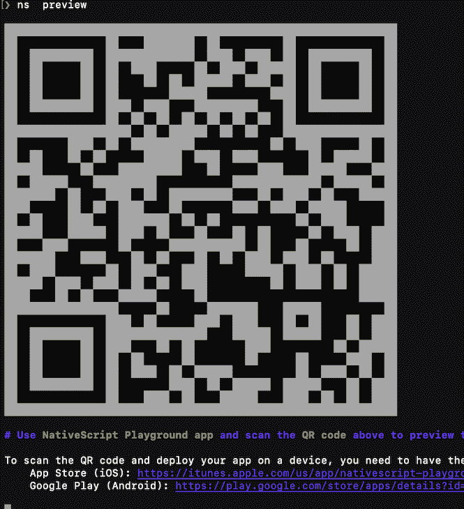
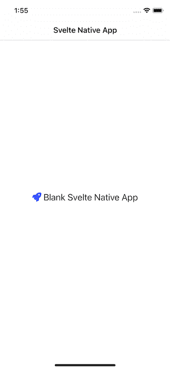
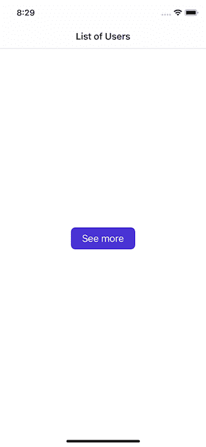
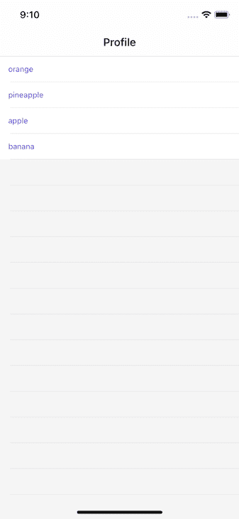
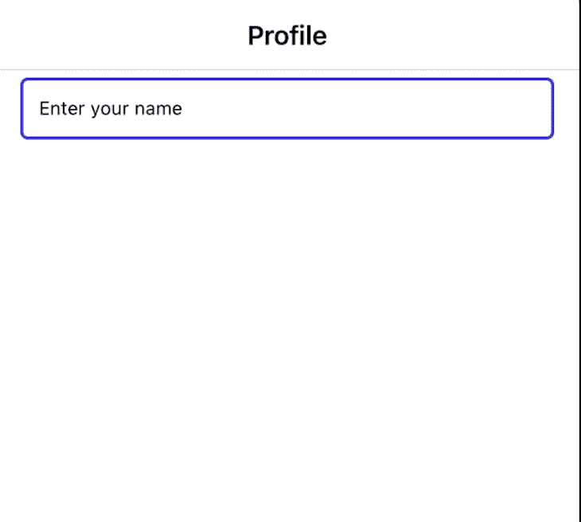
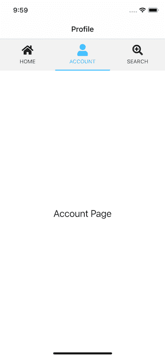

# 构建一个苗条的原生 iOS 应用程序- LogRocket 博客

> 原文：<https://blog.logrocket.com/building-svelte-native-ios-app/>

Svelte Native 是一个用 Svelte 和 NativeScript 开发原生 iOS 和 Android 应用的框架，提供了连接 Svelte 和 NativeScript 所需的层。

通过将 JavaScript 生态系统中的两种强大技术结合起来，开发人员可以用 Svelte 编写移动应用程序逻辑，同时用自定义的 Svelte 原生组件构建 UI，这些组件实际上就是 NativeScript 组件。

与 Ionic 等使用 web 技术和 WebView 来呈现应用程序的移动应用程序开发框架不同，NativeScript 直接与原生 API 通信，使 UI 呈现速度更快，并为移动应用程序提供真正的原生外观。

在这篇文章中，我们将学习什么是 svelite Native，如何使用它的组件，以及构建一个简单的 Svelte Native iOS 应用程序。

## 开始使用 Svelte Native

因为 [Svelte Native 使用 NativeScript](https://github.com/halfnelson/svelte-native) ，所以运行以下命令来全局安装 NativeScript:

```
npm i -g nativescript

```

要创建一个简单的本地初学者应用程序，请在您的终端中运行以下命令:

```
npx degit halfnelson/svelte-native-template svelte-native-app
cd svelte-native-app
npm i

```

现在我们已经安装了依赖项，让我们运行我们的应用程序。

为了在物理设备上运行应用程序，我们需要在移动设备上安装两个来自 NativeScript 团队的应用程序: [NativeScript Playground](https://apps.apple.com/us/app/nativescript-playground/id1263543946?ls=1) 和 [NativeScript Preview](https://apps.apple.com/us/app/nativescript-preview/id1264484702) 。

安装完这两个应用后，在 Svelte 原生应用的根目录下运行`ns preview`，用刚安装的 NativeScript Playground 扫描终端中的二维码:



要在任何 iOS 模拟器上运行您的应用程序，请运行`ns run ios`。构建和编译后，应用程序会在默认的 iOS 模拟器上启动:



需要注意的重要一点是，Svelte Native 默认使用 TypeScript。

## 使用纤细的原生组件

苗条的原生拥有许多[内置的](https://svelte-native.technology/docs#components)[–](https://svelte-native.technology/docs#components)[中的组件，这些组件中的](https://svelte-native.technology/docs#components) [实际上是](https://svelte-native.technology/docs#components) [的原生脚本组件](https://svelte-native.technology/docs#components)。为了演示它们如何在应用程序中工作，让我们看看按钮组件是如何工作的。

### 在 Svelte Native 中添加一个`button`组件

要添加和使用一个`button`组件，添加以下内容:

```
<button text="See more" on:tap="{onButtonTap}" />

```

请注意，在一个苗条的应用程序中，我们用`on:tap`事件来处理点击，而不是用`on:click`事件。这遵循事件处理程序的 NativeScript 实现，而不是 Svelte。

此外，苗条的本地按钮不同于 HTML 按钮元素。苗条的原生按钮是一个自关闭标签，UI 上渲染的文本与`text`道具放在一起。

下面是应用了一些样式的按钮的外观:



当在一个苗条的本地项目中工作时，需要注意的一件重要事情是如何呈现本地脚本和苗条的组件。

呈现 NativeScript 组件时，标记必须以小写字母开头:

```
<actionBar title="Hello World" /> 

```

然而，细长的组件是大写的，就像在`<ChildComponent />`中一样。组件之间的这种差异使编译器能够区分瘦组件和原生脚本组件。

### 在 Svelte Native 中添加一个`page`组件

`page`组件是顶级父组件，它将所有其他组件包装在我们的应用程序屏幕中。这意味着每个屏幕应该只有一个`page`组件:

```
<page>
  <actionBar title="List of Users" />
  <flexboxLayout justifyContent="center" alignItems="center">
    <button text="See more" on:tap={onItemTap} />
  </flexboxLayout>
</page>

```

### 在 Svelte Native 中添加一个`actionBar`组件

`<actionBar />`组件代表活动窗口顶部的工具栏，并为标题提供专用空间，让用户知道他们在应用程序中的位置。`actionBar`接受一个`title`道具，如下图所示:

```
<page>
  <actionBar title="Profile" /> 
</page>

```

然后，代码呈现一个标题为“Profile”的页面，如下所示:


### 在 Svelte Native 中添加一个`listView`组件

`listView`组件为我们提供了一种列出通常为数组的项目的方法，它的工作方式类似于 HTML 中的`ul`标签。

`listView`接受一个名为`item`的道具，该道具接受一个 JavaScript 数组，`on:itemTap`处理每个`listView`项的点击事件。最后，我们可以使用来自 Svelte Native 的`Template`组件来呈现每个数组项:

```
<script>
  import { Template } from "svelte-native/components";
  let fruits = ["orange", "pineapple", "apple", "banana"];

const onItemTap = (args) => {
       console.log(args);   
  }
</script>

<page>
  <listView items={fruits} on:itemTap={onItemTap} row="1" colSpan="2">
      <Template let:item>
        <flexboxLayout>
          <label text={item} textWrap="true" />
        </flexboxLayout>
      </Template>
    </listView>
</page>

```

上面的代码然后在我们的应用程序页面上呈现以下水果列表:



需要注意的重要一点是，Svelte 中的`{#each...}`指令不能迭代`ListView`组件中的条目列表。相反，我们必须使用`<Template let:item>`，如上所示。

### 在 Svelte Native 中添加一个`textField`组件

`textField`组件提供了一个类似于 HTML 中的[输入元素的输入字段接口。](https://developer.mozilla.org/en-US/docs/Web/HTML/Element/input)

它接受设置组件值的`text`属性、设置占位符文本的`hint`属性和将组件设置为`readonly`的`editable`属性。

我们可以使用`bind:text`指令激活双向数据绑定:

```
    <textField bind:text={textFieldValue} hint="Enter your name" />

```

上面的代码然后呈现一个字段，供用户在我们的应用程序中提供他们的姓名:



### 在 Svelte Native 中添加一个`tab`组件

`tab`组件默认在窗口顶部显示一个选项卡界面。这允许用户选择和移动不同的屏幕，同时支持手势和每个视图之间的转换。



作为奖励，添加`tabContentItem`允许用户通过滑动在视图之间切换。

## 用 Svelte Native 构建 iOS 应用程序

在本节中，我们将使用 Svelte Native 构建一个简单的移动应用程序。我们还将使用`listView`、`flexboxLayout`和`navigate`。

`navigate` will 帮助我们学习如何通过`navigate`函数传递和接收道具。为了展示如何使用`listView`，我们将从外部 API 获取数据，并用`listView`组件呈现它。

下面是我们将创建的应用程序的最终版本:


### 创建苗条的应用

我们必须首先在根组件`App.svelte`中构建应用程序的父组件。首先，我们必须首先导入 Svelte 来创建我们的 Svelte 应用程序:

```
<script lang="javascript">
  import { onMount } from "svelte";
  import { Template } from "svelte-native/components";
  import Details from "./pages/Details.svelte";
  import { navigate } from "svelte-native";
  let users = [];
  const getUsers = async () => {
    try {
      let res = await fetch("https://jsonplaceholder.typicode.com/users");
      let data = await res.json();
      users = data;
    } catch (err) {
      console.log(err);
    }
  };
  function onItemTap(args) {
    navigate({
      page: Details,
      props: { user: users[args.index] },
    });
  }
  onMount(async () => {
    await getUsers();
  });
</script>

```

通过使用`getUser`函数，我们可以使用获取 API 对 API 进行[异步调用，并将结果保存到我们通过设置`users = data`创建的`users`数组中。](https://blog.logrocket.com/modern-browser-apis-to-use-today/#fetch-api)

然后我们可以调用`onMount`生命周期钩子上的`getUsers()`，它将加载页面。

`onItemTap`函数使用了我们从顶部的`svelte-native`导入的`navigate`函数。我们以编程方式将用户导航到一个`Details`页面(我们将在后面创建这个页面),并在`props`选项中传递被点击的项目。

### 创建苗条的用户界面

现在我们已经设置好了逻辑，让我们来处理应用程序的 UI:

```
<page>
  <actionBar title="List of Users" />
  <flexboxLayout>
    <listView items={users} on:itemTap={onItemTap} row="1" colSpan="2">
      <Template let:item>
        <flexboxLayout>
          <label text="Name:" textWrap="true" class="first" />
          <label text={item.name} textWrap="true" class="name" />
        </flexboxLayout>
        <flexboxLayout>
          <label text="Username:" textWrap="true" class="first" />
          <label
            text={"@" + item.username.toLowerCase()}
            textWrap="true"
            class="last"
          />
        </flexboxLayout>
        <flexboxLayout>
          <label text="Email:" textWrap="true" class="first" />
          <label text={item.email} textWrap="true" class="first" />
        </flexboxLayout>
      </Template>
    </listView>
  </flexboxLayout>
</page>

```

注意我们如何使用`flexboxLayout`来对齐我们的内容。这类似于 CSS 中的 flexbox 的工作方式。默认情况下，`flexboxLayout`将我们的内容排成一行。

注意这里的`<Template let:item>`必须叫`item`；任何其他名称都会引发错误。

#### 创建详细信息页面

还记得之前我们将`props`中的点击项传递给`navigate`函数吗？现在我们需要接收这些数据。为此，使用我们必须导航到的`Details.svelte`组件中的`export let user;`道具。

这意味着我们现在可以通过`user`访问数据；它被称为`user`,因为这是我们在`navigate`函数中使用的:

```
function onItemTap(args) {
 navigate({
      page: Details,
      props: { user: users[args.index] },
    });
  }

```

现在，我们可以导航到`pages/Details.svelte`组件:

```
<script>
  export let user;
</script>
<page>
  <stackLayout>
    <flexboxLayout>
      <label text={user.name} textWrap="true" class="name" />
    </flexboxLayout>
    <flexboxLayout>
      <label
        text={"@" + user.username.toLowerCase()}
        textWrap="true"
        class="last"
      />
    </flexboxLayout>
    <flexboxLayout>
      <label text="Email:" textWrap="true" class="first" />
      <label text={user.email} textWrap="true" class="first" />
    </flexboxLayout>
    <label text={user.address.city} textWrap="true" class="first" />
    <label text={user.address.street} textWrap="true" class="first" />
    <label text={user.phone} textWrap="true" class="first" />
  </stackLayout>
</page>

```

## **结论**

虽然 Svelte Native 是一个社区项目，还没有得到 Svelte 和 NativeScript 的官方支持，但该框架显示出了巨大的前景。它带有大多数移动应用程序都有的基本组件，并且具有高效的性能。

这个演示的所有代码都可以在 GitHub 上找到。请随意发表评论，让我知道你对这篇文章的看法。你也可以在[推特](https://twitter.com/ejirocodes)和 [LinkedIn](https://www.linkedin.com/in/ejiro-asiuwhu/) 上找到我。感谢您的阅读！

## 使用 [LogRocket](https://lp.logrocket.com/blg/signup) 消除传统错误报告的干扰

[](https://lp.logrocket.com/blg/signup)

[LogRocket](https://lp.logrocket.com/blg/signup) 是一个数字体验分析解决方案，它可以保护您免受数百个假阳性错误警报的影响，只针对几个真正重要的项目。LogRocket 会告诉您应用程序中实际影响用户的最具影响力的 bug 和 UX 问题。

然后，使用具有深层技术遥测的会话重放来确切地查看用户看到了什么以及是什么导致了问题，就像你在他们身后看一样。

LogRocket 自动聚合客户端错误、JS 异常、前端性能指标和用户交互。然后 LogRocket 使用机器学习来告诉你哪些问题正在影响大多数用户，并提供你需要修复它的上下文。

关注重要的 bug—[今天就试试 LogRocket】。](https://lp.logrocket.com/blg/signup-issue-free)