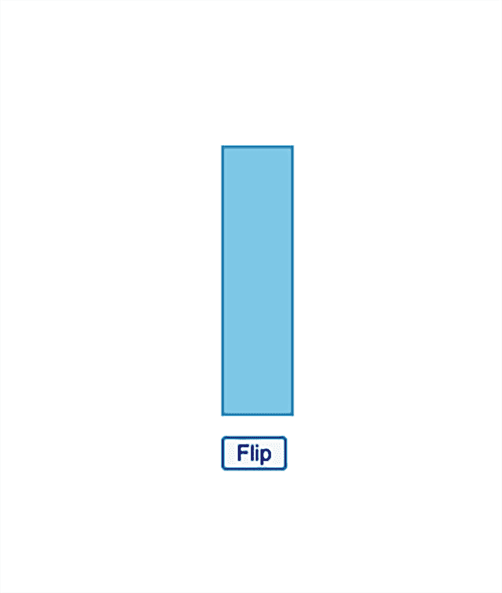
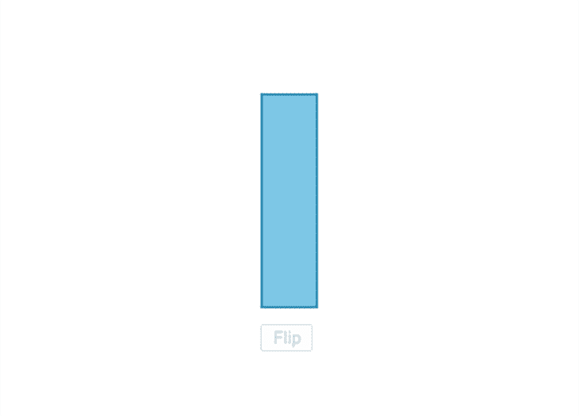

# 用普通 JavaScript 用 WebC 构建 web 组件

> 原文：<https://blog.logrocket.com/building-web-components-with-webc-vanilla-javascript/>

*目录:*

## 什么是 web 组件？

Web 组件是自定义的、可重用的、强封装的 HTML 组件，它与库无关，可以在任何 JavaScript 项目中使用。

一个流行的 web 组件的例子是`<video>`标签。虽然`video`可能看起来像一个 HTML 元素，但实际上，它由几个 HTML 元素和定义其行为的定制逻辑组成。

## 为什么要使用 web 组件？

那么，为什么要使用 web 组件呢？概括地说，web 组件的两个主要优势是封装性和缺乏外部依赖性。

Web 组件通过允许您将 CSS 和 JavaScript 代码的影响限制在组件范围内来解决封装问题。

当然，像 React 和 [Angular](https://blog.logrocket.com/tag/angular) 这样的流行 JavaScript 框架可以帮助你实现类似的封装效果。那么，是什么让 web 组件与众不同呢？这个问题给我们带来了第二个优势:web 组件是库不可知的，您可以只使用内置的 JavaScript APIs 来创建它们。

在设计 UI 组件库时，web 组件与库无关的特性尤其有用。与其他为特定框架构建的库不同，您可以使用 web 组件来构建一个不与单一技术栈耦合的库。这意味着任何人都可以使用它，不管他们的项目使用的是什么 JavaScript 框架。

### Web 组件规范

通常，在创建 web 组件时，您将使用三种规范/技术:

*   [自定义元素](https://developer.mozilla.org/en-US/docs/Web/Web_Components/Using_custom_elements):创建 HTML 元素的 API，用来封装您的自定义 HTML、JavaScript 和 CSS 代码
*   [Shadow DOM](https://developer.mozilla.org/en-US/docs/Web/Web_Components/Using_shadow_DOM) :一个 API，将一个隐藏的 DOM 附加到一个元素上，这个元素不会与应用程序其他部分的 CSS 或 JavaScript 代码冲突
*   [模板](https://developer.mozilla.org/en-US/docs/Web/Web_Components/Using_templates_and_slots):重用标记结构的 API。使用`<template>`标签，您可以定义一个标记结构，它不会在页面加载时立即呈现，而是使用 JavaScript 复制

要了解关于这些规范的更多信息，以及 web 组件与 React 等 JavaScript 框架相比如何，请查看这个 [LogRocket 博客](https://blog.logrocket.com/react-vs-web-components/)帖子。

### web 组件的限制

就像任何技术一样，web 组件也有局限性。让我们简单介绍一下。

Web 组件要求浏览器允许在您的 web 应用程序上运行 JavaScript，即使您的 web 组件纯粹是表示性的，不包含任何交互式 JavaScript 代码。

通常，您需要以命令的方式编写 web 组件，而不是以声明的方式。这导致了有些笨拙的创作体验，尤其是在实现更高级的技术时，比如渐进式增强。我们将在后面的章节中更详细地讨论这一点。

## WebC 如何提供帮助

正如您可能已经猜到的，WebC 有助于解决使用 web 组件时的一些问题。

WebC 是一个为 web 组件生成标记的序列化器。它与框架无关，并提供了各种有用的编译工具，使编写 web 组件变得更加容易。

正如我提到的，web 组件通常要求 JavaScript 可用，即使对于其中没有任何 JavaScript 的 web 组件也是如此。但是有了 WebC，就不是这样了。即使浏览器禁用了 JavaScript，您也可以创建只显示 HTML 的 web 组件。这是因为 WebC 将您的 web 组件代码编译成一个简单的 HTML 输出。

在编写 web 组件时，WebC 提供了更好的创作体验。使用 WebC，您可以创建易于编写和维护的单文件 web 组件。它们整合您的 HTML、CSS 和 JavaScript 代码，并使用模板和 Shadow DOM 等功能简化这个过程。

这还只是皮毛:WebC 有更多的特性和定制，使得编写 web 组件成为一种更愉快的体验。查看[他们的文档](https://github.com/11ty/webc)以获得所有功能和选项的更详细概述。

## 在普通 JavaScript 项目中使用 WebC 构建定制 web 组件

让我们来看看 WebC 是如何运作的！在本教程中，我们将构建一个自定义组件，它带有一个按钮和一个当您单击按钮时会旋转的框。这是一个非常不自然的例子，但是它仍然可以帮助我们说明使用 WebC 的好处。


首先，您需要建立一个 JavaScript 项目。我将使用 [Vite](https://vitejs.dev/) 快速启动一个新项目。

您还需要安装 Node.js 我们将使用它来运行我们的 WebC 编译脚本，该脚本将生成静态文件，Vite 将提供这些文件。

一旦你建立了你的项目，运行`yarn add @11ty/webc`来安装 WebC。接下来，让我们添加我们的`main.js`脚本，该脚本将注册 WebC 页面并将其内容写入项目根目录下的`index.html`:

```
import { WebC } from "@11ty/webc";
import fs from "fs";
let page = new WebC();
page.defineComponents("components/**.webc");
page.setInputPath("page.webc");
let { html, css, js, components } = await page.compile();
fs.writeFile("./index.html", html, (err) => {
  if (err) {
    console.log({ err });
  }
});
```

所以，这就是上面发生的事情:

*   首先，我们实例化一个 WebC 页面对象。这是将包含我们的自定义 web 组件的页面
*   使用`page.setInputPath("page.webc");`，我们为页面定义内容源。WebC 页面和组件通常有一个`.webc`文件扩展名
*   使用`page.defineComponents("components/**.webc");`，我们定义保存 web 组件的文件夹
*   我们调用`page.compile()`将页面内容聚合并编译成静态 HTML 输出
*   最后，我们将输出 HTML 写到`index.html`文件中

在我们继续深入之前，让我们简要地了解一下页面和组件之间的区别。在 WebC 中，页面是以`<!doctype`或`<html`开头的文件，通常用于显示整个页面。

组件是用于显示可重用 UI 片段的任何其他 WebC 文件。

现在，让我们创建我们的`page.webc`文件并尝试运行我们的脚本。该文件将包含一个基本的 HTML 页面设置:

```
<!-- HTML-->
<!DOCTYPE html>
<html lang="en">
  <head>
    <meta charset="UTF-8">
    <meta http-equiv="X-UA-Compatible" content="IE=edge">
    <meta name="viewport" content="width=device-width, initial-scale=1.0">
    <title>WebC tutorial</title>
  </head>
  <body>
    <my-component></my-component>
  </body>
  <style>
    body {
      padding: 20%;
    }
  </style>
</html>
```

你可能已经注意到，这看起来就像我们的标准 HTML，这是因为它是！对于 WebC，除了一些需要添加一些 WebC 语法的情况，您可以使用常规的 HTML、JavaScript 和 CSS。

现在让我们试着运行我们的脚本。您可以简单地使用`node main.js`命令来运行它。为了更好的开发者体验，我推荐使用 nodemon 的[。它将获取您对脚本所做的任何更改，并自动重新运行该文件。](https://blog.logrocket.com/nodemon-tutorial-automatically-restart-node-js-apps-with-nodemon/)

下面是我在本教程中使用的 nodemon 命令:

```
nodemon main.js -e js,webc,html

```

接下来，让我们通过创建`components`文件夹并将`my-component.webc`文件放在那里来添加我们的 web 组件。我们来补充以下内容:

```
<!-- HTML-->
<div id="rectangle"></div>
<button id="flipper">Flip</button>
<style webc:scoped>
  #rectangle {
    background-color: skyblue;
    width: 40px;
    height: 160px;
    border: 2px #4ba3c6 solid;
  }

  button {
    margin-top: 12px;
    width: 40px;
  }
</style>
```

同样，我们使用简单的 HTML 和 CSS 来为我们的盒子设置按钮和`div`并设置样式。

上例中一个值得注意的部分是我们的`style`标签中的`webc:scoped`属性。这个标签允许你在你的组件中封装你的 CSS 代码。

当您将该属性添加到一个`style`标签中时，WebC 将在编译期间自动生成一个惟一的散列字符串类并将其分配给组件元素。然后，它在组件中声明的所有 CSS 选择器的前面加上这个散列字符串的前缀。

像`emotion`和`styled-components`这样的流行样式库使用类似的哈希生成机制来包含定制组件中的样式。

### 向我们的 web 组件添加 JavaScript 功能

到目前为止，我们已经定义了 web 组件的外观，但是它并没有做太多的事情。让我们添加一些用于交互的 JavaScript 代码。

在同一个 web 组件中，在`style`标记的正下方，添加一个带有以下 JavaScript 代码的`script`标记:

```
<!-- HTML-->
<script>
  let deg = 0;
  document.getElementById("flipper").onclick = () => {
    const rectangle = document.getElementById("rectangle");
    const nextDeg = deg === 0 ? 90 : 0;
    rectangle.style.transform = `rotate(${nextDeg}deg)`
    deg = nextDeg;
  }
</script>
```

在这里，我们简单地向按钮添加了一个`onclick`监听器，通过更新`transform`样式属性来旋转矩形。注意，我们不必使用`customElements.define`来全局定义我们的 web 组件；我们简单地添加了 JavaScript 代码来驱动我们的按钮。

仅此而已。现在我们有了一个功能正常的简单 web 组件。如果您使用扩展为您的本地服务器关闭 JavaScript，我们的 web 组件仍然会显示，尽管这个按钮不会做任何事情。

## 使用 WebC 进行渐进式增强

WebC 的另一个强大功能是简化向应用程序添加渐进式改进的过程。

[渐进式增强](https://blog.logrocket.com/understanding-progressive-enhancement/)是一种模式，允许用户首先访问网站的基本内容和功能。之后，如果用户的浏览器功能和互联网连接允许，用户将获得 UI 增强和更多的交互式功能。

让我们为组件添加一个简单的渐进式增强处理，方法是禁用按钮，直到 JavaScript 可用。


首先，我们需要更新我们的`script`标签中的代码:

```
<!-- HTML-->
<script>
  let deg = 0;
  class MyComponent extends HTMLElement {
    connectedCallback() {
      document.getElementById("flipper").onclick = () => {
        const rectangle = document.getElementById("rectangle");
        const nextDeg = deg === 0 ? 90 : 0;
        rectangle.style.transform = `rotate(${nextDeg}deg)`
        deg = nextDeg;
      }
    }
  }
  window.customElements.define("my-component", MyComponent)
</script>
```

这里，我们使用标准模式通过`window.customElements.define`来定义 web 组件，以便能够等待 JavaScript 变得可用。

现在让我们将 CSS 处理添加到我们的按钮中:

```
<!-- HTML-->
<style webc:scoped>
  #rectangle {
    background-color: skyblue;
    width: 40px;
    height: 160px;
    border: 2px #4ba3c6 solid;
  }

  button {
    margin-top: 12px;
    width: 40px;
  }

  :host:not(:defined)>button {
    opacity: 0.2;
    cursor: not-allowed;
  }
</style>
```

如您所见，我们正在使用`:host:not(:defined)`选择器。这个选择器来自 Shadow DOM API，允许您在 web 组件加载时为它们定义特殊的样式。

不过，WebC 确实有自己的解释:当你的代码被编译时，它会用生成的 hash string 类替换`:host`部分。

现在，如果您要关闭本地服务器的 JavaScript，您会看到该按钮是灰色的，更明显的是该按钮不做任何事情。


您可以使用相同的模式对您的 web 页面进行任何您想要的渐进式增强处理。

## 结论

这个帖子到此为止。我们讨论了 web 组件、它们的用例，以及它们与 JavaScript 框架的比较。

此外，我们讨论了 WebC 如何减轻 web 组件的一些缺点，并帮助我们获得它们的全部好处。

## 通过理解上下文，更容易地调试 JavaScript 错误

调试代码总是一项单调乏味的任务。但是你越了解自己的错误，就越容易改正。

LogRocket 让你以新的独特的方式理解这些错误。我们的前端监控解决方案跟踪用户与您的 JavaScript 前端的互动，让您能够准确找出导致错误的用户行为。

[](https://lp.logrocket.com/blg/javascript-signup)

LogRocket 记录控制台日志、页面加载时间、堆栈跟踪、慢速网络请求/响应(带有标题+正文)、浏览器元数据和自定义日志。理解您的 JavaScript 代码的影响从来没有这么简单过！

[Try it for free](https://lp.logrocket.com/blg/javascript-signup)

.