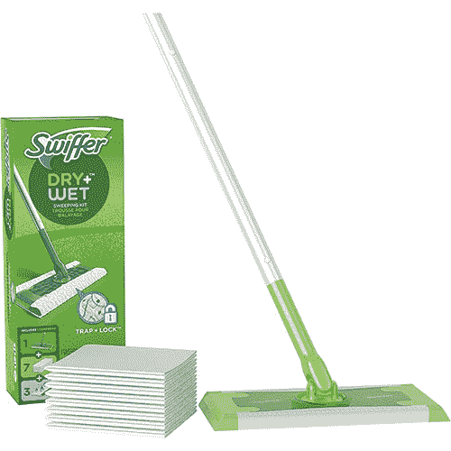
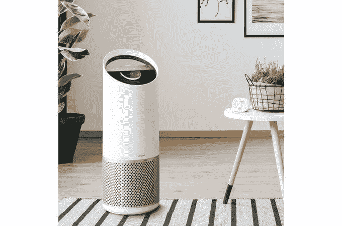
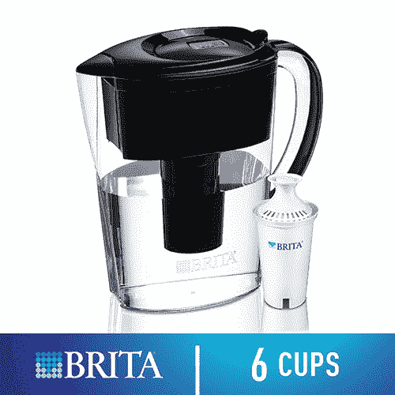

# 专属产品定价:如何装饰核心产品

> 原文：<https://blog.logrocket.com/product-management/captive-product-pricing-how-to-accessorize-core-products/>

当你去超市买咖啡机时，你也需要买咖啡豆来煮咖啡。不买咖啡豆，咖啡机就只是你厨房柜台上的另一台机器。

同样，当你买了一个 Xbox，你就不得不花钱买几个游戏。没有它，它将是一个无用的金属盒子，占据你房子里的空间。

这些都是专属产品定价的完美例子。在本文中，我们将详细介绍专属产品定价、它的工作原理、好处、科技和 SaaS 公司如何使用它等等。

* * *

*向前跳过:*

* * *

## 什么是专属产品定价？

很多时候，客户必须额外购买才能使用他们购买的原始产品。由于母公司清楚地知道客户必须购买补充产品或与核心产品兼容的配件，因此它们将配件定价过高。

这种定价策略——让同一客户进一步投资于配件以充分利用核心产品——被称为专属产品定价。

不同寻常的是，核心产品是一次性购买，配件可以反复购买。在某些情况下，客户需要购买的配件仅由同一家制造商出售。通过这种方式，公司可以保证从购买其核心产品的相同客户那里获得额外的购买。

如果客户购买的核心产品没有配件就无法工作，他们肯定会购买配件。从逻辑上讲，这种策略有助于提高销售额和利润率。

## 受控产品定价的真实例子

市场上有许多产品采用专属产品定价策略，其中一些您可能会在自己家里使用。让我们详细看一些例子。

### 家用清洁产品

您可能会使用清洁产品，如地毯或地板清洁剂，这需要您购买核心产品(一次性投资)并购买填充垫来使用它。Swiffer 就是这样一个例子。

Swiffer 提供带拖把的入门套件，可根据您的需求搭配干垫或湿垫使用。它的工作原理是将垫子附在拖把上，一旦清洁完成，垫子就被扔掉。虽然它需要频繁地在笔芯上进行额外的投资，但是它易于使用，并且清洁快速且不脏乱。

由于这些优势，客户购买笔芯是值得的:

Source: [https://www.walmart.ca/en/ip/New-Swiffer-Sweeper-Mop-Dry-And-Sweeper-Floor-Swiffer-All-Kit-Purpose-Wet-Cleaning-Walmart-Canada/PRD56H312M9XPPH](https://www.walmart.ca/en/ip/New-Swiffer-Sweeper-Mop-Dry-And-Sweeper-Floor-Swiffer-All-Kit-Purpose-Wet-Cleaning-Walmart-Canada/PRD56H312M9XPPH).

### 空气净化器

空气净化器是垄断产品定价的另一个例子。由于灰尘、宠物皮屑或其他常见刺激物，许多人都经历过恼人的过敏症状。

空气净化器配有风扇和过滤器。它们通过减少空气中的过敏原，如花粉、霉菌孢子、烟雾、宠物皮屑等，改善室内空气。当你购买空气净化器时，它会附带一个过滤器……但是在使用几个月后，你必须更换过滤器。

这些 HEPA 过滤器的制造与某些型号的空气净化器兼容。空气净化器只能使用为其制造的特定过滤器。如果没有过滤器，空气净化器将只是一个风扇，实际上不会捕获灰尘和花粉样的颗粒。因此，这是受控产品定价的另一个极好的例子:

Source: [https://www.trusens.com/en-ca/p/air-purifiers/air-purifiers-1/](https://www.trusens.com/en-ca/p/air-purifiers/air-purifiers-1/).

### 过滤水水罐

水罐是几乎每个人家里都有的产品。

当你买一个带过滤器的水罐时，它有助于净化水罐中的水。Brita 是一个常见的品牌，销售这些带过滤器的水罐。

如果没有过滤器，水罐就只是一个水罐。它不能过滤水中的杂质。一旦你购买了这个核心产品(通常带有一个过滤器)，你需要每 3-4 个月更换一次过滤器。Brita pitchers 甚至会告诉你何时需要续杯！

这种策略使得客户只要有水罐，就会继续购买过滤器:

Source: [https://www.walmart.ca/en/ip/brita-small-6-cup-water-filter-pitcher-with-1-standard-filter-bpa-free-space-saver-black-black/6000192236724](https://www.walmart.ca/en/ip/brita-small-6-cup-water-filter-pitcher-with-1-standard-filter-bpa-free-space-saver-black-black/6000192236724).

## SaaS 产品的专属产品定价

对于 SaaS 产品，公司以较低的价格提供核心产品，并对附加功能收取更高的费用。核心产品通常要么是免费的，要么包含少量的基本成本。这里的想法是提供基本功能，展示产品可以提供的价值。他们通常还展示高级功能，吸引用户升级他们的订阅。

以最低的基本价格销售核心产品是吸引顾客和建立品牌忠诚度的绝佳方式。与此同时，公司有机会展示高级功能，从而扩大功能的销售。

* * *

订阅我们的产品管理简讯
将此类文章发送到您的收件箱

* * *

这方面的一个例子是供产品经理创建产品路线图的软件。产品有免费试用期，作为产品经理，这个免费试用产品可以用来[创建一个基本的产品路线图](https://blog.logrocket.com/product-management/what-is-a-product-roadmap-templates/)。但是，如果您需要复杂的优先级排序技术，那么您将需要购买订阅。

分层定价模式是专属产品定价策略的一个例子。许多 SaaS 产品都遵循这一模式。它允许公司根据每个计划中可用的功能，以不同的价格点提供多个计划或套餐。不同公司提供的套餐数量可能会有很大差异，但通常会提供低、中、高价位的套餐。

这里要注意的关键点是，核心产品在 SaaS 企业中销售时，必须是实用且有价值的。他们仍然允许用户升级他们的订阅，如果他们想使用先进的功能，但可以很好地发挥自己的作用。

## 专属产品定价的好处

现在，我们已经了解了受控产品定价，让我们深入了解一下遵循这种定价策略的好处。遵循这种方法，公司可以在许多方面受益。我们将在下面详细介绍。

### 增加收入

公司可以通过溢价销售配件或补充产品来增加收入。如果顾客需要，他们会继续购买。

### 控制竞争

如果核心产品只能使用同一家公司的特定配件或补充产品，消费者就不太可能购买替代的、更便宜的产品。这减少了竞争,防止顾客转向另一个品牌。

### 创造忠诚的客户

一旦客户购买了核心产品，他们必然会购买其配件，以使其具有功能性。类似于它如何控制竞争，因为他们已经投资于核心产品，这些客户可能不会转向替代产品。

### 保持对供应的控制

公司可以分析互补产品的使用模式，并在一定程度上预测近期的需求。这使得创造符合需求的产品变得更加容易，从而减少浪费，并对市场上现有的产品进行更多的控制。

### 提升品牌形象

如果配件和核心产品的组合提供了一个很好的解决方案，能够真正解决消费者的痛点，消费者就会愿意在配件上投资。这有助于提升产品的品牌形象，因为人们知道核心产品和配件满足他们的需求。

这里需要注意的是，有时专属产品定价也会让客户感到沮丧。我们都去过，很容易觉得配套产品太贵了，每次都是为了用产品才买的。因此，公司在使用这种策略时必须仔细决定产品定价。

## 使用专属产品定价有什么风险？

专属产品定价策略是增加收入和忠诚客户以及减少竞争的绝佳方法。在你开始这个策略之前，了解相关的风险也是很重要的。

随着时间的推移，重复购买互补产品可能会导致客户沮丧和不满意。基于配件和核心产品组合所带来的价值，客户应该愿意重复投资配件。

公司应该继续提供创新和升级的配件，以吸引现有用户的重复投资。这可以激发用户尝试仍然与他们的核心产品兼容的新附件产品的热情。

定价过高的配件会导致销售损失，并最终损害品牌形象，因此配件的定价不得高于核心价格。在这种情况下，客户可能会失去信任，不再愿意投资该品牌。他们可能认为公司本身贪婪或不道德。

## 专属产品定价对你的产品有用吗？

要决定专属产品定价是否是产品的正确策略，需要彻底检查几个因素。让我们来看看这些因素:

1.  **互补的产品和配件**:你应该有一个互补的产品和配件组合，共同提供一个优秀的解决方案。如果产品彼此不相关，或者解决不同的问题，而这些问题又不能联系在一起，那么利用这种策略就没有意义
2.  **客户行为**:研究目标受众的购买行为，以确定他们是否愿意为专属产品支付额外费用
3.  **核心和附属产品的合理定价点**:附属产品[必须谨慎定价](https://blog.logrocket.com/product-management/price-sensitivity-analysis-definition-how-to/)，以确保它值得客户投资。对补充产品和核心产品定价过高会导致不满意的结果。许多公司亏本出售核心产品，而以较高的价格来补偿配套产品。这两种产品的价格都应该对顾客有吸引力
4.  **市场需求**:应评估对专属产品的需求，以及市场上竞争对手提供的类似产品的需求，以确定是否有足够的需求来支持专属产品定价

对这些因素的详细评估有助于确定专属产品定价策略是否适合特定产品。

## 结论

如果您拥有核心产品和附属产品的正确组合，专属产品定价策略可以成为培养忠诚客户和增加收入的绝佳工具。然而，同样重要的是正确执行专属产品战略，并经过仔细考虑，以获得其全部利益。

*精选图片来源:[icon scout](https://iconscout.com/icon/product-2676449)*

## [LogRocket](https://lp.logrocket.com/blg/pm-signup) 产生产品见解，从而导致有意义的行动

[LogRocket](https://lp.logrocket.com/blg/pm-signup) 确定用户体验中的摩擦点，以便您能够做出明智的产品和设计变更决策，从而实现您的目标。

使用 LogRocket，您可以[了解影响您产品的问题的范围](https://logrocket.com/for/analytics-for-web-applications)，并优先考虑需要做出的更改。LogRocket 简化了工作流程，允许工程和设计团队使用与您相同的[数据进行工作](https://logrocket.com/for/web-analytics-solutions)，消除了对需要做什么的困惑。

让你的团队步调一致——今天就试试 [LogRocket](https://lp.logrocket.com/blg/pm-signup) 。

[Monica Dhiman Follow](https://blog.logrocket.com/author/monicadhiman/) I am passionate about solving business problems by bringing the team together and removing impediments. I started my career as a business analyst before moving into product management. I am a Certified Scrum Master and I also write my thoughts about product management at [MonicaDhiman.com](http://monicadhiman.com).