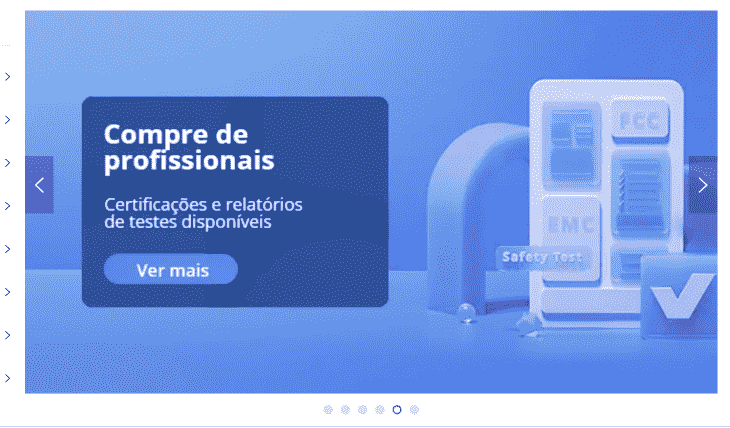
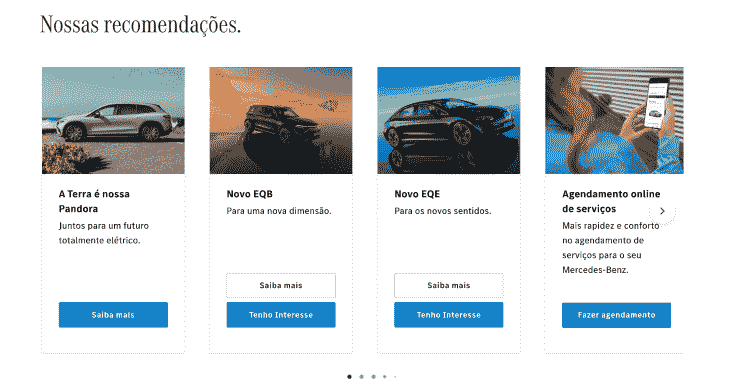
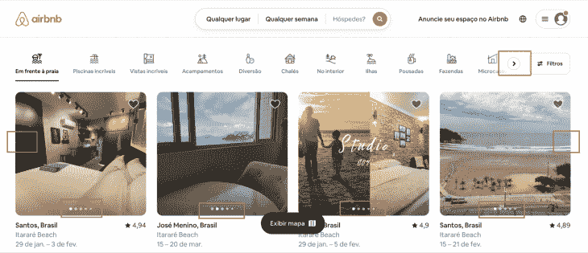

# 旋转木马 UX:设计吸引用户的旋转木马

> 原文：<https://blog.logrocket.com/ux-design/carousel-ux-designing-carousels-attract-users/>

旋转木马到处都是，而且已经有一段时间了。这背后有一个原因:它们很实用，允许你在一个部分显示许多内容，使你的内容非常有条理。别忘了，它们也很容易开发。

您通常会看到旋转木马用于突出显示特定内容，如产品、促销和幻灯片中的图像，您可以与之互动。

然而， [Baymard Institute](https://baymard.com/blog/homepage-carousel) 的研究显示，美国和欧洲顶级电子商务网站之间旋转木马的使用逐年减少。

你知道这背后的原因吗？

今天，我们将讨论设计师群体不鼓励使用旋转木马的主要原因，以及您是否仍然可以安全地使用它们。

为了理解为什么旋转木马成为近年来 UX 设计师的主要关注点。以及如何有效地使用它们，重要的是首先要理解它们的 UI 组成，并意识到需要注意的特定组件。

我给你一个列表，分成三个主要部分:第一，你会在互联网周围的大部分传送带上看到的组件；接下来，重要的和依赖于你的转盘的上下文的组件；最后，您应该不惜一切代价避免的组件。

## 基本转盘组件

有效的旋转式传送带需要这些组件:

*   **容器元素**:这是保存转盘中所有项目的主要元素。它通常是一个`div`或其他类型的容器，被设置为特定的宽度和高度
*   **项目**:这些是将在转盘内旋转的单个元素，比如图像、文本或其他类型的内容。它们通常在容器元素内一个接一个地水平排列
*   **描述轮播内容的文本**:如果轮播中没有文本，或者只有图像不足以告诉用户该部分的内容，那么这个组件可能很重要
*   **导航按钮**:这些按钮，比如“下一个”和“上一个”，有时用一个箭头表示，允许用户手动浏览转盘
*   **播放/暂停按钮**:允许用户停止或开始转盘自动旋转的按钮——如果使用自动旋转，这一点非常重要

利用这些元素的一个网站是[存照片](https://br.depositphotos.com/)。它不使用自动旋转，一开始只显示一个箭头，一旦开始旋转，就会显示下一个箭头，从而清楚地表明可以从哪一侧开始滚动。

图像的数量几乎可以在这样的部分上模仿，网站的目的只是让你领略一下这个部分的内容。

但是在这篇文章的后面，你会看到对于大多数网站来说，你不需要像这样的传送带，如果限制幻灯片的数量，效果会更好。

你可以随意违反规则，只要你了解规则，并能准确说出你违反规则的原因和基于哪个用户的行为。

## 上下文相关的轮播组件

这些组件可以使轮播更容易导航，但根据上下文，可能会让您的用户不知所措:

*   **指示器**:小点或其他视觉元素，指示当前在转盘中显示的项目；您将在下图中看到一个示例
*   **标题**:用于描述正在显示的项目的简短文本或标签；对你在界面上使用的任何文字都要有策略
*   **行动号召**:行动号召按钮应该小心使用，因为如果在同一个页面上有太多的按钮，用户可能会感到困惑，最终不会采取任何行动
*   **分页**:这是允许用户跳转到转盘中特定幻灯片的点数

这方面的一个例子是 [Alibaba](https://www.alibaba.com/?src=sem_ggl&field=UG&from=sem_ggl&cmpgn=9922923043&adgrp=97780318782&fditm=&tgt=kwd-784652173659&locintrst=1008736&locphyscl=1001777&mtchtyp=e&ntwrk=g&device=c&dvcmdl=&creative=432272607499&plcmnt=&plcmntcat=&aceid=&position=&gclid=CjwKCAiA2rOeBhAsEiwA2Pl7Q65TBBEBZVFinyD7wKpedox3IDSh4FTKjXvVYA5CA_B-yFY-H8tR-BoCCKkQAvD_BwE) ，它利用了两个部分中讨论的组件，如下所示:

它由一个静态转盘组成，用户可以按照自己的速度旋转它。此外，它使用容器、项目、文本、行动要求、指示项目数量的点以及导航按钮。

同样的事情也发生在[梅赛德斯·奔驰](https://www2.mercedes-benz.com.br/?group=all&subgroup=see-all&view=BODYTYPE)身上。你会看到标题、文本、行动号召、圆点和导航按钮等组件在网络上经常被使用:

## 要避免的组件

一些组件让用户体验变得非常糟糕。

比如说自动旋转。这是一项以设定的时间间隔自动旋转转盘中的项目的功能。

这意味着一旦用户打开网站，他们就无法控制显示的内容，这种行为会引发人类的潜意识反应。

虽然我们不再生活在丛林中，但我们的大脑自然倾向于关注[移动的物体](https://en.wikipedia.org/wiki/Saccade)，因为它们可能是危险或机会的潜在来源。所以，这是我们天生注定要做的事情。

如果用户将他们的注意力转向传送带，这可能看起来是一种积极的反应，对吗？

不对！这对你的网站一点好处都没有。

这里我们遇到了一个叫做[横幅盲](https://www.nngroup.com/articles/banner-blindness-old-and-new-findings/)的问题，这意味着大多数用户倾向于将页面上的移动元素视为广告，并且他们倾向于忽略它们。

另一个问题是，用户的注意力被引导到轮播上，如果他们不觉得有趣，他们可能会在将注意力带回网站的其他区域之前离开网站。

尼尔森诺曼集团(Nielsen Norman Group)的研究发现了用户在与旋转木马互动时的一些行为:只有 1%的用户会与它互动，他们中的大多数人会在看之前通过向下滚动或提前离开页面来隐藏移动的内容。

这些只是几个例子，说明如果没有战略性地使用，传送带会对网站产生负面影响。

## 现代的旋转木马还能有效吗？

让我们从这里开始:NN/g 的另一项研究[发现，平均而言，人们通常只看旋转木马的第一张幻灯片，而忽略其他幻灯片，不管旋转木马有多长。](https://www.nngroup.com/articles/designing-effective-carousels/)

这项研究的主要收获是，重要信息不应该隐藏在转盘后面，如果真的需要，这些信息也应该在网站上的另一个位置重复。

### 网上传送带的例子

让我们探索一下如何在网络上使用旋转木马来获得更深入的了解。

Airbnb 因其出色的用户体验而闻名，正如你所看到的，它正在网站的同一部分使用几十个旋转木马。

老实说，对于像 Airbnb 这样拥有几十个不同意图的用户的网站来说，我看不到更好的方法能够在第一页就吸引住所有人。

事实是，在这种情况下，传送带以一种非常简约的方式让用户可以访问更多的信息。

Airbnb 找到了一种使用旋转木马而不会让用户不知所措的方法。一个关键的方面是，他们不使用自动旋转，让用户完全控制页面。

第二个教训是，旋转木马有一个特定的和深思熟虑的目的，它的外观不像一个广告，这可能会导致横幅失明。

在 Airbnb 上，用户可以决定旋转旋转木马，它们仍然会以静态的方式显示相关信息。但是，如果用户感兴趣，他们总是可以看到更多，而不必离开页面。

适时使用传送带是有意义的。但我们应该记住，如果不仔细添加信息，这些传送带会把顾客从 Airbnb 网站吓跑。

这证明了旋转木马的成功取决于上下文以及如何使用它们，而不是任何规则本身。

旋转木马在某些情况下仍然有效。例如，轮播可能有助于在主页上展示各种产品或服务，或者突出显示促销或活动。

### 传送带的转化率呢？

亚马逊在电子商务领域以将难以转化的用户转化为买家而闻名，但如果他们被认为是转化杀手，为什么还要使用传送带呢？

你真的相信亚马逊的设计师不知道这些，只是在犯傻吗？

亚马逊不仅利用了旋转木马，还利用了我们最大的敌人:自动旋转功能。这怎么可能是对的？

我想说，只有针对特定网站用户的研究才能告诉你答案。

尽管在 UX 方面有最佳实践，但重要的是要记住，每个决策都应该通过用户研究来验证。

但我有几个猜测。在这种情况下，我们可以考虑这样一个假设，即亚马逊用户习惯于在旋转木马中的网站顶部找到网站促销。

所以，也许亚马逊更倾向于保守，这样用户仍然可以识别他们的产品，但同样，这只是一种可能性。

我只是想证明，在设计产品时，应该对许多工厂进行分析，你不能只考虑 UX 设计规则。

这就是为什么我不能告诉你使用或不使用旋转木马。首先，你需要了解你的用户，他们的背景，以及你的业务期望。

## 设计高效旋转木马的 UX 最佳实践

总之，本文的关键要点是，轮播的设计应该让用户能够轻松地访问内容并与之交互，下面是如何做到这一点。

### 设计一个简单的功能

轮播的用户界面应该是可访问的，易于操作的。你的用户应该能够理解它是如何工作的；我见过漂亮的旋转木马，但大多数用户不知道如何与之互动。

要设计一个可访问的 UI，包括清晰的导航指示器，比如箭头或者圆点，不要玩的太花哨，只要简单实用。

别忘了，以防万一:永远不要把重要信息藏在旋转木马后面。确保在你网站的其他地方显示这些信息。

即使是最简单的交互对一些用户来说也很难，他们根本不会玩你的旋转木马。

### 让用户控制界面

滑块上的自动动画会导致横幅失明。所以，小心点。

UX 设计中一个非常成熟的最佳实践是让用户控制他们屏幕上发生的任何事情，旋转木马也不应该是这个规则的例外。

因此，根据上下文，不要将轮播动画设置为自动播放——让用户滚动项目，而不用为此设置时间。

### 让用户知道转盘中有多少张载玻片

我们已经知道，用户不会与传送带上的次要幻灯片进行太多的交互，但让他们知道还剩多少总是更好的。

如果可能的话，尽量减少这个数量，因为太多的条目可能会让用户更加沮丧。

### 使用清晰简洁的标签

你的标签应该仔细分析清楚，易于阅读。

### 响应性

这在旋转木马上可能是一个挑战，因为它们通常不会在不同的屏幕尺寸上很好地过渡，所以要小心，不要忘记在移动设备上测试你的旋转木马。

## 结论

你的用户将永远是最好的人来判断旋转木马在你的网站上是否是一个有效的选择。

但现在，我们知道应该仔细分析旋转木马，因为虽然它们可以像 Airbnb 一样成为你的产品的伟大解决方案，但它们也可能吓跑用户(正如我们通过 NNG 研究了解到的那样)。

事实是，对于大多数网站来说，旋转木马并不是真正需要的。但是如果你决定使用它们，要了解最佳实践，并且不要忘记运行测试来了解你的用户是否正在与传送带交互，以及它们是否真的有效。

## [LogRocket](https://lp.logrocket.com/blg/signup) :无需采访即可获得 UX 洞察的分析

[LogRocket](https://lp.logrocket.com/blg/signup) 让您可以回放用户的产品体验，以可视化竞争，了解影响采用的问题，并结合定性和定量数据，以便您可以创建令人惊叹的数字体验。

查看设计选择、交互和问题如何影响您的用户— [立即尝试 LogRocket】。](hhttps://lp.logrocket.com/blg/signup)