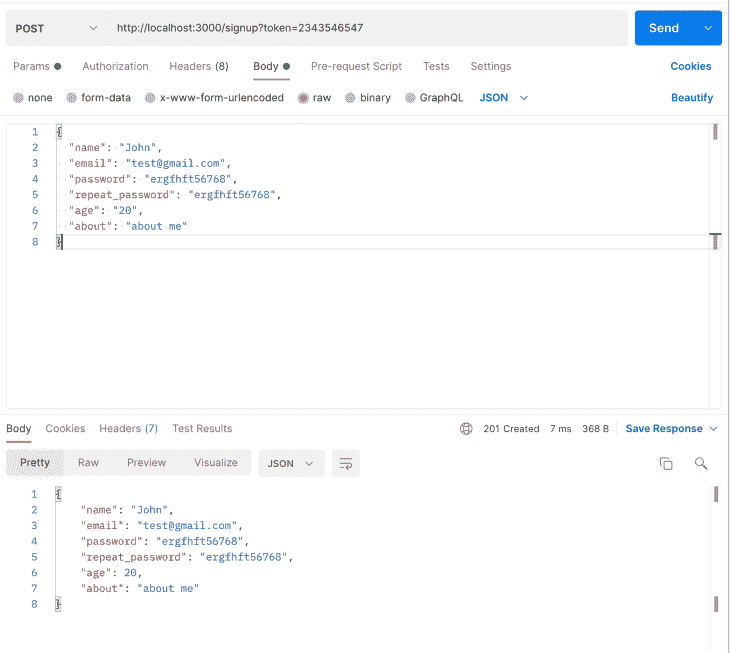

# 如何使用 Node.js - LogRocket Blog 庆祝

> 原文：<https://blog.logrocket.com/celebrate-node-js/>

假设您已经创建了一个带有登录系统的笔记应用程序，用户可以创建一个帐户并添加他们的笔记。用户需要键入他们的电子邮件和姓名才能登录。作为开发人员，您的工作是确保您从用户那里获得的数据是您正在寻找的数据，并且是正确的格式，然后将它们保存在数据库中。

出于几个原因，验证用户请求发送的用户输入非常重要:

*   有助于减少攻击面
*   防范攻击，如 [DDOS](https://en.wikipedia.org/wiki/Denial-of-service_attack) 、跨站点脚本、命令注入和 SQL 注入
*   确保数据一致性
*   帮助识别和过滤恶意数据

这种类型的验证被称为服务器端验证，它是开发应用程序的关键部分。幸运的是，有几个库可以为我们完成这项任务。

最好的两个图书馆是 joi 和 T2 庆祝馆。Joi 是 JavaScript 对象的对象模式描述语言和验证器。在本文中，我们将了解如何使用这些库以及它们为前端开发提供的好处。

本教程结束时，您将能够验证来自`req.body`的用户输入，验证`req.headers`、`req.params`、`req.query`和`req.cookies`，并处理错误。

我们将为需要用户输入并验证它的笔记应用程序演示一些 API 路线。

如果您想在本文中看到完整的项目开发，可以看看 GitHub 项目。你可以随意复制它，叉它，或者提交一个问题。

## 内容

## joi 和 professional 是什么？

Joi 是一个独立的验证模块，可以和庆功一起使用。Joi 描述了模式中的客户机请求。模式是一个 JavaScript 对象，它描述了参数、请求体和头等客户机请求必须如何格式化。它们由一种类型和一系列规则组成，带参数或不带参数。

pressure 使用这个模式来实现灵活的验证中间件。它接受一个模式并返回一个接受请求和值的函数。如果值是有效的，庆祝将调用链中的下一个中间件。如果该值无效，pressure 将调用错误处理程序中间件。

您可以在调用任何处理函数之前验证`req.params`、`req.headers`、`req.body`、`req.query`、`req.cookies`和`req.signedCookies`。我们将在本文后面详细讨论如何验证这些。

## Node.js 示例应用程序入门

首先打开您的终端并导航到您想要放置项目的目录:

```
mkdir notes && cd notes

```

通过运行以下命令创建一个新的节点项目:

```
npm init -y 

```

这将在项目的根目录下生成一个`package.json`文件。设置`package.json`时，`--yes`或`-y`标志将对所有问题回答“是”。

现在，通过运行以下命令安装所需的依赖项:

```
npm install express body-parser cookie-parser
npm install nodemon -D

```

让我们回顾一下我们已安装的软件包:

*   [Express](https://expressjs.com/) 是最流行的用于节点的 web 框架之一。它用于创建 web 服务器和 API
*   [body-parser](https://github.com/expressjs/body-parser) 是一个中间件，它解析传入请求的主体，并在`req.body`上公开结果对象
*   [cookie 解析器](https://github.com/expressjs/cookie-parser)解析传入请求的 cookie，并在`req.cookies`上公开结果对象
*   [Nodemon](https://www.npmjs.com/package/nodemon) 用于在我们修改代码时自动重启服务器。

`npm init`命令将`index.js`指定为我们应用程序的入口点。继续在项目的根目录下创建该文件:

```
touch index.js

```

接下来，打开您最喜欢的代码编辑器，为实例化 Express 和设置服务器创建样板代码:

```
const express = require("express");
const bodyParser = require("body-parser");
const app = express();

// parse application/json
app.use(bodyParser.json());

const PORT = process.env.PORT || 4001;

app.listen(PORT, () => {
  console.log(`Server is listening on port ${PORT}`);
});

```

这里，我们已经导入了 Express 和 BodyParser，并调用了 Express 函数来创建我们的服务器。服务器将监听端口 3000。

### 运行应用程序

转到您的`package.json`文件，添加一个脚本来运行我们的带有`nodemon`的服务器:

```
"scripts": {
    "start": "nodemon index.js"
  }

```

现在，我们可以通过运行`npm start`从终端运行我们的服务器。这将启动 nodemon 并观察我们代码中的变化。

### 创建路线

现在我们的应用程序正在监听请求，我们可以创建一些路由:

*   POST `/signup`用于创建新的用户帐户
*   获取`/notes`以检索笔记
*   删除`/notes/:noteId`用于删除注释

接下来，我们将看看如何通过 joi 和庆祝来验证请求数据。

## 为基于模式的验证安装 joi 和 pressure

我们可以像这样安装 joi 并通过 npm 庆祝:

```
npm install joi celebrate

```

Joi 允许您通过模式以直观、可读的方式描述数据:

```
{
  body: Joi.object().keys({
    name: Joi.string().alphanum().min(2).max(30).required(),
    email: Joi.string().required().email(),
    password: Joi.string().pattern(new RegExp('^[a-zA-Z0-9]{3,30}$')).required().min(8),
    repeat_password: Joi.ref('password'),
    age: Joi.number().integer().required().min(18),
    about: Joi.string().min(2).max(30),
  })
}

```

根据该模式，有效的`body`必须是具有以下键的对象:

*   `name`，必需的字符串，最少两个字符，最多 25 个字符(仅限字母数字字符)
*   `email`，电子邮件格式中的必需字符串
*   `password`，一个必需的字符串，至少有八个字符，应该匹配自定义的正则表达式模式
*   `repeat_password`，应该与密码匹配
*   `age`，18 或以上的整数
*   `about`，最少两个最多 50 个字符的字符串

任何超出这些限制的情况都会触发错误。

## 用庆祝验证请求正文

现在，我们可以使用庆祝库来启用 joi 验证作为中间件。导入包并将其作为中间件连接到路由:

```
const { celebrate, Joi, Segments } = require('celebrate');

app.post(
  "/signup",
  celebrate({
    [Segments.BODY]: Joi.object().keys({
      name: Joi.string().alphanum().min(2).max(30).required(),
      email: Joi.string().required().email(),
      password: Joi.string()
        .pattern(new RegExp("^[a-zA-Z0-9]{3,30}$"))
        .required()
        .min(8),
      repeat_password: Joi.ref("password"),
      age: Joi.number().integer().required().min(18),
      about: Joi.string().min(2).max(30),
    }),
  }),
  (req, res) => {
    // ...
    console.log(req.body);
    res.status(201).send(req.body);
  }
);

```

这里，我们使用庆祝来验证请求体。

pressure 接受一个对象，其中的键可以是来自`Segments`的值之一，值是一个 joi 模式。Segments 是一组命名的常量，`enum`，可用于标识请求的不同部分:

```
{
  BODY: 'body',
  QUERY: 'query',
  HEADERS: 'headers',
  PARAMS: 'params',
  COOKIES: 'cookies',
  SIGNEDCOOKIES: 'signedCookies',
}

```

## 错误处理

如果我们用与模式不匹配的主体来测试我们的端点`signup`,我们将得到以下错误:

```
<!DOCTYPE html>
<html lang="en">
<head>
  <meta charset="utf-8">
  <title>Error</title>
</head>
<body>
  <pre>Error: Validation failed<br> &nbsp; &nbsp;at /Users/hulyakarakaya/Desktop/celebrate/node_modules/celebrate/lib/celebrate.js:95:19<br> &nbsp; &nbsp;at processTicksAndRejections (node:internal/process/task_queues:96:5)</pre>
</body>
</html>

```

庆祝有一个特殊的`errors()`中间件，用于向客户端发送错误。通过实现这个中间件，我们可以发送更详细的错误消息。从庆功导入`errors`并将其传递给`app.use`方法:

```
const { errors } = require('celebrate');

// celebrate error handler
app.use(errors()); 

```

这个中间件将只处理由庆祝产生的错误。让我们看看它的实际效果吧！

## 测试端点

我们将使用 Postman 来测试我们的端点。在测试端点之前，请确保服务器正在运行。

向`/signup`路线发出 POST 请求。如果我们没有正确地重复密码，我们应该得到一个错误。

庆功返回的错误状态为`400`，响应体为:

```
{
    "statusCode": 400,
    "error": "Bad Request",
    "message": "Validation failed",
    "validation": {
        "body": {
            "source": "body",
            "keys": [
                "repeat_password"
            ],
            "message": "\"repeat_password\" must be [ref:password]"
        }
    }
}

```

或者，如果我们输入一个小于 18 岁的年龄，我们将得到一个“错误请求”错误:

```
{
    "statusCode": 400,
    "error": "Bad Request",
    "message": "Validation failed",
    "validation": {
        "body": {
            "source": "body",
            "keys": [
                "age"
            ],
            "message": "\"age\" must be greater than or equal to 18"
        }
    }
}

```

`message`字段允许客户了解他们的请求有什么问题。在这些情况下，pressure 报告重复密码不等于原始密码，并且请求正文中的年龄必须大于或等于 18 岁。

## 验证请求查询字符串

这将类似于验证请求体，但是这一次我们将使用`Segments.QUERY`作为一个键。

假设我们想在注册时在查询字符串中发送用户令牌:

```
app.post(
  "/signup",
  celebrate({
    [Segments.BODY]: Joi.object().keys({
      // validation rules for the body
    }),
    [Segments.QUERY]: {
      token: Joi.string().token().required(),
    },
  }),
  (req, res) => {
    console.log(req.query.token);
    res.status(200).send(req.query.token);
  }
);

```

当我们测试 API 端点时，我们需要向 URL 添加一个`token`查询字符串，并且它不应该为空。



如果我们没有通过`token`查询字符串，庆祝将显示一个错误消息:

```
{
    "statusCode": 400,
    "error": "Bad Request",
    "message": "Validation failed",
    "validation": {
        "query": {
            "source": "query",
            "keys": [
                "token"
            ],
            "message": "\"token\" is required"
        }
    }
}

```

除了请求体之外，pressure 还允许您验证头部和参数:

```
const { celebrate, Joi } = require('celebrate');

app.delete(
  "/notes/:noteId",
  celebrate({
    // validate parameters
    [Segments.PARAMS]: Joi.object().keys({
      noteId: Joi.string().alphanum().length(12),
    }),
    [Segments.HEADERS]: Joi.object()
      .keys({
        // validate headers
      })
      .unknown(true),
  }),
  (req, res) => {
    // ...
    res.status(204).send();
  }
);

```

在我们的例子中，我们为`/notes/:noteId`创建一个删除请求。`noteId`为参数，应为 12 位字母数字字符串。

为了验证头，我们可以使用`Segments.HEADERS`键。但是，很难知道客户端可以发送的所有头。因此，在调用了`keys()`方法之后，我们可以使用`unknown(true)`选项来允许未知的头。

如果我们试图删除一个长度小于 12 个字符(`[http://localhost:3000/notes/123456](http://localhost:3000/notes/123456)`)的注释 ID，我们将得到以下错误:

```
{
    "statusCode": 400,
    "error": "Bad Request",
    "message": "Validation failed",
    "validation": {
        "params": {
            "source": "params",
            "keys": [
                "noteId"
            ],
            "message": "\"noteId\" length must be 12 characters long"
        }
    }
}

```

## 验证 cookie 和签名的 cookie

庆祝还允许您验证 cookie 和签名的 cookie。为了读取服务器上的 cookies，我们将使用前面安装的包`cookie-parser`。让我们在`index.js`文件中把它作为中间件连接起来:

```
const cookieParser = require("cookie-parser");

const app = express();

app.use(cookieParser("secret"));

```

Cookies 可以存储在本地数据文件中。我们可以使用`res.cookie()`方法设置 cookies:

```
res.cookie("name", "john", { httpOnly: true, maxAge: 3600000});

```

第一个参数是键，第二个是值。第三个参数是一个包含 cookie 选项的对象。`httpOnly: true`表示不能从 JavaScript 中读取 cookie，而`maxAge`是 cookie 有效的时间(毫秒)。因此，cookie 将在一小时后过期。

Cookie-parser 将帮助我们从 Cookie 头中提取数据，并将结果解析为一个对象。我们现在可以使用`req.cookies`对象访问服务器上的 cookies。

现在，我们可以将我们的验证添加到`Segments.COOKIES`键:

```
app.get(
  "/notes",
  celebrate({
    // validate parameters
    [Segments.COOKIES]: Joi.object().keys({
      name: Joi.string().alphanum().min(2).max(30),
    }),
  }),
  function (req, res) {
    res.cookie("name", "john", { httpOnly: true, maxAge: 3600000 });
    console.log("Cookies: ", req.cookies);
    res.send(req.cookies.name);
  }
);

```

签名 cookie 类似于 cookie，但它们包含一个签名，以便服务器可以验证 cookie 是否被修改:

```
app.get(
  "/notes",
  celebrate({
    [Segments.SIGNEDCOOKIES]: Joi.object().keys({
      jwt: Joi.string().alphanum().length(20),
    }),
  }),
  function (req, res) {
    // signed cookie
    res.cookie("jwt", "snfsdfliuhewerewr4i4", { signed: true });
    console.log("Signed Cookies: ", req.signedCookies);
    res.send(req.signedCookies);
  }
);

```

这里，我们通过传递`signed: true`选项将`jwt`设置为一个签名 cookie，并使用`Segments.SIGNEDCOOKIES`创建了一个验证规则。现在，我们可以使用`req.signedCookies`对象访问服务器上已签名的 cookie。如果我们试图发送一个长度小于 20 个字符的`jwt` cookie，我们会得到以下错误:

```
{
    "statusCode": 400,
    "error": "Bad Request",
    "message": "Validation failed",
    "validation": {
        "signedCookies": {
            "source": "signedCookies",
            "keys": [
                "jwt"
            ],
            "message": "\"jwt\" length must be 20 characters long"
        }
    }
}

```

## 结论

在这篇文章中，我们了解了为什么需要验证用户输入，以及如何使用 joi 和 proprize 来验证用户输入、标题、查询字符串、参数、cookie 和签名 cookie。此外，我们还学习了 prairie 的错误处理能力，以及如何使用 Postman 测试我们的端点。我希望这个教程对你有所帮助，如果有任何不清楚的地方，请随时在评论中告诉我们。

## 200 只显示器出现故障，生产中网络请求缓慢

部署基于节点的 web 应用程序或网站是容易的部分。确保您的节点实例继续为您的应用程序提供资源是事情变得更加困难的地方。如果您对确保对后端或第三方服务的请求成功感兴趣，

[try LogRocket](https://lp.logrocket.com/blg/node-signup)

.

[](https://lp.logrocket.com/blg/node-signup)[https://logrocket.com/signup/](https://lp.logrocket.com/blg/node-signup)

LogRocket 就像是网络和移动应用程序的 DVR，记录下用户与你的应用程序交互时发生的一切。您可以汇总并报告有问题的网络请求，以快速了解根本原因，而不是猜测问题发生的原因。

LogRocket 检测您的应用程序以记录基线性能计时，如页面加载时间、到达第一个字节的时间、慢速网络请求，还记录 Redux、NgRx 和 Vuex 操作/状态。

[Start monitoring for free](https://lp.logrocket.com/blg/node-signup)

.