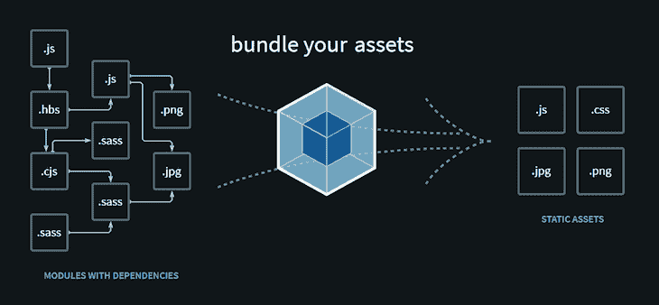

# 2021 年 webpack 的变化——log rocket 博客

> 原文：<https://blog.logrocket.com/changes-coming-to-webpack-in-2021/>

webpack 是一个 JavaScript 模块捆绑器，它可以转换 HTML、CSS、JavaScript 和 SVG 文件等 web 资源，并将它们捆绑成一个更小的文件组。

webpack 还有助于分块(分成更小的单元)和管理代码依赖关系，以确保应该首先加载的代码这样做。



webpack 如何工作【图片来源:webpack.js.org】

在这篇文章中，我们将跳转到 2021 年 webpack 中需要注意的一些新功能，但首先，我们将回顾一下 2020 年 web pack 中的新功能。

## webpack V4 到 V5:值得注意的变化

2020 年 10 月，webpack 的更新版本发布:webpack 5。此版本删除了 V4 中所有不推荐使用的项目，并修复了重大更改，以提升 webpack 体系结构，为将来的改进做准备。

版本 5 中其他有趣的特性包括:

*   长期缓存支持–默认情况下，在生产模式下会启用支持长期缓存的新算法。
*   真实内容哈希——在此之前，webpack 只使用内部结构的哈希。当使用[【content hash】](https://webpack.js.org/guides/caching/#output-filenames)时，Webpack 5 将使用文件内容的真实散列，当仅对文件进行小的更改时，这将对长期缓存产生积极影响。
*   模块联合——webpack 5 附带了一个名为“模块联合”的新特性，它允许多个 web pack 构建一起工作。见[这里](https://github.com/webpack/changelog-v5/blob/master/README.md)为完整的变更日志。

尽管 2020 年对捆绑商来说是重要的一年，但 webpack 还有更多值得期待的地方，我们将在下面的章节中讨论。请注意，这些更新会随着不断变化的 web 开发环境而变化。

## webpack 2021 路线图

### 改进的 ESM 支持

自 2015 年推出 ECMAScript 模块(ESM)以来，它已经成为高度碎片化的 JavaScript 应用程序中代码重用的标准机制。

为了改进 ESM 支持，webpack 团队计划进行一些重大更新:

自动执行的块

webpack 最吸引人的特性之一是代码分割。这个特性允许您将代码分割成多个包，您可以选择按需加载或并行加载。

目前，webpack 中动态加载的块通常充当模块的容器，它们从不直接执行模块代码。

例如，写:

```
import("./module")
```

将编译成类似于:

```
__webpack_load_chunk__("chunk-containing-module.js").then(() => __webpack_require__("./module"))
```

在大多数情况下，这是无法改变的，但是 webpack 团队正在寻找一些情况，webpack 可以生成一个直接执行所包含模块的块。这可能会减少生成的代码，并避免函数在块中包装。

#### **无害环境管理的进口和出口**

虽然已经有一个插件可以生成 ESM 导出，但 webpack 团队正在考虑添加对此功能的本机支持，当您选择将 webpack 捆绑包集成到 ESM 加载环境或内联脚本中时，这将非常有用。

该团队也在考虑在导入中使用绝对 URL。当使用将 API 作为 EcmaScript 模块提供的外部服务时，这些将非常方便。

这里有一个例子:

```
import { event } from "https://analytics.company.com/api/v1.js"
Changes to:

import("https://analytics.company.com/api/v1.js")
```

这种特性有助于在依赖外部服务时优雅地处理错误。

#### ESM 库

webpack 团队还将寻求使用 ESM 库对捆绑进行增强，并将添加一种特殊模式，该模式不应用分块，而是发出通过 ESM 导入和导出连接的已处理模块。

这意味着，当加载程序、模块图和资产优化正在运行时，将不会创建块图。相反，模块图中的每个模块将作为一个单独的文件发出。

#### 严格模式警告

webpack 团队计划尽快确保在生成 ESM 捆绑包时，所有包含的代码都将被强制进入严格模式。虽然这对于许多模块来说可能不是问题，但是有几个老的包可能有不同解释的问题，所以最好能看到它们的警告。

### 源地图性能

源映射提供了一种将压缩文件中的代码映射回其在源文件中的原始位置的方法。换句话说，它将资源的缩小版本(CSS 或 JavaScript)连接到原始创作版本。该实用程序有助于调试您的应用程序，即使您的资产已经被压缩/优化。

由于性能问题，在 webpack 中使用 SourceMap 目前相当昂贵，因此 webpack 团队将在 2021 年对此进行改进。他们还将更新/改进 [terser 插件](https://www.npmjs.com/package/terser-webpack-plugin)，这是 webpack 5 中默认的 webpack minimizer。

### 导出/导入 package.json 字段

Node.js v14 支持 package.json ***中的 exports 字段。*** 这个特性允许您直接定义包的入口点，或者有条件地定义每个环境或 JavaScript 风格(TypeScript、Elm、CoffeeScript 等)的入口点。).在后来的[版本](https://nodejs.org/api/packages.html#packages_imports)中，Node.js 也支持私有导入(类似于 package.json 中的导出字段)。

目前，webpack 5 仅支持导出特性，即使有附加条件，如指定生产/开发。私有导入的导入字段是 2021 年另一个值得关注的特性。

### 模块联盟的 HMR

热模块替换(HMR)的工作方式是在应用程序仍在运行时交换、添加或删除模块，而不需要完全重新加载。这可以通过保留在完全重新加载过程中可能会丢失的应用程序状态来大大加快开发速度。此外，当修改源代码时，它会立即更新浏览器，这很像直接在浏览器的开发工具中更改样式。

Webpack 5 附带了一个名为“模块联合”的新特性。这个特性允许您在运行时将多个构建集成在一起。目前，HMR 一次只支持一个版本，更新不能在两个版本之间冒泡。webpack 团队将致力于改进 HMR 更新，以便在不同版本之间冒泡，这将使开发联邦应用程序更加容易。

### 提示系统

为了监控错误和警告，webpack 团队正在考虑为用户添加另一个类别:hint。类似于错误和警告显示，提示显示将通知用户可能与他们相关的信息。然而，与前面的类别不同，hint 将识别优化机会或技巧，而不是问题或议题。

一个示例提示可能是类似于“您知道将 X 变更添加到文件 Y 会导致空白吗？”；或者，“使用 blank 函数来编码 blank 很容易。”

### web 程序集

根据其[官方文档](https://webassembly.org/)，WebAssembly(缩写为 Wasm)是一种“基于堆栈的虚拟机的二进制指令格式。”这意味着你可以用编程语言如 Rust、C++和 Python 来构建你的软件，并在浏览器[中以接近本地的性能](https://blog.logrocket.com/webassembly-how-and-why-559b7f96cd71/)交付给最终用户。

在 webpack 的当前版本中，WebAssembly 是实验性的，默认情况下不启用。默认支持是 webpack 团队今年将要添加的内容。

## 结论

webpack 将在 2021 年发生巨大变化，虽然这个列表可能不是一成不变的，但我们可以期待新的特性和功能，它们将使 webpack 的工作更加简单和高效。

### 有用的链接

使用 [LogRocket](https://lp.logrocket.com/blg/signup) 消除传统错误报告的干扰

[LogRocket](https://lp.logrocket.com/blg/signup) 是一个数字体验分析解决方案，它可以保护您免受数百个假阳性错误警报的影响，只针对几个真正重要的项目。LogRocket 会告诉您应用程序中实际影响用户的最具影响力的 bug 和 UX 问题。

## 然后，使用具有深层技术遥测的会话重放来确切地查看用户看到了什么以及是什么导致了问题，就像你在他们身后看一样。

[](https://lp.logrocket.com/blg/signup)

LogRocket 自动聚合客户端错误、JS 异常、前端性能指标和用户交互。然后 LogRocket 使用机器学习来告诉你哪些问题正在影响大多数用户，并提供你需要修复它的上下文。

关注重要的 bug—[今天就试试 LogRocket】。](https://lp.logrocket.com/blg/signup-issue-free)

LogRocket automatically aggregates client side errors, JS exceptions, frontend performance metrics, and user interactions. Then LogRocket uses machine learning to tell you which problems are affecting the most users and provides the context you need to fix it.

Focus on the bugs that matter — [try LogRocket today](https://lp.logrocket.com/blg/signup-issue-free).