# 使用 ApexCharts 制作图表

> 原文：<https://blog.logrocket.com/charting-react-apexcharts/>

在研究领域，与你的听众分享你的发现是至关重要的。最常见的方法之一是使用图表。

那么，如何在你的网站上呈现你的图表呢？一种方法是使用图像。在某些情况下，这完全没问题。然而，在这种情况下有一个小问题:有时，图像在高像素屏幕上呈现不好。此外，放大后会变得模糊。

为了减轻这种情况，您必须提高图形的分辨率。但这将导致另一个问题:更大的图像占用更多的内存，因此需要更长的时间来加载。我们如何摆脱这个问题？

幸运的是，这就是 ApexCharts.js 的用武之地。这是一个易于使用的开源库，允许您为自己的项目构建交互式图表。
以下是它的一些特点:

*   响应性:您的图表将根据查看设备进行缩放。这有助于为所有设备提供更好的 UI
*   注释:Apex 还允许您在图表上添加标签，从而帮助读者轻松理解图形
    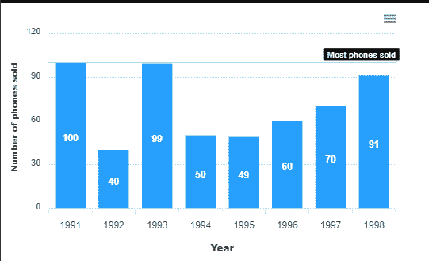
*   动画:就像注释一样，动画带来了更好的用户体验。最精彩的部分？你甚至可以定制你的动画
    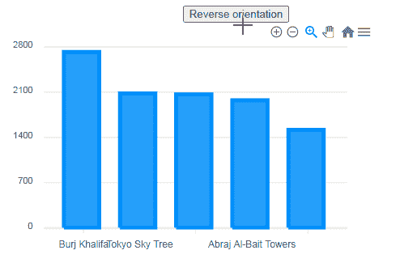的外观

## ApexCharts 入门

在具体化图表之前，我们首先需要初始化一个 React 项目:

```
npx create-react-app apex-tutorial

```

接下来，要安装所需的依赖项，请执行以下终端命令:

```
npm install apexcharts react-apexcharts

```

## 条形图

当您想要展示不同数据子组之间的数值比较时，条形图非常有用。一个显著的例子是比较多座摩天大楼的高度。

### 在 x 轴上显示整数

我们将复制来自 [Math Goodies](https://www.mathgoodies.com/lessons/graphs/line) 的样本数据:

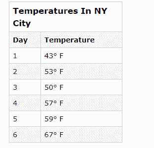

这段代码使用上面的数据呈现了一个基本的条形图:

```
export default function SampleLine() {
  const series = [
    {
      name: "Temperature in Fahrenheit", //will be displayed on the y-axis
      data: [43, 53, 50, 57]
    }
  ];
  const options = {
    chart: {
      id: "simple-bar"
    },
    xaxis: {
      categories: [1, 2, 3, 4] //will be displayed on the x-asis
    }
  };
  return (
    <div>
      <Chart options={options} type="bar" series={series} width="80%" />
    </div>
  );
}

```

如您所见，`Chart`组件接受三个重要的道具:

*   `options`属性指定了图形的配置。这里，我们已经指定了 x 轴的标签
*   属性告诉 ApexCharts 我们想要显示哪种类型的图表。在本例中，我们呈现的是一个条形图
*   属性包含了我们想要显示的数据。顶点会在 y 轴上显示这个
    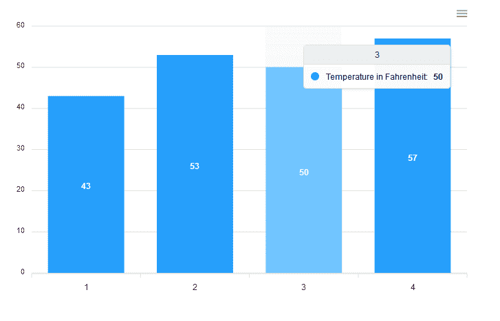

### 在 x 轴上显示字符串

对于本例，我们将从 [Statistics How 到](https://www.statisticshowto.com/probability-and-statistics/descriptive-statistics/bar-chart-bar-graph-examples/)加载该数据集:

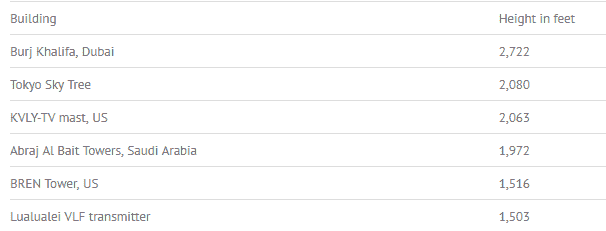

我们可以通过编写以下代码来呈现这些数据:

```
const series = [
  {
    name: "Height in feet",
    data: [2722, 2080, 2063, 1972, 1516],
  },
];
const options = {
  chart: {
    id: "simple-bar",
  },
  xaxis: {
    categories: [
      "Burj Khalifa",
      "Tokyo Sky Tree",
      "KVLY-TV mast",
      "Abraj Al-Bait Towers",
      "Bren Tower",
    ],
  },
};

return (
  <div>
    <Chart options={options} type="bar" series={series} width="80%" />
  </div>
);

```

注意，这一次，我们将一个字符串值数组传递给了`xaxis.categories`属性。不需要进一步的配置！
这将是程序的输出:

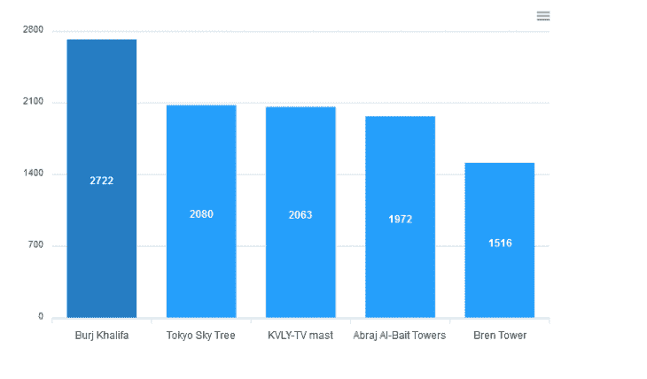

### 更改图表的方向

默认情况下，Apex 以垂直方向显示图表。您可以使用`option.plotOptions.bar.horizontal`属性水平渲染它们:

```
const options = {
  plotOptions: {
    bar: {
      horizontal: true, //horizontal bar chart
    },
  },
  //extra code removed for brevity
};

return (
  <div>
    <Chart options={options} type="bar" series={series} width="80%" />
  </div>
);

```

在上面的代码片段中，我们将`horizontal`属性设置为`true`。这将翻转图表的方向。

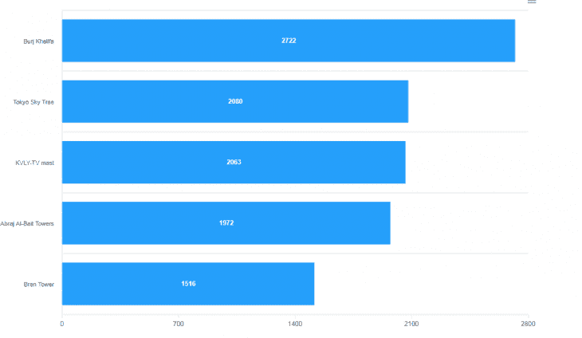

## 饼图和圆环图

饼图允许您以百分比或比率的形式显示数据。

为了演示饼图，我们将使用来自 [Math Is Fun](https://www.mathsisfun.com/data/pie-charts.html) 的数据集:


就像条形图一样，构建饼图很容易。为此，您需要传入您的数据并将`type`属性分配给`pie`，如下所示:

```
const options = { labels: ["Comedy", "Action", "Romance", "Drama", "SciFi"] };
const series = [4, 5, 6, 1, 5]; //our data

return (
  <div className="donut">
    <Chart options={options} series={series} type="pie" width="380" />
  </div>
);

```

这里，`options.label`属性包含一个数组。该数组中的每个元素对应于图表中的一个部分。后来，我们把`type`道具改成了`pie`。这将告诉 Apex 呈现一个饼图。

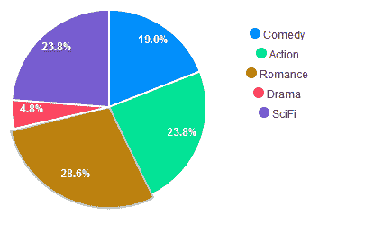

要将它变成圆环图，请将`type`的值修改为`donut`:

```
<Chart options={options} series={series} type="donut" width="380" />

```

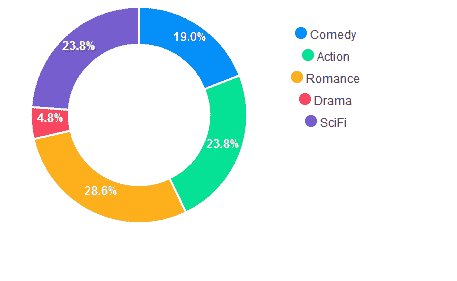

## 折线图

当您想要描绘与时间相关的趋势或行为时，这种类型的图表很常见。例如，我们将使用来自[图表](https://chartio.com/learn/charts/line-chart-complete-guide/)的表格:

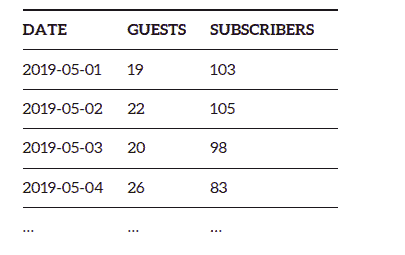

### 呈现单个值

要开始使用折线图，让我们只显示`Guests`列。在下一节中，我们将在同一个图形中显示`Guests`和`Subscribers`。
下面的代码呈现来自`Guests`数组的信息:

```
const series = [
    {
      name: "Guests",
      data: [19, 22, 20, 26]
    }
  ];
  const options = {
    xaxis: {
      categories: ["2019-05-01", "2019-05-02", "2019-05-03", "2019-05-04"]
    }
  };
  return <Chart type="line" series={series} options={options} />;

```

在这段代码中，我们呈现了`Guests`字段。此外，我们还在 x 轴上使用了日期值。Apex 将自动解析这些值，并将它们显示为时间线。

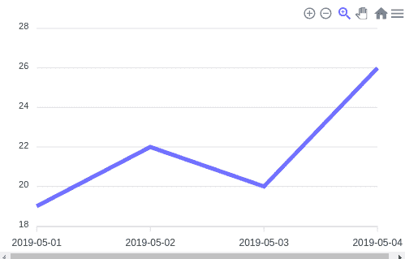

### 呈现多个值

Apex 库还允许用户在同一图表中绘制多个数据集。

这里，我们这次将同时呈现`Guests`和`Subscribers`数据。

要在工作表中添加更多数据，将另一个对象追加到`series`数组中，如下所示:

```
const series = [
  {
    name: "Guests",
    data: [19, 22, 20, 26],
  },
  //additional data in this array..
  {
    name: "Subs",
    data: [103, 105, 98, 83],
  },
];

```

这将是结果:

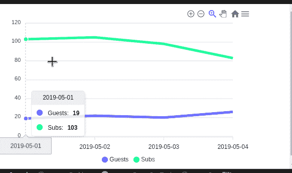

### 组合图表

在某些情况下，在一个图中显示多种图表类型是很常见的。一个这样的例子可以是将条形图和折线图结合在一起。
要在 Apex 图表中做到这一点，您可以在`series`数组中指定`type`属性，如下所示:

```
const series = [
  {
    type: "line", //render a line chart for this data
    name: "Guests",
    data: [19, 22, 20, 26],
  },
  {
    type: "column", //use column chart here.
    name: "Subscribers",
    data: [103, 105, 98, 83],
  },
];
return (
  <div>
    <Chart options={options} type="line" series={series} width="80%" />
  </div>
);

```

这里，我们在线图中呈现`Guests`数据。后来，我们告诉 React 用一个条形图(`column`)来表示`Subscribers`数据集。

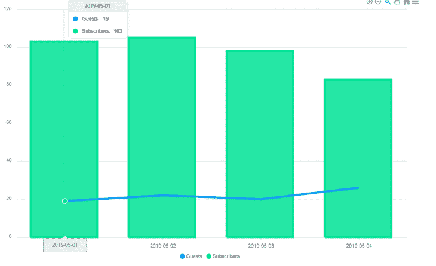

### 笔画定制

Apex 甚至为开发人员提供了定制生产线外观的选项。

要选择更平滑的线条，请将`options.stroke.curve`属性更改为`smooth`:

```
const guestOption = {
  stroke: {
    curve: "smooth",
  },
  //..
};
return (
  <div>
    <Chart type="line" series={guestSeries} options={guestOption} width={500} />
  </div>
);

```

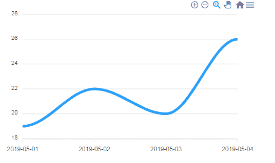

如果想使用阶梯曲线，将`curve`选项改为`stepline`:

```
const guestOption = {
  stroke: {
    curve: "stepline",
  },
//further code...

```

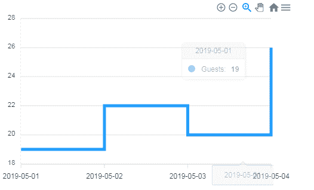

## 径向图表

放射状图表适合于显示进度。一个示例显示了文件下载的进度:

```
const series = [70]; //70 percent
const options = {
  labels: ["Progress"], //label of this diagram
};
return <Chart type="radialBar" series={series} options={options} />;

```

这一次，我们将`type`属性设置为`radialBar`。这将在页面上显示一个圆形仪表。


### 创建加载器栏

为了展示 radial bar 的功能，我们将使用 ApexCharts 构建一个简单的加载栏:

```
const [progress, setProgress] = useState(0);
let interval = useRef(null);

useEffect(() => {
  interval.current = setInterval(() => {
    setProgress((old) => old + 50);
  }, 1000);
  return () => {
    clearInterval(interval.current);
  };
}, []);

useEffect(() => {
  if (progress < 100) return;
  clearInterval(interval.current);
}, [progress]);

const series = [progress]; //70 percent
return <Chart type="radialBar" series={series} options={options} width={500} />;

```

下面是这段代码的解释:

*   这里，我们使用了一个`interval`钩子。这是`useRef`的一个实例，负责在应用程序的整个生命周期中控制我们的时间间隔
*   此外，当组件挂载到 UI 时，我们告诉 React 运行一个`setInterval`方法。这将使`progress`的值增加`50`个单位
*   每次`progress`钩子变化，app 都会检查其值是否超过`100`。如果满足这个条件，React 将从内存中删除间隔。因此，程序停止增加`progress`
    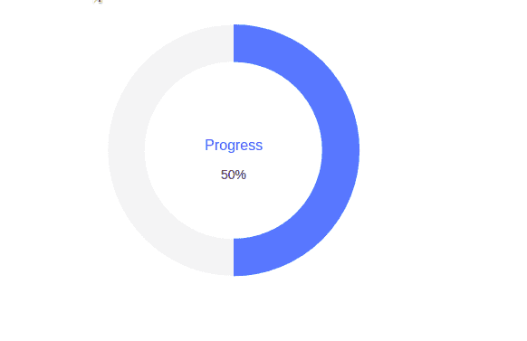的值

## 同步图表

如果您有多个具有相同 x 轴值的图表，通过同步图表来可视化它们可能会很好。

### 标准

在您的应用程序中使用同步图表是一个轻松的过程，但您必须确保您的代码满足以下条件:

*   所有图表的`xaxis.categories`都是相同的
*   `chart.group`选项应该是相同的。否则，Apex 不会同步您的图表
*   尺寸(`width`和`height`属性)也应该相似
*   `options.id`对于每个图形应该是不同的。这允许库识别每个图形并将其呈现到屏幕上

### 简单用法

下面的代码片段将显示`guests`和`subscribers`图，并将它们同步在一起:

```
//create series and options for our 'guests' data
const guestSeries = [
  {
    name: "Guests",
    data: [19, 22, 20, 26],
  },
];
const guestOption = {
  chart: {
    id: "guest",
    group: "social",
  },
  xaxis: {
    categories: ["2019-05-01", "2019-05-02", "2019-05-03", "2019-05-04"],
  },
};
//create series and options for our 'subscribers' data
const subSeries = [
  {
    name: "Subs",
    data: [103, 105, 98, 83],
  },
];
const subOptions = {
  chart: {
    id: "Subs",
    group: "social", //group name same as guestOptions
  },
  xaxis: {
    categories: ["2019-05-01", "2019-05-02", "2019-05-03", "2019-05-04"],
  },
};
return (
  <div>
    <Chart type="line" series={subSeries} options={subOptions} width={500} />
    <Chart type="line" series={guestSeries} options={guestOption} width={500} />
  </div>
);

```

在这段代码中，我们为每个数据集创建了一个`series`和一个`options`对象。同样重要的是要注意我们的`group`属性和每个集合的 x 轴值是相同的。这允许 Apex 呈现图表并将它们配对在一起以构建同步图表。

这将是输出:

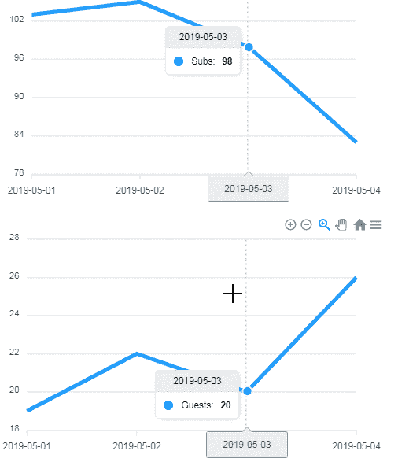

## 动画片

如前所述，Apex 允许开发人员修改图形动画以满足他们的需求。在这一节中，我们将介绍一些允许控制动画的重要属性。

### 禁用所有动画

要完全删除动画，请将`options.chart.animations.enabled`属性分配给`false`:

```
const guestOption = {
  chart: {
    animations: {
      enabled: false, //no animations
    },
  },
  //unnecessary code redacted..
};

return (
  <div>
    <Chart options={guestOption} series={series} type="line" />
  </div>
);

```

上面的代码告诉 React 渲染图表并移除动画。

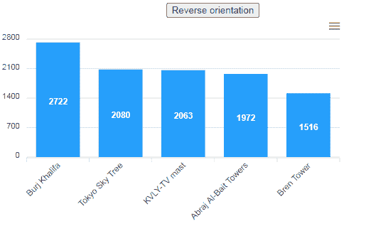

### 改变速度

您可以通过`speed`属性加快或减慢动画的速度。默认值为`800`。
在下面的代码中，我们正在加速我们的动画:

```
const options = {
  chart: {
    id: "simple-bar",
    animations: {
      speed: 100, //make the transition faster
    },
//further code..

```


要使动画变慢，增加`speed`的值，如下所示:

```
const options = {
  chart: {
    id: "simple-bar",
    animations: {
      speed: 1900, //make the transition slower
    },
//further code..

```


## 结论

你可以在这个 [CodeSandbox](https://codesandbox.io/s/apex-chart-3u86q?file=/src/App.js) 中找到这个程序的源代码。

在本指南中，我们讨论了一些重要的图表和概念，以帮助您开始使用 Apex [图表库](https://blog.logrocket.com/top-javascript-data-visualization-libraries-2021/)。如果你想在你的网络应用中渲染图表，那么 Apex 图表将是你的最佳选择。呈现图表所需的代码行最少，因此减少了样板代码。

非常感谢您的阅读！

## 使用 LogRocket 消除传统反应错误报告的噪音

[LogRocket](https://lp.logrocket.com/blg/react-signup-issue-free)

是一款 React analytics 解决方案，可保护您免受数百个误报错误警报的影响，只针对少数真正重要的项目。LogRocket 告诉您 React 应用程序中实际影响用户的最具影响力的 bug 和 UX 问题。

[ ](https://lp.logrocket.com/blg/react-signup-general) [  ](https://lp.logrocket.com/blg/react-signup-general) [LogRocket](https://lp.logrocket.com/blg/react-signup-issue-free)

自动聚合客户端错误、反应错误边界、还原状态、缓慢的组件加载时间、JS 异常、前端性能指标和用户交互。然后，LogRocket 使用机器学习来通知您影响大多数用户的最具影响力的问题，并提供您修复它所需的上下文。

关注重要的 React bug—[今天就试试 LogRocket】。](https://lp.logrocket.com/blg/react-signup-issue-free)